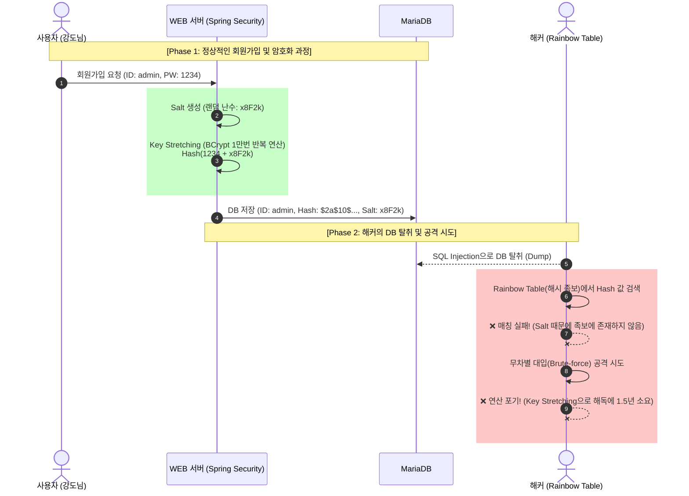

# 🔐 [Masterpiece] 인증 아키텍처: 해싱, 솔팅, 그리고 키 스트레칭

> [!note] 노트 역할
> 이 노트는 암호화 전체 개론이 아니라, 비밀번호 저장 보안에서 해시, 솔트, 키 스트레칭이 어떻게 쓰이는지 정리한 응용 노트다.
> 강의자료 기반의 기초 개념은 [[암호화 기초]]와 [[해시와 인증]]에서 다룬다.

> [!danger] 🚨 아키텍트의 절대 원칙: "비밀번호를 지킨다는 것은 '해커가 못 보게 가리는 것'이 아니다. '해커가 비밀번호를 푸는 데 드는 전기세(비용)가, 털어가는 데이터의 가치보다 비싸게 만드는 경제학적 방어'다."

---

## 🔬 1. 근본적 오개념: 암호화(Encryption) vs 해싱(Hashing)

초보자들은 "비밀번호를 암호화해서 저장한다"고 말하지만, 이는 치명적인 용어 오류다. 비밀번호는 복호화(해독)할 수 있는 '암호화'를 쓰면 안 된다. 수학적으로 절대 되돌릴 수 없는 **'단방향 해시(One-way Hash)'**를 써야 한다.

- **암호화 (Two-way):** `1234` ➡️ `ABCD` ➡️ (복호화 키 입력) ➡️ `1234`
  - **치명적 결함:** 서버 어딘가에 '복호화 키'가 존재해야 한다. 해커가 서버를 통째로 털면 키도 같이 털리므로 비밀번호가 평문으로 복원된다. (비밀번호 저장용으로 절대 금지)
- **해싱 (One-way):** `1234` ➡️ `SHA-256 엔진` ➡️ `03ac674216f3e15c...`
  - **아키텍처:** 고기를 갈아서 소시지를 만들 수는 있지만, 소시지를 다시 조립해서 소를 만들 수는 없는 원리다. (역산 불가)
  - **검증 원리:** 서버 관리자조차 원본 비밀번호를 모른다. 유저가 로그인할 때 `1234`를 입력하면, 서버는 똑같은 해시 함수에 넣고 돌려본 뒤 DB에 저장된 해시값(`03ac...`)과 일치하는지만 확인하고 문을 열어준다.

---

## 💀 2. 해커의 공격 벡터: 레인보우 테이블 (Rainbow Table)

해시값을 역산할 수 없다는 것을 아는 해커는, 케르크호프스의 원리(알고리즘은 이미 공개되어 있다)를 역이용하여 공격을 준비한다.

- **해커의 딜레마:** `0000`부터 `9999`까지 직접 해시 함수에 넣어보고 결과값을 비교하는 무차별 대입(Brute-force)은 시간이 너무 오래 걸린다.
- **레인보우 테이블 (Time-Memory Trade-Off):** 그래서 해커는 전 세계의 모든 흔한 비밀번호와 그에 대응하는 해시값을 미리 계산해서 **'거대한 엑셀 족보(수 TB 용량)'**로 만들어둔다. DB를 털어온 뒤, 이 족보에서 `Ctrl+F`로 검색만 하면 0.1초 만에 원본 비밀번호가 튀어나온다.

---

## 🛡️ 3. DevSecOps의 궁극의 방어막: 공간과 시간의 통제

해커의 족보(Rainbow Table)를 무용지물로 만드는 현대 암호학의 2가지 핵심 무기다. (Spring Security의 `BCryptPasswordEncoder`가 이를 자동으로 수행한다.)

### [방어 1] 공간 복잡도 방어: 솔팅 (Salting)
- **원리:** 유저가 `1234`를 입력하면, 서버가 랜덤한 난수(Salt, 예: `x8F2k`)를 생성해 비밀번호에 몰래 이어 붙인다. ➡️ `1234x8F2k`
- **방어 효과:** 해커의 족보에는 `1234`의 해시값은 있어도, `1234x8F2k`의 해시값은 존재하지 않는다. 유저 100만 명의 Salt 값이 모두 다르기 때문에, 해커는 100만 명 분의 족보를 처음부터 다시 계산해야 한다. **(해커의 하드디스크 용량(Space)을 물리적으로 터뜨리는 방어막)**

### [방어 2] 시간 복잡도 방어: 키 스트레칭 (Key Stretching / Work Factor)
- **원리:** 해시 함수를 1번만 돌리는 게 아니라, **10,000번 ~ 100,000번 반복해서 돌린다.**
- **방어 효과:** 정상 유저가 로그인할 때 서버가 해시를 1만 번 돌리는 데 걸리는 시간은 약 **0.2초**다. (유저는 불편함을 못 느낌). 
- **해커의 절망:** 하지만 해커가 1억 개의 비밀번호를 무차별 대입하려면? `1억 번 * 0.2초 = 231일`이 걸린다. 해커의 GPU(그래픽 카드)가 물리적으로 불타버리거나, 전기세가 털어낸 데이터 가치보다 더 많이 나오게 만들어 **해킹을 경제적으로 포기하게 만든다.**
