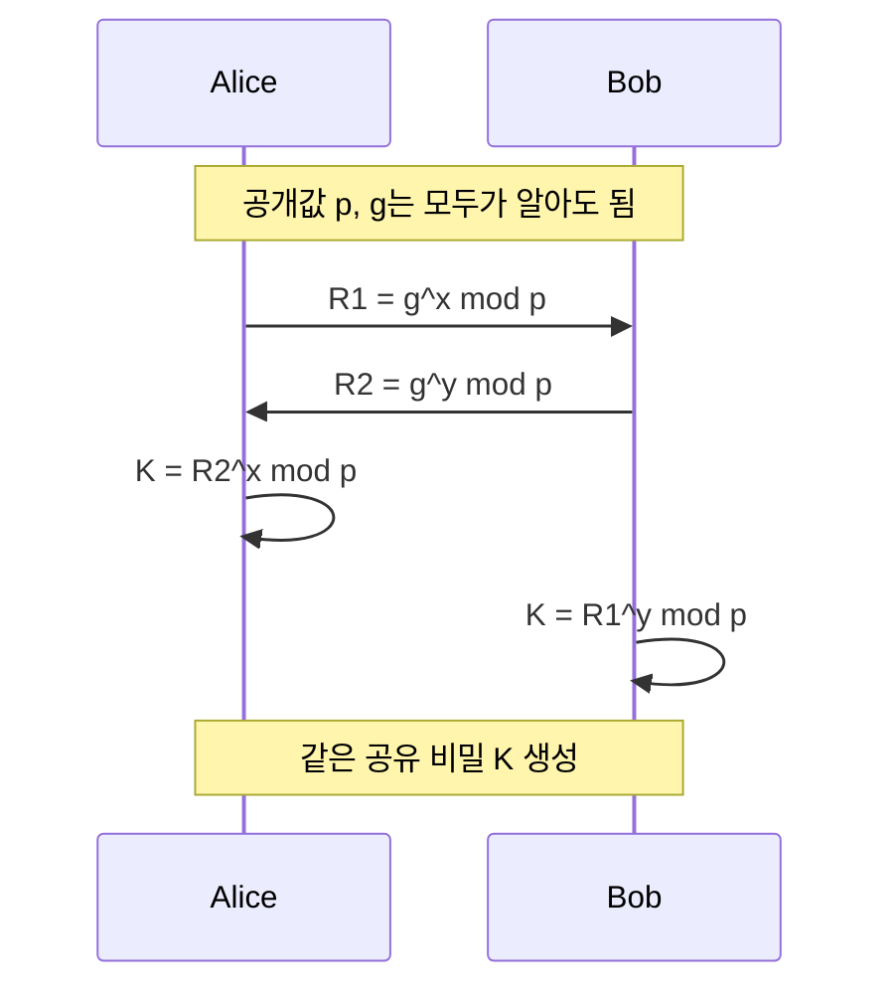

# 키 분배와 Diffie-Hellman

## 한 줄 요약

키 분배는 통신 당사자가 안전하게 같은 비밀을 공유하는 문제이고, Diffie-Hellman은 공개 채널 위에서도 공유 비밀을 합의할 수 있게 하는 대표적인 방법이다.

---

## 왜 키 분배가 문제인가

대칭키 암호는 빠르지만, 같은 키를 송신자와 수신자가 모두 가져야 한다.

문제는 이 키를 처음에 어떻게 안전하게 전달하느냐이다.
![[Pasted image 20260518170652.png]]

```text
대칭키를 먼저 보내야 통신을 암호화할 수 있음
하지만 키를 평문으로 보내면 중간에서 탈취될 수 있음
```

따라서 실제 보안 프로토콜은 **키를 안전하게 합의하거나 분배하는 절차**를 따로 둔다.

---

## IKE

`IKE`, Internet Key Exchange는 장비 간 보안 통신을 위해 암호 키와 보안 정책을 협상하는 프로토콜이다.

강의자료는 `IPsec`에서 IKE가 다음 흐름을 담당한다고 설명한다.

```text
1단계: IKE SA 협상
2단계: IPsec SA 설정 및 세션 키 생성
```

여기서 `SA`, Security Association은 통신에 사용할 보안 정책과 매개변수 묶음으로 이해하면 된다.

---

## Diffie-Hellman

`Diffie-Hellman`은 양쪽이 같은 비밀 값을 공유하도록 돕는 키 교환 방식이다.

핵심은 다음과 같다.

- `p`, `g` 같은 공개 값은 노출되어도 된다.
- 각자만 아는 비밀 값은 네트워크로 보내지 않는다.
- 공개 채널로 일부 계산 결과를 주고받아도, 최종적으로 양쪽은 같은 공유 비밀을 만든다.



---

## 강의자료 예시

강의자료는 다음 예시를 사용한다.

```text
p = 23
g = 5

Alice:
x = 6
R1 = 5^6 mod 23 = 8

Bob:
y = 15
R2 = 5^15 mod 23 = 19

Alice:
K = 19^6 mod 23 = 2

Bob:
K = 8^15 mod 23 = 2
```

결과적으로 Alice와 Bob은 같은 비밀 값 `K = 2`를 공유한다.

중요한 점은 `x`, `y` 같은 개인 비밀 값은 직접 전송하지 않는다는 것이다.

---

## SSH와의 연결

`SSH`에서도 `Diffie-Hellman`은 중요한 역할을 한다.

다만 SSH에서 만드는 Shared Secret은 그대로 통신용 키 하나로 쓰이는 것이 아니라, 이후 `KDF`에 들어가 실제 세션에 필요한 여러 키로 파생된다.

```text
Diffie-Hellman
→ Shared Secret 생성
→ KDF 입력
→ 실제 통신용 세션 키들 파생
```

즉, SSH는 세션 키를 네트워크로 직접 보내는 방식이 아니라, 양쪽이 같은 비밀을 만든 뒤 그 값을 바탕으로 필요한 키를 각각 계산하는 구조다.

자세한 SSH 흐름은 [[SSH 보안 구조]]에서 이어서 본다.

---

## 확인 질문

1. 대칭키 암호에서 왜 키 분배 문제가 생기는가?
2. IKE는 IPsec에서 어떤 역할을 하는가?
3. Diffie-Hellman에서 공개되는 값과 공개되지 않는 값은 무엇인가?
4. Alice와 Bob이 다른 비밀 값을 골라도 같은 공유 비밀을 만들 수 있는 이유는 무엇인가?
5. SSH에서 Shared Secret과 실제 세션 키는 어떤 관계인가?

---

## 관련 노트

- [[암호화 기초]]
- [[해시와 인증]]
- [[SSH 보안 구조]]
- [[SSH Downgrade Attack]]
