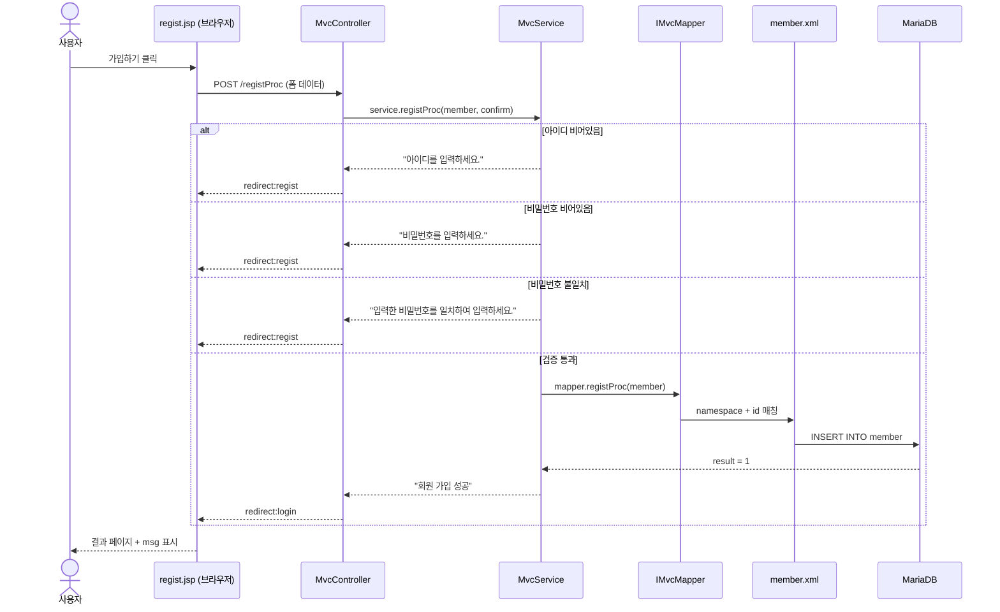
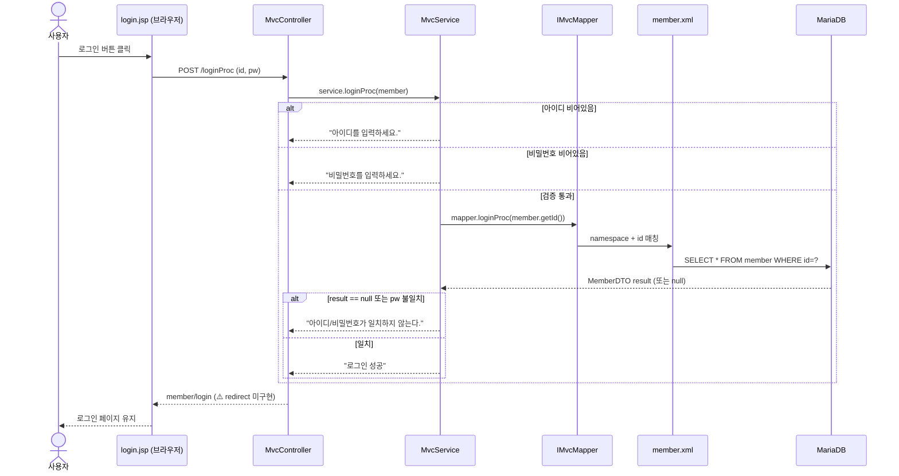
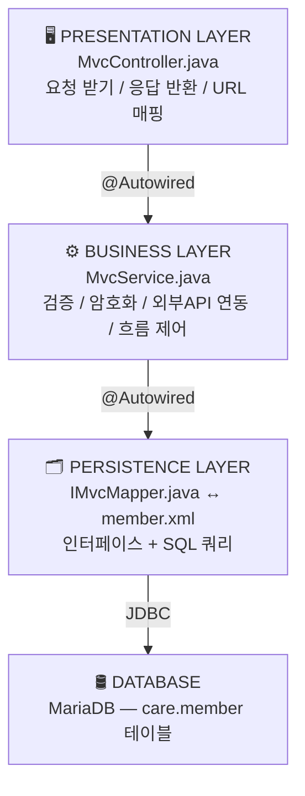
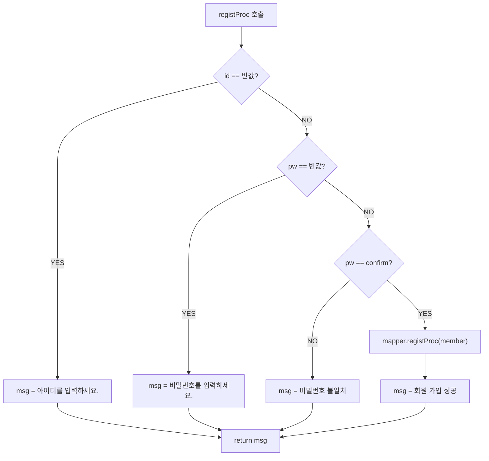
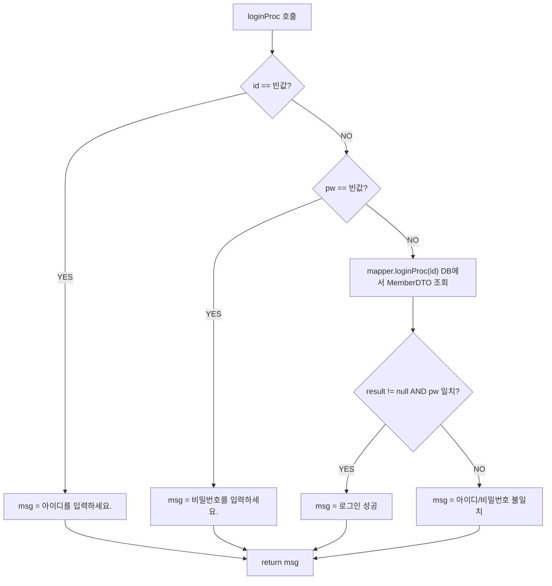
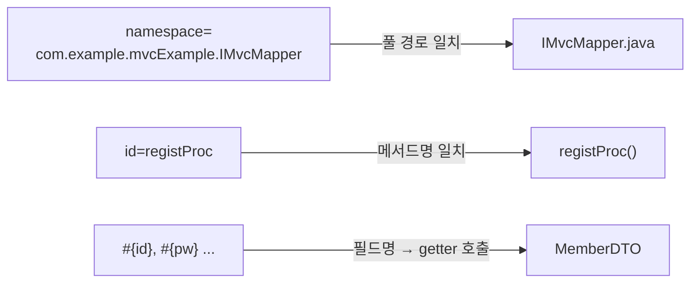
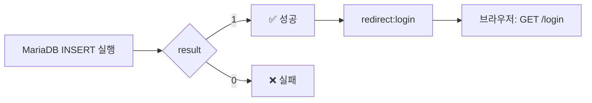
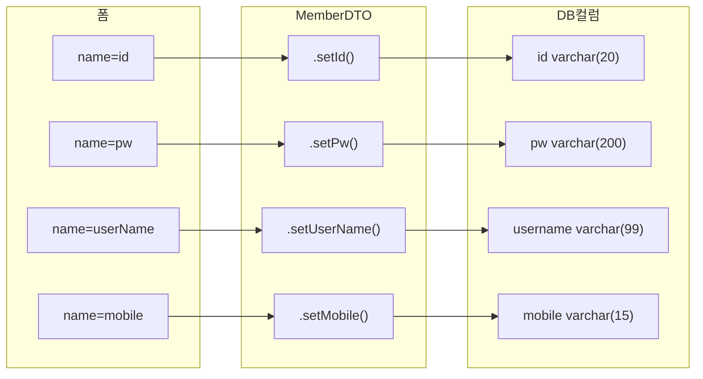

# Spring MVC + MyBatis — 회원가입 + 로그인 데이터 흐름 v3

> 📅 작성일: 2026-04-20 🔄 업데이트: 2026-04-20 — 로그인(loginProc) 흐름 전체 추가, IMvcMapper 메서드 추가 🏷️ 태그: #Spring #MVC #MyBatis #Java #흐름정리 📚 출처: Spring Boot 공식 문서, MyBatis 공식 문서 (mybatis.org) — 2024 기준

---

## 1. 전체 흐름 한눈에 보기

### 회원가입 흐름



### 로그인 흐름 (v3 신규)



---

## 2. 계층 구조 (MVC 패턴)



---

## 3. 단계별 상세 설명

### STEP 1 — 브라우저 → Controller

사용자가 `regist.jsp`에서 **[가입하기]** 클릭 → `<form method="post" action="registProc">` 실행 → HTTP POST 요청이 Body에 폼 데이터를 담아 전송

```
HTTP POST /registProc
Body: id=user77&pw=1234&confirm=1234&userName=유저&...
```

**Controller에서 받는 방식:**

```java
@PostMapping("registProc")
public String registProc(MemberDTO member, String confirm) {
    // ↑ Spring이 폼의 name 속성 ↔ MemberDTO 필드명 자동 매칭
    // ↑ confirm은 MemberDTO에 없어서 String으로 따로 받음
}
```

> 💡 **자동 바인딩 원리** Spring이 `@ModelAttribute`(생략 가능)를 통해 폼의 `name="id"` → `MemberDTO.setId()` 자동 호출

---

### STEP 2 — Controller → Service

**registProc (회원가입):**

```java
@PostMapping("registProc")
public String registProc(MemberDTO member, String confirm, RedirectAttributes ra) {
    String msg = service.registProc(member, confirm); // ← String 반환
    ra.addFlashAttribute("msg", msg);                 // ← msg를 다음 페이지로 1회 전달
    if (msg.equals("회원 가입 성공"))
        return "redirect:login";   // ✅ 성공 시 로그인 페이지
    else
        return "redirect:regist";  // ❌ 실패 시 가입 페이지로 복귀
}
```

**loginProc (로그인) — v3 신규:**

```java
@PostMapping("loginProc")
public String loginProc(MemberDTO member) {
    System.out.println("로그인 프로세스");
    String msg = service.loginProc(member);
    System.out.println("msg: " + msg);
    return "member/login"; // ⚠️ redirect 처리 미구현 — 성공/실패 분기 없음
}
```

|키워드|동작|URL 변화|
|---|---|---|
|`forward:login`|서버 내부에서 이동|`/registProc` 그대로 유지|
|`redirect:login`|브라우저에게 새 GET 요청 명령|`/login` 으로 변경 ✅|
|`redirect:regist`|검증 실패 시 가입 폼으로 복귀|`/regist` 로 변경|

> 💡 **RedirectAttributes란?** `redirect:` 이후 다음 페이지로 데이터를 **1회성**으로 전달하는 방법. `addFlashAttribute("msg", msg)` → 다음 요청에서 `${msg}`로 꺼내 쓸 수 있음. 새로고침하면 사라짐 (1회용). `registProc`에는 적용됐지만 `loginProc`엔 아직 없음.

> ⚠️ **loginProc 미구현 사항** 현재 loginProc는 msg 결과와 무관하게 항상 `member/login`으로 이동함. 성공/실패에 따라 redirect 분기 처리가 필요함.
> 
> ```java
> // 앞으로 추가해야 할 구조
> ra.addFlashAttribute("msg", msg);
> if (msg.equals("로그인 성공"))
>     return "redirect:main";
> else
>     return "redirect:login";
> ```

> ⚠️ **redirect를 쓰는 이유** forward 쓰면 새로고침 시 POST 요청이 **재전송**됨 → 중복 가입 위험. redirect는 새로고침해도 GET 재요청만 일어남 → 안전.

---

### STEP 3 — Service 역할

**registProc (회원가입):**

```java
public String registProc(MemberDTO member, String confirm) {
    String msg = "";
    if (member.getId() == "") {                           // ① 아이디 빈값 체크
        msg = "아이디를 입력하세요.";
    } else if (member.getPw() == "") {                    // ② 비밀번호 빈값 체크
        msg = "비밀번호를 입력하세요.";
    } else if (member.getPw().equals(confirm) == false) { // ③ 비밀번호 일치 체크
        msg = "입력한 비밀번호를 일치하여 입력하세요.";
    } else {                                              // ④ 검증 통과 → DB 저장
        int result = mapper.registProc(member);
        msg = "회원 가입 성공";
    }
    return msg;
}
```



**loginProc (로그인) — v3 신규:**

```java
public String loginProc(MemberDTO member) {
    MemberDTO result;
    String msg;
    if (member.getId() == "") {                                // ① 아이디 빈값 체크
        msg = "아이디를 입력하세요.";
    } else if (member.getPw() == "") {                         // ② 비밀번호 빈값 체크
        msg = "비밀번호를 입력하세요.";
    } else {
        result = mapper.loginProc(member.getId());             // ③ id로 DB 조회
        if (result != null && result.getPw().equals(member.getPw())) { // ④ null 체크 + pw 비교
            msg = "로그인 성공";
        } else {
            msg = "아이디/비밀번호가 일치하지 않는다.";
        }
    }
    return msg;
}
```



> 💡 **loginProc에서 null 체크를 먼저 하는 이유** `result`가 null인데 `result.getPw()`를 바로 호출하면 **NullPointerException**이 터짐. 그래서 `result != null && result.getPw().equals(...)` 순서로 체크하는 거야. `&&` 연산자는 앞이 false면 뒤를 아예 실행하지 않으므로 안전하게 처리됨.

> ⚠️ **버그 주의 — `==` vs `.equals()`**
> 
> ```java
> // ❌ 현재 코드 — registProc, loginProc 둘 다 해당
> if (member.getId() == "")
> 
> // ✅ 올바른 방법
> if (member.getId() == null || member.getId().isEmpty())
> ```
> 
> Java에서 `==`는 **메모리 주소(참조값)** 비교. String 내용 비교는 반드시 `.equals()` 또는 `.isEmpty()` 사용할 것.

|Service 역할|registProc|loginProc|
|---|---|---|
|빈값 검증|✅|✅|
|비밀번호 일치 검증|✅|-|
|DB 조회 후 pw 비교|-|✅|
|비밀번호 암호화|❌ 미구현|❌ 미구현|
|중복 ID 체크|❌ 미구현|-|
|세션 처리|-|❌ 미구현|

---

### STEP 4 — Mapper Interface (IMvcMapper)

```java
@Mapper
public interface IMvcMapper {
    public int registProc(MemberDTO member);
    // 반환 int → 영향받은 행 수 (성공 시 1)

    public MemberDTO loginProc(String id);
    // 반환 MemberDTO → DB에서 해당 id의 회원 정보 전체를 꺼내옴
    // 없으면 null 반환
}
```

> 💡 **registProc vs loginProc 반환 타입 차이** `registProc`는 INSERT 결과니까 성공/실패를 숫자 `int`로 받으면 충분해. `loginProc`는 DB에서 회원 정보를 **통째로 꺼내야** 비밀번호 비교가 가능하므로 `MemberDTO`를 반환해. 해당 id가 없으면 MyBatis가 자동으로 `null`을 반환함.

> 💡 **파일명 앞 `I` 의 의미** Java 네이밍 컨벤션: `I` = Interface 임을 명시 강제 규칙은 아니지만 팀 협업 시 가독성을 위해 사용

> 💡 **`{}` 구현부가 없는 이유** MyBatis가 `member.xml`을 읽고 **런타임에 자동으로 구현체를 생성**해서 주입해줌 개발자는 SQL만 XML에 작성하면 됨

---

### STEP 5 — member.xml → DB

```xml
<mapper namespace="com.example.mvcExample.IMvcMapper">
    <insert id="registProc">
        INSERT INTO member VALUES(
            #{id}, #{pw}, #{userName}, #{postCode},
            #{address}, #{detailAddress}, #{mobile}
        )
    </insert>
</mapper>
```

**3가지 매칭 포인트:**



**application.properties — XML 위치 등록:**

```properties
mybatis.mapper-locations=/mappers/*.xml
# /mappers/ 폴더 안의 모든 .xml 파일을 Mapper로 인식
```

---

### STEP 6 — DB 처리 후 반환



---

## 4. 파일별 역할 요약표

|파일|계층|핵심 역할|
|---|---|---|
|`regist.jsp`|View|사용자 입력 폼 표시|
|`MvcController.java`|Controller|URL 매핑, 요청/응답 처리|
|`MvcService.java`|Service|비즈니스 로직 (검증, 암호화 등)|
|`IMvcMapper.java`|Mapper|DB 작업 인터페이스 정의|
|`member.xml`|SQL|실제 SQL 쿼리 작성|
|`MemberDTO.java`|DTO|데이터 전달 객체 (setter/getter)|
|`application.properties`|설정|DB 연결, 경로 설정|

---

## 5. DTO가 데이터를 나르는 방식



> 💡 **DTO(Data Transfer Object)란?** 계층 간 데이터를 담아 나르는 단순한 그릇 로직 없이 setter/getter만 존재 `alt + shift + s` → Eclipse에서 자동 생성 가능

---

## 6. ⚠️ 현재 코드 보완 필요 사항

|위치|문제|해결 방향|
|---|---|---|
|`MvcService` (둘 다)|`== ""` 로 String 비교|`== null \| .isEmpty()` 로 변경|
|`MvcService`|비번 평문 저장/비교|`BCryptPasswordEncoder` 적용|
|`MvcService`|중복 ID 체크 없음|DB 조회 후 존재 여부 확인 로직 추가|
|`MvcController`|loginProc 성공/실패 분기 없음|msg 기반 redirect 처리 추가|
|`MvcController`|loginProc RedirectAttributes 없음|`ra.addFlashAttribute("msg", msg)` 추가|
|`MvcService`|로그인 성공 시 세션 처리 없음|`HttpSession`으로 사용자 정보 저장 필요|
|`member.xml`|INSERT 컬럼명 미지정|컬럼명 명시 (순서 변경 대비)|
|`application.properties`|파일명 `propertise` 오타|실제 파일명 확인 필요|

**member.xml 권장 형태:**

```xml
INSERT INTO member (id, pw, username, postcode, address, detailaddress, mobile)
VALUES (#{id}, #{pw}, #{userName}, #{postCode}, #{address}, #{detailAddress}, #{mobile})
```

**String 비교 수정:**

```java
// ❌ 현재
if (member.getId() == "")

// ✅ 수정
if (member.getId() == null || member.getId().isEmpty())
```

---

## 7. 핵심 어노테이션 정리

| 어노테이션          | 위치                  | 역할                     |
| -------------- | ------------------- | ---------------------- |
| `@Controller`  | MvcController       | Spring MVC 컨트롤러 등록     |
| `@Service`     | MvcService          | 비즈니스 로직 Bean 등록        |
| `@Mapper`      | IMvcMapper          | MyBatis Mapper Bean 등록 |
| `@Autowired`   | Controller, Service | 의존성 자동 주입 (DI)         |
| `@GetMapping`  | Controller 메서드      | GET 요청 매핑              |
| `@PostMapping` | Controller 메서드      | POST 요청 매핑             |

# ⚖️ [Code Review] 강도님 vs 강사님: 아키텍처 전격 비교

> [!danger] 🚨 아키텍트의 팩트 폭격: "코드가 다르다는 건 틀렸다는 게 아니다. '어디서 책임을 질 것인가(Responsibility)'에 대한 설계 철학이 다를 뿐이다."

## 🏆 1. 세션(Session) 관리의 책임: 강도님의 완벽한 승리
**[강사님의 코드 (`MvcService.java`)]**
- `@Autowired HttpSession session;` 을 써서 **Service 계층 안에서 직접 세션을 굽고 삶는다.**
- **팩트 폭격 (Anti-Pattern):** 이건 스프링 MVC의 '관심사 분리(SoC)' 원칙을 정면으로 위반한 레거시(Legacy) 패턴이다. Service는 순수한 '자바 로직(뇌)'이어야 한다. 웹(Web) 기술인 `HttpSession`이 Service 안으로 침투하면, 나중에 이 Service를 모바일 앱이나 다른 시스템에 재사용할 수 없게 된다.

**[강도님의 코드 (`MvcController.java`)]**
- Service는 순수하게 `MemberDTO`만 반환하고, **Controller가 그 결과를 받아서 세션(`session.setAttribute`)에 저장한다.**
- **아키텍트의 평가:** 10000% 완벽한 모던 아키텍처다. 웹의 요청과 세션 관리는 문지기(Controller)가 하고, 뇌(Service)는 데이터만 처리하는 완벽한 분업화다. 강도님이 이겼다.

---

## 🛡️ 2. 데이터 검증(Validation): 강도님의 승리 (클로드의 유산)
**[강사님의 코드 (`MvcService.java`)]**
- `if(member.getId() == "")` 
- **팩트 폭격:** 아까 3교시에 클로드와 제가 지적했던 **'자바 메모리 주소 비교(`==`)의 저주'**를 강사님은 그대로 쓰고 계신다. (물론 교육용이라 직관적으로 쓰셨겠지만, 실무에선 버그가 터진다.)

**[강도님의 코드 (`MvcService.java`)]**
- `if(member.getId() == null || member.getId().isEmpty())`
- **아키텍트의 평가:** `null` 체크와 `.isEmpty()`를 동시에 사용하는 완벽한 방어 로직이다. 강도님의 코드가 훨씬 단단하다.

---

## 🗑️ 3. 삭제(Delete) 로직의 철학: DB 의존 vs Java 검증
**[강도님의 코드 (`member.xml` & `MvcService.java`)]**
- `DELETE FROM member WHERE id=#{id} AND pw=#{pw}`
- **철학:** "DB야, 아이디랑 비번 둘 다 맞으면 네가 알아서 지워라!" (DB에게 책임을 떠넘김)

**[강사님의 코드 (`MvcService.java`)]**
- `MemberDTO member = mapper.loginProc(id);` 로 일단 DB에서 회원 정보를 자바(RAM)로 끌고 온다.
- `if(member.getPw().equals(pw))` 자바에서 비밀번호가 맞는지 직접 비교한다.
- 맞으면 `DELETE FROM member WHERE id=#{id}` 로 아이디만 던져서 지운다.
- **아키텍트의 평가:** 강사님의 방식이 실무에 더 가깝다. 강도님처럼 쿼리 한 방에 지우면, 삭제가 안 됐을 때 "아이디가 틀린 건지, 비번이 틀린 건지" 서버(Java) 입장에서 알 길이 없다. 강사님처럼 **'조회 ➡️ Java에서 검증 ➡️ 삭제'** 순서로 가야 에러 로깅(Logging)이 명확해진다.

---

## 🧩 4. MyBatis ResultMap: 강사님의 디테일
**[강사님의 코드 (`member.xml`)]**
- `<result column="username" property="userName" />`
- **아키텍트의 평가:** 강도님은 `postcode`와 `detailaddress`만 매핑했지만, 강사님은 `username`까지 명시적으로 매핑했다. DB 컬럼명(`username`)과 자바 변수명(`userName`)의 카멜 표기법 차이로 인해 발생할 수 있는 매핑 에러를 원천 차단한 강사님의 짬바(연륜)다.