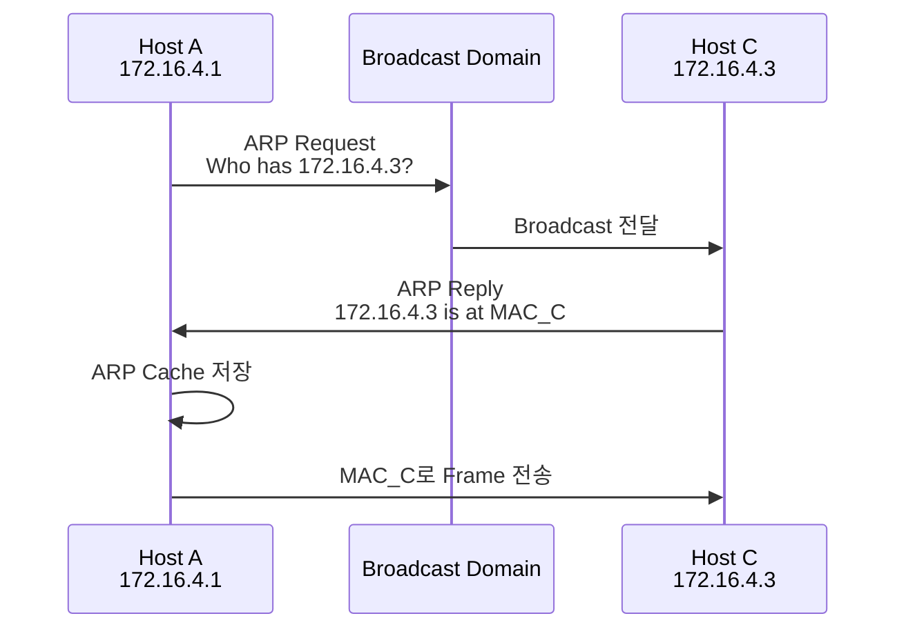
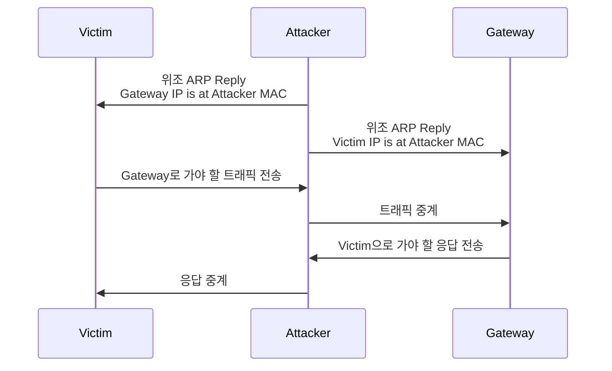
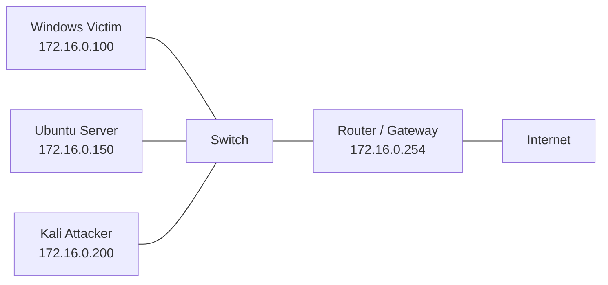

# ARP 스푸핑

## 한 줄 요약

ARP Spoofing은 인증되지 않은 ARP Reply를 이용해 피해자의 ARP Cache를 오염시키고, 트래픽을 공격자 쪽으로 우회시키는 L2 기반 MITM 공격이다.

방어는 단순히 “스니핑을 막는다”가 아니라, **ARP 위조를 막고, IP–MAC–Port 매핑을 검증하며, 최종적으로 평문 통신을 줄이는 방향**으로 접근해야 한다.

---

## 수업 메모에서 건진 핵심

> [!important] 핵심
> ARP Reply가 온다고 해서 인증된 응답은 아니다.

ARP는 응답자가 실제로 해당 IP를 가진 장비인지 강하게 검증하지 않는다.  
따라서 공격자가 위조된 ARP Reply를 보내면, 피해자는 잘못된 IP–MAC 매핑을 ARP Cache에 저장할 수 있다.

> [!note] Hub와 Switch
> Hub 환경에서는 모든 포트로 프레임이 전달되므로 Passive Sniffing이 가능하다.  
> 하지만 현대 실무망에서는 Hub를 거의 사용하지 않고, 대부분 Switch 기반이다.  
> 따라서 실제 공격자는 ARP Spoofing 같은 Active Sniffing 기법으로 트래픽 흐름을 조작해야 한다.

> [!note] 현대 환경에서의 실효성
> MAC Flooding과 ICMP Redirect는 교재나 강의자료에서 자주 다루지만, 현대 스위치와 OS에서는 기본 방어 기능, 테이블 제한, ICMP Redirect 비활성화 등으로 예전보다 실효성이 낮다.
>
> 반면 ARP Spoofing은 같은 L2 네트워크에 들어온 공격자나 감염 단말이 있을 때 여전히 MITM의 출발점으로 다뤄진다.

---

## ARP의 역할

ARP, Address Resolution Protocol은 **IP 주소를 MAC 주소로 변환하기 위한 프로토콜**이다.

같은 LAN 안에서 통신할 때, 호스트는 목적지 IP는 알고 있어도 Ethernet Frame을 만들기 위해 목적지 MAC 주소가 필요하다. 이때 ARP를 사용해 IP–MAC 매핑을 알아낸다.

```text
IP 주소 → MAC 주소
L3 주소 → L2 주소
```

### 계층 관점

ARP는 흔히 “3계층 프로토콜”처럼 설명되기도 하지만, 정확히는 조심해서 봐야 한다.

ARP는 L3 주소인 IP를 L2 주소인 MAC으로 매핑하기 위한 프로토콜이다.
계층상으로는 L2와 L3 사이에 걸쳐 설명되는 경우가 많고, Ethernet 환경에서는 IP 패킷이 아니라 ARP Frame으로 직접 전달된다.

따라서 정리할 때는 이렇게 이해하는 게 안전하다.

```text
ARP = L3 주소를 L2 주소로 매핑하기 위한 L2/L3 경계 프로토콜
```

---

## 정상 ARP 동작

예시:

```text
172.16.4.1 → 172.16.4.3으로 통신하려는 상황
```

동작 순서:

1. `172.16.4.1`은 `172.16.4.3`의 MAC 주소를 모른다.
2. `172.16.4.1`은 ARP Request를 Broadcast로 전송한다.
3. 같은 네트워크의 모든 장비가 ARP Request를 수신한다.
4. `172.16.4.3`은 자신의 MAC 주소를 담아 ARP Reply를 보낸다.
5. `172.16.4.1`은 해당 IP–MAC 매핑을 ARP Cache에 저장한다.
6. 이후 Ethernet Frame을 만들어 실제 데이터를 전송한다.



---

## ARP가 취약한 이유

ARP Spoofing이 가능한 이유는 ARP 설계 자체의 한계 때문이다.

### 1. Stateless

ARP는 이전 Request와 Reply의 관계를 엄격하게 추적하지 않는다.

즉, 요청하지 않은 ARP Reply가 와도 시스템이 이를 처리할 수 있다.

### 2. 인증 없음

ARP Reply를 보낸 장비가 실제로 해당 IP를 소유한 장비인지 검증하지 않는다.

```text
“172.16.0.254는 내 MAC 주소야”
```

라는 주장을 받은 쪽이 그대로 믿을 수 있다.

### 3. ARP Cache 신뢰

운영체제는 IP–MAC 매핑을 ARP Cache에 저장한다.
이 캐시가 오염되면 이후 트래픽이 잘못된 MAC 주소로 전달된다.

### 4. Broadcast 기반

ARP Request는 Broadcast로 전달된다.
같은 L2 브로드캐스트 도메인에 있는 공격자는 ARP 흐름을 관찰하거나 조작할 수 있다.

---

## ARP Spoofing / ARP Poisoning

ARP Spoofing은 공격자가 자신의 MAC 주소를 Gateway나 특정 호스트의 MAC 주소인 것처럼 속여 피해자의 ARP Cache를 오염시키는 공격이다.

### 핵심 아이디어

```text
피해자에게:
Gateway IP = 공격자 MAC

Gateway에게:
피해자 IP = 공격자 MAC
```

이라고 속이면, 피해자와 Gateway 사이의 트래픽이 공격자를 경유하게 된다.

---

## 공격 흐름



이 구조가 만들어지면 공격자는 다음을 할 수 있다.

- 패킷 관찰
- 평문 데이터 수집
- [[DNS 스푸핑]] 같은 추가 공격
- 세션 탈취 시도
- 트래픽 변조

단, 공격자가 패킷을 중간에서 계속 전달하지 않으면 피해자의 통신이 끊길 수 있다.
그래서 실습에서는 공격자 장비에서 IP Forwarding을 활성화하는 흐름이 나온다.

---

## 실습 토폴로지

실습 환경의 IP는 PDF 예시와 다르다. 내 실습 기준 토폴로지는 아래 구조다.

| 장비 | 역할 | IP |
| --- | --- | --- |
| 가상 Windows | Victim / Client | `172.16.0.100` |
| Ubuntu | Server | `172.16.0.150` |
| Kali | Attacker | `172.16.0.200` |
| Router | Gateway | `172.16.0.254` |



### 실습 기준 핵심 매핑

공격이 성공하면 Windows Victim의 ARP Cache에서 Gateway IP인 `172.16.0.254`가 Router MAC이 아니라 Kali MAC으로 보이게 된다.

```text
공격 전:
172.16.0.254 → Router MAC

공격 후:
172.16.0.254 → Kali MAC
```

### 실습에서 봐야 할 것

공격 명령어 자체보다 중요한 것은 **무엇이 변했는가**다.

| 관찰 지점 | 공격 전 | 공격 후 |
| --- | --- | --- |
| Victim ARP Cache | Gateway IP → Gateway MAC | Gateway IP → Attacker MAC |
| Wireshark | 정상 ARP Request/Reply | 위조 ARP Reply 반복 |
| 트래픽 경로 | Victim → Gateway | Victim → Attacker → Gateway |
| 보안 영향 | 정상 통신 | MITM 가능 |

### 실습 관찰: 양방향 ARP Spoofing

Kali에서 터미널을 2개 열고 양방향으로 ARP Spoofing을 수행했다.

```bash
sudo arpspoof -i eth0 -t 172.16.0.100 172.16.0.254
sudo arpspoof -i eth0 -t 172.16.0.254 172.16.0.100
```

각 명령의 의미:

| 명령 | 대상 | 속이는 내용 |
| --- | --- | --- |
| `-t 172.16.0.100 172.16.0.254` | Windows Victim | Gateway `172.16.0.254`가 Kali MAC이라고 속임 |
| `-t 172.16.0.254 172.16.0.100` | Router / Gateway | Victim `172.16.0.100`이 Kali MAC이라고 속임 |

이렇게 양방향으로 ARP Cache를 오염시키면 Windows와 Router 사이의 요청과 응답이 모두 Kali를 경유한다.

```text
Windows Victim ↔ Kali Attacker ↔ Router
```

따라서 어느 방향으로 ICMP Ping을 보내도 Wireshark에서 Request와 Reply를 모두 관찰할 수 있다.

---

## 관련 실습

- [[Telnet 평문 노출]]
- [[SSH 암호화 패킷 관찰]]
- [[HTTP 로그인 평문 노출]]
- [[DNS 스푸핑 실습]]

---

## Wireshark 관찰 포인트

ARP Spoofing 분석에서 핵심은 다음 질문이다.

```text
누가 어떤 IP를 어떤 MAC 주소라고 주장하는가?
```

봐야 할 필드:

| 필드 | 의미 |
| --- | --- |
| Opcode | Request인지 Reply인지 |
| Sender MAC | 이 ARP 패킷을 보낸 쪽이 주장하는 MAC |
| Sender IP | 이 ARP 패킷을 보낸 쪽이 주장하는 IP |
| Target MAC | 대상 MAC |
| Target IP | 대상 IP |

### 헤더 구조를 어디까지 외워야 하나?

전부 암기할 필요는 없다.

하지만 ARP Spoofing을 분석하려면 아래는 반드시 이해해야 한다.

- Opcode: Request / Reply 구분
- Sender MAC Address
- Sender IP Address
- Target MAC Address
- Target IP Address

특히 `Sender IP`와 `Sender MAC`의 조합이 실제 네트워크 정보와 맞는지 보는 것이 핵심이다.

---

## Sniffing과의 관계

Sniffing은 네트워크를 흐르는 데이터를 몰래 관찰하는 행위다.

### Passive Sniffing

패킷 흐름을 조작하지 않고 관찰만 한다.

```text
예: Hub 환경에서 Wireshark로 지나가는 모든 패킷 확인
```

하지만 Switch 환경에서는 내 포트로 들어오지 않는 다른 호스트의 트래픽을 단순 Promiscuous Mode만으로 볼 수 없다.

### Active Sniffing

패킷 흐름을 공격자가 의도적으로 조작한다.

대표 기법:

- ARP Spoofing
- MAC Flooding
- ICMP Redirect

현대 환경에서는 ARP Spoofing이 가장 현실적인 학습 대상이다.

---

## 관련 공격 기법 비교

| 기법 | 원리 | 현대 실효성 | 메모 |
| --- | --- | --- | --- |
| ARP Spoofing | ARP Cache 오염 | 여전히 중요 | 동일 L2망 내부자/감염 단말 위협 |
| MAC Flooding | CAM Table 포화 후 Flooding 유도 | 낮음 | MAC 제한, Storm Control 등으로 방어 |
| ICMP Redirect | 피해자 라우팅 경로 변경 | 낮음 | 대부분 OS에서 비활성화 또는 제한 |
| DNS Spoofing | DNS 응답 위조 | 조건부 가능 | ARP Spoofing 기반 MITM과 결합 가능 |

---

## 방어 기법 요약

| 방어 기법 | 막는 대상 | 기반 정보 | 실무 메모 |
| --- | --- | --- | --- |
| 암호화 | 스니핑으로 인한 내용 노출 | TLS/SSH/VPN | 가장 근본적인 내용 보호 |
| Static ARP | ARP Cache 오염 | 수동 IP–MAC 매핑 | 소규모/중요 장비에 적합 |
| DHCP Snooping | Rogue DHCP, Binding DB 생성 | DHCP 트랜잭션 | DAI/IP Source Guard의 기반 |
| [[Dynamic ARP Inspection]] | 위조 ARP 패킷 | DHCP Snooping DB 또는 ARP ACL | ARP Spoofing 방어 핵심 |
| IP Source Guard | IP Spoofing | IP–MAC–Port Binding | DHCP Snooping과 연계 |

### 1. 데이터 암호화

Sniffing은 평문 통신에서 가장 효과적이다.

암호화를 적용하면 공격자가 패킷을 가로채더라도 내용을 해석하기 어렵다.

대표 기술:

- HTTPS / SSL / TLS
- SSH
- VPN
- DNS over HTTPS
- DNS over TLS

단, 암호화는 “내용 보호”에 강하지만 ARP Spoofing 자체를 막지는 않는다.
즉, **MITM 위치 확보는 가능하지만, 암호화된 데이터의 의미 있는 해석은 어려워지는 구조**다.

### 2. Static ARP

Static ARP는 IP–MAC 매핑을 정적으로 고정하는 방식이다.

장점:

- ARP Cache 변조 방지
- Gateway, 중요 서버에 적용하면 효과적

단점:

- 관리 부담이 큼
- 사용자 단말이 많은 환경에서는 확장성이 낮음
- IP/MAC 변경 시 수동 갱신 필요

실무에서는 모든 PC에 적용하기보다, 중요 서버나 Gateway에 제한적으로 고려할 수 있다.

### 3. Switch 기반 방어

[[Dynamic ARP Inspection]]은 ARP 패킷 검증에 초점을 두고, IP Source Guard는 포트에서 사용하는 Source IP 자체를 검증하는 쪽에 가깝다.

더 자세한 내용은 [[Dynamic ARP Inspection]]에 분리했다.

---

## 실무 관점

> [!note] 실무 관점
> ARP Spoofing은 외부 인터넷에서 바로 들어오는 공격이라기보다, 같은 L2 브로드캐스트 도메인에 들어온 내부자, 감염 단말, Rogue 장비가 수행하기 쉬운 공격이다.
>
> 따라서 방어는 방화벽보다 Access Switch 보안 기능과 내부망 통제가 중요하다.
> - 엔지니어 작업망처럼 변경과 임시 연결이 잦은 환경에서는 ARP Spoofing을 완전히 차단하는 운영이 현실적으로 어려울 수 있으므로, L2 통제와 상위 계층 방어를 함께 봐야 한다.


실무에서는 보통 ARP Spoofing을 단독으로 보지 않고 아래 범주로 묶는다.

- L2 보안
- 내부자 위협
- 사용자망 보안
- NAC / 접근제어
- Switch Hardening
- Rogue DHCP 방지
- MITM 방어
- 평문 프로토콜 제거

### 현실적인 대응 조합

```text
VLAN 분리
+ DHCP Snooping
+ Dynamic ARP Inspection
+ IP Source Guard
+ Port Security
+ NAC
+ HTTPS/SSH/TLS 강제
```

---

## 시험 / 면접 포인트

### 꼭 이해할 것

- ARP는 왜 필요한가?
- ARP Request와 ARP Reply의 차이는?
- ARP Reply가 인증된 응답이 아닌 이유는?
- ARP Spoofing이 MITM으로 이어지는 과정은?
- Switch 환경에서 Passive Sniffing이 어려운 이유는?
- DHCP Snooping과 DAI의 관계는?
- IP Source Guard는 DAI와 무엇이 다른가?
- 암호화는 ARP Spoofing 자체를 막는가, 아니면 내용 노출을 줄이는가?

### 한 문장 답변 연습

**Q. ARP Spoofing이 가능한 이유는?**

ARP는 응답자의 신원을 인증하지 않고, 요청하지 않은 ARP Reply도 ARP Cache에 반영될 수 있기 때문에 공격자가 위조된 IP–MAC 매핑을 주입할 수 있다.

---

## 확인 질문

1. ARP Request는 Broadcast인데 ARP Reply는 보통 어떤 방식으로 응답되는가?
2. ARP Reply가 인증된 응답이 아니라는 말은 무슨 뜻인가?
3. ARP Spoofing 공격 후 피해자의 ARP Cache에서 어떤 값이 바뀌는가?
4. 공격자가 IP Forwarding을 활성화하지 않으면 피해자 통신에 어떤 문제가 생길 수 있는가?
5. Hub 환경과 Switch 환경에서 Sniffing 난이도가 다른 이유는?
6. MAC Flooding이 현대 환경에서 실효성이 낮아진 이유는?
7. 암호화가 ARP Spoofing 방어에서 가지는 역할과 한계는 무엇인가?

---

## 관련 노트

- [[ARP]]
- [[Sniffing]]
- [[MITM]]
- [[Dynamic ARP Inspection]]
- [[Telnet 평문 노출]]
- [[HTTP 로그인 평문 노출]]
- [[Ettercap Filter 패킷 변조 실습]]
- [[SSH 암호화 패킷 관찰]]
- [[DNS 스푸핑]]
- [[DNS 스푸핑 실습]]
- [[Wireshark]]

---

## 첨부 이미지

![[Pasted image 20260514113251.png]]
