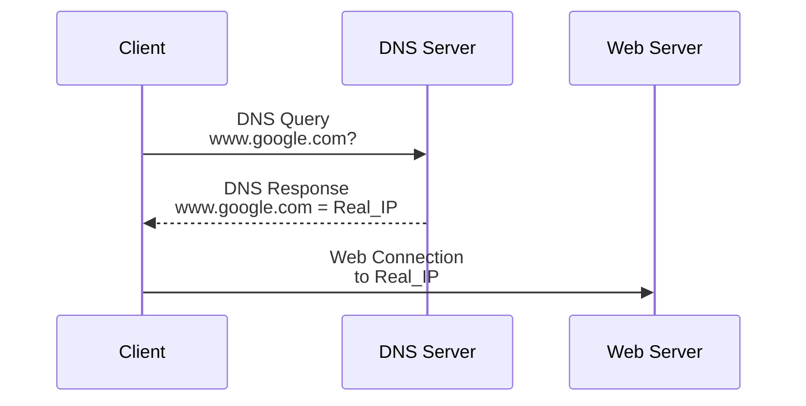
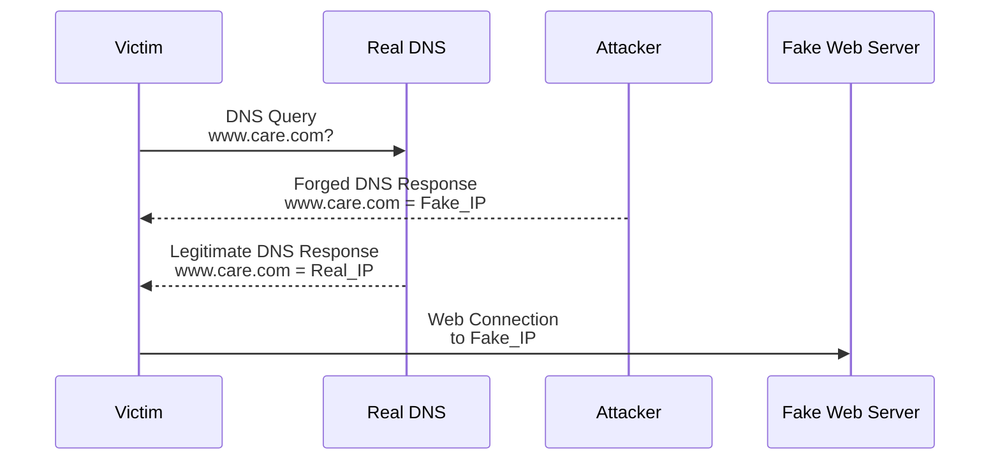
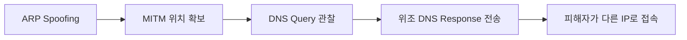

# DNS 스푸핑

## 한 줄 요약

DNS Spoofing은 DNS 응답을 위조해 사용자가 의도한 도메인과 다른 IP 주소로 접속하도록 유도하는 공격이다.

---

## DNS의 역할

DNS, Domain Name System은 사람이 기억하기 쉬운 도메인 이름을 통신에 필요한 IP 주소로 바꿔주는 체계다.

```text
www.google.com
→ IP address
```

사람은 `www.google.com` 같은 이름을 기억하지만, 호스트는 실제 통신을 할 때 IP 주소를 사용한다.
따라서 DNS가 있어야 사용자가 이름을 입력해도 브라우저가 실제 목적지 서버를 찾을 수 있다.


---

## DNS 조회 우선순위

강의자료의 흐름을 정리하면 도메인 이름은 대략 다음 순서로 해석된다.

```text
Browser DNS Cache
→ hosts 파일
→ OS DNS Cache
→ DNS Resolver
→ Root DNS
→ TLD DNS
→ Authoritative DNS
```

| 단계 | 의미 |
| --- | --- |
| Browser DNS Cache | 브라우저가 이전에 조회한 결과를 잠시 보관한 캐시 |
| hosts 파일 | 운영체제가 로컬에서 먼저 참고하는 수동 이름-IP 매핑 파일 |
| OS DNS Cache | 운영체제가 최근 DNS 결과를 저장한 캐시 |
| DNS Resolver | 사내 DNS, ISP DNS, 공용 DNS처럼 재귀 질의를 대신 수행하는 서버 |
| Root DNS | 최상위 루트 영역을 담당하며 TLD 서버 위치를 알려주는 서버 |
| TLD DNS | `.com`, `.org`, `.kr` 같은 최상위 도메인 영역을 담당하는 서버 |
| Authoritative DNS | 해당 도메인의 최종 정답 레코드를 가진 권한 있는 서버 |

중요한 점은 **앞 단계에서 답을 찾으면 뒤 단계까지 가지 않을 수 있다**는 것이다.
그래서 DNS 관련 공격은 권한 있는 DNS 서버만 노리는 것이 아니라, `hosts` 파일, 로컬 캐시, 재귀 Resolver, DHCP를 통한 DNS 서버 배포 등 여러 위치에서 발생할 수 있다.

---

## 정상 DNS Query & Reply

정상 흐름은 단순하다.

```text
사용자가 도메인 입력
→ 클라이언트가 DNS Query 전송
→ DNS 서버가 DNS Response 반환
→ 클라이언트가 반환된 IP로 접속
```



강의자료 58쪽의 핵심도 이 구조다.
사용자는 이름만 입력하지만, 브라우저는 DNS 응답으로 받은 IP를 실제 접속 대상에 사용한다.

---

## DNS Spoofing이란?

DNS Spoofing은 공격자가 정상 DNS 서버의 응답인 것처럼 위조된 DNS Response를 보내 피해자가 잘못된 IP를 믿게 만드는 공격이다.

```text
정상:
www.google.com → Real_Google_IP

공격:
www.google.com → Attacker_Web_Server_IP
```

피해자는 주소창에 원래 의도한 도메인을 그대로 보고 있을 수 있다.
하지만 DNS 응답이 바뀌면 실제 연결 대상 IP는 공격자가 정한 서버가 된다.



강의자료 59쪽은 바로 이 장면을 그린다.
정상 웹 서버와 공격자 웹 서버가 모두 존재하지만, 피해자는 먼저 받아들인 위조 DNS 응답 때문에 공격자 서버로 이동한다.

---

## DNS Spoofing이 가능한 이유

전통적인 DNS는 주로 UDP/53을 사용하고, 연결 상태를 유지하지 않는다.
또 DNSSEC 검증을 쓰지 않는 일반 DNS 응답은 기본적으로 강한 출처 인증이나 무결성 보호를 제공하지 않는다.

그래서 위조 응답이 다음 조건을 맞추고 정상 응답보다 먼저 도착하면 수용될 수 있다.

- Query Name
- Transaction ID
- 클라이언트가 사용한 UDP source port
- 응답 패킷에서 해당 포트가 destination port로 맞게 돌아오는지
- Source / Destination IP와 Port
- 응답 타이밍

강의자료 55쪽도 이 점을 강조한다.
클라이언트는 자신이 보낸 DNS Query와 `Transaction ID`, `Source Port` 등이 맞는 응답 중 먼저 도착한 것을 신뢰할 수 있다.

정확히는 클라이언트가 DNS Query를 보낼 때 사용하는 UDP source port가 중요하다.
DNS Response에서는 이 포트가 destination port로 돌아와야 한다.
Off-path 공격자는 이 값을 추측해야 하지만, ARP Spoofing 같은 On-path MITM 위치에 있으면 Query를 직접 볼 수 있어 확인이 상대적으로 쉽다.

실제 Resolver는 위조 응답을 어렵게 만들기 위해 source port randomization 같은 방어를 사용한다.
RFC 5452는 forged answer에 대한 회복력을 높이기 위해 query ID와 source port 같은 예측 요소를 충분히 무작위화하는 방향을 설명한다.

또한 DNS 응답은 캐시에 저장될 수 있다.
한 번 잘못된 답이 들어가면 TTL 동안 같은 오답이 반복 사용될 수 있어 피해가 지속될 수 있다.

---

## DNS Spoofing vs DNS Cache Poisoning

둘은 겹치지만 같은 말은 아니다.

```text
DNS Spoofing
= 위조되거나 조작된 DNS 응답을 보내는 넓은 개념

DNS Cache Poisoning
= Resolver 또는 클라이언트 캐시에 잘못된 DNS 응답을 넣어 오답이 지속되게 만드는 경우
```

| 구분 | DNS Spoofing | DNS Cache Poisoning |
| --- | --- | --- |
| 초점 | 응답 위조 행위 | 캐시 오염과 지속성 |
| 범위 | 넓음 | 더 구체적 |
| 대상 | 클라이언트, Resolver 등 | 캐시를 가진 클라이언트나 Resolver |
| 지속성 | 즉시성일 수 있음 | TTL 동안 반복 사용될 수 있음 |
| 예시 | MITM이 피해자에게 위조 응답 전송 | 재귀 Resolver 캐시에 오답 삽입 |

실습에서 `dnsspoof`로 피해자에게 위조 응답을 먼저 보내는 장면은 DNS Spoofing이고, 그 결과가 피해자 캐시에 남으면 Cache Poisoning 성격도 일부 갖는다.

---

## On-path와 Off-path DNS Spoofing

| 구분 | On-path MITM | Off-path Spoofing |
| --- | --- | --- |
| 공격자 위치 | DNS Query 경로상에 있음 | DNS Query 경로 밖에 있음 |
| Query 관찰 | 가능 | 보통 불가능 |
| Transaction ID / Port | 직접 볼 수 있음 | 추측해야 함 |
| 정상 응답 제어 | 차단/지연 가능성이 있음 | 직접 제어하기 어려움 |
| 대표 예 | ARP Spoofing + dnsspoof | Resolver Cache Poisoning 시도 |
| 주요 방어 | L2 보안, DoH/DoT, HTTPS/HSTS | Source port randomization, DNSSEC validation, resolver hardening |

이 수업 실습은 ARP Spoofing으로 공격자가 On-path 위치를 확보한 뒤 DNS 응답을 위조하는 흐름이다.
반면 RFC 5452에서 강조하는 `Transaction ID`와 source port randomization은 주로 Query를 직접 보지 못하는 Off-path forged answer 공격을 어렵게 만드는 방어와 관련이 깊다.

---

## ARP Spoofing과 결합되는 이유

[[ARP 스푸핑]]은 공격자를 같은 LAN 안의 MITM 위치에 올려놓을 수 있다.
그 상태가 되면 공격자는 피해자의 DNS Query를 관찰하고, 정상 DNS 응답보다 먼저 위조 DNS Response를 보내려 할 수 있다.
실습 환경에서는 정상 DNS 응답을 차단하거나 지연시켜 위조 응답이 먼저 채택되도록 만들기도 한다.



관련 실습은 [[DNS 스푸핑 실습]]에서 따로 정리한다.

---

## 공격 위치별 분류

| 공격 위치 | 예시 | 방어 |
| --- | --- | --- |
| 같은 LAN | ARP Spoofing + forged DNS response | DAI, DHCP Snooping, NAC |
| 클라이언트 로컬 | hosts 파일 변조, DNS cache 조작 | EDR, 권한 관리, 무결성 모니터링 |
| DHCP | Rogue DHCP가 악성 DNS 서버 배포 | DHCP Snooping |
| Resolver | DNS Cache Poisoning | DNSSEC validation, resolver hardening |
| Registrar / domain account | DNS Hijacking | MFA, registry lock, account security |
| 사용자 유도 | Typosquatting, phishing domain | Protective DNS, email security, awareness |

DNS Spoofing은 “DNS 패킷만의 문제”라기보다, 어느 계층에서 이름 해석이 조작됐는지를 보는 문제에 가깝다.

---

## HTTPS / HSTS와의 관계

DNS Spoofing은 사용자를 잘못된 IP로 보낼 수 있다.
하지만 그것만으로 HTTPS 인증서 검증까지 자동으로 우회되는 것은 아니다.

공격자가 대상 도메인에 대한 유효한 인증서를 제시하지 못하면 브라우저는 인증서 오류를 경고하거나 연결을 차단해야 한다.
HSTS는 브라우저가 해당 호스트에 대해 HTTP를 HTTPS로 강제하고, 보안 연결 오류를 무시하고 진행하지 못하게 하는 정책이다.
그래서 HTTP-only 서비스는 DNS Spoofing에 훨씬 더 설득력 있게 속을 수 있고, HTTPS/HSTS가 적용된 서비스는 사용자가 이상 신호를 볼 가능성이 커진다.

비교 관점에서 보면 [[HTTP 로그인 평문 노출]]은 평문 서비스가 얼마나 쉽게 노출되는지를 보여주고, [[SSH 암호화 패킷 관찰]]은 암호화된 전송이 중간 관찰을 어떻게 제한하는지 보여준다.

---

## 방어 기법

### 1. L2 / 내부망 방어

- ARP Spoofing 차단
- [[Dynamic ARP Inspection]]
- DHCP Snooping
- Port Security
- NAC
- VLAN segmentation

LAN 내부 MITM을 막지 못하면 DNS 계층 방어 전에 이미 공격자가 패킷 경로에 들어올 수 있다.
따라서 [[ARP 스푸핑]]과 DAI는 DNS Spoofing 방어의 전제 조건 중 하나다.
> [!note] 강의 메모
> 강사님은 엔지니어들의 실제 작업 환경을 생각하면 ARP Spoofing을 완전히 차단하는 운영은 사실상 어렵다고 설명했다.  
> 장비 추가, 임시 연결, 장애 대응, 실습·검증처럼 네트워크 구성이 자주 바뀌는 환경에서는 L2 통제를 아주 빡빡하게 유지하기 어렵기 때문이다.
>
> 따라서 DNS Spoofing 방어를 `ARP Spoofing 차단 하나`에만 기대면 안 되고, DNSSEC, DoH/DoT, HTTPS/HSTS, DNS 로그, 정책 통제를 함께 봐야 한다.

### 2. DNS 계층 방어

- 신뢰할 수 있는 recursive resolver 사용
- DNSSEC validation
- Resolver hardening
- Source port randomization
- Cache hardening
- DNS logging

DNSSEC는 DNS 데이터의 출처 인증과 무결성 보호를 제공한다.
하지만 질의 내용 자체를 암호화하지는 않는다.
RFC 4033도 DNSSEC가 origin authentication과 integrity protection은 제공하지만 confidentiality는 제공하지 않는다고 설명한다.

### 3. 전송 구간 보호

- DoH, DNS over HTTPS
- DoT, DNS over TLS

DoH와 DoT는 클라이언트와 Resolver 사이 DNS 질의/응답을 암호화해 로컬 네트워크에서의 도청이나 응답 변조를 어렵게 만든다.
Google Public DNS 문서도 DoH/DoT가 DNS 질의와 응답을 암호화하고, DNSSEC와 상호보완적이라고 설명한다.

다만 NIST는 DoH/DoT가 query/response 전송 구간을 보호할 뿐, DNS 데이터 자체의 출처 인증과 무결성은 제공하지 않는다고 구분한다.
즉, `DNSSEC = 데이터 진위`, `DoH/DoT = 전송 구간 보호`로 보는 편이 안전하다.

기업망에서는 DoH 정책도 관리 대상이다.
브라우저가 관리되지 않은 외부 DoH Resolver로 직접 질의하면 내부 DNS 로깅, 필터링, split-horizon 정책을 우회할 수 있다.
Microsoft Edge 정책 문서처럼 관리형 브라우저는 DoH 모드를 정책으로 통제할 수 있어야 한다.

### 4. 웹 계층 방어

- HTTPS
- HSTS
- Certificate validation
- Certificate Transparency 관찰

DNS가 잘못된 IP를 반환해도, 웹 계층이 유효한 인증서를 요구하면 사용자가 위조 사이트로 그대로 넘어갈 가능성을 줄일 수 있다.
특히 외부 도메인 계정이 탈취된 경우에는 유효 인증서까지 발급될 수 있으므로, CISA가 권고하듯 Certificate Transparency 모니터링도 운영 통제에 포함된다.

### 5. 운영 통제

- Protective DNS
- DNS logging and monitoring
- EDR
- 허용 Resolver 정책
- Rogue DNS traffic 차단

CISA의 Protective DNS는 알려진 악성 목적지로 향하는 해석을 차단해 침해 가능성을 낮추는 운영 통제다.
또 DNS 로그는 의심스러운 도메인 해석, C2 조회, 피싱 리다이렉트, 비정상 Resolver 사용을 추적하는 데 유용하다.

---

## 실무 관점

- DNS Spoofing은 보통 DNS만의 문제가 아니라, L2 MITM, Rogue DHCP, endpoint compromise, resolver 보안, 브라우저 정책, 피싱 방어가 겹치는 문제로 본다.
- Protective DNS는 악성 도메인 해석 차단에 유용하지만, DAI 같은 L2 방어를 대체하지 않는다.
- DoH/DoT는 불신 네트워크에서 프라이버시와 전송 무결성을 높이지만, 기업 내부에서는 가시성과 정책 통제 문제를 함께 만든다.
- DNS 로그는 침해사고 대응에서 값이 크다. 의심 도메인 조회, 내부 단말의 비정상 Resolver 사용, 반복적인 실패 질의, 피싱 유도 흔적을 남기기 때문이다.
- HTTPS/HSTS가 있어도 DNS 자체의 이상 징후를 무시해도 된다는 뜻은 아니다. 계층별 방어를 겹쳐야 한다.

---

## 확인 질문

1. DNS는 왜 필요한가?
2. DNS 조회 과정에서 `hosts` 파일은 어떤 위치에 있는가?
3. DNS Spoofing과 DNS Cache Poisoning의 차이는 무엇인가?
4. ARP Spoofing이 DNS Spoofing 실습에서 왜 사용되는가?
5. DNSSEC와 DoH/DoT의 차이는 무엇인가?
6. DNS Spoofing이 HTTPS 인증서 검증을 자동으로 우회할 수 없는 이유는?
7. 기업망에서 관리되지 않은 DoH가 보안팀에게 문제가 될 수 있는 이유는?
8. Protective DNS는 어떤 운영 통제인가?
9. DNS 로그는 침해사고 대응에서 왜 중요한가?

---

## 관련 노트

- [[ARP 스푸핑]]
- [[Dynamic ARP Inspection]]
- [[DNS 스푸핑 실습]]
- [[HTTP 로그인 평문 노출]]
- [[SSH 암호화 패킷 관찰]]
- MITM 정리 예정
- Wireshark 정리 예정

---

## 참고 자료

- [RFC 4033: DNS Security Introduction and Requirements](https://www.rfc-editor.org/rfc/rfc4033)
- [RFC 5452: Measures for Making DNS More Resilient against Forged Answers](https://www.rfc-editor.org/rfc/rfc5452)
- [RFC 6797: HTTP Strict Transport Security](https://www.rfc-editor.org/rfc/rfc6797.html)
- [NIST SP 800-81r3: Secure Domain Name System Deployment Guide](https://nvlpubs.nist.gov/nistpubs/SpecialPublications/NIST.SP.800-81r3.pdf)
- [Google Public DNS: Secure transports for DNS](https://developers.google.com/speed/public-dns/docs/secure-transports)
- [Microsoft Edge policy: DnsOverHttpsMode](https://learn.microsoft.com/en-ie/DeployEdge/microsoft-edge-browser-policies/dnsoverhttpsmode)
- [CISA: Protective Domain Name System Resolver](https://www.cisa.gov/resources-tools/services/protective-domain-name-system-dns-resolver)
- [CISA: Mitigate DNS Infrastructure Tampering](https://www.cisa.gov/resources-tools/resources/mitigate-dns-infrastructure-tampering)
