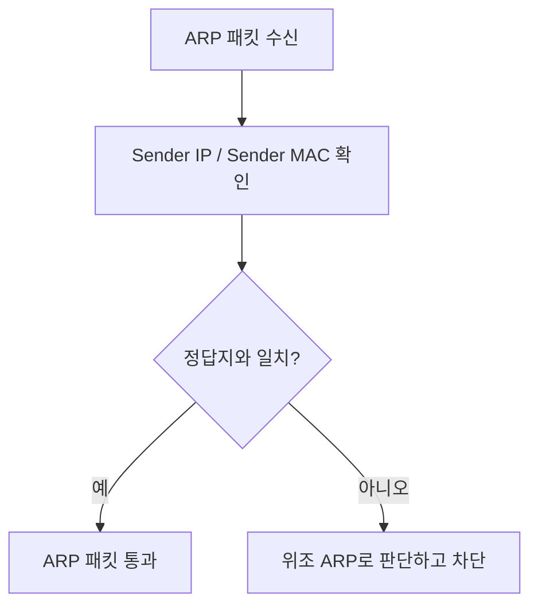
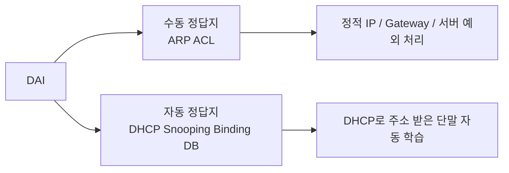
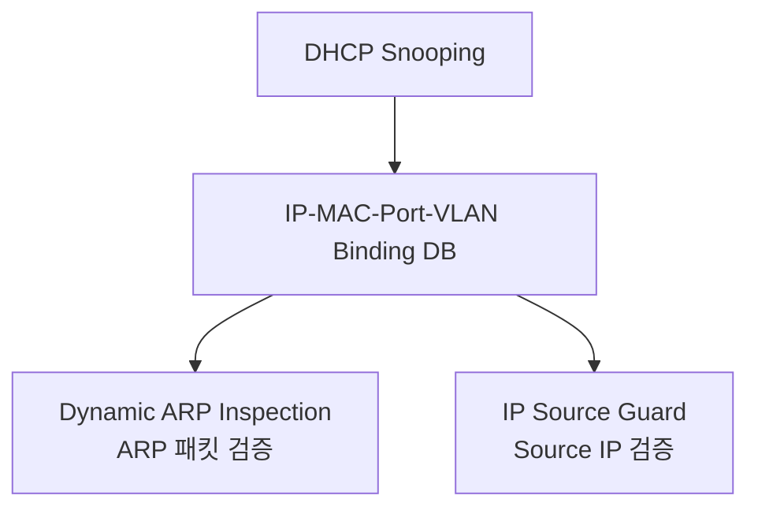

# Dynamic ARP Inspection

## 한 줄 요약

Dynamic ARP Inspection, DAI는 스위치가 ARP 패킷의 IP–MAC 매핑 주장을 검사해서 ARP Spoofing을 차단하는 L2 보안 기능이다.

짧게 말하면:

```text
DAI = ARP 거짓말 검사 기능
ARP ACL = 수동 정답지
DHCP Snooping DB = 자동 정답지
Trust Port = 검사 예외/신뢰 경계
```

---

## 53페이지 핵심 해석

PDF 53페이지의 핵심은 DAI 명령어 암기가 아니라, **DAI가 ARP Spoofing을 판별할 기준표를 어디서 얻는가**이다.

ARP Spoofing에서 공격자는 이런 거짓말을 한다.

```text
Gateway IP = Attacker MAC
```

예를 들어:

```text
172.16.0.254 is-at Kali_MAC
```

이 주장은 “Gateway IP의 MAC 주소가 Kali MAC이다”라는 뜻이다.

DAI는 이 ARP 패킷을 그냥 믿지 않고, 정답지와 비교한다.

```text
정답지:
172.16.0.254 = Router_MAC

ARP 패킷 주장:
172.16.0.254 = Kali_MAC

판정:
불일치 → 위조 ARP → 차단
```

---

## 왜 DAI가 필요한가

ARP는 응답자가 실제로 해당 IP를 가진 장비인지 인증하지 않는다.
그래서 같은 L2 네트워크에 있는 공격자는 위조 ARP Reply를 보내 피해자의 ARP Cache를 오염시킬 수 있다.

DAI는 이 문제를 스위치 레벨에서 막는다.

```text
ARP 패킷 수신
→ Sender IP / Sender MAC 확인
→ 정답지와 비교
→ 일치하면 통과
→ 불일치하면 차단
```



공식 문서 기준으로도 DAI는 untrusted port에서 들어오는 ARP request와 response를 가로채고, 신뢰할 수 있는 IP-to-MAC binding과 비교한 뒤 유효한 패킷만 전달한다.

---

## DAI가 보는 것

DAI가 핵심적으로 보는 것은 ARP 패킷 안의 주장이다.

```text
Sender IP
Sender MAC
```

즉, DAI는 다음 질문을 한다.

```text
이 IP 주소가 정말 이 MAC 주소를 쓰는 게 맞나?
```

제품 설정에 따라 ARP payload의 MAC/IP뿐 아니라 Ethernet header와 ARP body의 MAC 일치 여부, invalid IP 여부 같은 추가 validation도 검사할 수 있다.

---

## DAI가 사용하는 두 가지 정답지



### 1. ARP ACL, 수동 정답지

ARP ACL은 관리자가 IP–MAC 매핑을 직접 적어주는 방식이다.

예:

```text
172.16.0.254 = Router_MAC
172.16.0.100 = Windows_MAC
```

이 방식은 DHCP Snooping DB에 자동으로 올라오지 않는 장비에 필요하다.

대표 예시:

- Gateway / Router
- 서버
- 정적 IP 장비
- DHCP를 쓰지 않는 장비

단점:

- 관리 부담이 있다.
- 장비 교체로 MAC이 바뀌면 직접 수정해야 한다.
- 대규모 사용자망 전체에 쓰기에는 비효율적이다.

Cisco 계열에서는 ARP ACL을 DAI filter로 적용하면 DHCP Snooping Binding DB보다 먼저 비교될 수 있다.
즉, ARP ACL이 deny하면 DHCP Snooping DB에 정상 binding이 있어도 차단될 수 있으므로 수동 정답지는 정확해야 한다.

---

### 2. DHCP Snooping Binding Database, 자동 정답지

DHCP Snooping은 DHCP 할당 과정을 스위치가 관찰해서 IP–MAC–Port–VLAN 매핑 정보를 만든다.

예:

| IP | MAC | Port | VLAN |
| --- | --- | --- | --- |
| 172.16.0.100 | Windows_MAC | access port | VLAN 1 |
| 172.16.0.200 | Kali_MAC | access port | VLAN 1 |

이 표가 DAI의 자동 정답지가 된다.

흐름:

```text
DHCP Snooping 활성화
→ DHCP Discover/Offer/Request/Ack 흐름 관찰
→ IP–MAC–Port–VLAN Binding DB 생성
→ DAI가 이 DB를 기준으로 ARP 패킷 검증
```

정적 IP 단말처럼 DHCP를 거치지 않는 장비는 이 DB에 없을 수 있다.
그 상태에서 DAI가 untrusted port의 ARP를 검사하면 정상 장비의 ARP도 drop될 수 있다.

---

## DHCP Snooping이 왜 같이 나오는가

DAI는 ARP를 검사하는 기능이다.
하지만 검사하려면 “무엇이 정상 IP–MAC 매핑인지” 알아야 한다.

DHCP Snooping은 이 정상 매핑 정보를 자동으로 만들어준다.

```text
DHCP Snooping = 정답지 생성
DAI = 정답지를 보고 ARP 패킷 검사
IP Source Guard = 정답지를 보고 Source IP 사용 검증
```



---

## Trust Port와 Untrusted Port

DAI와 DHCP Snooping은 포트별로 신뢰 여부를 나눈다.

| 포트 유형 | 일반 권장 상태 | 이유 |
| --- | --- | --- |
| 사용자 PC 포트 | untrusted | 공격자가 연결될 수 있음 |
| Kali 같은 실습 공격자 포트 | untrusted | 공격 트래픽을 검사해야 함 |
| DHCP Server 방향 포트 | trusted | 정상 DHCP 응답이 들어오는 방향 |
| Gateway / Router 방향 포트 | 환경에 따라 trusted 또는 ARP ACL 처리 | 정상 네트워크 장비 |
| 스위치 간 trunk/uplink | 보통 trusted 후보 | 상위 스위치에서 정상 트래픽이 들어올 수 있음 |

주의:

- 공격자 포트를 trust로 설정하면 DAI가 공격 ARP를 검사하지 않고 통과시킬 수 있다.
- 반대로 정상 DHCP Server 방향을 untrusted로 두면 DHCP가 깨질 수 있다.
- trust 설정은 “보안 예외”이므로 최소화해야 한다.
- trusted port는 검사 예외에 가까우므로, 단순히 “중요 장비 포트”라는 이유만으로 지정하지 않는다.
- 여러 스위치가 같은 VLAN에 있을 때 일부 스위치만 DAI를 켜면 trust 경계가 꼬여 연결 장애나 보안 구멍이 생길 수 있다.

공통 원칙은 단순하다.
사용자 단말 포트는 보통 untrusted로 두고, DHCP Server / uplink / 인프라 방향만 trust 후보로 검토한다.
다만 제품별 기본값과 명령어는 다르므로 실제 장비 문서를 확인해야 한다.
예를 들어 Cisco Catalyst 문서에서는 DAI가 기본적으로 모든 VLAN에서 비활성이고, 인터페이스 trust state도 기본 untrusted로 설명된다.
Juniper 문서는 access port를 기본 untrusted, trunk port를 기본 trusted로 설명하며, Meraki 문서도 trusted port를 먼저 잡지 않고 DAI를 켜면 클라이언트 연결 문제가 생길 수 있다고 경고한다.

---

## PDF 53페이지 명령어 흐름 해석

### 1. 수동 ARP ACL 방식

PDF 위쪽 설정은 관리자가 IP–MAC 정답지를 직접 만드는 방식이다.

```ios
ip arp inspection vlan 1
arp access-list arpacl
 permit ip host 10.10.10.254 mac host 0001.0002.0003
 permit ip host 10.10.10.1 mac host 0004.0005.0006
ip arp inspection filter arpacl vlan 1
```

의미:

```text
10.10.10.254는 MAC 0001.0002.0003일 때만 정상
10.10.10.1은 MAC 0004.0005.0006일 때만 정상
```

즉, 다른 MAC이 해당 IP라고 주장하면 위조로 본다.

### 2. DHCP Snooping DB 방식

PDF 아래쪽 설정은 DHCP Snooping으로 자동 정답지를 만든 뒤 DAI가 사용하는 방식이다.

```ios
ip dhcp snooping
ip dhcp snooping vlan 1
no ip dhcp snooping information option

interface fa0/2
 ip dhcp snooping trust

ip arp inspection vlan 1

interface fa0/2
 ip arp inspection trust
```

핵심 흐름:

```text
DHCP Snooping 켬
→ VLAN 1에서 DHCP Snooping 활성화
→ DHCP Server 방향 포트 trust
→ DAI 활성화
→ 필요한 포트에 ARP inspection trust 설정
```

---

## 네 실습 환경으로 이해

실습 환경:

| 장비 | 역할 | IP |
| --- | --- | --- |
| Windows | Victim | 172.16.0.100 |
| Ubuntu | Web Server | 172.16.0.150 |
| Kali | Attacker | 172.16.0.200 |
| Router | Gateway | 172.16.0.254 |

Kali가 공격하면 다음처럼 주장한다.

```text
172.16.0.254 is-at Kali_MAC
```

DAI가 없으면:

```text
Windows ARP Cache:
172.16.0.254 → Kali_MAC
```

DAI가 있고 정답지가 맞으면:

```text
정답지:
172.16.0.254 = Router_MAC

Kali의 주장:
172.16.0.254 = Kali_MAC

판정:
불일치 → 차단
```

Windows와 Web Server 사이의 HTTP 실습도 같은 원리로 볼 수 있다.
양방향 MITM을 하려면 Windows와 Web Server 양쪽의 ARP Cache가 오염된다.

```text
Windows에게:
172.16.0.150 = Kali_MAC

Web Server에게:
172.16.0.100 = Kali_MAC
```

DAI가 정상 동작하고 정답지에 Windows와 Web Server의 IP–MAC 매핑이 있으면, 이런 위조 ARP도 차단 대상이 된다.

---

## 실무 적용 순서

실무에서는 DAI를 갑자기 전체 VLAN에 켜면 장애가 날 수 있다.
아래 순서로 접근하는 것이 안전하다.

1. 대상 VLAN과 장비 목록을 정리한다.
2. DHCP 사용 단말과 정적 IP 장비를 구분한다.
3. DHCP Snooping을 먼저 활성화한다.
4. 정상 Binding DB가 생성되는지 확인한다.
5. DHCP Server / Gateway / uplink trust 포트를 정확히 지정한다.
6. 정적 IP 서버/Gateway는 ARP ACL 또는 static binding 예외를 준비한다.
7. 테스트 VLAN 또는 일부 Access Switch에서 먼저 DAI를 켠다.
8. violation log와 정상 통신 여부를 확인한다.
9. 점진적으로 적용 범위를 넓힌다.

---

## 실무 꿀팁

- DAI는 “켜기만 하면 되는 기능”이 아니라, DHCP Snooping DB나 ARP ACL 같은 기준 데이터가 정확해야 정상 동작한다.
- 정적 IP 서버가 많은 환경에서는 DAI보다 예외 관리가 더 어려울 수 있다.
- DHCP Snooping DB가 비어 있으면 DAI가 정상 단말 ARP도 막을 수 있다.
- Gateway나 DHCP Server 방향 포트 trust를 잘못 잡으면 정상 통신 장애가 생긴다.
- 사용자 Access Port를 trust로 두면 보안 효과가 크게 약해진다.
- ARP rate limit 설정과 err-disable 동작을 확인해야 한다.
- 적용 전후 `show ip dhcp snooping binding`, `show ip arp inspection`, 로그를 확인해야 한다.
- Packet Tracer나 일부 가상 실습 환경에서는 실제 장비와 DAI 동작이 다를 수 있으므로, 실습 결과와 실제 장비 동작을 구분한다.
- DAI는 ARP Spoofing 방어 기능이지, HTTPS/TLS 같은 암호화를 대체하지 않는다.
- DAI를 적용해도 이미 평문 프로토콜을 쓰면 다른 경로의 노출 위험이 남을 수 있다.

---

## Rate Limit와 Err-Disable

DAI 검사는 스위치 CPU 자원을 사용한다.
그래서 많은 장비는 untrusted interface로 들어오는 ARP 패킷에 rate limit을 둔다.

Cisco Catalyst 계열 문서에서는 untrusted interface 기본 ARP rate limit을 15 pps로 설명하고, limit을 넘으면 포트가 error-disabled 상태가 될 수 있다고 설명한다.

확인할 점:

- 정상 단말이 많은 포트인지
- trunk나 EtherChannel처럼 여러 VLAN/호스트 ARP가 모이는 포트인지
- rate limit을 너무 낮게 잡지 않았는지
- err-disable recovery 정책을 설정할지

예시:

```ios
interface fa0/1
 ip arp inspection limit rate 15 burst interval 1

errdisable recovery cause arp-inspection
errdisable recovery interval 300
```

> [!warning] 실무 주의
> rate limit은 보안 기능이지만 장애 원인이 될 수 있다. 특히 uplink, trunk, EtherChannel 포트는 실제 ARP량을 보고 기준을 잡아야 한다.

---

## 검증 명령 예시

Cisco 계열에서 자주 확인하는 방향:

```ios
show ip dhcp snooping
show ip dhcp snooping binding
show ip arp inspection
show ip arp inspection interfaces
show ip arp inspection vlan 1
show ip arp inspection statistics
show logging
show errdisable recovery
show interfaces status err-disabled
```

검증할 것:

| 검증 항목 | 확인 내용 |
| --- | --- |
| DHCP Snooping 상태 | VLAN에 활성화되어 있는가 |
| Binding DB | IP–MAC–Port–VLAN 매핑이 생성되는가 |
| Trust Port | DHCP Server/Gateway/uplink 방향이 맞는가 |
| ARP 통신 | 정상 ARP Request/Reply가 통과되는가 |
| 위조 ARP | Kali의 위조 ARP가 차단되는가 |
| 로그 | DAI violation 또는 err-disable 로그가 남는가 |

---

## 자주 터지는 문제

| 증상 | 원인 후보 | 확인 |
| --- | --- | --- |
| DHCP가 안 됨 | DHCP Server 방향 포트가 untrusted | DHCP Snooping trust 확인 |
| 정적 IP 서버 통신 장애 | Binding DB에 매핑 없음 | ARP ACL / static binding 필요 |
| 공격 ARP가 통과됨 | 공격자 포트가 trust | interface trust 설정 확인 |
| 포트가 err-disabled | ARP rate limit 초과 | log와 recovery 정책 확인 |
| DAI가 동작 안 함 | VLAN에 DAI 미적용 | `ip arp inspection vlan` 확인 |
| 일부 구간만 방어됨 | VLAN 일부 스위치에만 DAI 적용 | L2 경계와 trust/uplink 확인 |
| 실습과 실제 장비 결과가 다름 | 시뮬레이터 한계 | 실제 장비/IOS 문서 확인 |

---

## 한 문장 답변 연습

**Q. DAI는 무엇을 막는가?**

DAI는 ARP 패킷의 IP–MAC 매핑을 DHCP Snooping Binding DB 또는 ARP ACL과 비교해 위조 ARP 패킷을 차단한다.

**Q. DHCP Snooping은 왜 DAI와 같이 쓰이는가?**

DHCP Snooping이 정상 DHCP 할당 정보를 기반으로 IP–MAC–Port–VLAN Binding DB를 만들고, DAI가 이 정보를 ARP 검증의 정답지로 사용하기 때문이다.

**Q. ARP ACL은 언제 필요한가?**

Gateway, 서버, 정적 IP 장비처럼 DHCP Snooping DB에 자동 등록되지 않는 장비의 IP–MAC 매핑을 수동으로 검증해야 할 때 필요하다.

**Q. DAI에서 trust port를 잘못 설정하면 어떻게 되는가?**

정상 포트를 신뢰하지 않으면 DHCP/ARP 장애가 생길 수 있고, 공격자 포트를 신뢰하면 위조 ARP가 검사 없이 통과할 수 있다.

**Q. DAI는 암호화를 대체할 수 있는가?**

아니다. DAI는 ARP Spoofing을 막는 L2 방어이고, HTTP 같은 평문 프로토콜의 내용 보호는 HTTPS/TLS 같은 암호화가 담당한다.

---

## 확인 질문

1. DAI는 ARP 패킷에서 어떤 값을 검사하는가?
2. ARP ACL과 DHCP Snooping DB의 차이는 무엇인가?
3. ARP ACL이 DHCP Snooping DB보다 우선될 수 있다는 말은 어떤 위험을 의미하는가?
4. 정적 IP 서버가 많은 환경에서 DAI 적용이 어려운 이유는?
5. DHCP Server 방향 포트를 untrusted로 두면 어떤 문제가 생길 수 있는가?
6. 공격자 포트를 trust로 설정하면 왜 위험한가?
7. DAI 적용 후 어떤 show 명령으로 검증할 수 있는가?
8. DAI는 HTTPS/TLS를 대체할 수 있는가?

---

## 관련 노트

- [[ARP 스푸핑]]
- DHCP Snooping 정리 예정
- IP Source Guard 정리 예정
- Switch Hardening 정리 예정
- MITM 정리 예정
- Wireshark 정리 예정

---

## 참고 공식 문서

- [Cisco IOS XE 17 FHS/SISF Dynamic ARP Inspection guide](https://www.cisco.com/c/en/us/td/docs/switches/lan/c9000/sec-crypto/fhs-sisf/fhs-and-sisf-configuration-guide/dynamic-arp-inspection.html)
- [Cisco Catalyst Dynamic ARP Inspection configuration guide](https://www.cisco.com/c/en/us/td/docs/switches/lan/catalyst3750x_3560x/software/release/15-2_4_e/configurationguide/b_1524e_consolidated_3750x_3560x_cg/b_1524e_consolidated_3750x_3560x_cg_chapter_0100011.html)
- [Cisco Meraki Dynamic ARP Inspection documentation](https://documentation.meraki.com/Switching/MS_-_Switches/Operate_and_Maintain/How-Tos/Dynamic_ARP_Inspection)
- [Juniper Junos Dynamic ARP Inspection documentation](https://www.juniper.net/documentation/us/en/software/junos/security-services/topics/topic-map/understanding-and-using-dai.html)
