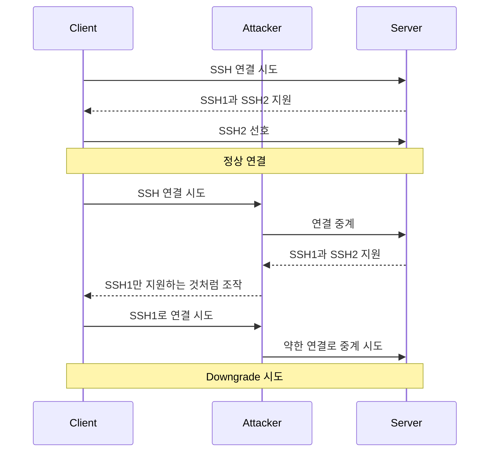

# SSH Downgrade Attack

## 한 줄 요약

SSH Downgrade Attack은 SSH 암호화를 직접 깨는 공격이 아니라, 초기 Version Negotiation / compatibility 경로를 조작해 더 약한 SSH 동작으로 유도하는 MITM 공격이다.

---

## 전제 지식

이 노트는 정상 SSH 구조를 이미 이해했다고 가정한다.

- [[SSH 보안 구조]]

정상 SSH2 연결은 대략 다음 순서로 진행된다.

```text
Version Negotiation
→ Algorithm Negotiation
→ Key Exchange
→ Host Key Verification
→ Encryption / MAC Activation
```

Downgrade Attack은 이 중 **강한 보호가 완전히 활성화되기 전의 초기 협상 경로**를 노린다.

---

## 핵심부터 바로 잡기

> [!important] 핵심
> SSH Downgrade Attack은 SSH 암호화를 직접 깨는 공격이 아니다.
>
> 공격자는 초기 Version Negotiation / compatibility 경로를 조작해, 양쪽이 더 약한 SSH 동작을 선택하도록 유도하려고 한다.

즉, 이 공격의 초점은 다음이 아니다.

```text
암호문을 수학적으로 해독한다
```

대신 다음에 가깝다.

```text
강한 방식으로 연결되기 전에
더 약한 방식으로 협상되게 만든다
```

---

## Version Negotiation이 공격 지점이 되는 이유

SSH 연결 초기에는 클라이언트와 서버가 자신이 지원하는 버전 문자열을 평문으로 교환한다.

예시:

```text
SSH-1.5
SSH-2.0
SSH-1.99
```

PDF 70쪽은 서버가 SSH1과 SSH2를 동시에 허용하도록 설정된 경우, 공격자가 협상 메시지를 조작해 취약한 SSH1 사용을 강제로 유도할 수 있다고 설명한다.

이 시점은 아직 세션 암호화와 MAC이 완전히 활성화되기 전이므로, 중간자가 경로에 있다면 버전 문자열 조작을 시도할 수 있다.

---

## `SSH-1.99`를 어떻게 봐야 하나

`SSH-1.99`는 단순한 “SSH 버전 1.99”라는 뜻이 아니다.

RFC 4253은 SSH 1.x와의 호환 기능이 켜진 서버가 compatibility mode에서 `protoversion`을 `1.99`로 표시할 수 있고, SSH 2.0 클라이언트는 이를 `2.0`과 동일하게 식별해야 한다고 설명한다.

따라서 이 노트에서는 `SSH-1.99`를 다음처럼 이해한다.

```text
SSH2를 지원하면서
구형 SSH1 클라이언트와의 호환 가능성을 나타내는 compatibility banner
```

이 표현은 PDF의 “호환 모드” 설명과도 맞고, “실제 1.99라는 별도 프로토콜 버전”처럼 오해하는 것을 막아준다.

---

## 정상 연결과 Downgrade 연결 비교



PDF 71-72쪽은 정상 연결과 downgrade 연결을 대비해서 보여준다.

---

## Ettercap SSH Filter 해석

PDF 73쪽의 필터는 서버 응답 방향에서 특정 문자열을 찾고 바꾸는 예시다.

```c
if ( replace("SSH-1.99", "SSH-1.51") ) {
    msg("[SSH Filter] SSH downgraded from version 2 to 1\n");
}
```

여기서 핵심은 문자열 치환 자체다.

- `SSH-1.99`
  - 호환 동작 가능성을 나타내는 banner
- `SSH-1.51`
  - 클라이언트가 더 약한 SSH1 계열로 이해하도록 유도하려는 값

다만 이 필터가 **항상 현대 환경에서 성공한다는 뜻은 아니다**.
성공 여부는 실제 클라이언트와 서버가 약한 프로토콜 또는 호환 동작을 허용하는지에 달려 있다.

---

## 공격 성공 조건

공격이 성립하려면 보통 다음 조건이 겹쳐야 한다.

- 공격자가 MITM 위치에 있어야 한다.
- 클라이언트와 서버 양쪽 모두 약한 호환 경로를 실제로 허용해야 한다.
- Version Negotiation 조작이 실제로 반영되어야 한다.
- 사용자가 Host Key warning을 무시하거나, 경고를 보지 못하는 환경이어야 한다.

실습에서 ARP Spoofing이 같이 등장하는 이유도 여기에 있다.

- [[ARP 스푸핑]]

---

## 현대 환경에서의 한계

현대 OpenSSH에서는 SSH1이 비활성화되어 있거나, fallback 자체가 막혀 이 공격이 실패할 수 있다.

OpenSSH 공식 문서는 현재 OpenSSH를 SSH protocol 2.0 구현으로 설명하고, 프로젝트 문서는 SSH1 지원이 7.6에서 제거되었다고 정리한다.

그래서 다음 해석이 중요하다.

```text
공격 실패
≠ 무조건 실습 실패

공격 실패
= 방어가 정상 동작한 결과일 수 있음
```

실습 장비가 최신 클라이언트 / 서버라면, downgrade 시도가 거부되는 편이 오히려 정상일 수 있다.

---

## Host Key warning과 MITM

Host Key는 서버 신원을 확인하는 기준이다.

중간자가 끼어들면 Host Key가 달라졌다는 경고가 날 수 있다.
이 경고를 사용자가 무시하면, 공격자가 기대한 서버 대신 자기 자신을 서버처럼 보이게 하는 MITM 위험이 커진다.

```text
Host Key warning을 본다
→ 원인 확인

Host Key warning을 습관적으로 무시한다
→ MITM 탐지 기회를 버릴 수 있음
```

---

## 방어 관점

- SSH1을 허용하지 않는다.
- SSH2만 사용한다.
- 최신 OpenSSH를 유지한다.
- 약한 알고리즘과 구형 호환 설정을 최소화한다.
- Host Key warning을 무시하지 않는다.
- L2 구간에서 MITM 위치 확보를 어렵게 만든다.
  - [[Dynamic ARP Inspection]]
  - DHCP Snooping
  - 네트워크 분리

---

## 이 노트와 실습 노트의 관계

이 노트는 **왜 downgrade가 가능한지**를 설명한다.

실제 Ettercap 절차와 확인 순서는 별도 노트에서 다룬다.

- [[SSH MITM 실습]]

Ettercap filter 자체의 기본 원리와 평문 TCP 변조는 [[Ettercap Filter 패킷 변조 실습]]에서 먼저 확인한다.

---

## 확인 질문

1. SSH Downgrade Attack은 SSH 암호화를 직접 깨는 공격인가?
2. Version Negotiation이 공격 지점이 되는 이유는 무엇인가?
3. `SSH-1.99`를 “버전 1.99”로만 설명하면 왜 부정확한가?
4. Ettercap filter는 어떤 문자열을 어떤 문자열로 바꾸려고 하는가?
5. 공격자가 MITM 위치에 있어야 하는 이유는 무엇인가?
6. 현대 OpenSSH에서 이 공격이 잘 안 될 수 있는 이유는 무엇인가?
7. 공격 실패가 왜 방어 성공일 수 있는가?
8. Host Key warning을 무시하면 왜 위험한가?

---

## 관련 노트

- [[SSH 보안 구조]]
- [[SSH MITM 실습]]
- [[Ettercap Filter 패킷 변조 실습]]
- [[SSH 암호화 패킷 관찰]]
- [[ARP 스푸핑]]
- [[Dynamic ARP Inspection]]

---

## 참고 자료

- RFC 4253, The Secure Shell (SSH) Transport Layer Protocol
- OpenSSH Goals, SSH1 support removal
