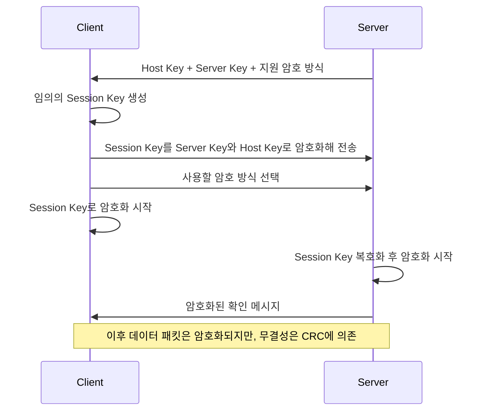
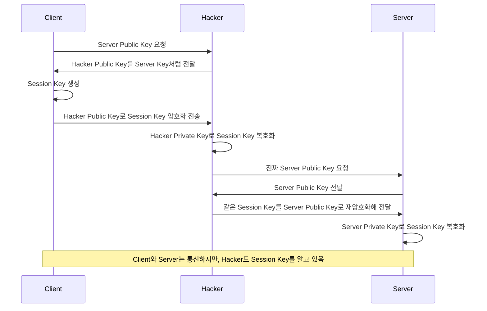
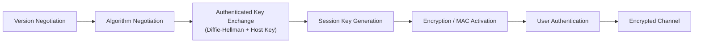
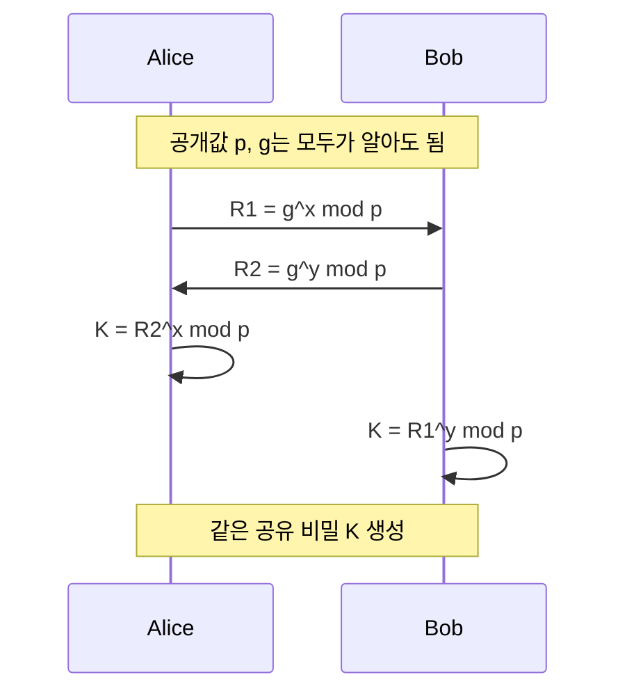

# SSH 보안 구조

## 한 줄 요약

SSH는 원격 접속 과정에서 키 교환, 서버 인증, 암호화, 무결성 검증을 분리해 적용함으로써 Telnet / rlogin 계열의 평문 통신 문제를 개선한 보안 프로토콜이다.

---

## SSH가 등장한 이유

기존 유닉스 원격 접속 도구인 `telnet`, `rlogin`, `rsh`, `rcp`는 인증 정보와 통신 내용이 평문으로 노출될 수 있었다.

그래서 원격 접속과 파일 전송을 보호하기 위해 다음 흐름이 등장했다.

```text
telnet, rlogin, rsh, rcp
→ slogin, ssh, scp
```
>[! failure] 앞에 r 붙어있으면 보안 없는 구닥다리라고 생각해라.

SSH는 단순히 로그인 화면만 감추는 것이 아니라, 원격 접속 세션 전체를 보호하는 방향으로 설계되었다.

관련 비교:

- [[Telnet 평문 노출]]
- [[SSH 암호화 패킷 관찰]]

---

## SSH1과 SSH2

| 항목 | SSH1 | SSH2 |
| --- | --- | --- |
| 기본 성격 | 초기 SSH 프로토콜 | 재설계된 현대 SSH 구조 |
| 키 교환 | 서버 공개키로 Session Key를 암호화해 전달 | 키 교환, 암호화, 무결성, 인증을 분리 |
| 무결성 검증 | CRC 사용 | MAC 사용 |
| 서버 신원 검증 | Host Key 검증 절차가 미흡 | Host Key 검증을 분리된 절차로 수행 |
| 평가 | 암호화는 도입했지만 현대 보안 기준에 미달 | 현재 SSH의 기본 구조 |

SSH1은 “암호화를 넣었다”는 점에서는 진전이 있었지만, **키 교환과 무결성 검증이 충분히 분리되지 않았고**, CRC처럼 암호학적 무결성 검증에 적합하지 않은 방식을 사용했다.

반면 SSH2는 SSH1의 한계를 보완하기 위해 프로토콜 구조 자체를 다시 설계했다.

---

## SSH1의 구조적 한계

PDF 65-66쪽의 핵심은 SSH1이 단순히 “구버전이라 느리다”는 문제가 아니라, 구조 자체가 현대적이지 않다는 점이다.

### SSH1 연결 흐름

SSH1은 서버가 공개키들을 먼저 보내고, 클라이언트가 세션 키를 직접 만들어 그 키를 서버 공개키들로 감싸 보내는 흐름에 가깝다.



즉 SSH1도 세션 전체를 평문으로 보내는 것은 아니었다. 다만 **세션 키 전달 방식과 패킷 무결성 검증 구조가 현대 기준에서는 약했다**는 것이 핵심이다.

### 공개키 바꿔치기 MITM을 단순화하면

강의에서 그린 그림은 SSH1의 전체 정상 절차가 아니라, **해커가 서버 공개키를 자기 공개키로 바꿔치기했을 때 어떤 일이 생기는가**를 단순화한 공격 흐름이다.



이 공격에서 해커는 암호를 깨지 않는다. **클라이언트가 해커 공개키를 서버 공개키로 착각하게 만들어, 클라이언트가 세션 키를 해커에게 직접 암호화해 보내게 만든다.**

| 비교 | 정상 흐름 | 공개키 바꿔치기 MITM |
| --- | --- | --- |
| 클라이언트가 받은 공개키 | 진짜 서버 공개키 | 해커 공개키 |
| Session Key를 풀 수 있는 주체 | 서버만 | 해커와 서버 |
| 암호 알고리즘이 깨졌는가 | 아니오 | 아니오 |
| 진짜 문제 | 없음 | 공개키의 신원을 잘못 믿음 |

> [!important] 핵심
> SSH1 문제를 볼 때 핵심은 “암호화가 없었다”가 아니다.
> **공개키가 진짜 서버의 것인지 못 믿으면, 클라이언트는 해커에게 세션 키를 안전하게 암호화해 보내는 꼴이 될 수 있다.**

### 1. 키 교환과 무결성 검증의 분리 부족

안전한 프로토콜은 보통 다음 두 문제를 분리해서 다룬다.

```text
1. 키를 어떻게 안전하게 합의할 것인가
2. 전송 중 데이터가 바뀌지 않았는지 어떻게 검증할 것인가
```

SSH1은 이 두 역할이 충분히 분리되지 않아, 중간자가 개입했을 때 키 교환과 메시지 검증이 동시에 위협받을 수 있었다.

### 2. CRC의 한계

CRC는 네트워크 오류 탐지에는 쓸 수 있지만, 공격자가 의도적으로 값을 다시 계산해 맞추는 상황을 막는 **암호학적 MAC**은 아니다.

```text
CRC = 우연한 손상 탐지
MAC = 비밀 키를 아는 당사자만 만들 수 있는 무결성 검증값
```

### 3. Host Key 신뢰와 MITM 위험

SSH1은 CRC 기반 무결성 등 프로토콜 전체가 현대 기준에 약했고, Host Key 신뢰가 깨지면 MITM 위험도 커질 수 있었다.

---

## SSH2의 보안 구조

SSH2의 정상 흐름은 다음처럼 이해할 수 있다.

```text
Version Negotiation
→ Algorithm Negotiation
→ Authenticated Key Exchange
   (Diffie-Hellman + Host Key)
→ Session Key Generation
→ Encryption / MAC Activation
→ User Authentication
→ Encrypted Channel
```

입문용으로 순서를 나눠 적었지만, 실제 SSH2에서는 Host Key 인증이 Key Exchange에 결합되어 수행된다.



이 구조에서 중요한 점은 **역할이 분리되어 있다**는 것이다.

- 키 교환은 공유 비밀을 만든다.
- Host Key는 서버 신원을 확인한다.
- KDF는 실제 세션 키들을 만든다.
- MAC은 메시지 변조를 검증한다.

---

## Version Negotiation

SSH 연결이 시작되면 클라이언트와 서버는 자신이 지원하는 프로토콜 버전 문자열을 먼저 교환한다.

예시:

```text
SSH-1.5
SSH-2.0
SSH-1.99
```

PDF 70쪽은 이 단계가 **Clear Text**로 이뤄진다고 설명한다.

다만 `SSH-1.99`는 단순한 “1.99 버전”이라는 뜻이 아니다.
RFC 4253은 구형 SSH 1.x와의 호환 기능이 켜진 서버가 `1.99`를 식별 문자열로 사용할 수 있고, SSH 2.0 클라이언트는 이를 `2.0`과 동일하게 식별해야 한다고 설명한다.

즉, 이 문자열은 **SSH2를 지원하면서 SSH1 호환 가능성을 나타내는 compatibility banner**로 이해하는 편이 안전하다.

이 초기 협상 단계가 공격 표면이 되는 이유는 별도 노트에서 다룬다.

- [[SSH Downgrade Attack]]

---

## Diffie-Hellman Key Exchange

Diffie-Hellman은 안전하지 않은 네트워크 위에서도 양쪽이 같은 **Shared Secret**을 계산하게 해주는 키 교환 방식이다.

중요한 점은 다음이다.

```text
Diffie-Hellman이 만드는 것
= Shared Secret

실제 통신에 바로 쓰는 최종 키
≠ Shared Secret 그 자체
```

공유 비밀은 이후 KDF의 입력으로 들어간다.
![[40_자료/캡쳐 창고/5-13 네트워크보안 4.webp]]

[[5-13 네트워크보안.pdf#page=69&rect=97,77,657,448|5-13 네트워크보안, p.69]]

### 69페이지 그림 읽기

이 그림은 Diffie-Hellman의 원리를 작은 숫자로 단순화한 예시다.



공개 채널에는 다음 값이 지나간다.

```text
p = 23
g = 5
```

각자가 따로 숨기는 비밀값은 다음과 같다.

```text
Alice의 비밀값 a = 4
Bob의 비밀값 b = 3
```

각자는 자기 비밀값으로 공개값을 만든 뒤 상대에게 보낸다.

```text
Alice: A = g^a mod p = 5^4 mod 23 = 4
Bob:   B = g^b mod p = 5^3 mod 23 = 10
```

그다음 서로에게서 받은 공개값에 자기 비밀값을 다시 적용한다.

```text
Alice: s = B^a mod p = 10^4 mod 23 = 18
Bob:   s = A^b mod p = 4^3 mod 23 = 18
```

결과적으로 Alice와 Bob은 같은 값 `18`을 얻는다.

> [!important] 그림에서 꼭 볼 것
> 공개 채널에는 `p`, `g`, `A`, `B`가 지나가지만, 각자의 비밀값 `a`, `b`는 지나가지 않는다.
> 그런데도 양쪽은 같은 Shared Secret을 계산한다.

>[! success] 이 그림의 학습 포인트는 수학식을 길게 외우는 것이 아니라, **비밀값을 직접 보내지 않고도 양쪽이 같은 Shared Secret에 합의할 수 있다**는 구조를 이해하는 것이다.

---

## KDF와 세션 키

KDF, Key Derivation Function은 공유 비밀과 세션 문맥을 바탕으로 실제 통신에 쓸 여러 키를 파생한다.

예:

- `Client → Server` 암호화 키
- `Server → Client` 암호화 키
- MAC 키
- 구현에 따라 IV 등 추가 값

따라서 SSH는 “키 하나로 전부 처리하는 구조”가 아니라, **방향과 목적에 따라 나뉜 키 집합**을 만든다고 보는 편이 맞다.

---

## Host Key 검증

Host Key는 서버가 정말 기대한 서버인지 확인하는 기준이다.

사용자가 처음 접속한 서버의 Host Key를 저장해두고, 이후 접속 때 다른 키가 나타나면 경고가 날 수 있다.
이 경고를 무시하면 중간자가 가짜 서버를 가장하는 상황을 놓칠 위험이 커진다.

```text
암호화만 있음
→ 누구와 암호화했는지는 불명확할 수 있음

Host Key 검증까지 있음
→ 기대한 서버와 연결 중인지 확인 가능
```

---

## MAC 기반 무결성 검증

MAC, Message Authentication Code는 메시지가 전송 중 바뀌지 않았는지 검증한다.

CRC와 다른 점은 다음이다.

| 항목 | CRC | MAC |
| --- | --- | --- |
| 목적 | 우연한 오류 탐지 | 악의적 변조 탐지 |
| 비밀 키 필요 | 없음 | 필요 |
| 공격자 재계산 대응 | 약함 | 강함 |

SSH2는 암호화와 함께 MAC을 사용해 메시지 변조 여부를 확인한다.

---

## 정상 SSH와 패킷 관찰

정상 SSH 세션을 Wireshark로 보면 초기 배너와 Key Exchange 단계는 관찰할 수 있다.
하지만 `New Keys` 이후에는 패킷이 `Encrypted packet`으로 표시되고, Telnet처럼 `Username`이나 `Password`가 평문으로 보이지 않는다.

이 차이는 다음 실습 노트에서 직접 확인했다.

- [[SSH 암호화 패킷 관찰]]

---

## 확인 질문

1. SSH는 Telnet / rlogin 계열의 어떤 문제를 해결하려고 등장했는가?
2. SSH1과 SSH2의 가장 큰 구조적 차이는 무엇인가?
3. CRC가 MAC을 대체할 수 없는 이유는 무엇인가?
4. Version Negotiation은 정상 연결에서 어떤 역할을 하는가?
5. `SSH-1.99`는 왜 단순한 “버전 1.99”로 보면 안 되는가?
6. Diffie-Hellman은 무엇을 만들고, 무엇을 직접 만들지는 않는가?
7. KDF는 왜 필요한가?
8. Host Key 검증은 어떤 공격을 줄이는가?
9. SSH 패킷에서 `New Keys` 이후 관찰 양상이 어떻게 달라지는가?

---

## 관련 노트

- [[SSH Downgrade Attack]]
- [[SSH MITM 실습]]
- [[SSH 암호화 패킷 관찰]]
- [[Telnet 평문 노출]]
- [[ARP 스푸핑]]

---

## 참고 자료

- RFC 4253, The Secure Shell (SSH) Transport Layer Protocol
