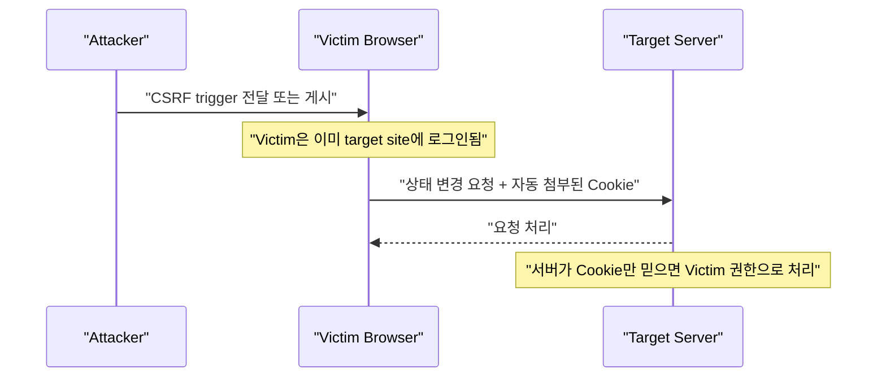

# CSRF

source:

- [[40_자료/강의 자료/5-20_웹보안.pdf|5-20 웹보안]], p.98-106
- [OWASP Cross-Site Request Forgery Prevention Cheat Sheet](https://cheatsheetseries.owasp.org/cheatsheets/Cross-Site_Request_Forgery_Prevention_Cheat_Sheet.html)
- [OWASP WSTG - Testing for Cross Site Request Forgery](https://owasp.org/www-project-web-security-testing-guide/latest/4-Web_Application_Security_Testing/06-Session_Management_Testing/05-Testing_for_Cross_Site_Request_Forgery)
- [MDN Set-Cookie header](https://developer.mozilla.org/en-US/docs/Web/HTTP/Reference/Headers/Set-Cookie)
- [MDN Sec-Fetch-Site header](https://developer.mozilla.org/en-US/docs/Web/HTTP/Reference/Headers/Sec-Fetch-Site)

## 한 줄 요약

CSRF(Cross-Site Request Forgery)는 **피해자가 로그인해 둔 브라우저를 이용해, 피해자가 의도하지 않은 상태 변경 요청을 서버에 보내게 만드는 공격**이다.

서버가 `Session Cookie가 붙은 요청 = 사용자가 의도한 요청`이라고만 판단하면 위험하다. 브라우저는 같은 사이트로 가는 요청에 Cookie를 자동으로 붙이기 때문에, 공격자는 비밀번호나 Session Token 값을 직접 몰라도 피해자 권한의 요청을 유도할 수 있다.

---

## 먼저 잡아야 할 핵심

- CSRF의 핵심은 Cookie 탈취가 아니라 **피해자 브라우저가 자동으로 인증 정보를 붙여 보낸다는 점**이다.
- 공격자는 서버 기능의 요청 구조를 알아야 한다. 예: URL, method, parameter, 필요한 header.
- 취약한 서버는 상태 변경 기능을 처리할 때 Session Cookie만 보고 권한을 인정한다.
- Same-Origin Policy는 공격자가 응답을 읽는 것을 제한하지만, 브라우저가 요청을 보내는 것 자체를 항상 막지는 않는다.
- GET을 POST로 바꾸는 것만으로는 부족하다. 자동 제출 form으로 POST 방식 CSRF도 가능하다.
- 제대로 막으려면 서버가 `사용자 세션` 외에 `요청 의도`를 확인해야 한다.

---

## 왜 중요한가

CSRF는 “비밀번호를 맞히는 공격”도 아니고 “Session Token을 훔치는 공격”도 아니다. 더 교묘한 지점은 **브라우저가 사용자를 대신해 인증 정보를 자동으로 붙여 준다**는 점이다.

로그인된 사용자가 어떤 페이지를 열었을 때 브라우저는 대상 사이트로 가는 요청에 Cookie를 붙인다. 서버가 그 Cookie만 보고 “사용자가 의도한 요청”이라고 판단하면, 공격자는 사용자를 속여 서버 기능을 실행시킬 수 있다.

PDF p.99가 말하는 `One-click Attack` / `Zero-click Attack`도 이 감각으로 이해하면 된다.

| 표현 | 의미 |
|---|---|
| One-click Attack | 피해자가 링크나 버튼을 한 번 누르면 상태 변경 요청이 발생한다. |
| Zero-click Attack | 피해자가 페이지를 열람하기만 해도 이미지, iframe, 자동 form 등으로 요청이 발생할 수 있다. |

---

## 공격 흐름



서버 로그 관점에서는 요청이 피해자 브라우저에서 온 것처럼 보인다. 그래서 PDF p.98이 “공격자의 IP 추적이 어렵다”고 말한 것이다. 공격자가 서버에 직접 요청하는 것이 아니라, 피해자 브라우저가 요청을 보내도록 유도하기 때문이다.

트리거 전달 방식은 XSS처럼 Stored / Reflective 둘 다 가능하다. 게시글처럼 서버에 저장된 내용을 피해자가 읽어도 되고, 링크나 외부 페이지처럼 그 순간 전달된 내용을 열람해도 된다.

---

## 공격 조건

CSRF는 다음 조건이 겹칠 때 성립한다.

| 조건 | 의미 | 확인 지점 |
|---|---|---|
| Victim이 로그인 상태 | 브라우저가 대상 사이트 Cookie를 가지고 있다. | `Cookie` header, 로그인 상태 |
| 상태 변경 endpoint 존재 | 회원정보 변경, 글 작성, 삭제, 송금처럼 서버 상태가 바뀐다. | method, URL, parameter |
| 요청 구조가 예측 가능 | 공격자가 필요한 parameter를 채울 수 있다. | 정상 요청 캡처 |
| 서버가 Cookie만 신뢰 | 요청 안에 사용자가 직접 받은 CSRF token, Origin 검증, 재인증이 없다. | hidden field, header, server-side check |
| 브라우저가 요청을 자동 전송 | `img`, `form`, `script`, redirect 등으로 요청이 발생한다. | Network/Proxy log |

핵심은 공격자가 응답을 읽을 수 있는지가 아니다. **서버가 요청을 처리해 상태를 바꾸는지**가 먼저다.

PDF p.100의 예시처럼 대상은 특정 기능 하나로 고정되지 않는다. 댓글 자동 작성, 친구 등록, 회원정보 변경, 포인트 기부, 좋아요/싫어요처럼 **로그인 사용자가 할 수 있고 서버 상태가 바뀌는 기능**이면 CSRF 대상이 될 수 있다. 관리자가 DB 삭제 기능을 웹에서 실행할 수 있게 만들어 두었다면 그 기능도 이론상 공격 범위가 될 수 있다는 점이 p.99의 “공격 범위” 설명이다.

---

## XSS와 CSRF의 차이

| 구분 | XSS | CSRF |
|---|---|---|
| 공격 수행 지점 | 피해자 브라우저, 즉 클라이언트에서 공격자 코드가 실행된다. | 서버가 제공하는 기능을 피해자 권한으로 실행하게 만든다. |
| 기능 구현 | 공격자가 script를 직접 구성한다. | 서버에 이미 있는 기능을 도용한다. |
| Script 사용 여부 | 보통 script 실행 가능성이 핵심이다. | script 없이도 `img`, link, 자동 resource 요청으로 가능할 수 있다. POST 자동 제출에는 script가 자주 쓰인다. |
| 공격 전 준비 | XSS 취약 입력/출력 지점을 찾는다. | 공격하려는 기능의 Request/Response 구조를 분석해야 한다. |
| 공격 감지 | Stored/Reflective XSS는 삽입 위치나 실행 위치를 비교적 추적할 수 있다. | 서버 입장에서는 로그인 사용자의 정상 요청처럼 보일 수 있어 구분이 어렵다. |
| 공격자가 얻는 것 | DOM 접근, Cookie 읽기, 화면 조작, 같은 origin 요청 실행 등 | 서버 기능이 피해자 권한으로 실행된 결과 |
| 응답 읽기 | target origin에서 script가 실행되면 응답/DOM 접근 범위가 커질 수 있다. | 일반적인 cross-site CSRF는 응답을 읽지 못해도 상태 변경이 목적이면 충분하다. |
| 대표 방어 | 문맥별 출력 인코딩, 안전한 HTML 처리, CSP 보조 통제 | CSRF token, SameSite, Origin/Referer 검증, Fetch Metadata, 재인증 |

수업 표의 "공격 수행 지점"은 이렇게 바꿔 이해하는 편이 정확하다.

```text
XSS  -> 피해자 브라우저 안에서 코드 실행이 핵심
CSRF -> 서버 기능 요청을 피해자 인증 상태로 보내게 만드는 것이 핵심
```

---

## GET과 POST

상태 변경 기능을 GET으로 열어 두면 특히 위험하다.

```text
GET /member/modify?nickname=hacked
```

이런 요청은 이미지 태그, 링크, redirect 등으로 쉽게 유도될 수 있다. PDF p.103의 예시도 `img` 요청처럼 보이지만 실제로는 회원정보 변경 URL을 호출한다. `%20 width=0 height=0` 같은 표현은 화면에는 거의 보이지 않는 숨은 요청을 만들려는 의도다.

```text
img src = 브라우저야, 이 주소에서 이미지를 가져와.
```

하지만 서버 입장에서는 그 주소가 이미지인지보다, **그 URL이 상태 변경 기능을 실행하는지**가 더 중요하다.

상태를 바꾸는 기능은 GET이 아니라 POST, PUT, PATCH, DELETE 같은 method를 쓰는 것이 맞다.

하지만 POST도 CSRF 방어가 아니다. 공격자는 hidden form을 만들고 자동 submit을 유도할 수 있다.

```html
<form id="csrfForm" method="POST" action="http://<LAB_WEB_HOST>/member/modify">
  <input type="hidden" name="nickname" value="csrf_test">
</form>
<script>
document.getElementById("csrfForm").submit();
</script>
```

따라서 method 정리는 기본 위생이고, 실제 방어는 서버 측 검증이 해야 한다.

PDF p.105가 form reference 방법으로 `document.Forms[]`, `document.getElementById()`, `document.getElementByName()`을 보여주는 이유는, 공격자가 form 객체를 찾아 자동 제출할 수 있다는 점을 설명하려는 것이다. 실제 JavaScript에서는 보통 `document.forms[]`, `document.getElementById()`, `document.getElementsByName()`처럼 쓴다.

---

## 방어 기준

PDF p.106의 대응책은 아래처럼 요약할 수 있다.

| PDF 대응책 | 현재식 해석 |
|---|---|
| XSS 취약점이 없도록 확인 | XSS가 있으면 CSRF token 탈취나 같은 origin 요청 실행으로 CSRF 방어가 약해질 수 있다. |
| 웹 클라이언트로부터 전달된 세션 토큰의 진위성 확인 | 단순히 Cookie가 붙었는지가 아니라, 요청자가 정상 화면에서 받은 검증 값을 함께 보냈는지 확인한다. |
| Session Token만을 이용한 권한 부여 금지 | Cookie만으로 상태 변경을 허용하지 말고 요청 의도를 증명할 추가 값이 필요하다. |
| 중요 기능 재인증 | 이메일, 전화, SMS, 비밀번호 재입력, MFA 같은 추가 확인을 요구한다. |
| GET보다 POST 권장, 단 POST도 불충분 | method는 기본 위생일 뿐, POST도 hidden form으로 CSRF가 가능하다. |
| 사용 후 로그아웃 | 사용자 습관 차원의 보조 대응이다. 서버 측 방어를 대체하지 않는다. |

현대적인 방어는 PDF 대응책을 아래처럼 구체화한다.

| 방어 | 막는 지점 | 메모 |
|---|---|---|
| Framework 내장 CSRF 보호 | token 생성/검증 실수 감소 | 직접 구현 전에 프레임워크 기능을 먼저 확인한다. |
| Synchronizer Token Pattern | 서버가 세션별 또는 요청별 token을 발급하고 요청에서 검증 | stateful 서버에서 기본형으로 보기 좋다. |
| Signed Double-Submit Cookie | stateless 환경에서 session-bound HMAC token을 cookie와 요청값으로 검증 | 단순 double-submit cookie는 subdomain/cookie injection에 약할 수 있다. |
| Origin / Referer 검증 | 요청 출처가 target origin과 맞는지 확인 | 보조 방어로 유용하지만 proxy, privacy 설정, 누락 케이스를 고려해야 한다. |
| SameSite Cookie | cross-site 요청에서 Cookie 전송 범위 제한 | 중요한 방어층이지만 token을 대체하기보다 함께 쓴다. |
| Fetch Metadata | `Sec-Fetch-Site` 같은 header로 cross-site 상태 변경 요청 차단 | 현대 브라우저 대상 서비스에서 보조 방어로 쓸 수 있다. |
| 재인증 / 사용자 상호작용 | 매우 민감한 기능에서 마지막 확인 | 비밀번호 재입력, MFA, email/SMS 확인 등. |
| XSS 방어 | token 탈취, client-side CSRF, DOM 조작 방지 | CSRF token이 있어도 XSS가 있으면 방어가 약해질 수 있다. |

OWASP도 상태 변경 요청에는 CSRF token 검증을 적용하고, framework 내장 보호 기능이 있으면 먼저 쓰라고 권장한다. 또 XSS가 있으면 CSRF 방어를 우회할 수 있으므로 XSS 방어를 별도로 유지해야 한다고 본다.

---

## SameSite를 볼 때 주의할 점

`SameSite`는 브라우저가 cross-site 요청에 Cookie를 붙일지 결정하는 Cookie 속성이다.

| 값 | 의미 | CSRF 관점 |
|---|---|---|
| `Strict` | cross-site 문맥에서는 Cookie를 보내지 않는다. | 가장 강하지만 사용성 문제가 생길 수 있다. |
| `Lax` | top-level navigation과 안전 method 중심으로 제한적으로 보낸다. | 기본값처럼 동작하는 브라우저가 있지만, 모든 CSRF 방어를 맡기기에는 부족할 수 있다. |
| `None` | same-site와 cross-site 요청 모두에 보낸다. | `Secure`가 함께 필요하다. 외부 연동이 필요한 경우 신중히 쓴다. |

실무에서는 `SameSite`를 **CSRF token을 대체하는 단일 방어책**으로 보기보다, CSRF token, Origin/Referer 검증, Fetch Metadata, 재인증과 함께 쓰는 방어층으로 보는 편이 안전하다.

---

## 오해하기 쉬운 지점

| 오해 | 정정 |
|---|---|
| CSRF는 Cookie를 훔치는 공격이다. | Cookie를 훔치는 것이 아니라, 브라우저가 Cookie를 자동 전송하는 특성을 악용한다. |
| Same-Origin Policy가 있으니 CSRF 요청도 막힌다. | SOP는 주로 응답 읽기를 제한한다. 요청 전송과 상태 변경은 별도 문제다. |
| POST면 CSRF가 안 된다. | hidden form과 자동 submit으로 POST도 유도할 수 있다. |
| CSRF token을 cookie에만 넣으면 된다. | cookie는 cross-site 요청에도 자동 전송될 수 있다. token은 요청 parameter/header로도 명시적으로 제출되어야 한다. |
| 로그아웃만 잘하면 충분하다. | 사용자 습관은 보조책이다. 서버 기능은 로그인 상태 사용자를 전제로 안전해야 한다. |
| CSRF는 Session Hijacking과 같다. | 둘 다 권한 도용처럼 보이지만 방식이 다르다. Session Hijacking은 세션 토큰 자체를 훔쳐 재사용하는 쪽이고, CSRF는 피해자 브라우저가 자기 세션으로 요청하게 만드는 쪽이다. |
| XSS와 CSRF는 완전히 별개다. | 원리는 다르지만 XSS가 있으면 CSRF token 탈취나 같은 origin 요청 실행으로 CSRF 방어가 약해질 수 있다. |

---

## 실무 / TMI

- 중요한 상태 변경 기능은 `GET`으로 만들지 않는다. 이미 그렇게 되어 있다면 method 변경과 CSRF 검증을 함께 적용한다.
- API-only 서비스는 custom header, CORS 정책, Fetch Metadata를 함께 봐야 한다. 단, CORS는 CSRF 방어 그 자체가 아니다.
- Login CSRF도 별도로 볼 수 있다. 사용자를 공격자 계정으로 로그인시키는 흐름이 생기면 이후 사용자의 행동이 공격자 계정에 묶일 수 있다.
- Cookie는 가능하면 `Secure`, `HttpOnly`, `SameSite`를 함께 보고, host-bound cookie가 필요하면 `__Host-` prefix 조건도 검토한다.
- 관리자 기능, 결제, 계정정보 변경, 이메일 변경, MFA 설정 변경은 token 외에도 재인증이나 추가 확인을 고려한다.

---

## PDF p.98-106 흡수 체크

| page | PDF 항목 | 이 노트에서 흡수한 위치 |
|---|---|---|
| p.98 | Victim에 의해 Request 발생, 공격자 IP 추적 어려움 | `왜 중요한가`, `공격 흐름` |
| p.98 | JavaScript 없이도 가능 | `GET과 POST`, `XSS와 CSRF의 차이` |
| p.98 | Request/Response 분석 필요 | `공격 조건`, `XSS와 CSRF의 차이` |
| p.98 | Session Token만으로 권한 인증 시 가능 | `공격 조건`, `방어 기준` |
| p.99 | XSRF, C-Surf, One-click / Zero-click | aliases, `왜 중요한가` |
| p.99 | 신뢰된 사용자 권한으로 요청 | `한 줄 요약`, `왜 중요한가` |
| p.99 | Session Hijacking과 유사한 권한 도용 | `오해하기 쉬운 지점`, `관련 노트` |
| p.99-p.100 | 공격 범위와 예시 | `공격 조건`, `실무 / TMI` |
| p.101 | Stored / Reflective 방식 모두 가능 | `공격 흐름`, `GET과 POST` |
| p.102 | XSS와 CSRF 차이 표 | `XSS와 CSRF의 차이` |
| p.103-p.104 | 게시글 열람 시 회원정보 자동 변경 실습 | [[10_학습 노트/시스템보안/웹보안/CSRF를 이용한 회원정보 변경 실습|CSRF를 이용한 회원정보 변경 실습]] |
| p.105 | POST 방식 form 자동 제출 | `GET과 POST` |
| p.106 | 대응책과 로그아웃 | `방어 기준`, `오해하기 쉬운 지점` |

---

## 이 vault에서 쓰는 법

- 이 노트는 `5-20_웹보안.pdf` p.98-106의 stable concept note로 쓴다.
- 회원정보 변경과 게시글 작성 CSRF 재현 증거는 [[10_학습 노트/시스템보안/웹보안/CSRF를 이용한 회원정보 변경 실습|CSRF를 이용한 회원정보 변경 실습]]에 둔다.
- XSS와 비교할 때는 [[10_학습 노트/시스템보안/웹보안/XSS|XSS]]를 같이 본다. XSS가 있으면 CSRF token 탈취나 same-origin 요청 실행으로 CSRF 방어가 약해질 수 있다.
- 세션 쿠키 자동 전송과 `SameSite`는 [[10_학습 노트/시스템보안/웹보안/세션과 쿠키|세션과 쿠키]]와 연결해서 본다.
- PDF 순서로 이어서 볼 다음 범위는 [[10_학습 노트/시스템보안/웹보안/SQL Injection을 위한 SQL 기초|SQL Injection을 위한 SQL 기초]] p.107-114이다.

---

## 관련 노트

- [[10_학습 노트/시스템보안/웹보안/CSRF를 이용한 회원정보 변경 실습|CSRF를 이용한 회원정보 변경 실습]]
- [[10_학습 노트/시스템보안/웹보안/XSS|XSS]]
- [[10_학습 노트/시스템보안/웹보안/XSS를 이용한 Session Token 탈취 실습|XSS를 이용한 Session Token 탈취 실습]]
- [[10_학습 노트/시스템보안/웹보안/Web Session Hijacking|Web Session Hijacking]]
- [[10_학습 노트/시스템보안/웹보안/HTTP Method와 Header|HTTP Method와 Header]]

---

## 참고 자료

- [OWASP Cross-Site Request Forgery Prevention Cheat Sheet](https://cheatsheetseries.owasp.org/cheatsheets/Cross-Site_Request_Forgery_Prevention_Cheat_Sheet.html)
- [OWASP WSTG - Testing for Cross Site Request Forgery](https://owasp.org/www-project-web-security-testing-guide/latest/4-Web_Application_Security_Testing/06-Session_Management_Testing/05-Testing_for_Cross_Site_Request_Forgery)
- [MDN Set-Cookie header](https://developer.mozilla.org/en-US/docs/Web/HTTP/Reference/Headers/Set-Cookie)
- [MDN Sec-Fetch-Site header](https://developer.mozilla.org/en-US/docs/Web/HTTP/Reference/Headers/Sec-Fetch-Site)

---

## 확인 질문

1. CSRF가 Session Token을 훔치지 않아도 성립하는 이유는 무엇인가?
2. GET을 POST로 바꿔도 CSRF 방어가 끝나지 않는 이유는 무엇인가?
3. CSRF token은 왜 Session Cookie와 별도로 검증되어야 하는가?
4. XSS가 있으면 CSRF 방어가 왜 약해질 수 있는가?
5. `SameSite=Lax`와 `SameSite=Strict`의 보안/사용성 차이는 무엇인가?
