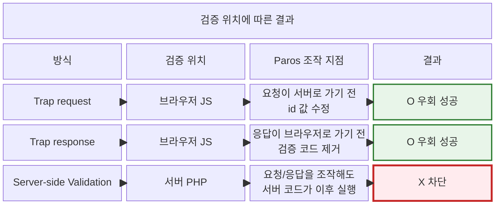
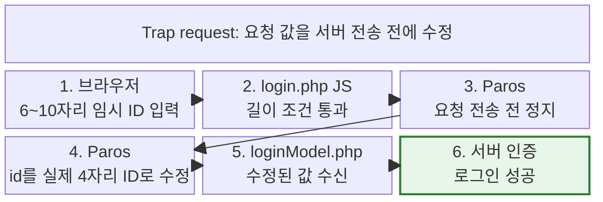
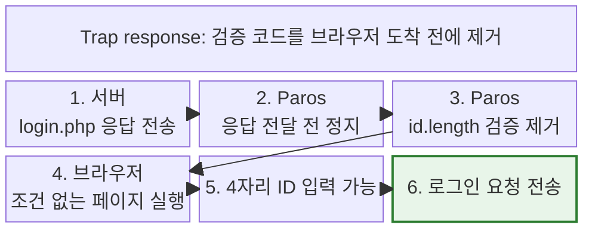
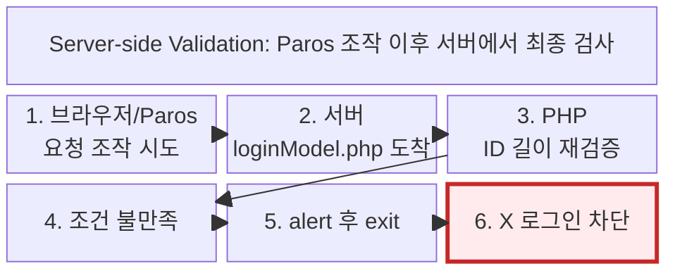

# Client-side Validation 우회와 Server-side Validation 실습

## 실습 개요

한 줄 요약: **Paros로 브라우저 단계의 입력 검증을 우회하고, 같은 조건이 서버 PHP에 있을 때는 차단되는 차이를 확인한 lab note다.**

이 노트는 원래 `Hydra 로그인 Brute Force 실습` 안에 함께 있던 p.75-76 입력 검증 위치 실습을 분리한 것이다. 공통 실습 환경은 [[10_학습 노트/시스템보안/웹보안/웹보안 LAMP 실습 환경 구축|웹보안 LAMP 실습 환경 구축]]에 둔다.

| 항목 | 내용 |
|---|---|
| 핵심 PDF 범위 | p.75-76 `Type of Validation`, `Bypassing Client Side Validation` |
| 관찰/조작 도구 | Paros |
| 핵심 실습 | Trap request, Trap response, Server-side Validation |
| 핵심 결론 | 보안 판단은 브라우저가 아니라 서버에서 해야 한다 |

---
## p.75-76 입력 검증 위치 실습

### 3. p.75-76 검증 위치 실습 - 우회되는 검증과 차단되는 검증

한 줄 결론: **같은 ID 길이 조건이라도 브라우저에 있으면 우회되고, 서버에 있으면 Paros만으로는 지울 수 없다.**

PDF p.75는 데이터 검증 방식을 `Client Side Validation`과 `Server Side Validation`으로 나눈다. p.76은 Client-side Validation을 우회하는 방법으로 소스코드 수정과 Web Proxy Tool을 이용한 Request/Response 조작을 보여준다. 오늘 실습은 그중 Paros를 이용해 Request와 Response를 직접 조작하는 흐름이다.

정밀하게 말하면 로그인 요청이 `login.php`를 "지나서" 서버로 가는 것은 아니다. 브라우저가 먼저 `login.php`를 받아 로그인 화면과 JavaScript 검증 코드를 실행하고, 검증을 통과하면 `POST /member/loginModel.php` 요청을 만든다.

#### 전체 구조



#### 실습 전제: 브라우저에 ID 길이 조건을 넣음

DB에는 4자리 ID를 가진 실습 계정이 있다. 그런데 `login.php`에는 다음 JavaScript 검증을 추가했다.

```javascript
if(id.length < 6 || id.length > 10){
  alert('아이디는 6~10자리를 입력하세요.');
  return;
}
```

이 조건이 있으면 브라우저 화면에서 실제 4자리 ID를 그대로 입력했을 때 로그인 요청이 만들어지지 않는다. 하지만 이것은 DB나 서버가 막은 것이 아니라, **브라우저에서 실행되는 JavaScript가 막은 것**이다.

관찰된 기본 요청 흐름:

- `GET /index.php`
- `GET /member/login.php`
- `POST /member/loginModel.php`
- 로그인 처리 후 `GET /index.php`

![[Pasted image 20260521155759.png]]

Paros에 로그인 요청이 잡힌 화면. 요청 본문에는 `id=<REDACTED>&pw=<REDACTED>` 형태의 폼 데이터가 보인다.

![[Pasted image 20260521155726.png]]

서버 응답이 Paros에 잡힌 화면. 응답 본문은 JavaScript로 로그인 결과를 알리고 이동시키는 구조다.

#### A. Trap request - 조건을 통과한 뒤 요청 값을 바꾼다

첫 번째 우회는 브라우저에는 조건에 맞는 아무 ID/PW를 넣고, 로그인 요청이 서버로 가기 직전에 Paros에서 값을 바꾸는 방식이다.



브라우저에는 JavaScript 길이 검증을 통과할 수 있는 6~10자리 임시 ID를 입력한다. 그러면 브라우저는 정상적으로 `POST /member/loginModel.php` 요청을 만들려고 한다.

![[Pasted image 20260521155620.png]]

Paros에서 `Trap request`를 켜두면 이 요청이 서버에 도착하기 전에 멈춘다. 이때 요청 본문은 대략 다음 형태다.

```text
id=<6~10자리_임시_ID>&pw=<REDACTED>
```

여기서 `id` 값을 DB에 실제 존재하는 4자리 실습 계정 ID로 바꾼 뒤 `Continue`를 누른다.

```text
id=<실제_4자리_ID>&pw=<REDACTED>
```

서버에는 브라우저가 처음 입력한 임시 ID가 아니라, Paros에서 바꾼 ID가 도착한다. 서버가 ID 길이를 다시 검사하지 않으면 로그인은 성공한다.

![[Pasted image 20260521160153.png]]

#### B. Trap response - 조건 코드 자체를 브라우저에 안 보낸다

두 번째 우회는 요청을 바꾸는 것이 아니라, 서버가 내려주는 `login.php` 응답에서 JavaScript 검증 코드를 지우는 방식이다.



로그인 페이지 응답 안에는 다음 JavaScript 검증 코드가 포함되어 있었다.

```javascript
if(id.length < 6 || id.length > 10){
  alert('아이디는 6~10자리를 입력하세요.');
  return;
}
```

Paros에서 `Trap response`를 켜고 이 부분을 제거한 뒤 `Continue`를 누르면, 브라우저는 검증 코드가 빠진 HTML/JavaScript를 받는다.

이 방식은 서버 파일을 수정한 것이 아니다. 서버는 원래 응답을 보냈지만, Paros가 브라우저에 전달되기 전에 응답을 바꿨다. 그래서 브라우저 입장에서는 처음부터 ID 길이 조건이 없는 로그인 페이지를 받은 것처럼 동작한다.

#### C. Server-side Validation - Paros 뒤에서 다시 검사한다

세 번째 단계에서는 같은 ID 길이 조건을 `loginModel.php`에 추가했다.

```php
$idLen = strlen($id);
if($idLen < 6 || $idLen > 10){
    echo "<script>alert('아디 6~10자 입력.'); history.go(-1); </script>";
    exit;
}
```

조건식은 비슷하지만 실행 위치가 다르다. JavaScript 검증은 브라우저에서 실행되므로 Request/Response 조작으로 우회할 수 있다. 반면 이 PHP 검증은 서버가 요청을 받은 뒤 `loginModel.php` 안에서 실행된다.



이 상태에서는 `Trap request`로 ID 값을 바꿔도 서버에서 다시 걸린다. `Trap response`로 브라우저의 JavaScript 검증 코드를 지워도 서버 PHP 검증 코드는 지워지지 않는다. Paros는 브라우저와 서버 사이 HTTP 데이터를 조작하는 도구이지, 서버 안에서 실행되는 PHP 코드를 제거하는 도구가 아니기 때문이다.

따라서 정확한 결론은 이렇다.

- Client-side Validation은 사용자 편의와 불필요한 요청 감소에는 유용하다.
- 하지만 브라우저 JavaScript, 요청 본문, 서버 응답은 사용자가 프록시로 조작할 수 있다.
- 보안 판단은 Server-side Validation에서 해야 한다.
- 로그인에서는 `loginModel.php`가 ID 길이, 입력 형식, 인증 로직을 최종적으로 검증해야 한다.


---

## 진행 로그

### 2026-05-21

- 로그인 페이지에 ID 길이 검증 JavaScript를 추가하고, 브라우저 단계에서 4자리 ID 로그인이 막히는 것을 확인.
- Paros `Trap request`로 브라우저가 보낸 로그인 요청을 멈춘 뒤 ID 값을 바꿔 서버로 전달하는 흐름 확인.
- Paros `Trap response`로 서버가 내려준 로그인 페이지 응답에서 JavaScript 검증 코드를 제거하는 흐름 확인.
- `loginModel.php`에 같은 ID 길이 검증을 추가하여, Paros로 요청/응답을 조작해도 서버에서 최종 차단되도록 하는 Server-side Validation 단계까지 정리.

## 보안 관찰 포인트

- Paros 프록시는 브라우저와 WEB 서버 사이의 HTTP 요청/응답을 관찰하거나 바꾸는 위치에 선다.
- Client-side Validation은 사용자 편의와 불필요한 요청 감소에는 유용하지만, 보안 판단의 최종 근거가 될 수 없다.
- 로그인에서는 `loginModel.php`가 ID 길이, 입력 형식, 인증 로직을 최종적으로 검증해야 한다.

## 관련 노트

- [[10_학습 노트/시스템보안/웹보안/웹보안 LAMP 실습 환경 구축|웹보안 LAMP 실습 환경 구축]]
- [[10_학습 노트/시스템보안/웹보안/Hydra 로그인 Brute Force 실습|Hydra 로그인 Brute Force 실습]]
- [[10_학습 노트/시스템보안/웹보안/웹 애플리케이션 구조|웹 애플리케이션 구조]]
- [[10_학습 노트/시스템보안/웹보안/HTTP 구조와 메시지|HTTP 구조와 메시지]]
- [[10_학습 노트/시스템보안/웹보안/5-20 웹보안 PDF 구조 지도|5-20 웹보안 PDF 구조 지도]]
