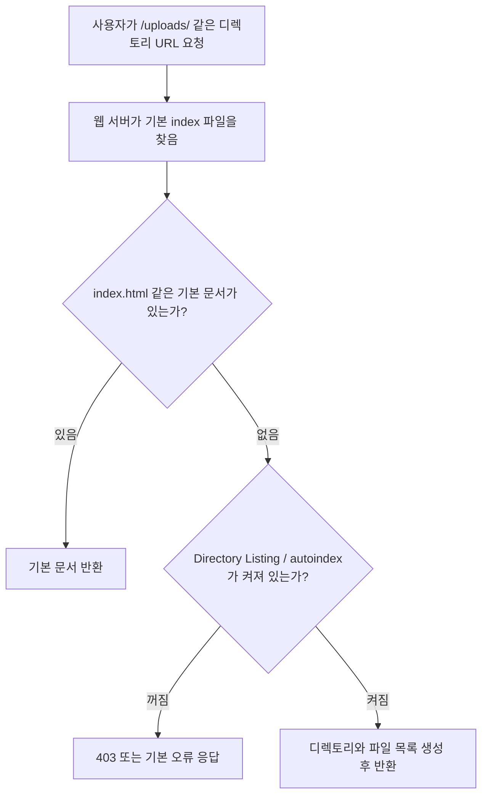

# Directory Listing 취약점

source: [[40_자료/강의 자료/5-20_웹보안.pdf|5-20 웹보안]], p.136

## 한 줄 요약

Directory Listing 취약점은 **웹 서버가 디렉토리 안의 파일 목록을 사용자에게 보여 주도록 설정되어 있어서, 애플리케이션 구조와 파일 위치가 노출되는 문제**다.

파일 하나를 직접 다운로드하는 취약점이라기보다, 서버가 “이 폴더 안에 무엇이 있는지”를 목록으로 보여 주는 설정 문제에 가깝다.

---

## 먼저 잡아야 할 핵심

- 원인은 애플리케이션 코드보다 웹 서버 설정에 가깝다.
- 사용자가 파일명이 아니라 디렉토리 경로까지만 요청했을 때 문제가 드러난다.
- 해당 디렉토리에 기본 index 파일이 없고, 자동 목록 생성 기능이 켜져 있으면 파일 목록이 보일 수 있다.
- 노출된 목록은 파일명, 하위 디렉토리, 크기, 수정 시간 같은 단서를 제공할 수 있다.
- File Upload 취약점과 결합되면 업로드 파일 경로를 찾기 쉬워져 위험이 커질 수 있다.

---

## 언제 목록이 보이는가

중요한 점은 Directory Listing이 데이터베이스나 로그인 우회를 직접 노리는 취약점이 아니라는 것이다. 서버가 디렉토리 요청을 받았을 때 “목록을 만들어서 보여줄지”를 잘못 설정하면 발생한다.

---

## 왜 위험한가

| 노출 정보 | 공격자가 얻는 의미 |
|---|---|
| 파일명 | 백업 파일, 임시 파일, 업로드 파일, 설정 파일 후보를 추측할 수 있다. |
| 하위 디렉토리 | 애플리케이션 구조와 기능별 경로를 파악할 수 있다. |
| 수정 시간 | 배포 시점, 최근 변경 파일, 운영 패턴을 추정할 수 있다. |
| 파일 크기 | 로그, 덤프, 압축 파일 같은 대용량 파일 후보를 구분할 수 있다. |

Directory Listing 하나만으로 서버가 바로 장악되는 것은 아니다. 하지만 공격 표면을 탐색하는 입장에서는 “무엇을 더 요청해 볼지”를 알려 주는 지도 역할을 한다.

---

## File Upload와 결합되는 지점

[[File Upload와 Webshell]]에서 중요한 조건 중 하나는 업로드된 파일의 경로를 아는 것이다.

업로드 디렉토리에 Directory Listing이 켜져 있으면 공격자는 업로드된 파일명, 확장자, 저장 위치를 목록으로 확인할 수 있다. 이 경우 File Upload 취약점에서 필요한 “업로드 파일을 다시 요청하는 단계”가 쉬워진다.

정리하면:

| 취약점 | 핵심 원인 | 결합 시 효과 |
|---|---|---|
| File Upload | 위험한 파일을 올리고 실행 가능하게 처리함 | 웹쉘이나 악성 파일이 서버에 들어갈 수 있다. |
| Directory Listing | 디렉토리 목록을 보여 주는 서버 설정 | 업로드된 파일의 위치와 이름을 찾기 쉬워진다. |

---

## 서버별 설정 감각

| 서버 | 관련 설정 | 방어 감각 |
|---|---|---|
| Apache | `Options +Indexes`가 자동 디렉토리 목록 생성을 켤 수 있다. | 공개하지 않을 디렉토리에서는 `Indexes`를 제거하거나 `Options -Indexes`를 사용한다. |
| Nginx | `autoindex on;`이면 index 파일이 없을 때 목록이 생성될 수 있다. | 공개 목록이 필요한 경로가 아니라면 `autoindex off;`를 명시한다. |
| IIS | `<directoryBrowse enabled="true">`가 디렉토리 브라우징을 켠다. | 일반 서비스 경로에서는 `<directoryBrowse enabled="false" />`로 둔다. |

PDF p.136의 Apache 대응책은 `-Indexes`로 목록 생성을 막는 방향이다. 실무에서는 서버 종류와 location/directory 범위에 따라 설정 위치가 달라지므로, 전체 서버에 무작정 적용하기보다 공개 목록이 필요한 경로와 숨겨야 할 경로를 구분해야 한다.

---

## Directory Listing이 아닌 것

| 헷갈리는 것 | 차이 |
|---|---|
| 파일 직접 접근 | 파일명을 이미 알고 직접 요청하는 문제다. Directory Listing은 파일명을 목록으로 보여 주는 문제다. |
| Directory Traversal | `../` 같은 경로 조작으로 의도하지 않은 파일을 읽는 문제다. Directory Listing은 서버가 현재 디렉토리 목록을 노출하는 설정 문제다. |
| 인증 없는 다운로드 | 인증/인가 없이 파일을 받을 수 있는 문제다. Directory Listing은 어떤 파일이 있는지 탐색하기 쉽게 만든다. |

---

## 보강 출처

- [Apache mod_autoindex](https://httpd.apache.org/docs/current/en/mod/mod_autoindex.html)
- [Nginx ngx_http_autoindex_module](https://nginx.org/en/docs/http/ngx_http_autoindex_module.html)
- [Microsoft IIS directoryBrowse](https://learn.microsoft.com/en-us/iis/configuration/system.webserver/directorybrowse)

---

## 관련 노트

- [[웹 애플리케이션 구조]]
- [[HTTP 구조와 메시지]]
- [[File Upload와 Webshell]]

## 확인 질문

- Directory Listing은 왜 애플리케이션 코드 취약점보다 웹 서버 설정 문제에 가까울까?
- index 파일이 없을 때 웹 서버는 어떤 선택을 하게 될까?
- Directory Listing이 File Upload 취약점과 결합되면 어떤 단계가 쉬워질까?
- Directory Listing과 Directory Traversal은 어떻게 다를까?
