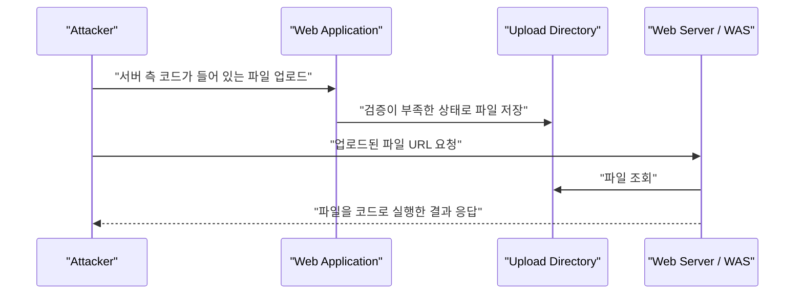

# File Upload와 Webshell

source: [[40_자료/강의 자료/5-20_웹보안.pdf|5-20 웹보안]], p.133-135

## 한 줄 요약

File Upload 취약점은 **사용자가 올린 파일을 서버가 안전하게 검증, 저장, 제공하지 못해서 서버 측 코드 실행이나 악성 파일 배포로 이어지는 문제**다.

웹쉘(Webshell)은 그중에서도 업로드된 파일이 서버에서 PHP, JSP, ASP 같은 서버 측 코드로 실행되어 공격자가 서버 명령 실행이나 내부 구조 파악을 시도할 수 있게 되는 경우를 말한다.

---

## 먼저 잡아야 할 핵심

- 파일 업로드 기능 자체가 취약점은 아니다. 문제는 **업로드된 파일을 서버가 어떻게 처리하느냐**다.
- 단순히 확장자만 검사하면 부족하다. 파일명, 확장자, Content-Type, 실제 파일 시그니처, 저장 위치, 실행 권한을 함께 봐야 한다.
- 웹쉘이 실행되려면 업로드만으로는 부족하다. 업로드 파일이 웹에서 접근 가능하고, 그 위치에서 서버 측 코드가 실행되어야 한다.
- 업로드 파일은 사용자 입력이다. 일반 form input보다 크고 복잡할 뿐, 서버 입장에서는 신뢰할 수 없는 입력이다.
- 안전한 설계의 핵심은 **검증된 파일만 받고, 실행되지 않는 위치에 저장하고, 직접 경로 노출 없이 제공하는 것**이다.

---

## 취약점이 성립하는 조건

PDF p.133의 공격 조건은 다음 세 가지로 정리할 수 있다.

| 조건 | 의미 | 보안 관점 |
|---|---|---|
| 업로드가 가능하다 | 사용자가 서버에 파일을 보낼 수 있다. | 기능 자체는 정상일 수 있으므로 검증과 저장 정책이 중요하다. |
| 업로드 경로를 알 수 있다 | 업로드된 파일을 URL로 다시 요청할 수 있다. | 경로와 파일명이 예측 가능하면 공격자가 실행 위치를 찾기 쉬워진다. |
| 업로드 디렉토리에서 코드가 실행된다 | `.php`, `.jsp`, `.asp` 같은 파일이 서버에서 처리된다. | 저장소가 실행 환경과 연결되면 웹쉘 위험이 커진다. |

즉 위험한 조합은 `업로드 가능 + 웹에서 접근 가능 + 서버 측 코드 실행 가능`이다.

---

## 웹쉘로 이어지는 흐름

초보자 관점에서 웹쉘은 “브라우저에서 서버에게 명령을 입력할 수 있는 창”처럼 보일 수 있다. 정확히는 업로드된 서버 측 스크립트가 요청 값을 받아 서버 안에서 실행하고, 그 결과를 HTTP 응답으로 돌려주는 구조다.

이 구조가 위험한 이유는 파일 업로드 기능이 단순 저장 기능을 넘어 **서버 명령 실행 경로**가 될 수 있기 때문이다.

---

## 확장자 검사만으로 부족한 이유

확장자 검사는 필요하지만 충분하지 않다.

| 부족한 지점 | 이유 |
|---|---|
| 차단 목록 방식 | 금지할 확장자를 빠뜨리기 쉽고, 서버마다 실행 가능한 확장자가 다를 수 있다. |
| Content-Type 신뢰 | 클라이언트가 보내는 값이라 조작될 수 있다. |
| 파일명 신뢰 | 이중 확장자, 특수문자, 경로 조작, 대소문자 차이 같은 우회 가능성이 생긴다. |
| 저장 위치 무시 | 검증된 파일이라도 webroot 아래 실행 가능한 위치에 저장하면 위험해질 수 있다. |
| 실행 권한 무시 | 업로드 디렉토리에서 스크립트 실행이 가능하면 파일이 코드가 된다. |

그래서 방어는 “위험 확장자 몇 개 막기”가 아니라, 업로드 파일의 전체 생명주기를 통제하는 방식이어야 한다.

---

## 안전한 업로드 설계

| 방어 지점 | 설계 원칙 |
|---|---|
| 허용 파일 종류 | 차단 목록보다 허용 목록을 먼저 사용한다. |
| 파일명 | 원본 파일명을 그대로 저장하지 말고 서버가 새 이름을 부여한다. |
| 파일 타입 | 확장자, Content-Type, 파일 시그니처를 함께 확인한다. |
| 저장 위치 | 가능하면 webroot 밖이나 별도 스토리지에 저장한다. |
| 실행 차단 | 업로드 디렉토리에서 서버 측 스크립트가 실행되지 않게 한다. |
| 크기 제한 | 업로드 용량과 개수를 제한해 저장소 고갈을 막는다. |
| 악성 파일 검사 | 필요한 경우 백신/악성 파일 스캔이나 CDR을 적용한다. |
| 제공 방식 | 직접 파일 경로가 아니라 다운로드 핸들러를 통해 제공한다. |

핵심은 업로드 파일을 “나중에 서버가 실행할 수도 있는 파일”로 두지 않는 것이다. 사용자가 올린 파일은 저장 대상이지, 서버의 프로그램이 되어서는 안 된다.

---

## Directory Listing과 연결되는 지점

[[Directory Listing 취약점]]은 File Upload 취약점과 원인이 다르지만, 함께 있으면 위험이 커진다.

File Upload 취약점은 악성 파일을 올릴 수 있는 문제이고, Directory Listing은 서버가 디렉토리와 파일 목록을 보여주는 설정 문제다. 업로드 경로에 Directory Listing이 켜져 있으면 공격자는 업로드된 파일명과 경로를 더 쉽게 확인할 수 있다.

즉 Directory Listing은 웹쉘을 직접 실행시키는 원인은 아니지만, **웹쉘 위치를 찾기 쉽게 만드는 보조 취약점**이 될 수 있다.

---

## 오해하기 쉬운 지점

| 오해 | 정리 |
|---|---|
| 파일 업로드 기능은 위험하니 만들면 안 된다. | 기능은 정상이다. 검증, 저장, 제공, 실행 차단 설계가 핵심이다. |
| `.php`만 막으면 된다. | 서버 환경에 따라 실행 가능한 확장자와 처리 방식이 다르다. |
| 이미지 파일만 받으면 안전하다. | 이미지처럼 보이는 악성 파일, SVG 스크립트, 메타데이터 악용 등 별도 검증이 필요하다. |
| 업로드가 성공하면 바로 RCE다. | 실행 가능한 위치와 서버 측 코드 실행 조건이 맞아야 한다. |
| 파일명을 난수화하면 끝이다. | 경로 추측을 어렵게 할 뿐, 타입 검증과 실행 차단을 대체하지 않는다. |

---

## 보강 출처

- [OWASP File Upload Cheat Sheet](https://cheatsheetseries.owasp.org/cheatsheets/File_Upload_Cheat_Sheet.html)
- [OWASP WSTG - Test Upload of Malicious Files](https://owasp.org/www-project-web-security-testing-guide/v42/4-Web_Application_Security_Testing/10-Business_Logic_Testing/09-Test_Upload_of_Malicious_Files)

---

## 관련 노트

- [[웹 애플리케이션 구조]]
- [[HTTP Method와 Header]]
- [[Directory Listing 취약점]]

## 확인 질문

- 업로드 기능이 웹쉘 실행으로 이어지려면 어떤 조건들이 동시에 필요할까?
- 확장자 allowlist만으로는 왜 부족할까?
- 업로드 파일을 webroot 밖에 저장하면 어떤 위험을 줄일 수 있을까?
- File Upload 취약점과 Directory Listing 취약점은 어떻게 다르고, 언제 서로 위험을 키울까?
