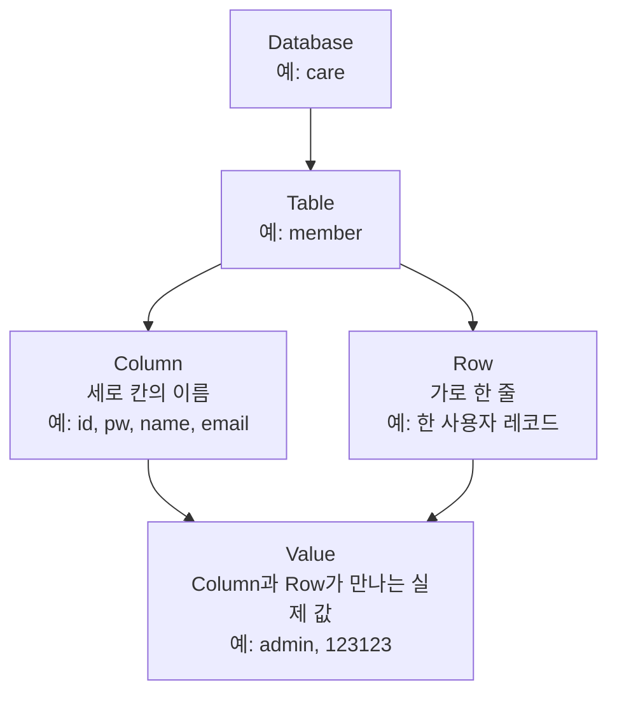

# SQL Injection Error와 UNION 기반 정보 추출과 Schema 파악

source: [[40_자료/강의 자료/5-20_웹보안.pdf|5-20 웹보안]], p.122-131.

## 한 줄 요약

SQL Injection은 인증 우회에서 끝나지 않는다. **DB가 내는 에러, `UNION`의 제약 조건, `information_schema` 같은 schema 정보를 이용하면 Database명, Table명, Column명, Data 위치를 단계적으로 추정할 수 있다.**

이 노트는 p.122-131의 정보 추출 흐름을 다룬다. p.132의 방어책은 별도 [[10_학습 노트/시스템보안/웹보안/SQL Injection 방어|SQL Injection 방어]] 노트에서 정리한다.

---

## 먼저 잡아야 할 핵심

- 인증 우회는 “로그인 조건을 참으로 만드는 것”이 핵심이었다.
- 정보 추출은 “DB 구조와 값을 알아내는 것”이 핵심이다.
- Error 기반 방식은 DB 에러 메시지에 내부 정보가 섞여 나오는 상황을 이용한다.
- `UNION` 기반 방식은 원래 `SELECT` 결과와 공격자가 만든 `SELECT` 결과를 합치려는 방식이다.
- Schema 파악은 보통 `Database명 -> Table명 -> Column명 -> Data` 순서로 진행된다.
- 이 흐름은 DBMS, 권한, 에러 출력 설정, 쿼리 구조에 크게 의존한다.

---

## DB 구조 설명

DB 구조는 “DB 안에 테이블이 있고, 테이블 안에 컬럼이라는 값 하나가 있다”로 이해하면 조금 틀어진다.

더 정확히는 다음과 같다.

```text
Database 안에 Table이 있고,
Table 안에는 Column과 Row가 있으며,
Column과 Row가 만나는 칸에 실제 Value가 들어간다.
```



예를 들어 `care` Database 안의 `member` Table은 이런 표처럼 생각할 수 있다.

| num | id | pw | name | email |
|---:|---|---|---|---|
| 1 | admin | 123123 | administrator | admin@care.com |
| 2 | unoh | 123 | 장운호 | unoh@example.com |

여기서 구분은 다음과 같다.

| 구분 | 의미 | 예시 |
|---|---|---|
| Database | 여러 테이블을 담는 단위 | `care` |
| Table | 같은 종류의 데이터를 담는 표 | `member` |
| Column | 세로 칸의 이름/종류 | `id`, `pw`, `email` |
| Row | 가로 한 줄의 데이터 묶음 | `admin` 계정 한 줄 |
| Value | Row와 Column이 만나는 실제 값 | `admin`, `123123` |

따라서 SQL Injection에서 Schema를 파악한다는 말은 다음 순서로 “데이터가 어디 있는지”를 좁혀간다는 뜻이다.

```text
어떤 Database인가?
-> 그 안에 어떤 Table이 있는가?
-> 그 Table에 어떤 Column이 있는가?
-> 그 Column의 실제 Value는 무엇인가?
```

---

## 인증 우회와 정보 추출의 차이

[[10_학습 노트/시스템보안/웹보안/SQL Injection 인증 우회 실습|SQL Injection 인증 우회]]는 보통 로그인 성공 여부를 바꾼다.

```text
취약한 WHERE 조건 조작
-> row 반환
-> 로그인 성공 처리
```

정보 추출은 목표가 다르다.

```text
취약한 Query에 에러/UNION/schema 조회 조건 삽입
-> DB가 에러 또는 결과를 반환
-> 에러 메시지나 화면 출력에서 DB 내부 정보 관찰
```

즉 인증 우회가 “문을 여는 것”이라면, 정보 추출은 “건물 안에 어떤 방과 서랍이 있는지 지도를 그리는 것”에 가깝다.

---

## Error 기반 정보 노출

Error 기반 SQL Injection은 DB가 오류를 내는 과정에서 내부 정보가 에러 메시지로 노출되는 것을 이용한다.

흐름:

```text
입력값에 SQL 문법 삽입
-> DB가 형 변환 오류, 함수 오류, 문법 오류 등을 냄
-> 웹 애플리케이션이 DB 에러를 화면에 그대로 출력
-> 에러 메시지에서 컬럼명, DB명, 함수 결과 같은 내부 정보 확인
```

여기서 가장 중요한 조건은 **에러가 사용자에게 보이는가**다.

에러가 서버 로그에만 남고 화면에는 일반 오류만 보이면, 이 방식으로 관찰할 수 있는 정보는 크게 줄어든다.

### 형 변환 에러

PDF p.122는 문자열과 숫자 데이터 비교가 형 변환 에러를 유발할 수 있다고 설명한다.

예:

```text
nuno' and user_pw=1--
```

의도는 문자열 컬럼과 숫자 비교를 섞어서 DB가 타입 처리 중 오류를 내게 만드는 것이다.

핵심은 payload 자체가 아니라 이 순서다.

```text
타입이 맞지 않는 비교
-> DB 에러 발생
-> 애플리케이션이 에러 출력
-> 에러 메시지에 내부 문자열이나 컬럼 정보가 섞일 수 있음
```

> [!caution]
> 어떤 값이 에러 메시지에 포함되는지는 DBMS, 쿼리 구조, PHP 설정, 에러 출력 방식에 따라 달라진다. “에러를 만들면 항상 원하는 정보가 나온다”로 외우면 안 된다.

---

## UNION 기반 정보 추출

`UNION`은 두 `SELECT` 결과를 합쳐서 반환하는 SQL 문법이다.

정상적인 `UNION`이 되려면 두 결과의 컬럼 개수와 타입이 맞아야 한다.

```sql
SELECT name, age FROM member
UNION
SELECT strname, intReadno FROM board
```

SQL Injection에서 이 제약 조건은 오히려 단서가 된다.

```text
UNION SELECT를 붙임
-> 컬럼 개수나 타입이 맞지 않으면 에러 발생
-> 에러를 보고 원래 SELECT의 구조를 추정
-> 개수와 타입을 맞추면 다른 SELECT 결과를 원래 화면에 끼워 넣을 수 있음
```

PDF p.123은 `UNION` mismatch로 `SELECT` 구문에 사용된 Field 개수를 알아낼 수 있다고 설명한다.

예:

```text
ID : nuno' UNION select 'a',1--
```

이 예시의 의미는 “이 payload를 외워라”가 아니다. 핵심은 다음 두 가지다.

| 확인할 것 | 이유 |
|---|---|
| 원래 쿼리의 컬럼 개수 | `UNION` 결과를 합치려면 개수가 맞아야 함 |
| 각 컬럼의 타입 | 문자열/숫자 타입이 맞지 않으면 오류가 날 수 있음 |

PDF는 어떤 필드에서 에러가 발생했는지 바로 알기 어렵기 때문에 앞 필드부터 하나씩 문자로 바꿔 테스트한다고 설명한다. 개념적으로는 **출력 가능한 위치와 타입을 찾는 과정**이다.

제한:

- 문자열 형태의 값은 에러 메시지나 출력 위치에서 확인하기 쉽다.
- 숫자형 데이터는 묵시적 형 변환 때문에 에러가 나지 않을 수 있다.
- DBMS와 화면 출력 구조에 따라 결과가 달라진다.

---

## DB Schema를 왜 알아내는가

Schema는 DB 안의 구조 정보다.

```text
Database
-> Table
-> Column
-> Data
```

사용자 데이터가 어디 있는지 모르면 실제 값을 조회하기 어렵다.

예를 들어 회원정보를 얻고 싶다면 다음 정보를 알아야 한다.

| 단계 | 알아야 하는 것 | 예시 |
|---|---|---|
| Database명 | 현재 어떤 DB를 쓰는가 | `care` |
| Table명 | 사용자 정보가 어느 테이블에 있는가 | `member` |
| Column명 | ID/PW/이메일이 어느 컬럼인가 | `id`, `pw`, `email` |
| Data | 실제 저장된 값 | 각 row의 값 |

그래서 SQL Injection 정보 추출은 보통 무작정 데이터를 찍는 것이 아니라, **구조를 먼저 좁혀가는 과정**이 된다.

---

## Database명 확인

PDF p.125는 MySQL의 `database()` 함수로 현재 연결된 Database명을 확인하는 흐름을 다룬다.

```sql
database()
```

`database()`는 현재 선택된 Database 이름을 문자열로 반환한다. 취약한 쿼리와 화면에 노출되는 DB 에러가 결합되면, 이 함수의 결과가 사용자 화면에 드러날 수 있다.

실제 `updatexml()`, `concat()` 조합과 관찰 결과는 [[10_학습 노트/시스템보안/웹보안/SQL Injection Error 기반 DB명 정보 추출 실습|SQL Injection Error 기반 정보 추출 실습]]에 정리했다.

> [!note]
> `database()`와 `updatexml()`은 MySQL 계열 문맥에서 이해해야 한다. 다른 DBMS에서는 같은 함수명이나 같은 에러 방식이 그대로 적용되지 않을 수 있다.

---

## information_schema와 Table명 파악

Database명을 알면 다음은 Table명이다.

MySQL에서는 `information_schema`가 DB 구조 정보를 담는 메타데이터 영역으로 쓰인다.

PDF p.126-127에서 등장하는 핵심 테이블:

| 메타데이터 테이블 | 의미 |
|---|---|
| `information_schema.tables` | 테이블 목록 확인 |
| `information_schema.columns` | 테이블과 컬럼 정보 확인 |

공격자가 SQL Injection으로 이 메타데이터를 조회할 수 있다면, 실제 데이터가 들어 있는 사용자 테이블명을 추정할 수 있다.

최종 목적은 단순히 테이블 목록을 보는 것이 아니라, **데이터가 있을 만한 테이블을 찾는 것**이다. 실제 에러 기반 실습에서는 여러 row를 한 번에 출력하기 어렵기 때문에, 한 줄씩 보거나 문자열로 합쳐 보는 식의 우회가 필요할 수 있다.

---

## Column명 파악

Table명을 알아도 Column명을 모르면 실제 데이터를 조회하기 어렵다.

PDF p.128, p.130은 `information_schema.columns`를 이용한 Column명 확인으로 이어진다.

`information_schema.columns`에는 보통 다음과 같은 정보가 포함된다.

| 정보 | 의미 |
|---|---|
| `table_schema` | 컬럼이 속한 Database명 |
| `table_name` | 컬럼이 속한 테이블명 |
| `column_name` | 컬럼명 |

PDF p.128의 사진은 이 세 정보를 한 결과표에서 같이 보여준다. 즉 “Column명만 따로 보는 표”가 아니라, **어느 DB의 어느 Table에 어떤 Column이 있는지**를 함께 확인하는 장면이다.

이 단계는 Data 추출 직전 단계다. “어느 테이블의 어느 컬럼을 봐야 하는가”가 정해지기 때문이다.

---

## Data 추출로 이어지는 흐름

PDF p.131은 Table명과 Column명을 파악했으므로 각각의 Data도 알아낼 수 있다고 설명한다.

흐름은 이렇게 닫힌다.

```text
Database명 확인
-> Table명 확인
-> Column명 확인
-> 원하는 Column의 Data 조회 가능성 증가
```

이때 실제 데이터 조회 가능 여부는 다음 조건에 달려 있다.

- DB 계정 권한
- 화면에 출력되는 컬럼 위치
- 에러 메시지 노출 여부
- `UNION` 가능 여부
- 서버 측 필터링과 예외 처리
- DBMS 종류와 함수 지원 여부

따라서 “Schema를 알면 무조건 모든 데이터를 얻는다”가 아니라, **데이터에 접근할 경로를 체계적으로 찾을 수 있게 된다**가 더 정확하다.

이 단계에서 실제 `LIMIT`, `group_concat()`을 어떻게 써 보았고 어디서 잘렸는지는 [[10_학습 노트/시스템보안/웹보안/SQL Injection Error 기반 DB명 정보 추출 실습|SQL Injection Error 기반 정보 추출 실습]]에 남긴다.

---

## Client-side Validation 우회와의 연결

PDF p.124는 DB Schema를 파악하는 Query가 길어질 수 있으므로 입력값 사이즈 제한을 우회해야 할 수 있다고 설명한다.

이때 다시 연결되는 개념이 Client-side Validation 우회다.

```text
브라우저/JavaScript가 입력 길이를 제한
-> Paros 같은 Proxy로 Request를 직접 수정
-> 서버가 별도 검증을 하지 않으면 긴 SQLi 입력값이 전달됨
```

즉 입력 길이 제한이 브라우저에만 있으면 보안 경계가 되지 못한다. 서버가 입력 길이, 형식, 허용 문자, 쿼리 생성 방식을 직접 통제해야 한다.

---

## 오해하기 쉬운 지점

- Error 기반 SQLi는 “에러를 내면 항상 정보가 나온다”가 아니다. 에러가 사용자에게 출력되어야 관찰 가능하다.
- `UNION`은 공격 전용 문법이 아니다. 정상 SQL 문법인데, 취약한 동적 SQL 안에서 정보 추출에 악용될 수 있다.
- `information_schema`는 MySQL 계열에서 익숙한 메타데이터 구조다. 다른 DBMS는 다른 시스템 카탈로그를 쓴다.
- Schema 파악은 데이터 추출의 준비 단계다. Database명, Table명, Column명을 알아야 어떤 데이터를 조회할지 정할 수 있다.
- p.132 방어책은 이 노트의 범위가 아니다. 방어는 [[10_학습 노트/시스템보안/웹보안/SQL Injection 방어|SQL Injection 방어]]에서 공식 자료와 함께 정리한다.

---

## 이 vault에서 쓰는 법

- 이 노트는 `5-20_웹보안.pdf` p.122-131의 stable concept note로 쓴다.
- p.115-121 인증 우회 흐름은 [[10_학습 노트/시스템보안/웹보안/SQL Injection 개념과 인증 우회|SQL Injection 개념과 인증 우회]]에서 본다.
- 실제 `updatexml()`, `group_concat()`, `LIMIT`, `sqlmap` 재검증 증거는 [[10_학습 노트/시스템보안/웹보안/SQL Injection Error 기반 DB명 정보 추출 실습|SQL Injection Error 기반 정보 추출 실습]]에 둔다.
- 방어 기준은 [[10_학습 노트/시스템보안/웹보안/SQL Injection 방어|SQL Injection 방어]]에서 본다.
- [[10_학습 노트/시스템보안/웹보안/SQL Injection 페이지별 분해 기록|SQL Injection 페이지별 분해 기록]]은 source-digest/draft로 보고, 복습 진입은 이 노트와 연결 stable/lab note들을 우선한다.
- 실습에서 나온 계정, 비밀번호, 전화번호, 이메일, 주소 같은 원본 dump 값은 concept note에 옮기지 않는다. 필요한 경우 lab note의 redacted evidence만 본다.

---

## 관련 노트

- [[10_학습 노트/시스템보안/웹보안/SQL Injection을 위한 SQL 기초|SQL Injection을 위한 SQL 기초]]
- [[10_학습 노트/시스템보안/웹보안/SQL Injection 개념과 인증 우회|SQL Injection 개념과 인증 우회]]
- [[10_학습 노트/시스템보안/웹보안/SQL Injection 인증 우회 실습|SQL Injection 인증 우회 실습]]
- [[10_학습 노트/시스템보안/웹보안/SQL Injection Error 기반 DB명 정보 추출 실습|SQL Injection Error 기반 정보 추출 실습]]
- [[10_학습 노트/시스템보안/웹보안/SQL Injection 방어|SQL Injection 방어]]

---

## 확인 질문

- Error 기반 SQL Injection은 왜 에러 메시지 노출 설정에 의존하는가?
- `UNION`에서 컬럼 개수와 타입을 맞춰야 하는 이유는 무엇인가?
- Database명, Table명, Column명, Data는 어떤 순서로 연결되는가?
- `information_schema.tables`와 `information_schema.columns`는 각각 무엇을 확인하는 데 쓰이는가?
- Client-side 입력 길이 제한이 SQLi 방어가 될 수 없는 이유는 무엇인가?
