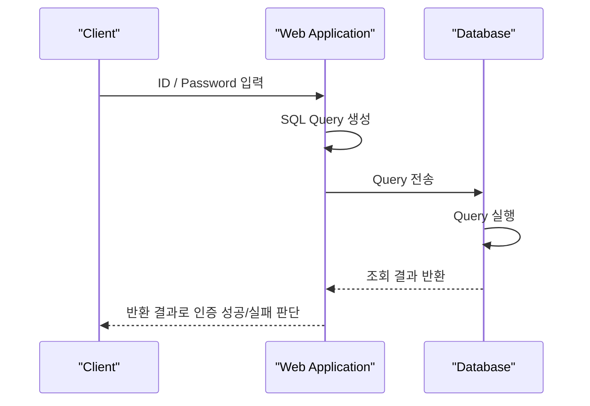

# SQL Injection 개념과 인증 우회

source:

- [[40_자료/강의 자료/5-20_웹보안.pdf|5-20 웹보안]], p.115-121
- [OWASP SQL Injection Prevention Cheat Sheet](https://cheatsheetseries.owasp.org/cheatsheets/SQL_Injection_Prevention_Cheat_Sheet.html)

## 한 줄 요약

SQL Injection은 **사용자 입력이 SQL 문자열 안의 값으로 처리되지 않고 SQL 구문의 일부로 해석되어, 서버가 의도하지 않은 Query가 DB에서 실행되는 취약점**이다.

로그인 기능에서는 이 문제가 `WHERE` 조건 조작으로 이어질 수 있다. 서버가 “DB에서 조건에 맞는 레코드가 반환되면 인증 성공”이라고 판단하는 구조라면, 공격자는 비밀번호를 맞히지 않고도 인증 결과를 바꿀 수 있다.

---

## 먼저 잡아야 할 핵심

- SQL Injection은 비밀번호를 추측하는 공격이 아니다.
- 핵심은 사용자 입력이 SQL Query의 일부로 섞이는 것이다.
- 취약한 로그인 로직은 ID/PW 쌍이 맞는 레코드가 있는지만 확인한다.
- 공격자는 `WHERE` 조건을 항상 참으로 만들거나, 뒤의 비밀번호 조건을 주석 처리하려고 한다.
- SQL Injection은 웹 해킹으로 분류되지만 실제 피해는 Database에 발생한다.
- 이 노트는 개념과 인증 우회만 다룬다. 정보 추출, schema 파악, 방어는 다음 노트에서 분리한다.

---

## SQL Injection이 생기는 지점

PDF는 SQL Injection을 “사용자가 서버에 제출한 데이터가 SQL Query로 사용되어 Database나 시스템에 영향을 주는 공격기법”으로 설명한다.

원인은 다음 구조다.

```text
사용자 입력
-> 서버가 입력값으로 동적 SQL Query 생성
-> 입력값이 검증 없이 DB 쿼리문의 일부로 포함
-> DB가 조작된 SQL을 실행
```

즉 문제는 사용자가 값을 입력했다는 사실 자체가 아니다. 문제는 서버가 그 값을 SQL 문자열에 그대로 이어 붙여서, 입력값이 SQL 구조를 바꿀 수 있게 만든다는 점이다.

PDF가 든 영향은 다음과 같다.

| 영향 | 의미 |
|---|---|
| 웹 애플리케이션 인증 우회 | 로그인 판단을 속여 다른 사용자처럼 인증될 수 있음 |
| Database 덤프, 조작, 파괴 | DB 안의 데이터가 유출, 변경, 삭제될 수 있음 |
| 시스템 커맨드 실행 | 주로 MS-SQL 등 특정 DBMS 기능/권한 조건에서 가능 |
| 시스템 주요 파일 노출 | DBMS 권한과 설정에 따라 파일 접근 위험으로 이어질 수 있음 |

여기서 `시스템 커맨드 실행`, `시스템 주요 파일 노출`은 모든 SQL Injection에서 항상 가능한 결과가 아니다. DBMS 종류, 권한, 설정에 따라 가능성이 달라진다.

---

## 웹 애플리케이션 로그인 인증 흐름

PDF는 일반적인 인증 절차를 다음처럼 설명한다.



중요한 지점은 `SQL Query 생성`이다. 사용자가 입력한 ID/PW가 안전하게 처리되지 않고 SQL Query 문자열에 들어가면, DB는 그 입력을 단순 문자열이 아니라 SQL 조건으로 해석할 수 있다.

로그인 로직은 보통 이런 질문을 DB에 한다.

```text
이 ID와 PW를 동시에 만족하는 사용자 레코드가 있는가?
```

조회 결과가 있으면 인증 성공, 없으면 인증 실패가 된다.

---

## 취약한 동적 SQL 구조

PDF의 취약한 코드 예시는 ASP/VBScript 계열 형태다. 언어 자체보다 구조가 중요하다. PHP든 ASP/VBScript든 핵심은 같다. 사용자 입력값을 SQL 문자열에 직접 이어 붙이면, 입력값이 값이 아니라 SQL 구문의 일부로 해석될 수 있다.

```vb
chkUser = false
id = request("user_id")
password = request("user_pw")
strSQL = "select user_id, user_pw, name, email, homepage from member
where user_id='" & id & "' and user_pw='" & password & "'"
set Rs = DBconn.execute(strSQL)
if not Rs.eof then chkUser = true
```

이 코드의 문제는 ID/PW를 받아서 DB에서 확인한다는 점이 아니다. 문제는 입력값을 SQL 문자열에 그대로 이어 붙인다는 점이다.

```text
입력값이 데이터로 취급됨 -> 안전한 방향
입력값이 SQL 문법으로 해석됨 -> SQL Injection 가능
```

`if not Rs.eof then chkUser = true`는 조회 결과가 하나라도 있으면 로그인 성공으로 판단한다는 뜻이다. 그래서 공격자가 쿼리 결과를 의도적으로 반환되게 만들면 인증 우회가 가능해진다.

---

## 가능성 확인에 쓰이는 문자

PDF는 SQL 구문에 영향을 줄 수 있는 문자를 입력해 결과를 확인한다고 설명한다.

| 문자 | 취약한 문자열 결합 쿼리에서 의미가 바뀔 수 있는 방식 |
|---|---|
| `'` | 문자열 경계를 닫거나 깨뜨릴 수 있음 |
| `"` | 문자열 경계에 영향을 줄 수 있음 |
| `;` | DBMS/설정에 따라 구문 분리에 쓰일 수 있음 |
| `--` | 뒤 구문을 주석 처리하는 데 쓰일 수 있음 |
| `#` | MySQL 계열 주석으로 쓰일 수 있음 |
| `/* */` | 블록 주석으로 쓰일 수 있음 |

이 문자들을 “무조건 넣으면 되는 payload”로 외우면 안 된다. 핵심은 입력값이 SQL 문법에 영향을 주는지 확인하는 것이다. DBMS가 MSSQL, MySQL, Oracle인지에 따라 주석 문법과 세부 동작은 달라질 수 있다.

---

## 인증 우회의 핵심은 WHERE 조건이다

취약한 로그인 쿼리는 보통 이런 형태다.

```sql
SELECT * FROM user_table
WHERE id='사용자입력값' AND pw='사용자입력값'
```

이 쿼리는 ID와 PW가 모두 맞는 레코드를 찾는다. 인증 우회의 핵심은 `WHERE`절 이하 조건이 인증 성공처럼 평가되게 만드는 것이다.

PDF는 `1=1`과 `1=2`를 비교해 설명한다.

```sql
SELECT * FROM user_table WHERE 1=1
```

`1=1`은 항상 참이므로 모든 행이 반환된다.

```sql
SELECT * FROM user_table WHERE 1=2
```

`1=2`는 항상 거짓이므로 어떤 레코드셋도 반환되지 않는다.

SQL Injection에서 중요한 것은 쿼리를 깨뜨리는 것이 아니라, 에러 없이 실행되는 SQL을 공격자에게 유리하게 만드는 것이다. 그래서 PDF도 “쿼리 구문이 에러가 나지 않도록 해야 한다”고 강조한다.

---

## 항상 참 조건을 이용한 인증 우회

대표 흐름은 ID/PW 입력값에 항상 참인 조건을 끼워 넣어, 로그인 `WHERE` 조건 전체가 참으로 계산되게 만드는 것이다.

```text
ID: ' OR '1'='1
PW: ' OR '1'='1
```

취약한 로그인 코드가 조회 결과가 있는지만 보고 인증 성공을 판단하면, 이 조건 조작으로 여러 레코드가 반환되어도 로그인 성공으로 처리될 수 있다. 이때 서버가 반환된 첫 번째 row를 현재 사용자처럼 세션에 저장하면, 의도하지 않은 계정 권한으로 로그인되는 상황이 생긴다.

실제 `care` 애플리케이션에서 `WHERE` 조건이 어떻게 바뀌고 세션이 어떻게 생성되는지는 [[SQL Injection 인증 우회 실습]]에 정리했다.

PDF는 관리자 계정을 테이블의 처음이나 끝에 두지 말고 별도 관리자 테이블을 구성하라고 설명한다. 다만 관리자 계정을 별도 테이블로 분리하는 것은 인증 우회 결과를 제한하는 설계 보조책일 수는 있지만, SQL Injection 자체를 막지는 못한다. 핵심은 애초에 입력값이 SQL 구조를 바꾸지 못하게 하는 것이다.

---

## 특정 ID 권한으로 로그인하기

항상 참 조건은 여러 행을 반환시킬 수 있다. 반대로 특정 ID를 알고 있다면, 그 ID 조건만 남기고 뒤의 비밀번호 조건을 주석 처리해 특정 계정 권한을 노리는 흐름도 가능하다.

PDF의 예시 상황은 다음과 같다.

- 게시판에서 관리자 ID가 `admin`임을 확인했다.
- ID 입력값으로 `admin'--`를 넣는다.
- PW에는 임의의 값을 넣는다.

`--` 뒤가 주석 처리되면 뒤쪽의 비밀번호 조건이 무시되고, 쿼리는 사실상 `user_id='admin'`인 레코드를 찾는 형태가 된다. 단, 주석 문법은 DBMS마다 다르며 MySQL에서는 `--` 뒤 공백이 필요한 경우가 있다. 핵심은 `admin'--` 문자열 자체가 아니라, **뒤 조건을 주석 처리해 비밀번호 검증을 제거한다**는 원리다.

공백 하나 때문에 성공/실패가 갈린 실제 관찰은 [[SQL Injection 인증 우회 실습]]에 남겨 둔다.

---

## 오해하기 쉬운 지점

- SQL Injection은 비밀번호를 맞히는 공격이 아니다. DB가 실행할 SQL 조건을 바꾸는 공격이다.
- 사용자 ID가 화면에 보이는 것 자체가 곧 취약점은 아니다. 하지만 SQL Injection과 결합되면 특정 계정 우회의 재료가 될 수 있다.
- `1=1`은 마법 문구가 아니라 항상 참인 SQL 조건식이다.
- SQL Injection payload는 원래 쿼리의 따옴표 위치, 괄호, DBMS, 주석 문법에 따라 달라진다.
- 관리자 계정을 테이블 처음이나 끝에 두지 않는 것은 근본 방어가 아니다.
- 구체적인 방어 방식은 이 노트의 범위가 아니다. 방어는 p.132와 공식 자료를 보강한 [[10_학습 노트/시스템보안/웹보안/SQL Injection 방어|SQL Injection 방어]]에서 정리한다.

---

## 다음으로 이어질 내용

이 노트는 인증 우회까지만 다룬다. 다음 범위는 별도로 정리한다.

- [[10_학습 노트/시스템보안/웹보안/SQL Injection Error와 UNION 기반 정보 추출과 Schema 파악|SQL Injection Error와 UNION 기반 정보 추출과 Schema 파악]]
- [[10_학습 노트/시스템보안/웹보안/SQL Injection 방어|SQL Injection 방어]]

---

## 이 vault에서 쓰는 법

- 이 노트는 `5-20_웹보안.pdf` p.115-121의 stable concept note로 쓴다.
- p.107-114 SQL prerequisite는 [[10_학습 노트/시스템보안/웹보안/SQL Injection을 위한 SQL 기초|SQL Injection을 위한 SQL 기초]]에서 본다.
- 실제 `care` 애플리케이션에서의 인증 우회 증거는 [[10_학습 노트/시스템보안/웹보안/SQL Injection 인증 우회 실습|SQL Injection 인증 우회 실습]]에 둔다.
- Error/UNION 기반 정보 추출과 schema 파악은 [[10_학습 노트/시스템보안/웹보안/SQL Injection Error와 UNION 기반 정보 추출과 Schema 파악|SQL Injection Error와 UNION 기반 정보 추출과 Schema 파악]]에서 본다.
- 방어 기준은 [[10_학습 노트/시스템보안/웹보안/SQL Injection 방어|SQL Injection 방어]]에서 본다.
- [[10_학습 노트/시스템보안/웹보안/SQL Injection 페이지별 분해 기록|SQL Injection 페이지별 분해 기록]]은 source-digest/draft로 보고, 복습 진입은 이 노트와 연결 stable note들을 우선한다.

## 관련 노트

- [[10_학습 노트/시스템보안/웹보안/SQL Injection을 위한 SQL 기초|SQL Injection을 위한 SQL 기초]]
- [[10_학습 노트/시스템보안/웹보안/SQL Injection 인증 우회 실습|SQL Injection 인증 우회 실습]]
- [[10_학습 노트/시스템보안/웹보안/SQL Injection Error와 UNION 기반 정보 추출과 Schema 파악|SQL Injection Error와 UNION 기반 정보 추출과 Schema 파악]]
- [[10_학습 노트/시스템보안/웹보안/SQL Injection 방어|SQL Injection 방어]]

## 참고 자료

- [OWASP SQL Injection Prevention Cheat Sheet](https://cheatsheetseries.owasp.org/cheatsheets/SQL_Injection_Prevention_Cheat_Sheet.html)

## 확인 질문

- SQL Injection은 왜 비밀번호 크래킹과 다른가?
- 로그인 인증 흐름에서 SQL Query 생성 지점이 왜 중요한가?
- `WHERE 1=1`과 `WHERE 1=2`는 각각 어떤 결과를 만드는가?
- 항상 참 조건 기반 우회와 특정 ID 주석 처리 우회는 무엇이 다른가?
- 관리자 계정 위치 조정이 왜 근본 방어가 아닌가?
