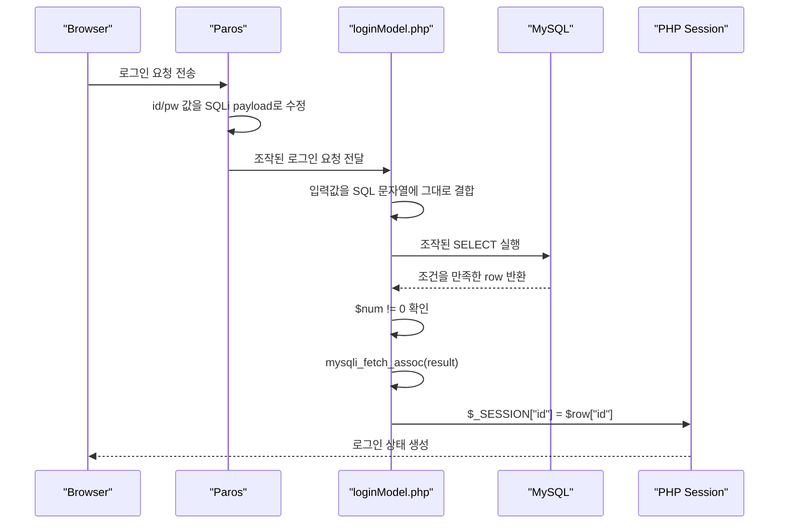

# SQL Injection 인증 우회 실습

source: [[40_자료/강의 자료/5-20_웹보안.pdf|5-20 웹보안]], p.118-121.

## 실습 개요

한 줄 요약: **`loginModel.php`의 취약한 SQL 문자열 결합 구조에서 ID/PW 입력값을 조작해, DB가 인증 조건을 참으로 해석하게 만들고 세션이 어떤 사용자로 생성되는지 확인하는 실습이다.**

이 실습은 [[SQL Injection 개념과 인증 우회]]의 p.118-121 내용을 실제 `care` 애플리케이션 로그인 코드로 확인하는 단계다.

| 항목 | 내용 |
|---|---|
| PDF 범위 | p.118-121 |
| 실습 대상 | `care/member/loginModel.php` |
| 관찰 도구 | Paros |
| 핵심 확인 | 조작된 입력값이 DB에서 어떤 `WHERE` 조건으로 해석되는가 |
| 연결 개념 | [[SQL Injection을 위한 SQL 기초]], [[SQL Injection 개념과 인증 우회]] |
| 현재 상태 | 실습 흐름 정리 완료. 스크린샷은 선택 보강 |

---

## 흐름 요약



---

## 실습에서 확인하려는 것

이 실습의 핵심은 “비밀번호를 맞혔는가”가 아니다.

서버가 원래 의도한 로그인 조건은 다음과 같다.

```sql
WHERE id='입력한 ID' AND pw='입력한 PW'
```

정상 로그인이라면 DB에 **ID와 PW가 모두 일치하는 레코드가 있어야** 한다.

SQL Injection 인증 우회는 이 조건을 공격자가 유리한 SQL 조건으로 바꿔, 비밀번호를 몰라도 레코드가 반환되게 만드는 방식이다.

```text
ID/PW 입력값
-> PHP가 SQL 문자열에 그대로 이어 붙임
-> DB는 입력값을 단순 글자가 아니라 SQL 조건식으로 해석
-> 조건이 참이 되어 레코드 반환
-> 로그인 성공 처리
```

---

## loginModel.php 수정

이번 실습에서는 PDF p.118의 취약한 인증 구조를 관찰하기 위해 로그인 성공 조건을 조정했다.

### 1. 반환 레코드가 있으면 로그인 성공으로 처리

기존 조건:

```php
if($num == 1)
```

수정:

```php
if($num != 0)
```

의미:

| 조건 | 의미 |
|---|---|
| `$num == 1` | 조회 결과가 정확히 1개일 때만 로그인 성공 |
| `$num != 0` | 조회 결과가 1개 이상이면 로그인 성공 |

PDF p.118의 `if not Rs.eof then chkUser = true`와 대응된다. 즉, DB 조회 결과가 비어 있지 않으면 인증 성공으로 보는 구조다.

이렇게 바꾸면 `OR '1'='1'` 같은 조건 조작으로 여러 레코드가 반환되어도 로그인 성공 처리될 수 있다.

### 2. 세션 ID를 입력값이 아니라 DB 결과에서 가져오도록 수정

기존:

```php
$_SESSION['id'] = $id;
```

수정:

```php
$row = mysqli_fetch_assoc($result);
$_SESSION['id'] = $row['id'];
```

이 수정이 필요한 이유:

- `$id`는 사용자가 입력한 값이다.
- SQL Injection payload가 들어가면 `$id`는 정상 계정명이 아니라 `' OR '1'='1` 같은 문자열이 된다.
- 세션에 payload 자체가 들어가면 이후 `modify` 같은 회원 기능에서 정상 사용자 ID로 쓰기 어렵다.
- 그래서 DB가 반환한 실제 레코드의 `id`를 세션에 넣어야 한다.
- 코드 순서도 중요하다. `$row = mysqli_fetch_assoc($result);`로 DB 결과를 먼저 꺼낸 뒤에야 `$row['id']`를 세션에 넣을 수 있다.

정리하면, 이 수정은 **SQL Injection으로 반환된 DB 레코드를 서버가 실제 로그인 사용자처럼 세션에 저장하는지** 확인하기 위한 것이다.

---

## Paros에서 요청값을 어떻게 바꿨는가

브라우저 화면에서 그대로 입력하면 입력값이 인코딩되거나 화면/스크립트 흐름에 영향을 받을 수 있다.

그래서 이번 실습에서는 Paros로 로그인 요청을 잡은 뒤, 요청 본문에서 ID/PW 값을 직접 수정한다.

이번에 직접 넣은 값은 둘 다 같다.

```text
id=' OR '1'='1
pw=' OR '1'='1
```

이 값이 바로 DB에서 실행되는 것은 아니다. 먼저 PHP 코드의 `$id`, `$pw` 변수에 들어가고, 그 다음 취약한 SQL 문자열에 끼워진다.

```text
Paros에서 조작한 요청값
-> PHP의 $id, $pw 변수
-> SELECT ... WHERE id='$id' and pw='$pw'
-> DB가 해석하는 최종 WHERE 조건
```

---

## 조작된 값이 SQL로 바뀌는 과정

취약한 PHP 코드는 사용자의 입력값을 SQL 문자열에 그대로 이어 붙인다.

```php
$query = "SELECT * FROM member WHERE id='$id' and pw='$pw'";
```

서버가 원래 기대한 SQL은 이런 형태다.

```sql
SELECT * FROM member
WHERE id='unoh03' AND pw='123'
```

DB는 `id`와 `pw`가 모두 맞는 레코드만 반환한다.

하지만 입력값이 SQL 문법을 포함하면 이야기가 바뀐다.

### 예시 A. 항상 참 조건으로 여러 레코드가 반환되는 경우

정상 로그인은 원래 문이 두 개다. 둘 다 통과해야 한다.

```text
id가 맞는가?
그리고 pw도 맞는가?
```

SQL로 쓰면 이런 의미다.

```sql
SELECT * FROM member
WHERE id='unoh03' AND pw='123'
```

그런데 `id`와 `pw`에 둘 다 다음 값을 넣었다.

```text
' OR '1'='1
```

이 입력값을 분해하면 이렇게 볼 수 있다.

| 조각 | 의미 |
|---|---|
| `'` | 원래 값을 감싸던 따옴표를 닫음 |
| `OR` | 조건을 하나 더 붙임 |
| `'1'='1'` | 항상 참인 조건을 만듦 |

PHP는 이 값을 “로그인 ID 문자열”로 안전하게 묶어두지 않고, SQL 문자열 안에 그대로 끼워 넣는다.

```sql
SELECT * FROM member
WHERE id='' OR '1'='1'
AND pw='' OR '1'='1'
```

여기서 `id=''`와 `pw=''`는 “공백”이 아니라 **빈 문자열과 비교한다**는 뜻이다.

```text
id=''  -> id가 빈 문자열인가?
pw=''  -> pw가 빈 문자열인가?
```

대부분의 경우 `id=''`나 `pw=''`는 거짓일 수 있다. 하지만 옆에 `OR '1'='1'`이 붙어 있다.

SQL은 보통 `AND`를 `OR`보다 먼저 계산하므로, 위 조건은 대략 이렇게 묶어서 볼 수 있다.

```sql
WHERE id=''
   OR ('1'='1' AND pw='')
   OR '1'='1'
```

마지막 조건이 핵심이다.

```sql
OR '1'='1'
```

`'1'='1'`은 항상 참이다. 그래서 앞의 `id=''`, `pw=''`가 실패해도 전체 `WHERE` 조건이 참으로 계산될 수 있다.

초보자식으로 말하면 이렇다.

```text
원래:
id도 맞고 pw도 맞아야 문이 열린다.

조작 후:
"무조건 맞는 조건"을 옆문으로 끼워 넣었다.
그래서 id/pw가 진짜로 맞지 않아도 DB가 row를 돌려줄 수 있다.
```

그 다음부터는 PHP 코드 흐름이다.

```text
DB 반환 레코드 수: 0이 아님
-> $num != 0 조건 통과
-> mysqli_fetch_assoc($result)로 첫 번째 레코드 가져옴
-> $_SESSION['id'] = $row['id']
-> 서버는 해당 row의 사용자가 로그인한 것으로 처리
```

그래서 “비밀번호를 맞혀서 뚫린 것”이 아니라, **DB가 로그인 조건을 참으로 계산하게 만들어서 뚫린 것**이다.

### 예시 B. 특정 ID 뒤의 비밀번호 조건을 주석 처리하는 경우

PDF p.121의 흐름은 특정 ID 권한으로 로그인하는 방식이다.

예를 들어 ID 위치에 다음처럼 입력한다고 가정한다.

```text
admin'--<space>
```

여기서 `<space>`는 실제 공백 한 칸을 뜻한다.

원래 SQL:

```sql
SELECT * FROM member
WHERE id='admin' AND pw='입력한비밀번호'
```

조작 후 SQL:

```sql
SELECT * FROM member
WHERE id='admin'-- ' AND pw='입력한비밀번호'
```

여기서 `-- ` 뒤는 SQL 주석으로 처리될 수 있다.

DB가 실제로 보는 조건은 사실상 다음처럼 줄어든다.

```sql
WHERE id='admin'
```

이 경우에는 모든 행을 반환시키는 것이 아니라, 특정 ID의 비밀번호 검증 조건을 무력화하는 쪽에 가깝다.

> [!note]
> MySQL에서는 `--`가 주석으로 처리되려면 뒤에 공백이 필요하다. 그래서 `admin'--`는 실패하고, `admin'-- `는 성공할 수 있다. 공백 하나 때문에 뒤의 `AND pw='...'` 조건이 살아남는지, 주석으로 사라지는지가 갈린다.

---

## 로그인 이후 modify에 들어가면 어떻게 되는가

raw 기록의 질문:

> 여기서 `modify`를 들어가 계정 정보를 보려고 하면 어떻게 되는가? 지금은 비정상적으로 로그인한 케이스이지 않나?

판단:

공격 과정은 비정상적이지만, 서버 내부 상태만 보면 이미 세션이 만들어진 상태다.

```php
$_SESSION['id'] = $row['id'];
```

이 코드가 실행되면 서버는 세션에 저장된 `id`를 기준으로 로그인 사용자를 판단한다.

따라서 `modify` 페이지가 `$_SESSION['id']`를 신뢰해서 회원정보를 조회한다면, 다음과 같은 흐름이 된다.

```text
SQLi로 여러 레코드 반환
-> 첫 번째 row를 fetch
-> 그 row의 id를 session에 저장
-> modify 페이지는 session id 기준으로 회원정보 조회
-> 첫 번째로 반환된 사용자 또는 조작 대상 사용자의 정보가 보일 수 있음
```

즉 “비정상 로그인이라 modify가 막히는가?”가 핵심이 아니라, **서버가 세션을 만들었는가**가 핵심이다.

세션이 만들어졌다면 이후 기능은 정상 로그인과 비슷하게 동작할 수 있다.

---

## 보강하면 좋은 증거

현재 노트는 코드 수정, 요청값 조작, DB의 `WHERE` 조건 해석, 세션 생성 흐름을 중심으로 실습을 닫았다. 아래 증거를 붙이면 재현성이 더 좋아진다.

- Paros에서 수정한 실제 Request 본문
  - `id=...`
  - `pw=...`
- 로그인 성공/실패 화면
- `$num` 값 또는 반환 row 수를 확인한 증거
- `$_SESSION['id']`에 실제로 들어간 계정
- `modify` 페이지에서 보이는 계정 정보

---

## 원본 중간 기록

> [!note]- raw 기록
> `loginModel.php` 수정
>
> `if($num == 1)`을 `if($num != 0)`으로 수정.
>
> `$_SESSION['id'] = $id;`를 `$_SESSION['id'] = $row['id'];`로 수정.
>
> 세션 유지를 위해 `$_SESSION['id'] = $row['id'];`를 `$row = mysqli_fetch_assoc($result);` 밑으로 옮김. `$row`를 먼저 만들어야 `$row['id']`를 사용할 수 있음.
>
> 그냥 로그인 하려 하면 인코딩되어서 Paros에 들어가 `' OR '1'='1`를 `id`, `pw`에 직접 넣어줌.
>
> 질문: 여기서 `modify`를 들어가 계정 정보를 보려고 하면 어떻게 되는가? 지금은 비정상적으로 로그인한 케이스이지 않나?

