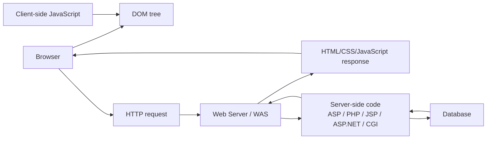

# 웹 문서와 실행 위치

source:
- [[40_자료/강의 자료/5-20_웹보안.pdf|5-20 웹보안]], p.24-34
- [MDN HTML](https://developer.mozilla.org/en-US/docs/Web/HTML)
- [MDN Document Object Model](https://developer.mozilla.org/en-US/docs/Web/API/Document_Object_Model)
- [MDN JavaScript Guide - Introduction](https://developer.mozilla.org/en-US/docs/Web/JavaScript/Guide/Introduction)
- [Microsoft ASP Overview](https://learn.microsoft.com/en-us/previous-versions/iis/6.0-sdk/ms524929%28v%3Dvs.90%29)
- [PHP: History of PHP](https://www.php.net/manual/en/history.php.php)
- [Jakarta Pages](https://jakarta.ee/specifications/pages/)

## 한 줄 요약

웹 문서와 웹 언어를 볼 때 가장 먼저 구분할 것은 **브라우저가 받아서 해석하는 것**과 **서버가 실행한 뒤 결과만 보내는 것**이다.

HTML, DOM, JavaScript는 브라우저 안에서 화면과 동작을 만드는 쪽에 가깝고, ASP, PHP, JSP 같은 서버 측 기술은 서버에서 실행되어 HTML, JSON, redirect 같은 응답을 만든다. 보안 판단은 이 실행 위치를 구분해야 맞게 할 수 있다.

---

## 먼저 잡아야 할 핵심

- HTML은 웹 콘텐츠의 구조와 의미를 표현하는 markup이다.
- 브라우저는 HTML을 파싱해 DOM tree를 만들고, DOM을 기준으로 화면을 표시한다.
- JavaScript는 브라우저에서 DOM을 읽고 바꾸며 사용자 이벤트에 반응할 수 있다.
- Node.js처럼 JavaScript가 서버에서 실행될 수도 있지만, 그때의 JavaScript는 브라우저 DOM을 기본으로 갖는 것이 아니다.
- ASP, PHP, JSP 같은 서버 측 기술은 서버에서 실행되고, 클라이언트는 그 실행 결과를 HTTP 응답으로 받는다.
- 브라우저에 내려온 HTML, JavaScript, 요청값은 사용자가 보거나 조작할 수 있다고 봐야 한다.
- 따라서 인증, 권한, 입력 검증 같은 보안 판단은 서버 측에서 다시 해야 한다.

---

## 전체 흐름

이 그림에서 중요한 경계는 두 개다.

1. **브라우저 경계**
   - HTML, CSS, JavaScript, DOM, Cookie, form 입력이 보이는 곳이다.
   - 사용자가 개발자도구, proxy, browser extension 등으로 관찰하거나 조작할 수 있다.
2. **서버 경계**
   - 인증, 권한, DB query, 파일 저장, business logic이 실행되는 곳이다.
   - 사용자가 직접 수정할 수 없어야 하며, 보안 판단의 기준점이 된다.

---

## HTML과 DOM

HTML은 웹 페이지의 구조를 표현한다. MDN은 HTML을 웹의 가장 기본적인 building block으로 설명하고, CSS는 표현, JavaScript는 동작을 담당하는 다른 기술로 구분한다.

PDF p.24는 HTML을 “브라우저를 통해 파싱되고 표현됨”, “HTTP를 통해 송/수신됨”이라고 설명한다. 이 관점은 맞다. 다만 HTML은 서버 코드처럼 실행되는 언어가 아니라, 브라우저가 해석하는 문서 구조에 가깝다.

DOM은 HTML 문서를 프로그램이 다룰 수 있는 객체 구조로 표현한 것이다. PDF p.26-27의 그림은 HTML source가 `Document -> html -> head/body -> element/text/attribute` 같은 tree로 바뀌고, JavaScript가 `window`, `document`, `forms`, `images`, `cookie` 같은 객체에 접근할 수 있음을 보여준다.

보안 관점에서는 DOM이 중요하다.

- XSS는 공격자가 넣은 값이 브라우저에서 HTML/JavaScript로 해석될 때 성립한다.
- DOM 조작이 가능하면 화면, form, link, cookie 접근 흐름이 바뀔 수 있다.
- 단, DOM에서 검증했다고 서버 검증이 끝난 것은 아니다.

---

## Client-side와 Server-side 구분

| 구분 | 실행 위치 | 사용자가 볼 수 있는가 | 보안 판단 |
|---|---|---|---|
| HTML | 브라우저 | 볼 수 있음 | 화면 구조. 숨겨도 보안 경계가 아님 |
| CSS | 브라우저 | 볼 수 있음 | 표현 담당. PDF의 `CSS (Client Side Script)` 표기는 혼동 주의 |
| JavaScript | 주로 브라우저. Node.js에서는 서버에서도 실행 가능 | 브라우저로 내려오면 볼 수 있음 | 사용자 조작 가능성을 전제로 해야 함 |
| DOM | 브라우저 메모리의 문서 객체 구조 | 개발자도구 등으로 관찰 가능 | XSS, client-side validation, cookie 접근과 연결 |
| ASP / PHP / JSP / ASP.NET | 서버 | 원본 코드는 보통 보이지 않음 | 인증, 권한, 입력 검증, DB 처리의 실제 기준 |
| CGI | 서버 | 원본 코드는 보통 보이지 않음 | 서버 프로그램이 요청을 처리하고 응답을 생성 |

PDF p.25는 `CSS (Client Side Script)`와 `SSS (Server Side Script)`라는 식으로 나누는데, 여기서 `CSS`는 일반적인 Cascading Style Sheets의 CSS와 혼동하면 안 된다. 이 범위의 핵심은 약어 자체보다 **client-side script와 server-side script의 실행 위치 차이**다.

---

## JavaScript와 Java는 다르다

RAW 메모에는 “자바스크립트랑 자바가 다르다는데, 자바 기반이면 비슷한 것 아닌가?”라는 질문이 있다.

정리하면:

- JavaScript는 Java 기반 언어가 아니다.
- 이름과 일부 문법 느낌이 비슷할 뿐, 실행 모델과 타입 시스템이 다르다.
- 브라우저 JavaScript는 DOM, event, browser API와 결합해 화면을 조작한다.
- Java는 class 기반 언어이고, JSP 같은 서버 측 Java 웹 기술에서 서버 코드로 쓰일 수 있다.

MDN도 JavaScript와 Java가 일부 유사하지만 근본적으로 다르다고 설명한다.

---

## Node.js는 왜 나오는가

RAW 메모의 “Node.js를 쓰면 서버에 뭘 할 수 있다고?”는 이 구분에서 이해하면 된다.

JavaScript는 원래 브라우저에서 많이 쓰였지만, Node.js 같은 runtime에서는 서버에서도 JavaScript 프로그램을 실행할 수 있다. 이 경우 JavaScript는 파일 처리, DB 연결, HTTP 요청 처리 같은 서버 기능을 할 수 있다.

단, Node.js에서 실행되는 JavaScript가 곧 브라우저 DOM을 가진다는 뜻은 아니다. MDN은 DOM이 JavaScript 언어 자체의 일부가 아니라 Web API라고 구분한다. 즉:

- 브라우저 JavaScript: DOM, `window`, `document`, event 등과 결합
- Node.js JavaScript: 서버 runtime API, filesystem, network, package ecosystem 등과 결합

---

## 서버 측 기술들

PDF p.31-34는 ASP, ASP.NET, PHP, JSP를 서버 측 스크립트 예시로 다룬다.

### ASP

Classic ASP는 IIS에서 동작하던 Microsoft의 서버 측 기술이다. Microsoft 문서도 ASP page 안의 script command가 web server에서 처리된 뒤 browser로 보내진다고 설명한다. 그래서 `.asp` 파일의 원본 코드가 그대로 사용자에게 제공되는 것이 아니라, 서버가 처리한 결과가 응답으로 온다.

이 점은 Camel 실습과 직접 연결된다. Camel에서 `.asp`가 업로드 경로에서 실행되면, 브라우저가 ASP source를 보는 것이 아니라 IIS가 ASP 코드를 실행한 결과를 본다.

### ASP.NET

PDF p.32는 ASP.NET 2.0까지를 기준으로 설명하므로 오래된 설명이다. 현재는 ASP.NET Core가 .NET과 C# 기반의 웹 앱/서비스 프레임워크로 이어진다. 이 노트에서 중요한 것은 버전사가 아니라 “서버에서 웹 응답을 만드는 기술”이라는 위치다.

### PHP

PDF p.33의 “PHP5가 최신”이라는 부분은 지금 기준으로 오래됐다. PHP 공식 history는 PHP 8 계열을 별도 major update로 설명한다.

또한 PHP의 이름도 원래 `Personal Home Page Tools`에서 출발했지만, PHP 3 시점에 `PHP: Hypertext Preprocessor`라는 recursive acronym으로 정리되었다. 따라서 PDF의 “Professional Hypertext Preprocessor” 표현은 현재 공식 설명으로는 부정확하다.

### JSP / Jakarta Pages

JSP는 Java 기반 서버 측 웹 기술이다. PDF p.34처럼 JSP file은 서버에서 servlet code로 변환되고 compile되어 실행될 수 있다. 현재 명칭과 생태계는 Jakarta Pages / Jakarta Server Pages 쪽으로 이어진다.

Eclipse Jakarta Pages 문서는 HTML/XML 같은 textual content와 custom tags, expression language, embedded Java code를 섞은 template engine이며 Jakarta Servlet으로 compile된다고 설명한다.

---

## “컴퓨터가 읽을 수 있다”는 말의 의미

RAW 메모에는 “JSP 파일은 클래스로 컴파일한다는데, 왜 그냥 JavaScript 파일은 컴퓨터가 못 읽는가?”라는 질문이 있다.

여기서 “읽는다”는 말이 섞여 있다.

- 브라우저는 HTML과 JavaScript source text를 받아서 파싱하고 실행할 수 있다.
- JavaScript engine은 JavaScript source를 해석하거나 내부 표현으로 바꿔 실행한다.
- Java/JSP 쪽에서는 Java source나 JSP template이 servlet/class/bytecode 흐름으로 바뀌고 JVM에서 실행된다.
- 즉 JavaScript는 “컴퓨터가 못 읽는 것”이 아니라, **브라우저나 JavaScript runtime이 읽고 실행하는 형식**이다.
- JSP는 **서버 측 Java web runtime이 읽고 변환/컴파일/실행하는 형식**이다.

보안에서 중요한 차이는 실행 방식보다 **어디에서 실행되느냐**다. 브라우저에서 실행되는 코드는 사용자가 관찰하고 조작할 수 있고, 서버에서 실행되는 코드는 서버 통제 아래 있어야 한다.

---

## 연결되는 보안 주제

- [[10_학습 노트/시스템보안/웹보안/웹 애플리케이션 구조|웹 애플리케이션 구조]]
  - 요청이 Web Client, Web Server, WAS, DB를 어떻게 지나는지 보는 상위 구조다.
- [[10_학습 노트/시스템보안/웹보안/Client-side Validation 우회와 Server-side Validation 실습|Client-side Validation 우회와 Server-side Validation 실습]]
  - 브라우저 JavaScript 검증이 왜 보안 경계가 아닌지 보여주는 실습이다.
- [[10_학습 노트/시스템보안/웹보안/HTML 인코딩|HTML 인코딩]]
  - 브라우저가 값을 HTML/attribute/JavaScript/URL 문맥으로 해석하는 문제와 연결된다.
- [[10_학습 노트/시스템보안/웹보안/XSS|XSS]]
  - 사용자 입력이 브라우저에서 script로 실행되는 대표 취약점이다.
- [[10_학습 노트/시스템보안/웹보안/File Upload와 Webshell|File Upload와 Webshell]]
  - 업로드한 PHP/JSP/ASP 같은 서버 측 코드가 웹에서 실행될 때의 위험과 연결된다.
- [[10_학습 노트/시스템보안/웹보안/CSRF|CSRF]]
  - 브라우저가 사용자의 session cookie를 붙여 요청을 보내는 동작과 연결된다.

---

## 수업 표현을 정확한 개념으로 바꾸기

| 수업/PDF 표현 | 정리한 표현 |
|---|---|
| CSS (Client Side Script) | CSS는 보통 Cascading Style Sheets다. 여기서는 client-side script 분류로 이해하되 용어 혼동 주의 |
| JavaScript는 Java 기반인가? | 아니다. 이름과 일부 문법이 비슷할 뿐 언어와 실행 모델이 다르다 |
| JavaScript는 브라우저에서만 실행되는가? | 아니다. Node.js 같은 runtime에서는 서버에서도 실행된다 |
| DOM은 JavaScript 자체인가? | 아니다. DOM은 Web API이고, JavaScript가 DOM을 조작할 수 있다 |
| PHP = Professional Hypertext Preprocessor | 현재 공식 history 기준으로는 `PHP: Hypertext Preprocessor`가 맞다 |
| ASP.NET 2.0이 최신 | PDF 작성 시점 기준 설명이다. 현재는 ASP.NET Core 등으로 이어진다 |
| JSP file을 컴퓨터가 읽는다 | 서버의 JSP/Jakarta Pages runtime이 servlet/class 흐름으로 변환하고 실행한다 |

---

## 확인 질문

1. 브라우저에서 실행되는 JavaScript 검증을 proxy로 지우면 왜 서버 검증이 지워지지 않는가?
2. PHP webshell을 업로드했는데 실행되지 않고 다운로드만 된다면, 어떤 조건이 빠진 것인가?
3. XSS에서 중요한 것은 JavaScript 문법인가, 사용자의 입력이 브라우저에서 어떤 문맥으로 해석되는가?
4. Node.js가 있어도 “DOM은 JavaScript 언어 자체의 일부”라고 말하면 왜 부정확한가?
