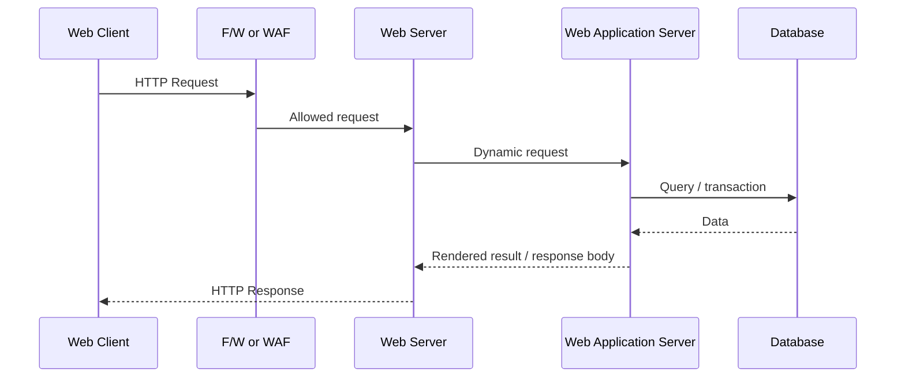

# 웹 애플리케이션 구조

source: [[40_자료/강의 자료/5-20_웹보안.pdf|5-20 웹보안]], p.3
raw memo: [[10_학습 노트/시스템보안/서론(이라쓰고 빠르게 휘갈겨 쓴거)|서론 raw 메모]]

## 한 줄 요약

웹 애플리케이션 구조는 단순한 구성도가 아니라, **요청이 어디를 지나가고 어느 지점에서 공격과 방어가 성립하는지 표시하는 지도**다.

```text
Web Client
  -> F/W 또는 Web F/W
  -> Web Server
  -> Web Application Server
  -> Database
```

웹 취약점은 대부분 이 흐름의 어느 한 지점에서 생긴다. 예를 들어 XSS는 브라우저와 HTML/JavaScript 경계에서, SQL Injection은 Application Server가 Database로 질의하는 경계에서, DDoS와 WAF는 외부 요청이 애플리케이션에 닿기 전의 방어 경계에서 이해해야 한다.

---

## 먼저 잡아야 할 핵심

- 화면에 보이는 것은 **Web Client의 브라우저가 렌더링한 결과**다.
- Web Server는 HTTP 요청을 받고 정적 파일을 제공하거나 WAS로 넘기는 앞단이다.
- Web Application Server는 로그인, 게시판, 검색, 권한 판단 같은 동적 로직을 실행한다.
- Database는 사용자, 게시글, 권한, 세션 관련 상태 같은 데이터를 저장한다.
- F/W는 보통 IP, port, protocol 같은 네트워크 조건을 본다.
- Web F/W 또는 WAF는 HTTP 요청의 URL, header, query string, body 같은 애플리케이션 계층 정보를 본다.
- Client에서 온 입력값은 전부 조작 가능하다고 보고 서버에서 검증해야 한다.

---

## 웹 애플리케이션의 구성 요소

| 구성 요소 | 의미 | 보안 관점 |
| --- | --- | --- |
| Web Client | 사용자의 브라우저. 예: MS Edge, Firefox, Safari, Chrome | HTML/CSS/JavaScript 실행 위치. XSS, CSRF, Cookie, Session Token 문제가 여기와 연결된다. |
| F/W | Firewall. 외부 네트워크와 서버 구간 사이의 네트워크 방어 장치 | IP, port, protocol, connection 상태를 기준으로 허용/차단한다. 웹 요청 내용까지 자세히 보지는 않는 경우가 많다. |
| Web Server | HTTP 요청을 받는 앞단 서버. 예: IIS, Apache | 정적 파일 제공, TLS 종료, reverse proxy, WAS 연동을 맡을 수 있다. Directory Indexing, 잘못된 method 허용, 노출 header 같은 설정 문제가 생긴다. |
| Web Application Server | 서버 측 애플리케이션 로직 실행 위치. 트래픽 규모에 따라 여러 인스턴스로 확장될 수 있다. | 인증, 권한, 입력 검증, 비즈니스 로직이 동작한다. Broken Access Control, Injection, File Upload 취약점의 핵심 위치다. |
| ASP / PHP / JSP / Perl / C/C++ | 동적 웹 페이지나 서버 측 로직을 만드는 기술 예시 | 사용자의 입력을 코드와 쿼리에 섞어 쓰면 Injection류 취약점이 생긴다. |
| Database | MS-SQL, Oracle, MySQL 같은 DBMS | SQL Injection, 권한 과다, 민감정보 평문 저장, 백업 노출 같은 문제가 연결된다. |
| Web F/W | Web Application Firewall, WAF | HTTP 요청을 규칙 기반으로 검사한다. SQLi, XSS, 비정상 URI, 비정상 body 같은 패턴을 막을 수 있지만 완전한 대체 방어는 아니다. |

---

## 요청이 처리되는 흐름

다음 URL을 기준으로 요청 흐름을 잡을 수 있다.

```text
http://www.aegisone.co.kr/showtable.asp?page=1&name=nuno
```

분해하면 다음과 같다.

| 부분 | 의미 |
| --- | --- |
| `http://` | scheme. 암호화 없는 HTTP를 뜻한다. |
| `www.aegisone.co.kr` | host. 사용자가 접속하는 공개 endpoint다. |
| `/showtable.asp` | path. `.asp` 확장자는 고전적인 ASP 기반 동적 페이지일 가능성을 보여준다. |
| `?page=1&name=nuno` | query string. 서버에 전달되는 사용자 입력값이다. |

흐름은 이렇게 잡으면 된다.

1. 브라우저가 URL을 해석하고 HTTP 요청을 만든다.
2. 요청은 네트워크를 지나 서버 앞단으로 간다.
3. Network Firewall이나 WAF가 있으면 여기서 일부 요청이 검사된다.
4. Web Server가 요청을 받는다.
5. 정적 파일이면 Web Server가 바로 응답할 수 있다.
6. 동적 처리라면 WAS나 서버 측 스크립트 엔진으로 넘긴다.
7. 애플리케이션 로직이 필요하면 DB에 질의한다.
8. 처리 결과가 HTML, JSON, 파일, redirect 같은 응답으로 돌아간다.
9. 브라우저가 응답을 해석하고 화면을 만든다.



---

## Web Server와 WAS 차이

### Web Server

Web Server는 웹 요청을 받는 앞단이다.

대표 역할:

- HTTP/HTTPS 요청 수신
- 정적 파일 제공
- TLS 종료
- 요청 로깅
- reverse proxy
- load balancing 연동
- WAS로 요청 전달

대표 예시:

- Apache HTTP Server
- Nginx
- Microsoft IIS

### Web Application Server

WAS는 애플리케이션 코드를 실행하는 영역이다.

대표 역할:

- 로그인 처리
- 회원가입 처리
- 검색 처리
- 게시글 작성/수정/삭제
- 권한 검사
- 세션 처리
- DB 조회/수정

대표 예시:

- Tomcat에서 실행되는 JSP/Servlet/Spring 애플리케이션
- PHP-FPM과 연결된 PHP 애플리케이션
- Node.js, Django, Rails, ASP.NET 같은 서버 애플리케이션

> [!important] 핵심
> Web Server와 WAS는 항상 물리적으로 분리된 서버라는 뜻은 아니다. 작은 환경에서는 한 장비나 한 프로세스 묶음에서 같이 돌 수 있고, 큰 환경에서는 Web Server, WAS, DB, cache, queue, CDN, load balancer가 분리된다.

---

## Web Server와 웹 페이지 차이

수업 메모의 “웹 서버: 화면에 보이는 거”는 그대로 쓰면 부정확하다.

- 웹 페이지: 브라우저가 HTML/CSS/JavaScript를 해석해서 보여주는 결과
- Web Client: 그 화면을 보여주는 브라우저
- Web Server: 브라우저가 요청한 자원을 보내주는 서버

정확히는 이렇게 봐야 한다.

```text
화면에 보이는 것 = 브라우저가 렌더링한 결과
화면을 구성하는 HTML/CSS/JS = 서버가 응답으로 준 자원
그 자원을 제공하거나 WAS로 넘긴 앞단 = Web Server
```

강사님이 이렇게 표현한 의도는 초심자에게 “사용자가 접속해서 보는 서비스의 앞단”을 빠르게 잡게 하려는 것으로 보인다. 다만 정리 노트에서는 서버와 화면을 분리해야 한다.

---

## 보안 경계

웹 보안은 “어디서 무엇을 믿으면 안 되는가”를 구분하는 일이다.

| 경계 | 신뢰하면 안 되는 것 | 대표 취약점 |
| --- | --- | --- |
| Client -> Web Server | URL, query string, cookie, form body, header | XSS, CSRF, 인증 우회, parameter tampering |
| Web Server -> WAS | routing, forwarded header, method, path normalization | 우회 접근, 잘못된 reverse proxy 설정 |
| WAS -> Database | 동적으로 조립한 SQL, 과도한 DB 권한 | SQL Injection, 정보 유출 |
| Internet -> F/W/WAF | 대량 트래픽, 비정상 요청, 알려진 공격 payload | DDoS, SQLi/XSS 패턴 공격 |
| Server -> Client | HTML에 출력하는 사용자 입력, Set-Cookie 속성 | XSS, session leakage |

> [!important] 서버 측 검증
> Client-side validation은 사용자 편의와 빠른 피드백에는 좋지만 보안 경계가 아니다. 공격자는 브라우저 개발자 도구, proxy tool, 직접 HTTP 요청으로 클라이언트 검증을 우회할 수 있다.

---

## 공격 위치 지도

| 공격/문제 | 주로 보는 위치 | 왜 여기서 보는가 |
| --- | --- | --- |
| XSS | Client, HTML, JavaScript, Server response | 서버가 사용자 입력을 HTML/JS 문맥에 안전하지 않게 출력할 때 브라우저에서 실행된다. |
| CSRF | Client 인증 상태, Cookie, 서버 기능 요청 | 사용자의 브라우저가 이미 로그인된 상태라는 점을 악용한다. |
| Session Hijacking | Cookie, Session Token, HTTP 요청 | 세션 식별자가 탈취되면 서버는 공격자를 기존 사용자로 볼 수 있다. |
| SQL Injection | WAS -> DB | 사용자 입력이 SQL 문법으로 해석되면 DB 질의가 변조된다. |
| File Upload / Webshell | Web Server, WAS, 파일 저장 경로 | 업로드된 파일이 실행 가능한 위치에 저장되고 실행되면 서버 제어로 이어질 수 있다. |
| Directory Indexing | Web Server 설정 | index 파일이 없을 때 디렉터리 목록을 노출하는 설정 문제다. |
| DDoS | Internet -> edge/F/W/CDN/LB | 애플리케이션이 정상 처리할 수 없는 양의 트래픽을 받는 문제다. |
| Security Misconfiguration | Web Server, WAS, DB, cloud 설정 | 기본값, debug, 과도한 노출, 불필요한 method 허용이 공격면을 만든다. |

---

## 수업 표현을 정확한 개념으로 바꾸기

| 수업 메모 표현 | 의도 추론 | 정리 노트에서의 정확한 표현 |
| --- | --- | --- |
| 웹 서버는 화면에 보이는 것 | 초심자에게 “사용자가 웹으로 접속하는 앞단”을 빠르게 설명하려는 표현 | 화면은 브라우저가 렌더링한다. Web Server는 HTTP 요청을 받고 자원을 제공하거나 WAS로 전달한다. |
| 어플 서버는 코드 동작 흐름 | 정적 파일 제공과 동적 로직 실행을 구분하려는 표현 | WAS는 인증, 권한, 검색, 게시판, DB 접근 같은 서버 측 로직을 실행한다. |
| 구글은 서버를 숨기지 않고 공개한다 | 웹 서비스는 공개 endpoint가 있어야 사용자가 접속할 수 있다는 뜻으로 보인다 | 공개되는 것은 도메인/IP/서비스 endpoint다. 실제 origin, 내부망, DB, 배포 구조는 보통 숨기거나 CDN/LB/proxy 뒤에 둔다. |
| 리눅스 기반 서버들은 대부분 Apache 사용 | 대표적인 Web Server 예시를 든 것으로 보인다 | Apache는 대표적인 웹 서버지만 현대 환경은 Apache, Nginx, IIS, cloud LB, CDN, managed platform이 섞인다. |
| 방화벽은 3,4계층만 막음 | 전통적 Network Firewall과 WAF를 구분시키려는 표현 | Network Firewall은 주로 IP, port, protocol, connection 상태를 본다. WAF는 HTTP 요청 내용까지 본다. |
| DDoS는 맷집 싸움 | 대량 트래픽은 개별 서버 튜닝만으로 버티기 어렵고 회선, 장비, 분산 인프라가 중요하다는 뜻 | DDoS 방어는 탐지, 흡수 용량, 분산 처리, scrubbing, rate limit, CDN/edge 방어를 같이 봐야 한다. |
| 웹 방화벽은 업데이트하면 웬만한 건 막음 | 알려진 공격 패턴은 managed rule로 빠르게 막을 수 있다는 뜻 | WAF는 알려진 패턴 방어와 virtual patching에 유용하지만, 우회와 오탐/미탐이 있으므로 애플리케이션 자체 보안을 대체하지 않는다. |
| IDS? IPS?로 검사? | 트래픽을 관찰하거나 차단하는 보안 장비의 역할을 설명하려는 흐름 | IDS는 탐지와 알림 중심, IPS는 inline 차단까지 수행한다. WAF는 웹 요청에 특화된 L7 필터링 장치다. |

---

## 오해하기 쉬운 지점

- Web Server는 “화면”이 아니다. 화면은 브라우저가 HTML/CSS/JavaScript를 해석해서 만든 결과다.
- Web Server와 WAS는 역할 구분이지 항상 물리 서버 두 대라는 뜻이 아니다. 작은 환경에서는 한 장비나 한 프로세스 묶음에 같이 있을 수 있다.
- WAF가 있으면 애플리케이션 보안을 안 해도 된다는 뜻이 아니다. 인증/권한 로직, 서버 측 검증, 안전한 DB 질의는 애플리케이션이 책임져야 한다.
- 방화벽이 “3,4계층만 본다”는 말은 전통적인 Network Firewall을 설명할 때 유용한 단순화다. 실제 제품은 stateful inspection, application awareness, NGFW 기능을 가질 수 있으므로 WAF와 목적을 구분해서 봐야 한다.
- DDoS 방어의 “무료 기본 방어”는 무제한 전담 대응팀을 뜻하지 않는다. 기본 인프라 보호, 애플리케이션별 threshold, 로그/알림, 비용 보호, 전문가 지원은 서비스와 요금제에 따라 달라진다.
- `Client -> Server -> DB` 흐름을 외우는 것보다, 각 경계에서 “무엇을 신뢰하면 안 되는가”를 설명할 수 있어야 한다.

---

## 실무에서 추가로 봐야 할 구조

### Reverse Proxy, Load Balancer, CDN

실무 웹 서비스는 Web Client, Web Server, WAS, DB만으로 끝나지 않는 경우가 많다. 서버 앞단에는 다음 요소가 붙을 수 있다.

- CDN: 정적 콘텐츠 캐싱, edge 분산, DDoS 흡수
- Load Balancer: 여러 서버로 요청 분산
- Reverse Proxy: 외부 요청을 내부 애플리케이션으로 중계
- API Gateway: API 인증, routing, rate limit, logging

이런 장비가 들어오면 “사용자가 접속하는 서버”와 “실제 애플리케이션이 실행되는 서버”가 달라진다.

```text
Client -> CDN/WAF -> Load Balancer -> Web Server/WAS -> DB
```

### Apache, Nginx, IIS의 위치

IIS, Apache, Nginx는 Web Server 계층을 이해할 때 자주 만나는 대표 예시다.

- IIS: Windows Server 계열에서 많이 쓰이는 Microsoft 웹 서버
- Apache HTTP Server: 전통적으로 많이 쓰인 오픈소스 웹 서버
- Nginx: reverse proxy, static serving, load balancing 용도로 널리 쓰이는 웹 서버

요즘 구조에서는 Nginx나 Apache가 앞단 reverse proxy 역할을 하고, 뒤에서 Tomcat, Node.js, PHP-FPM, Spring Boot 같은 애플리케이션이 동작하는 구성이 흔하다.

### Firewall, WAF, IDS, IPS 차이

| 구분 | 주로 보는 것 | 주 역할 |
| --- | --- | --- |
| Network Firewall | IP, port, protocol, connection state | 네트워크 접근 제어 |
| WAF | HTTP method, URI, header, cookie, query, body | 웹 공격 요청 탐지/차단 |
| IDS | 네트워크/호스트 이벤트 | 침입 탐지와 알림 |
| IPS | 네트워크/호스트 이벤트 | 침입 탐지 후 inline 차단 |

WAF는 웹 보안에서 유용하지만 모든 문제를 해결하지 않는다.

- SQLi/XSS 같은 알려진 payload 차단에는 강하다.
- 인증/권한 로직이 잘못된 문제는 WAF만으로 잡기 어렵다.
- 정상처럼 보이는 비즈니스 로직 악용은 애플리케이션 설계와 서버 측 검증이 필요하다.
- WAF와 애플리케이션의 HTTP 해석 방식이 다르면 우회 가능성이 생긴다.

---

## 깊게 파기 / TMI

### TCP segmentation, IP fragmentation, MTU

수업 메모의 “웹 클라이언트에서 1GB를 보낸다”는 예시는 “큰 데이터가 네트워크에서 한 덩어리로 가지 않는다”는 직관을 주기 위한 것으로 보인다.

정확히 나누면 다음과 같다.

- 애플리케이션은 1GB 파일을 HTTP request body로 보낼 수 있다.
- TCP는 그 데이터를 작은 segment들로 나누어 보낸다.
- IP 계층에서는 MTU보다 큰 IP packet이 생기면 fragmentation이 발생할 수 있다.
- 현대 TCP 통신에서는 보통 path MTU와 MSS를 맞춰 IP fragmentation을 피하는 방향으로 동작한다.

따라서 웹 업로드를 이해할 때는 먼저 이렇게 잡는다.

```text
1GB upload
  -> HTTP request body
  -> TCP segmentation
  -> IP packet
  -> Ethernet frame
```

IP fragmentation은 “대용량 업로드의 일반 설명”이라기보다, MTU보다 큰 IP packet을 처리하는 네트워크 계층 문제로 따로 보는 것이 안전하다.

### 클라우드 DDoS 방어의 무료/유료 경계

작성 시점 기준: 2026-05-20.

“클라우드는 무료로 DDoS 방어를 해준다”는 말은 일부 맞지만, 범위를 잘라야 한다.

- AWS Shield Standard는 모든 AWS 고객에게 자동 제공되고, 일반적인 네트워크/전송 계층 DDoS 공격을 추가 비용 없이 방어한다.
- AWS Shield Advanced는 유료이며, 추가 보호와 대응 지원 범위가 넓다.
- Azure는 기본 인프라 수준 DDoS 보호를 제공하지만, 애플리케이션 입장에서는 threshold, telemetry, alerting 한계가 있을 수 있다. Azure DDoS Protection 유료 계층은 전용 모니터링, 애플리케이션별 threshold, Rapid Response, cost protection 같은 기능을 제공한다.
- Cloudflare는 모든 플랜에 DDoS protection을 표시하고, L3/4와 L7 DDoS 방어 기능을 제공한다. 단, 세부 customization, adaptive 기능, 고급 신호는 플랜에 따라 차이가 있다.

정리하면:

```text
기본 방어 = 플랫폼/인프라를 보호하는 공통 방어
유료 방어 = 애플리케이션별 세밀한 탐지, 대응 지원, 보상/비용 보호, 고급 로그와 튜닝
```

강사님이 말한 “가격 이점 때문에 클라우드가 대세가 됐다”는 말은 DDoS 관점에서는 타당한 부분이 있다. 개인 서버나 작은 회사가 대규모 DDoS 방어망을 직접 구축하기 어렵기 때문이다. 다만 클라우드가 대세가 된 이유 전체를 DDoS 방어 하나로 설명하면 과장이다. 탄력적 확장, managed service, 글로벌 네트워크, 운영 자동화, 초기 비용 감소 같은 이유도 함께 봐야 한다.

---

## 공식 문서로 확인한 기준

- [MDN HTTP Overview](https://developer.mozilla.org/en-US/docs/Web/HTTP/Guides/Overview): HTTP를 client-server model 기반의 application-layer protocol로 설명한다.
- [OWASP WSTG - Map Application Architecture](https://owasp.org/www-project-web-security-testing-guide/latest/4-Web_Application_Security_Testing/01-Information_Gathering/10-Map_Application_Architecture): 웹 애플리케이션을 효과적으로 테스트하려면 아키텍처와 사용 기술을 이해해야 한다는 기준으로 참고했다.
- [Cloudflare WAF Overview](https://developers.cloudflare.com/waf/): WAF가 들어오는 web/API request를 ruleset으로 검사한다는 설명을 참고했다.
- [NIST SP 800-94](https://csrc.nist.gov/pubs/sp/800/94/final): IDS/IPS 기술 이해와 설계, 운영, 유지보수를 다루는 IDPS 가이드로 참고했다.
- [AWS Shield Standard overview](https://docs.aws.amazon.com/waf/latest/developerguide/ddos-standard-summary.html): AWS Shield Standard의 자동 제공 및 network/transport layer DDoS 보호 범위를 참고했다.
- [Azure DDoS Protection FAQ](https://learn.microsoft.com/en-us/azure/ddos-protection/ddos-faq): 기본 인프라 수준 방어와 유료 DDoS Protection의 telemetry, alerting, Rapid Response, cost protection 차이를 참고했다.
- [Cloudflare DDoS Protection](https://developers.cloudflare.com/ddos-protection/): 모든 플랜의 DDoS 방어 제공, L3/4와 L7 공격 방어 기능, 고급 기능의 플랜 차이를 참고했다.

---

## 앞으로 연결될 내용

- [[10_학습 노트/시스템보안/웹보안/HTTP 구조와 메시지|HTTP 구조와 메시지]]
- [[10_학습 노트/시스템보안/웹보안/HTTP Method와 Header|HTTP Method와 Header]]
- [[10_학습 노트/시스템보안/네트워크보안/HTTP 로그인 평문 노출|HTTP 로그인 평문 노출]]
- [[10_학습 노트/시스템보안/네트워크보안/ARP 스푸핑|ARP 스푸핑]]
- [[10_학습 노트/시스템보안/네트워크보안/Ettercap Filter 패킷 변조 실습|Ettercap Filter 패킷 변조 실습]]

추후 연결 예정:

- 웹 인증 구조
- 세션과 쿠키
- XSS
- CSRF
- SQL Injection
- File Upload와 Webshell
- Directory Indexing

---

## 확인 질문

- 사용자가 브라우저 개발자 도구나 proxy tool로 request body를 바꾸면, Client-side validation은 왜 보안 경계가 될 수 없는가?
- Web Server에서 막아야 하는 문제와 WAS에서 막아야 하는 문제는 어떻게 나뉘는가?
- WAF가 SQL Injection payload를 차단하더라도, 애플리케이션에서 prepared statement가 필요한 이유는 무엇인가?
- DDoS 방어에서 “무료 기본 방어”와 “유료 고급 방어”의 차이는 무엇인가?
- `웹 서버는 화면에 보이는 것`이라는 표현을 정확한 구조로 다시 말하면 어떻게 되는가?
