# IaC - Source Digest

## Source

| 항목 | 내용 |
|---|---|
| 원본 파일 | `Iac.pdf` |
| 원본 페이지 | 1-52 |
| 주제 | Infrastructure as Code / Terraform |
| 자료 성격 | IaC 개론 + Terraform 실습 중심 강의자료 |
| 1차 출처 분류 | PDF |
| 외부 검증 | 수행하지 않음 |
| 이미지 보존 | `assets/Iac_page_01.png` ~ `assets/Iac_page_52.png` 전체 페이지 렌더링 포함 |

## 보존 정책

- 이 문서는 **정보 손실 최소화**를 위해 모든 페이지의 선택 가능한 텍스트를 페이지별 원문 추출 형태로 보존한다.
- 코드 블록, 콘솔 화면, AWS 콘솔 캡처, 아키텍처 다이어그램처럼 텍스트 추출만으로 손실될 수 있는 정보는 **전체 페이지 이미지**를 함께 연결한다.
- PDF 원문 표기, 오타 가능성이 있는 표현, 명령어 표기는 임의 수정하지 않는다.
- PDF에 없는 최신 Terraform/AWS 동작 검증은 이 Source Digest에 섞지 않고 `확인 필요`로 분리한다.
- `Visual/Code Notes`는 이미지에 포함된 내용을 사람이 다시 찾기 쉽게 만든 색인이다. 원본 보존의 기준은 함께 제공된 페이지 이미지다.

## Source Classification

| 내용 유형 | 출처 분류 | 처리 방식 |
|---|---|---|
| PDF 본문, 제목, 실습 조건, 명령어 출력 | PDF | 원문 추출 텍스트로 보존 |
| 코드 이미지, 콘솔 캡처, 아키텍처 도식 | PDF | 페이지 이미지로 원형 보존 + 시각 노트 작성 |
| Terraform 명령어의 실제 최신 동작 | 인터넷 고신뢰 정보 필요 | 이 문서에서는 검증하지 않음 |
| 보충 개념 설명 | 내장 지식 가능 | 이 문서에서는 최소화 |

## 전체 흐름

```text
IaC 개념
→ IaC 구현 도구 분류
→ IaC 장점
→ Terraform 개요
→ Terraform Workflow
→ Resource / Data Source
→ Variable / Output
→ count / for_each / 조건문
→ Module
→ Backend / Remote State
→ 외부 Module + Local Module 실습
```

## Section Map

| Page Range | Section | 핵심 내용 |
|---:|---|---|
| p.1-p.5 | IaC Summary | IaC 정의, 도구 범주, IaC 장점 |
| p.6-p.11 | Terraform Overview | Terraform 개요, 선언적 언어, Workflow, provider, `terraform init` |
| p.12-p.28 | Resource & Data Source | EC2 Resource 생성/수정/삭제, Resource 참조, Data Source, 실습 아키텍처 |
| p.29-p.37 | Variable_Input & Output | Input Variable, Validation, Variable 참조, Output, VPC/ALB/ASG 예제 |
| p.38-p.41 | 반복문 & 조건문 | `count`, `for_each`, 조건문 |
| p.42-p.52 | Module / Backend / Remote State | Module, Registry, 원격 Backend, Local/External Module, `terraform_remote_state`, 실습 |

---

## Page Digest

### p.1 — 표지 - Infrastructure as Code

- Section: `IaC Summary`
- Page image: `assets/Iac_page_01.png`
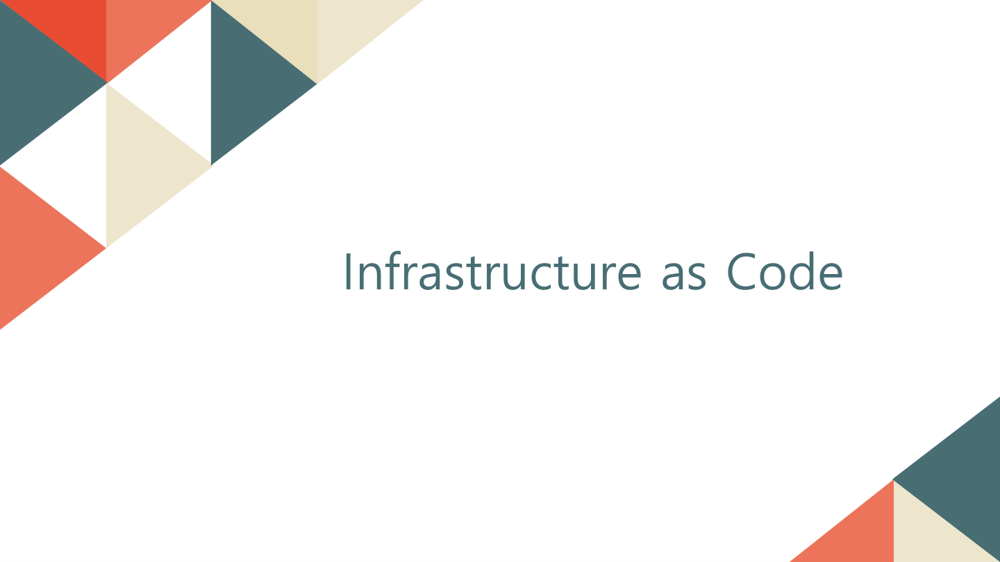

#### 원문 추출 텍스트

```text
Infrastructure as Code
```

#### Visual / Code Notes

- 별도 코드/도식 보존 메모 없음. 전체 페이지 이미지는 위 링크로 보존됨.

### p.2 — IaC 정의와 전체 환경 이미지

- Section: `IaC Summary`
- Page image: `assets/Iac_page_02.png`
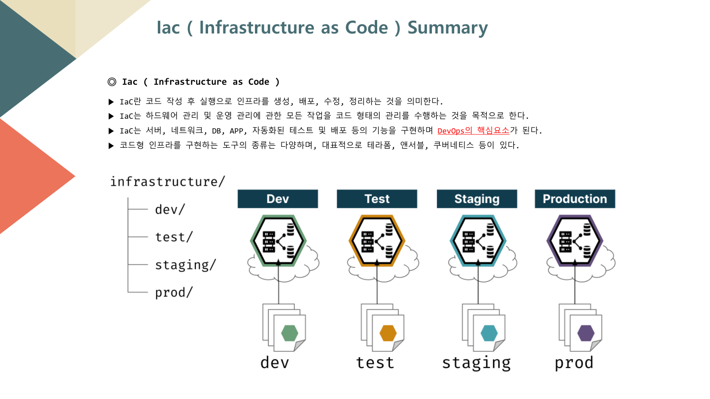

#### 원문 추출 텍스트

```text
Iac ( Infrastructure as Code ) Summary
◎ Iac ( Infrastructure as Code )
▶ IaC란 코드 작성 후 실행으로 인프라를 생성, 배포, 수정, 정리하는 것을 의미한다.
▶ IaC는 하드웨어 관리 및 운영 관리에 관한 모든 작업을 코드 형태의 관리를 수행하는 것을 목적으로 한다.
▶ IaC는 서버, 네트워크, DB, APP, 자동화된 테스트 및 배포 등의 기능을 구현하며 DevOps의 핵심요소가 된다.
▶ 코드형 인프라를 구현하는 도구의 종류는 다양하며, 대표적으로 테라폼, 앤서블, 쿠버네티스 등이 있다.
```

#### Visual / Code Notes

- Dev/Test/Staging/Production 환경별 infrastructure 디렉터리 구조와 각 환경별 배포 이미지를 시각화한 그림이 포함됨.

### p.3 — IaC 구현도구 범주 1 - ad-hoc script / 구성 관리 도구

- Section: `IaC Summary`
- Page image: `assets/Iac_page_03.png`
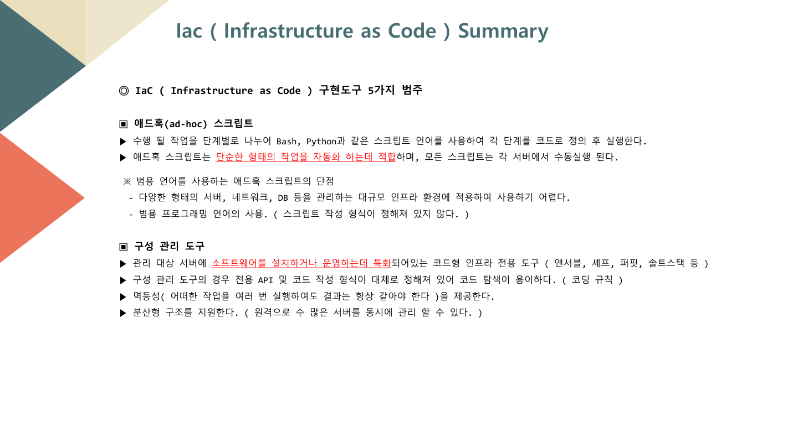

#### 원문 추출 텍스트

```text
Iac ( Infrastructure as Code ) Summary
◎ IaC ( Infrastructure as Code ) 구현도구 5가지 범주
▣ 애드혹(ad-hoc) 스크립트 
▶수행 될 작업을 단계별로 나누어 Bash, Python과 같은 스크립트 언어를 사용하여 각 단계를 코드로 정의 후 실행한다.
▶애드혹 스크립트는 단순한 형태의 작업을 자동화 하는데 적합하며, 모든 스크립트는 각 서버에서 수동실행 된다.
 ※ 범용 언어를 사용하는 애드훅 스크립트의 단점 
  - 다양한 형태의 서버, 네트워크, DB 등을 관리하는 대규모 인프라 환경에 적용하여 사용하기 어렵다.
- 범용 프로그래밍 언어의 사용. ( 스크립트 작성 형식이 정해져 있지 않다. )
▣ 구성 관리 도구
▶관리 대상 서버에 소프트웨어를 설치하거나 운영하는데 특화되어있는 코드형 인프라 전용 도구 ( 앤서블, 셰프, 퍼핏, 솔트스택 등 ) 
▶구성 관리 도구의 경우 전용 API 및 코드 작성 형식이 대체로 정해져 있어 코드 탐색이 용이하다. ( 코딩 규칙 )
▶멱등성( 어떠한 작업을 여러 번 실행하여도 결과는 항상 같아야 한다 )을 제공한다.
▶분산형 구조를 지원한다. ( 원격으로 수 많은 서버를 동시에 관리 할 수 있다. )
```

#### Visual / Code Notes

- 별도 코드/도식 보존 메모 없음. 전체 페이지 이미지는 위 링크로 보존됨.

### p.4 — IaC 구현도구 범주 2 - 서버 템플릿 / 오케스트레이션 / 프로비저닝

- Section: `IaC Summary`
- Page image: `assets/Iac_page_04.png`
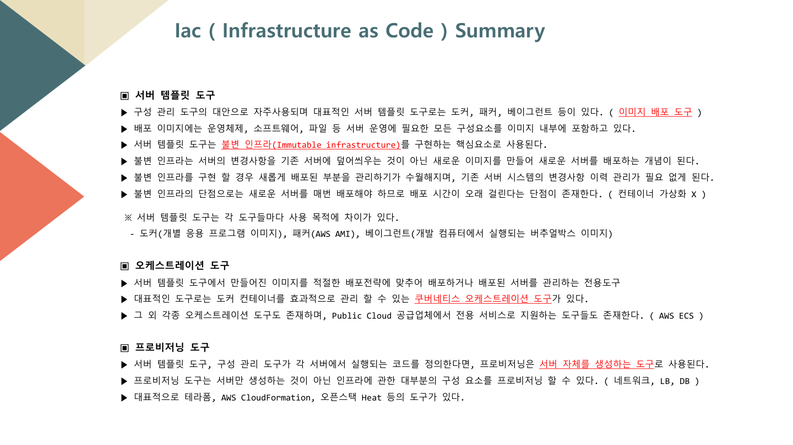

#### 원문 추출 텍스트

```text
Iac ( Infrastructure as Code ) Summary
▣ 서버 템플릿 도구
▶구성 관리 도구의 대안으로 자주사용되며 대표적인 서버 템플릿 도구로는 도커, 패커, 베이그런트 등이 있다. ( 이미지 배포 도구 )
▶배포 이미지에는 운영체제, 소프트웨어, 파일 등 서버 운영에 필요한 모든 구성요소를 이미지 내부에 포함하고 있다.
▶서버 템플릿 도구는 불변 인프라(Immutable infrastructure)를 구현하는 핵심요소로 사용된다.
▶불변 인프라는 서버의 변경사항을 기존 서버에 덮어씌우는 것이 아닌 새로운 이미지를 만들어 새로운 서버를 배포하는 개념이 된다.
▶불변 인프라를 구현 할 경우 새롭게 배포된 부분을 관리하기가 수월해지며, 기존 서버 시스템의 변경사항 이력 관리가 필요 없게 된다.
▶불변 인프라의 단점으로는 새로운 서버를 매번 배포해야 하므로 배포 시간이 오래 걸린다는 단점이 존재한다. ( 컨테이너 가상화 X )
 ※ 서버 템플릿 도구는 각 도구들마다 사용 목적에 차이가 있다. 
- 도커(개별 응용 프로그램 이미지), 패커(AWS AMI), 베이그런트(개발 컴퓨터에서 실행되는 버추얼박스 이미지)
▣ 오케스트레이션 도구
▶서버 템플릿 도구에서 만들어진 이미지를 적절한 배포전략에 맞추어 배포하거나 배포된 서버를 관리하는 전용도구
▶대표적인 도구로는 도커 컨테이너를 효과적으로 관리 할 수 있는 쿠버네티스 오케스트레이션 도구가 있다.
▶그 외 각종 오케스트레이션 도구도 존재하며, Public Cloud 공급업체에서 전용 서비스로 지원하는 도구들도 존재한다. ( AWS ECS )
▣ 프로비저닝 도구
▶서버 템플릿 도구, 구성 관리 도구가 각 서버에서 실행되는 코드를 정의한다면, 프로비저닝은 서버 자체를 생성하는 도구로 사용된다.
▶프로비저닝 도구는 서버만 생성하는 것이 아닌 인프라에 관한 대부분의 구성 요소를 프로비저닝 할 수 있다. ( 네트워크, LB, DB )
▶대표적으로 테라폼, AWS CloudFormation, 오픈스택 Heat 등의 도구가 있다.
```

#### Visual / Code Notes

- 별도 코드/도식 보존 메모 없음. 전체 페이지 이미지는 위 링크로 보존됨.

### p.5 — IaC의 장점

- Section: `IaC Summary`
- Page image: `assets/Iac_page_05.png`
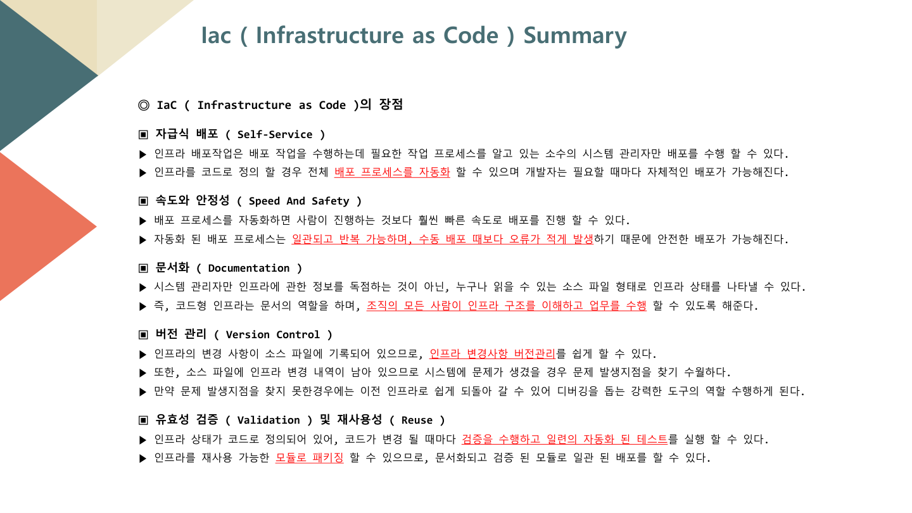

#### 원문 추출 텍스트

```text
Iac ( Infrastructure as Code ) Summary
◎ IaC ( Infrastructure as Code )의 장점
▣ 자급식 배포 ( Self-Service ) 
▶인프라 배포작업은 배포 작업을 수행하는데 필요한 작업 프로세스를 알고 있는 소수의 시스템 관리자만 배포를 수행 할 수 있다.
▶ 인프라를 코드로 정의 할 경우 전체 배포 프로세스를 자동화 할 수 있으며 개발자는 필요할 때마다 자체적인 배포가 가능해진다.
▣ 속도와 안정성 ( Speed And Safety )
▶배포 프로세스를 자동화하면 사람이 진행하는 것보다 훨씬 빠른 속도로 배포를 진행 할 수 있다.
▶자동화 된 배포 프로세스는 일관되고 반복 가능하며, 수동 배포 때보다 오류가 적게 발생하기 때문에 안전한 배포가 가능해진다.
▣ 문서화 ( Documentation )
▶시스템 관리자만 인프라에 관한 정보를 독점하는 것이 아닌, 누구나 읽을 수 있는 소스 파일 형태로 인프라 상태를 나타낼 수 있다.
▶ 즉, 코드형 인프라는 문서의 역할을 하며, 조직의 모든 사람이 인프라 구조를 이해하고 업무를 수행 할 수 있도록 해준다.
▣ 버전 관리 ( Version Control )
▶인프라의 변경 사항이 소스 파일에 기록되어 있으므로, 인프라 변경사항 버전관리를 쉽게 할 수 있다.
▶ 또한, 소스 파일에 인프라 변경 내역이 남아 있으므로 시스템에 문제가 생겼을 경우 문제 발생지점을 찾기 수월하다.
▶ 만약 문제 발생지점을 찾지 못한경우에는 이전 인프라로 쉽게 되돌아 갈 수 있어 디버깅을 돕는 강력한 도구의 역할 수행하게 된다.
▣ 유효성 검증 ( Validation ) 및 재사용성 ( Reuse )
▶인프라 상태가 코드로 정의되어 있어, 코드가 변경 될 때마다 검증을 수행하고 일련의 자동화 된 테스트를 실행 할 수 있다.
▶ 인프라를 재사용 가능한 모듈로 패키징 할 수 있으므로, 문서화되고 검증 된 모듈로 일관 된 배포를 할 수 있다.
```

#### Visual / Code Notes

- 별도 코드/도식 보존 메모 없음. 전체 페이지 이미지는 위 링크로 보존됨.

### p.6 — HashiCorp Terraform 표지

- Section: `Terraform Overview`
- Page image: `assets/Iac_page_06.png`
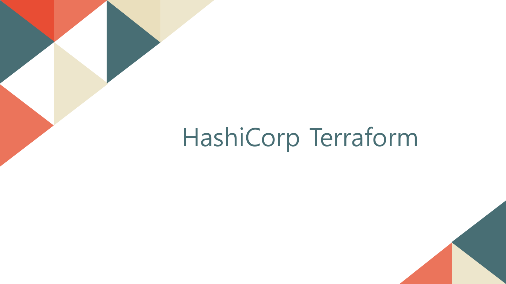

#### 원문 추출 텍스트

```text
HashiCorp Terraform
```

#### Visual / Code Notes

- 별도 코드/도식 보존 메모 없음. 전체 페이지 이미지는 위 링크로 보존됨.

### p.7 — Terraform 개요와 선언적/절차적 언어 비교

- Section: `Terraform Overview`
- Page image: `assets/Iac_page_07.png`
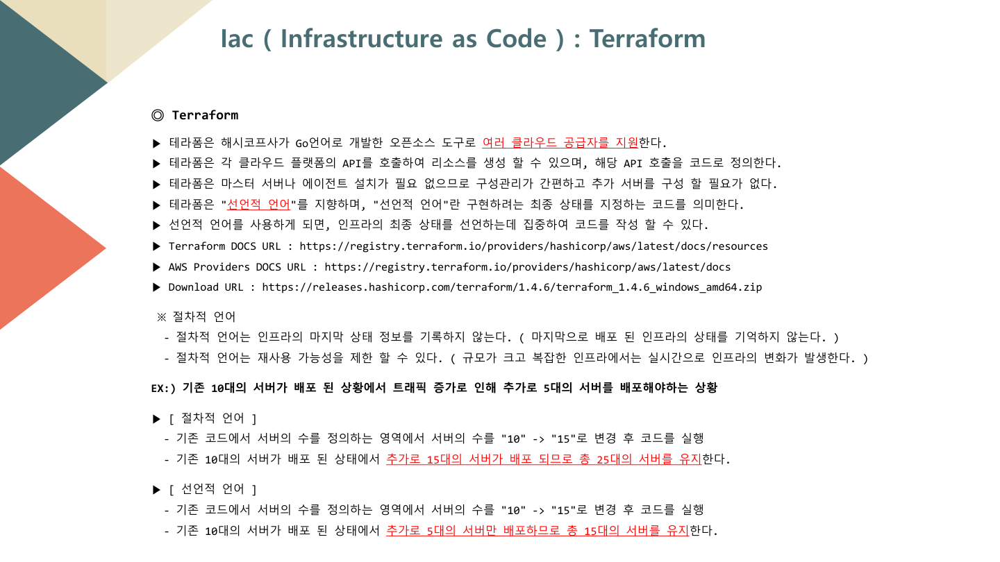

#### 원문 추출 텍스트

```text
Iac ( Infrastructure as Code ) : Terraform 
◎ Terraform
▶ 테라폼은 해시코프사가 Go언어로 개발한 오픈소스 도구로 여러 클라우드 공급자를 지원한다.
▶ 테라폼은 각 클라우드 플랫폼의 API를 호출하여 리소스를 생성 할 수 있으며, 해당 API 호출을 코드로 정의한다.
▶ 테라폼은 마스터 서버나 에이전트 설치가 필요 없으므로 구성관리가 간편하고 추가 서버를 구성 할 필요가 없다.
▶ 테라폼은 "선언적 언어"를 지향하며, "선언적 언어"란 구현하려는 최종 상태를 지정하는 코드를 의미한다.
▶ 선언적 언어를 사용하게 되면, 인프라의 최종 상태를 선언하는데 집중하여 코드를 작성 할 수 있다.
▶ Terraform DOCS URL : https://registry.terraform.io/providers/hashicorp/aws/latest/docs/resources
▶ AWS Providers DOCS URL : https://registry.terraform.io/providers/hashicorp/aws/latest/docs
▶ Download URL : https://releases.hashicorp.com/terraform/1.4.6/terraform_1.4.6_windows_amd64.zip
 ※ 절차적 언어 
  - 절차적 언어는 인프라의 마지막 상태 정보를 기록하지 않는다. ( 마지막으로 배포 된 인프라의 상태를 기억하지 않는다. ) 
- 절차적 언어는 재사용 가능성을 제한 할 수 있다. ( 규모가 크고 복잡한 인프라에서는 실시간으로 인프라의 변화가 발생한다. )
EX:) 기존 10대의 서버가 배포 된 상황에서 트래픽 증가로 인해 추가로 5대의 서버를 배포해야하는 상황
▶[ 절차적 언어 ] 
- 기존 코드에서 서버의 수를 정의하는 영역에서 서버의 수를 "10" -> "15"로 변경 후 코드를 실행 
  - 기존 10대의 서버가 배포 된 상태에서 추가로 15대의 서버가 배포 되므로 총 25대의 서버를 유지한다.
▶[ 선언적 언어 ] 
- 기존 코드에서 서버의 수를 정의하는 영역에서 서버의 수를 "10" -> "15"로 변경 후 코드를 실행 
  - 기존 10대의 서버가 배포 된 상태에서 추가로 5대의 서버만 배포하므로 총 15대의 서버를 유지한다.
```

#### Visual / Code Notes

- 별도 코드/도식 보존 메모 없음. 전체 페이지 이미지는 위 링크로 보존됨.

### p.8 — Terraform 장단점

- Section: `Terraform Overview`
- Page image: `assets/Iac_page_08.png`
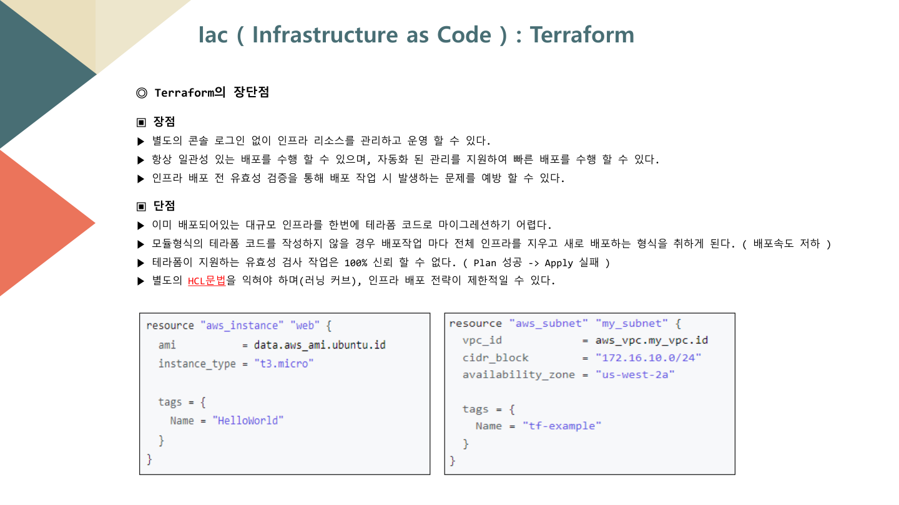

#### 원문 추출 텍스트

```text
Iac ( Infrastructure as Code ) : Terraform 
◎ Terraform의 장단점
▣ 장점 
▶별도의 콘솔 로그인 없이 인프라 리소스를 관리하고 운영 할 수 있다. 
▶항상 일관성 있는 배포를 수행 할 수 있으며, 자동화 된 관리를 지원하여 빠른 배포를 수행 할 수 있다.
▶인프라 배포 전 유효성 검증을 통해 배포 작업 시 발생하는 문제를 예방 할 수 있다.
▣ 단점
▶이미 배포되어있는 대규모 인프라를 한번에 테라폼 코드로 마이그레션하기 어렵다.
▶모듈형식의 테라폼 코드를 작성하지 않을 경우 배포작업 마다 전체 인프라를 지우고 새로 배포하는 형식을 취하게 된다. ( 배포속도 저하 )
▶테라폼이 지원하는 유효성 검사 작업은 100% 신뢰 할 수 없다. ( Plan 성공 -> Apply 실패 )
▶별도의 HCL문법을 익혀야 하며(러닝 커브), 인프라 배포 전략이 제한적일 수 있다.
```

#### Visual / Code Notes

- 오른쪽 하단에 절차적/선언적 방식의 코드 예시 이미지가 있음. 선택 텍스트에는 핵심 설명만 추출됨.

### p.9 — Terraform Workflow

- Section: `Terraform Overview`
- Page image: `assets/Iac_page_09.png`
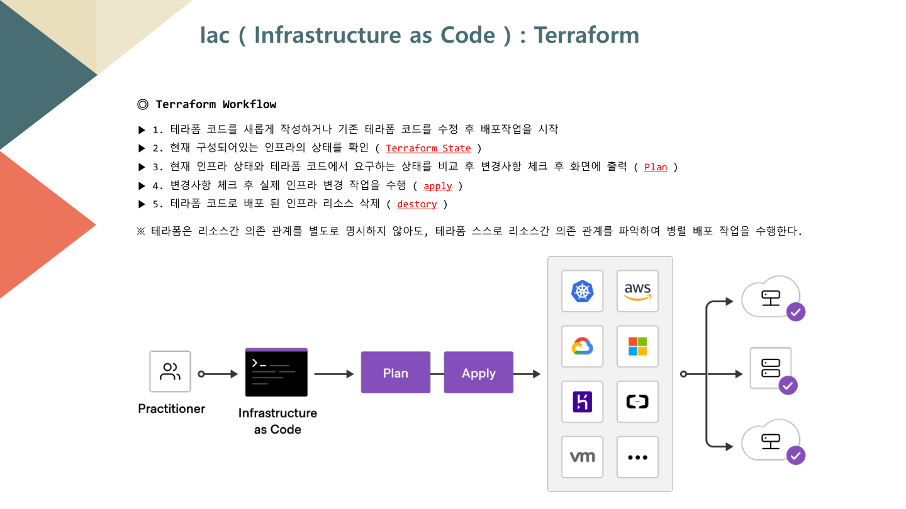

#### 원문 추출 텍스트

```text
Iac ( Infrastructure as Code ) : Terraform 
◎ Terraform Workflow
▶ 1. 테라폼 코드를 새롭게 작성하거나 기존 테라폼 코드를 수정 후 배포작업을 시작
▶ 2. 현재 구성되어있는 인프라의 상태를 확인 ( Terraform State )
▶ 3. 현재 인프라 상태와 테라폼 코드에서 요구하는 상태를 비교 후 변경사항 체크 후 화면에 출력 ( Plan )
▶ 4. 변경사항 체크 후 실제 인프라 변경 작업을 수행 ( apply )
▶ 5. 테라폼 코드로 배포 된 인프라 리소스 삭제 ( destory )
※ 테라폼은 리소스간 의존 관계를 별도로 명시하지 않아도, 테라폼 스스로 리소스간 의존 관계를 파악하여 병렬 배포 작업을 수행한다.
```

#### Visual / Code Notes

- Terraform Workflow 다이어그램이 있음. Presentation → Infrastructure as Code → Plan → Apply 흐름과 리소스 아이콘이 연결됨.

### p.10 — Terraform 기본설정 및 AWS Provider 정의

- Section: `Terraform Overview`
- Page image: `assets/Iac_page_10.png`
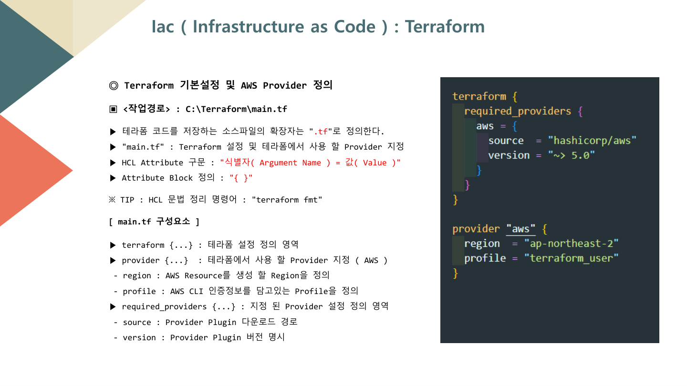

#### 원문 추출 텍스트

```text
◎ Terraform 기본설정 및 AWS Provider 정의
▣ <작업경로> : C:\Terraform\main.tf 
▶테라폼 코드를 저장하는 소스파일의 확장자는 ".tf"로 정의한다.
▶"main.tf" : Terraform 설정 및 테라폼에서 사용 할 Provider 지정
▶ HCL Attribute 구문 : "식별자( Argument Name ) = 값( Value )"
▶ Attribute Block 정의 : "{ }"
※ TIP : HCL 문법 정리 명령어 : "terraform fmt" 
[ main.tf 구성요소 ]
▶terraform {...} : 테라폼 설정 정의 영역
▶provider {...}  : 테라폼에서 사용 할 Provider 지정 ( AWS )
- region : AWS Resource를 생성 할 Region을 정의
- profile : AWS CLI 인증정보를 담고있는 Profile을 정의
▶required_providers {...} : 지정 된 Provider 설정 정의 영역
- source : Provider Plugin 다운로드 경로
- version : Provider Plugin 버전 명시
Iac ( Infrastructure as Code ) : Terraform
```

#### Visual / Code Notes

- 오른쪽에 `main.tf` 예시 코드 이미지가 있음: `terraform { required_providers { aws = { source = "hashicorp/aws", version = "~> 5.0" } } }`, `provider "aws" { region = "ap-northeast-2", profile = "terraform_user" }` 구조.

### p.11 — Terraform 초기구성 terraform init

- Section: `Terraform Overview`
- Page image: `assets/Iac_page_11.png`
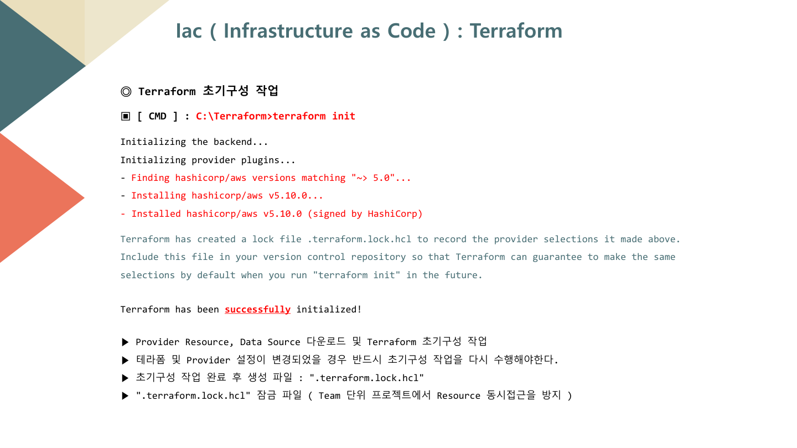

#### 원문 추출 텍스트

```text
Iac ( Infrastructure as Code ) : Terraform 
◎ Terraform 초기구성 작업
▣ [ CMD ] : C:\Terraform>terraform init
Initializing the backend...
Initializing provider plugins...
- Finding hashicorp/aws versions matching "~> 5.0"...
- Installing hashicorp/aws v5.10.0...
- Installed hashicorp/aws v5.10.0 (signed by HashiCorp)
Terraform has created a lock file .terraform.lock.hcl to record the provider selections it made above. 
Include this file in your version control repository so that Terraform can guarantee to make the same 
selections by default when you run "terraform init" in the future.
Terraform has been successfully initialized!
▶Provider Resource, Data Source 다운로드 및 Terraform 초기구성 작업
▶테라폼 및 Provider 설정이 변경되었을 경우 반드시 초기구성 작업을 다시 수행해야한다.
▶ 초기구성 작업 완료 후 생성 파일 : ".terraform.lock.hcl" 
▶ ".terraform.lock.hcl" 잠금 파일 ( Team 단위 프로젝트에서 Resource 동시접근을 방지 )
```

#### Visual / Code Notes

- `terraform init` 실행 로그가 본문 텍스트로 포함됨.

### p.12 — Resource & Data Source 표지

- Section: `Resource & Data Source`
- Page image: `assets/Iac_page_12.png`
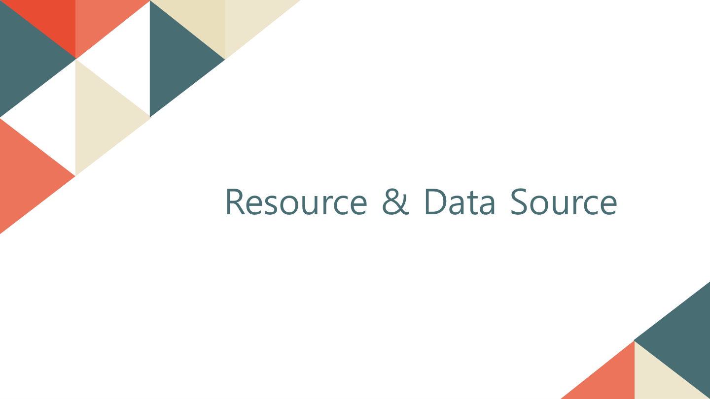

#### 원문 추출 텍스트

```text
Resource & Data Source
```

#### Visual / Code Notes

- 별도 코드/도식 보존 메모 없음. 전체 페이지 이미지는 위 링크로 보존됨.

### p.13 — Terraform AWS EC2 Resource 생성 - main.tf

- Section: `Resource & Data Source`
- Page image: `assets/Iac_page_13.png`
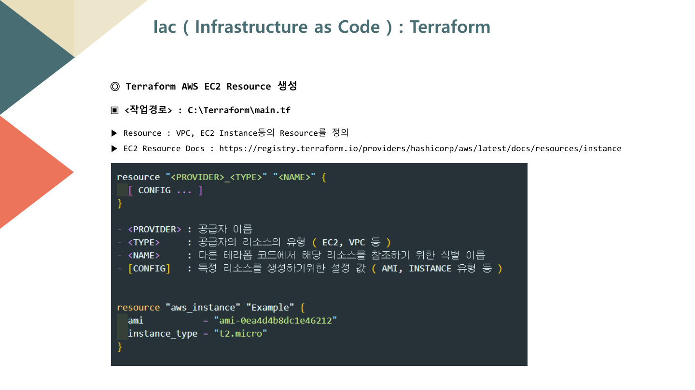

#### 원문 추출 텍스트

```text
◎ Terraform AWS EC2 Resource 생성
▣ <작업경로> : C:\Terraform\main.tf 
▶Resource : VPC, EC2 Instance등의 Resource를 정의
▶EC2 Resource Docs : https://registry.terraform.io/providers/hashicorp/aws/latest/docs/resources/instance
Iac ( Infrastructure as Code ) : Terraform
```

#### Visual / Code Notes

- 하단에 EC2 `aws_instance` Resource 정의 코드 이미지가 있음. AMI, instance_type, vpc_security_group_ids, subnet_id, key_name 등이 보임.

### p.14 — EC2 Resource 생성 EX.1 - terraform plan

- Section: `Resource & Data Source`
- Page image: `assets/Iac_page_14.png`
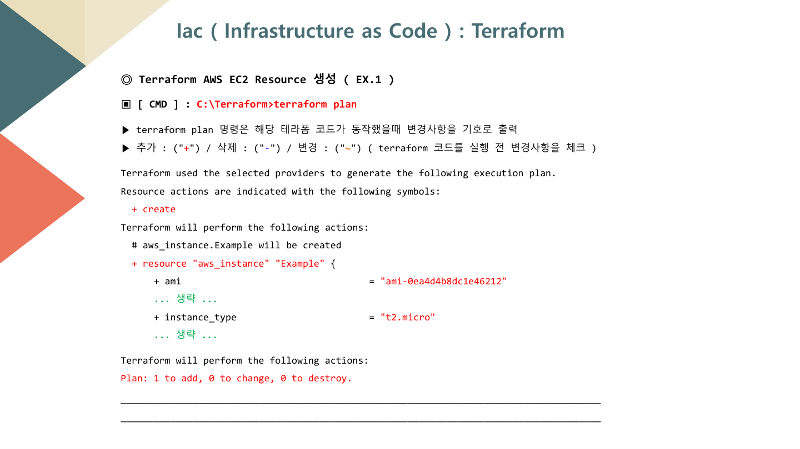

#### 원문 추출 텍스트

```text
Iac ( Infrastructure as Code ) : Terraform 
◎ Terraform AWS EC2 Resource 생성 ( EX.1 )
▣ [ CMD ] : C:\Terraform>terraform plan
▶terraform plan 명령은 해당 테라폼 코드가 동작했을때 변경사항을 기호로 출력 
▶추가 : ("+") / 삭제 : ("-") / 변경 : ("~") ( terraform 코드를 실행 전 변경사항을 체크 )
Terraform used the selected providers to generate the following execution plan. 
Resource actions are indicated with the following symbols:
+ create
Terraform will perform the following actions:
# aws_instance.Example will be created
+ resource "aws_instance" "Example" {
+ ami                                  = "ami-0ea4d4b8dc1e46212"
... 생략 ...
+ instance_type                        = "t2.micro"
... 생략 ...
Terraform will perform the following actions:
Plan: 1 to add, 0 to change, 0 to destroy.
───────────────────────────────────────────────────────────────────────────────────────
───────────────────────────────────────────────────────────────────────────────────────
```

#### Visual / Code Notes

- `terraform plan` 출력 예시가 본문 텍스트로 포함됨.

### p.15 — EC2 Resource 생성 EX.1 - terraform apply

- Section: `Resource & Data Source`
- Page image: `assets/Iac_page_15.png`
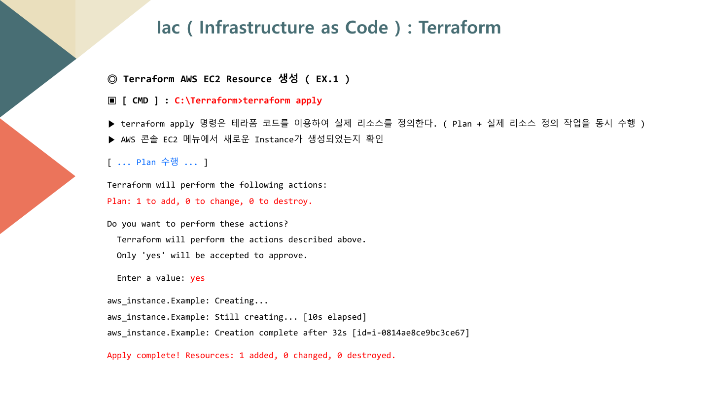

#### 원문 추출 텍스트

```text
Iac ( Infrastructure as Code ) : Terraform 
◎ Terraform AWS EC2 Resource 생성 ( EX.1 )
▣ [ CMD ] : C:\Terraform>terraform apply
▶terraform apply 명령은 테라폼 코드를 이용하여 실제 리소스를 정의한다. ( Plan + 실제 리소스 정의 작업을 동시 수행 )
▶AWS 콘솔 EC2 메뉴에서 새로운 Instance가 생성되었는지 확인
[ ... Plan 수행 ... ]
Terraform will perform the following actions:
Plan: 1 to add, 0 to change, 0 to destroy.
Do you want to perform these actions?
Terraform will perform the actions described above.
Only 'yes' will be accepted to approve.
Enter a value: yes 
aws_instance.Example: Creating...
aws_instance.Example: Still creating... [10s elapsed]
aws_instance.Example: Creation complete after 32s [id=i-0814ae8ce9bc3ce67]
Apply complete! Resources: 1 added, 0 changed, 0 destroyed.
```

#### Visual / Code Notes

- `terraform apply` 출력 예시가 본문 텍스트로 포함됨.

### p.16 — EC2 Resource 수정 및 삭제 EX.2 - tag 지정 코드

- Section: `Resource & Data Source`
- Page image: `assets/Iac_page_16.png`
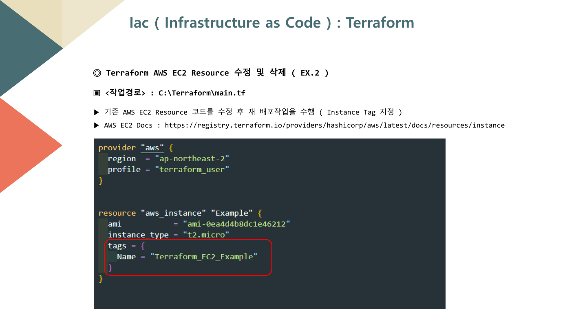

#### 원문 추출 텍스트

```text
Iac ( Infrastructure as Code ) : Terraform 
◎ Terraform AWS EC2 Resource 수정 및 삭제 ( EX.2 )
▣ <작업경로> : C:\Terraform\main.tf 
▶기존 AWS EC2 Resource 코드를 수정 후 재 배포작업을 수행 ( Instance Tag 지정 )
▶AWS EC2 Docs : https://registry.terraform.io/providers/hashicorp/aws/latest/docs/resources/instance
```

#### Visual / Code Notes

- 하단에 EC2 Resource 수정 코드 이미지가 있음. 기존 코드에 `tags = { Name = "Terraform_EC2_Instance" }` 형식의 태그 지정 부분이 강조됨.

### p.17 — EC2 Resource 수정 및 삭제 EX.2 - apply 결과

- Section: `Resource & Data Source`
- Page image: `assets/Iac_page_17.png`
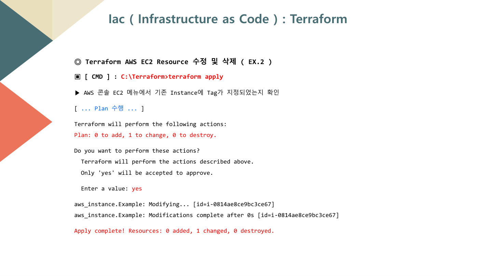

#### 원문 추출 텍스트

```text
Iac ( Infrastructure as Code ) : Terraform 
◎ Terraform AWS EC2 Resource 수정 및 삭제 ( EX.2 )
▣ [ CMD ] : C:\Terraform>terraform apply
▶AWS 콘솔 EC2 메뉴에서 기존 Instance에 Tag가 지정되었는지 확인
[ ... Plan 수행 ... ]
Terraform will perform the following actions:
Plan: 0 to add, 1 to change, 0 to destroy.
Do you want to perform these actions?
Terraform will perform the actions described above.
Only 'yes' will be accepted to approve.
Enter a value: yes 
aws_instance.Example: Modifying... [id=i-0814ae8ce9bc3ce67]
aws_instance.Example: Modifications complete after 0s [id=i-0814ae8ce9bc3ce67]
Apply complete! Resources: 0 added, 1 changed, 0 destroyed.
```

#### Visual / Code Notes

- EC2 태그 수정 `terraform apply` 출력 예시가 본문 텍스트로 포함됨.

### p.18 — EC2 Instance 변경사항 확인 - 수정 전/수정 후 콘솔 화면

- Section: `Resource & Data Source`
- Page image: `assets/Iac_page_18.png`
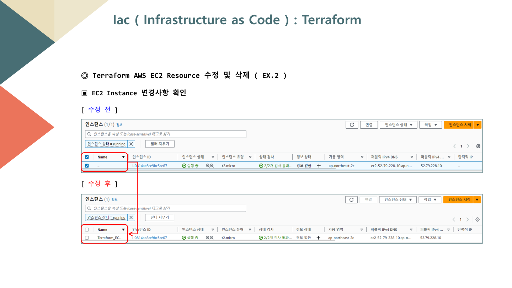

#### 원문 추출 텍스트

```text
◎ Terraform AWS EC2 Resource 수정 및 삭제 ( EX.2 )
▣ EC2 Instance 변경사항 확인
[ 수정 전 ]
[ 수정 후 ]
Iac ( Infrastructure as Code ) : Terraform
```

#### Visual / Code Notes

- AWS EC2 콘솔의 수정 전/수정 후 화면 캡처가 포함됨. 태그 영역이 빨간 박스로 강조됨.

### p.19 — EC2 Resource 삭제 - terraform destory 원문 표기

- Section: `Resource & Data Source`
- Page image: `assets/Iac_page_19.png`
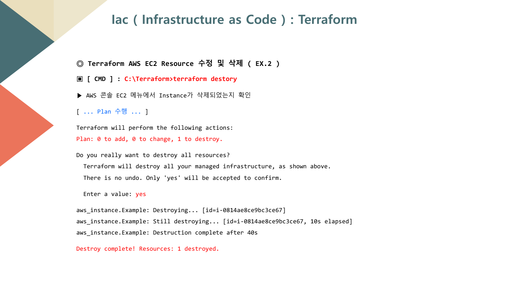

#### 원문 추출 텍스트

```text
Iac ( Infrastructure as Code ) : Terraform 
◎ Terraform AWS EC2 Resource 수정 및 삭제 ( EX.2 )
▣ [ CMD ] : C:\Terraform>terraform destory
▶AWS 콘솔 EC2 메뉴에서 Instance가 삭제되었는지 확인
[ ... Plan 수행 ... ]
Terraform will perform the following actions:
Plan: 0 to add, 0 to change, 1 to destroy.
Do you really want to destroy all resources?
Terraform will destroy all your managed infrastructure, as shown above.
There is no undo. Only 'yes' will be accepted to confirm.
Enter a value: yes 
aws_instance.Example: Destroying... [id=i-0814ae8ce9bc3ce67]
aws_instance.Example: Still destroying... [id=i-0814ae8ce9bc3ce67, 10s elapsed]
aws_instance.Example: Destruction complete after 40s
Destroy complete! Resources: 1 destroyed.
```

#### Visual / Code Notes

- `terraform destory`라는 원문 표기와 destroy 실행 출력이 포함됨. 명령어 표기는 확인 필요.

### p.20 — Terraform Resource 참조 개념

- Section: `Resource & Data Source`
- Page image: `assets/Iac_page_20.png`
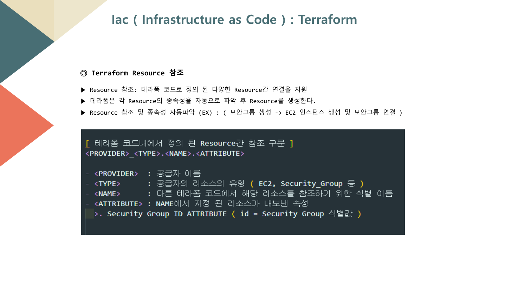

#### 원문 추출 텍스트

```text
◎ Terraform Resource 참조
▶Resource 참조: 테라폼 코드로 정의 된 다양한 Resource간 연결을 지원
▶ 테라폼은 각 Resource의 종속성을 자동으로 파악 후 Resource를 생성한다.
▶Resource 참조 및 종속성 자동파악 (EX) : ( 보안그룹 생성 -> EC2 인스턴스 생성 및 보안그룹 연결 )
Iac ( Infrastructure as Code ) : Terraform
```

#### Visual / Code Notes

- 하단에 Resource 참조 구문 이미지가 있음: `<PROVIDER>_<TYPE>.<NAME>.<ATTRIBUTE>`와 provider/type/name/attribute 설명.

### p.21 — Terraform Resource 참조 EX.3 - Security Group 참조 코드

- Section: `Resource & Data Source`
- Page image: `assets/Iac_page_21.png`
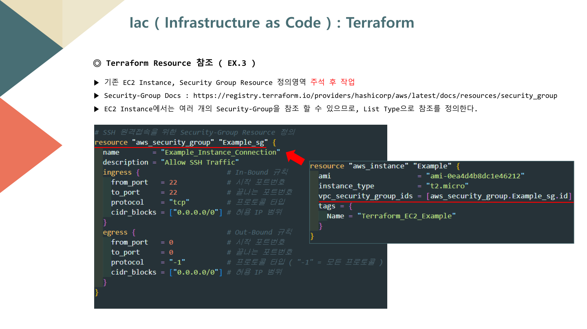

#### 원문 추출 텍스트

```text
◎ Terraform Resource 참조 ( EX.3 )
▶기존 EC2 Instance, Security Group Resource 정의영역 주석 후 작업
▶ Security-Group Docs : https://registry.terraform.io/providers/hashicorp/aws/latest/docs/resources/security_group
▶ EC2 Instance에서는 여러 개의 Security-Group을 참조 할 수 있으므로, List Type으로 참조를 정의한다.
Iac ( Infrastructure as Code ) : Terraform
```

#### Visual / Code Notes

- Security Group Resource와 EC2 Instance Resource가 분리된 Terraform 코드 이미지가 있음. EC2에서 Security Group ID를 List Type으로 참조하는 부분이 화살표로 강조됨.

### p.22 — Terraform Resource 참조 EX.3 - apply 결과

- Section: `Resource & Data Source`
- Page image: `assets/Iac_page_22.png`
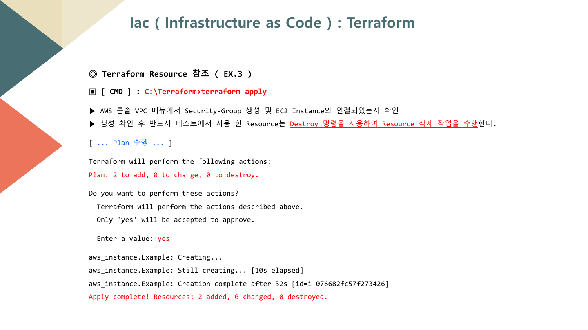

#### 원문 추출 텍스트

```text
Iac ( Infrastructure as Code ) : Terraform 
◎ Terraform Resource 참조 ( EX.3 )
▣ [ CMD ] : C:\Terraform>terraform apply
▶AWS 콘솔 VPC 메뉴에서 Security-Group 생성 및EC2 Instance와 연결되었는지 확인
▶ 생성 확인 후 반드시 테스트에서 사용 한 Resource는 Destroy 명령을 사용하여 Resource 삭제 작업을 수행한다.
[ ... Plan 수행 ... ]
Terraform will perform the following actions:
Plan: 2 to add, 0 to change, 0 to destroy.
Do you want to perform these actions?
Terraform will perform the actions described above.
Only 'yes' will be accepted to approve.
Enter a value: yes 
aws_instance.Example: Creating...
aws_instance.Example: Still creating... [10s elapsed]
aws_instance.Example: Creation complete after 32s [id=i-076682fc57f273426]
Apply complete! Resources: 2 added, 0 changed, 0 destroyed.
```

#### Visual / Code Notes

- Resource 참조 실습의 `terraform apply` 출력 예시가 본문 텍스트로 포함됨.

### p.23 — Security Group 생성 및 EC2 Instance 연결 확인

- Section: `Resource & Data Source`
- Page image: `assets/Iac_page_23.png`
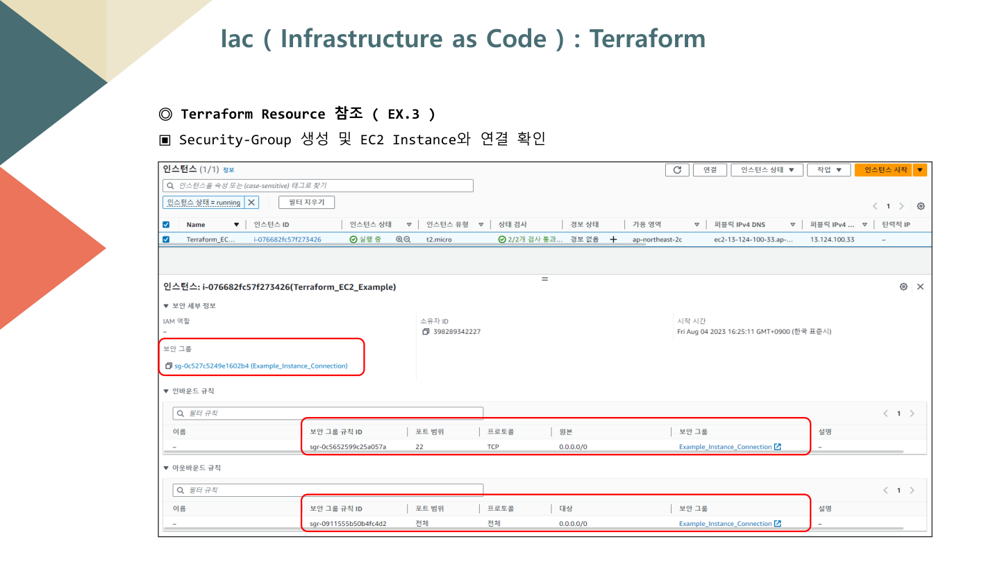

#### 원문 추출 텍스트

```text
◎ Terraform Resource 참조 ( EX.3 )
▣ Security-Group 생성 및EC2 Instance와 연결 확인
Iac ( Infrastructure as Code ) : Terraform
```

#### Visual / Code Notes

- AWS 콘솔에서 Security Group 생성 및 EC2 Instance 연결을 확인하는 화면 캡처가 포함됨. Security group rules / Details / Network interfaces 등 일부 영역이 빨간 박스로 강조됨.

### p.24 — Terraform Data Source 개념

- Section: `Resource & Data Source`
- Page image: `assets/Iac_page_24.png`
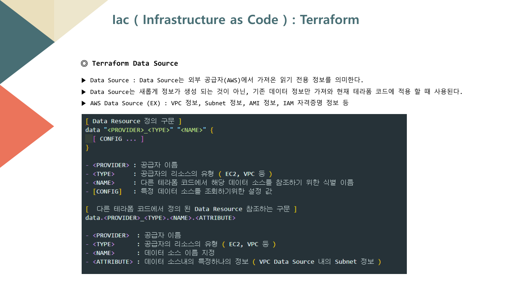

#### 원문 추출 텍스트

```text
◎ Terraform Data Source
▶Data Source : Data Source는 외부 공급자(AWS)에서 가져온 읽기 전용 정보를 의미한다. 
▶ Data Source는 새롭게 정보가 생성 되는 것이 아닌, 기존 데이터 정보만 가져와 현재 테라폼 코드에 적용 할 때 사용된다.
▶AWS Data Source (EX) : VPC 정보, Subnet 정보, AMI 정보, IAM 자격증명 정보 등
Iac ( Infrastructure as Code ) : Terraform
```

#### Visual / Code Notes

- Data Source 기본 구문 이미지가 있음. `data "aws_vpc" "default"`처럼 기존 Default VPC 정보를 조회하는 예시가 보임.

### p.25 — Terraform Data Source EX.4 - VPC/Subnet 코드

- Section: `Resource & Data Source`
- Page image: `assets/Iac_page_25.png`


#### 원문 추출 텍스트

```text
◎ Terraform Data Source ( EX.4 )
▶기존 EC2 Instance, Security Group Resource 정의영역 주석 후 작업
▶ VPC Data Source Docs : https://registry.terraform.io/providers/hashicorp/aws/latest/docs/data-sources/vpc
▶ Subnet Resource Docs : https://registry.terraform.io/providers/hashicorp/aws/latest/docs/resources/subnet
Iac ( Infrastructure as Code ) : Terraform
```

#### Visual / Code Notes

- VPC Data Source와 Subnet Resource를 연결하는 Terraform 코드 이미지가 있음. `data "aws_vpc" "default" { default = true }`, `aws_subnet`에서 `vpc_id`를 참조하는 구조가 보임.

### p.26 — Terraform Data Source EX.4 - apply 결과

- Section: `Resource & Data Source`
- Page image: `assets/Iac_page_26.png`
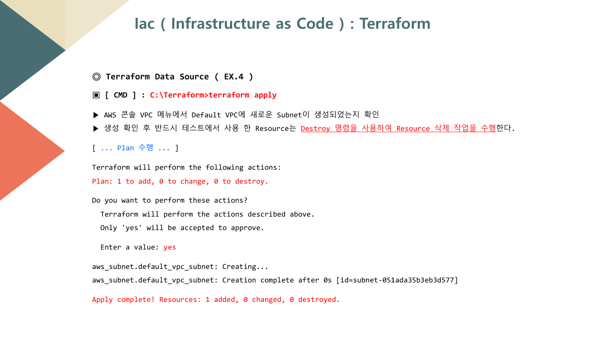

#### 원문 추출 텍스트

```text
Iac ( Infrastructure as Code ) : Terraform 
◎ Terraform Data Source ( EX.4 )
▣ [ CMD ] : C:\Terraform>terraform apply
▶AWS 콘솔 VPC 메뉴에서 Default VPC에 새로운 Subnet이 생성되었는지 확인
▶ 생성 확인 후 반드시 테스트에서 사용 한 Resource는 Destroy 명령을 사용하여 Resource 삭제 작업을 수행한다.
[ ... Plan 수행 ... ]
Terraform will perform the following actions:
Plan: 1 to add, 0 to change, 0 to destroy.
Do you want to perform these actions?
Terraform will perform the actions described above.
Only 'yes' will be accepted to approve.
Enter a value: yes 
aws_subnet.default_vpc_subnet: Creating...
aws_subnet.default_vpc_subnet: Creation complete after 0s [id=subnet-051ada35b3eb3d577]
Apply complete! Resources: 1 added, 0 changed, 0 destroyed.
```

#### Visual / Code Notes

- Data Source 실습의 `terraform apply` 출력 예시가 본문 텍스트로 포함됨.

### p.27 — 실습 1 - Resource & Data source 아키텍처

- Section: `Resource & Data Source`
- Page image: `assets/Iac_page_27.png`
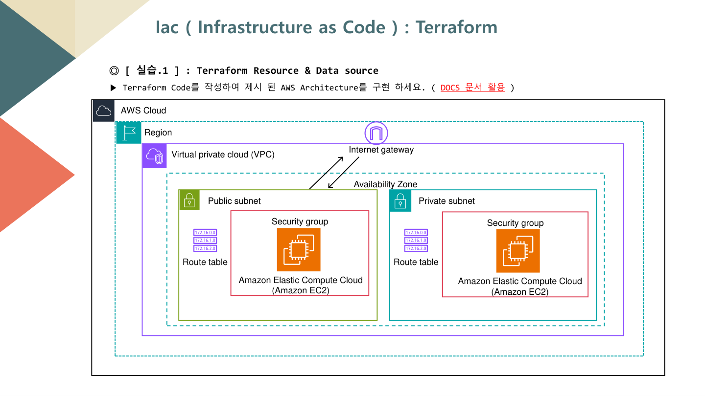

#### 원문 추출 텍스트

```text
Iac ( Infrastructure as Code ) : Terraform 
AWS Cloud
Amazon Elastic Compute Cloud 
(Amazon EC2)
Virtual private cloud (VPC)
Region
Availability Zone
Security group
Public subnet
Route table
Internet gateway
Private subnet
Amazon Elastic Compute Cloud 
(Amazon EC2)
Security group
Route table
◎ [ 실습.1 ] : Terraform Resource & Data source
▶Terraform Code를 작성하여 제시 된 AWS Architecture를 구현 하세요. ( DOCS 문서 활용 )
```

#### Visual / Code Notes

- AWS Cloud 아키텍처 다이어그램 포함. VPC, Region, AZ, Public subnet, Private subnet, EC2, Security group, Route table, Internet gateway 등이 배치됨.

### p.28 — 실습 2 - Resource & Data source 아키텍처

- Section: `Resource & Data Source`
- Page image: `assets/Iac_page_28.png`
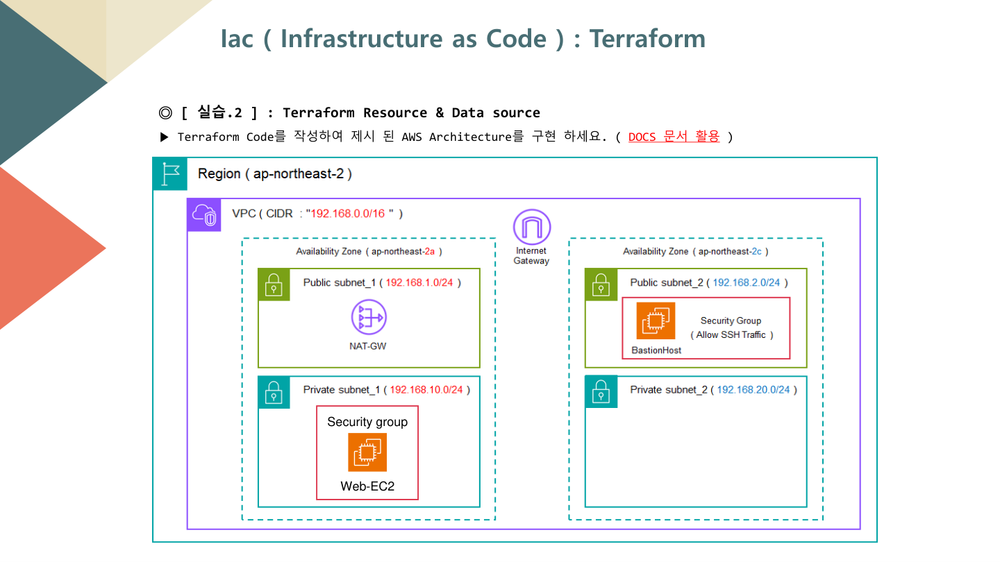

#### 원문 추출 텍스트

```text
◎ [ 실습.2 ] : Terraform Resource & Data source
▶Terraform Code를 작성하여 제시 된 AWS Architecture를 구현 하세요. ( DOCS 문서 활용 )
Iac ( Infrastructure as Code ) : Terraform 
Security group
Web-EC2
```

#### Visual / Code Notes

- 실습용 AWS Cloud 아키텍처 다이어그램 포함. Public/Private subnet, IGW, NAT gateway, Web-EC2, Security group 구성이 보임.

### p.29 — Variable_Input & Output 표지

- Section: `Variable_Input & Output`
- Page image: `assets/Iac_page_29.png`


#### 원문 추출 텍스트

```text
Variable_Input & Output
```

#### Visual / Code Notes

- 별도 코드/도식 보존 메모 없음. 전체 페이지 이미지는 위 링크로 보존됨.

### p.30 — Terraform Variable_Input 개념과 변수 코드

- Section: `Variable_Input & Output`
- Page image: `assets/Iac_page_30.png`
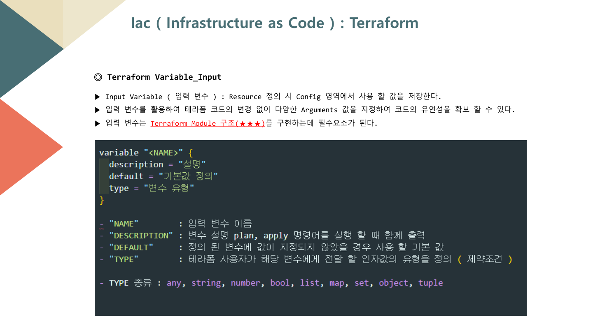

#### 원문 추출 텍스트

```text
◎ Terraform Variable_Input
▶Input Variable ( 입력 변수 ) : Resource 정의 시 Config 영역에서 사용 할 값을 저장한다.
▶입력 변수를 활용하여 테라폼 코드의 변경 없이 다양한 Arguments 값을 지정하여 코드의 유연성을 확보 할 수 있다.
▶입력 변수는 Terraform Module 구조(★★★)를 구현하는데 필수요소가 된다. 
Iac ( Infrastructure as Code ) : Terraform
```

#### Visual / Code Notes

- 하단에 변수 정의 코드 이미지가 있음. `variable` 블록, type/default/description 등의 입력 변수 구조가 보임.

### p.31 — Terraform Variable_Input Type과 Validation

- Section: `Variable_Input & Output`
- Page image: `assets/Iac_page_31.png`
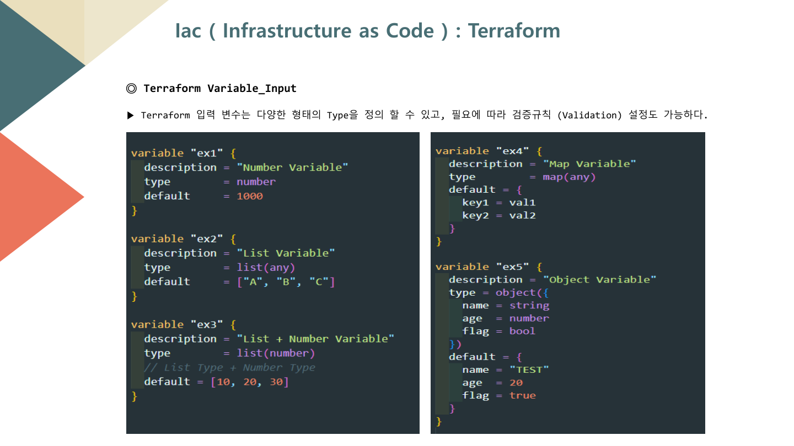

#### 원문 추출 텍스트

```text
◎ Terraform Variable_Input
▶Terraform 입력 변수는 다양한 형태의 Type을 정의 할 수 있고, 필요에 따라 검증규칙 (Validation) 설정도 가능하다.
Iac ( Infrastructure as Code ) : Terraform
```

#### Visual / Code Notes

- 왼쪽에 변수 Type 예시, 오른쪽에 Validation 예시 코드 이미지가 있음. string/list/object/validation 등이 보임.

### p.32 — Terraform Variable_Input 값 지정 방식

- Section: `Variable_Input & Output`
- Page image: `assets/Iac_page_32.png`
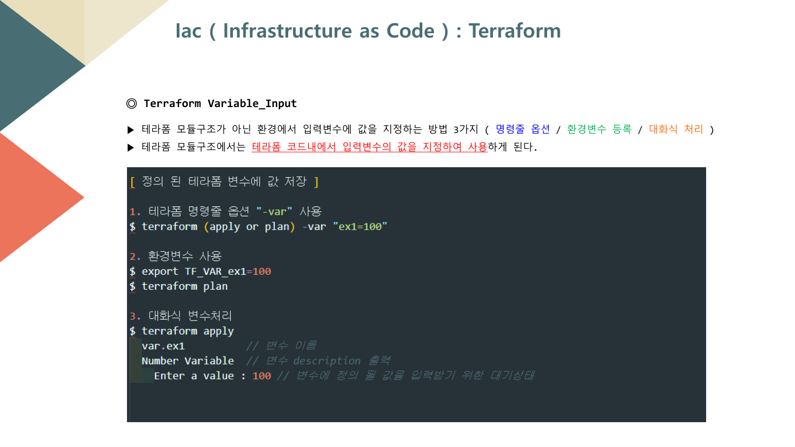

#### 원문 추출 텍스트

```text
◎ Terraform Variable_Input
▶테라폼 모듈구조가 아닌 환경에서 입력변수에 값을 지정하는 방법 3가지 ( 명령줄 옵션 / 환경변수 등록 / 대화식 처리 )
▶테라폼 모듈구조에서는 테라폼 코드내에서 입력변수의 값을 지정하여 사용하게 된다. 
Iac ( Infrastructure as Code ) : Terraform
```

#### Visual / Code Notes

- 하단에 입력 변수 값 지정 방식 예시 이미지가 있음. 명령줄 옵션, 환경변수, 대화식 처리 관련 예시가 보임.

### p.33 — Terraform Variable 참조

- Section: `Variable_Input & Output`
- Page image: `assets/Iac_page_33.png`
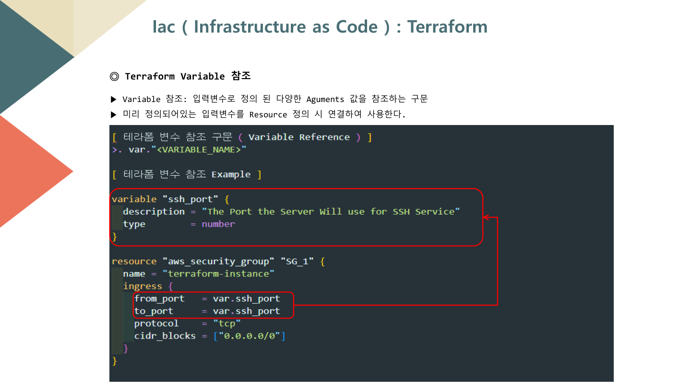

#### 원문 추출 텍스트

```text
◎ Terraform Variable 참조
▶Variable 참조: 입력변수로 정의 된 다양한 Aguments 값을 참조하는 구문
▶ 미리 정의되어있는 입력변수를 Resource 정의 시 연결하여 사용한다.
Iac ( Infrastructure as Code ) : Terraform
```

#### Visual / Code Notes

- 하단에 `var.<name>` 형태의 Variable 참조 코드 이미지가 있음. AMI, instance_type, tags 등에서 variable 값을 참조하는 부분이 빨간 박스로 강조됨.

### p.34 — Terraform Output 개념과 output 코드

- Section: `Variable_Input & Output`
- Page image: `assets/Iac_page_34.png`
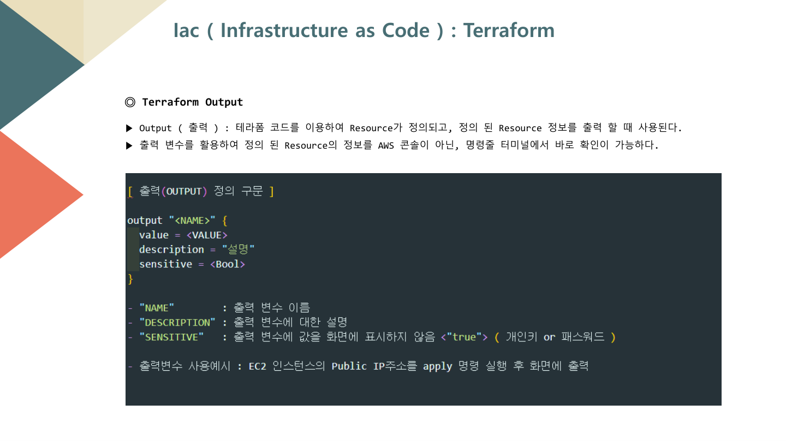

#### 원문 추출 텍스트

```text
◎ Terraform Output
▶Output ( 출력 ) : 테라폼코드를 이용하여 Resource가 정의되고, 정의 된 Resource 정보를 출력 할 때 사용된다.
▶출력 변수를 활용하여 정의 된 Resource의 정보를 AWS 콘솔이 아닌, 명령줄 터미널에서 바로 확인이 가능하다.
Iac ( Infrastructure as Code ) : Terraform
```

#### Visual / Code Notes

- 하단에 `output` 블록 예시 코드 이미지가 있음. Resource 생성 후 정보 출력 개념을 설명함.

### p.35 — Terraform Output 명령줄 확인

- Section: `Variable_Input & Output`
- Page image: `assets/Iac_page_35.png`
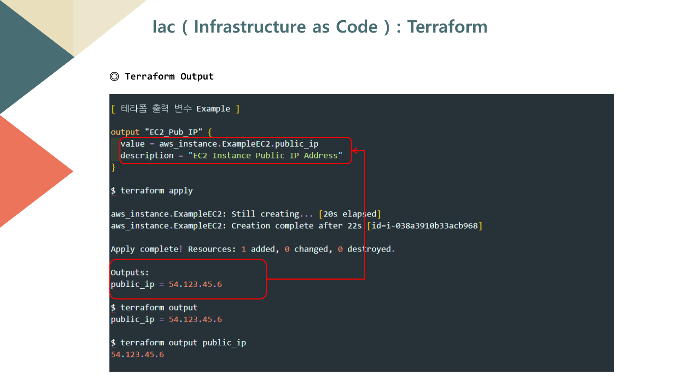

#### 원문 추출 텍스트

```text
◎ Terraform Output
Iac ( Infrastructure as Code ) : Terraform
```

#### Visual / Code Notes

- 하단에 `terraform apply` 후 output 값 확인 및 `terraform output` 명령 결과 이미지가 있음. 빨간 박스로 출력값 영역이 강조됨.

### p.36 — EX.1 Variable_Input & Output - VPC

- Section: `Variable_Input & Output`
- Page image: `assets/Iac_page_36.png`
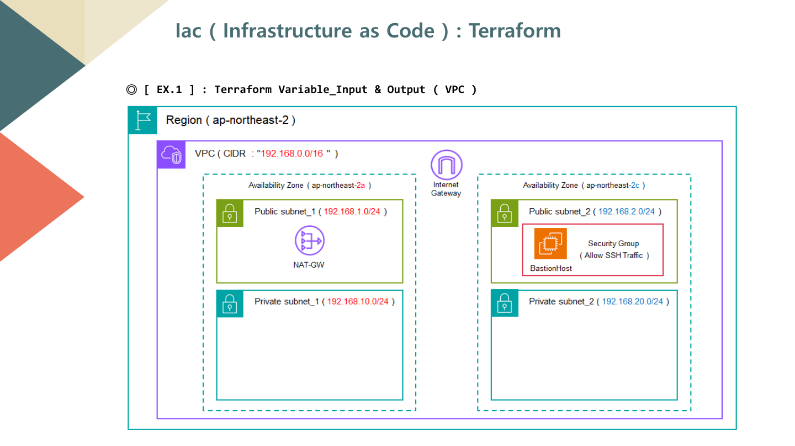

#### 원문 추출 텍스트

```text
◎ [ EX.1 ] : Terraform Variable_Input & Output ( VPC )
Iac ( Infrastructure as Code ) : Terraform
```

#### Visual / Code Notes

- VPC 실습 아키텍처 다이어그램 포함. VPC, Public/Private subnet, IGW, NAT, Security group, EC2 등 구성 요소가 보임.

### p.37 — EX.2 Variable_Input & Output - ALB & ASG

- Section: `Variable_Input & Output`
- Page image: `assets/Iac_page_37.png`
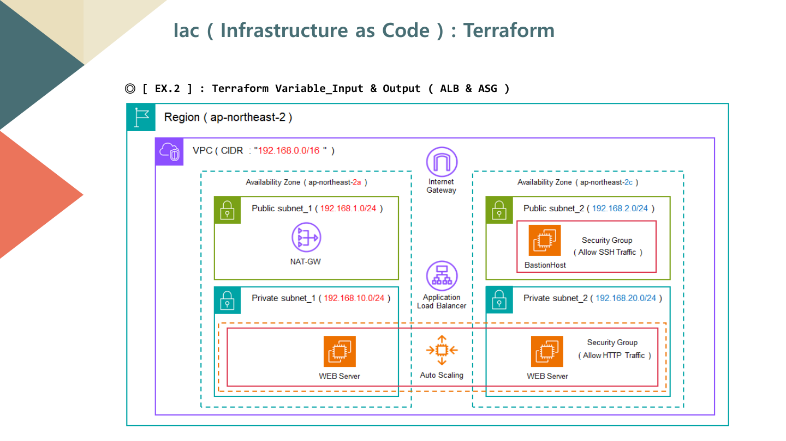

#### 원문 추출 텍스트

```text
◎ [ EX.2 ] : Terraform Variable_Input & Output ( ALB & ASG )
Iac ( Infrastructure as Code ) : Terraform
```

#### Visual / Code Notes

- ALB & ASG 실습 아키텍처 다이어그램 포함. ALB, ASG, Web instance, Security group, Public/Private subnet 등 구성 요소가 보임.

### p.38 — Terraform 반복문 & 조건문 표지

- Section: `반복문 & 조건문`
- Page image: `assets/Iac_page_38.png`
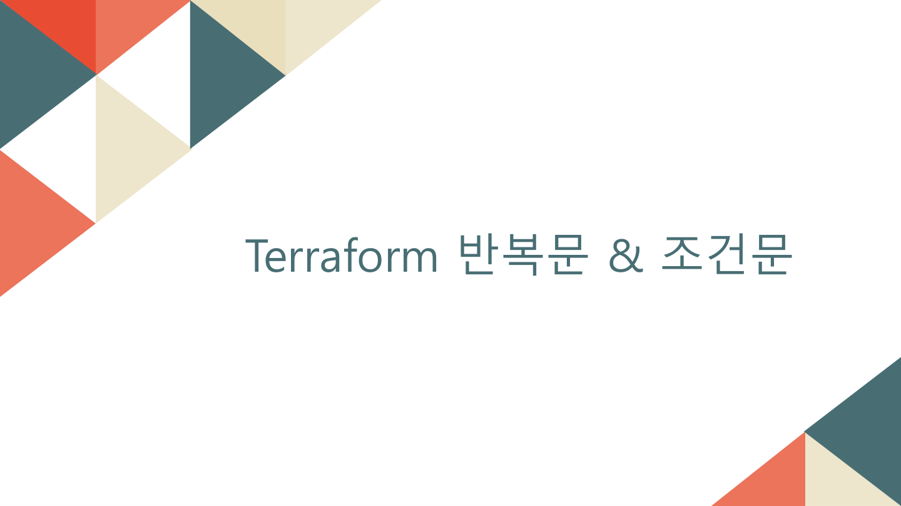

#### 원문 추출 텍스트

```text
Terraform 반복문& 조건문
```

#### Visual / Code Notes

- 별도 코드/도식 보존 메모 없음. 전체 페이지 이미지는 위 링크로 보존됨.

### p.39 — Terraform 반복문 count

- Section: `반복문 & 조건문`
- Page image: `assets/Iac_page_39.png`
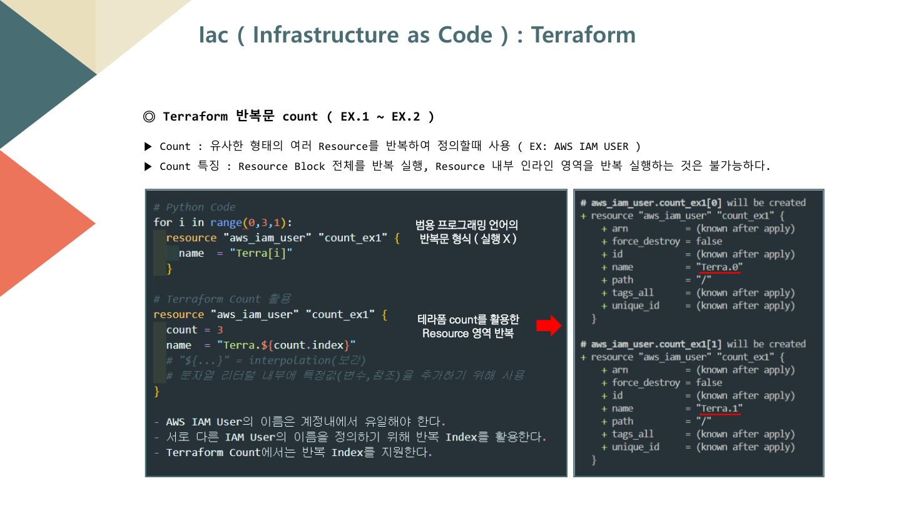

#### 원문 추출 텍스트

```text
◎ Terraform 반복문 count ( EX.1 ~ EX.2 )
▶Count : 유사한 형태의 여러 Resource를 반복하여 정의할때 사용 ( EX: AWS IAM USER ) 
▶Count 특징 : Resource Block 전체를 반복 실행, Resource 내부 인라인 영역을 반복 실행하는 것은 불가능하다.
Iac ( Infrastructure as Code ) : Terraform 
범용 프로그래밍 언어의 
반복문 형식 ( 실행 X )
테라폼 count를 활용한
Resource 영역 반복
```

#### Visual / Code Notes

- count 사용 예시 코드 이미지 포함. 범용 프로그래밍 언어 반복문은 실행 불가로 표시되고, Terraform count로 Resource 블록 반복을 구현하는 예시가 대비됨.

### p.40 — Terraform 반복문 for_each

- Section: `반복문 & 조건문`
- Page image: `assets/Iac_page_40.png`
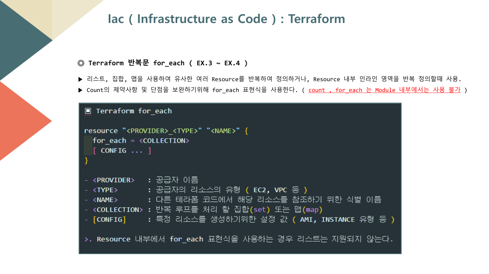

#### 원문 추출 텍스트

```text
◎ Terraform 반복문 for_each ( EX.3 ~ EX.4 )
▶리스트, 집합, 맵을 사용하여 유사한 여러 Resource를 반복하여 정의하거나, Resource 내부 인라인 영역을 반복 정의할때 사용.
▶Count의 제약사항 및 단점을 보완하기위해 for_each 표현식을 사용한다. ( count , for_each 는 Module 내부에서는 사용 불가 )
Iac ( Infrastructure as Code ) : Terraform
```

#### Visual / Code Notes

- for_each 사용 예시 코드 이미지 포함. `variable "security_group_ingress"`와 `dynamic "ingress"` 형태가 보임.

### p.41 — Terraform 조건문

- Section: `반복문 & 조건문`
- Page image: `assets/Iac_page_41.png`
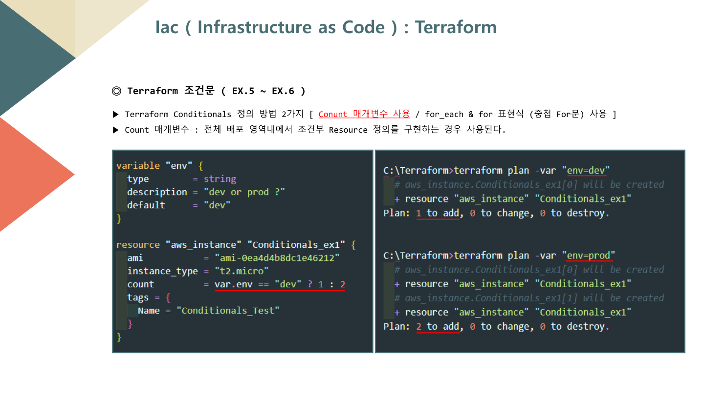

#### 원문 추출 텍스트

```text
◎ Terraform 조건문 ( EX.5 ~ EX.6 )
▶Terraform Conditionals 정의 방법 2가지 [ Conunt 매개변수사용 / for_each & for 표현식 (중첩 For문) 사용 ]
▶Count 매개변수 : 전체 배포 영역내에서 조건부 Resource 정의를 구현하는 경우 사용된다.
Iac ( Infrastructure as Code ) : Terraform
```

#### Visual / Code Notes

- 조건문 예시 코드 이미지 포함. `condition ? true_val : false_val` 형태와 count/for_each 기반 조건부 Resource 정의 방식이 보임.

### p.42 — Terraform Module 표지

- Section: `Module / Backend / Remote State`
- Page image: `assets/Iac_page_42.png`
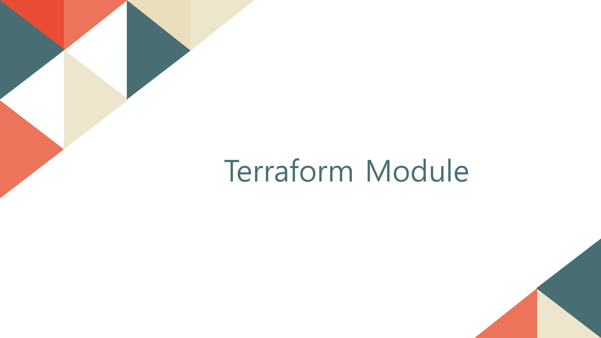

#### 원문 추출 텍스트

```text
Terraform Module
```

#### Visual / Code Notes

- 별도 코드/도식 보존 메모 없음. 전체 페이지 이미지는 위 링크로 보존됨.

### p.43 — Terraform Module 개념 / Registry / 작업 폴더 구조

- Section: `Module / Backend / Remote State`
- Page image: `assets/Iac_page_43.png`
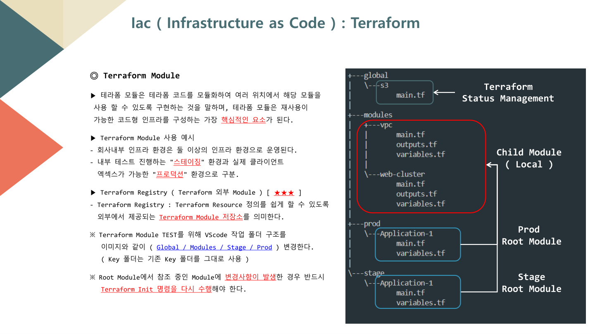

#### 원문 추출 텍스트

```text
Iac ( Infrastructure as Code ) : Terraform 
◎ Terraform Module
▶ 테라폼 모듈은 테라폼 코드를 모듈화하여 여러 위치에서 해당 모듈을
 사용 할 수 있도록 구현하는 것을 말하며, 테라폼 모듈은 재사용이 
가능한 코드형 인프라를 구성하는 가장 핵심적인 요소가 된다.
▶ Terraform Module 사용 예시
- 회사내부 인프라 환경은 둘 이상의 인프라 환경으로 운영된다. 
- 내부 테스트 진행하는 "스테이징" 환경과 실제 클라이언트 
  엑섹스가 가능한 "프로덕션" 환경으로 구분.
▶ Terraform Registry ( Terraform 외부 Module ) [ ★★★ ] 
- Terraform Registry : Terraform Resource 정의를 쉽게 할 수 있도록 
  외부에서 제공되는 Terraform Module 저장소를 의미한다.
※ Terraform Module TEST를 위해 VScode 작업 폴더 구조를 
이미지와 같이 ( Global / Modules / Stage / Prod ) 변경한다.
( Key 폴더는 기존 Key 폴더를 그대로 사용 )
※ Root Module에서 참조 중인 Module에변경사항이 발생한 경우 반드시
Terraform Init 명령을 다시 수행해야 한다.
Prod 
Root Module
Stage
Root Module
Child Module
( Local )
Terraform 
Status Management
```

#### Visual / Code Notes

- 오른쪽에 Terraform Status Management 구조도 포함. Global, Stage Root Module, Prod Root Module, Child Module(Local) 관계가 보임.

### p.44 — Terraform Registry 외부 Module 사용법

- Section: `Module / Backend / Remote State`
- Page image: `assets/Iac_page_44.png`
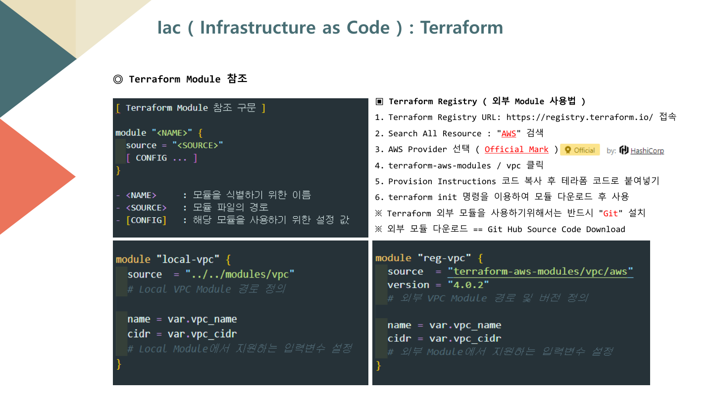

#### 원문 추출 텍스트

```text
Iac ( Infrastructure as Code ) : Terraform 
▣ Terraform Registry ( 외부 Module 사용법 )
1. Terraform Registry URL: https://registry.terraform.io/ 접속
2. Search All Resource : "AWS" 검색
3. AWS Provider 선택( Official Mark )
4. terraform-aws-modules / vpc 클릭
5. Provision Instructions 코드 복사 후 테라폼 코드로 붙여넣기
6. terraform init 명령을 이용하여 모듈 다운로드 후 사용
※ Terraform 외부 모듈을 사용하기위해서는 반드시 "Git" 설치
※ 외부 모듈 다운로드 == Git Hub Source Code Download
◎ Terraform Module 참조
```

#### Visual / Code Notes

- 외부 Module 사용 예시 코드와 Registry 화면 캡처가 포함됨. `module "vpc"`, `source = "terraform-aws-modules/vpc/aws"`, version 등이 보임.

### p.45 — Terraform 원격 백엔드 구성 및 Local Module 정의

- Section: `Module / Backend / Remote State`
- Page image: `assets/Iac_page_45.png`
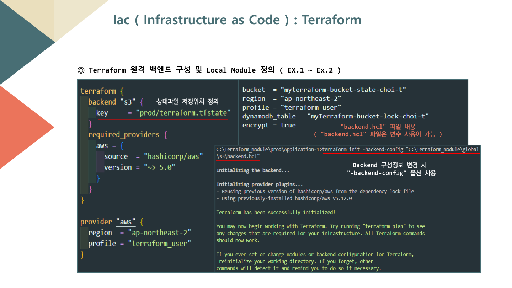

#### 원문 추출 텍스트

```text
Iac ( Infrastructure as Code ) : Terraform 
◎ Terraform 원격 백엔드 구성 및 Local Module 정의 ( EX.1 ~ Ex.2 )
▶
"backend.hcl" 파일 내용
( "backend.hcl" 파일은 변수 사용이 가능 )
상태파일 저장위치 정의
Backend 구성정보 변경 시 
"-backend-config" 옵션 사용
```

#### Visual / Code Notes

- 원격 백엔드와 Local Module 예시 코드 이미지 포함. `backend.hcl`, 상태파일 저장 위치, `-backend-config` 옵션 관련 내용이 보임.

### p.46 — Terraform Local Module 활용 EX.3

- Section: `Module / Backend / Remote State`
- Page image: `assets/Iac_page_46.png`
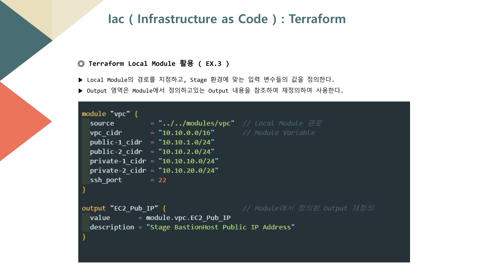

#### 원문 추출 텍스트

```text
◎ Terraform Local Module 활용( EX.3 )
▶Local Module의 경로를 지정하고, Stage 환경에 맞는 입력 변수들의 값을 정의한다.
▶Output 영역은 Module에서 정의하고있는 Output 내용을 참조하여 재정의하여 사용한다.
Iac ( Infrastructure as Code ) : Terraform
```

#### Visual / Code Notes

- Local Module 활용 코드 이미지 포함. `module "vpc"` source 경로와 입력 변수 값, output 재정의 구조가 보임.

### p.47 — Terraform Local Module 활용 EX.4 - remote state 필요 오류

- Section: `Module / Backend / Remote State`
- Page image: `assets/Iac_page_47.png`
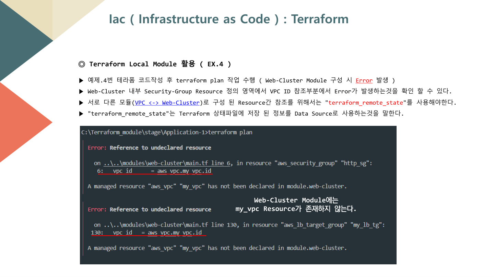

#### 원문 추출 텍스트

```text
◎ Terraform Local Module 활용( EX.4 )
▶예제.4번 테라폼 코드작성 후 terraform plan 작업 수행 ( Web-Cluster Module 구성 시 Error 발생 )
▶ Web-Cluster 내부 Security-Group Resource 정의 영역에서 VPC ID 참조부분에서 Error가 발생하는것을 확인 할 수 있다.
▶ 서로 다른 모듈(VPC <-> Web-Cluster)로 구성 된 Resource간 참조를 위해서는 "terraform_remote_state"를 사용해야한다. 
▶ "terraform_remote_state"는 Terraform 상태파일에 저장 된 정보를 Data Source로 사용하는것을 말한다.
Iac ( Infrastructure as Code ) : Terraform 
Web-Cluster Module에는 
my_vpc Resource가 존재하지 않는다.
```

#### Visual / Code Notes

- Web-Cluster Module 구성 오류 화면 포함. 서로 다른 모듈 간 Resource 직접 참조 실패와 `terraform_remote_state` 필요성을 설명함.

### p.48 — 실습 3 - Terraform Module 활용

- Section: `Module / Backend / Remote State`
- Page image: `assets/Iac_page_48.png`
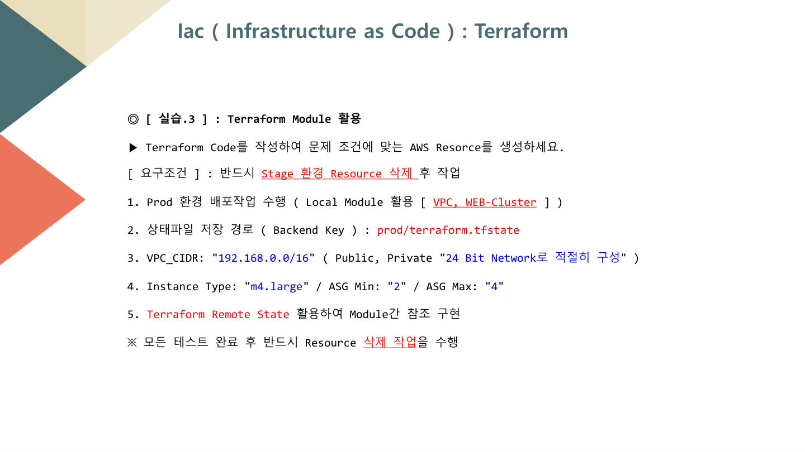

#### 원문 추출 텍스트

```text
◎ [ 실습.3 ] : Terraform Module 활용
▶Terraform Code를 작성하여 문제 조건에 맞는 AWS Resorce를 생성하세요.
[ 요구조건 ] : 반드시 Stage 환경 Resource 삭제 후 작업
1. Prod 환경 배포작업 수행 ( Local Module 활용 [ VPC, WEB-Cluster ] )
2. 상태파일 저장 경로 ( Backend Key ) : prod/terraform.tfstate
3. VPC_CIDR: "192.168.0.0/16" ( Public, Private "24 Bit Network로 적절히 구성" )
4. Instance Type: "m4.large" / ASG Min: "2" / ASG Max: "4"
5. Terraform Remote State 활용하여 Module간 참조 구현
※ 모든 테스트 완료 후 반드시 Resource 삭제 작업을 수행
Iac ( Infrastructure as Code ) : Terraform
```

#### Visual / Code Notes

- 별도 코드/도식 보존 메모 없음. 전체 페이지 이미지는 위 링크로 보존됨.

### p.49 — Terraform 외부 Module 활용 VPC EX.5

- Section: `Module / Backend / Remote State`
- Page image: `assets/Iac_page_49.png`
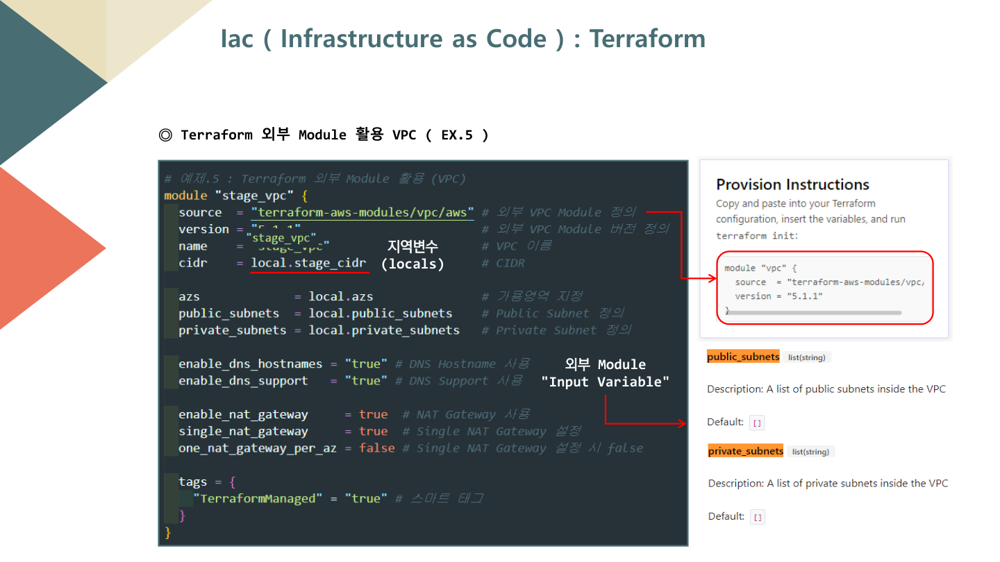

#### 원문 추출 텍스트

```text
◎ Terraform 외부Module 활용VPC ( EX.5 )
Iac ( Infrastructure as Code ) : Terraform 
외부 Module 
"Input Variable"
지역변수 
(locals)
```

#### Visual / Code Notes

- 외부 VPC Module 활용 코드와 Terraform Registry Provision Instructions 화면 캡처가 포함됨. 외부 Module Input Variable과 locals 사용이 강조됨.

### p.50 — Terraform 외부 Module 활용 Security-Group EX.6

- Section: `Module / Backend / Remote State`
- Page image: `assets/Iac_page_50.png`
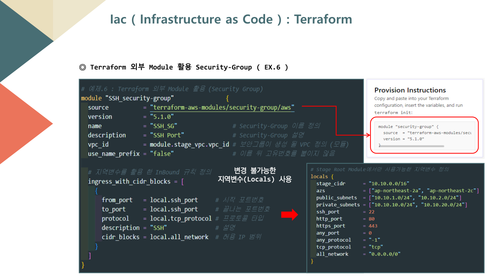

#### 원문 추출 텍스트

```text
◎ Terraform 외부Module 활용Security-Group ( EX.6 )
Iac ( Infrastructure as Code ) : Terraform 
변경 불가능한
지역변수(Locals) 사용
```

#### Visual / Code Notes

- 외부 Security Group Module 활용 코드와 Provision Instructions 화면 캡처가 포함됨. 변경 불가능한 locals 사용이 강조됨.

### p.51 — Terraform 외부 Module + Local Module WEB-Cluster EX.7

- Section: `Module / Backend / Remote State`
- Page image: `assets/Iac_page_51.png`
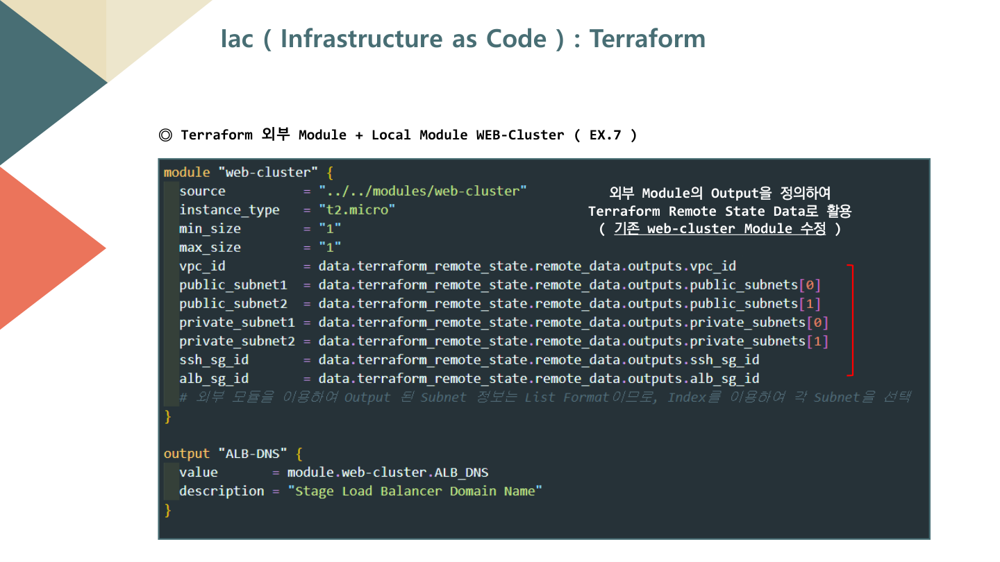

#### 원문 추출 텍스트

```text
◎ Terraform 외부 Module + Local Module WEB-Cluster ( EX.7 )
Iac ( Infrastructure as Code ) : Terraform 
외부 Module의 Output을 정의하여 
Terraform Remote State Data로 활용
( 기존 web-cluster Module 수정 )
```

#### Visual / Code Notes

- 외부 Module Output을 정의하고 Terraform Remote State Data로 활용하는 WEB-Cluster 코드 이미지 포함.

### p.52 — 실습 4 - Terraform 외부 Module 활용

- Section: `Module / Backend / Remote State`
- Page image: `assets/Iac_page_52.png`
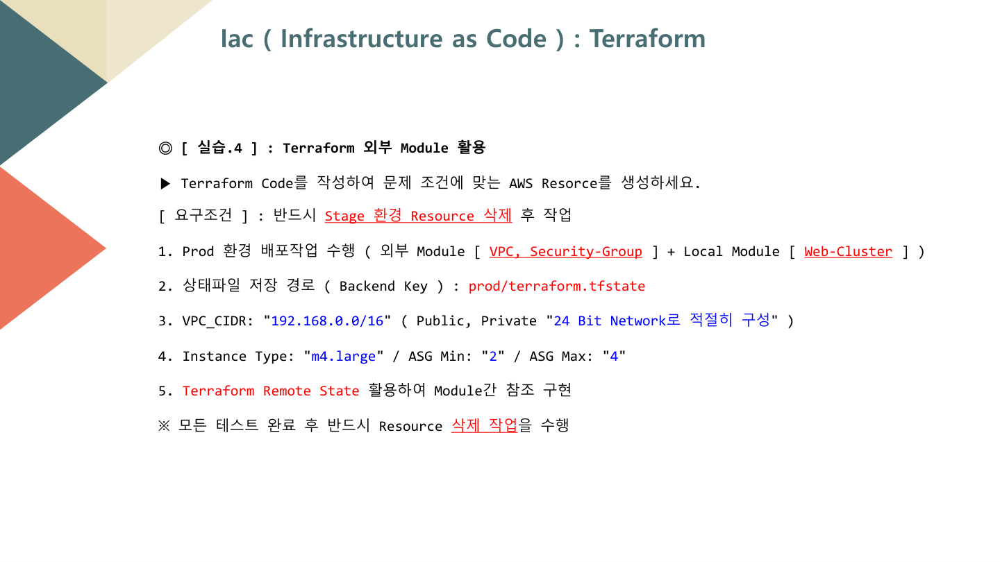

#### 원문 추출 텍스트

```text
◎ [ 실습.4 ] : Terraform 외부 Module 활용
▶Terraform Code를 작성하여 문제 조건에 맞는 AWS Resorce를 생성하세요.
[ 요구조건 ] : 반드시 Stage 환경 Resource 삭제 후 작업
1. Prod 환경 배포작업 수행 ( 외부Module [ VPC, Security-Group ] + Local Module [ Web-Cluster ] )
2. 상태파일 저장 경로 ( Backend Key ) : prod/terraform.tfstate
3. VPC_CIDR: "192.168.0.0/16" ( Public, Private "24 Bit Network로 적절히 구성" )
4. Instance Type: "m4.large" / ASG Min: "2" / ASG Max: "4"
5. Terraform Remote State 활용하여 Module간 참조 구현
※ 모든 테스트 완료 후 반드시 Resource 삭제 작업을 수행
Iac ( Infrastructure as Code ) : Terraform
```

#### Visual / Code Notes

- 별도 코드/도식 보존 메모 없음. 전체 페이지 이미지는 위 링크로 보존됨.

---

## Coverage Map

| Page | Section | 처리 상태 | 보존 방식 | 확인 필요 |
|---:|---|---|---|---|
| p.1 | IaC Summary | 완료 | 원문 추출 텍스트 + 페이지 이미지 | 없음 |
| p.2 | IaC Summary | 완료 | 원문 추출 텍스트 + 페이지 이미지 | 없음 |
| p.3 | IaC Summary | 완료 | 원문 추출 텍스트 + 페이지 이미지 | 없음 |
| p.4 | IaC Summary | 완료 | 원문 추출 텍스트 + 페이지 이미지 | 없음 |
| p.5 | IaC Summary | 완료 | 원문 추출 텍스트 + 페이지 이미지 | 없음 |
| p.6 | Terraform Overview | 완료 | 원문 추출 텍스트 + 페이지 이미지 | 없음 |
| p.7 | Terraform Overview | 완료 | 원문 추출 텍스트 + 페이지 이미지 | 없음 |
| p.8 | Terraform Overview | 완료 | 원문 추출 텍스트 + 페이지 이미지 | 없음 |
| p.9 | Terraform Overview | 완료 | 원문 추출 텍스트 + 페이지 이미지 | 없음 |
| p.10 | Terraform Overview | 완료 | 원문 추출 텍스트 + 페이지 이미지 | 없음 |
| p.11 | Terraform Overview | 완료 | 원문 추출 텍스트 + 페이지 이미지 | 없음 |
| p.12 | Resource & Data Source | 완료 | 원문 추출 텍스트 + 페이지 이미지 | 없음 |
| p.13 | Resource & Data Source | 완료 | 원문 추출 텍스트 + 페이지 이미지 | 없음 |
| p.14 | Resource & Data Source | 완료 | 원문 추출 텍스트 + 페이지 이미지 | 없음 |
| p.15 | Resource & Data Source | 완료 | 원문 추출 텍스트 + 페이지 이미지 | 없음 |
| p.16 | Resource & Data Source | 완료 | 원문 추출 텍스트 + 페이지 이미지 | 없음 |
| p.17 | Resource & Data Source | 완료 | 원문 추출 텍스트 + 페이지 이미지 | 없음 |
| p.18 | Resource & Data Source | 완료 | 원문 추출 텍스트 + 페이지 이미지 | 없음 |
| p.19 | Resource & Data Source | 완료 | 원문 추출 텍스트 + 페이지 이미지 | `terraform destory` 원문 표기 확인 필요 |
| p.20 | Resource & Data Source | 완료 | 원문 추출 텍스트 + 페이지 이미지 | 없음 |
| p.21 | Resource & Data Source | 완료 | 원문 추출 텍스트 + 페이지 이미지 | 없음 |
| p.22 | Resource & Data Source | 완료 | 원문 추출 텍스트 + 페이지 이미지 | 없음 |
| p.23 | Resource & Data Source | 완료 | 원문 추출 텍스트 + 페이지 이미지 | 없음 |
| p.24 | Resource & Data Source | 완료 | 원문 추출 텍스트 + 페이지 이미지 | 없음 |
| p.25 | Resource & Data Source | 완료 | 원문 추출 텍스트 + 페이지 이미지 | 없음 |
| p.26 | Resource & Data Source | 완료 | 원문 추출 텍스트 + 페이지 이미지 | 없음 |
| p.27 | Resource & Data Source | 완료 | 원문 추출 텍스트 + 페이지 이미지 | 없음 |
| p.28 | Resource & Data Source | 완료 | 원문 추출 텍스트 + 페이지 이미지 | 없음 |
| p.29 | Variable_Input & Output | 완료 | 원문 추출 텍스트 + 페이지 이미지 | 없음 |
| p.30 | Variable_Input & Output | 완료 | 원문 추출 텍스트 + 페이지 이미지 | 없음 |
| p.31 | Variable_Input & Output | 완료 | 원문 추출 텍스트 + 페이지 이미지 | 없음 |
| p.32 | Variable_Input & Output | 완료 | 원문 추출 텍스트 + 페이지 이미지 | 없음 |
| p.33 | Variable_Input & Output | 완료 | 원문 추출 텍스트 + 페이지 이미지 | 없음 |
| p.34 | Variable_Input & Output | 완료 | 원문 추출 텍스트 + 페이지 이미지 | 없음 |
| p.35 | Variable_Input & Output | 완료 | 원문 추출 텍스트 + 페이지 이미지 | 없음 |
| p.36 | Variable_Input & Output | 완료 | 원문 추출 텍스트 + 페이지 이미지 | 없음 |
| p.37 | Variable_Input & Output | 완료 | 원문 추출 텍스트 + 페이지 이미지 | 없음 |
| p.38 | 반복문 & 조건문 | 완료 | 원문 추출 텍스트 + 페이지 이미지 | 없음 |
| p.39 | 반복문 & 조건문 | 완료 | 원문 추출 텍스트 + 페이지 이미지 | 없음 |
| p.40 | 반복문 & 조건문 | 완료 | 원문 추출 텍스트 + 페이지 이미지 | 없음 |
| p.41 | 반복문 & 조건문 | 완료 | 원문 추출 텍스트 + 페이지 이미지 | `Conunt` 원문 표기 확인 필요 |
| p.42 | Module / Backend / Remote State | 완료 | 원문 추출 텍스트 + 페이지 이미지 | 없음 |
| p.43 | Module / Backend / Remote State | 완료 | 원문 추출 텍스트 + 페이지 이미지 | `엑섹스` 원문 표기 확인 필요 |
| p.44 | Module / Backend / Remote State | 완료 | 원문 추출 텍스트 + 페이지 이미지 | 없음 |
| p.45 | Module / Backend / Remote State | 완료 | 원문 추출 텍스트 + 페이지 이미지 | 없음 |
| p.46 | Module / Backend / Remote State | 완료 | 원문 추출 텍스트 + 페이지 이미지 | 없음 |
| p.47 | Module / Backend / Remote State | 완료 | 원문 추출 텍스트 + 페이지 이미지 | 없음 |
| p.48 | Module / Backend / Remote State | 완료 | 원문 추출 텍스트 + 페이지 이미지 | `Resorce` 원문 표기 확인 필요 |
| p.49 | Module / Backend / Remote State | 완료 | 원문 추출 텍스트 + 페이지 이미지 | 없음 |
| p.50 | Module / Backend / Remote State | 완료 | 원문 추출 텍스트 + 페이지 이미지 | 없음 |
| p.51 | Module / Backend / Remote State | 완료 | 원문 추출 텍스트 + 페이지 이미지 | 없음 |
| p.52 | Module / Backend / Remote State | 완료 | 원문 추출 텍스트 + 페이지 이미지 | `Resorce` 원문 표기 확인 필요 |

## 최종 분리 후보

| 후보 노트 | 근거 페이지 | 분리 이유 |
|---|---:|---|
| `IaC 개념.md` | p.1-p.2 | IaC 정의와 사용 목적 |
| `IaC 도구 분류.md` | p.3-p.4 | ad-hoc, 구성 관리, 서버 템플릿, 오케스트레이션, 프로비저닝 비교 |
| `IaC 장점.md` | p.5 | Self-Service, Speed/Safety, Documentation, Version Control, Validation/Reuse |
| `Terraform 개요.md` | p.6-p.8 | Terraform 개요, 선언적 언어, 장단점 |
| `Terraform Workflow.md` | p.9-p.11 | State, Plan, Apply, Destroy, Provider 초기화 |
| `Terraform Resource와 Data Source.md` | p.12-p.28 | Resource 생성/수정/삭제, 참조, Data Source, 아키텍처 실습 |
| `Terraform Variable과 Output.md` | p.29-p.37 | Input Variable, Validation, Variable 참조, Output, VPC/ALB/ASG 예제 |
| `Terraform 반복문과 조건문.md` | p.38-p.41 | count, for_each, conditionals |
| `Terraform Module.md` | p.42-p.44, p.46 | Module 정의, Registry, Local Module 활용 |
| `Terraform Backend와 Remote State.md` | p.45, p.47-p.52 | backend.hcl, remote state, module 간 참조, 외부/로컬 모듈 실습 |
| `Terraform 실습 아키텍처 모음.md` | p.27-p.28, p.36-p.37, p.48, p.52 | 실습 요구사항과 아키텍처 다이어그램 모음 |

## Lab Note 후보

| 후보 Lab Note | 근거 페이지 | 생성 판단 |
|---|---:|---|
| `Terraform 초기구성 실습.md` | p.10-p.11 | `terraform init`, provider 구성 검증이 필요하면 생성 |
| `Terraform EC2 생성 수정 삭제 실습.md` | p.13-p.19 | EC2 생성/수정/삭제 전체 흐름이 있으므로 생성 가치 높음 |
| `Terraform Resource 참조 실습.md` | p.20-p.23 | Security Group → EC2 참조 구조 실습으로 생성 가치 높음 |
| `Terraform Data Source 실습.md` | p.24-p.28 | VPC/Subnet Data Source 및 실습 아키텍처 연결 |
| `Terraform Variable Output 실습.md` | p.30-p.37 | 변수/출력/아키텍처 예제 연결 |
| `Terraform 반복문 조건문 실습.md` | p.39-p.41 | count/for_each/조건문 예제를 실제 코드로 검증할 때 생성 |
| `Terraform Module Backend Remote State 실습.md` | p.43-p.52 | 모듈/백엔드/remote state가 프로젝트 적용 가능성이 높아 생성 가치 높음 |

## 확인 필요 항목

| 항목 | 위치 | 이유 | 출처 분류 |
|---|---:|---|---|
| `terraform destory` | p.9, p.19 | PDF 원문 표기. 실제 Terraform 명령어와 대조 필요 | PDF + 인터넷 고신뢰 정보 필요 |
| `.terraform.lock.hcl` 설명 | p.11 | “Resource 동시접근 방지” 표현은 Terraform lock file의 실제 역할과 대조 필요 | PDF + 인터넷 고신뢰 정보 필요 |
| `count , for_each 는 Module 내부에서는 사용 불가` | p.40 | Terraform 현재 문법/제약과 공식 문서 대조 필요 | PDF + 인터넷 고신뢰 정보 필요 |
| `Conunt` | p.41 | 원문 오탈자 가능성 | PDF |
| `Resorce` | p.48, p.52 | 원문 오탈자 가능성 | PDF |
| `엑섹스` | p.43 | 원문 오탈자 가능성 | PDF |
| 이미지 속 코드 전체 전사 | p.10, p.13, p.16, p.21, p.25, p.30-p.35, p.39-p.47, p.49-p.51 | 페이지 이미지로 원형 보존했으나, LLM 완전 검색용 텍스트 전사는 별도 작업 필요 | PDF |

## 작업 체크리스트

- [x] PDF 1-52쪽 전체 페이지 이미지 렌더링
- [x] PDF 1-52쪽 선택 가능한 텍스트 추출
- [x] Page Digest 작성
- [x] Coverage Map 작성
- [x] 최종 분리 후보 작성
- [x] Lab Note 후보 작성
- [x] 확인 필요 항목 분리
- [ ] 이미지 속 코드 전체를 LLM 검색용 텍스트로 2차 전사
- [ ] Terraform/AWS 공식 문서로 확인 필요 항목 검증
- [ ] Concept Note 작성
- [ ] MOC 작성

## 다음 작업 권장 순서

1. 이 Source Digest를 Obsidian Vault에 넣는다.
2. `assets/` 폴더가 같은 위치에 유지되는지 확인한다.
3. 먼저 `Terraform Resource와 Data Source.md`, `Terraform Backend와 Remote State.md`를 만들지 말고, 전체 Concept Note 후보를 확정한다.
4. 이미지 속 코드가 필요한 실습 페이지는 별도 `Lab Note`로 전사한다.
5. 확인 필요 항목은 공식 문서 대조 후 Concept Note에 반영한다.
