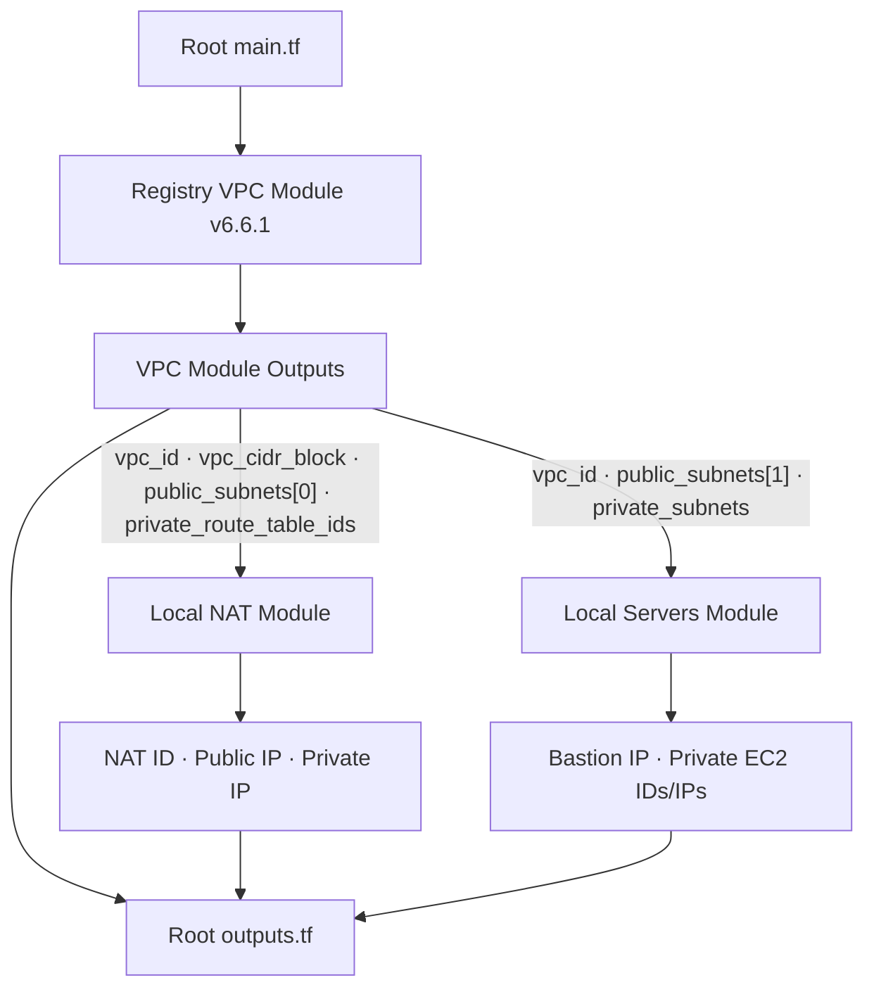

# Terraform External Module 활용 실습 v16.0

> [!summary]
> v15까지는 강사가 제공한 Local Module을 직접 확장했다. v16에서는 Terraform Registry의 VPC Module을 가져와 공통 네트워크를 생성하고, 기존 Local Module을 NAT와 Server 책임에 맞게 재구성했다. 구현은 Codex가 맡고 사용자는 목표·비용·Plan·설계 근거를 검토하는 실전형 협업 방식으로 진행했다.

## 목적

- Terraform Registry의 External Module을 `source`와 `version`으로 호출한다.
- External VPC Module의 Output을 Local NAT·Servers Module의 Input으로 연결한다.
- Public Subnet에는 NAT Instance와 Bastion을 배치한다.
- Private Subnet마다 EC2를 1대씩 배치한다.
- Private EC2가 NAT Instance를 통해 외부로 통신하는지 실제로 검증한다.
- AI가 IaC를 구현하고 사람이 승인·검토하는 실전형 작업 방식을 경험한다.

## 이전 진도 요약: v15.0

v15에서는 Local Module을 조립하여 ALB와 Auto Scaling Group을 구성했다.

```text
v15
Local Module을 직접 작성·수정
→ Module Output과 Input 연결
→ Launch Template과 ASG 구성
→ Apply와 AWS 실제 상태 검증

v16
Registry External VPC Module 사용
→ External Output을 Local Module Input으로 전달
→ NAT·Bastion·Private EC2 조립
→ AI 구현과 사람 검토 방식으로 전환
```

v16은 ASG 구성을 확장한 버전이 아니라 External Module 활용이라는 새 학습 단위다. 따라서 v15에 Part를 추가하지 않고 새 노트로 시작했다.

## 빠른 이동

- [[#1. v16의 출발점과 과제 범위|출발점과 범위]]
- [[#3. 전체 구성과 책임 경계|전체 구성]]
- [[#7. 전체 데이터 흐름|데이터 흐름]]
- [[#11. NAT Instance 구현|NAT 구현]]
- [[#16. Apply 후 AWS 실제 상태|실제 상태]]
- [[#18. SSH와 NAT 외부 통신 검증|SSH·NAT 검증]]
- [[#22. v16.0 완료 판정|완료 판정]]

# Part 1. External Module 실습의 출발점

## 1. v16의 출발점과 과제 범위

강사가 처음 제공한 Root `main.tf`의 핵심은 다음 Module 호출이었다.

```hcl
module "vpc" {
  source = "terraform-aws-modules/vpc/aws"
}
```

주석으로 주어진 과제는 다음과 같았다.

```text
Public Subnet
├─ NAT Instance
└─ Bastion

Private Subnet
├─ EC2 1대
└─ EC2 1대

검증
├─ 모든 EC2 SSH 접속
└─ Private EC2 외부 통신
```

이전에 사용하던 `networks/`, `servers/` 폴더도 복사했지만 그대로 호출하지 않았다. 기존 Module은 VPC·Subnet·RDS·Web 등 이번 과제 밖의 Resource까지 포함했기 때문이다.

### 최종 포함 범위

| 구분 | 포함 내용 |
|---|---|
| External Module | VPC, Subnet 4개, IGW, Route Table과 Association |
| Local NAT Module | NAT SG, NAT EC2, Private Default Route |
| Local Servers Module | Bastion, Private EC2 2대, SG |
| 검증 | Plan, AWS CLI, SSH, NAT Outbound |

### 제외 범위

- RDS
- S3
- ALB
- Auto Scaling Group
- Web Application과 `boot.war`
- NAT Gateway

`servers/web_install.tpl`과 `servers/boot.war`는 폴더에 남아 있지만 어떤 Terraform Resource에서도 참조하지 않으므로 배포되지 않는다.

## 2. External Module의 의미와 출처

Terraform Module은 Local 경로뿐 아니라 Registry나 VCS 등 외부 Source에서도 가져올 수 있다.

```hcl
module "vpc" {
  source  = "terraform-aws-modules/vpc/aws"
  version = "6.6.1"
}
```

| 속성 | 의미 |
|---|---|
| `source` | Module Source Code를 가져올 위치 |
| `version` | Registry Module에서 허용할 버전 |
| `module "vpc"` | 현재 Root Module 내부에서 사용할 호출 이름 |

> [!important]
> `terraform-aws-modules/vpc/aws`는 Terraform Registry에 공개된 Community Module이다. AWS Provider가 HashiCorp의 공식 Provider라고 해서 이 VPC Module 자체가 HashiCorp나 AWS의 공식 제품이라는 의미는 아니다.

`version = "6.6.1"`을 고정한 이유는 Module의 새 버전이 자동으로 선택되어 내부 Resource 구성이나 Interface가 예상치 않게 바뀌는 것을 막기 위해서다.

다만 버전 고정이 AWS Console에서 발생한 수동 변경까지 방지하지는 않는다.

```text
Module Version Pinning
→ 사용 코드 버전 고정

Infrastructure Drift
→ State와 AWS 실제 상태의 차이
→ terraform plan으로 별도 탐지
```

# Part 2. Root Module의 조립 흐름

## 3. 전체 구성과 책임 경계

```text
16_external_module/
├─ main.tf
├─ outputs.tf
├─ .terraform.lock.hcl
├─ networks/
│  ├─ main.tf
│  ├─ variables.tf
│  ├─ output.tf
│  └─ nat_install.tpl
└─ servers/
   ├─ main.tf
   ├─ variables.tf
   └─ output.tf
```

실제 책임은 다음과 같다.

| Module | 책임 |
|---|---|
| Root | Provider·Data 조회, 환경값, 세 Module 조립 |
| External `vpc` | VPC, Subnet, IGW, Route Table |
| Local `nat` | NAT Instance와 Private Default Route |
| Local `servers` | Bastion과 Private EC2 |

현재 Local NAT Module의 폴더명은 `networks/`다. 이전 실습에서 가져온 이름을 유지했지만, External VPC Module이 기본 Network를 담당하므로 실제 책임과 이름이 완전히 일치하지 않는다.

> [!note]
> 후속 Refactoring에서는 `networks/`를 `nat/`로 바꾸는 편이 명확하다. 현재 기능 오류는 아니므로 이번 실습 중에는 이름을 바꾸지 않았다.

## 4. Provider와 Data 조회

Root Module은 Resource를 만들기 전에 현재 환경에 필요한 값을 조회한다.

```hcl
data "http" "my_public_ip" {
  url = "https://checkip.amazonaws.com/"
}

data "aws_ami" "ubuntu" {
  most_recent = true
  owners      = ["099720109477"]
  # Ubuntu 24.04 Noble x86_64 gp3
}

data "aws_key_pair" "public" {
  key_name = "asd-open"
}

data "aws_key_pair" "private" {
  key_name = "asd-close"
}
```

```hcl
locals {
  env        = "external"
  admin_cidr = "${chomp(data.http.my_public_ip.response_body)}/32"
}
```

이 구조의 의미는 다음과 같다.

- AMI ID를 하드코딩하지 않고 현재 Region의 최신 Ubuntu 24.04 AMI를 선택한다.
- Key Pair가 실제 AWS 계정에 존재하는지 Plan 단계에서 확인한다.
- NAT와 Bastion의 SSH 허용 대상을 현재 관리자 Public IP `/32`로 제한한다.

## 5. External VPC Module 호출

```hcl
module "vpc" {
  source  = "terraform-aws-modules/vpc/aws"
  version = "6.6.1"

  name = "${local.env}-vpc"
  cidr = "10.0.0.0/16"

  azs             = ["ap-northeast-2a", "ap-northeast-2c"]
  public_subnets  = ["10.0.101.0/24", "10.0.102.0/24"]
  private_subnets = ["10.0.1.0/24", "10.0.2.0/24"]

  create_igw              = true
  enable_nat_gateway      = false
  map_public_ip_on_launch = false
}
```

`enable_nat_gateway = false`가 중요하다. 이번 실습은 Managed NAT Gateway가 아니라 직접 구성한 NAT Instance를 사용한다.

Public Subnet 자체의 자동 Public IP 기능은 끄고, NAT와 Bastion Resource에서만 다음 값을 명시했다.

```hcl
associate_public_ip_address = true
```

따라서 Public Subnet에 배치됐다는 이유만으로 모든 EC2가 자동으로 Public IP를 받지는 않는다.

## 6. External Output을 Local Input으로 연결

External VPC Module의 내부 Resource를 직접 참조하지 않는다. Module이 공개한 Output을 사용한다.

```hcl
module "nat" {
  source = "./networks"

  vpc_id                  = module.vpc.vpc_id
  vpc_cidr                = module.vpc.vpc_cidr_block
  public_subnet_id        = module.vpc.public_subnets[0]
  private_route_table_ids = module.vpc.private_route_table_ids
}
```

```hcl
module "servers" {
  source = "./servers"

  vpc_id             = module.vpc.vpc_id
  bastion_subnet_id  = module.vpc.public_subnets[1]
  private_subnet_ids = module.vpc.private_subnets
}
```

여기서 Output은 화면에 표시하기 위한 값만이 아니다.

```text
External Module 내부 Resource
→ External Module Output으로 공개
→ Root Module이 참조
→ Local Module Input에 전달
→ Local Module Resource 생성
```

## 7. 전체 데이터 흐름



Terraform이 실제로 만드는 의존성은 Output 참조에서 발생한다.

```text
module.vpc.public_subnets[0]
→ NAT가 사용할 Public Subnet

module.vpc.private_route_table_ids
→ 각 Private Route Table
→ 0.0.0.0/0을 NAT ENI로 연결

module.vpc.public_subnets[1]
→ Bastion 배치 Subnet

module.vpc.private_subnets
→ Private EC2를 1대씩 배치할 Subnet 목록
```

## 8. Root Output의 역할

Root `outputs.tf`는 Module의 결과를 사용자가 확인할 수 있도록 다시 공개한다.

```hcl
output "nat_public_ip" {
  value = module.nat.public_ip
}

output "bastion_public_ip" {
  value = module.servers.bastion_public_ip
}

output "private_instance_ips" {
  value = module.servers.private_instance_ips
}
```

이 Root Output은 다른 Module을 생성하는 데 사용되지는 않는다. Apply 결과 확인과 SSH 접속 정보 확인을 위한 최종 Interface다.

# Part 3. Local Module 구현

## 9. NAT Module Input 계약

NAT Module은 VPC와 Subnet을 직접 만들지 않고 External VPC Module의 결과를 입력받는다.

| Input | 사용 목적 |
|---|---|
| `env` | Name Tag와 Resource 이름 |
| `ami_id` | NAT EC2 AMI |
| `key_name` | NAT SSH Key Pair |
| `admin_cidr` | NAT SSH 허용 `/32` |
| `vpc_id` | NAT SG 배치 VPC |
| `vpc_cidr` | NAT가 전달할 내부 트래픽 범위 |
| `public_subnet_id` | NAT EC2 배치 위치 |
| `private_route_table_ids` | NAT 경로를 추가할 Route Table 목록 |

## 10. Private Route Table 반복 처리

External Module은 두 Private Route Table ID를 List로 공개한다.

```hcl
resource "aws_route" "private_default" {
  for_each = {
    for index, route_table_id in var.private_route_table_ids :
    tostring(index) => route_table_id
  }

  route_table_id         = each.value
  destination_cidr_block = "0.0.0.0/0"
  network_interface_id   = aws_instance.nat.primary_network_interface_id
}
```

결과:

```text
Private Route Table 2a ─┐
                        ├─ 0.0.0.0/0 → NAT Primary ENI
Private Route Table 2c ─┘
```

## 11. NAT Instance 구현

```hcl
resource "aws_instance" "nat" {
  ami                         = var.ami_id
  instance_type               = "t3.micro"
  subnet_id                   = var.public_subnet_id
  associate_public_ip_address = true
  source_dest_check           = false
  user_data                   = templatefile("${path.module}/nat_install.tpl", {})

  metadata_options {
    http_tokens = "required"
  }

  root_block_device {
    volume_type = "gp3"
    volume_size = 8
    encrypted   = true
  }
}
```

NAT Instance에는 세 가지 핵심 설정이 필요하다.

### 11-1. Source/Destination Check 해제

```hcl
source_dest_check = false
```

일반 EC2는 자신이 송수신 주체가 아닌 패킷을 거부한다. NAT Instance는 Private EC2의 패킷을 대신 전달하므로 이 검사를 꺼야 한다.

### 11-2. IP Forwarding

```bash
net.ipv4.ip_forward = 1
```

Linux Kernel이 한 Network Interface로 받은 패킷을 다른 목적지로 전달하도록 허용한다.

### 11-3. MASQUERADE와 영속화

```bash
iptables -t nat -A POSTROUTING -o "$IFACE" -j MASQUERADE
netfilter-persistent save
```

Private EC2의 Source IP를 NAT Instance가 외부 통신에 사용하는 주소로 변환한다. `iptables-persistent`와 `netfilter-persistent`는 재부팅 후에도 규칙을 복원하기 위한 Ubuntu 방식이다.

이전 NAT 실습에서 사용했던 구조를 참고했지만, 이번 AMI가 Ubuntu 24.04이므로 Amazon Linux의 `iptables-services` 방식 대신 Ubuntu에 맞게 수정했다.

> [!warning] 학습용 단순화
> 현재 NAT Instance는 2a에 1대만 있고 2a·2c의 Private Route Table이 모두 이를 사용한다. 따라서 NAT 장애 시 두 Private Subnet의 외부 통신이 함께 중단되며, 2c에서 나가는 트래픽은 AZ를 가로지른다. 또한 EIP를 사용하지 않아 NAT를 재생성하면 Public IP가 바뀐다. AWS는 가용성·대역폭·운영 부담 측면에서 일반적으로 NAT Gateway 사용을 권장하지만, 이번에는 NAT 동작 원리를 학습하기 위해 NAT Instance를 유지했다.

## 12. Servers Module 구현

### Bastion

```hcl
resource "aws_instance" "bastion" {
  subnet_id                   = var.bastion_subnet_id
  key_name                    = var.public_key_name
  associate_public_ip_address = true
}
```

### Private EC2

```hcl
resource "aws_instance" "private" {
  for_each = {
    for index, subnet_id in var.private_subnet_ids :
    tostring(index) => subnet_id
  }

  subnet_id                   = each.value
  key_name                    = var.private_key_name
  associate_public_ip_address = false
}
```

`private_subnet_ids`의 항목 수만큼 EC2가 생성된다.

```text
private_subnets[0] → Private EC2 1
private_subnets[1] → Private EC2 2
```

## 13. Security Group 경계

| 대상 | Ingress |
|---|---|
| NAT | VPC CIDR 전체 전달 트래픽, 관리자 `/32` SSH |
| Bastion | 관리자 `/32` SSH |
| Private EC2 | Bastion SG에서 오는 SSH만 허용 |

Private EC2는 관리자 Public IP를 직접 허용하지 않는다.

```text
내 PC → Bastion SG → Private EC2 SG
```

Security Group ID 참조를 사용하므로 Bastion의 Private IP가 바뀌어도 Private SG 규칙을 수정할 필요가 없다.

# Part 4. 실전형 구현과 검증 과정

## 14. AI 구현·사람 검토 방식

이전 실습은 사용자가 최소 코드를 직접 작성하고 Codex가 채점하는 방식이었다.

```text
이전
Codex가 이유와 힌트 제시
→ 사용자가 작성
→ Codex가 채점
```

v16은 실전 프로젝트에 가까운 역할 분담을 연습했다.

```text
v16
사용자가 목표·기존 Module·승인 경계 제공
→ Codex가 설계·구현·정적 검토·Plan 수행
→ 사용자가 비용과 Apply 승인
→ Codex가 AWS 실물·SSH·NAT 동작 검증
```

사람의 핵심 역할은 모든 HCL을 직접 입력하는 것보다 다음 항목을 통제하는 것이다.

- 목표 범위가 맞는가
- 불필요한 Resource가 포함되지 않았는가
- Module Input과 Output 계약이 타당한가
- 비용과 보안 경계를 승인할 수 있는가
- Plan과 실제 실행 결과가 일치하는가

## 15. Init·Validate·Plan

### Init

```powershell
terraform init
```

확인된 결과:

```text
Registry VPC Module: 6.6.1
AWS Provider: 6.55.0
HTTP Provider: 3.6.0
```

External Module Source나 Version을 변경하면 다시 `terraform init`해야 한다.

### Validate

```powershell
terraform fmt -check -recursive
terraform validate
```

결과:

```text
Success! The configuration is valid.
```

### Plan

```powershell
terraform plan
```

결과:

```text
Plan: 26 to add, 0 to change, 0 to destroy.
```

계획된 핵심 Resource:

| Resource Type | 수량 |
|---|---:|
| `aws_vpc` | 1 |
| `aws_subnet` | 4 |
| `aws_instance` | 4 |
| `aws_security_group` | 3 |
| `aws_route_table` | 3 |
| `aws_route` | 3 |
| `aws_route_table_association` | 4 |
| `aws_internet_gateway` | 1 |

External VPC Module이 VPC의 기본 Network ACL·기본 Route Table·기본 Security Group도 관리하므로 이 Resource들이 Plan에 포함됐다. 불필요한 RDS·S3·ALB·ASG·NAT Gateway는 포함되지 않았다.

## 16. Apply 후 AWS 실제 상태

Apply 후 Root Output:

```text
VPC ID: vpc-028a58a4699ea20ca

NAT Public IP: 43.203.235.158
Bastion Public IP: 13.125.237.199

Private EC2 1: 10.0.1.77
Private EC2 2: 10.0.2.217
```

AWS CLI 실제 확인:

| Name | AZ | Private IP | Public IP | Key | Source/Dest Check |
|---|---|---|---|---|---|
| `external-nat-instance` | 2a | `10.0.101.127` | `43.203.235.158` | `asd-open` | `false` |
| `external-bastion-instance` | 2c | `10.0.102.126` | `13.125.237.199` | `asd-open` | `true` |
| `external-private-instance-1` | 2a | `10.0.1.77` | 없음 | `asd-close` | `true` |
| `external-private-instance-2` | 2c | `10.0.2.217` | 없음 | `asd-close` | `true` |

네 인스턴스 모두 다음 상태였다.

```text
State: running
System status: ok
Instance status: ok
```

두 Private Route Table의 `0.0.0.0/0` 경로는 모두 NAT Primary ENI `eni-046adb0ee3e34c422`를 가리켰으며 상태는 `active`였다.

## 17. VS Code의 잘못된 빨간 줄

### 증상

`module "servers"`에 다음 진단이 표시됐다.

```text
Required attribute "vpc_id" not specified
Required attribute "public-subnets" not specified
Required attribute "private-subnets" not specified
```

### 실제 상태

현재 `servers/variables.tf`에는 다음 Input이 선언돼 있었다.

```text
vpc_id
bastion_subnet_id
private_subnet_ids
```

Root Module도 같은 이름으로 값을 전달했고 `terraform validate`, `plan`, `apply`가 모두 성공했다.

### 원인과 조치

VS Code Terraform Language Server가 수정 전 Module Input을 Cache하고 있었다.

```text
Ctrl+Shift+P
→ Terraform: Restart Language Server
```

재시작 후 빨간 줄이 사라졌다.

> [!important]
> Editor의 빨간 줄보다 `terraform validate`, `plan`, 실제 Apply 결과가 더 직접적인 실행 근거다. 다만 Editor 진단을 무조건 무시하지 말고 실제 오류 메시지와 현재 Module 계약을 대조해야 한다.

## 18. SSH와 NAT 외부 통신 검증

### Bastion SSH

```text
ip-10-0-102-126
BASTION_SSH_OK
```

### Private EC2 1

```text
ip-10-0-1-77
PRIVATE_SSH_OK
default via 10.0.1.1 dev ens5
43.203.235.158
```

### Private EC2 2

```text
ip-10-0-2-217
PRIVATE_SSH_OK
default via 10.0.2.1 dev ens5
43.203.235.158
```

두 Private EC2에서 `checkip.amazonaws.com`을 호출한 결과가 NAT Instance의 Public IP와 일치했다.

```text
Private EC2
→ Private Route Table
→ NAT ENI
→ MASQUERADE
→ IGW
→ Internet

외부 관측 IP
= 43.203.235.158
```

NAT 내부 설정도 확인했다.

```text
net.ipv4.ip_forward = 1
-A POSTROUTING -o ens5 -j MASQUERADE
netfilter-persistent: enabled
netfilter-persistent: active
```

## 19. SSH Config와 ProxyJump

사용자가 직접 접속할 때 사용할 수 있도록 다음 SSH Config를 준비했다.

```sshconfig
Host external-nat
    HostName 43.203.235.158
    User ubuntu
    IdentityFile C:/Users/Unoh/.ssh/asd-open.pem
    IdentitiesOnly yes

Host external-bastion
    HostName 13.125.237.199
    User ubuntu
    IdentityFile C:/Users/Unoh/.ssh/asd-open.pem
    IdentitiesOnly yes

Host external-private-1
    HostName 10.0.1.77
    User ubuntu
    IdentityFile C:/Users/Unoh/.ssh/asd-close.pem
    IdentitiesOnly yes
    ProxyJump external-bastion

Host external-private-2
    HostName 10.0.2.217
    User ubuntu
    IdentityFile C:/Users/Unoh/.ssh/asd-close.pem
    IdentitiesOnly yes
    ProxyJump external-bastion
```

`IdentitiesOnly yes`는 지정한 `IdentityFile`만 인증에 사용하도록 제한한다. Host Fingerprint의 `yes/no` 질문과는 별개다.

`ProxyJump`는 다음 수동 과정을 자동화한다.

```text
수동
내 PC → Bastion 로그인 → Private EC2 로그인

ProxyJump
ssh external-private-1
→ SSH가 Bastion을 통신 경유지로 자동 사용
```

Codex 검증에서는 동일한 경로를 `ProxyCommand`로 확인했다. 위 SSH Config를 사용한 사용자의 수동 접속 검증은 아직 수행하지 않았다.

# Part 5. 검토 방법과 완료 판정

## 20. 정적 검토와 동적 검증

이번 실습에서는 두 검토 방식을 모두 사용했다.

```text
정적 검토 Static Review
→ HCL, Input/Output, SG, Route, 비용 대상 검토

구성 검증
→ terraform fmt, validate, plan

동적 검증 Dynamic Validation
→ apply, AWS CLI, SSH, curl, sysctl, iptables 확인
```

AI가 정적 검토를 빠르게 수행할 수 있지만 사람은 최소한 다음 경계를 직접 승인해야 한다.

- 무엇을 생성하는가
- 비용이 발생하는가
- 공개 접근 경계가 적절한가
- Apply와 Destroy를 실행해도 되는가
- AI가 과제 범위를 임의로 넓히지 않았는가

## 21. 코드 검토 권장 순서

```text
Root main.tf
→ Root outputs.tf로 최종 결과 확인
→ networks variables → main → tpl → output
→ servers variables → main → output
→ Root로 돌아가 실제 값 전달 재확인
→ Plan과 AWS 실제 상태 대조
```

가장 효과적인 방법은 값 하나를 끝까지 추적하는 것이다.

```text
module.vpc.private_route_table_ids
→ module.nat.private_route_table_ids
→ aws_route.private_default
→ NAT ENI
```

```text
module.vpc.private_subnets
→ module.servers.private_subnet_ids
→ aws_instance.private
→ Private EC2 2대
```

## 22. v16.0 완료 판정

### 22-1. 코드 작성

- [x] External VPC Module 호출과 버전 고정
- [x] NAT Local Module 재구성
- [x] Servers Local Module 재구성
- [x] External Output → Local Input 연결
- [x] Root Output 구성
- [x] RDS·S3·ALB·ASG 등 과제 밖 Resource 제거

### 22-2. 정적·구성 검증

- [x] `terraform fmt -check -recursive`
- [x] `terraform init`
- [x] `terraform validate`
- [x] `terraform plan`
- [x] Plan Resource 종류와 수량 검토

### 22-3. 실제 동작 검증

- [x] Apply 후 EC2 4대 상태 확인
- [x] Public/Private IP 배치 확인
- [x] NAT `source_dest_check = false` 확인
- [x] Private Route → NAT ENI 확인
- [x] Bastion SSH 확인
- [x] Bastion 경유 Private EC2 2대 SSH 확인
- [x] Private EC2 NAT Outbound 확인
- [x] IP Forwarding·MASQUERADE·영속화 확인
- [ ] 사용자가 SSH Config의 `ProxyJump`로 직접 접속

### 22-4. 남은 작업과 비용

현재 다음 유료 Resource가 실행 중이다.

```text
t3.micro EC2 4대
EBS gp3 8 GiB × 4
Public IPv4 2개
```

현재 구성은 학습용이며 다음 운영 한계가 남아 있다.

- 단일 NAT Instance가 두 AZ의 Private Route를 담당한다.
- NAT에 EIP가 없어 재생성 시 Public IP와 SSH Config가 바뀐다.
- NAT SG는 VPC CIDR의 전체 Protocol을 허용한다.
- Bastion과 NAT의 관리자 `/32`는 현재 Public IP가 바뀌면 갱신해야 한다.

실습 종료 후 다음 절차가 필요하다.

```powershell
terraform destroy
```

Destroy는 아직 실행하지 않았다. 삭제 후에는 State, EC2, VPC, Public IPv4 잔존 여부를 다시 확인해야 한다.

Apply 전에 생성한 `review.tfplan`은 현재 인프라 생성 전 상태를 담은 오래된 Plan이다. 다시 Apply하면 안 되며 삭제 후보로 남긴다.

### 22-5. 검증상 예외

적용 후 일반 `terraform plan`의 원격 Refresh가 출력 없이 오래 대기하여 중단했다. 이후 다음 두 방법으로 상태를 분리 검증했다.

```text
AWS CLI
→ EC2·Route Table·Security Group 실제 상태 확인

terraform plan -refresh=false
→ No changes 확인
```

따라서 AWS 실물과 현재 Terraform State의 핵심 값은 직접 대조했지만, 적용 후 일반 Refresh Plan 완료 로그는 확보하지 않았다.

## 23. v16.0 한 문단 요약

v16에서는 Terraform Registry의 `terraform-aws-modules/vpc/aws` v6.6.1을 사용하여 VPC·Public/Private Subnet·IGW·Route Table을 생성하고, 그 Output을 Local NAT·Servers Module의 Input으로 전달했다. NAT Instance는 Ubuntu 24.04에서 IP Forwarding, iptables MASQUERADE, netfilter-persistent를 사용하도록 구성했으며, Bastion과 Private EC2 2대는 역할별 Security Group과 Key Pair로 분리했다. Plan은 26개 Resource 생성을 제안했고 실제 Apply 후 EC2 4대의 상태, Private Route의 NAT ENI 연결, Bastion 경유 SSH, 두 Private EC2의 NAT Outbound까지 검증했다. 이번 실습의 추가 학습점은 External Module 문법뿐 아니라 AI가 IaC를 구현하고 사람이 범위·비용·보안·Plan을 승인하는 실전형 협업 방식이었다.

# Appendices

## 부록 A. Module Input/Output 계약표

### Registry VPC → Local NAT

| Registry Output | NAT Input |
|---|---|
| `vpc_id` | `vpc_id` |
| `vpc_cidr_block` | `vpc_cidr` |
| `public_subnets[0]` | `public_subnet_id` |
| `private_route_table_ids` | `private_route_table_ids` |

### Registry VPC → Local Servers

| Registry Output | Servers Input |
|---|---|
| `vpc_id` | `vpc_id` |
| `public_subnets[1]` | `bastion_subnet_id` |
| `private_subnets` | `private_subnet_ids` |

### Local Module → Root Output

| Local Output | Root Output |
|---|---|
| `module.nat.public_ip` | `nat_public_ip` |
| `module.servers.bastion_public_ip` | `bastion_public_ip` |
| `module.servers.private_instance_ids` | `private_instance_ids` |
| `module.servers.private_instance_ips` | `private_instance_ips` |

## 부록 B. 핵심 검증 명령

```powershell
terraform fmt -check -recursive
terraform init
terraform validate
terraform plan
terraform output -json
terraform state list
```

AWS CLI와 SSH 검증은 생성된 Resource ID·IP를 기준으로 실행했다. 개인키 내용은 열거나 출력하지 않고 SSH 인증에만 사용했다.

## 부록 C. 출처 구분

### ① Local Primary Evidence

- `D:\terraform\workspace\16_external_module` 실제 파일
- `.terraform.lock.hcl`
- `terraform init`, `validate`, `plan`, `output`, `state list`
- AWS CLI `describe-instances`, `describe-route-tables`, `describe-security-groups`
- 실제 SSH·`curl`·`sysctl`·`iptables` 결과

### ② Authoritative External Evidence

- [HashiCorp Terraform module block reference](https://developer.hashicorp.com/terraform/language/block/module)
- [HashiCorp Terraform Modules overview](https://developer.hashicorp.com/terraform/language/modules)
- [Terraform Registry VPC Module Outputs](https://registry.terraform.io/modules/terraform-aws-modules/vpc/aws/latest?tab=outputs)
- [AWS VPC NAT instances](https://docs.aws.amazon.com/vpc/latest/userguide/VPC_NAT_Instance.html)
- [AWS NAT Instance 구성 절차](https://docs.aws.amazon.com/vpc/latest/userguide/work-with-nat-instances.html)

### ③ 수업·이전 실습 맥락

- `[[Terraform Module 종합 구성 실습 v15.0]]`
- 기존 `networks/`, `servers/` Local Module
- 이전 NAT Instance 실습에서 사용한 IP Forwarding과 MASQUERADE 구조

## 관련 노트

- [[Terraform Module]]
- [[Terraform Variable과 Output]]
- [[Terraform Workflow]]
- [[Terraform Module 종합 구성 실습 v15.0]]
- [[NAT Instance 실습]]
