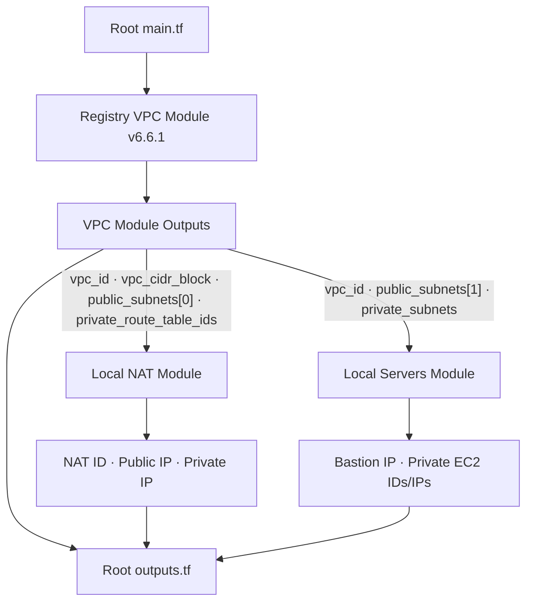
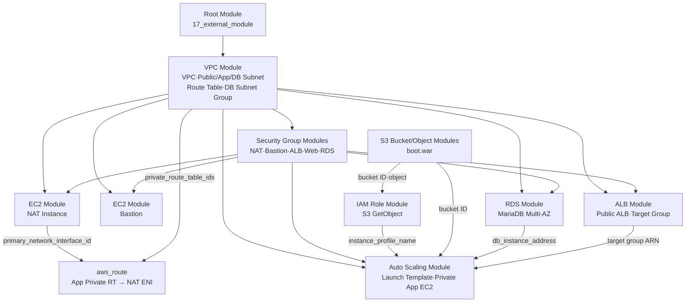
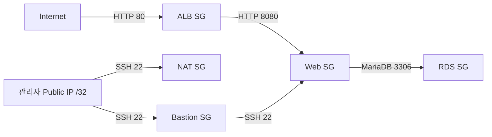

# Terraform External Module 활용 실습 v17.0

> [!summary]
> Part 1~5는 v16에서 Registry VPC Module과 Local NAT·Servers Module을 조립하고 실제 SSH·NAT 통신까지 검증한 기록이다. Part 6부터는 v17로 확장하여 VPC·EC2·Security Group·ALB·ASG·RDS·S3·IAM을 공식 Registry Module 중심으로 조립한다. NAT Gateway는 비용 때문에 사용하지 않고, EC2 NAT Instance와 직접 `aws_route`를 결합한다. 현재 v17은 `init`, `validate`, 실제 AWS 조회가 포함된 `plan`까지 성공했으며 `apply`는 비용 승인 전이라 실행하지 않았다.

## 목적

- Terraform Registry의 External Module을 `source`와 `version`으로 호출한다.
- External VPC Module의 Output을 Local NAT·Servers Module의 Input으로 연결한다.
- Public Subnet에는 NAT Instance와 Bastion을 배치한다.
- Private Subnet마다 EC2를 1대씩 배치한다.
- Private EC2가 NAT Instance를 통해 외부로 통신하는지 실제로 검증한다.
- AI가 IaC를 구현하고 사람이 승인·검토하는 실전형 작업 방식을 경험한다.
- v17에서는 강사 설계도를 2-AZ Public ALB, Private ASG, 격리된 Multi-AZ RDS 구조로 확장한다.
- AWS Resource 구현을 가능한 범위에서 `terraform-aws-modules` Registry Module로 교체한다.
- External Module의 Output을 다른 Module의 Input으로 연결하여 Root Module을 조립 계층으로 사용한다.
- Module로 해결되지 않는 NAT route만 직접 Resource로 작성하는 혼합 구성을 이해한다.

## 이전 진도 요약: v15.0

v15에서는 Local Module을 조립하여 ALB와 Auto Scaling Group을 구성했다.

```text
v15
Local Module을 직접 작성·수정
→ Module Output과 Input 연결
→ Launch Template과 ASG 구성
→ Apply와 AWS 실제 상태 검증

v16
Registry External VPC Module 사용
→ External Output을 Local Module Input으로 전달
→ NAT·Bastion·Private EC2 조립
→ AI 구현과 사람 검토 방식으로 전환
```

v16은 ASG 구성을 확장한 버전이 아니라 External Module 활용이라는 새 학습 단위다. 따라서 v15에 Part를 추가하지 않고 새 노트로 시작했다.

## 빠른 이동

- [[#1. v16의 출발점과 과제 범위|출발점과 범위]]
- [[#3. 전체 구성과 책임 경계|전체 구성]]
- [[#7. 전체 데이터 흐름|데이터 흐름]]
- [[#11. NAT Instance 구현|NAT 구현]]
- [[#16. Apply 후 AWS 실제 상태|실제 상태]]
- [[#18. SSH와 NAT 외부 통신 검증|SSH·NAT 검증]]
- [[#22. v16.0 완료 판정|완료 판정]]
- [[#24. v17의 출발점과 확정 설계|v17 확정 설계]]
- [[#28. v17 전체 작동 흐름|v17 작동 흐름]]
- [[#32. ALB와 ASG의 소유권 분리|ALB·ASG]]
- [[#36. 검증 중 발견한 두 문제와 수정|문제와 수정]]
- [[#40. v17 현재 완료 판정|v17 완료 판정]]

# Part 1. External Module 실습의 출발점

## 1. v16의 출발점과 과제 범위

강사가 처음 제공한 Root `main.tf`의 핵심은 다음 Module 호출이었다.

```hcl
module "vpc" {
  source = "terraform-aws-modules/vpc/aws"
}
```

주석으로 주어진 과제는 다음과 같았다.

```text
Public Subnet
├─ NAT Instance
└─ Bastion

Private Subnet
├─ EC2 1대
└─ EC2 1대

검증
├─ 모든 EC2 SSH 접속
└─ Private EC2 외부 통신
```

이전에 사용하던 `networks/`, `servers/` 폴더도 복사했지만 그대로 호출하지 않았다. 기존 Module은 VPC·Subnet·RDS·Web 등 이번 과제 밖의 Resource까지 포함했기 때문이다.

### 최종 포함 범위

| 구분 | 포함 내용 |
|---|---|
| External Module | VPC, Subnet 4개, IGW, Route Table과 Association |
| Local NAT Module | NAT SG, NAT EC2, Private Default Route |
| Local Servers Module | Bastion, Private EC2 2대, SG |
| 검증 | Plan, AWS CLI, SSH, NAT Outbound |

### 제외 범위

- RDS
- S3
- ALB
- Auto Scaling Group
- Web Application과 `boot.war`
- NAT Gateway

`servers/web_install.tpl`과 `servers/boot.war`는 폴더에 남아 있지만 어떤 Terraform Resource에서도 참조하지 않으므로 배포되지 않는다.

## 2. External Module의 의미와 출처

Terraform Module은 Local 경로뿐 아니라 Registry나 VCS 등 외부 Source에서도 가져올 수 있다.

```hcl
module "vpc" {
  source  = "terraform-aws-modules/vpc/aws"
  version = "6.6.1"
}
```

| 속성 | 의미 |
|---|---|
| `source` | Module Source Code를 가져올 위치 |
| `version` | Registry Module에서 허용할 버전 |
| `module "vpc"` | 현재 Root Module 내부에서 사용할 호출 이름 |

> [!important]
> `terraform-aws-modules/vpc/aws`는 Terraform Registry에 공개된 Community Module이다. AWS Provider가 HashiCorp의 공식 Provider라고 해서 이 VPC Module 자체가 HashiCorp나 AWS의 공식 제품이라는 의미는 아니다.

`version = "6.6.1"`을 고정한 이유는 Module의 새 버전이 자동으로 선택되어 내부 Resource 구성이나 Interface가 예상치 않게 바뀌는 것을 막기 위해서다.

다만 버전 고정이 AWS Console에서 발생한 수동 변경까지 방지하지는 않는다.

```text
Module Version Pinning
→ 사용 코드 버전 고정

Infrastructure Drift
→ State와 AWS 실제 상태의 차이
→ terraform plan으로 별도 탐지
```

# Part 2. Root Module의 조립 흐름

## 3. 전체 구성과 책임 경계

```text
16_external_module/
├─ main.tf
├─ outputs.tf
├─ .terraform.lock.hcl
├─ networks/
│  ├─ main.tf
│  ├─ variables.tf
│  ├─ output.tf
│  └─ nat_install.tpl
└─ servers/
   ├─ main.tf
   ├─ variables.tf
   └─ output.tf
```

실제 책임은 다음과 같다.

| Module | 책임 |
|---|---|
| Root | Provider·Data 조회, 환경값, 세 Module 조립 |
| External `vpc` | VPC, Subnet, IGW, Route Table |
| Local `nat` | NAT Instance와 Private Default Route |
| Local `servers` | Bastion과 Private EC2 |

현재 Local NAT Module의 폴더명은 `networks/`다. 이전 실습에서 가져온 이름을 유지했지만, External VPC Module이 기본 Network를 담당하므로 실제 책임과 이름이 완전히 일치하지 않는다.

> [!note]
> 후속 Refactoring에서는 `networks/`를 `nat/`로 바꾸는 편이 명확하다. 현재 기능 오류는 아니므로 이번 실습 중에는 이름을 바꾸지 않았다.

## 4. Provider와 Data 조회

Root Module은 Resource를 만들기 전에 현재 환경에 필요한 값을 조회한다.

```hcl
data "http" "my_public_ip" {
  url = "https://checkip.amazonaws.com/"
}

data "aws_ami" "ubuntu" {
  most_recent = true
  owners      = ["099720109477"]
  # Ubuntu 24.04 Noble x86_64 gp3
}

data "aws_key_pair" "public" {
  key_name = "asd-open"
}

data "aws_key_pair" "private" {
  key_name = "asd-close"
}
```

```hcl
locals {
  env        = "external"
  admin_cidr = "${chomp(data.http.my_public_ip.response_body)}/32"
}
```

이 구조의 의미는 다음과 같다.

- AMI ID를 하드코딩하지 않고 현재 Region의 최신 Ubuntu 24.04 AMI를 선택한다.
- Key Pair가 실제 AWS 계정에 존재하는지 Plan 단계에서 확인한다.
- NAT와 Bastion의 SSH 허용 대상을 현재 관리자 Public IP `/32`로 제한한다.

## 5. External VPC Module 호출

```hcl
module "vpc" {
  source  = "terraform-aws-modules/vpc/aws"
  version = "6.6.1"

  name = "${local.env}-vpc"
  cidr = "10.0.0.0/16"

  azs             = ["ap-northeast-2a", "ap-northeast-2c"]
  public_subnets  = ["10.0.101.0/24", "10.0.102.0/24"]
  private_subnets = ["10.0.1.0/24", "10.0.2.0/24"]

  create_igw              = true
  enable_nat_gateway      = false
  map_public_ip_on_launch = false
}
```

`enable_nat_gateway = false`가 중요하다. 이번 실습은 Managed NAT Gateway가 아니라 직접 구성한 NAT Instance를 사용한다.

Public Subnet 자체의 자동 Public IP 기능은 끄고, NAT와 Bastion Resource에서만 다음 값을 명시했다.

```hcl
associate_public_ip_address = true
```

따라서 Public Subnet에 배치됐다는 이유만으로 모든 EC2가 자동으로 Public IP를 받지는 않는다.

## 6. External Output을 Local Input으로 연결

External VPC Module의 내부 Resource를 직접 참조하지 않는다. Module이 공개한 Output을 사용한다.

```hcl
module "nat" {
  source = "./networks"

  vpc_id                  = module.vpc.vpc_id
  vpc_cidr                = module.vpc.vpc_cidr_block
  public_subnet_id        = module.vpc.public_subnets[0]
  private_route_table_ids = module.vpc.private_route_table_ids
}
```

```hcl
module "servers" {
  source = "./servers"

  vpc_id             = module.vpc.vpc_id
  bastion_subnet_id  = module.vpc.public_subnets[1]
  private_subnet_ids = module.vpc.private_subnets
}
```

여기서 Output은 화면에 표시하기 위한 값만이 아니다.

```text
External Module 내부 Resource
→ External Module Output으로 공개
→ Root Module이 참조
→ Local Module Input에 전달
→ Local Module Resource 생성
```

## 7. 전체 데이터 흐름



Terraform이 실제로 만드는 의존성은 Output 참조에서 발생한다.

```text
module.vpc.public_subnets[0]
→ NAT가 사용할 Public Subnet

module.vpc.private_route_table_ids
→ 각 Private Route Table
→ 0.0.0.0/0을 NAT ENI로 연결

module.vpc.public_subnets[1]
→ Bastion 배치 Subnet

module.vpc.private_subnets
→ Private EC2를 1대씩 배치할 Subnet 목록
```

## 8. Root Output의 역할

Root `outputs.tf`는 Module의 결과를 사용자가 확인할 수 있도록 다시 공개한다.

```hcl
output "nat_public_ip" {
  value = module.nat.public_ip
}

output "bastion_public_ip" {
  value = module.servers.bastion_public_ip
}

output "private_instance_ips" {
  value = module.servers.private_instance_ips
}
```

이 Root Output은 다른 Module을 생성하는 데 사용되지는 않는다. Apply 결과 확인과 SSH 접속 정보 확인을 위한 최종 Interface다.

# Part 3. Local Module 구현

## 9. NAT Module Input 계약

NAT Module은 VPC와 Subnet을 직접 만들지 않고 External VPC Module의 결과를 입력받는다.

| Input | 사용 목적 |
|---|---|
| `env` | Name Tag와 Resource 이름 |
| `ami_id` | NAT EC2 AMI |
| `key_name` | NAT SSH Key Pair |
| `admin_cidr` | NAT SSH 허용 `/32` |
| `vpc_id` | NAT SG 배치 VPC |
| `vpc_cidr` | NAT가 전달할 내부 트래픽 범위 |
| `public_subnet_id` | NAT EC2 배치 위치 |
| `private_route_table_ids` | NAT 경로를 추가할 Route Table 목록 |

## 10. Private Route Table 반복 처리

External Module은 두 Private Route Table ID를 List로 공개한다.

```hcl
resource "aws_route" "private_default" {
  for_each = {
    for index, route_table_id in var.private_route_table_ids :
    tostring(index) => route_table_id
  }

  route_table_id         = each.value
  destination_cidr_block = "0.0.0.0/0"
  network_interface_id   = aws_instance.nat.primary_network_interface_id
}
```

결과:

```text
Private Route Table 2a ─┐
                        ├─ 0.0.0.0/0 → NAT Primary ENI
Private Route Table 2c ─┘
```

## 11. NAT Instance 구현

```hcl
resource "aws_instance" "nat" {
  ami                         = var.ami_id
  instance_type               = "t3.micro"
  subnet_id                   = var.public_subnet_id
  associate_public_ip_address = true
  source_dest_check           = false
  user_data                   = templatefile("${path.module}/nat_install.tpl", {})

  metadata_options {
    http_tokens = "required"
  }

  root_block_device {
    volume_type = "gp3"
    volume_size = 8
    encrypted   = true
  }
}
```

NAT Instance에는 세 가지 핵심 설정이 필요하다.

### 11-1. Source/Destination Check 해제

```hcl
source_dest_check = false
```

일반 EC2는 자신이 송수신 주체가 아닌 패킷을 거부한다. NAT Instance는 Private EC2의 패킷을 대신 전달하므로 이 검사를 꺼야 한다.

### 11-2. IP Forwarding

```bash
net.ipv4.ip_forward = 1
```

Linux Kernel이 한 Network Interface로 받은 패킷을 다른 목적지로 전달하도록 허용한다.

### 11-3. MASQUERADE와 영속화

```bash
iptables -t nat -A POSTROUTING -o "$IFACE" -j MASQUERADE
netfilter-persistent save
```

Private EC2의 Source IP를 NAT Instance가 외부 통신에 사용하는 주소로 변환한다. `iptables-persistent`와 `netfilter-persistent`는 재부팅 후에도 규칙을 복원하기 위한 Ubuntu 방식이다.

이전 NAT 실습에서 사용했던 구조를 참고했지만, 이번 AMI가 Ubuntu 24.04이므로 Amazon Linux의 `iptables-services` 방식 대신 Ubuntu에 맞게 수정했다.

> [!warning] 학습용 단순화
> 현재 NAT Instance는 2a에 1대만 있고 2a·2c의 Private Route Table이 모두 이를 사용한다. 따라서 NAT 장애 시 두 Private Subnet의 외부 통신이 함께 중단되며, 2c에서 나가는 트래픽은 AZ를 가로지른다. 또한 EIP를 사용하지 않아 NAT를 재생성하면 Public IP가 바뀐다. AWS는 가용성·대역폭·운영 부담 측면에서 일반적으로 NAT Gateway 사용을 권장하지만, 이번에는 NAT 동작 원리를 학습하기 위해 NAT Instance를 유지했다.

## 12. Servers Module 구현

### Bastion

```hcl
resource "aws_instance" "bastion" {
  subnet_id                   = var.bastion_subnet_id
  key_name                    = var.public_key_name
  associate_public_ip_address = true
}
```

### Private EC2

```hcl
resource "aws_instance" "private" {
  for_each = {
    for index, subnet_id in var.private_subnet_ids :
    tostring(index) => subnet_id
  }

  subnet_id                   = each.value
  key_name                    = var.private_key_name
  associate_public_ip_address = false
}
```

`private_subnet_ids`의 항목 수만큼 EC2가 생성된다.

```text
private_subnets[0] → Private EC2 1
private_subnets[1] → Private EC2 2
```

## 13. Security Group 경계

| 대상 | Ingress |
|---|---|
| NAT | VPC CIDR 전체 전달 트래픽, 관리자 `/32` SSH |
| Bastion | 관리자 `/32` SSH |
| Private EC2 | Bastion SG에서 오는 SSH만 허용 |

Private EC2는 관리자 Public IP를 직접 허용하지 않는다.

```text
내 PC → Bastion SG → Private EC2 SG
```

Security Group ID 참조를 사용하므로 Bastion의 Private IP가 바뀌어도 Private SG 규칙을 수정할 필요가 없다.

# Part 4. 실전형 구현과 검증 과정

## 14. AI 구현·사람 검토 방식

이전 실습은 사용자가 최소 코드를 직접 작성하고 Codex가 채점하는 방식이었다.

```text
이전
Codex가 이유와 힌트 제시
→ 사용자가 작성
→ Codex가 채점
```

v16은 실전 프로젝트에 가까운 역할 분담을 연습했다.

```text
v16
사용자가 목표·기존 Module·승인 경계 제공
→ Codex가 설계·구현·정적 검토·Plan 수행
→ 사용자가 비용과 Apply 승인
→ Codex가 AWS 실물·SSH·NAT 동작 검증
```

사람의 핵심 역할은 모든 HCL을 직접 입력하는 것보다 다음 항목을 통제하는 것이다.

- 목표 범위가 맞는가
- 불필요한 Resource가 포함되지 않았는가
- Module Input과 Output 계약이 타당한가
- 비용과 보안 경계를 승인할 수 있는가
- Plan과 실제 실행 결과가 일치하는가

## 15. Init·Validate·Plan

### Init

```powershell
terraform init
```

확인된 결과:

```text
Registry VPC Module: 6.6.1
AWS Provider: 6.55.0
HTTP Provider: 3.6.0
```

External Module Source나 Version을 변경하면 다시 `terraform init`해야 한다.

### Validate

```powershell
terraform fmt -check -recursive
terraform validate
```

결과:

```text
Success! The configuration is valid.
```

### Plan

```powershell
terraform plan
```

결과:

```text
Plan: 26 to add, 0 to change, 0 to destroy.
```

계획된 핵심 Resource:

| Resource Type | 수량 |
|---|---:|
| `aws_vpc` | 1 |
| `aws_subnet` | 4 |
| `aws_instance` | 4 |
| `aws_security_group` | 3 |
| `aws_route_table` | 3 |
| `aws_route` | 3 |
| `aws_route_table_association` | 4 |
| `aws_internet_gateway` | 1 |

External VPC Module이 VPC의 기본 Network ACL·기본 Route Table·기본 Security Group도 관리하므로 이 Resource들이 Plan에 포함됐다. 불필요한 RDS·S3·ALB·ASG·NAT Gateway는 포함되지 않았다.

## 16. Apply 후 AWS 실제 상태

Apply 후 Root Output:

```text
VPC ID: vpc-028a58a4699ea20ca

NAT Public IP: 43.203.235.158
Bastion Public IP: 13.125.237.199

Private EC2 1: 10.0.1.77
Private EC2 2: 10.0.2.217
```

AWS CLI 실제 확인:

| Name | AZ | Private IP | Public IP | Key | Source/Dest Check |
|---|---|---|---|---|---|
| `external-nat-instance` | 2a | `10.0.101.127` | `43.203.235.158` | `asd-open` | `false` |
| `external-bastion-instance` | 2c | `10.0.102.126` | `13.125.237.199` | `asd-open` | `true` |
| `external-private-instance-1` | 2a | `10.0.1.77` | 없음 | `asd-close` | `true` |
| `external-private-instance-2` | 2c | `10.0.2.217` | 없음 | `asd-close` | `true` |

네 인스턴스 모두 다음 상태였다.

```text
State: running
System status: ok
Instance status: ok
```

두 Private Route Table의 `0.0.0.0/0` 경로는 모두 NAT Primary ENI `eni-046adb0ee3e34c422`를 가리켰으며 상태는 `active`였다.

## 17. VS Code의 잘못된 빨간 줄

### 증상

`module "servers"`에 다음 진단이 표시됐다.

```text
Required attribute "vpc_id" not specified
Required attribute "public-subnets" not specified
Required attribute "private-subnets" not specified
```

### 실제 상태

현재 `servers/variables.tf`에는 다음 Input이 선언돼 있었다.

```text
vpc_id
bastion_subnet_id
private_subnet_ids
```

Root Module도 같은 이름으로 값을 전달했고 `terraform validate`, `plan`, `apply`가 모두 성공했다.

### 원인과 조치

VS Code Terraform Language Server가 수정 전 Module Input을 Cache하고 있었다.

```text
Ctrl+Shift+P
→ Terraform: Restart Language Server
```

재시작 후 빨간 줄이 사라졌다.

> [!important]
> Editor의 빨간 줄보다 `terraform validate`, `plan`, 실제 Apply 결과가 더 직접적인 실행 근거다. 다만 Editor 진단을 무조건 무시하지 말고 실제 오류 메시지와 현재 Module 계약을 대조해야 한다.

## 18. SSH와 NAT 외부 통신 검증

### Bastion SSH

```text
ip-10-0-102-126
BASTION_SSH_OK
```

### Private EC2 1

```text
ip-10-0-1-77
PRIVATE_SSH_OK
default via 10.0.1.1 dev ens5
43.203.235.158
```

### Private EC2 2

```text
ip-10-0-2-217
PRIVATE_SSH_OK
default via 10.0.2.1 dev ens5
43.203.235.158
```

두 Private EC2에서 `checkip.amazonaws.com`을 호출한 결과가 NAT Instance의 Public IP와 일치했다.

```text
Private EC2
→ Private Route Table
→ NAT ENI
→ MASQUERADE
→ IGW
→ Internet

외부 관측 IP
= 43.203.235.158
```

NAT 내부 설정도 확인했다.

```text
net.ipv4.ip_forward = 1
-A POSTROUTING -o ens5 -j MASQUERADE
netfilter-persistent: enabled
netfilter-persistent: active
```

## 19. SSH Config와 ProxyJump

사용자가 직접 접속할 때 사용할 수 있도록 다음 SSH Config를 준비했다.

```sshconfig
Host external-nat
    HostName 43.203.235.158
    User ubuntu
    IdentityFile C:/Users/Unoh/.ssh/asd-open.pem
    IdentitiesOnly yes

Host external-bastion
    HostName 13.125.237.199
    User ubuntu
    IdentityFile C:/Users/Unoh/.ssh/asd-open.pem
    IdentitiesOnly yes

Host external-private-1
    HostName 10.0.1.77
    User ubuntu
    IdentityFile C:/Users/Unoh/.ssh/asd-close.pem
    IdentitiesOnly yes
    ProxyJump external-bastion

Host external-private-2
    HostName 10.0.2.217
    User ubuntu
    IdentityFile C:/Users/Unoh/.ssh/asd-close.pem
    IdentitiesOnly yes
    ProxyJump external-bastion
```

`IdentitiesOnly yes`는 지정한 `IdentityFile`만 인증에 사용하도록 제한한다. Host Fingerprint의 `yes/no` 질문과는 별개다.

`ProxyJump`는 다음 수동 과정을 자동화한다.

```text
수동
내 PC → Bastion 로그인 → Private EC2 로그인

ProxyJump
ssh external-private-1
→ SSH가 Bastion을 통신 경유지로 자동 사용
```

Codex 검증에서는 동일한 경로를 `ProxyCommand`로 확인했다. 위 SSH Config를 사용한 사용자의 수동 접속 검증은 아직 수행하지 않았다.

# Part 5. 검토 방법과 완료 판정

## 20. 정적 검토와 동적 검증

이번 실습에서는 두 검토 방식을 모두 사용했다.

```text
정적 검토 Static Review
→ HCL, Input/Output, SG, Route, 비용 대상 검토

구성 검증
→ terraform fmt, validate, plan

동적 검증 Dynamic Validation
→ apply, AWS CLI, SSH, curl, sysctl, iptables 확인
```

AI가 정적 검토를 빠르게 수행할 수 있지만 사람은 최소한 다음 경계를 직접 승인해야 한다.

- 무엇을 생성하는가
- 비용이 발생하는가
- 공개 접근 경계가 적절한가
- Apply와 Destroy를 실행해도 되는가
- AI가 과제 범위를 임의로 넓히지 않았는가

## 21. 코드 검토 권장 순서

```text
Root main.tf
→ Root outputs.tf로 최종 결과 확인
→ networks variables → main → tpl → output
→ servers variables → main → output
→ Root로 돌아가 실제 값 전달 재확인
→ Plan과 AWS 실제 상태 대조
```

가장 효과적인 방법은 값 하나를 끝까지 추적하는 것이다.

```text
module.vpc.private_route_table_ids
→ module.nat.private_route_table_ids
→ aws_route.private_default
→ NAT ENI
```

```text
module.vpc.private_subnets
→ module.servers.private_subnet_ids
→ aws_instance.private
→ Private EC2 2대
```

## 22. v16.0 완료 판정

### 22-1. 코드 작성

- [x] External VPC Module 호출과 버전 고정
- [x] NAT Local Module 재구성
- [x] Servers Local Module 재구성
- [x] External Output → Local Input 연결
- [x] Root Output 구성
- [x] RDS·S3·ALB·ASG 등 과제 밖 Resource 제거

### 22-2. 정적·구성 검증

- [x] `terraform fmt -check -recursive`
- [x] `terraform init`
- [x] `terraform validate`
- [x] `terraform plan`
- [x] Plan Resource 종류와 수량 검토

### 22-3. 실제 동작 검증

- [x] Apply 후 EC2 4대 상태 확인
- [x] Public/Private IP 배치 확인
- [x] NAT `source_dest_check = false` 확인
- [x] Private Route → NAT ENI 확인
- [x] Bastion SSH 확인
- [x] Bastion 경유 Private EC2 2대 SSH 확인
- [x] Private EC2 NAT Outbound 확인
- [x] IP Forwarding·MASQUERADE·영속화 확인
- [ ] 사용자가 SSH Config의 `ProxyJump`로 직접 접속

### 22-4. 남은 작업과 비용

현재 다음 유료 Resource가 실행 중이다.

```text
t3.micro EC2 4대
EBS gp3 8 GiB × 4
Public IPv4 2개
```

현재 구성은 학습용이며 다음 운영 한계가 남아 있다.

- 단일 NAT Instance가 두 AZ의 Private Route를 담당한다.
- NAT에 EIP가 없어 재생성 시 Public IP와 SSH Config가 바뀐다.
- NAT SG는 VPC CIDR의 전체 Protocol을 허용한다.
- Bastion과 NAT의 관리자 `/32`는 현재 Public IP가 바뀌면 갱신해야 한다.

실습 종료 후 다음 절차가 필요하다.

```powershell
terraform destroy
```

Destroy는 아직 실행하지 않았다. 삭제 후에는 State, EC2, VPC, Public IPv4 잔존 여부를 다시 확인해야 한다.

Apply 전에 생성한 `review.tfplan`은 현재 인프라 생성 전 상태를 담은 오래된 Plan이다. 다시 Apply하면 안 되며 삭제 후보로 남긴다.

### 22-5. 검증상 예외

적용 후 일반 `terraform plan`의 원격 Refresh가 출력 없이 오래 대기하여 중단했다. 이후 다음 두 방법으로 상태를 분리 검증했다.

```text
AWS CLI
→ EC2·Route Table·Security Group 실제 상태 확인

terraform plan -refresh=false
→ No changes 확인
```

따라서 AWS 실물과 현재 Terraform State의 핵심 값은 직접 대조했지만, 적용 후 일반 Refresh Plan 완료 로그는 확보하지 않았다.

## 23. v16.0 한 문단 요약

v16에서는 Terraform Registry의 `terraform-aws-modules/vpc/aws` v6.6.1을 사용하여 VPC·Public/Private Subnet·IGW·Route Table을 생성하고, 그 Output을 Local NAT·Servers Module의 Input으로 전달했다. NAT Instance는 Ubuntu 24.04에서 IP Forwarding, iptables MASQUERADE, netfilter-persistent를 사용하도록 구성했으며, Bastion과 Private EC2 2대는 역할별 Security Group과 Key Pair로 분리했다. Plan은 26개 Resource 생성을 제안했고 실제 Apply 후 EC2 4대의 상태, Private Route의 NAT ENI 연결, Bastion 경유 SSH, 두 Private EC2의 NAT Outbound까지 검증했다. 이번 실습의 추가 학습점은 External Module 문법뿐 아니라 AI가 IaC를 구현하고 사람이 범위·비용·보안·Plan을 승인하는 실전형 협업 방식이었다.

# Appendices

## 부록 A. Module Input/Output 계약표

### Registry VPC → Local NAT

| Registry Output | NAT Input |
|---|---|
| `vpc_id` | `vpc_id` |
| `vpc_cidr_block` | `vpc_cidr` |
| `public_subnets[0]` | `public_subnet_id` |
| `private_route_table_ids` | `private_route_table_ids` |

### Registry VPC → Local Servers

| Registry Output | Servers Input |
|---|---|
| `vpc_id` | `vpc_id` |
| `public_subnets[1]` | `bastion_subnet_id` |
| `private_subnets` | `private_subnet_ids` |

### Local Module → Root Output

| Local Output | Root Output |
|---|---|
| `module.nat.public_ip` | `nat_public_ip` |
| `module.servers.bastion_public_ip` | `bastion_public_ip` |
| `module.servers.private_instance_ids` | `private_instance_ids` |
| `module.servers.private_instance_ips` | `private_instance_ips` |

## 부록 B. 핵심 검증 명령

```powershell
terraform fmt -check -recursive
terraform init
terraform validate
terraform plan
terraform output -json
terraform state list
```

AWS CLI와 SSH 검증은 생성된 Resource ID·IP를 기준으로 실행했다. 개인키 내용은 열거나 출력하지 않고 SSH 인증에만 사용했다.

## 부록 C. 출처 구분

### ① Local Primary Evidence

- `D:\terraform\workspace\16_external_module` 실제 파일
- `.terraform.lock.hcl`
- `terraform init`, `validate`, `plan`, `output`, `state list`
- AWS CLI `describe-instances`, `describe-route-tables`, `describe-security-groups`
- 실제 SSH·`curl`·`sysctl`·`iptables` 결과

### ② Authoritative External Evidence

- [HashiCorp Terraform module block reference](https://developer.hashicorp.com/terraform/language/block/module)
- [HashiCorp Terraform Modules overview](https://developer.hashicorp.com/terraform/language/modules)
- [Terraform Registry VPC Module Outputs](https://registry.terraform.io/modules/terraform-aws-modules/vpc/aws/latest?tab=outputs)
- [AWS VPC NAT instances](https://docs.aws.amazon.com/vpc/latest/userguide/VPC_NAT_Instance.html)
- [AWS NAT Instance 구성 절차](https://docs.aws.amazon.com/vpc/latest/userguide/work-with-nat-instances.html)

### ③ 수업·이전 실습 맥락

- `[[Terraform Module 종합 구성 실습 v15.0]]`
- 기존 `networks/`, `servers/` Local Module
- 이전 NAT Instance 실습에서 사용한 IP Forwarding과 MASQUERADE 구조

## 관련 노트

- [[Terraform Module]]
- [[Terraform Variable과 Output]]
- [[Terraform Workflow]]
- [[Terraform Module 종합 구성 실습 v15.0]]
- [[NAT Instance 실습]]

# Part 6. v17 Registry Module 종합 아키텍처

## 24. v17의 출발점과 확정 설계

v17은 강의 화면에 제시된 2-AZ 웹 서비스 구성을 `terraform-aws-modules`의 External Module 중심으로 구현하는 실습이다.

강의 화면에서 직접 확인한 큰 구조는 다음과 같다.

```text
Region: ap-northeast-2
VPC: 192.168.0.0/16

ap-northeast-2a
├─ Public Subnet  : 192.168.10.0/24
├─ App Subnet     : 192.168.11.0/24
└─ Database Subnet: 192.168.12.0/24

ap-northeast-2c
├─ Public Subnet  : 192.168.30.0/24
├─ App Subnet     : 192.168.31.0/24
└─ Database Subnet: 192.168.32.0/24
```

사용자와 검토하여 다음 경계를 확정했다.

| 항목 | 확정 내용 | 이유 |
|---|---|---|
| 외부 유입 | Internet-facing ALB를 Public Subnet 2개에 배치 | ALB는 최소 두 AZ를 사용하고, App EC2는 직접 Public에 노출하지 않음 |
| App | ASG를 App Private Subnet 2개에 배치 | 인스턴스 생성·교체·ID 관리를 ASG가 소유 |
| DB | RDS MariaDB Multi-AZ DB Instance | 2개 DB Subnet을 사용하는 격리된 DB 계층 |
| NAT | NAT Gateway 대신 NAT Instance | 수업 비용을 줄이고 이전 NAT 실습을 재사용 |
| Bastion | Public Subnet 2c | 관리자 SSH 진입점 |
| S3 | `boot.war` Artifact 저장 | App 인스턴스가 IAM Role로 다운로드 |
| Route 53·ACM | 현재 범위에서 제외 | 강의 화면에서 제외 표시되었고 도메인·인증서 입력값도 없음 |

> [!important]
> RDS의 Multi-AZ는 이 실습에서 **Multi-AZ DB Instance 배포**를 뜻한다. 별도의 RDS Multi-AZ DB Cluster를 만든다는 뜻은 아니다.

## 25. 왜 v16보다 External Module 범위를 넓혔는가

v16에서는 Registry VPC Module만 외부 모듈이었고 NAT와 Server는 Local Module이었다.

```text
v16
Registry VPC
└─ Local NAT + Local Servers
```

v17에서는 가능한 구현을 공식 Registry Module의 Input·Output 계약으로 교체한다.

```text
v17
Registry VPC
Registry EC2
Registry Security Group
Registry ALB
Registry Auto Scaling
Registry RDS
Registry S3 Bucket/Object
Registry IAM Role
└─ 직접 Resource는 NAT route만 유지
```

이 변경의 학습 의도는 Resource 문법을 전부 다시 작성하는 것이 아니다.

> 검증된 외부 Module의 공개 Interface를 읽고, Root Module에서 여러 Module을 하나의 Architecture로 조립하는 능력을 연습한다.

Module을 사용해도 설계 판단은 사라지지 않는다. 다음은 여전히 사용자가 결정해야 한다.

- 어느 Subnet을 Public·App·Database로 사용할지
- 각 계층의 Security Group Source가 무엇인지
- 어떤 Module이 Launch Template과 Target 등록을 소유할지
- NAT Gateway를 끄고 NAT Instance route를 어떻게 연결할지
- RDS Subnet Group을 어느 Module이 소유할지
- Module Version을 어디까지 고정할지

## 26. v17 폴더 구조

```text
17_external_module/
├─ variables.tf
├─ main.tf
├─ security_groups.tf
├─ outputs.tf
├─ versions.tf
├─ terraform.tfvars.example
├─ .gitignore
├─ .terraform.lock.hcl
├─ boot.war
└─ templates/
   ├─ nat_install.sh
   └─ web_install.sh
```

초안은 `network.tf`, `compute.tf`, `database.tf`, `autoscaling.tf`처럼 책임별로 세분화했다. 코드 검색에는 편했지만 기존 수업의 `variables → main → outputs` 흐름과 차이가 커서 검토하기 어려웠다.

따라서 External Module 조립 순서를 `main.tf`에 모으고, 길이가 크며 독립적으로 읽을 가치가 있는 Security Group만 `security_groups.tf`에 유지했다.

```text
같은 디렉터리의 여러 .tf
= Root Module 하나
= State 하나
= Dependency Graph 하나
```

`main.tf` 안의 Block 순서는 다음과 같다.

```text
Provider·Data·Locals
→ VPC
→ NAT·Bastion·Route
→ S3·IAM
→ RDS
→ ALB
→ ASG
```

파일을 합친 전후 모두 같은 Root Module이다. Resource·Module Block 주소를 유지했으며 재검증한 Plan도 `65 to add, 0 to change, 0 to destroy`로 동일했다. 즉 Infrastructure 의미는 바뀌지 않고 읽는 순서만 단순해졌다.

## 27. 사용한 Registry Module과 책임

| Source | Version | 이 실습의 책임 |
|---|---:|---|
| `terraform-aws-modules/vpc/aws` | `6.6.1` | VPC, 6개 Subnet, IGW, Route Table, DB Subnet Group |
| `terraform-aws-modules/ec2-instance/aws` | `6.4.0` | NAT Instance, Bastion |
| `terraform-aws-modules/security-group/aws` | `6.0.0` | NAT·Bastion·ALB·Web·RDS SG |
| `terraform-aws-modules/alb/aws` | `10.5.0` | Internet-facing ALB, Listener, Target Group |
| `terraform-aws-modules/autoscaling/aws` | `9.2.1` | Launch Template, ASG, Target Group 연결 |
| `terraform-aws-modules/rds/aws` | `7.2.0` | Multi-AZ MariaDB DB Instance |
| `terraform-aws-modules/s3-bucket/aws` | `5.14.1` | Private S3 Bucket |
| `terraform-aws-modules/s3-bucket/aws//modules/object` | `5.14.1` | `boot.war` Object 업로드 |
| `terraform-aws-modules/iam/aws//modules/iam-role` | `6.6.1` | App EC2용 Role·Instance Profile·S3 Read Policy |

Provider는 Module 요구조건과 v16 실행 환경을 함께 고려하여 고정했다.

```hcl
aws  = "~> 6.55"
http = "~> 3.6"
```

실제 `terraform init` 결과는 다음 Version을 선택했다.

```text
hashicorp/aws    v6.55.0
hashicorp/http   v3.6.0
hashicorp/random v3.9.0
```

`random` Provider는 Root에서 직접 선언하지 않았지만 RDS Module의 Provider 요구관계 때문에 초기화됐다.

## 28. v17 전체 작동 흐름



이 Diagram에서 화살표는 단순 실행 순서가 아니라 **값 참조에 의해 만들어진 의존 관계**다.

예를 들어 ASG는 다음 값이 준비돼야 완성된다.

```text
VPC Module
→ App Private Subnet ID List

Web SG Module
→ Web SG ID

IAM Module
→ Instance Profile Name

RDS Module
→ DB Endpoint

S3 Module
→ Bucket ID와 boot.war

ALB Module
→ Target Group ARN

위 값을 ASG Input과 user_data에 전달
→ Launch Template 생성
→ ASG가 Private EC2 생성
→ Target Group에 ASG 연결
```

Module Output은 화면에 출력하기 위해서만 존재하지 않는다. 현재 Root Module 안에서 다른 Module의 Input으로 소비되면 Terraform Dependency Graph의 연결점이 된다.

## 29. Network 계층과 Route 경계

VPC Module은 세 종류의 Subnet을 AZ별로 만든다.

| 계층 | 2a | 2c | Route 목적 |
|---|---|---|---|
| Public | `192.168.10.0/24` | `192.168.30.0/24` | IGW |
| App Private | `192.168.11.0/24` | `192.168.31.0/24` | NAT Instance ENI |
| DB Private | `192.168.12.0/24` | `192.168.32.0/24` | VPC Local Route만 |

VPC Module 설정의 핵심은 다음이다.

```hcl
enable_nat_gateway = false

create_database_subnet_group           = true
create_database_subnet_route_table     = true
create_database_nat_gateway_route      = false
create_database_internet_gateway_route = false
```

이 결과는 다음과 같다.

```text
App Private Subnet
→ NAT Instance를 통해 Package·S3 등 Outbound 가능

Database Subnet
→ 0.0.0.0/0 기본 경로 없음
→ RDS는 VPC 내부에서만 접근
```

### NAT Route를 직접 Resource로 남긴 이유

`terraform-aws-modules`에는 이 설계를 그대로 대신하는 NAT Instance 전용 Module이 없다. VPC Module의 NAT 기능은 NAT Gateway 중심이다.

따라서 다음처럼 혼합했다.

```text
NAT EC2 생성
→ External EC2 Module

NAT OS 설정
→ user_data

App Route Table의 0.0.0.0/0
→ 직접 aws_route
```

```hcl
resource "aws_route" "app_private_default_to_nat" {
  for_each = {
    "2a" = module.vpc.private_route_table_ids[0]
    "2c" = module.vpc.private_route_table_ids[1]
  }

  route_table_id         = each.value
  destination_cidr_block = "0.0.0.0/0"
  network_interface_id   = module.nat_instance.primary_network_interface_id
}
```

> [!note]
> External Module을 사용한다는 것은 직접 Resource를 절대 쓰지 않는다는 뜻이 아니다. Module의 공개 Interface로 표현하기 어려운 작은 연결은 Root에서 직접 작성할 수 있다.

## 30. Security Group은 통신 계약이다

Security Group은 Resource 종류별 허용이 아니라 실제 통신 흐름에 맞춰 구성했다.



주요 규칙은 다음과 같다.

| 대상 SG | Ingress Source | Port |
|---|---|---:|
| NAT | VPC CIDR | All, NAT Forwarding |
| NAT | 관리자 `/32` | 22 |
| Bastion | 관리자 `/32` | 22 |
| ALB | `0.0.0.0/0` | 80 |
| Web | ALB SG | 8080 |
| Web | Bastion SG | 22 |
| RDS | Web SG | 3306 |

App EC2는 Private Subnet에 있고 Web SG도 ALB SG에서 오는 8080만 허용한다. 따라서 Internet Client는 App EC2에 직접 연결하지 않고 반드시 Public ALB를 거친다.

## 31. NAT Instance와 Bastion

### NAT Instance

NAT Instance는 Public Subnet 2a에 배치한다.

```hcl
associate_public_ip_address = true
source_dest_check           = false
```

`source_dest_check = false`가 필요한 이유는 NAT Instance가 자신이 Source 또는 Destination이 아닌 다른 EC2의 Packet을 Forward하기 때문이다.

Ubuntu `user_data`는 v16에서 실제 통신 검증한 구성을 계승했다.

```text
net.ipv4.ip_forward = 1
iptables POSTROUTING MASQUERADE
iptables-persistent 설치
netfilter-persistent 저장·자동 시작
```

### Bastion

Bastion은 Public Subnet 2c에 배치한다.

```text
관리자
→ asd-open Key Pair
→ Bastion Public IP
→ ProxyJump
→ asd-close Key Pair를 사용하는 Private ASG Instance
```

NAT와 Bastion은 모두 Public EC2지만 책임은 다르다.

| EC2 | 책임 |
|---|---|
| NAT | Private App의 Outbound Forwarding |
| Bastion | 관리자의 Private App SSH 경유 |

## 32. ALB와 ASG의 소유권 분리

ALB Module은 다음을 소유한다.

```text
Internet-facing ALB
Public Subnet 2개 연결
HTTP 80 Listener
Port 8080 Target Group
/boot/index Health Check
```

ASG Module은 다음을 소유한다.

```text
Launch Template
Private App Subnet 2개
min = 2
desired = 2
max = 4
App EC2 생성·교체
Target Group Traffic Source Attachment
```

Target Group 자체는 ALB Module에 있지만 Target 등록은 ASG가 담당한다.

```hcl
target_groups = {
  app = {
    target_type       = "instance"
    create_attachment = false
  }
}
```

```hcl
traffic_source_attachments = {
  alb = {
    traffic_source_identifier = module.alb.target_groups["app"].arn
    traffic_source_type       = "elbv2"
  }
}
```

`create_attachment = false`가 중요한 이유는 ALB Module이 고정된 Instance ID를 등록하지 않게 하기 위해서다.

```text
잘못된 방향
ALB가 특정 Web Instance ID를 소유
→ ASG가 Instance를 교체하면 ID가 바뀜

현재 방향
ASG가 Instance 수명주기와 Target 등록을 소유
→ 생성·교체·Scale 과정에서 Target 상태를 함께 관리
```

> [!warning]
> 현재 `min`, `desired`, `max`와 ELB Health Check는 설정했지만 CPU Target Tracking 같은 Scaling Policy는 아직 없다. 따라서 ASG는 2대를 유지하고 비정상 Instance를 교체하지만, 부하에 따라 2대에서 4대로 자동 Scale-out하는 조건은 아직 구현하지 않았다.

## 33. S3 Artifact와 IAM Role

S3 Bucket은 Public Access를 모두 차단한다.

```text
block_public_acls       = true
block_public_policy     = true
ignore_public_acls      = true
restrict_public_buckets = true
```

`boot.war`는 같은 S3 Repository의 `modules/object` Submodule로 업로드한다.

```text
Root의 boot.war
→ S3 Object Module
→ s3://<bucket>/boot.war
```

App EC2에는 Access Key를 저장하지 않는다. IAM Role Module이 Instance Profile을 만들고 최소 권한을 부여한다.

```text
Allow: s3:GetObject
Resource: arn:aws:s3:::<bucket>/boot.war
```

데이터 흐름은 다음과 같다.

```text
S3 Bucket ARN
→ IAM Inline Policy Resource
→ IAM Instance Profile
→ ASG Launch Template
→ App EC2의 aws s3 cp
```

ASG Module에는 `depends_on = [module.boot_object]`도 지정했다. App EC2가 먼저 시작돼 아직 업로드되지 않은 Object를 찾는 경쟁 상태를 줄이기 위한 것이다.

## 34. RDS Multi-AZ와 Database 격리

VPC Module이 DB Subnet Group을 소유하고, RDS Module은 그 이름을 Input으로 받는다.

```hcl
create_db_subnet_group  = false
db_subnet_group_name    = module.vpc.database_subnet_group_name
multi_az                = true
publicly_accessible     = false
vpc_security_group_ids  = [module.rds_sg.id]
```

이 책임 분리는 중복 생성을 막는다.

```text
VPC Module
→ DB Subnet 2개
→ DB Route Table
→ DB Subnet Group

RDS Module
→ 기존 DB Subnet Group 사용
→ MariaDB Primary·Standby 배치
```

RDS Endpoint는 고정 문자열로 쓰지 않는다.

```text
module.rds.db_instance_address
→ templatefile(web_install.sh)
→ ASG Launch Template user_data
→ 새 App EC2가 현재 RDS Endpoint 사용
```

이 구조는 이전 강사 코드에 남았던 특정 RDS Endpoint 하드코딩 문제를 제거한다.

### Password 처리의 현재 한계

RDS Module v7.2.0은 기존 `password` 대신 AWS Provider 6의 Write-only Input을 사용한다.

```hcl
password_wo         = var.db_password
password_wo_version = 1
```

`password_wo`는 RDS Resource State에 원문 Password를 보관하지 않기 위한 최신 Interface다.

다만 같은 `db_password`를 App `user_data`에도 전달하므로 현재 전체 Root State에서 완전히 제거된 것은 아니다. 이 실습은 Application 연결을 우선한 학습용 구성이다. 운영 구성에서는 Secrets Manager 또는 SSM Parameter Store를 검토해야 한다.

## 35. Root Output의 역할

Root `outputs.tf`는 Apply 후 운영·검증에 필요한 결과를 공개한다.

| Output | 사용 목적 |
|---|---|
| `vpc_id` | VPC 식별 |
| `public_subnet_ids` | Public 배치 검증 |
| `app_private_subnet_ids` | ASG Subnet 검증 |
| `database_subnet_ids` | RDS 격리 검증 |
| `nat_public_ip` | NAT SSH·외부 IP 비교 |
| `bastion_public_ip` | SSH 진입점 |
| `alb_dns_name` | Web 접근·Health 검증 |
| `rds_address` | Private DB Endpoint 확인 |
| `asg_name` | ASG·Instance 조회 |
| `s3_bucket_name` | Artifact·IAM 검증 |

이 Output은 다른 Module을 만들기 위한 내부 연결과 구분해야 한다.

```text
Root 내부 Module Output 참조
→ Dependency Graph와 Resource 조립

Root outputs.tf
→ Apply 후 사용자·CLI·다른 State에 공개할 Interface
```

## 36. 검증 중 발견한 두 문제와 수정

### 36-1. RDS Module의 `password` 입력 제거

첫 `terraform init`은 다음 오류로 중단됐다.

```text
Error: Unsupported argument

on database.tf line 18, in module "rds":
password = var.db_password

An argument named "password" is not expected here.
```

원인은 RDS Module `7.2.0`의 Interface가 최신 Provider의 `password_wo`로 변경된 것이다.

```text
기존 기억·이전 Module Version
password

현재 Module v7.2.0
password_wo + password_wo_version
```

로컬에 내려받은 `.terraform/modules/rds/variables.tf`를 직접 확인한 뒤 수정했다.

### 36-2. apply 후 ID를 `for_each` Key로 사용

첫 Plan은 Resource 대부분을 계산한 뒤 NAT Route에서 중단됐다.

```text
Error: Invalid for_each argument

for_each = toset(module.vpc.private_route_table_ids)
```

Route Table ID는 Apply 후 정해지는 값이다. `for_each`의 Resource Instance Key는 Plan 시점에 확정돼야 하므로 ID Set을 Key로 사용할 수 없었다.

수정 전:

```hcl
for_each = toset(module.vpc.private_route_table_ids)
```

수정 후:

```hcl
for_each = {
  "2a" = module.vpc.private_route_table_ids[0]
  "2c" = module.vpc.private_route_table_ids[1]
}
```

핵심 원리는 다음이다.

```text
Map Key
→ Plan 전에 아는 고정 문자열 2a·2c

Map Value
→ Apply 후 정해져도 되는 Route Table ID
```

`-target`으로 VPC를 먼저 Apply하는 우회 방법은 사용하지 않았다. 한 번의 정상 Plan·Apply로 수렴할 수 있도록 데이터 구조를 수정했다.

## 37. 정적·구성 검증 결과

### Format

```powershell
terraform fmt -recursive
```

성공했다.

### Init

```powershell
terraform init
```

Module과 Provider 초기화가 성공했고 `.terraform.lock.hcl`이 생성됐다.

### Validate

```powershell
terraform validate
```

```text
Success! The configuration is valid.
```

### Shell Syntax

```powershell
bash -n templates/nat_install.sh
bash -n templates/web_install.sh
```

두 파일 모두 문법 검사를 통과했다. 이후 Apply에서 실제 EC2 User Data로 사용했으며, Runtime 결과는 아래에서 별도로 검증했다.

### Plan

실제 AWS Profile을 사용해 AMI·Key Pair·계정 정보를 조회했다.

```text
asd-open  조회 성공
asd-close 조회 성공
Ubuntu 24.04 AMI 조회 성공

Plan: 65 to add, 0 to change, 0 to destroy.
```

### Apply 준비 상태 추가 확인

Plan 이후 AWS CLI로 Apply 전 충돌 가능성을 추가 확인했다.

```text
Local terraform.tfstate
→ 없음

MariaDB 11.8.8 + db.t3.micro + gp3 + Multi-AZ
→ ap-northeast-2 주문 가능 Option 1개

stage-external-mariadb
→ 기존 RDS 없음

stage-external-alb
→ 기존 ALB 없음

stage-external-app-s3-read
→ 기존 IAM Role 없음

stage-external-boot-433048100798-ap-northeast-2
→ HeadBucket 404, 현재 충돌 징후 없음
```

처음 Multi-AZ 가능 Option이 `0`으로 나온 조회는 PowerShell Double Quote 안에서 JMESPath Boolean Literal의 Backtick이 제거된 명령 작성 오류였다. 같은 Query를 Single Quote로 보호해 다시 실행한 결과 `1`을 확인했다. 따라서 `db.t3.micro`를 변경하지 않았다.

Apply 전에는 다음 항목이 미검증 상태였다.

```text
AWS Resource 실제 생성
NAT cloud-init 성공
Private App Outbound
ALB Target Health
ASG Instance 2대 InService
App → RDS 연결
RDS Multi-AZ 실제 배치
S3 boot.war 다운로드
HTTP /boot/index 응답
Destroy와 잔존 Resource 확인
```

### Apply

사용자가 비용 발생 범위를 확인하고 명시적으로 승인한 뒤 다음을 실행했다.

```powershell
Copy-Item terraform.tfvars.example terraform.tfvars
terraform apply -auto-approve -input=false -no-color
```

첫 실행은 Codex의 Shell 출력 제한이 먼저 끝났지만 실제 Terraform Process는 State Lock을 보유한 채 계속 실행됐다. 동시에 두 번째 Apply를 시도하자 다음 오류가 발생했다.

```text
Error acquiring the state lock
```

이는 실패한 State가 아니라 **먼저 시작한 Apply와의 동시 실행을 Terraform이 차단한 것**이었다. 기존 Process 종료 후 다시 Apply하여 실제 State와 AWS를 Refresh한 결과는 다음과 같았다.

```text
No changes. Your infrastructure matches the configuration.

Apply complete! Resources: 0 added, 0 changed, 0 destroyed.
```

따라서 첫 Process가 계획된 Infrastructure를 생성했고, 두 번째 Apply는 실제 Infrastructure와 Configuration이 이미 수렴했음을 확인했다.

### Runtime 검증

AWS CLI와 ALB HTTP 요청으로 다음을 확인했다.

| 검증 항목 | 결과 | 관찰 근거 |
|---|---|---|
| NAT Instance | 완료 | `ap-northeast-2a`, `running`, Public IP 발급, 내부 NAT 설정 직접 확인 |
| Bastion | 완료 | `ap-northeast-2c`, `running`, Public IP 발급 |
| ASG | 완료 | Min 2, Desired 2, Max 4 |
| App Instance | 완료 | 2a·2c에 1대씩, 두 Instance 모두 `InService`·`Healthy` |
| ALB | 완료 | `active`, 두 Target 모두 `healthy` |
| HTTP | 완료 | `http://<ALB-DNS>/boot/index` → `200`, 1,217 bytes |
| RDS | 완료 | `available`, `MultiAZ=true`, `PubliclyAccessible=false`, Storage 암호화 |
| S3 Artifact | 완료 | `boot.war`, 44,398,352 bytes, SSE-S3 `AES256` |
| Public Route | 완료 | 두 Public Subnet → IGW `0.0.0.0/0` |
| App Private Route | 완료 | 2a·2c App Subnet → NAT ENI `0.0.0.0/0` |
| DB Route 격리 | 완료 | 두 DB Route Table 모두 `0.0.0.0/0` 없음 |
| Terraform 수렴 | 완료 | 재실행한 Apply에서 `No changes` |

첫 Target Health 조회에서는 App 1대가 부팅 중이라 `unhealthy`였지만 약 1분 후 두 Target 모두 `healthy`로 전환됐다. 이는 고정 오류가 아니라 User Data와 Application 기동 시간에 따른 일시 상태였다.

Private App은 NAT Route를 통해 Package·AWS CLI를 설치하고 S3에서 `boot.war`를 받은 뒤, RDS 연결과 Schema 초기화를 통과해야 Tomcat Application을 배포한다. 두 Target의 `healthy`와 ALB HTTP 200은 이 전체 경로가 동작했음을 강하게 뒷받침한다.

NAT Instance에도 SSH로 접속하여 내부 설정을 직접 확인했다.

```text
net.ipv4.ip_forward = 1
-A POSTROUTING -o ens5 -j MASQUERADE
netfilter-persistent: enabled
netfilter-persistent: active
default via 192.168.10.1 dev ens5
```

### Destroy와 잔존 Resource 확인

기능 검증이 끝난 뒤 사용자가 직접 Destroy Plan의 `65 to destroy` 범위를 확인하고 실행했다. RDS Multi-AZ 삭제가 가장 오래 걸렸으며 다음 결과로 완료됐다.

```text
module.rds.module.db_instance.aws_db_instance.this[0]: Destruction complete after 6m25s

Destroy complete! Resources: 65 destroyed.
```

삭제 후 Terraform State와 AWS를 다시 조회했다.

```text
Terraform State: EMPTY
EC2 stage-external-*: []
VPC stage-external-vpc: []
RDS stage-external-*: []
ALB stage-external-*: []
ASG stage-external-*: []
S3 stage-external-boot-433048100798-ap-northeast-2: []
IAM stage-external-app-s3-read: []
```

따라서 Terraform이 관리하던 65개 Resource 주소의 삭제와 주요 유료 AWS Resource의 부재를 확인했다.

## 38. Apply 전 비용·운영 경계

이 Plan은 65개의 Terraform Resource 주소를 추가한다. 실제 과금 단위와는 일치하지 않지만 유료 서비스가 여러 개 포함된다.

```text
NAT EC2 + EBS + Public IPv4
Bastion EC2 + EBS + Public IPv4
ASG App EC2 최소 2대 + EBS
Application Load Balancer
RDS MariaDB Multi-AZ
S3 Storage·Request
Data Transfer
```

특히 RDS Multi-AZ와 ALB는 짧은 실습이라도 별도 비용이 발생한다. Apply 전에는 다음 경계를 유지했다.

```text
허용 완료
fmt → init → validate → plan

사용자 명시 승인 후 수행
terraform apply
```

Apply와 기능 검증 후 같은 날 `terraform destroy`를 수행했다. Terraform State와 AWS 잔존 Resource 확인까지 끝났으므로 v17 실습 Resource에서 추가로 지속될 비용은 확인되지 않았다.

## 39. 사람이 검토할 권장 순서

정리 후에는 기존 수업과 비슷한 `variables → main → outputs` 흐름으로 읽는다.

```text
1. variables.tf
   → 사람이 바꿀 수 있는 Input과 기본값

2. main.tf의 Provider·Data·Locals
   → 실행 Region, 현재 Public IP, AMI, 기존 Key Pair, 공통 계산값

3. main.tf의 Network 구간
   → 전체 주소 공간과 Subnet 역할

4. security_groups.tf
   → 실제 허용 통신 흐름

5. main.tf의 NAT·Bastion·Route 구간
   → NAT와 Bastion, App Outbound

6. main.tf의 S3·IAM 구간
   → boot.war와 App 권한

7. main.tf의 RDS 구간
   → DB 격리와 Endpoint

8. main.tf의 ALB 구간
   → Internet 진입과 Health Check

9. main.tf의 ASG 구간
   → 앞 단계 Output을 모아 App Instance 생성

10. templates/*.sh
    → EC2 내부에서 실제로 수행할 작업

11. outputs.tf
    → Apply 후 사람이 확인할 공개 결과
```

핵심은 `main.tf`를 위에서 아래로 읽되 중간에 `security_groups.tf`를 함께 확인하는 것이다. ASG는 Network·SG·S3·IAM·RDS·ALB Output을 한꺼번에 소비하므로 마지막에 배치했다.

## 40. v17 현재 완료 판정

| 범위 | 상태 | 근거 |
|---|---|---|
| Architecture 해석 | 완료 | 강의 화면과 사용자 결정으로 경계 확정 |
| External Module 선정 | 완료 | 공식 Repository와 Version별 Interface 확인 |
| Terraform 코드 작성 | 완료 | `17_external_module` Root 구성 |
| Format | 완료 | `terraform fmt -recursive` |
| Init | 완료 | Module·Provider 다운로드 성공 |
| Validate | 완료 | `Success! The configuration is valid.` |
| Plan | 완료 | `65 to add, 0 to change, 0 to destroy` |
| Shell 문법 | 완료 | NAT·Web `bash -n` 성공 |
| Apply | 완료 | 실제 생성 후 재실행 결과 `No changes` |
| Runtime 검증 | 완료 | ASG 2대·ALB Target 2대·HTTP 200·Multi-AZ RDS·Route·S3 확인 |
| Destroy | 완료 | `Destroy complete! Resources: 65 destroyed.` |
| 잔존 Resource 확인 | 완료 | Terraform State `EMPTY`, 주요 AWS 조회 결과 `[]` |

현재 v17은 **계획한 Architecture를 실제 생성하고 핵심 Service 경로 및 NAT 내부 설정을 검증한 뒤, 전체 Destroy와 잔존 확인까지 마친 상태**다.

### 다음 재시작 지점

v17은 종료됐다. 다음 수업은 새로운 진도 폴더와 강사 요구사항을 먼저 확인한 뒤 별도 Version으로 이어간다.

## 41. v17 한 문단 요약

v17에서는 `terraform-aws-modules`의 VPC·EC2·Security Group·ALB·Auto Scaling·RDS·S3·IAM Module을 한 Root Module에서 조립하여 2-AZ Public ALB, Private ASG Application, 격리된 Multi-AZ MariaDB Architecture를 설계했다. NAT Gateway는 비용 때문에 비활성화하고, v16에서 검증한 Ubuntu NAT Instance 설정과 직접 `aws_route`를 결합했다. ALB는 Target Group을 만들되 고정 Instance를 등록하지 않고, ASG가 Launch Template과 Target 등록 및 App Instance 수명주기를 소유한다. RDS Endpoint, S3 Bucket, IAM Instance Profile, SG ID, Subnet ID는 Module Output에서 ASG Input으로 연결된다. 최신 RDS Module의 `password_wo` 변경과 Plan 시점에 알 수 없는 ID를 `for_each` Key로 사용한 문제를 실제 Init·Plan에서 발견해 수정했으며, `Plan: 65 to add`를 승인 후 Apply했다. 최종적으로 ASG App 2대가 서로 다른 AZ에서 `InService`, ALB Target 2대가 `healthy`, `/boot/index`가 HTTP 200, RDS가 비공개 Multi-AZ, App Route가 NAT ENI, DB Route가 Internet 기본 경로 없음으로 확인됐다. NAT 내부에서도 IP Forwarding, MASQUERADE, `netfilter-persistent` 활성 상태를 직접 확인했다. 재실행한 Apply도 `No changes`를 반환하여 Configuration과 실제 Infrastructure의 수렴을 확인했다. 기능 검증 후 `Destroy complete! Resources: 65 destroyed.`를 확인했으며 Terraform State와 주요 AWS 조회 결과도 비어 있어 v17 전체 수명주기 검증을 종료했다.

# v17 Appendices

## 부록 D. v17 Module Output → Input 계약표

| 생산자 | Output | 소비자·Input |
|---|---|---|
| VPC | `vpc_id` | SG, ALB |
| VPC | `public_subnets[0]` | NAT `subnet_id` |
| VPC | `public_subnets[1]` | Bastion `subnet_id` |
| VPC | `public_subnets` | ALB `subnets` |
| VPC | `private_subnets` | ASG `vpc_zone_identifier` |
| VPC | `private_route_table_ids` | `aws_route.route_table_id` |
| VPC | `database_subnet_group_name` | RDS `db_subnet_group_name` |
| NAT EC2 | `primary_network_interface_id` | `aws_route.network_interface_id` |
| ALB SG | `id` | ALB `security_groups`, Web SG Source |
| Bastion SG | `id` | Bastion, Web SG Source |
| Web SG | `id` | ASG `security_groups`, RDS SG Source |
| RDS SG | `id` | RDS `vpc_security_group_ids` |
| S3 | `s3_bucket_id` | Object Upload, Web `user_data` |
| S3 | `s3_bucket_arn` | IAM Policy Resource |
| IAM | `instance_profile_name` | ASG Launch Template |
| RDS | `db_instance_address` | Web `user_data` |
| ALB | `target_groups["app"].arn` | ASG Traffic Source Attachment |

## 부록 E. v17 공식 Module Sources

- [VPC Module](https://github.com/terraform-aws-modules/terraform-aws-vpc)
- [EC2 Instance Module](https://github.com/terraform-aws-modules/terraform-aws-ec2-instance)
- [Security Group Module](https://github.com/terraform-aws-modules/terraform-aws-security-group)
- [ALB Module](https://github.com/terraform-aws-modules/terraform-aws-alb)
- [Auto Scaling Module](https://github.com/terraform-aws-modules/terraform-aws-autoscaling)
- [RDS Module](https://github.com/terraform-aws-modules/terraform-aws-rds)
- [S3 Bucket Module](https://github.com/terraform-aws-modules/terraform-aws-s3-bucket)
- [S3 Object Submodule](https://github.com/terraform-aws-modules/terraform-aws-s3-bucket/tree/master/modules/object)
- [IAM Module](https://github.com/terraform-aws-modules/terraform-aws-iam)

## 부록 F. v17 출처 구분

### ① Local Primary Evidence

- `D:\terraform\workspace\17_external_module` 실제 Terraform·Template 파일
- `D:\terraform\workspace\17_external_module\.terraform.lock.hcl`
- 로컬에 내려받은 `.terraform/modules/*/variables.tf`와 `README.md`
- `terraform fmt`, `init`, `validate`, `plan` 출력
- 기존 Key Pair와 AMI Data Source 조회 결과
- NAT·Web Script의 `bash -n` 결과

### ② Authoritative External Evidence

- `terraform-aws-modules` 공식 Registry·GitHub Repository
- HashiCorp Terraform Module·`for_each` 문서
- HashiCorp AWS Provider 6.x Resource Interface
- AWS NAT Instance·ALB·Auto Scaling·RDS Multi-AZ·S3·IAM 공식 문서

### ③ 수업·사용자 결정

- 강의 화면에 제시된 2-AZ Architecture
- NAT Gateway 대신 NAT Instance 사용
- VPC Module이 DB Subnet·DB Subnet Group 소유
- Security Group Module이 ALB SG 소유
- ASG Module이 Launch Template 소유
- Route 53·ACM 제외, S3 포함

### ④ 미검증 영역

- Apply 후 AWS 실제 Resource 상태
- ALB Health와 Web 응답
- RDS Multi-AZ 실제 배치
- ASG Instance 교체·확장 동작
- S3 Download와 Application 초기화
- Destroy 후 잔존 비용 Resource
