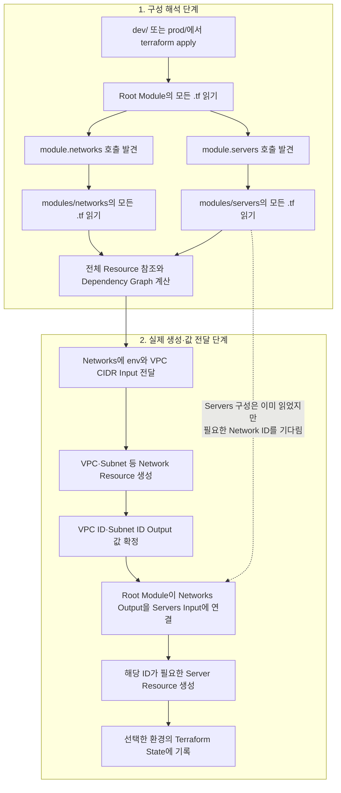
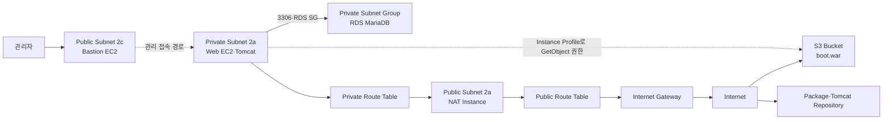
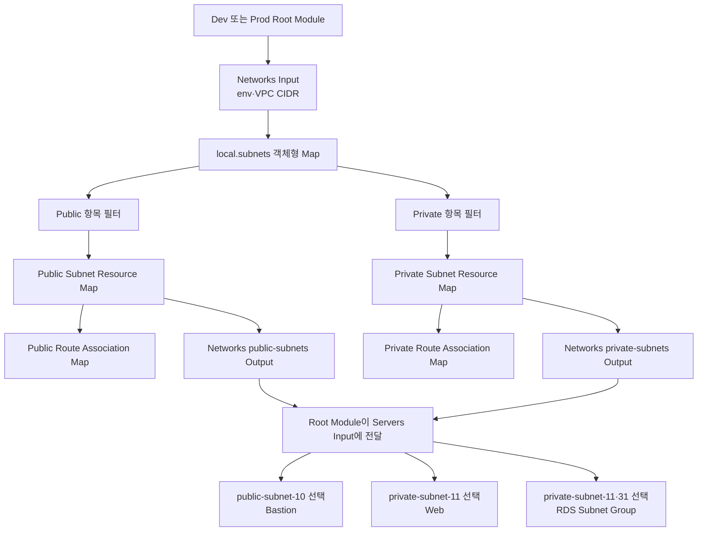
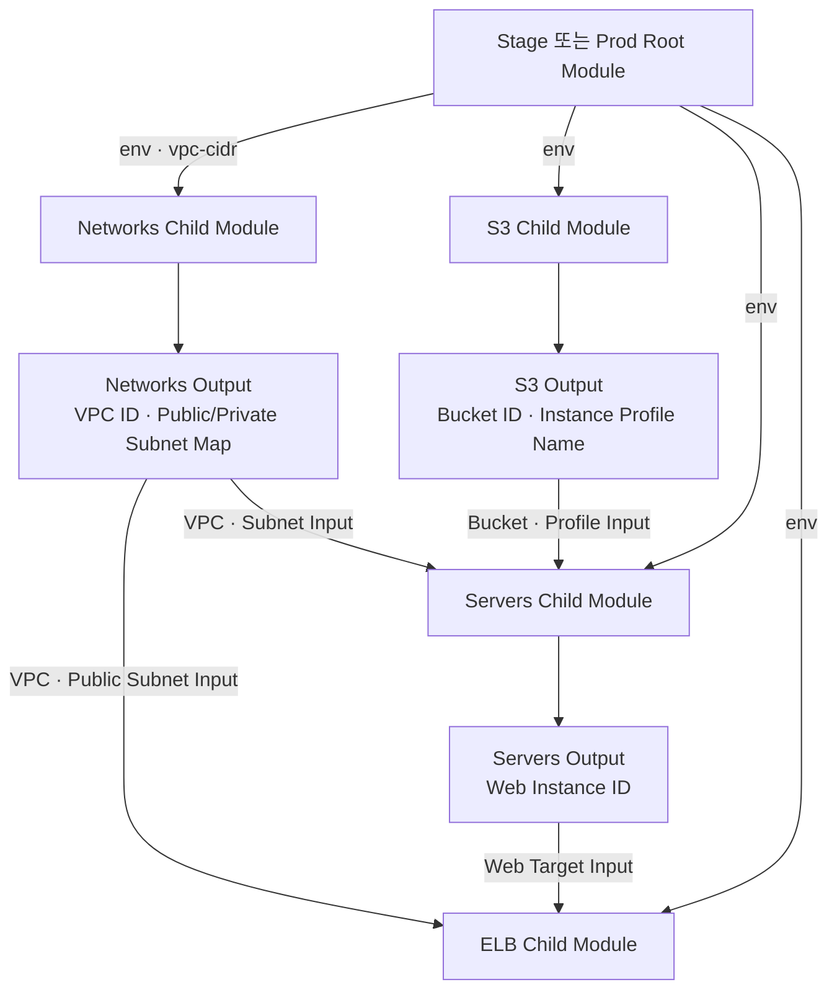
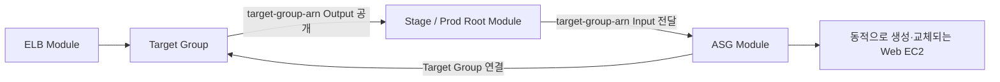
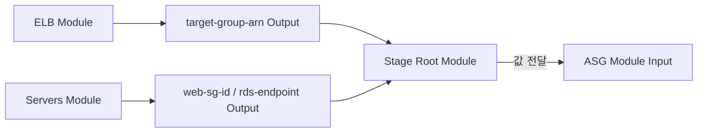
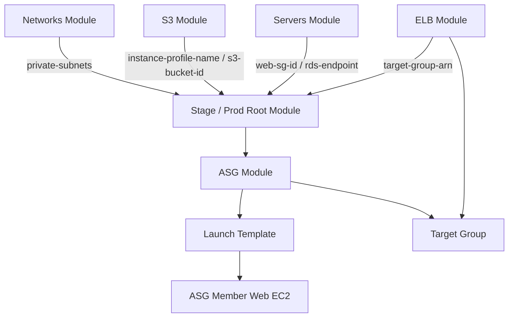

# Terraform Module 종합 구성 실습 v15.0

> **v15.0 부제:** 고정 Web EC2에서 Auto Scaling Group으로 전환

## 목적

이 노트는 v11.0의 Local Module 기본 구조, v12.0의 Networks·Servers 책임 분리, v13.0의 반복 Resource와 Collection 계약, v14.0의 S3·ELB Module 조립을 그대로 계승한다. 이어서 `15_module(asg)`에서 고정 Web EC2와 직접 Target Attachment를 Auto Scaling Group 중심 구조로 전환하는 과정을 Checkpoint 방식으로 누적한다.

이번 단계의 핵심은 다음과 같다.

```text
개별 VPC·Subnet Module 연습
→ 인프라 책임 단위로 Module 확대
→ Networks Module이 네트워크 기반 제공
→ Servers Module이 Compute·DB·Artifact 구성
→ Dev/Prod Root Module이 동일한 Child Module 조립
→ 객체형 Map과 for_each로 Subnet 반복 생성
→ Subnet Resource Map을 Module Output/Input으로 전달
→ Artifact·IAM 책임을 S3 Module로 분리
→ Web Instance ID와 Network Output을 ELB Module에 연결
→ Networks·S3·Servers·ELB 네 Module을 환경별 Root에서 조립
→ ELB가 Target Group ARN을 공개
→ ASG가 Target Group과 Web 실행 정보를 Input으로 수신
→ 고정 Instance ID 연결을 ASG의 동적 등록 구조로 전환
```

> [!note] 누적 문서 읽는 법
> 이 노트는 v12부터 v15까지 각 실습 시점의 코드와 판단을 삭제하지 않고 순서대로 보존한다.
> 앞쪽 Part의 `현재`, `미검증`, `다음 작업`은 해당 버전 또는 Checkpoint 당시 상태이며, v15의 최신 상태와 최종 판정은 [[#70. Checkpoint 8 — Stage Apply와 실제 동작 검증|Checkpoint 8]]을 기준으로 읽는다.

> [!important] 출처 사용 원칙
> 실제 강사 코드와 폴더 구조를 주 근거로 사용한다.
> `Iac.pdf` p.42~52는 Module 재사용, 환경 분리, Input/Output이라는 개념을 보충하는 참고자료로만 사용한다.
> 현재 코드에 없는 S3 Backend, `terraform_remote_state`, Registry 외부 Module은 이번 본문의 구현 사실로 기록하지 않는다.
> v13의 교육 의도는 `12_module_quiz`와 `13_module(loop)`의 정적 차이를 근거로 해석하며, 강사의 직접 발언으로 단정하지 않는다.

> [!note] 검증 범위
> `12_module_quiz.zip`의 Terraform HCL과 Template을 정적으로 분석했다.
> `boot.war`는 파일 존재, 크기, Hash만 확인했으며 내부 애플리케이션 코드는 분석하지 않았다.
> v12는 정적 분석까지만 수행했으며 `fmt`, `init`, `validate`, `plan`, `apply` 결과는 확인하지 않았다.
> `13_module(loop)`는 14번 진행 전 스냅샷이며, v14의 구현 사실은 별도로 제공된 `14_module(s3,elb)_답지`를 기준으로 판정한다.
> v14는 학습자가 작성한 Stage Networks·Servers 연결의 `terraform validate`까지만 확인했고, 강사 답지 전체의 Apply와 AWS 동작은 확인하지 않았다.
> v15는 Stage에서 `fmt`, `init`, `validate`, `plan`, `apply`를 진행했다. 최종적으로 ASG Member 2대의 Private Subnet 분산, Target Group `healthy`, ALB `/boot/index` 응답, RDS·S3 상태를 AWS CLI와 HTTP 요청으로 검증했다.
> Stage Destroy와 잔존 리소스 확인까지 완료했다. Prod Apply, 장애 Member 자동 교체, Scaling Policy 기반 자동 증감은 검증 범위에 포함되지 않았다.

---

## 이전 진도 요약: v11.0

v11에서는 Module의 가장 작은 연결 구조를 확인했다.

```text
Stage/Prod Root Module
├─ VPC Child Module
└─ Subnet Child Module
```

VPC Child Module은 `vpc-id`, `vpc-cidr`를 Output으로 공개하고, Root Module은 이를 Subnet Child Module의 Input으로 전달했다.

```text
VPC Module Output
→ Root Module의 module 참조
→ Subnet Module Input
```

v12에서는 같은 원리를 더 큰 책임 단위에 적용한다.

```text
v11:
VPC와 Subnet을 개별 Module로 분리

v12:
네트워크 전체를 Networks Module로 묶고
서버·DB·배포 구성을 Servers Module로 묶음
```

따라서 v12의 핵심은 Module 문법을 새로 배우는 것이 아니라, **어디까지를 하나의 Module 책임으로 묶을지 판단하고 Root Module에서 조립하는 것**이다.

---

## 빠른 이동

> - [[#Part 1. Module 종합 구성의 목적|Part 1. 종합 구성의 목적]]
> - [[#Part 2. Networks Child Module|Part 2. Networks Module]]
> - [[#Part 3. Servers Child Module|Part 3. Servers Module]]
> - [[#Part 4. Root Module 조립|Part 4. Dev/Prod 조립]]
> - [[#Part 5. 코드 검토와 학습 판정|Part 5. v12 코드 검토]]
> - [[#Part 6. v13.0 Module 내부 반복과 Collection 계약|Part 6. Module + Loop]]
> - [[#Part 7. v14.0 S3·ELB Module 분리와 종합 조립|Part 7. S3 + ELB Module]]
> - [[#Part 8. v15.0 Auto Scaling Module 작성 과정|Part 8. Auto Scaling Module]]
> - [[#5-1. 처음부터 끝까지 보는 전체 작동 흐름|전체 작동 흐름]]
> - [[#19. Networks Output → Servers Input|Module 계약 연결]]
> - [[#23. 전체 Module Dependency Graph|전체 의존성]]
> - [[#26. 현재 코드의 확인 필요 항목|확인 필요 항목]]
> - [[#28. v12.0 완료 판정|v12.0 완료 판정]]
> - [[#41. v13.0 완료 판정|v13.0 완료 판정]]
> - [[#56. v14.0 완료 판정|v14.0 완료 판정]]
> - [[#70. Checkpoint 8 — Stage Apply와 실제 동작 검증|v15.0 실제 검증과 최종 판정]]
> - [[#Appendices|부록]]

---

# Part 1. Module 종합 구성의 목적

## 1. v11 기초에서 v12 종합 구성으로

v11은 Module의 기본 Interface를 학습하는 단계였다.

```text
variable:
외부 입력

resource:
Module 내부 구현

output:
외부 공개 값

module Block:
Child Module 호출
```

v12는 이 기본 문법을 실제 종합 인프라에 적용한다.

```text
Network 관련 Resource 14개
→ modules/networks

Server·DB·Artifact 관련 Resource 12개
→ modules/servers

환경별 값과 Module 연결
→ dev, prod Root Module
```

학습 초점:

```text
Module을 만드는 방법
→ 어떤 책임을 Module로 묶을 것인가
→ Module 사이에 어떤 값만 공개할 것인가
→ 환경별 Root가 공통 구현을 어떻게 조립할 것인가
```

---

## 2. 전체 폴더 구조

```text
12_module_quiz/
├─ dev/
│  └─ main.tf
├─ prod/
│  └─ main.tf
└─ modules/
   ├─ networks/
   │  ├─ main.tf
   │  ├─ variables.tf
   │  ├─ output.tf
   │  └─ nat_install.tpl
   └─ servers/
      ├─ main.tf
      ├─ variables.tf
      ├─ output.tf
      ├─ web_install.tpl
      └─ boot.war
```

역할:

| 경로 | 역할 |
|---|---|
| `dev/` | Dev 환경 Root Module |
| `prod/` | Prod 환경 Root Module |
| `modules/networks/` | 공통 Network Child Module |
| `modules/servers/` | 공통 Server·DB·배포 Child Module |

`dev`와 `prod`에는 AWS Resource가 직접 정의되지 않는다. 실제 Resource 구현은 Child Module 안에 있다.

---

## 3. Root Module과 Composition Root

Terraform에서 Module의 경계는 기본적으로 디렉터리다.

```text
Root Module
= terraform 명령을 직접 실행하는 디렉터리의 구성

Child Module
= Root Module이 module 블록의 source로 호출한 디렉터리의 구성
```

현재 실습에 대응하면 다음과 같다.

| 구분 | 현재 디렉터리 | 판정 근거 |
|---|---|---|
| Dev Root Module | `dev/` | `dev/`에서 `terraform apply` 실행 |
| Prod Root Module | `prod/` | `prod/`에서 `terraform apply` 실행 |
| Networks Child Module | `modules/networks/` | Root의 `module "networks"`가 호출 |
| Servers Child Module | `modules/servers/` | Root의 `module "servers"`가 호출 |

> [!important] `modules/`라는 폴더명 자체가 Child Module을 만드는 것은 아니다
> 별도 디렉터리의 Terraform 구성을 `module` 블록의 `source`로 호출했기 때문에 Child Module이 된다.
> 따라서 현재 질문처럼 **Root Module은 `dev/`와 `prod/`, Child Module은 호출된 `modules/networks/`와 `modules/servers/`**라고 이해하면 맞다.

이번 `dev/main.tf`, `prod/main.tf`는 단순 실행 폴더를 넘어 **조립 계층**의 역할을 한다.

Root Module이 결정하는 것:

```text
- AWS Provider와 Profile
- 환경 이름
- 환경별 VPC CIDR
- 어떤 Child Module을 호출할지
- Networks Output을 Servers Input에 어떻게 연결할지
```

Child Module이 담당하는 것:

```text
- Resource 구현
- 내부 Resource 참조
- 환경 이름을 이용한 Resource Naming
- 외부에 공개할 Output 정의
```

이를 Composition Root 관점으로 표현하면:

```text
dev 또는 prod
│
├─ networks 구현 선택 및 입력 전달
├─ servers 구현 선택 및 입력 전달
└─ 두 Module 사이의 계약 연결
```

> [!note] 용어
> `Composition Root`는 Terraform의 별도 문법이 아니라, 애플리케이션이나 인프라 구성요소를 최상위에서 조립하는 설계 관점이다.
> 현재 Root Module의 역할을 설명하기 위한 해석이다.

---

## 4. Networks와 Servers의 책임 경계

### Networks Module

소유 Resource:

```text
VPC
Public Subnet 2개
Private Subnet 2개
Internet Gateway
Public Route Table
Public Route Table Association 2개
NAT Instance
NAT Security Group
Private Route Table
Private Route Table Association 2개
```

책임:

```text
주소 공간
AZ별 Subnet
Public/Private Routing
Internet Gateway
Private Outbound용 NAT Instance
```

### Servers Module

소유 Resource:

```text
Bastion EC2
Web EC2
Bastion Security Group
Web Security Group
RDS Security Group
RDS DB Instance
DB Subnet Group
S3 Bucket
S3 Object
IAM Role
IAM Inline Policy
IAM Instance Profile
```

책임:

```text
관리 접속
애플리케이션 실행
데이터베이스
Artifact 저장과 전달
EC2의 S3 접근 권한
초기 설치 Script
```

Module 경계는 단순히 AWS 서비스 이름을 나누는 것이 아니라, **함께 생성되고 서로 밀접하게 참조되는 책임 묶음**으로 구성됐다.

---

## 5. Dev와 Prod 환경 재사용

Dev와 Prod는 동일한 Child Module 소스를 호출한다.

```hcl
source = "../modules/networks"
source = "../modules/servers"
```

환경별 차이는 두 값뿐이다.

| 항목 | Dev | Prod |
|---|---|---|
| `env` | `dev` | `prod` |
| VPC CIDR | `192.168.0.0/16` | `10.0.0.0/16` |

그 외 Resource 구조는 같다.

```text
Dev:
dev-vpc
dev-public-subnet-2a
dev-web-instance
dev-1 RDS
dev-boot-bucket-2026

Prod:
prod-vpc
prod-public-subnet-2a
prod-web-instance
prod-1 RDS
prod-boot-bucket-2026
```

즉 환경별 코드를 복사해 별도로 유지하는 것이 아니라:

```text
공통 구현:
modules/networks
modules/servers

환경 차이:
dev/main.tf
prod/main.tf
```

로 분리한다.

---

## 5-1. 처음부터 끝까지 보는 전체 작동 흐름

> [!warning] 코드 기준 예상 흐름
> 아래 내용은 `D:\terraform\workspace\12_module_quiz`의 실제 참조식을 따라 정리한 **설계상 작동 흐름**이다.
> 아직 `terraform plan`·`apply`와 AWS 통신 결과로 검증한 흐름은 아니다.

### 5-1-1. 어느 폴더에서 실행하는지가 환경을 결정한다

이 구성은 `12_module_quiz` 최상위가 아니라 `dev` 또는 `prod`에서 Terraform을 실행한다.

```powershell
cd D:\terraform\workspace\12_module_quiz\dev
terraform init
terraform plan
terraform apply
```

Prod를 만들 때는 실행 디렉터리를 바꾼다.

```powershell
cd D:\terraform\workspace\12_module_quiz\prod
terraform init
terraform plan
terraform apply
```

실행 디렉터리에 따라 선택되는 값은 다음과 같다.

| Root Module | `env` | VPC CIDR | 기본 Local State 위치 |
|---|---|---|---|
| `dev/` | `dev` | `192.168.0.0/16` | `dev/terraform.tfstate` |
| `prod/` | `prod` | `10.0.0.0/16` | `prod/terraform.tfstate` |

따라서 `dev`에서 `apply`한다고 `prod`도 함께 만들어지는 것이 아니다. 두 폴더는 같은 Child Module 소스를 사용하지만 서로 다른 Root Module과 State다.

### 5-1-2. Terraform 구성과 값 전달 흐름



이 그림에서 **`module.servers` 호출 발견**과 **Servers Resource 생성 시작**은 서로 다른 시점이다.

```text
구성 해석 단계:
Terraform이 networks와 servers Module 호출을 모두 발견하고
양쪽 디렉터리의 구성을 미리 읽는다.

실제 생성 단계:
Servers Resource가 VPC·Subnet ID를 필요로 하면
Networks Output 값이 확정될 때까지 기다린 뒤 생성한다.
```

따라서 `module.servers 호출 발견` 자체를 Networks Output 뒤로 옮기는 것은 정확하지 않다. 사용자의 의견처럼 **실제 서버 구축 단계는 Networks Output 뒤에 연결**하는 것이 맞으며, 위 그림은 두 사실을 함께 표현한다.

단계별 의미는 다음과 같다.

1. `prod/`에서 실행하면 `prod/`가 Root Module이 된다.
2. Terraform은 Root Module의 모든 `.tf`를 읽고 `networks`, `servers` 호출을 발견한다.
3. 각 `source`가 가리키는 Child Module 디렉터리의 모든 `.tf`를 읽는다.
4. 파일 이름이나 위아래 순서가 아니라 Resource 참조식을 기준으로 Dependency Graph를 계산한다.
5. Root Module이 환경 이름과 VPC CIDR을 Networks Input으로 전달한다.
6. Networks Module이 VPC와 Subnet 등을 만들면 AWS가 실제 ID를 반환한다.
7. Networks Output이 그 ID를 Module 외부에 공개한다.
8. Root Module이 `module.networks.*` 값을 Servers Input에 연결한다.
9. Servers Module은 전달받은 ID를 사용해 같은 VPC와 Subnet 안에 서버 계층을 구성한다.
10. 두 Child Module의 Resource 주소는 선택한 환경의 State 하나에 함께 기록된다.

#### `.tf` 파일은 순서대로 실행되지 않는다

다음과 같이 동작한다고 이해하면 안 된다.

```text
variables.tf 실행
→ main.tf 실행
→ output.tf 실행
```

같은 디렉터리의 모든 `.tf` 파일은 하나의 Module 구성으로 합쳐진다.

```text
modules/networks/
├─ main.tf
├─ variables.tf
└─ output.tf

          ↓

하나의 Networks Child Module
```

파일명은 사람이 역할을 구분하기 위한 관례다. Terraform은 전체 구성을 읽은 뒤 참조 관계를 기준으로 작업 순서를 정한다.

#### Input → Resource → Output

각 파일의 역할을 간단히 구분하면 다음과 같다.

```text
variables.tf
= Module이 외부에서 무엇을 받을 것인가

main.tf
= 받은 값으로 어떤 Resource 상태를 선언할 것인가

output.tf
= 생성 결과 중 무엇을 Module 외부에 공개할 것인가
```

`prod/main.tf`는 Networks Module에 환경별 값을 전달한다.

```hcl
module "networks" {
  source   = "../modules/networks"
  env      = var.env
  vpc-cidr = "10.0.0.0/16"
}
```

이 값은 `modules/networks/variables.tf`에 선언된 Input으로 들어간다.

```text
prod의 "prod"
→ networks의 var.env

prod의 "10.0.0.0/16"
→ networks의 var.vpc-cidr
```

Networks Module이 AWS Resource를 만들면 다음과 같은 실제 ID가 생긴다.

```text
vpc-0123456789abcdef0
subnet-0123456789abcdef0
subnet-0abcdef1234567890
```

`modules/networks/output.tf`는 이 값들을 Child Module 외부에 공개한다.

```hcl
output "vpc-id" {
  value = aws_vpc.module-vpc.id
}
```

Networks Module 내부 주소와 Root Module에서 사용하는 공개 주소는 다음처럼 구분된다.

```text
Networks 내부 Resource 주소:
aws_vpc.module-vpc.id

Networks가 공개한 Output 주소:
module.networks.vpc-id
```

Root Module은 공개된 값을 Servers Module의 Input으로 전달한다.

```hcl
module "servers" {
  source = "../modules/servers"

  vpc-id               = module.networks.vpc-id
  public-subnet-2c-id  = module.networks.public-subnet-2c-id
  private-subnet-2a-id = module.networks.private-subnet-2a-id
  private-subnet-2c-id = module.networks.private-subnet-2c-id
}
```

#### Output은 단순한 화면 출력이 아니다

Child Module의 Output은 함수의 반환값과 비슷한 **공개 Interface** 역할을 한다.

```text
Networks Resource
aws_vpc.module-vpc.id
        ↓
Networks Output
output "vpc-id"
        ↓
Root Module
module.networks.vpc-id
        ↓
Servers Input
var.vpc-id
        ↓
Servers Resource
Security Group의 vpc_id
```

현재 `networks/output.tf`의 주목적은 값을 화면에 보여주는 것이 아니라 Networks의 생성 결과를 Root가 받아 Servers에 전달할 수 있도록 공개하는 것이다.

반면 최종 사용자가 `terraform apply` 결과나 `terraform output`에서 값을 확인하려면 Root Module에 Output을 다시 선언해야 한다.

```hcl
# prod/output.tf 예시
output "vpc_id" {
  value = module.networks.vpc-id
}
```

현재 `prod/`에는 Root Output이 없으므로 Networks의 Child Output은 주로 Servers에 값을 전달하는 내부 연결에 사용되며, 최종 `Outputs:` 목록에는 표시되지 않는다.

대표적인 값 하나를 끝까지 추적하면 다음과 같다.

```text
aws_subnet.module-private-subnet-2a.id
→ networks/output.tf의 private-subnet-2a-id
→ module.networks.private-subnet-2a-id
→ servers의 var.private-subnet-2a-id
→ Web EC2의 subnet_id
→ RDS DB Subnet Group의 subnet_ids
```

Child Module끼리 직접 대화하는 것이 아니다. **Root Module이 Networks Output과 Servers Input을 연결하는 중간 조립자**다.

### 5-1-3. Terraform이 실제로 계산하는 생성 의존성

개념적으로는 `Networks → Servers`처럼 보이지만, Terraform이 Networks Module 전체를 완성한 뒤 Servers Module 전체를 시작하는 것은 아니다.

```text
VPC
├─ Public/Private Subnet
├─ IGW
├─ NAT Security Group
├─ Bastion/Web/RDS Security Group
└─ S3·IAM처럼 VPC와 직접 무관한 Resource

Public Subnet 2a + NAT SG
└─ NAT Instance
   └─ NAT ENI
      └─ Private Route Table의 0.0.0.0/0 Route

Private Subnet 2a·2c
└─ RDS DB Subnet Group
   + RDS SG
      └─ RDS Instance
         └─ RDS Endpoint
            └─ Web EC2 user_data 렌더링

S3 Bucket
├─ boot.war Object
└─ Web EC2 user_data의 Bucket 이름

IAM Role
└─ Instance Profile
   └─ Web EC2
```

Terraform은 참조식이 없는 독립 분기를 병렬로 처리할 수 있다. 따라서 `.tf` 파일의 위아래 순서나 `module "networks"`가 먼저 적혔다는 사실만으로 생성 순서가 정해지지 않는다.

### 5-1-4. 생성 후 AWS 통신 흐름



통신별 역할:

| 흐름 | 목적 |
|---|---|
| 관리자 → Bastion | Public 관리 진입점 |
| Bastion → Web | Private Web 관리 접속을 의도한 경로 |
| Web → NAT → IGW | `apt`, `wget` 등 외부 Package·Tomcat 다운로드 |
| Web → RDS:3306 | RDS 준비 확인, Schema 생성, Application DB 접속 |
| Web → S3 | IAM Instance Profile로 `boot.war` 다운로드 |

v12 당시 구성에는 S3 VPC Endpoint가 없으므로 S3 요청의 실제 Network 경로도 `Web → NAT → IGW → S3 Public Endpoint`다. IAM Instance Profile은 이 요청의 Network 경로가 아니라 `GetObject` 권한을 제공한다.

v12 당시 코드에는 ALB나 Web EC2의 공인 IP가 없다. 따라서 Internet 사용자가 Web의 8080 포트로 들어오는 서비스 요청 경로는 아직 구성되지 않았다. Bastion은 관리 진입점이고 NAT Instance는 Private Outbound 전용이다.

### 5-1-5. Web EC2 부팅 Script의 시간 흐름

Web EC2가 생성되면 `web_install.tpl`이 다음 순서로 실행된다.

```text
Web EC2 부팅
→ Swap 생성
→ NAT를 통해 apt update·Java·Tomcat 다운로드
→ Tomcat Service 시작
→ RDS Endpoint가 응답할 때까지 반복 대기
→ care Database와 Table 생성
→ IAM Instance Profile 자격으로 S3의 boot.war 다운로드
→ WAR 압축 해제 대기
→ application.properties 수정
→ Tomcat 재시작
```

여기서 Terraform이 보장하는 것과 Script가 기다리는 것을 구분해야 한다.

```text
Terraform 참조로 보장:
- RDS Endpoint 값을 계산한 뒤 Web EC2 user_data 렌더링
- S3 Bucket ID를 계산한 뒤 Web EC2 user_data 렌더링
- IAM Instance Profile 생성 후 Web EC2 연결

부팅 Script가 직접 대기:
- RDS가 실제 접속 가능한 상태가 될 때까지 mysqladmin 반복
- WAR가 압축 해제될 때까지 파일 존재 반복 확인
```

> [!warning] v12 코드에서 보장되지 않는 순서
> `aws_s3_object.module-boot-object`와 Web EC2는 모두 S3 Bucket을 참조하지만 서로를 직접 참조하지 않는다. 따라서 `boot.war` 업로드 완료 전에 Web의 `aws s3 cp`가 실행될 가능성이 있다.
> 또한 Web EC2는 NAT Route Table Association을 직접 참조하지 않으므로, Private Outbound 경로가 완전히 준비되기 전에 `apt update`가 시작될 가능성이 있다.
> 마지막 `application.properties` 수정은 전달받은 `${RDS_ENDPOINT}`가 아니라 기존 RDS 주소를 하드코딩하므로 [[#26. 현재 코드의 확인 필요 항목|확인 필요 항목]]과 함께 봐야 한다.

### 5-1-6. 한 문장으로 압축

> `dev` 또는 `prod` Root Module이 환경값을 선택하고 Networks Module의 VPC·Subnet Output을 Servers Module의 Input으로 연결하면, Terraform이 Resource 참조를 따라 필요한 순서를 계산해 환경별 State에 전체 인프라를 구성하고, 생성된 Web EC2는 NAT로 외부 Package를 받고 S3에서 Application을 내려받아 RDS에 연결한다.

---

# Part 2. Networks Child Module

## 6. Networks Module의 입력 Interface

`modules/networks/variables.tf`:

```hcl
variable "vpc-cidr" {
  type = string
}

variable "env" {
  type = string
}
```

입력 계약:

| 입력 | 역할 |
|---|---|
| `vpc-cidr` | 환경별 VPC 주소 공간 |
| `env` | Resource 이름 Prefix |

Networks Module은 Dev 또는 Prod를 직접 판단하지 않는다. Root Module이 전달한 값만 사용한다.

```text
Dev Root:
vpc-cidr = 192.168.0.0/16
env      = dev

Prod Root:
vpc-cidr = 10.0.0.0/16
env      = prod
```

---

## 7. VPC와 Public/Private Subnet

VPC:

```hcl
resource "aws_vpc" "module-vpc" {
  cidr_block           = var.vpc-cidr
  tags                 = { Name = "${var.env}-vpc" }
  enable_dns_hostnames = true
  enable_dns_support   = true
}
```

Subnet 구성:

| Subnet | `cidrsubnet()` 번호 | AZ | Public IP 자동 할당 |
|---|---:|---|---|
| Public 2a | 10 | `ap-northeast-2a` | 활성 |
| Public 2c | 30 | `ap-northeast-2c` | 활성 |
| Private 2a | 11 | `ap-northeast-2a` | 비활성 |
| Private 2c | 31 | `ap-northeast-2c` | 비활성 |

Dev 기준:

```text
VPC:
192.168.0.0/16

Public 2a:
192.168.10.0/24

Private 2a:
192.168.11.0/24

Public 2c:
192.168.30.0/24

Private 2c:
192.168.31.0/24
```

Prod 기준:

```text
VPC:
10.0.0.0/16

Public 2a:
10.0.10.0/24

Private 2a:
10.0.11.0/24

Public 2c:
10.0.30.0/24

Private 2c:
10.0.31.0/24
```

---

## 8. Internet Gateway와 Public Route

Internet Gateway:

```hcl
resource "aws_internet_gateway" "module-igw" {
  vpc_id = aws_vpc.module-vpc.id
}
```

Public Route Table:

```hcl
route {
  gateway_id = aws_internet_gateway.module-igw.id
  cidr_block = "0.0.0.0/0"
}
```

두 Public Subnet은 동일한 Public Route Table에 연결된다.

```text
Public Subnet 2a ─┐
                  ├─ Public Route Table → Internet Gateway
Public Subnet 2c ─┘
```

Networks Module 내부 참조만으로 다음 의존성이 만들어진다.

```text
VPC
→ Internet Gateway
→ Public Route Table
→ Route Table Association
```

---

## 9. NAT Instance와 Private Route

NAT Instance는 Public Subnet 2a에 생성된다.

```hcl
resource "aws_instance" "module-nat-instance" {
  subnet_id        = aws_subnet.module-public-subnet-2a.id
  source_dest_check = false
  user_data         = templatefile("${path.module}/nat_install.tpl", {})
}
```

`nat_install.tpl`:

```bash
echo "net.ipv4.ip_forward = 1" | sudo tee -a /etc/sysctl.d/99-custom-nat.conf
sudo sysctl -p /etc/sysctl.d/99-custom-nat.conf
IFACE=$(ip route show default | awk '/default/ {print $5}')
sudo iptables -t nat -A POSTROUTING -o $IFACE -j MASQUERADE
```

Private Route Table:

```hcl
route {
  cidr_block           = "0.0.0.0/0"
  network_interface_id = aws_instance.module-nat-instance.primary_network_interface_id
}
```

경로:

```text
Private Subnet 2a ─┐
                   ├─ Private Route Table
Private Subnet 2c ─┘
                          │
                          ▼
                NAT Instance ENI
                          │
                          ▼
                 Public Subnet 2a
                          │
                          ▼
                 Internet Gateway
```

현재 구조에서는 두 AZ의 Private Subnet이 하나의 2a NAT Instance를 공유한다.

---

## 10. Networks Module Output

`modules/networks/output.tf`은 Servers Module에 필요한 Network ID만 공개한다.

```hcl
output "vpc-id" {
  value = aws_vpc.module-vpc.id
}

output "public-subnet-2a-id" {
  value = aws_subnet.module-public-subnet-2a.id
}

output "public-subnet-2c-id" {
  value = aws_subnet.module-public-subnet-2c.id
}

output "private-subnet-2a-id" {
  value = aws_subnet.module-private-subnet-2a.id
}

output "private-subnet-2c-id" {
  value = aws_subnet.module-private-subnet-2c.id
}
```

Output 계약표:

| Output | 소비 위치 |
|---|---|
| `vpc-id` | Servers Module의 Security Group |
| `public-subnet-2a-id` | Servers Input으로 전달되지만 현재 내부에서 미사용 |
| `public-subnet-2c-id` | Bastion EC2 |
| `private-subnet-2a-id` | Web EC2, RDS DB Subnet Group |
| `private-subnet-2c-id` | RDS DB Subnet Group |

Output은 Networks Module 내부 Resource를 외부에 전부 노출하는 것이 아니라, 다음 Module이 실제로 필요로 하는 식별자를 Interface로 공개한다.

---

## 11. Networks Module의 Dependency Graph

```text
aws_vpc.module-vpc
├─ Public Subnet 2a
├─ Public Subnet 2c
├─ Private Subnet 2a
├─ Private Subnet 2c
├─ Internet Gateway
└─ NAT Security Group

Public Subnet 2a
└─ NAT Instance

NAT Security Group
└─ NAT Instance

Internet Gateway
└─ Public Route Table
   ├─ Public Association 2a
   └─ Public Association 2c

NAT Instance Primary ENI
└─ Private Route Table
   ├─ Private Association 2a
   └─ Private Association 2c
```

Networks Module은 외부 Module에 의존하지 않는다. Root에서 받은 `env`, `vpc-cidr`만으로 내부 Graph를 완성한다.

---

# Part 3. Servers Child Module

## 12. Servers Module의 입력 Interface

`modules/servers/variables.tf`:

```text
env
vpc-id
public-subnet-2a-id
public-subnet-2c-id
private-subnet-2a-id
private-subnet-2c-id
```

입력 계약:

| 입력 | 현재 사용 |
|---|---|
| `env` | Resource 이름 |
| `vpc-id` | 모든 Security Group |
| `public-subnet-2a-id` | 현재 내부에서 미사용 |
| `public-subnet-2c-id` | Bastion EC2 |
| `private-subnet-2a-id` | Web EC2, RDS Subnet Group |
| `private-subnet-2c-id` | RDS Subnet Group |

Servers Module은 VPC나 Subnet Resource를 직접 생성하지 않는다.
필요한 Network 식별자를 Input으로 받는다.

---

## 13. Bastion과 Web EC2

### Bastion

```hcl
resource "aws_instance" "module-bastion-instance" {
  subnet_id              = var.public-subnet-2c-id
  vpc_security_group_ids = [aws_security_group.module-bastion-sg.id]
}
```

배치:

```text
Public Subnet 2c
```

역할:

```text
Private 영역 관리 접속의 진입점
```

### Web EC2

```hcl
resource "aws_instance" "module-web-instance" {
  subnet_id              = var.private-subnet-2a-id
  vpc_security_group_ids = [aws_security_group.module-web-sg.id]
  iam_instance_profile   = aws_iam_instance_profile.module-instance-profile.name
}
```

배치:

```text
Private Subnet 2a
```

Web EC2는 다음 Resource에 의존한다.

```text
Web Security Group
IAM Instance Profile
RDS Endpoint
S3 Bucket
web_install.tpl
boot.war Object
```

`user_data`의 Template 입력:

```hcl
TOMCAT_VERSION = "10.1.57"
RDS_ENDPOINT   = aws_db_instance.module-rds-instance.address
DB_PASSWORD    = "mariaPass"
DB_USER        = "admin"
S3_BUCKET      = aws_s3_bucket.module-s3-bucket.id
```

---

## 14. Security Group 연결

### Bastion Security Group

```text
Inbound:
TCP 22
Source 0.0.0.0/0

Outbound:
All
```

### Web Security Group

```text
Inbound:
TCP 8080 from 0.0.0.0/0
TCP 22 from 0.0.0.0/0

Outbound:
All
```

### RDS Security Group

```hcl
ingress {
  from_port       = 3306
  to_port         = 3306
  protocol        = "TCP"
  security_groups = [aws_security_group.module-web-sg.id]
}
```

RDS는 CIDR가 아니라 Web Security Group을 Source로 사용한다.

```text
Web SG가 연결된 ENI
→ TCP 3306
→ RDS
```

이 연결은 Servers Module 내부 Graph로 처리된다.

---

## 15. RDS와 DB Subnet Group

DB Subnet Group:

```hcl
subnet_ids = [
  var.private-subnet-2a-id,
  var.private-subnet-2c-id
]
```

의미:

```text
RDS가 사용할 Subnet 후보를 두 AZ에 제공
```

RDS:

```hcl
resource "aws_db_instance" "module-rds-instance" {
  engine                 = "mariadb"
  engine_version         = "11.8"
  instance_class         = "db.t3.micro"
  db_name                = "care"
  username               = "admin"
  password               = "mariaPass"
  db_subnet_group_name   = aws_db_subnet_group.module-rds-subnet-group.id
  vpc_security_group_ids = [aws_security_group.module-rds-sg.id]
}
```

Resource 이름은 환경별로 분리된다.

```text
Dev:
identifier = dev-1

Prod:
identifier = prod-1
```

현재 `skip_final_snapshot = true`이므로 Destroy 시 최종 Snapshot을 남기지 않는다. 실습 종료를 단순화하기 위한 설정으로 볼 수 있지만 데이터 보존을 요구하는 환경에는 적합하지 않다.

---

## 16. S3 Artifact와 IAM Instance Profile

S3 Bucket:

```hcl
bucket = "${var.env}-boot-bucket-2026"
```

S3 Object:

```hcl
key    = "boot.war"
source = "${path.module}/boot.war"
etag   = filemd5("${path.module}/boot.war")
```

Artifact 흐름:

```text
modules/servers/boot.war
→ Terraform이 S3 Object로 업로드
→ Web EC2의 IAM Role
→ user_data에서 aws s3 cp
→ Tomcat webapps에 배포
```

IAM 흐름:

```text
IAM Role
→ Inline Policy
→ Instance Profile
→ Web EC2
```

현재 Policy:

```hcl
Action   = ["s3:GetObject"]
Resource = "*"
```

학습용으로 단순하지만, Module이 생성한 Bucket Object ARN으로 Scope를 제한할 수 있다.

---

## 17. `templatefile()`과 Web 초기화

`web_install.tpl`의 주요 단계:

```text
1. Swap 2GB 생성
2. Java 17 설치
3. Tomcat 10.1.57 설치
4. systemd Service 등록
5. MariaDB Client 설치
6. RDS 응답 대기
7. care Database와 Table 생성
8. AWS CLI 설치
9. S3에서 boot.war 다운로드
10. Application 압축 해제 대기
11. application.properties 수정
12. Tomcat 재시작
```

Terraform 참조로 형성되는 의존성:

```text
RDS Address
S3 Bucket ID
IAM Instance Profile
→ Web EC2 user_data 생성
→ Web EC2 생성
```

`templatefile()`에 전달된 값:

```text
TOMCAT_VERSION
RDS_ENDPOINT
DB_PASSWORD
DB_USER
S3_BUCKET
```

Template 초반과 DB 초기화는 전달값을 사용한다.

---

## 18. Servers Module의 내부 Dependency Graph

```text
var.vpc-id
├─ Bastion SG
├─ Web SG
└─ RDS SG

var.public-subnet-2c-id
└─ Bastion EC2
   └─ Bastion SG

var.private-subnet-2a-id
├─ Web EC2
└─ RDS DB Subnet Group

var.private-subnet-2c-id
└─ RDS DB Subnet Group

Web SG
└─ RDS SG

RDS DB Subnet Group
RDS SG
└─ RDS Instance
   └─ RDS Endpoint
      └─ Web EC2 user_data

S3 Bucket
└─ S3 Object boot.war

IAM Role
├─ IAM Inline Policy
└─ IAM Instance Profile
   └─ Web EC2
```

Servers Module은 하나의 큰 Module이지만 내부 Resource 참조를 통해 생성 순서를 계산할 수 있다.

---

# Part 4. Root Module 조립

## 19. Networks Output → Servers Input

Dev와 Prod Root Module은 동일한 연결을 사용한다.

```hcl
module "servers" {
  source               = "../modules/servers"
  env                  = var.env
  vpc-id               = module.networks.vpc-id
  public-subnet-2a-id  = module.networks.public-subnet-2a-id
  public-subnet-2c-id  = module.networks.public-subnet-2c-id
  private-subnet-2a-id = module.networks.private-subnet-2a-id
  private-subnet-2c-id = module.networks.private-subnet-2c-id
}
```

이 코드는 Module 계약의 연결 지점이다.

```text
Networks Output 이름
= Root에서 참조하는 이름
= Servers Input에 전달하는 값
```

데이터 흐름:

```text
Networks 내부 Resource
→ Networks Output
→ Root Module
→ Servers Input
→ Servers 내부 Resource
```

Child Module이 서로의 내부 Resource를 직접 참조하지 않는다. Root Module이 명시적으로 연결한다.

---

## 20. Dev Root Module

Dev 입력:

```hcl
variable "env" {
  default = "dev"
}

module "networks" {
  env      = var.env
  vpc-cidr = "192.168.0.0/16"
}
```

Dev Root의 역할:

```text
AWS Provider 선택
환경 이름 dev 지정
VPC CIDR 192.168.0.0/16 지정
Networks Module 호출
Networks Output을 Servers Module에 전달
```

예상 Resource Naming:

```text
dev-vpc
dev-public-subnet-2a
dev-private-subnet-2a
dev-nat-instance
dev-bastion-instance
dev-web-instance
dev-1
```

---

## 21. Prod Root Module

Prod 입력:

```hcl
variable "env" {
  default = "prod"
}

module "networks" {
  env      = var.env
  vpc-cidr = "10.0.0.0/16"
}
```

Prod Root는 Dev와 동일한 Module Graph를 사용하며 입력값만 다르다.

예상 Resource Naming:

```text
prod-vpc
prod-public-subnet-2a
prod-private-subnet-2a
prod-nat-instance
prod-bastion-instance
prod-web-instance
prod-1
```

Dev와 Prod의 코드 차이:

```text
env 기본값
VPC CIDR
```

Module Source와 Module 연결 구조는 동일하다.

---

## 22. Dev와 Prod의 State 경계

`dev`와 `prod`는 서로 다른 Root Module 디렉터리다.

기본 Local Backend라면:

```text
dev/terraform.tfstate
└─ module.networks
└─ module.servers

prod/terraform.tfstate
└─ module.networks
└─ module.servers
```

정리:

```text
Networks와 Servers:
Child Module은 분리됐지만 같은 환경 State에 함께 기록

Dev와 Prod:
Root Module이 다르므로 State도 별도
```

v12 코드에는 S3 Backend가 없다.

```text
현재:
환경별 Local State가 예상됨

PDF 후속 진도:
S3 Backend와 환경별 Key

이번 코드의 직접 관찰:
Remote Backend 미구현
```

---

## 23. 전체 Module Dependency Graph

```text
Dev 또는 Prod Root Module
│
├─ module.networks
│  ├─ VPC
│  ├─ Public/Private Subnet
│  ├─ IGW
│  ├─ NAT Instance
│  └─ Public/Private Route
│
│  Outputs
│  ├─ vpc-id
│  ├─ public-subnet-2a-id
│  ├─ public-subnet-2c-id
│  ├─ private-subnet-2a-id
│  └─ private-subnet-2c-id
│
└─ module.servers
   ├─ Bastion
   ├─ Web EC2
   ├─ Security Groups
   ├─ RDS
   ├─ S3 Artifact
   └─ IAM Role/Profile
```

Root의 Module Input 참조 때문에 다음 순서가 형성된다.

```text
Networks Module의 Output 계산 가능
→ Servers Module Input 확정
→ Servers Module Resource 생성
```

따라서 Module Block의 물리적 작성 순서가 아니라 `module.networks.*` 참조가 의존성을 만든다.

---

# Part 5. 코드 검토와 학습 판정

## 24. 직접 관찰된 구현

### Root Module

```text
[x] Dev와 Prod 분리
[x] 공통 Networks Module 호출
[x] 공통 Servers Module 호출
[x] 환경별 `env`와 VPC CIDR 분리
[x] Networks Output → Servers Input 연결
```

### Networks Module

```text
[x] VPC
[x] Public Subnet 2개
[x] Private Subnet 2개
[x] Internet Gateway
[x] Public Route Table과 Association
[x] NAT Instance
[x] NAT Security Group
[x] Private Route Table과 Association
[x] VPC/Subnet ID Output
```

### Servers Module

```text
[x] Bastion EC2
[x] Web EC2
[x] Bastion/Web/RDS Security Group
[x] RDS DB Instance와 DB Subnet Group
[x] S3 Bucket과 boot.war Object
[x] IAM Role·Policy·Instance Profile
[x] Web 설치 Template
[ ] Servers Output
```

---

## 25. 강사의 교육 의도

> [!note] 교육 흐름 해석
> 아래는 폴더 구조, Resource 소유권, Input/Output 연결을 바탕으로 한 해석이다.
> 강사가 명시한 문장을 그대로 옮긴 것은 아니다.

핵심 의도:

```text
1. 기존 종합 인프라를 Module 구조로 리팩터링
2. 네트워크와 서버 책임을 분리
3. Root Module을 환경별 조립 계층으로 단순화
4. Module 내부 구현을 Dev/Prod가 공유
5. Output과 Input으로 Module 계약 형성
6. 참조를 통해 Module Dependency Graph 구성
```

v11과의 차이:

```text
v11:
Module 문법과 작은 연결 구조를 이해

v12:
실제 서비스 인프라 전체에 Module 경계를 적용
```

PDF p.42 이후의 Stage/Prod 재사용 개념과는 연결되지만, 이번 코드에는 Backend, Remote State, Registry Module이 아직 나타나지 않는다.

---

## 26. 현재 코드의 확인 필요 항목

### 26-1. Web 설정의 RDS Endpoint 하드코딩

Template은 RDS Endpoint를 입력받는다.

```bash
RDS_ENDPOINT="${RDS_ENDPOINT}"
```

DB 준비 대기와 초기화에도 사용한다.

그러나 최종 `application.properties`에는 특정 Endpoint가 하드코딩돼 있다.

```bash
spring.datasource.url=jdbc:mariadb://database-1.cji0a2aaa6bd.ap-northeast-2.rds.amazonaws.com:3306/care
```

현재 Dev/Prod Module이 새로 생성한 RDS를 사용하려는 의도라면 이 값은 불일치할 수 있다.

의도상 연결:

```text
aws_db_instance.module-rds-instance.address
→ RDS_ENDPOINT Template 변수
→ application.properties URL
```

### 26-2. DB Credential 하드코딩

현재 값:

```text
username = admin
password = mariaPass
```

노출 위치:

```text
Terraform Configuration
Terraform State
EC2 user_data
Web 설정 파일
```

교육용 실습 값으로 볼 수 있으나 운영형 설계에서는 Secret Manager, SSM Parameter Store 또는 별도 Sensitive Input 검토가 필요하다.

### 26-3. `servers/output.tf`가 비어 있음

Servers Module은 현재 외부 Output이 없다.

현재 Root나 다른 Module이 Servers 결과를 사용하지 않으므로 실행상 필수는 아니다.

후속 후보:

```text
Bastion Public IP
Web Private IP
RDS Endpoint
S3 Bucket Name
```

### 26-4. 전달되지만 사용되지 않는 Public Subnet 2a ID

Root는 다음 값을 Servers Module에 전달한다.

```hcl
public-subnet-2a-id = module.networks.public-subnet-2a-id
```

그러나 현재 Servers Module 내부에서는 `var.public-subnet-2a-id`를 사용하지 않는다.

```text
Public 2a:
Networks Module의 NAT Instance가 사용

Public 2c:
Servers Module의 Bastion이 사용
```

불필요한 Input인지, 향후 Resource 추가를 위한 준비인지 v12 코드만으로 확정하지 않는다.

### 26-5. 단일 NAT Instance

```text
Private 2a
Private 2c
→ 하나의 2a NAT Instance
```

학습용 단순 구조로는 가능하지만 다음 특성이 있다.

```text
2c Private Subnet의 Cross-AZ 경로
단일 장애 지점
AZ 간 Data Transfer 가능성
```

### 26-6. Security Group 허용 범위

```text
Bastion SSH:
0.0.0.0/0

Web SSH:
0.0.0.0/0

Web 8080:
0.0.0.0/0
```

Module 학습 자체와는 별개지만 운영 환경에서는 Source를 최소화해야 한다.

후속 구조 후보:

```text
Bastion SSH:
관리자 공인 IP/32

Web SSH:
Bastion Security Group

Web 8080:
ALB Security Group 또는 필요한 대역
```

### 26-7. S3 Bucket 이름의 전역 유일성

```hcl
bucket = "${var.env}-boot-bucket-2026"
```

S3 Bucket 이름은 계정 내부가 아니라 전역 Namespace에서 고유해야 한다. 실제 `plan/apply`에서 이름 충돌 여부를 확인해야 한다.

### 26-8. S3 IAM Policy Scope

현재:

```hcl
Action   = ["s3:GetObject"]
Resource = "*"
```

Web EC2가 다운로드할 대상은 Module이 생성한 Bucket의 `boot.war`이므로 Object ARN으로 Scope를 줄일 수 있다.

### 26-9. Template Script의 실행 안정성

현재 `until` Loop는 제한 시간이 없다.

```text
RDS가 계속 준비되지 않음
→ user_data가 계속 대기

Application이 압축 해제되지 않음
→ Loop가 계속 대기
```

실습에서는 Resource 준비를 기다리는 기능이지만 Timeout과 오류 처리를 추가하면 실패 원인을 더 명확히 알 수 있다.

### 26-10. Region·AMI·Key Pair·RDS Version

v12 코드는 AWS Profile에 Region 설정을 의존한다.

또한 다음 값은 대상 계정과 Region에서 실제 사용 가능한지 `plan`으로 확인해야 한다.

```text
AMI ID
Key Pair 이름
MariaDB Engine Version
Default Parameter Group
```

이 항목들은 정적 코드만으로 성공을 확정하지 않는다.

---

## 27. 실행 전 비용과 검증 항목

한 환경을 Apply할 경우 주요 비용 발생 후보:

```text
NAT EC2 1대
Bastion EC2 1대
Web EC2 1대
RDS 1대
EBS Volume
Public IPv4
S3 Storage·Request
Data Transfer
```

Dev와 Prod를 동시에 Apply하면 같은 구조가 각각 생성된다.

실행 순서:

```powershell
cd dev
terraform init
terraform fmt -recursive
terraform validate
terraform plan
```

Plan에서 확인할 내용:

```text
- Resource 총 생성 수
- Dev/Prod Resource Name
- VPC와 Subnet CIDR
- Bastion과 NAT의 Public Subnet 배치
- Web의 Private Subnet 배치
- RDS DB Subnet Group의 두 AZ
- S3 Bucket 이름 충돌
- AMI·Key Pair·RDS Version 유효성
- User Data Template 렌더링
```

실습 종료 후:

```powershell
terraform destroy
```

주의:

```text
Dev와 Prod는 Root Module과 State가 별도이므로
각 환경 디렉터리에서 별도로 Destroy해야 한다.
```

---

## 28. v12.0 완료 판정

### 28-1. Module 설계 이해

```text
[x] Root Module을 환경별 Composition Root로 이해
[x] Networks와 Servers 책임 경계 이해
[x] Input/Output을 Module 계약으로 이해
[x] Module 내부 Resource 소유권 구분
[x] Networks → Servers 의존성 이해
[x] Module 분리와 State 분리의 차이 이해
```

### 28-2. 코드 구조 분석

```text
[x] Dev/Prod Root Module 확인
[x] Networks Module Resource 14개 확인
[x] Networks Output 5개 확인
[x] Servers Module Resource 12개 확인
[x] Servers Input 6개 확인
[x] NAT와 Private Route 연결 확인
[x] RDS·S3·IAM·Web Template 연결 확인
[x] boot.war Artifact 존재 확인
```

### 28-3. 실행 검증

```text
[ ] terraform fmt
[ ] Dev terraform init
[ ] Dev terraform validate
[ ] Dev terraform plan
[ ] Dev terraform apply
[ ] Dev 기능 검증
[ ] Dev terraform destroy
[ ] Prod terraform init
[ ] Prod terraform validate
[ ] Prod terraform plan
[ ] Prod terraform apply
[ ] Prod 기능 검증
[ ] Prod terraform destroy
```

### 28-4. 최종 판정

```text
v12.0은 기존 종합 AWS 인프라를
Networks와 Servers Child Module로 재구성한
Module 종합 퀴즈의 설계 및 정적 분석 단계로 완료했다.

Dev와 Prod Root Module은 같은 Child Module 구현을 재사용하며,
Networks Module의 VPC/Subnet Output을
Servers Module의 Input으로 전달한다.

다만 Terraform CLI와 AWS에서 실행한 결과는 확인하지 않았으므로
실제 인프라 배포 완료로 판정하지 않는다.
```

---

## 29. 한 문단 요약

```text
v12.0에서는 v11에서 배운 Local Module의 Input·Output 연결을 기존 종합 AWS 인프라 전체로 확장하였다. `modules/networks`는 VPC, AZ별 Public/Private Subnet, Internet Gateway, Public/Private Route Table, NAT Instance를 소유하고 VPC와 Subnet ID를 Output으로 공개한다. `modules/servers`는 해당 Output을 Input으로 받아 Bastion, Web EC2, Security Group, RDS, S3 Artifact, IAM Role과 Instance Profile을 구성한다. Dev와 Prod Root Module은 Resource를 직접 구현하지 않고 환경 이름과 VPC CIDR을 전달하며 두 Child Module을 조립하는 Composition Root 역할을 한다. 이 구조를 통해 공통 인프라 구현을 환경별로 재사용하고, Module 내부 구현과 외부 계약, Resource 소유권, 환경별 State 경계를 분리하는 방법을 확인하였다. v12 코드에서는 Web 설정의 RDS Endpoint 하드코딩, DB Credential 노출, 단일 NAT, Security Group 범위, 빈 Servers Output 등의 확인 항목이 남아 있으며 실제 `validate`, `plan`, `apply` 결과는 아직 검증하지 않았다.
```

---

# Part 6. v13.0 Module 내부 반복과 Collection 계약

## 30. v13.0의 목적과 기록 범위

v12에서는 기존 종합 인프라를 다음 책임 단위로 나눴다.

```text
Dev/Prod Root Module
├─ Networks Child Module
└─ Servers Child Module
```

이 구조는 공통 인프라 구현을 환경별로 재사용하게 했지만, Networks Module 안에는 여전히 반복되는 Subnet과 Route Table Association Resource Block이 남아 있었다.

```text
v12가 해결한 반복:
Dev와 Prod가 같은 Networks·Servers 구현을 공유

v13이 추가로 해결하려는 반복:
Networks Module 내부에서 비슷한 Subnet과 Association을 여러 번 작성
```

따라서 v13의 중심 질문은 다음이다.

> Module로 큰 책임 단위를 재사용하면서, Module 내부의 반복 Resource도 객체형 데이터와 `for_each`로 생성하고 그 결과를 다른 Module에 Collection으로 전달할 수 있는가?

> [!warning] v13 기록 상태
> 이 Part는 `D:\terraform\workspace\13_module(loop)`의 수업 스냅샷을 v12와 정적으로 비교해 교육 의도를 추출한 기록이다.
> 현재 14번 진도가 진행 중이므로 v13 코드를 최종 정답이나 운영 가능한 완성본으로 간주하지 않는다.
> `terraform init`, `validate`, `plan`, `apply` 성공은 확인하지 않았다.

---

## 31. v12에서 v13으로 바뀐 핵심

| 항목 | v12 | v13 |
|---|---|---|
| Module 경계 | Networks / Servers | 동일 |
| 환경 경계 | Dev / Prod Root Module | 동일 |
| Subnet 선언 | Subnet마다 Resource Block 작성 | 객체형 Map + `for_each` |
| Public Subnet | 2개 | 2개 |
| Private Subnet | 2개 | 4개 |
| Route Association | 4개 직접 작성 | Subnet Resource Map을 따라 반복 생성 |
| Networks Output | 개별 Subnet ID 4개 | Public/Private Subnet Collection |
| Servers Input | 개별 Subnet ID 4개 | Public/Private Subnet Collection |
| 서버 배치 | 전달받은 ID 직접 사용 | Collection에서 Key로 Subnet 선택 |

변하지 않은 파일은 다음과 같다.

```text
modules/networks/nat_install.tpl
modules/servers/web_install.tpl
modules/servers/boot.war
modules/servers/output.tf
```

즉 Application 설치 로직을 바꾸는 진도가 아니라, **Networks Module의 반복 Resource와 Module Interface를 Collection 중심으로 바꾸는 진도**다.

---

## 32. 객체형 Local Map을 Subnet 원본으로 사용

v13 Networks Module에는 Subnet 구성을 한곳에 모은 `local.subnets`가 추가됐다.

```hcl
locals {
  subnets = {
    public-subnet-10  = { cidr = 10, az = "2a", public = true }
    public-subnet-30  = { cidr = 30, az = "2c", public = true }
    private-subnet-11 = { cidr = 11, az = "2a", public = false }
    private-subnet-12 = { cidr = 12, az = "2a", public = false }
    private-subnet-31 = { cidr = 31, az = "2c", public = false }
    private-subnet-32 = { cidr = 32, az = "2c", public = false }
  }
}
```

각 항목의 Key는 Terraform Resource Instance를 식별하는 이름이 되고, Value는 Subnet 생성에 필요한 속성을 보관한다.

```text
Key:
public-subnet-10

Value:
cidr   = 10
az     = 2a
public = true
```

Dev VPC가 `192.168.0.0/16`이면 `cidrsubnet()` 계산 결과는 다음과 같다.

| Key | 계산값 | 예상 CIDR | AZ |
|---|---:|---|---|
| `public-subnet-10` | `10` | `192.168.10.0/24` | 2a |
| `private-subnet-11` | `11` | `192.168.11.0/24` | 2a |
| `private-subnet-12` | `12` | `192.168.12.0/24` | 2a |
| `public-subnet-30` | `30` | `192.168.30.0/24` | 2c |
| `private-subnet-31` | `31` | `192.168.31.0/24` | 2c |
| `private-subnet-32` | `32` | `192.168.32.0/24` | 2c |

> [!note] `locals`를 사용한 의미
> 현재 Subnet 목록은 Root Module이 환경마다 전달하는 Input이 아니라 Networks Module 내부 구현값으로 고정돼 있다.
> 코드에는 같은 구조를 `variable "subnets"`로 선언하는 대안이 주석으로 남아 있으므로, 내부 고정값인 `locals`와 외부에서 바꿀 수 있는 Input Variable을 비교하려는 흐름으로 해석할 수 있다.
> 이는 코드 배치를 근거로 한 교육 의도 해석이며 강사의 직접 발언은 아니다.

---

## 33. `for` 표현식과 `for_each`로 Subnet 반복 생성

Public Subnet은 전체 Map에서 Public Key만 추출해 생성한다.

```hcl
resource "aws_subnet" "module-public-subnets" {
  for_each = {
    for key, value in local.subnets :
    key => value if startswith(key, "public") == true
  }

  vpc_id                  = aws_vpc.module-vpc.id
  cidr_block              = cidrsubnet(var.vpc-cidr, 8, each.value.cidr)
  tags                    = { Name = "${var.env}-public-subnet-${each.value.az}" }
  availability_zone       = "ap-northeast-${each.value.az}"
  map_public_ip_on_launch = each.value.public
}
```

Private Subnet도 같은 원리로 생성한다.

```hcl
resource "aws_subnet" "module-private-subnets" {
  for_each = {
    for key, value in local.subnets :
    key => value if startswith(key, "private") == true
  }

  vpc_id            = aws_vpc.module-vpc.id
  cidr_block        = cidrsubnet(var.vpc-cidr, 8, each.value.cidr)
  tags              = { Name = "${var.env}-private-subnet-${each.value.az}" }
  availability_zone = "ap-northeast-${each.value.az}"
}
```

생성되는 Resource Instance 주소에는 Map Key가 남는다.

```text
aws_subnet.module-public-subnets["public-subnet-10"]
aws_subnet.module-public-subnets["public-subnet-30"]

aws_subnet.module-private-subnets["private-subnet-11"]
aws_subnet.module-private-subnets["private-subnet-12"]
aws_subnet.module-private-subnets["private-subnet-31"]
aws_subnet.module-private-subnets["private-subnet-32"]
```

v12의 Resource Label은 AZ별로 고정돼 있었다.

```text
aws_subnet.module-public-subnet-2a
aws_subnet.module-private-subnet-2c
```

v13에서는 반복 Resource 하나와 Key 조합이 각 Subnet의 정체성이 된다.

```text
Resource Label:
module-private-subnets

Instance Key:
private-subnet-31
```

---

## 34. Subnet Resource Map을 Route Association에 연결

v13의 중요한 변화는 Subnet만 반복 생성하는 데서 끝나지 않는다는 점이다.

```hcl
resource "aws_route_table_association" "module-public-rt" {
  for_each = aws_subnet.module-public-subnets

  route_table_id = aws_route_table.module-public-rt.id
  subnet_id      = aws_subnet.module-public-subnets[each.key].id
}
```

`aws_subnet.module-public-subnets` 자체가 Key를 가진 Resource Map이므로 Route Association의 `for_each` 입력으로 다시 사용할 수 있다.

```text
Public Subnet Key
public-subnet-10
        ↓
같은 Key의 Public Route Association
module-public-rt["public-subnet-10"]
```

Private Subnet도 같은 구조를 의도한다.

```text
Private Subnet Map
→ 같은 Key의 Private Route Association Map
```

이 연결의 장점은 Subnet 목록이 늘거나 줄 때 Association 개수도 함께 변한다는 것이다.

```text
local.subnets에 Private 항목 추가
→ Private Subnet Instance 추가
→ 같은 Key의 Private Association 추가
```

이를 이 노트에서는 **Key를 유지하는 `for_each` 연결**로 정리한다.

---

## 35. 개별 ID Output에서 Collection Output으로

v12는 Subnet ID를 하나씩 공개했다.

```hcl
output "public-subnet-2a-id" {
  value = aws_subnet.module-public-subnet-2a.id
}

output "private-subnet-2c-id" {
  value = aws_subnet.module-private-subnet-2c.id
}
```

이 방식은 읽기 쉽지만 Subnet이 늘어날 때마다 Output과 Servers Input도 추가해야 한다.

```text
Subnet 추가
→ Networks Output 추가
→ Root Module 연결 추가
→ Servers Variable 추가
```

v13은 Public과 Private Resource Map을 각각 하나의 Output으로 공개한다.

```hcl
output "public-subnets" {
  value = aws_subnet.module-public-subnets
}

output "priavate-subnets" {
  value = aws_subnet.module-private-subnets
}
```

Root Module은 이 Collection을 Servers Module에 전달한다.

```hcl
module "servers" {
  source = "../modules/servers"

  env             = var.env
  vpc-id          = module.networks.vpc-id
  public-subnets  = module.networks.public-subnets
  private-subnets = module.networks.priavate-subnets
}
```

Module Output은 문자열 하나만 반환하는 장치가 아니다.

```text
string
number
list
map
object
Resource Instance로 구성된 Map
```

같은 구조화된 값도 Module Interface를 통과할 수 있다.

---

## 36. Servers Module이 Key로 배치 위치 선택

Servers Module은 전달받은 Collection에서 필요한 Subnet을 Key로 선택한다.

```hcl
# Bastion
subnet_id = var.public-subnets["public-subnet-10"].id

# Web
subnet_id = var.private-subnets["private-subnet-11"].id
```

RDS DB Subnet Group도 서로 다른 AZ의 Key를 선택한다.

```hcl
subnet_ids = [
  var.private-subnets["private-subnet-11"].id,
  var.private-subnets["private-subnet-31"].id
]
```

데이터 전달 흐름은 다음과 같다.

```text
Networks 내부 Subnet Resource Map
→ Networks Output
→ Dev/Prod Root Module
→ Servers Input
→ Servers가 Key로 필요한 Subnet 선택
```

v12에서는 Root Module이 배치 대상 ID를 하나씩 정해 전달했다.

```text
private-subnet-2a-id
private-subnet-2c-id
```

v13에서는 Root Module이 Subnet Collection을 전달하고 Servers Module이 Key를 선택한다.

```text
private-subnets
└─ Servers가 private-subnet-11, private-subnet-31 선택
```

즉 Module 계약의 크기는 줄었지만, 어느 Subnet Key가 어떤 역할인지에 대한 약속은 Servers Module 안으로 이동했다.

---

## 37. v13 전체 작동 흐름



작동 흐름을 한 줄로 압축하면 다음과 같다.

> Root Module이 환경값을 Networks Module에 전달하고, Networks Module이 객체형 Map과 `for_each`로 Subnet Collection을 만든 뒤 이를 Output으로 공개하면, Root Module이 Collection을 Servers Module에 전달하고 Servers Module은 Key로 배치할 Subnet을 선택한다.

---

## 38. v13의 교육 의도

> [!note] 교육 흐름 해석
> 아래 내용은 v12와 v13의 파일·Resource·Output 차이를 근거로 한 해석이다.
> 강사가 명시한 문장을 그대로 옮긴 것이 아니다.

### 38-1. Module과 반복문은 함께 사용한다

```text
Module:
큰 책임 단위와 재사용 경계를 정의

for_each:
그 Module 내부의 반복 Resource를 데이터 기반으로 생성
```

Module을 만들었다고 내부 Resource 중복이 자동으로 사라지는 것은 아니다. v13은 v12의 Module 경계를 유지하면서 Networks Module 내부 반복을 다시 제거한다.

### 38-2. Resource를 코드가 아니라 데이터에서 파생한다

v12:

```text
Subnet 하나
= Resource Block 하나
```

v13:

```text
Subnet 하나
= local.subnets의 항목 하나
```

Resource 개수와 속성을 코드 블록 복사보다 데이터 구조로 관리하는 방향으로 이동했다.

### 38-3. 하나의 원본에서 관련 Resource를 연결한다

```text
local.subnets
├─ Public/Private Subnet
├─ Route Table Association
├─ Networks Output
└─ Servers 배치 대상
```

동일한 Key가 생성과 연결, 참조에 계속 사용된다.

### 38-4. Module 계약도 Collection으로 확장한다

```text
v12:
ID 4개를 각각 전달

v13:
Public Map 1개
Private Map 1개 전달
```

Subnet 수가 늘어날 때 Root Module의 연결문과 Servers Variable을 매번 늘리지 않는 구조를 경험한다.

### 38-5. 이전 진도와의 연결

```text
v9:
하나의 Root Module 안에서 .tf 파일 역할 분리

v10:
객체형 Map, for_each, 조건 필터

v11:
작은 Local Child Module과 Input/Output

v12:
Networks·Servers 책임 Module과 Dev/Prod 재사용

v13:
Module 내부 반복 제거와 Collection Output/Input 결합
```

---

## 39. v13에서 직접 확인된 변화와 그대로인 부분

### 39-1. 직접 확인된 변화

```text
[x] Subnet Resource 4개 직접 선언을 반복 Resource 2개로 전환
[x] 객체형 `local.subnets` 추가
[x] `for` 표현식과 조건 필터 사용
[x] Public Subnet 2개 반복 생성
[x] Private Subnet 4개 반복 생성
[x] Route Association을 Subnet Resource Map에 연결
[x] 개별 Subnet ID Output을 Collection Output으로 전환
[x] Root → Servers 전달값을 개별 ID에서 Collection으로 전환
[x] Servers가 Key로 Subnet 선택
```

### 39-2. 그대로인 부분

```text
[x] Dev/Prod Root Module 분리
[x] Networks/Servers 책임 경계
[x] 환경별 env와 VPC CIDR
[x] NAT 설치 Template
[x] Web 설치 Template
[x] boot.war Artifact
[x] Bastion·Web·RDS·S3·IAM Resource 종류
[x] 환경별 Local State 경계
```

---

## 40. 현재 수업 스냅샷의 주의점

이 절은 v13의 교육 의도와 현재 코드의 완성도를 분리하기 위한 기록이다.

### 40-1. 실행을 막는 참조 오타

현재 Private Route Association에는 다음 참조가 있다.

```hcl
subnet_id = aaws_subnet.module-private-subnets[each.key].id
```

의도상 다음 참조로 보인다.

```hcl
subnet_id = aws_subnet.module-private-subnets[each.key].id
```

v13 제공 스냅샷 상태에서는 초기화 후 `validate` 또는 `plan`에서 선언되지 않은 Resource Type 참조 오류가 예상된다.

### 40-2. Output 이름 오타

현재 이름:

```hcl
output "priavate-subnets"
```

Root Module도 같은 철자로 참조하므로 양쪽 계약은 일치하지만, 공개 Interface 이름으로 고착되기 전에 `private-subnets`로 정리할 필요가 있다.

### 40-3. Bastion 배치 위치 변경

```text
v12:
Bastion → Public Subnet 2c

v13:
Bastion → public-subnet-10 → 2a
```

반복문 변환 과정에서 선택 Key가 바뀐 것인지 의도적인 아키텍처 변경인지는 코드만으로 확정할 수 없다.

### 40-4. 추가 Private Subnet의 현재 사용 상태

생성 대상:

```text
private-subnet-11
private-subnet-12
private-subnet-31
private-subnet-32
```

현재 Servers가 선택하는 대상:

```text
Web:
private-subnet-11

RDS DB Subnet Group:
private-subnet-11
private-subnet-31
```

`private-subnet-12`, `private-subnet-32`는 Route Table에는 연결되지만 현재 Workload 배치에는 사용되지 않는다. Web/DB 계층 분리를 위한 후속 자리인지 반복 생성 연습용인지 확정하지 않는다.

### 40-5. 같은 AZ의 Name Tag 중복

현재 Name Tag는 AZ만 포함한다.

```hcl
Name = "${var.env}-private-subnet-${each.value.az}"
```

따라서 같은 AZ의 두 Private Subnet은 동일한 Name Tag를 가진다.

```text
private-subnet-11 → dev-private-subnet-2a
private-subnet-12 → dev-private-subnet-2a
```

Terraform State Key는 다르지만 AWS Console에서는 구분하기 어렵다.

### 40-6. Key Prefix와 `public` 속성의 이중 판정

Public/Private 분류는 Key Prefix로 한다.

```hcl
if startswith(key, "public")
```

동시에 객체에는 다음 속성도 있다.

```hcl
public = true
```

두 값이 불일치해도 Terraform이 자동으로 검증하지 않는다. 교육 과정에서는 Key 필터와 객체 속성을 모두 경험하기 위한 구성으로 볼 수 있지만, 안정적인 데이터 모델에서는 판정 기준을 하나로 통일하는 편이 명확하다.

### 40-7. Resource Map 전체와 `type = any`

현재 Networks는 Subnet Resource Map 전체를 공개하고 Servers는 `type = any`로 받는다.

```hcl
variable "private-subnets" {
  type = any
}
```

Collection 전달을 관찰하기에는 단순하지만 다음 한계가 있다.

```text
Servers가 Networks 내부 Resource 구조에 결합
Input 구조 검증이 약함
필요한 ID 외 속성도 함께 전달
```

운영형 Module 계약 후보는 Key별 ID만 공개하는 `map(string)`이다.

```hcl
output "private-subnet-ids" {
  value = {
    for key, subnet in aws_subnet.module-private-subnets :
    key => subnet.id
  }
}
```

> [!important] 판정
> 위 항목은 v13의 핵심 학습 의도인 Module + Loop + Collection 전달을 무효화하지 않는다.
> 다만 현재 수업 스냅샷을 실행 검증된 최종 코드로 기록하지 않아야 하는 근거다.

---

## 41. v13.0 완료 판정

### 41-1. 학습 의도 이해

```text
[x] Module과 for_each의 역할 차이 설명
[x] 객체형 Map을 Resource 원본으로 사용하는 이유 설명
[x] Key 기반 Resource Instance 주소 설명
[x] Subnet Resource Map → Association Map 연결 설명
[x] Collection Output → Root → Servers Input 흐름 설명
[x] Servers가 Key로 배치 위치를 선택하는 구조 설명
```

### 41-2. 정적 코드 비교

```text
[x] 12_module_quiz와 13_module(loop) 파일 목록 비교
[x] 변경 파일과 동일 파일 구분
[x] Root Module 계약 변경 확인
[x] Networks Resource 반복 구조 확인
[x] Servers Subnet 참조 변경 확인
[x] Template과 boot.war 동일성 확인
```

### 41-3. 실행 및 검증 상태

```text
[ ] terraform fmt 통과
[ ] terraform init
[ ] terraform validate
[ ] terraform plan
[ ] terraform apply
[ ] AWS Console Resource 확인
[ ] 전체 통신 검증
[ ] terraform destroy
```

현재 `terraform fmt -check -recursive`는 Formatting 대상 파일을 반환했다. `terraform validate`는 Module이 초기화되지 않아 `Module not installed` 단계에서 중단됐다.

### 41-4. 최종 판정

```text
교육 의도 분석:
완료

v12 → v13 정적 차이 분석:
완료

현재 코드 실행 가능 판정:
미완료

실제 AWS 배포 검증:
미수행
```

> v13은 Module 책임 분리 위에 객체형 Map, `for_each`, 조건 필터, Key 기반 연결, Collection Output/Input을 결합하는 단계로 이해할 수 있다. 현재 수업 스냅샷에는 실행 오타와 미확정 배치가 남아 있으므로, 이 노트는 학습 의도와 구조 이해를 완료한 누적본이며 실행 완료 기록은 아니다.

---

## 42. v13.0 한 문단 요약

v13.0에서는 v12의 Dev/Prod Root Module과 Networks/Servers Child Module 구조를 유지하면서 Networks Module 내부의 반복 Subnet과 Route Table Association을 객체형 `local.subnets`와 `for_each`로 전환하였다. Subnet은 Key를 가진 Resource Map으로 생성되고, 같은 Key를 이용해 Route Association이 연결된다. Networks Module은 개별 Subnet ID 대신 Public/Private Subnet Collection을 Output으로 공개하고, Root Module은 이를 Servers Module의 Input으로 전달한다. Servers Module은 Collection에서 `public-subnet-10`, `private-subnet-11`, `private-subnet-31` 같은 Key를 선택해 Bastion, Web, RDS의 배치 위치를 결정한다. 이로써 Module은 큰 책임과 환경별 재사용을 담당하고, 반복문은 Module 내부의 유사 Resource를 데이터 기반으로 확장하며, Output/Input은 구조화된 결과를 Module 경계 너머로 전달한다는 연결을 확인하였다. 다만 현재 스냅샷에는 참조·이름 오타, 미사용 Subnet, Name Tag 중복, `type = any` 계약 등의 확인 사항이 남아 있고 실제 `validate`, `plan`, `apply`는 완료되지 않았다.

---

# Part 7. v14.0 S3·ELB Module 분리와 종합 조립

## 43. v14.0의 목적과 기록 범위

v13은 Networks와 Servers라는 두 책임 경계 안에서 Subnet 반복 생성과 Collection 전달을 다뤘다. v14는 기존 Servers Module에 함께 들어 있던 Artifact 저장소와 EC2 접근 권한을 S3 Module로 분리하고, 외부 요청을 Web EC2로 전달하는 ELB Module을 추가한다.

```text
v13:
Root
├─ Networks
└─ Servers

v14:
Root
├─ Networks
├─ S3
├─ Servers
└─ ELB
```

이번 Part의 근거와 검증 범위는 다음과 같다.

| 구분 | 상태 |
|---|---|
| 14번 최초 제공 ZIP 구조 확인 | 완료 |
| 학습자가 작성한 Stage Networks·Servers 연결 | `terraform validate` 통과 |
| 강사 답지 파일·Resource·참조식 정적 분석 | 완료 |
| 강사 답지 전체 `terraform validate` | 미수행 |
| `terraform plan` / `apply` | 미수행 |
| ALB·ACM·Route 53·애플리케이션 실제 동작 | 미검증 |

따라서 이 Part는 **강사 답지 기반의 설계·작동 흐름 분석 기록**이며, 실제 AWS 배포 완료 기록이 아니다.

---

## 44. 최초 제공 코드에서 답지로 바뀐 구조

최초 ZIP에는 Networks와 Servers Module의 Resource 구현이 대부분 들어 있었지만, Stage와 Prod Root Module은 Provider와 `env`만 가진 골격이었다.

```text
최초 제공본
├─ stage/main.tf       # Module 호출 없음
├─ prod/main.tf        # Module 호출 없음
└─ modules/
   ├─ networks/        # VPC·Subnet·Routing·NAT 구현
   └─ servers/         # EC2·RDS·S3·IAM 구현
```

답지는 다음처럼 책임을 네 Module로 재편한다.

```text
답지
├─ stage/main.tf
├─ prod/main.tf
└─ modules/
   ├─ networks/
   ├─ s3/
   ├─ servers/
   └─ elb/
```

핵심 변화는 Resource를 새로 만드는 것만이 아니다.

1. Servers 내부의 S3·IAM Resource를 S3 Module로 이동한다.
2. S3 Module의 결과를 Output으로 공개한다.
3. Root Module이 해당 Output을 Servers Input에 전달한다.
4. Servers가 Web Instance ID를 Output으로 공개한다.
5. Root Module이 Networks와 Servers의 Output을 ELB Input에 전달한다.

즉 v14의 주제는 **기능 책임 재분배와 Module 계약 확장**이다.

---

## 45. Servers에서 S3·IAM 책임 분리

v13까지 Servers Module은 다음을 모두 소유했다.

```text
Servers
├─ Bastion EC2
├─ Web EC2
├─ Security Group
├─ RDS
├─ S3 Bucket와 boot.war
└─ EC2용 IAM Role·Policy·Instance Profile
```

v14 답지는 아래 다섯 Resource를 `modules/s3/main.tf`로 이동한다.

| Resource | 역할 |
|---|---|
| `aws_s3_bucket.module-s3-bucket` | 애플리케이션 Artifact Bucket |
| `aws_s3_object.module-boot-object` | `boot.war` 업로드 |
| `aws_iam_role.module-s3-role` | EC2가 Assume할 Role |
| `aws_iam_role_policy.module-s3-role-policy` | S3 객체 읽기 권한 |
| `aws_iam_instance_profile.module-instance-profile` | Role을 EC2에 연결하는 Profile |

이 Module은 이름은 `s3`지만 실제 책임은 다음 묶음에 가깝다.

> **Web EC2가 S3에서 애플리케이션 Artifact를 내려받을 수 있도록 저장소와 접근 권한을 함께 제공한다.**

IAM Resource가 S3 Module에 들어간 이유도 이 기능 흐름에 함께 필요하기 때문이다. AWS Resource 종류별 분류보다 **함께 제공되는 기능 단위**를 Module 경계로 삼은 것이다.

---

## 46. S3 Child Module의 Input·Resource·Output

S3 Module이 Root에서 받는 값은 환경 이름 하나다.

```hcl
variable "env" {
  type = string
}
```

`env`는 Bucket, IAM Role, Instance Profile 이름을 Stage와 Prod별로 구분하는 데 사용한다.

```text
Input
└─ env
      ↓
Resource
├─ S3 Bucket
├─ boot.war Object
├─ IAM Role·Policy
└─ Instance Profile
      ↓
Output
├─ s3-bucket-id
└─ instance-profile-name
```

S3 Module은 다음 두 값을 외부 Interface로 공개한다.

```hcl
output "instance-profile-name" {
  value = aws_iam_instance_profile.module-instance-profile.name
}

output "s3-bucket-id" {
  value = aws_s3_bucket.module-s3-bucket.id
}
```

여기서 Output은 화면에 출력하기 위한 장식이 아니다. Servers Module이 더 이상 S3 Module 내부 Resource 주소를 직접 참조할 수 없으므로, Root가 사용할 수 있도록 필요한 결과를 공개하는 계약이다.

> [!important] `path.module`과 Artifact 위치
> `aws_s3_object`의 `source = "${path.module}/boot.war"`는 해당 Resource가 들어 있는 S3 Module 디렉터리를 기준으로 평가된다.
> 따라서 답지는 `modules/s3/boot.war`를 별도로 둔다.

---

## 47. S3 Output을 Servers Input으로 전달

S3 책임을 분리하면 Servers 내부의 직접 참조 두 곳이 끊어진다.

```text
Web EC2가 필요한 값:
├─ iam_instance_profile
└─ user_data의 S3_BUCKET
```

답지는 Servers Module에 다음 Input을 추가한다.

```hcl
variable "instance-profile-name" {
  type = string
}

variable "s3-bucket-id" {
  type = string
}
```

Servers 구현은 내부 S3 Resource 주소 대신 Input Variable을 사용한다.

```hcl
iam_instance_profile = var.instance-profile-name
```

```hcl
S3_BUCKET = var.s3-bucket-id
```

Root Module에서 실제 연결이 완성된다.

```text
module.s3.instance-profile-name
→ module.servers의 instance-profile-name

module.s3.s3-bucket-id
→ module.servers의 s3-bucket-id
```

정확한 표현은 다음과 같다.

> S3 Module이 값을 Output으로 **공개**하고, Root Module이 그 Output을 **참조해 Servers Input으로 전달**하며, Servers Module이 Variable로 **수신해 사용**한다.

---

## 48. Servers가 Web Instance ID를 공개하는 이유

v13의 `servers/output.tf`는 비어 있었지만, v14 답지는 Web EC2 ID를 공개한다.

```hcl
output "web-instance-id" {
  value = aws_instance.module-web-instance.id
}
```

Servers 내부에서 Web EC2를 만드는 것만으로는 ELB Module이 해당 EC2를 Target Group에 등록할 수 없다. 별도 Child Module인 ELB는 Servers 내부 Resource 주소를 직접 참조할 수 없기 때문이다.

```text
Servers 내부 Resource
aws_instance.module-web-instance.id
        ↓ Output 공개
module.servers.web-instance-id
        ↓ Root가 ELB Input으로 전달
var.web-instance-id
        ↓
aws_lb_target_group_attachment.target_id
```

이 Output은 단순 조회값이 아니라 **Servers와 ELB 사이의 연결 계약**이다.

---

## 49. ELB Child Module의 책임

답지의 `modules/elb`는 단순 Load Balancer 하나보다 넓은 외부 진입 경로를 담당한다.

| 구성요소 | 역할 |
|---|---|
| ALB Security Group | 외부 HTTP·HTTPS 허용 |
| Application Load Balancer | Public Subnet 두 곳에 배치 |
| Target Group | Web의 8080 포트와 Health Check 관리 |
| HTTP Listener | HTTPS로 Redirect |
| HTTPS Listener | ACM 인증서로 TLS 종료 후 Target Group 전달 |
| Target Group Attachment | Web EC2를 Target으로 등록 |
| Route 53 Record | 환경별 Domain을 ALB Alias로 연결 |

ELB Module의 Input 계약은 다음과 같다.

```text
env
vpc-id
public-subnets
web-instance-id
```

각 Input의 출처는 서로 다르다.

| ELB Input | 출처 |
|---|---|
| `env` | Stage/Prod Root Variable |
| `vpc-id` | Networks Output |
| `public-subnets` | Networks Output |
| `web-instance-id` | Servers Output |

---

## 50. Public Subnet Map을 ELB가 사용하는 방식

v13 Networks Module은 Public Subnet을 Resource Map으로 공개한다.

```text
public-subnets
├─ public-subnet-10 → Subnet Resource
└─ public-subnet-30 → Subnet Resource
```

답지는 Root에서 ID List로 변환하지 않고 Resource Map 전체를 ELB Input으로 전달한다. ELB 내부에서 필요한 Key를 직접 선택한다.

```hcl
subnets = [
  var.public-subnets["public-subnet-10"].id,
  var.public-subnets["public-subnet-30"].id
]
```

다음과 같은 `for` 표현식도 기술적으로 가능한 대안이다.

```hcl
[for subnet in var.public-subnets : subnet.id]
```

그러나 **이번 강사 답지의 구현 사실은 Key 두 개를 명시적으로 선택하는 방식**이다. 대안 문법과 답지 구현을 섞어 기록하지 않는다.

---

## 51. Stage와 Prod Composition Root

Stage와 Prod Root Module은 Resource를 직접 구현하지 않고 네 Child Module을 호출하고 연결한다.

```text
stage/
└─ main.tf
   ├─ module.networks
   ├─ module.s3
   ├─ module.servers
   └─ module.elb

prod/
└─ main.tf
   ├─ module.networks
   ├─ module.s3
   ├─ module.servers
   └─ module.elb
```

답지에서 환경별 주요 차이는 다음과 같다.

| 항목 | Stage | Prod |
|---|---|---|
| `env` | `stage` | `prod` |
| VPC CIDR | `10.0.0.0/16` | `192.168.0.0/16` |
| Route 53 이름 | 환경 접두사 Domain | `www` Domain |
| Child Module 구현 | 공통 | 공통 |

Root Module은 환경별 값을 결정하고 공통 Child Module을 조립하는 **Composition Root**다.

---

## 52. v14 전체 데이터 흐름



작동 과정은 다음과 같다.

1. `terraform`을 실행한 Stage 또는 Prod 디렉터리가 Root Module이 된다.
2. Terraform은 Root와 네 Child Module의 `.tf` 파일을 모두 읽어 하나의 Configuration Graph를 구성한다.
3. Networks는 VPC와 Subnet을 만들고 필요한 값을 Output으로 공개한다.
4. S3는 Artifact Bucket과 Instance Profile을 만들고 결과를 Output으로 공개한다.
5. Servers는 Networks와 S3의 결과가 결정된 뒤 EC2·RDS를 구성한다.
6. Servers가 Web Instance ID를 공개하면 ELB가 해당 EC2를 Target Group에 등록한다.
7. ELB는 Public Subnet, ACM Certificate, Route 53 Zone을 사용해 외부 진입 경로를 구성한다.

`main.tf`에 Module Block이 적힌 순서는 생성 순서를 의미하지 않는다. Terraform은 참조식을 이용해 의존성을 계산한다.

---

## 53. Dependency Graph와 생성 순서

답지의 핵심 의존 관계를 단순화하면 다음과 같다.

```text
Networks ───────────────┐
                       ├─→ Servers ─→ Web Instance Output ─→ ELB
S3 ────────────────────┘

Networks ───────────────────────────────────────────────→ ELB
```

따라서 가능한 실행 흐름은 다음과 같다.

```text
Networks와 S3:
직접 의존 관계가 없으므로 병렬 진행 가능

Servers:
Networks Output과 S3 Output을 기다림

ELB:
Networks Output과 Servers의 Web Instance ID를 기다림
```

ELB Module Block이 S3 Module Block보다 위에 적혀 있어도 코드 줄 순서대로 실행되지 않는다. 참조식이 Graph의 Edge를 만든다.

---

## 54. v14에서 해결된 이전 확인 항목

v12·v13에서 확인 필요로 남겼던 항목 중 일부가 답지에서 보완됐다.

| 이전 항목 | v14 답지 변화 | 판정 |
|---|---|---|
| `servers/output.tf`가 비어 있음 | Web Instance ID Output 추가 | 해결 |
| Web 설정에 RDS Endpoint 하드코딩 | `${RDS_ENDPOINT}`로 설정 파일 치환 | 해결 |
| DB User/Password 치환값 하드코딩 | Template Parameter 사용 | 일부 개선 |
| Servers가 S3·IAM까지 소유 | S3 Module로 책임 분리 | 구조 개선 |
| 외부 진입 경로 Module 없음 | ELB Module 추가 | 범위 확장 |

DB Password 자체는 여전히 Terraform 구성과 State, User Data에 노출될 수 있으므로 운영 보안 문제까지 해결된 것은 아니다.

---

## 55. 답지에서 남은 확인 필요 항목

### 55-1. Output 이름 오타

답지의 Networks Output에는 다음 오타가 남아 있다.

```hcl
output "priavate-subnets" {
  value = aws_subnet.module-private-subnets
}
```

Root도 같은 오타를 참조하므로 내부 계약은 맞지만, 유지보수성을 위해서는 `private-subnets`로 양쪽을 함께 수정하는 편이 낫다.

### 55-2. `type = any` 계약

Subnet Collection Input이 `type = any`이므로 구조가 잘못되어도 Module 경계에서 조기에 잡기 어렵다. 객체 구조가 안정되면 명시적 Object/Map Type을 검토할 수 있다.

### 55-3. Public Subnet Key 결합

ELB가 `public-subnet-10`, `public-subnet-30` Key를 직접 사용하므로 Networks의 Key 변경이 ELB에 전파된다. 간단한 수업 구조에는 명확하지만 범용 Module 계약으로는 결합도가 높다.

### 55-4. S3 권한 범위

S3 읽기 Policy의 `Resource = "*"`는 실제 Bucket/Object ARN보다 넓다. 운영 환경에서는 해당 Artifact Bucket과 객체로 제한해야 한다.

### 55-5. S3 Bucket 이름

S3 Bucket 이름은 전역에서 유일해야 한다. `${var.env}-boot-bucket-2026`이 이미 사용 중이면 생성에 실패할 수 있다.

### 55-6. 외부 선행조건

ELB Module은 다음이 계정과 Region에 이미 존재한다고 가정한다.

```text
ISSUED 상태의 ACM Certificate
Route 53 Hosted Zone
AMI ID
EC2 Key Pair
지원되는 TLS Security Policy
```

현재 답지의 Domain도 특정 실습 환경에 결합돼 있다.

### 55-7. 빈 ELB Output

`modules/elb/output.tf`는 비어 있다. 다른 Module이 ALB 결과를 소비하지 않으므로 오류는 아니지만, 검증 편의를 위해 DNS Name이나 Route 53 Record를 Root Output으로 재공개할 수 있다.

### 55-8. 중복 Artifact 파일

답지에는 `modules/s3/boot.war`와 `modules/servers/boot.war`가 모두 존재한다. 현재 Resource가 사용하는 파일은 S3 Module 쪽이므로 Servers 쪽 파일은 잔존 복사본으로 보인다.

### 55-9. 비용과 보안

답지는 NAT EC2, Bastion, Web EC2, RDS, ALB, Public IPv4, EBS 등을 생성할 수 있다. SG의 광범위한 Ingress와 DB Credential 저장 방식도 이전 실습의 운영 보강 대상으로 남는다.

---

## 56. v14.0 완료 판정

### 56-1. 구조와 학습 의도

```text
[x] Servers에서 S3·IAM 책임을 분리한 이유 설명
[x] S3 Output → Servers Input 흐름 설명
[x] Servers Web Instance ID → ELB Input 흐름 설명
[x] Networks·S3·Servers·ELB 책임 경계 설명
[x] Stage/Prod Root의 Composition 역할 설명
```

### 56-2. 정적 코드 분석

```text
[x] 최초 ZIP과 답지 파일 구조 확인
[x] 답지의 Resource·Variable·Output 목록 확인
[x] Module 간 참조식 확인
[x] 이전 확인 항목의 해결 여부 확인
[x] 남은 오타·결합·권한·선행조건 기록
```

### 56-3. 실행 검증

```text
[x] 학습자 Stage Networks·Servers 연결 terraform validate
[ ] 강사 답지 전체 terraform fmt
[ ] 강사 답지 전체 terraform validate
[ ] terraform plan
[ ] terraform apply
[ ] ALB Target Health 확인
[ ] HTTP → HTTPS Redirect 확인
[ ] Route 53 접속 확인
[ ] 전체 Resource destroy
```

### 56-4. 최종 판정

> **v14.0은 강사 답지의 Module 책임 분리와 데이터 흐름을 이해하고 정적으로 분석한 단계까지 완료했다. 실제 AWS 배포와 동작 검증은 수행하지 않았으므로 인프라 실습 완료로 판정하지 않는다.**

---

## 57. v14.0 한 문단 요약

v14는 v13의 Networks·Servers 구조를 Networks·S3·Servers·ELB 네 Child Module로 확장했다. S3 Module은 Artifact Bucket과 EC2 접근 권한을 함께 제공하고 Bucket ID와 Instance Profile 이름을 공개하며, Servers는 이를 Input으로 받아 Web EC2를 구성한다. Servers가 공개한 Web Instance ID와 Networks가 공개한 VPC·Public Subnet Map은 ELB Module의 Input이 되어 ALB, Target Group, Listener, ACM, Route 53 외부 진입 경로를 구성한다. Stage와 Prod Root Module은 환경값을 결정하고 이 계약들을 연결하는 Composition Root이며, Terraform은 파일이나 Module Block 순서가 아니라 참조식으로 Dependency Graph를 계산한다.

---

# Part 8. v15.0 Auto Scaling Module 작성 과정

## 58. v15.0의 출발점과 현재 상태

v14에서는 `Servers` Module이 Web EC2 한 대를 직접 만들고, 그 고정 Instance ID를 `ELB` Module에 전달했다.

```text
Servers
└─ aws_instance.module-web-instance
   └─ web-instance-id Output
          ↓
Root Module
          ↓
ELB
└─ aws_lb_target_group_attachment
```

v15의 강사 요구사항은 여기에 **Auto Scaling을 추가하는 것**이다. 강사는 `modules/asg/` 폴더 골격만 제시했고, 구체적인 Module 계약과 Resource 연결 방식은 직접 설계하는 단계다.

> [!warning] 현재 검증 상태
> 이 Part는 완성 답안이 아니라 작성 중 Checkpoint다.
> `modules/asg/main.tf`에는 Launch Template 첫 작성본이 들어갔지만 Input 참조 오류가 남아 있고, `output.tf`와 Auto Scaling Group Resource는 아직 비어 있다.
> Stage Root는 ASG Module을 호출하지만 Prod Root에는 아직 반영하지 않았다.
> 따라서 아래 내용은 실제로 저장된 코드, 공식 문서로 확인한 규칙, 다음 구현을 위한 설계안을 구분해서 기록한다.

> [!note] 시점 안내
> 위 경고는 Checkpoint 1의 출발 상태를 보존한 것이다. Input 참조 수정, ASG 작성, Prod 조립과 Stage 실제 검증은 Checkpoint 6~8에서 이어지며, 최신 판정은 [[#70-6. v15.0 최종 판정|70-6]]을 기준으로 한다.

### 58-1. 출처 구분

| 구분 | 이번 Part에서의 근거 |
|---|---|
| 로컬 1차 증거 | `D:\terraform\workspace\15_module(asg)`의 현재 `.tf` 파일 |
| 공식 문서 | HashiCorp Terraform Input Variables·Output Values, AWS Provider `aws_autoscaling_group`·`aws_launch_template` |
| 강사 요구사항 | “기존 Module 구성에 Auto Scaling 추가”와 `modules/asg/` 골격 |
| AI 설계안 | ASG가 Target Group을 입력받고 인스턴스 등록을 소유하는 방향 |
| 미검증 | `terraform init`, `validate`, `plan`, `apply`, 실제 Scale In/Out |

### 58-2. 이번 진행의 기록 방식

과정이 길어져도 맥락을 잃지 않도록 각 단계를 다음 형식으로 보존한다.

```text
현재 문제
→ 변경한 코드
→ 그렇게 바꾸는 이유
→ 데이터 흐름
→ 확인한 상태와 남은 작업
```

---

## 59. 왜 v14의 연결 방향을 반대로 바꾸는가

### 59-1. 고정 Web EC2 방식의 한계

v14의 `web-instance-id`는 Terraform이 직접 만든 특정 EC2 한 대의 ID다. 하지만 ASG를 도입하면 Web Instance는 ASG가 필요 수량에 따라 생성하고 교체하고 삭제한다.

```text
v14
Terraform Resource 1개
→ 고정 EC2 Instance ID 1개
→ Target Group에 직접 등록

v15
ASG
→ EC2를 0개, 2개, 4개처럼 동적으로 관리
→ Instance ID가 계속 바뀔 수 있음
```

따라서 기존 고정 ID를 계속 Target Group에 직접 붙이는 방식은 ASG의 생명주기를 따라가지 못한다. 핵심 문제는 “ID 여분이 부족하다”가 아니라, **고정된 한 Instance ID가 동적으로 교체되는 전체 ASG 구성원을 대표할 수 없다는 것**이다.

### 59-2. v15의 목표 연결 방향



v15에서는 ELB가 고정 Web Instance ID를 입력받는 것이 아니라, ASG가 ELB의 Target Group ARN을 입력받아야 한다.

```text
v14: Servers Output → ELB Input
     web-instance-id

v15: ELB Output → ASG Input
     target-group-arn
```

ASG가 인스턴스를 만드는 주체이면서 Target Group 연결도 소유하면, Scale Out으로 새 인스턴스가 생기거나 Scale In으로 제거될 때 등록 관계도 같은 생명주기 안에서 관리할 수 있다.

---

## 60. Checkpoint 1 — ELB가 Target Group ARN 공개

### 60-1. 현재 문제

Target Group은 `ELB` Module 내부 Resource이므로 `ASG` Module에서 다음처럼 직접 참조할 수 없다.

```hcl
aws_lb_target_group.module-alb-tg.arn
```

Child Module 경계 밖에서 이 값을 사용하려면 ELB Module이 Output으로 공개해야 한다.

### 60-2. 실제 변경

> [!note]- `modules/elb/output.tf` 현재 코드
> ```hcl
> output "target-group-arn" {
>   value = aws_lb_target_group.module-alb-tg.arn
> }
> ```

### 60-3. 왜 이렇게 하는가

`output`은 값을 다른 Module로 자동 전송하는 명령이 아니다. **Child Module 내부 값을 Parent인 Root Module이 참조할 수 있도록 공개하는 Interface**다.

```text
ELB 내부 Target Group ARN
→ output "target-group-arn"으로 공개
→ Root가 module.elb.target-group-arn으로 참조
→ Root가 ASG Module Argument에 넣어 전달
```

HashiCorp 공식 문서도 Child Module Output을 Parent Module이 `module.<CHILD_MODULE_NAME>.<OUTPUT_NAME>` 형태로 참조한다고 설명한다.

### 60-4. 현재 판정

```text
[x] ELB Output 선언
[x] Target Group Resource 참조 확인
[x] Stage Root Module에서 Output 참조
[x] Stage의 ASG Module Input으로 전달
[ ] Prod Root Module 연결
```

---

## 61. Checkpoint 2 — ASG가 환경과 Target Group을 Input으로 받기

### 61-1. 실제 변경

> [!note]- `modules/asg/variables.tf` 현재 코드
> ```hcl
> variable "env" {
>   type = string
> }
>
> variable "target-group-arn" {
>   type = string
> }
> ```

### 61-2. `variable`을 Input으로 이해해도 되는가

그렇게 이해하는 것이 정확하다. HashiCorp 공식 문서도 `variable` Block을 Module의 **Input Interface**로 설명한다.

```text
variable = 입력을 받을 자리를 선언
output   = 외부에서 참조할 값을 공개
```

Child Module Variable은 Root가 Module Argument로 값을 넣어주기 전에는 다른 Child Module의 Resource를 직접 알 수 없다.

### 61-3. `target-group-arn`을 하드코딩하지 않는 이유

Target Group ARN이 “자체적으로 유동적이어서” Variable로 받는 것이 핵심은 아니다.

```text
소유권:
Target Group은 ELB Module이 생성

재사용성:
ASG Module은 어느 환경의 어느 Target Group에도 연결 가능해야 함

Module 경계:
ASG가 ELB 내부 Resource 주소를 직접 참조하지 않음
```

즉 ASG Module 전체를 Stage와 Prod에서 재사용하고, Root가 환경별 실제 Target Group ARN을 주입할 수 있도록 Input으로 만든 것이다.

### 61-4. 현재 판정

```text
[x] env Input 선언
[x] target-group-arn Input 선언
[x] ASG 전체 Input 계약 선언
[ ] aws_autoscaling_group에서 실제 사용
```

---

## 62. Checkpoint 3 — Servers가 ASG에 필요한 값 공개

### 62-1. 현재 설계 경계

현재 방향에서는 `Servers` Module이 Web Security Group과 RDS를 계속 소유하고, ASG Module이 Web EC2 생성과 수량 관리를 새로 소유한다.

따라서 ASG는 다음 값을 Servers 내부에서 직접 참조할 수 없다.

```text
Web EC2에 연결할 Security Group ID
Web User Data가 접속할 RDS Hostname
```

### 62-2. 실제 변경

> [!note]- `modules/servers/output.tf` 현재 코드
> ```hcl
> output "web-instance-id" {
>   value = aws_instance.module-web-instance.id
> }
>
> output "web-sg-id" {
>   value = aws_security_group.module-web-sg.id
> }
>
> output "rds-endpoint" {
>   value = aws_db_instance.module-rds-instance.address
> } # address는 hostname만 반환한다. endpoint는 host:port라 Template의 :3306과 중복된다.
> ```

### 62-3. `address`를 공개한 이유

Output 이름은 `rds-endpoint`지만 실제 값은 `address` Attribute다.

```text
address:
database.example.ap-northeast-2.rds.amazonaws.com

endpoint:
database.example.ap-northeast-2.rds.amazonaws.com:3306
```

현재 Web Template가 별도로 `:3306`을 붙이는 구조라면 `endpoint`를 넘길 경우 포트가 중복될 수 있다.

```text
잘못된 조합 예:
hostname:3306:3306
```

따라서 현재 Template 계약에는 Hostname만 반환하는 `address`가 맞다. 다만 혼동을 줄이려면 나중에 Output 이름을 `rds-address`로 바꾸는 방안도 있다.

### 62-4. `web-instance-id`의 현재 상태

`web-instance-id`는 v14의 고정 Web 연결을 위해 남아 있다. ASG 전환이 완료되기 전에 먼저 삭제하면 기존 ELB 입력 참조가 깨진다.

```text
현재:
기존 고정 Web 경로가 아직 존재하므로 유지

ASG 전환 완료 후:
고정 Web Resource와 직접 Target Attachment 제거 여부 검토
```

### 62-5. 현재 판정

```text
[x] web-sg-id Output 선언
[x] RDS address Output 선언
[x] address/endpoint 차이 주석 수정
[x] Stage Root Module에서 ASG Input으로 전달
[ ] Prod Root Module 연결
[ ] 고정 web-instance-id 경로 제거
```

---

## 63. 네 Checkpoint를 합친 현재 데이터 흐름

### 63-1. 현재 실제 소스 상태



현재 Stage에서는 필요한 Output을 ASG Input으로 전달하는 Root 배선까지 작성했다. 다만 `modules/asg/main.tf`가 비어 있으므로 전달된 값을 실제 Resource가 소비하지는 않는다. Prod Root 배선도 아직 작성하지 않았다.

### 63-2. 완성 목표 흐름



Root Module은 Output을 받은 뒤 저장만 하는 것이 아니라, 각 값을 ASG Module 호출의 Argument로 명시적으로 전달한다.

---

## 64. Checkpoint 4 — Stage Root에서 Output을 ASG Input으로 전달

### 64-1. 실제 변경

> [!note]- `stage/main.tf`의 ASG Module 호출
> ```hcl
> module "asg" {
>   source                = "../modules/asg"
>   env                   = var.env
>   target-group-arn      = module.elb.target-group-arn
>   private-subnet-ids = [
>     for subnet in values(module.networks.priavate-subnets) :
>     subnet.id
>   ]
>   web-sg-id             = module.servers.web-sg-id
>   rds-endpoint          = module.servers.rds-endpoint
>   instance-profile-name = module.s3.instance-profile-name
>   s3-bucket-id          = module.s3.s3-bucket-id
> }
> ```

### 64-2. Resource Map을 ID List로 변환한 이유

Networks Output `priavate-subnets`는 Subnet Resource Map 전체다. ASG의 `vpc_zone_identifier`에 필요한 것은 Subnet ID 문자열 목록이므로 Root Module에서 계약 형태를 변환했다.

```text
Map<String, aws_subnet Resource>
→ values(...)
→ 각 Resource의 subnet.id 추출
→ list(string)
```

이 변환으로 ASG Module은 Subnet Resource의 다른 속성이나 내부 구현을 알 필요 없이 자신이 실제로 소비할 ID만 받는다.

### 64-3. 현재 판정

```text
[x] Stage ASG Module 호출
[x] 여섯 Module Output 참조
[x] Private Subnet Resource Map → ID List 변환
[x] ASG Variable 타입과 전달값 형태 일치
[ ] Prod에 같은 연결 반영
[ ] ASG Resource가 Input을 실제로 소비
```

현재 코드의 들여쓰기는 `terraform fmt` 대상이지만 HCL의 논리 구조에는 영향을 주지 않는다.

---

## 65. Checkpoint 5 — Launch Template 첫 작성과 채점

### 65-1. 잘 구현된 구조

현재 `modules/asg/main.tf`에는 `aws_launch_template` Resource가 추가됐다.

```text
[x] name_prefix에 env 사용
[x] 기존 Web AMI·Instance Type 반영
[x] Key Pair 지정
[x] iam_instance_profile 중첩 Block 사용
[x] templatefile() 사용
[x] user_data를 base64encode()로 인코딩
[x] tag_specifications Block 작성
[x] Launch Template에서 subnet_id 제외
```

`modules/servers/web_install.tpl`을 `modules/asg/web_install.tpl`로 복사한 결과도 SHA-256이 일치했다.

```text
7766C0349D61A719BD9C0FFB6000508B4B68A7EC1CC7DFC461A69B8EAFF88C91
```

따라서 ASG Module이 Web 초기화 Template을 자체 소유하도록 만든 방향은 맞다.

### 65-2. 첫 작성본에서 발견된 오류

#### Security Group Input

현재:

```hcl
vpc_security_group_ids = [
  "private-subnet-ids"
]
```

`vpc_security_group_ids`에는 Subnet 이름이 아니라 Security Group ID가 들어가야 한다. 따옴표로 감싼 문자열은 Variable 참조도 아니다.

```hcl
vpc_security_group_ids = [
  var.web-sg-id
]
```

`private-subnet-ids`는 Launch Template가 아니라 다음 단계의 ASG `vpc_zone_identifier`에서 사용한다.

#### IAM Instance Profile Input

현재:

```hcl
iam_instance_profile {
  name = "instance-profile-name"
}
```

이 코드는 실제 Profile 이름을 전달받지 않고 문자 그대로 `instance-profile-name`을 사용한다.

```hcl
iam_instance_profile {
  name = var.instance-profile-name
}
```

#### RDS Address Input

현재:

```hcl
RDS_ENDPOINT = aws_db_instance.module-rds-instance.address
```

RDS Resource는 Servers Module 내부에 있으므로 ASG Module에서 직접 참조할 수 없다. 이미 Root를 통해 전달받은 Input을 사용해야 한다.

```hcl
RDS_ENDPOINT = var.rds-endpoint
```

#### S3 Bucket Input

현재:

```hcl
S3_BUCKET = "s3-bucket-id"
```

문자열이 아니라 S3 Module에서 Root를 거쳐 전달된 Input을 사용해야 한다.

```hcl
S3_BUCKET = var.s3-bucket-id
```

#### Instance Name Tag

현재:

```hcl
tags = {
  Name = "instance-profile-name"
}
```

Instance Profile 이름은 EC2의 Name Tag가 아니다. 환경 이름을 반영한 Web Instance 이름이 적절하다.

```hcl
tags = {
  Name = "${var.env}-web-instance"
}
```

### 65-3. Key Pair 확인 사항

```hcl
key_name = "asd-close"
```

이 값은 로컬 Private Key 파일명이 아니라 AWS EC2에 등록된 **Key Pair 이름**과 일치해야 한다. 로컬 노트북에 대응 Private Key가 있는 것만으로는 충분하지 않으므로 실제 AWS Key Pair 이름을 확인해야 한다.

### 65-4. 채점 결과

```text
구조 선택:
좋음

Template 복사:
정확함

Launch Template Block 형태:
대체로 정확함

Module Input 사용:
수정 필요

현재 점수:
65 / 100
```

외형은 맞지만 Module Input을 `var.<NAME>`으로 소비해야 한다는 핵심 계약이 여러 곳에서 끊겼다. 다음 재시작 시 위 다섯 참조를 먼저 고친 뒤 Launch Template를 다시 채점한다.

---

## 66. 다음 구현 순서와 각 단계의 이유

### 66-1. Launch Template Input 참조 수정

다음 다섯 항목을 우선 수정한다.

```text
Web Security Group ID
IAM Instance Profile Name
RDS Address
S3 Bucket ID
EC2 Name Tag
```

### 66-2. ASG Input 소비 위치 점검

Input 선언은 완료됐다. Launch Template 수정 후 각 값이 다음 책임에 맞게 소비되는지 확인한다.

```text
env                   → Launch Template·ASG 이름과 Tag
web-sg-id             → Launch Template
rds-endpoint          → Launch Template User Data
instance-profile-name → Launch Template
s3-bucket-id          → Launch Template User Data
private-subnet-ids    → Auto Scaling Group
target-group-arn      → Auto Scaling Group
```

`private-subnet-ids`와 `target-group-arn`은 EC2 한 대의 실행 규격이 아니라 EC2 집단의 배치와 Target Group 연결을 결정하므로 Launch Template에서 사용하지 않는다.

### 66-3. Launch Template 재채점

다섯 참조를 수정한 뒤 다음 항목을 다시 확인한다.

```text
AMI
Instance Type
Key Pair
Web Security Group
IAM Instance Profile
User Data
Instance Tag
```

Launch Template의 `user_data`는 Base64 인코딩을 유지한다. 이 Checkpoint가 통과한 뒤에만 Auto Scaling Group Resource 작성으로 넘어간다.

### 66-4. Auto Scaling Group 작성

ASG에서 다음을 결정한다.

```text
어느 Private Subnet들에 배치할지
최소·희망·최대 수량
어느 Launch Template를 사용할지
어느 Target Group에 등록할지
```

이번 실습에서는 `target_group_arns`를 ASG Resource 안에 선언하는 방식을 우선 설계안으로 사용한다. 별도 `aws_autoscaling_attachment` 방식과 동시에 사용하지 않는다.

### 66-5. Root Module 배선

Stage와 Prod 각각에서 다음 관계를 완성해야 한다.

```text
Networks/S3/Servers/ELB Output
→ Root Module
→ ASG Input
```

Terraform은 파일 작성 순서로 Module을 실행하지 않는다. 모든 참조를 읽어 Dependency Graph를 만든 뒤, ASG가 필요로 하는 Output이 준비되는 순서로 Resource를 생성한다.

### 66-6. 기존 고정 Web 경로 제거

ASG 경로가 완성된 후 다음을 정리한다.

```text
Servers의 고정 aws_instance.module-web-instance
Servers의 web-instance-id Output
ELB의 web-instance-id Input
고정 aws_lb_target_group_attachment
```

이 제거는 새 ASG 연결이 완성되기 전에 수행하지 않는다. 중간 단계에서 참조 오류가 나는 것을 피하고, 구조 전환 전후를 비교하기 위해서다.

---

## 67. Checkpoint 6 — Launch Template 수정과 Auto Scaling Group 작성

### 67-1. Launch Template Input 참조 수정

첫 작성에서 문자열 또는 다른 Module Resource 주소로 적었던 다섯 값을 ASG Input으로 수정했다.

```hcl
vpc_security_group_ids = [
  var.web-sg-id
]

iam_instance_profile {
  name = var.instance-profile-name
}

RDS_ENDPOINT = var.rds-endpoint
S3_BUCKET    = var.s3-bucket-id

tags = {
  Name = "${var.env}-web-instance"
}
```

이제 Launch Template는 Servers·S3 Module 내부 Resource를 직접 참조하지 않고 Root에서 전달받은 Input만 소비한다.

### 67-2. Auto Scaling Group 구현

```hcl
resource "aws_autoscaling_group" "module-web-asg" {
  name_prefix = "${var.env}-web-asg-"

  min_size         = 2
  desired_capacity = 2
  max_size         = 4

  vpc_zone_identifier = var.private-subnet-ids

  target_group_arns = [
    var.target-group-arn
  ]

  health_check_type         = "ELB"
  health_check_grace_period = 600

  launch_template {
    id      = aws_launch_template.module-web-template.id
    version = aws_launch_template.module-web-template.latest_version
  }
}
```

각 속성의 책임은 다음과 같다.

```text
min/desired/max:
2대를 기본으로 유지하고 최대 4대까지 허용

vpc_zone_identifier:
Web EC2를 만들 Private Subnet ID 목록

target_group_arns:
ASG Member를 자동 등록·해제할 ALB Target Group

health_check_type = ELB:
EC2 실행 상태뿐 아니라 Target Group Health도 교체 판단에 사용

health_check_grace_period = 600:
Tomcat·RDS·S3 초기화 시간을 기다린 뒤 Health를 판정

launch_template.latest_version:
최신 Launch Template Version으로 Member EC2 생성
```

> [!important]
> 현재 ASG는 `desired_capacity = 2`를 유지하고 비정상 Member를 교체한다.
> CPU 같은 Metric에 따라 2대에서 4대로 자동 증감하려면 별도의 Scaling Policy가 필요하다.

### 67-3. Provider와 정적 검증

Stage의 `.terraform.lock.hcl`에서 실제 선택된 Provider를 확인했다.

```text
hashicorp/aws v6.54.0
constraint: ~> 6.0
```

Launch Template와 ASG 작성 후 `terraform fmt -check`가 통과했고, Stage Configuration도 `terraform validate`를 통과했다.

---

## 68. Checkpoint 7 — 고정 Web 경로 제거와 Prod 조립

### 68-1. 고정 Web 연결 제거

ASG 경로가 유효한 상태에서 다음 v14 고정 연결을 제거했다.

```text
Servers:
aws_instance.module-web-instance
output.web-instance-id

ELB:
variable.web-instance-id
aws_lb_target_group_attachment.module-lb-web-attachment

Stage/Prod Root:
web-instance-id = module.servers.web-instance-id
```

전체 소스에서 다음 문자열을 다시 검색한 결과 남은 참조가 없었다.

```text
module-web-instance
web-instance-id
module-lb-web-attachment
aws_lb_target_group_attachment

결과:
NO MATCHES
```

### 68-2. Servers의 죽은 Input 계약 제거

고정 Web EC2가 사라지면서 Servers가 더 이상 사용하지 않는 다음 Input도 제거했다.

```text
instance-profile-name
s3-bucket-id
```

Stage와 Prod의 `module "servers"` Argument에서도 두 값을 제거했다. 이로써 S3 Output은 Servers가 아니라 ASG Launch Template에만 전달된다.

```text
이전:
S3 → Servers 고정 Web EC2

현재:
S3 → Root → ASG Launch Template
```

### 68-3. Prod Root Module 배선

Prod에도 Stage와 같은 `module "asg"` 호출을 추가했다.

```text
Networks private Resource Map
→ Root에서 Subnet ID List 변환
→ ASG

ELB target-group-arn
Servers web-sg-id / rds-endpoint
S3 instance-profile-name / s3-bucket-id
→ Root
→ ASG
```

Stage와 Prod는 동일한 ASG Child Module을 사용하며 `env`, VPC CIDR, 각 환경에서 생성된 Resource ID만 달라진다.

### 68-4. 검증 결과

```text
terraform fmt -check -recursive:
통과

stage terraform init:
성공

stage terraform validate:
Success! The configuration is valid.

prod terraform validate:
Module not installed
```

Prod의 실패는 HCL 오류 판정이 아니다. Prod Root에서 아직 `terraform init`을 실행하지 않아 Local Module과 Provider가 초기화되지 않은 상태다.

---

## 69. v15.0 중간 저장 판정

### 69-1. 코드 작성 상태

```text
[x] ELB Target Group ARN 공개
[x] ASG Input 계약 완성
[x] Stage Root Module 배선
[x] Prod Root Module 배선
[x] Private Subnet Resource Map → ID List 변환
[x] Web Install Template 복사
[x] Launch Template Input 참조 수정
[x] Auto Scaling Group 작성
[x] 고정 Web EC2 제거
[x] 고정 Target Group Attachment 제거
[x] Servers의 죽은 Input 계약 제거
```

### 69-2. 검증 상태

```text
[x] hashicorp/aws v6.54.0 확인
[x] terraform fmt -check -recursive
[x] Stage terraform init
[x] Stage terraform validate
[ ] Prod terraform init
[ ] Prod terraform validate
[ ] terraform plan
[ ] terraform apply
[ ] Target Group Health 확인
[ ] ASG Member 자동 등록·해제 확인
[ ] 장애 Member 자동 교체 확인
[ ] Scaling Policy에 의한 2~4대 자동 증감
```

### 69-3. 의도적으로 보류한 정리

`modules/servers/web_install.tpl`과 `modules/servers/boot.war`는 고정 Web 제거 후 현재 Resource에서 사용되지 않는 것으로 보이지만, 파일 삭제는 최종 Source 참조 확인 후 별도로 결정한다.

`modules/asg/output.tf`는 현재 비어 있다. Root나 다른 Module에서 ASG 이름·ARN을 소비할 요구가 아직 없으므로 빈 Output 자체는 오류가 아니다.

### 69-4. 다음 재시작 지점

> [!note] 후속 상태
> 아래 명령은 중간 저장 당시의 재시작 계획이다. 이후 Stage Plan·Apply와 실제 동작 검증은 [[#70. Checkpoint 8 — Stage Apply와 실제 동작 검증|Checkpoint 8]]에서 완료했으며, Prod 검증은 여전히 보류 상태다.

```powershell
Set-Location 'D:\terraform\workspace\15_module(asg)\prod'
terraform init
terraform validate
```

Prod 검증이 통과하면 Stage에서 `terraform plan`을 실행해 실제 생성·삭제·교체 대상을 검토한다. `plan` 결과를 확인하기 전에는 `apply`하지 않는다.

### 69-5. 중간 한 문단 요약

v15는 고정 Web EC2의 ID를 ELB에 직접 연결하던 v14 구조를 ASG가 Web EC2의 생성·수량·교체·Target Group 등록을 소유하는 구조로 전환했다. Networks·Servers·S3·ELB는 ASG에 필요한 Subnet ID, Web SG ID, RDS Address, Instance Profile, Bucket ID, Target Group ARN을 Output으로 공개하고, Stage/Prod Root가 이를 ASG Input으로 조립한다. 코드 작성과 Stage 정적 검증은 완료됐지만, Prod 초기화·검증과 실제 Plan·Apply·Health·Scaling 동작은 아직 확인하지 않았다.

---

## 70. Checkpoint 8 — Stage Apply와 실제 동작 검증

### 70-1. 첫 Plan에서 드러난 강사 환경 의존성

Stage의 `terraform plan`은 35개 생성 후보를 계산했지만 ELB Module의 두 Data Source에서 중단됐다.

> [!failure]- 첫 Plan 오류
> ```text
> Plan: 35 to add, 0 to change, 0 to destroy.
>
> Error: reading ACM Certificates: empty result
> Error: no matching Route 53 Hosted Zone found
> ```

당시 `modules/elb/main.tf`는 `kyes.click`의 발급 완료 ACM 인증서와 Route 53 Hosted Zone이 현재 AWS 계정에 이미 존재한다고 가정했다. 그러나 `data` 블록은 리소스를 새로 만드는 선언이 아니라 기존 리소스를 조회하는 선언이다. `Terra-user` Profile의 서울 Region과 Route 53을 읽기 전용으로 확인했을 때 두 리소스 모두 없었다.

이번 v15의 핵심은 ASG와 Target Group 연동이므로 ELB를 HTTP 전용으로 단순화했다.

```hcl
resource "aws_lb_listener" "module-alb-http-listener" {
  load_balancer_arn = aws_lb.module-alb.arn
  port              = 80
  protocol          = "HTTP"

  default_action {
    type             = "forward"
    target_group_arn = aws_lb_target_group.module-alb-tg.arn
  }
}
```

제외한 범위:

```text
- kyes.click ACM Certificate 조회
- HTTPS Listener
- HTTP → HTTPS Redirect
- kyes.click Route 53 Hosted Zone 조회
- Route 53 Alias Record
```

### 70-2. 첫 Apply 중단과 실제 원인

첫 Apply에서는 S3 Bucket이 20분 이상 `Still creating...` 상태로 남아 있어 `Ctrl+C`로 정상 중단했다. 중단 후 한꺼번에 출력된 오류에서 실제로 확인된 선행 문제는 NAT Instance와 Bastion이 현재 계정에 없는 Key Pair를 사용한 것이었다.

> [!failure]- 첫 Apply 중단 로그
> ```text
> InvalidKeyPair.NotFound: The key pair 'my-public-ec2-key' does not exist
>
> with module.networks.aws_instance.module-nat-instance
> with module.servers.aws_instance.module-bastion-instance
>
> Error: creating S3 Bucket (stage-boot-bucket-2026):
> request canceled, context canceled
> ```

S3의 `context canceled`은 `Ctrl+C` 이후 요청이 취소되며 기록된 결과이므로 Key Pair 오류와 같은 독립 원인으로 단정하지 않았다. 현재 계정에 실제 존재하는 Key Pair를 조회한 뒤 다음처럼 정리했다.

```text
NAT Instance: asd-open
Bastion:       asd-open
ASG Web:       asd-close
```

```hcl
key_name = "asd-open"
```

부분 Apply에서 성공한 리소스는 State에 남아 있으므로 전체를 먼저 Destroy하지 않고 수정 후 다시 Apply했다.

### 70-3. 최종 Apply 결과

> [!success]- 최종 Apply 성공 로그
> ```text
> module.asg.aws_autoscaling_group.module-web-asg: Destruction complete after 6m37s
> module.asg.aws_autoscaling_group.module-web-asg: Creating...
> module.asg.aws_autoscaling_group.module-web-asg: Creation complete after 14s
>
> Apply complete! Resources: 8 added, 1 changed, 1 destroyed.
> ```

`8 added, 1 changed, 1 destroyed`는 첫 Apply에서 이미 State에 반영된 리소스를 유지한 채 남은 변경을 이어서 적용한 최종 결과다. 이번 로그에서는 ASG가 한 번 제거된 뒤 다시 생성된 사실까지 직접 확인했다. 제거·재생성의 세부 원인은 별도 State/Diff 증적 없이 추정하지 않는다.

### 70-4. Terraform State와 AWS 실제 상태

최종 Apply 후 Terraform State에는 35개 주소가 기록됐다. AWS CLI로 State와 실제 리소스를 대조한 결과는 다음과 같다.

| 검증 항목 | 실제 결과 | 판정 |
|---|---|---|
| ASG | `stage-web-asg-*` | 생성 확인 |
| ASG 수량 | Min 2 / Desired 2 / Max 4 | 설정 일치 |
| ASG Health Type | `ELB` | 설정 일치 |
| Web Member | 2대, `InService` | 정상 |
| Web AZ | `ap-northeast-2a`, `ap-northeast-2c` 각 1대 | 정상 |
| Web Public IP | 두 대 모두 없음 | Private 배치 확인 |
| ALB | `stage-lb`, `active`, Internet-facing | 정상 |
| RDS | `stage-1`, `available` | 정상 |
| RDS Public Access | `false` | Private 구성 확인 |
| S3 Object | `stage-boot-bucket-2026/boot.war` | 44,398,352 bytes 확인 |

Web Instance 배치:

```text
ap-northeast-2a
└─ 10.0.11.45, Public IP 없음

ap-northeast-2c
└─ 10.0.32.47, Public IP 없음
```

즉 사용자의 설계 의도대로 Web Server는 Public Subnet이 아니라 두 Private Subnet에 분산됐고, 외부 요청은 Public ALB를 통해서만 들어간다.

### 70-5. Target Group Health와 웹 응답

애플리케이션 초기화 직후에는 두 Target이 `404` 또는 Timeout으로 `unhealthy`였다.

```text
Target Group Port: 8080
Health Check Path: /boot/index
Interval: 30초
Healthy Threshold: 3회
```

ALB DNS를 통한 실제 HTTP 확인에서는 다음 응답을 받았다.

```text
/           → 200
/boot       → 302
/boot/      → 200
/boot/index → 200
```

이후 Target Health를 다시 조회하자 순차적으로 다음 상태가 확인됐다.

```text
첫 재확인: healthy / unhealthy
20초 후:   healthy / healthy
```

따라서 다음 전체 흐름이 실제로 검증됐다.

```text
Internet Client
→ Internet-facing ALB:80
→ HTTP Listener
→ stage-alb-tg:8080
→ ASG가 생성한 Private Web EC2 2대
→ /boot/index 200
```

### 70-6. v15.0 최종 판정

```text
[x] terraform fmt -check -recursive
[x] Stage terraform init
[x] Stage terraform validate
[x] Stage terraform plan의 외부 선행 리소스 오류 확인
[x] ACM·Route 53 의존성을 제외하고 HTTP Listener로 전환
[x] 존재하지 않는 Key Pair 수정
[x] Stage terraform apply 성공
[x] ASG Min 2 / Desired 2 / Max 4 확인
[x] ASG가 Web EC2 2대 생성
[x] 두 AZ의 Private Subnet 분산 배치
[x] Target Group 자동 등록
[x] Target 2대 모두 healthy
[x] ALB를 통한 /boot/index 200 확인
[x] RDS available·Public Access false 확인
[x] S3 boot.war 존재 확인
[ ] 장애 Member의 자동 교체를 의도적으로 발생시켜 검증
[ ] Scaling Policy에 의한 부하 기반 자동 증감
[ ] Prod init·validate·apply
[x] 실습 종료 후 Stage terraform destroy
```

현재 ASG는 Min·Desired·Max와 ELB Health 연동을 갖췄지만 별도의 Target Tracking 또는 Step Scaling Policy는 없다. 따라서 `Max 4`는 확장 가능한 상한일 뿐, 부하에 따라 2대에서 4대로 자동 증가한다는 뜻은 아니다. v15의 핵심 범위인 **Launch Template 기반 Web 생성, Private Subnet 분산, Target Group 자동 등록, ALB Health 및 실제 HTTP 응답**은 완료됐다.

> [!success] v15.0 핵심 실습 완료
> 고정 Web EC2와 고정 Target Attachment를 제거하고, ASG가 Web EC2의 생성·수량·Target Group 등록을 소유하는 구조를 실제 AWS에서 검증했다. Stage Destroy와 잔존 리소스 확인은 다음 절에 기록한다.

### 70-7. Stage Destroy와 잔존 리소스 확인

> [!success]- Destroy 완료 로그
> ```text
> module.servers.aws_db_instance.module-rds-instance: Destruction complete after 3m52s
> module.networks.aws_vpc.module-vpc: Destruction complete after 1s
>
> Destroy complete! Resources: 35 destroyed.
> ```

Destroy 완료 후 Terraform State와 AWS를 읽기 전용으로 다시 확인했다.

| 확인 항목 | 결과 |
|---|---|
| `terraform state list` | 비어 있음 |
| Stage ASG | 조회 결과 없음 |
| `stage-lb` | 조회 결과 없음 |
| `stage-1` RDS | 조회 결과 없음 |
| `stage-vpc` | 조회 결과 없음 |
| `stage-boot-bucket-2026` | `404 Not Found` |
| State Lock | 없음 |

```text
Apply와 기능 검증
→ Terraform Destroy 35개 완료
→ State 비어 있음
→ 주요 AWS 리소스 조회 결과 없음
→ 비용 발생 인프라 정리 확인
```

이로써 v15는 코드 작성뿐 아니라 Stage의 생성, 실제 통신, Target Health, 삭제와 잔존 리소스 확인까지 완료했다.

---

# Appendices

## 부록 A. 전체 폴더 구조

```text
12_module_quiz/
├─ dev/
│  └─ main.tf
├─ prod/
│  └─ main.tf
└─ modules/
   ├─ networks/
   │  ├─ main.tf
   │  ├─ variables.tf
   │  ├─ output.tf
   │  └─ nat_install.tpl
   └─ servers/
      ├─ main.tf
      ├─ variables.tf
      ├─ output.tf
      ├─ web_install.tpl
      └─ boot.war
```

`boot.war` 확인 정보:

```text
Size:
44,398,352 bytes

SHA-256:
53d09cecee76279be6b31b4a4a14ff5c512fc1301b6c5ec492583abe752510db
```

---

## 부록 B. Module Input/Output 계약표

### Root → Networks

| Input | Dev | Prod |
|---|---|---|
| `env` | `dev` | `prod` |
| `vpc-cidr` | `192.168.0.0/16` | `10.0.0.0/16` |

### Networks → Root → Servers

| Networks Output | Servers Input | 사용 Resource |
|---|---|---|
| `vpc-id` | `vpc-id` | Bastion/Web/RDS SG |
| `public-subnet-2a-id` | `public-subnet-2a-id` | 현재 미사용 |
| `public-subnet-2c-id` | `public-subnet-2c-id` | Bastion EC2 |
| `private-subnet-2a-id` | `private-subnet-2a-id` | Web EC2, DB Subnet Group |
| `private-subnet-2c-id` | `private-subnet-2c-id` | DB Subnet Group |

---

## 부록 C. Resource 소유권 지도

| Module | Resource Type | Terraform Label |
|---|---|---|
| Networks | VPC | `module-vpc` |
| Networks | Public Subnet | `module-public-subnet-2a`, `module-public-subnet-2c` |
| Networks | Private Subnet | `module-private-subnet-2a`, `module-private-subnet-2c` |
| Networks | Internet Gateway | `module-igw` |
| Networks | Public Route Table | `module-public-rt` |
| Networks | Public Association | `module-public-rt-2a`, `module-public-rt-2c` |
| Networks | Private Route Table | `module-private-rt` |
| Networks | Private Association | `module-private-rt-2a`, `module-private-rt-2c` |
| Networks | NAT EC2 | `module-nat-instance` |
| Networks | NAT Security Group | `module-nat-sg` |
| Servers | Bastion EC2 | `module-bastion-instance` |
| Servers | Web EC2 | `module-web-instance` |
| Servers | Security Group | `module-bastion-sg`, `module-web-sg`, `module-rds-sg` |
| Servers | RDS | `module-rds-instance` |
| Servers | DB Subnet Group | `module-rds-subnet-group` |
| Servers | S3 Bucket/Object | `module-s3-bucket`, `module-boot-object` |
| Servers | IAM Role/Policy/Profile | `module-s3-role`, `module-s3-role-policy`, `module-instance-profile` |

---

## 부록 D. v12 강사 코드 원문


### `dev/main.tf`

```hcl
terraform {
  required_providers {
    aws = {
      source  = "hashicorp/aws"
      version = "~> 6.0"
    }
  }
}

provider "aws" {
  profile = "terra-user"
}

variable "env" {
  default = "dev"
  type    = string
}

module "networks" {
  source   = "../modules/networks"
  env      = var.env
  vpc-cidr = "192.168.0.0/16"
}
module "servers" {
  source               = "../modules/servers"
  env                  = var.env
  vpc-id               = module.networks.vpc-id
  public-subnet-2a-id  = module.networks.public-subnet-2a-id
  public-subnet-2c-id  = module.networks.public-subnet-2c-id
  private-subnet-2a-id = module.networks.private-subnet-2a-id
  private-subnet-2c-id = module.networks.private-subnet-2c-id
}
```

### `prod/main.tf`

```hcl
terraform {
  required_providers {
    aws = {
      source  = "hashicorp/aws"
      version = "~> 6.0"
    }
  }
}

provider "aws" {
  profile = "terra-user"
}

variable "env" {
  default = "prod"
  type    = string
}

module "networks" {
  source   = "../modules/networks"
  env      = var.env
  vpc-cidr = "10.0.0.0/16"
}
module "servers" {
  source               = "../modules/servers"
  env                  = var.env
  vpc-id               = module.networks.vpc-id
  public-subnet-2a-id  = module.networks.public-subnet-2a-id
  public-subnet-2c-id  = module.networks.public-subnet-2c-id
  private-subnet-2a-id = module.networks.private-subnet-2a-id
  private-subnet-2c-id = module.networks.private-subnet-2c-id
}
```

### `modules/networks/variables.tf`

```hcl
variable "vpc-cidr" {
  type = string
}
variable "env" {
  type = string
}
```

### `modules/networks/output.tf`

```hcl
output "vpc-id" {
  value = aws_vpc.module-vpc.id
}

output "public-subnet-2a-id" {
  value = aws_subnet.module-public-subnet-2a.id
}
output "public-subnet-2c-id" {
  value = aws_subnet.module-public-subnet-2c.id
}

output "private-subnet-2a-id" {
  value = aws_subnet.module-private-subnet-2a.id
}
output "private-subnet-2c-id" {
  value = aws_subnet.module-private-subnet-2c.id
}
```

### `modules/networks/main.tf`

```hcl
resource "aws_vpc" "module-vpc" {
  cidr_block           = var.vpc-cidr
  tags                 = { Name = "${var.env}-vpc" }
  enable_dns_hostnames = true
  enable_dns_support   = true
}

resource "aws_subnet" "module-public-subnet-2a" {
  vpc_id                  = aws_vpc.module-vpc.id
  cidr_block              = cidrsubnet(var.vpc-cidr, 8, 10)
  tags                    = { Name = "${var.env}-public-subnet-2a" }
  availability_zone       = "ap-northeast-2a"
  map_public_ip_on_launch = true
}

resource "aws_subnet" "module-public-subnet-2c" {
  vpc_id                  = aws_vpc.module-vpc.id
  cidr_block              = cidrsubnet(var.vpc-cidr, 8, 30)
  tags                    = { Name = "${var.env}-public-subnet-2c" }
  availability_zone       = "ap-northeast-2c"
  map_public_ip_on_launch = true
}

resource "aws_subnet" "module-private-subnet-2a" {
  vpc_id            = aws_vpc.module-vpc.id
  cidr_block        = cidrsubnet(var.vpc-cidr, 8, 11)
  tags              = { Name = "${var.env}-private-subnet-2a" }
  availability_zone = "ap-northeast-2a"

}
resource "aws_subnet" "module-private-subnet-2c" {
  vpc_id            = aws_vpc.module-vpc.id
  cidr_block        = cidrsubnet(var.vpc-cidr, 8, 31)
  tags              = { Name = "${var.env}-private-subnet-2c" }
  availability_zone = "ap-northeast-2c"
}

resource "aws_internet_gateway" "module-igw" {
  vpc_id = aws_vpc.module-vpc.id
  tags   = { Name = "${var.env}-igw" }
}

resource "aws_route_table" "module-public-rt" {
  vpc_id = aws_vpc.module-vpc.id
  route {
    gateway_id = aws_internet_gateway.module-igw.id
    cidr_block = "0.0.0.0/0"
  }
  tags = { Name = "${var.env}-public-rt" }
}

resource "aws_route_table_association" "module-public-rt-2a" {
  route_table_id = aws_route_table.module-public-rt.id
  subnet_id      = aws_subnet.module-public-subnet-2a.id
}
resource "aws_route_table_association" "module-public-rt-2c" {
  route_table_id = aws_route_table.module-public-rt.id
  subnet_id      = aws_subnet.module-public-subnet-2c.id
}

resource "aws_route_table" "module-private-rt" {
  vpc_id = aws_vpc.module-vpc.id
  route {
    cidr_block           = "0.0.0.0/0"
    network_interface_id = aws_instance.module-nat-instance.primary_network_interface_id
  }
  tags = { Name = "${var.env}-private-rt" }
}
resource "aws_route_table_association" "module-private-rt-2a" {
  route_table_id = aws_route_table.module-private-rt.id
  subnet_id      = aws_subnet.module-private-subnet-2a.id
}
resource "aws_route_table_association" "module-private-rt-2c" {
  route_table_id = aws_route_table.module-private-rt.id
  subnet_id      = aws_subnet.module-private-subnet-2c.id
}


resource "aws_instance" "module-nat-instance" {
  ami                    = "ami-0bc151a94289adb52"
  instance_type          = "t3.micro"
  key_name               = "my-public-ec2-key"
  subnet_id              = aws_subnet.module-public-subnet-2a.id
  vpc_security_group_ids = [aws_security_group.module-nat-sg.id]
  tags = {
    Name = "${var.env}-nat-instance"
  }
  source_dest_check = false
  user_data         = templatefile("${path.module}/nat_install.tpl", {})
}

resource "aws_security_group" "module-nat-sg" {
  vpc_id      = aws_vpc.module-vpc.id
  name        = "${var.env}-nat-sg"
  description = "NAT instance security group"
  ingress {
    from_port   = 0
    to_port     = 0
    protocol    = "-1"
    cidr_blocks = [aws_vpc.module-vpc.cidr_block]
  }
  egress {
    from_port   = 0
    to_port     = 0
    protocol    = "-1"
    cidr_blocks = ["0.0.0.0/0"]
  }
}
```

### `modules/networks/nat_install.tpl`

```bash
#!/bin/bash

echo "net.ipv4.ip_forward = 1" | sudo tee -a /etc/sysctl.d/99-custom-nat.conf
sudo sysctl -p /etc/sysctl.d/99-custom-nat.conf
IFACE=$(ip route show default | awk '/default/ {print $5}')
sudo iptables -t nat -A POSTROUTING -o $IFACE -j MASQUERADE
```

### `modules/servers/variables.tf`

```hcl

variable "env" {
  type = string
}
variable "vpc-id" {
  type = string
}
variable "public-subnet-2a-id" {
  type = string
}
variable "public-subnet-2c-id" {
  type = string
}
variable "private-subnet-2a-id" {
  type = string
}
variable "private-subnet-2c-id" {
  type = string
}
```

### `modules/servers/output.tf`

```hcl

```

### `modules/servers/main.tf`

```hcl
resource "aws_instance" "module-bastion-instance" {
  ami                    = "ami-0bc151a94289adb52"
  instance_type          = "t3.micro"
  key_name               = "my-public-ec2-key"
  subnet_id              = var.public-subnet-2c-id
  vpc_security_group_ids = [aws_security_group.module-bastion-sg.id]

  tags = {
    Name = "${var.env}-bastion-instance"
  }
}

resource "aws_instance" "module-web-instance" {
  ami                    = "ami-0bc151a94289adb52"
  instance_type          = "t3.micro"
  key_name               = "my-public-ec2-key"
  subnet_id              = var.private-subnet-2a-id
  vpc_security_group_ids = [aws_security_group.module-web-sg.id]
  iam_instance_profile   = aws_iam_instance_profile.module-instance-profile.name
  tags = {
    Name = "${var.env}-web-instance"
  }
  user_data = templatefile("${path.module}/web_install.tpl", {
    TOMCAT_VERSION = "10.1.57",
    RDS_ENDPOINT   = aws_db_instance.module-rds-instance.address,
    DB_PASSWORD    = "mariaPass",
    DB_USER        = "admin",
    S3_BUCKET      = aws_s3_bucket.module-s3-bucket.id
  })
}

resource "aws_security_group" "module-bastion-sg" {
  vpc_id      = var.vpc-id
  name        = "${var.env}-bastion-sg"
  description = "bastion host group"

  ingress {
    from_port   = 22
    to_port     = 22
    protocol    = "TCP"
    cidr_blocks = ["0.0.0.0/0"]
  }
  egress {
    from_port   = 0
    to_port     = 0
    protocol    = "-1"
    cidr_blocks = ["0.0.0.0/0"]
  }

}


resource "aws_security_group" "module-web-sg" {
  vpc_id      = var.vpc-id
  name        = "${var.env}-web-sg"
  description = "web security group"
  ingress {
    from_port   = 8080
    to_port     = 8080
    protocol    = "TCP"
    cidr_blocks = ["0.0.0.0/0"]
  }
  ingress {
    from_port   = 22
    to_port     = 22
    protocol    = "TCP"
    cidr_blocks = ["0.0.0.0/0"]
  }
  egress {
    from_port   = 0
    to_port     = 0
    protocol    = "-1"
    cidr_blocks = ["0.0.0.0/0"]
  }

}

resource "aws_security_group" "module-rds-sg" {
  vpc_id = var.vpc-id
  name   = "${var.env}-rds-sg"
  tags   = { Name = "${var.env}-rds-sg" }

  description = "rds security group"
  ingress {
    from_port       = 3306
    to_port         = 3306
    protocol        = "TCP"
    security_groups = [aws_security_group.module-web-sg.id]
  }

  egress {
    from_port   = 0
    to_port     = 0
    protocol    = "-1"
    cidr_blocks = ["0.0.0.0/0"]
  }
}

resource "aws_db_instance" "module-rds-instance" {
  allocated_storage      = 10
  db_name                = "care"
  engine                 = "mariadb"
  engine_version         = "11.8"
  instance_class         = "db.t3.micro"
  username               = "admin"
  password               = "mariaPass"
  parameter_group_name   = "default.mariadb11.8"
  skip_final_snapshot    = true
  apply_immediately      = true # 데이터베이스 수정 사항을 즉시 적용
  identifier             = "${var.env}-1"
  db_subnet_group_name   = aws_db_subnet_group.module-rds-subnet-group.id
  vpc_security_group_ids = [aws_security_group.module-rds-sg.id]
}

resource "aws_db_subnet_group" "module-rds-subnet-group" {
  name        = "${var.env}-rds-subnet-group"
  description = "${var.env}-rds-subnet-group"
  subnet_ids = [
   var.private-subnet-2a-id, var.private-subnet-2c-id
  ]
  tags = {
    Name = "${var.env}-rds-subnet-group"
  }
}

resource "aws_s3_bucket" "module-s3-bucket" {
  bucket = "${var.env}-boot-bucket-2026"

  tags = {
    Name = "${var.env}-boot-bucket-2026"
  }
}
resource "aws_s3_object" "module-boot-object" {
  bucket = aws_s3_bucket.module-s3-bucket.id
  key    = "boot.war"
  source = "${path.module}/boot.war"
  etag   = filemd5("${path.module}/boot.war")
}

resource "aws_iam_role" "module-s3-role" {
  name = "${var.env}-s3-role"

  assume_role_policy = jsonencode({
    Version = "2012-10-17"
    Statement = [
      {
        Action = "sts:AssumeRole"
        Effect = "Allow"
        Principal = {
          Service = "ec2.amazonaws.com"
        }
      },
    ]
  })
}
resource "aws_iam_role_policy" "module-s3-role-policy" {
  name = "${var.env}-s3-file-donwload"
  role = aws_iam_role.module-s3-role.id

  policy = jsonencode({
    Version = "2012-10-17"
    Statement = [
      {
        Action = [
          "s3:GetObject",
        ]
        Effect   = "Allow"
        Resource = "*"
      },
    ]
  })
}
resource "aws_iam_instance_profile" "module-instance-profile" {
  name = "${var.env}-instance-profile"
  role = aws_iam_role.module-s3-role.name
}
```

### `modules/servers/web_install.tpl`

```bash
#!/bin/bash

TOMCAT_VERSION="${TOMCAT_VERSION}"
RDS_ENDPOINT="${RDS_ENDPOINT}"
DB_PASSWORD="${DB_PASSWORD}"
DB_USER="${DB_USER}"
S3_BUCKET="${S3_BUCKET}"

fallocate -l 2G /swapfile
chmod 600 /swapfile
mkswap /swapfile
swapon /swapfile
echo '/swapfile none swap sw 0 0' | sudo tee -a /etc/fstab

apt update -y
apt install -y openjdk-17-jdk
wget http://mirror.apache-kr.org/apache/tomcat/tomcat-10/v${TOMCAT_VERSION}/bin/apache-tomcat-${TOMCAT_VERSION}.tar.gz
useradd -r -m -U -d /opt/tomcat -s /bin/false tomcat
tar -xf apache-tomcat-${TOMCAT_VERSION}.tar.gz -C /opt/tomcat
mv /opt/tomcat/apache-tomcat-${TOMCAT_VERSION} /opt/tomcat/tomcat-10
chown -RH tomcat: /opt/tomcat/tomcat-10
cat << EOF > /etc/systemd/system/tomcat.service
[Unit]
Description=Apache Tomcat 10
After=network.target

[Service]
Type=forking
User=tomcat
Group=tomcat

Environment="JAVA_HOME=/usr/lib/jvm/java-17-openjdk-amd64"
Environment="CATALINA_HOME=/opt/tomcat/tomcat-10"
Environment="CATALINA_BASE=/opt/tomcat/tomcat-10"
Environment="CATALINA_PID=/opt/tomcat/tomcat-10/temp/tomcat.pid"
Environment="CATALINA_OPTS=-Xms512M -Xmx1024M -server -XX:+UseParallelGC"
ExecStart=/opt/tomcat/tomcat-10/bin/startup.sh
ExecStop=/opt/tomcat/tomcat-10/bin/shutdown.sh
Restart=always

[Install]
WantedBy=multi-user.target
EOF

systemctl daemon-reload
systemctl enable tomcat
systemctl start tomcat

apt install -y  mariadb-client
# RDS 생성 시 까지 대기 상태
# mysqladmin ping이 성공할 '때까지(until)' 루프를 돕니다.
until mysqladmin ping -h "${RDS_ENDPOINT}" -u "${DB_USER}" -p"${DB_PASSWORD}" --silent; do
    echo "RDS is not ready yet. Sleeping for 5 seconds..."
    sleep 5
done

echo "RDS Connected!!"

mariadb -h "${RDS_ENDPOINT}" -u "${DB_USER}" -p"${DB_PASSWORD}" << EOF
CREATE DATABASE IF NOT EXISTS care;
USE care;

CREATE TABLE IF NOT EXISTS member(
id varchar(20),
pw varchar(200),
username varchar(99),
postcode varchar(5),
address varchar(1000),
detailaddress varchar(100),
mobile varchar(15),
PRIMARY KEY(id)
)DEFAULT CHARSET=UTF8;

CREATE TABLE IF NOT EXISTS board(
no int,
title varchar(200),
content varchar(9999),
id varchar(20),
writedate varchar(100),
hit int,
filename varchar(1000),
PRIMARY KEY(no)
)DEFAULT CHARSET=UTF8;

EOF

## S3에서 boot.war를 다운로드 받기.
apt install -y awscli
aws s3 cp "s3://${S3_BUCKET}/boot.war" /opt/tomcat/tomcat-10/webapps/boot.war

## 다운로드 및 압축 해제 대기
until [ -f "/opt/tomcat/tomcat-10/webapps/boot/WEB-INF/classes/application.properties" ]; do
    echo "appcalition.properties is not ready yet. Sleeping for 5 seconds..."
    sleep 5
done

## application.properties 수정하기.
sed -i 's/^spring.datasource.username=.*/spring.datasource.username=admin/' /opt/tomcat/tomcat-10/webapps/boot/WEB-INF/classes/application.properties
sed -i 's/^spring.datasource.password=.*/spring.datasource.password=mariaPass/' /opt/tomcat/tomcat-10/webapps/boot/WEB-INF/classes/application.properties
sed -i 's|^spring.datasource.url=.*|spring.datasource.url=jdbc:mariadb://database-1.cji0a2aaa6bd.ap-northeast-2.rds.amazonaws.com:3306/care?sslMode=trust|' /opt/tomcat/tomcat-10/webapps/boot/WEB-INF/classes/application.properties
systemctl restart tomcat
```

---

## 부록 E. `12_module_quiz` → `13_module(loop)` 변경 지도

### E-1. 비교 방법

```text
대상:
D:\terraform\workspace\12_module_quiz
D:\terraform\workspace\13_module(loop)

비교:
파일 목록
SHA-256
git diff --no-index
활성 Resource Block
Resource 참조식

제외:
.terraform/
terraform.tfstate*
실제 tfvars
boot.war 내부 분석
```

### E-2. 파일별 판정

| 파일 | 판정 | 핵심 변화 |
|---|---|---|
| `dev/main.tf` | 변경 | Servers Input을 개별 ID에서 Subnet Collection으로 전환 |
| `prod/main.tf` | 변경 | Dev와 동일한 계약 변경 |
| `modules/networks/variables.tf` | 변경 | 객체형 `local.subnets` 추가 |
| `modules/networks/main.tf` | 변경 | Subnet·Association을 `for_each`로 전환 |
| `modules/networks/output.tf` | 변경 | 개별 ID Output을 Resource Map Output으로 전환 |
| `modules/servers/variables.tf` | 변경 | 개별 ID Variable을 Public/Private Collection으로 전환 |
| `modules/servers/main.tf` | 변경 | Subnet Key 기반 배치로 전환 |
| `modules/networks/nat_install.tpl` | 동일 | SHA-256 동일 |
| `modules/servers/web_install.tpl` | 동일 | SHA-256 동일 |
| `modules/servers/boot.war` | 동일 | SHA-256 동일 |
| `modules/servers/output.tf` | 동일 | 두 버전 모두 빈 파일 |

### E-3. Module 계약 변경

```text
v12:
Networks Output
├─ public-subnet-2a-id
├─ public-subnet-2c-id
├─ private-subnet-2a-id
└─ private-subnet-2c-id

v13:
Networks Output
├─ public-subnets
└─ private-subnets
```

### E-4. Resource 주소 변경

```text
v12:
aws_subnet.module-public-subnet-2a
aws_subnet.module-private-subnet-2c

v13:
aws_subnet.module-public-subnets["public-subnet-10"]
aws_subnet.module-private-subnets["private-subnet-31"]
```

v13을 v12와 같은 State에 그대로 교체한다면 Terraform Resource 주소가 달라지므로 단순 코드 축약으로 인식되지 않을 수 있다. 현재 실습은 별도 `13_module(loop)` 디렉터리이므로 기본 Local State도 별도로 생성될 것으로 예상한다.

### E-5. v13 원본 파일

```text
13_module(loop)/
├─ dev/main.tf
├─ prod/main.tf
└─ modules/
   ├─ networks/
   │  ├─ main.tf
   │  ├─ variables.tf
   │  ├─ output.tf
   │  └─ nat_install.tpl
   └─ servers/
      ├─ main.tf
      ├─ variables.tf
      ├─ output.tf
      ├─ web_install.tpl
      └─ boot.war
```

원본은 Frontmatter의 `source` 목록과 위 경로를 기준으로 보존한다. Part 6에는 학습 의도와 핵심 변경 코드만 수록하고, v12 부록 D의 전체 원문을 반복 복제하지 않는다.

---

## 부록 F. `14_module(s3,elb)` 최초본 → 답지 변경 지도

### F-1. 파일 구조 변화

| 구분 | 최초본 | 답지 |
|---|---|---|
| Root | Stage/Prod 골격 | 네 Child Module 호출·연결 |
| Networks | 존재 | 핵심 구현 유지 |
| Servers | EC2·RDS·S3·IAM 포함 | EC2·RDS 중심으로 축소 |
| S3 | 없음 | Bucket·Object·IAM·Profile Module 추가 |
| ELB | 없음 | ALB·Listener·Target·Route 53 Module 추가 |

### F-2. Resource 소유권 이동

```text
Servers → S3
├─ aws_s3_bucket.module-s3-bucket
├─ aws_s3_object.module-boot-object
├─ aws_iam_role.module-s3-role
├─ aws_iam_role_policy.module-s3-role-policy
└─ aws_iam_instance_profile.module-instance-profile
```

### F-3. 새 Module 계약

```text
S3 Output
├─ instance-profile-name
└─ s3-bucket-id
        ↓
Servers Input

Servers Output
└─ web-instance-id
        ↓
ELB Input

Networks Output
├─ vpc-id
└─ public-subnets
        ↓
ELB Input
```

### F-4. 검증 방법

```text
대상:
D:\terraform\workspace\14_module(s3,elb).zip
D:\terraform\workspace\14_module(s3,elb)_답지

확인:
파일 목록
Resource·Data·Variable·Output Block
Module 호출과 참조식
Template의 RDS·S3 설정 치환

제외:
.terraform/
Provider Binary
terraform.tfstate*
boot.war 내부 애플리케이션 분석
실제 AWS apply
```

---

## 관련 노트

- [[Terraform Module 종합 구성 실습 v14.0]]
- [[Terraform Module 종합 구성 실습 v13.0]]
- [[Terraform Module 종합 구성 실습 v12.0]]
- [[Terraform Module 구성 실습 v11.0]]
- [[Terraform RDS 인프라 구성 실습 v9.0]]
- [[Terraform Module]]
- [[Terraform Variable과 Output]]
- [[Terraform Backend와 Remote State]]
- [[Terraform Workflow]]
