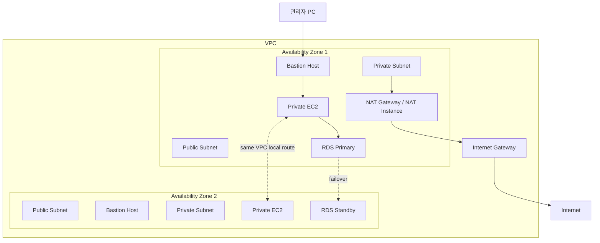

# Multi-AZ와 Bastion, NAT 구성 기초

## 한 줄 요약

Multi-AZ 구성의 핵심은 멀리 있는 서버를 편하게 연결하는 것이 아니라, **같은 VPC 안에서 통신할 수 있게 묶되 한 AZ가 죽어도 다른 AZ의 자원으로 버틸 수 있게 배치하는 것**이다.

## 먼저 잡아야 할 핵심

p.66-71은 Console 클릭 절차보다 확장형 VPC의 배치 이유를 보여주는 범위다.

| 구성요소 | 먼저 떠올릴 역할 |
| --- | --- |
| Multi-AZ | 같은 Region 안의 여러 AZ에 자원을 나누어 단일 AZ 장애 영향을 줄임 |
| Bastion Host | 외부에서 Private Subnet 자원으로 들어가기 위한 통제된 경유지 |
| NAT Gateway / NAT Instance | Private Subnet 자원이 외부로 나가는 outbound 경로 |
| RDS Multi-AZ | DB 장애 시 standby 쪽으로 전환할 수 있는 가용성 구성 |

> [!important] 내부 통신은 목적이 아니라 조건이다
> AZ1과 AZ2의 EC2가 같은 VPC 안에서 private IP로 통신되는 것은 여러 AZ 자원이 하나의 시스템을 이루기 위한 조건이다. Multi-AZ 배치의 목적은 한 AZ 장애에도 서비스를 계속 운영할 수 있게 만드는 것이다.

## 자료 범위와 읽는 기준

- 주 자료: [[40_자료/강의 자료/AWS기초.pdf|AWS 기초]], PDF viewer 기준 p.66-71
- p.66은 앞선 Public / Private Subnet 실습의 검증 기준이다.
- p.67-70은 Multi-AZ, Bastion Host, NAT, RDS를 같은 VPC 구조 위에 단계적으로 추가하는 개념 그림이다.
- p.71은 NAT Instance 실습으로 넘어가는 시작점이다.
- PDF는 `Copyright © 2018` 자료다. NAT Instance와 RDS Multi-AZ의 현재 권장/동작은 AWS 공식 문서 기준으로 보정한다.

## Public / Private Subnet 검증 기준
![[40_자료/캡쳐 창고/AWS기초 5.webp]]
[[AWS기초.pdf#page=66&rect=56,51,904,465|AWS기초, p.66]]

p.66은 앞선 VPC 실습의 마무리 기준을 제시한다.

```text
VPC: 192.168.0.0/16
Public subnet: 192.168.1.0/24
Private subnet 1: 192.168.2.0/24
Private subnet 2: 192.168.3.0/24
```

확인해야 하는 결과는 단순하다.

| 위치                     | 외부 통신                | 내부 통신      |
| ---------------------- | -------------------- | ---------- |
| **Public** Subnet EC2  | 허용                   | 허용         |
| **Private** Subnet EC2 | 외부에서 직접 들어오는 ping 거부 | 내부 ping 허용 |

이 기준은 [[10_학습 노트/클라우드/AWS/실습 노트/VPC 실습|VPC 실습]]에서 확인한 구조와 이어진다. Public EC2는 외부에서 직접 접근되었고, Private EC2는 외부에서 직접 접근되지 않았지만 Public EC2를 경유한 SSH는 성공했다.

> [!important] Private Subnet은 고립된 섬이 아니다
> Private Subnet은 internet에서 직접 들어오는 경로가 없는 subnet이다. 같은 VPC 내부의 `local` route와 Security Group이 허용하면 다른 subnet의 EC2와 통신할 수 있다.

**그래서, Public / Private Subnet의 차이는 “통신 가능 여부”가 아니라 “internet에서 직접 들어오는 길이 있느냐”로 잡으면 된다.**

## Multi-AZ 배치
![[40_자료/캡쳐 창고/AWS기초 6.webp]]
[[AWS기초.pdf#page=67&rect=57,23,904,465|AWS기초, p.67]]
Multi-AZ는 같은 Region 안의 여러 Availability Zone에 자원을 나누는 배치 방식이다. AWS 공식 문서 기준으로 AZ는 Region 안의 격리된 위치이고, EC2 instance를 여러 AZ에 나누어 배치하면 Region 안의 단일 위치 장애로부터 애플리케이션을 보호할 수 있다.

```text
Region
└─ VPC
   ├─ AZ1
   │  ├─ Public subnet
   │  ├─ Private subnet 1
   │  └─ Private subnet 2
   └─ AZ2
      ├─ Public subnet
      ├─ Private subnet 1
      └─ Private subnet 2
```

Subnet은 반드시 하나의 AZ 안에만 존재한다. 따라서 AZ2에 서버를 배치하려면 AZ2용 subnet을 새로 만들어야 한다.

> [!summary] Multi-AZ의 의미
> 같은 VPC 안에서 통신 가능한 자원을 여러 AZ에 나누어 배치한다. 목표는 통신 편의가 아니라 단일 AZ 장애에 대한 가용성 확보다.

**그래서, Multi-AZ는 “멀리 있는 서버를 연결하는 기술”이 아니라 “같이 통신하되 같이 죽지 않게 나눠 두는 배치 방식”이다.**

## Bastion Host
![[40_자료/캡쳐 창고/AWS기초 7.webp]]
[[AWS기초.pdf#page=68&rect=57,22,901,465|AWS기초, p.68]]
Bastion Host는 외부에서 Private Subnet의 instance로 들어갈 때 사용하는 통제된 경유지다. PDF 그림에서는 각 AZ의 Public Subnet 쪽에 Bastion Host가 배치된다.

```text
관리자 PC
-> Bastion Host in Public Subnet
-> Private EC2
```

Private EC2는 internet에서 직접 SSH를 받지 않는다. 대신 Bastion Host만 제한된 source에서 SSH를 받고, Private EC2는 Bastion Host 또는 Bastion의 Security Group에서 오는 SSH만 허용하는 식으로 접근면을 줄인다.

**그래서, 특별한 서비스가 없는 깡통 서버여도 외부에서 접속 가능한 통제 지점이고 Private 자원으로 경유 접속하게 해주면 Bastion Host라 할 수 있다.**

> [!warning] Bastion은 편의 장비가 아니라 노출면을 줄이는 경계 장비다
> Bastion Host를 만들었다고 안전해지는 것이 아니다. Bastion의 inbound source, key 관리, 접속 로그, 권한 범위가 같이 통제되어야 한다.

## NAT Gateway / NAT Instance
![[40_자료/캡쳐 창고/AWS기초 8.webp]]
[[AWS기초.pdf#page=69&rect=56,22,903,465|AWS기초, p.69]]
Private Subnet의 EC2는 internet에서 직접 들어오는 연결을 받지 않아야 하지만, package update나 외부 API 호출처럼 외부로 나가는 연결은 필요할 수 있다. 이때 NAT device가 outbound 경로를 만든다.

```text
Private EC2
-> Private route table
-> NAT Gateway or NAT Instance
-> Internet Gateway
-> Internet
```

AWS 공식 문서 기준으로 NAT Gateway는 Private Subnet의 instance가 VPC 밖의 서비스로 연결을 시작할 수 있게 하지만, 외부 서비스가 해당 instance로 임의의 새 연결을 시작할 수는 없게 한다.

| 구분    | NAT Gateway                                   | NAT Instance                                              |
| ----- | --------------------------------------------- | --------------------------------------------------------- |
| 성격    | AWS 관리형 NAT 서비스                               | EC2 instance에 NAT 역할을 직접 구성                               |
| 운영 부담 | AWS가 관리                                       | 사용자가 OS patch, 성능, 장애 대응 관리                               |
| 가용성   | AZ별 redundant 구현. AZ별 NAT Gateway 구성이 권장됨     | failover 구성을 직접 관리                                        |
| 비용 판단 | 사용 시간과 처리 data 기준 과금<br>26-6-4 기준 시간 당 0.059$ | EC 2 instance 비용과 운영 부담<br>26-6-4, 아마존 리눅스 기준 시간 당 0.013$ |

**그래서, NAT는 Private 서버를 public 서버로 만드는 장치가 아니라 Private 서버가 시작한 outbound만 대신 밖으로 내보내는 출구다.**

> [!note] PDF의 NAT Instance 실습은 현재 기준으로 보정해서 읽는다
> AWS 공식 문서는 NAT Gateway가 더 높은 가용성과 bandwidth를 제공하고 관리 부담이 적기 때문에 NAT Gateway 사용을 권장한다. 기존 NAT AMI는 오래된 Amazon Linux AMI 기반이므로 그대로 따라 쓰면 안 된다. 수업 실습에서는 원리 이해와 비용 감각을 분리해서 본다.

NAT의 동작 원리와 p.72-85의 NAT Instance 구성 조건은 [[10_학습 노트/클라우드/AWS/개념 노트/NAT Gateway와 NAT Instance 구성 기초|NAT Gateway와 NAT Instance 구성 기초]]에서 따로 정리한다.

## RDS Master / Slave와 Multi-AZ DB
![[40_자료/캡쳐 창고/AWS기초 9.webp]]
[[AWS기초.pdf#page=70&rect=56,23,903,464|AWS기초, p.70]]
p.70은 같은 VPC 안에 Bastion, NAT Instance, RDS가 함께 놓이는 그림이다. RDS는 Private Subnet 쪽에 배치하고, 그림에서는 `Master`와 `Slave`가 AZ에 걸쳐 표현된다.

현재 AWS RDS Multi-AZ DB instance 설명으로 읽으면, primary DB instance와 standby DB instance를 두고 장애 시 RDS가 standby 쪽으로 자동 failover한다. 일반적인 Multi-AZ standby는 읽기 트래픽을 처리하기 위한 read replica가 아니라 failover 지원을 위한 대기 구성이다.

```text
Application / EC2
-> RDS endpoint
-> Primary DB
   장애 시
-> Standby DB로 failover
```

> [!important] RDS Multi-AZ는 DB 접속 경로를 직접 두 개로 관리하라는 뜻이 아니다
> 애플리케이션은 RDS endpoint를 바라본다. 장애가 발생하면 RDS가 failover를 처리하고 endpoint가 standby 쪽을 가리키도록 바뀐다.

**그래서, RDS Multi-AZ는 앱이 DB 두 대를 직접 골라 쓰는 구조가 아니라 하나의 endpoint 뒤에서 장애 전환을 맡기는 구조다.**

## NAT Instance 실습으로 넘어가는 지점
![[40_자료/캡쳐 창고/AWS기초 10.webp]]
[[AWS기초.pdf#page=71&rect=55,19,906,466|AWS기초, p.71]]
p.71부터는 NAT Instance 실습으로 들어간다. 지금 노트에서는 실습 명령이나 Console 클릭 순서를 다루지 않는다.

다음 실습에서 확인할 핵심은 세 가지다.

| 확인 항목 | 의미 |
| --- | --- |
| NAT Instance는 Public Subnet에 있는가 | internet으로 나가려면 IGW 경로와 public address가 필요함 |
| Private Route Table이 NAT Instance를 바라보는가 | Private Subnet의 기본 outbound 경로 |
| Private EC2가 외부로 나가되 외부에서 직접 들어오지 못하는가 | NAT 구성의 목적 검증 |

**그래서, NAT Instance 실습은 “EC2 하나를 서버로 쓰는 실습”이 아니라 Public Subnet의 EC2를 Private Subnet의 출구로 바꾸는 실습이다.**

이후 [[10_학습 노트/클라우드/AWS/개념 노트/NAT Gateway와 NAT Instance 구성 기초|NAT Gateway와 NAT Instance 구성 기초]]으로 이어진다.

## 전체 흐름



이 그림은 PDF p.66-71의 관계를 학습용으로 단순화한 것이다. 실제 운영 구성에서는 ALB, Auto Scaling, RDS Multi-AZ 모드, NAT Gateway의 AZ별 배치, Security Group과 Network ACL을 함께 설계해야 한다.

## 오해하기 쉬운 지점

| 오해 | 정확한 이해 |
| --- | --- |
| Multi-AZ는 다른 위치 서버끼리 통신시키는 기능이다 | 통신은 VPC와 route가 담당한다. Multi-AZ의 목적은 장애 분산이다. |
| Private Subnet은 아무 곳과도 통신하지 못한다 | 같은 VPC 내부 통신은 가능하다. 외부에서 직접 들어오는 경로가 없는 것이다. |
| Bastion Host는 Private EC2를 public처럼 만드는 장치다 | Bastion은 접근을 한 지점으로 모아 통제하는 경유지다. |
| NAT가 있으면 외부에서 Private EC2로 접속할 수 있다 | NAT는 Private EC2가 시작한 outbound 연결의 응답을 돌려주는 장치다. 외부에서 새 연결을 직접 시작하는 경로가 아니다. |
| RDS Multi-AZ의 Slave는 일반 read용 서버다 | 일반 Multi-AZ standby는 failover용이다. 읽기 확장은 별도 replica 개념과 구분한다. |

## 다음 실습과 연결

- 기본 VPC 구성: [[10_학습 노트/클라우드/AWS/개념 노트/VPC 네트워크 기초|VPC 네트워크 기초]]
- VPC 접근 검증: [[10_학습 노트/클라우드/AWS/실습 노트/VPC 실습|VPC 실습]]
- 다음 범위: [[10_학습 노트/클라우드/AWS/개념 노트/NAT Gateway와 NAT Instance 구성 기초|NAT Gateway와 NAT Instance 구성 기초]]

## 참고 자료

- [[40_자료/강의 자료/AWS기초.pdf|AWS 기초 PDF]] - PDF viewer 기준 p.66-71
- [AWS 공식 문서 - Regions and Zones](https://docs.aws.amazon.com/AWSEC2/latest/UserGuide/using-regions-availability-zones.html)
- [AWS 공식 문서 - Subnets for your VPC](https://docs.aws.amazon.com/vpc/latest/userguide/configure-subnets.html)
- [AWS 공식 문서 - Example: VPC with bastion hosts](https://docs.aws.amazon.com/elasticbeanstalk/latest/dg/vpc-bastion-host.html)
- [AWS 공식 문서 - NAT gateways](https://docs.aws.amazon.com/AmazonVPC/latest/UserGuide/vpc-nat-gateway.html)
- [AWS 공식 문서 - Compare NAT gateways and NAT instances](https://docs.aws.amazon.com/vpc/latest/userguide/vpc-nat-comparison.html)
- [AWS 공식 문서 - NAT instances](https://docs.aws.amazon.com/vpc/latest/userguide/VPC_NAT_Instance.html)
- [AWS 공식 문서 - Amazon RDS Multi-AZ deployments](https://docs.aws.amazon.com/AmazonRDS/latest/UserGuide/Concepts.MultiAZ.html)
