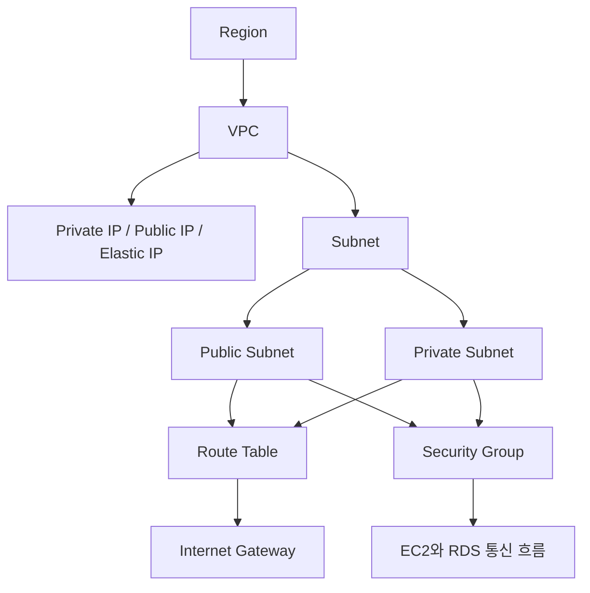
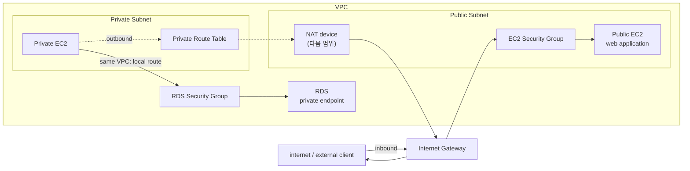

# VPC 네트워크 기초

## 한 줄 요약

Amazon VPC는 AWS 리소스를 배치하는 계정 전용 가상 네트워크다. EC2 instance는 VPC 안의 subnet에 배치되고, route table이 이동 경로를 정하며, Security Group이 허용할 traffic을 제한한다.

## 먼저 잡아야 할 핵심

EC2 instance는 AWS Cloud 안에 막연히 떠 있는 서버가 아니다. 항상 특정 VPC와 subnet 안에 배치된다.

| 구성요소                  | 먼저 떠올릴 역할                               |
| --------------------- | --------------------------------------- |
| VPC                   | AWS 계정 전용 가상 네트워크의 큰 경계                 |
| Subnet                | VPC 주소 범위를 AZ 단위로 나눈 실제 배치 구간           |
| IP address            | instance를 식별하고 통신할 때 사용하는 주소            |
| Route Table           | 목적지에 따라 packet을 어디로 보낼지 정하는 경로표         |
| Internet Gateway, IGW | VPC와 internet 사이의 출입구                   |
| Security Group        | 리소스에 도달하거나 리소스에서 나갈 수 있는 traffic의 허용 규칙 |

> [!important] Public Subnet과 Private Subnet은 이름이 아니라 route로 구분한다
> 연결된 route table에 IGW로 향하는 직접 route가 있으면 Public Subnet이다. 직접 route가 없으면 Private Subnet이다.

## 자료 범위와 읽는 기준

- 주 자료: [[40_자료/강의 자료/AWS기초.pdf|AWS 기초]], PDF viewer 기준 p.25-30
- p.25는 EC2 생성 결과에서 VPC 구성요소로 넘어가는 연결 페이지다.
- p.26-30은 VPC, IP address, subnet, route table, IGW, Security Group의 개념 범위다.
- p.31부터 시작하는 AWS Console 조작은 [[10_학습 노트/클라우드/AWS/실습 노트/VPC 실습|VPC 실습]]에 기록한다.
- PDF는 `Copyright © 2018` 자료다. 현재 동작과 비용 관련 설명은 AWS 공식 문서로 보정했다.

## VPC: AWS 계정 전용 가상 네트워크
![[40_자료/캡쳐 창고/AWS기초 4.webp]]
[[AWS기초.pdf#page=30&rect=97,45,879,422|AWS기초, p.30]]

위 그림은 VPC 안에 Public Subnet과 Private Subnet을 나누고, EC2, route table, Security Group, IGW를 어디에 배치하는지 한 화면에 보여주는 핵심 지도다. IP address 종류, CIDR 예약 주소, NAT의 세부 동작은 아래 본문에서 보충한다.

### 클릭해서 이동하는 구성요소 지도

아래 Mermaid node를 클릭하면 이 노트의 해당 설명으로 이동한다. Obsidian URI를 사용하므로 Obsidian 읽기 모드에서 확인한다.



Mermaid link가 동작하지 않는 환경에서는 아래 heading link를 사용한다.

- [[#VPC: AWS 계정 전용 가상 네트워크|VPC]]
- [[#Subnet: VPC를 AZ 단위로 나눈 주소 구간|Subnet]]
- [[#Private IP, Public IP, Elastic IP|IP address]]
- [[#Route Table: packet의 다음 경로|Route Table]]
- [[#Internet Gateway: VPC와 internet 사이의 출입구|Internet Gateway]]
- [[#Public Subnet과 Private Subnet|Public / Private Subnet]]
- [[#Security Group: 리소스 앞의 stateful 허용 규칙|Security Group]]
- [[#VPC 안팎의 통신 흐름|VPC 안팎의 통신 흐름]]

**Amazon VPC(Virtual Private Cloud)** 는 사용자가 정의하는 논리적으로 격리된 가상 네트워크다. AWS 공식 문서는 VPC를 특정 AWS 계정에 전용으로 제공되는 virtual network라고 설명한다.

VPC를 만들 때는 사용할 IP address 범위를 CIDR block으로 정한다. 그 안에 subnet을 만들고, gateway를 연결하고, Security Group을 적용한다.

```text
AWS Region
└─ VPC: 10.0.0.0/16
   ├─ Subnet A: 10.0.1.0/24
   └─ Subnet B: 10.0.2.0/24
```

VPC는 Region 단위 리소스다. 하나의 VPC는 같은 Region 안의 여러 Availability Zone을 포함할 수 있다.

> [!note] 이전 실습에서 바로 EC2를 만들 수 있었던 이유
> AWS 계정에는 Region별 Default VPC가 제공될 수 있다. Default VPC에는 기본 subnet, IGW, main route table의 internet route 같은 초기 구성이 들어 있다. 직접 만든 VPC에서는 필요한 구성을 명시적으로 연결해야 한다.

## Subnet: VPC를 AZ 단위로 나눈 주소 구간

Subnet은 VPC CIDR block의 일부를 잘라 만든 IP address 범위다. EC2 같은 AWS 리소스는 VPC 자체가 아니라 특정 subnet에 배치된다.

| 구분 | 범위 |
| --- | --- |
| VPC | Region 안의 여러 AZ를 포함할 수 있음 |
| Subnet | 하나의 AZ 안에만 존재함 |

하나의 subnet이 여러 AZ에 걸쳐 존재할 수는 없다. 장애 범위를 분리하려면 AZ별로 subnet을 따로 만든다.

### CIDR과 예약 주소 5개

`172.16.1.0/24` subnet에는 계산상 IPv4 address가 256개 있다. 하지만 AWS는 앞의 4개와 마지막 1개를 예약하므로 리소스에 할당할 수 있는 주소는 251개다.

| 주소             | 의미                                                              |
| -------------- | --------------------------------------------------------------- |
| `172.16.1.0`   | **Network address**                                             |
| `172.16.1.1`   | **VPC router**용으로 예약                                            |
| `172.16.1.2`   | **DNS server** 주소와 관련됨                                          |
| `172.16.1.3`   | AWS가 **향후 사용을 위해** 예약                                           |
| `172.16.1.255` | **Network broadcast address.** VPC는 broadcast를 지원하지 않지만 AWS가 예약 |

> [!tip] 사용 가능한 IPv4 address 수
> 일반적인 AWS subnet에서는 `CIDR이 표현하는 전체 주소 수 - 5`로 계산한다.

## Private IP, Public IP, Elastic IP

PDF는 EC2에서 자주 접하는 IPv4 address를 Private IP, Public IP, Elastic IP로 구분한다.

| 유형                  | 의미                                         | 변화 여부                                                          | 주 용도           |
| ------------------- | ------------------------------------------ | -------------------------------------------------------------- | -------------- |
| **Private IP**      | subnet CIDR 범위에서 instance에 할당되는 내부 주소      | instance를 `stop -> start`해도 유지되고 terminate하면 해제                | VPC 내부 통신      |
| **Public IP**       | internet에서 접근할 수 있도록 Amazon pool에서 할당되는 주소 | `stop`, hibernate, terminate 시 해제됨. 다시 start하면 일반적으로 새 주소가 할당됨 | 임시 internet 통신 |
| **Elastic IP, EIP** | AWS 계정에 할당하고 리소스에 연결하는 고정 Public IPv4      | 직접 release하기 전까지 계정에 유지됨                                       | 고정 주소가 필요한 경우  |

> [!warning] PDF의 Public IP 설명은 현재 기준으로 보정해서 읽는다
> PDF p.27은 재부팅 시 새로운 Public IP가 할당된다고 설명한다. 현재 AWS 공식 문서 기준으로 일반적인 OS reboot에서는 Public IPv4가 유지된다. 주소가 바뀌는 대표 상황은 `stop -> start`, hibernate, terminate다.

> [!warning] Public IPv4와 Elastic IP는 비용을 확인한다
> 현재 AWS는 실행 중인 instance의 Public IPv4와 Elastic IP를 포함한 Public IPv4 address에 비용을 청구한다. Elastic IP도 사용 중인지 유휴 상태인지와 관계없이 과금 대상이다. 필요하지 않은 주소는 정리한다.

IPv6는 별도 주소 체계와 route를 사용한다. 이번 범위에서는 IPv4의 기본 흐름에 집중한다.

## Route Table: packet의 다음 경로

Route Table은 network traffic을 어디로 보낼지 결정하는 route 목록이다. 각 route에는 목적지인 `Destination`과 다음 전달 대상인 `Target`이 있다.

| Destination | Target | 의미 |
| --- | --- | --- |
| `10.0.0.0/16` | `local` | 같은 VPC CIDR 안의 통신 |
| `0.0.0.0/0` | `igw-...` | 더 구체적인 route가 없는 IPv4 traffic을 IGW로 전달 |

각 subnet은 하나의 route table과 연결된다. 별도 route table을 명시적으로 연결하지 않은 subnet은 VPC의 main route table을 사용한다. 하나의 route table을 여러 subnet이 공유할 수는 있다.

> [!important] Route Table은 방화벽이 아니다
> Route Table은 packet을 보낼 경로를 정한다. 실제로 traffic을 허용할지는 Security Group 같은 별도 통제가 결정한다.

## Internet Gateway: VPC와 internet 사이의 출입구

Internet Gateway(IGW)는 VPC와 internet 사이의 통신을 가능하게 하는 VPC 구성요소다. 사용하려면 VPC에 attach하고 route table에 경로를 추가해야 한다.

IPv4 기준으로 instance가 internet과 직접 통신하려면 최소한 다음 조건을 함께 확인한다.

| 조건 | 이유 |
| --- | --- |
| Subnet route table에 IGW로 향하는 route가 있음 | internet 방향의 이동 경로 필요 |
| Instance에 Public IPv4 또는 Elastic IP가 있음 | internet에서 사용할 주소 필요 |
| Security Group이 필요한 traffic을 허용함 | 리소스 단위 접근 허용 필요 |

IGW로 향하는 route만 추가했다고 모든 instance가 곧바로 외부에 노출되는 것은 아니다.

## Public Subnet과 Private Subnet

Public Subnet과 Private Subnet의 기준은 subnet에 연결된 route table이다.

| 구분 | IGW 직접 route | internet과 직접 통신 | 주 배치 예시 |
| --- | --- | --- | --- |
| Public Subnet | 있음 | Public IP 또는 Elastic IP와 허용 rule이 있으면 가능 | 외부 요청을 받아야 하는 진입점 |
| Private Subnet | 없음 | 불가능 | DB, 내부 application server |

> [!important] Public Subnet에 있다고 자동으로 공개되는 것은 아니다
> Public Subnet은 internet 방향의 route를 가진 subnet이다. 개별 리소스가 직접 통신하려면 Public IPv4 또는 Elastic IP와 Security Group rule도 필요하다.

### AWS Console에서 확인한 예시

![[40_자료/캡쳐 창고/Pasted image 20260602160626.png]]

위 Resource Map은 [[10_학습 노트/클라우드/AWS/실습 노트/VPC 실습|VPC 실습]]에서 직접 만든 구성이다. Public Subnet은 IGW로 이어지는 `First-public-rt`를 사용하고, Private Subnet은 IGW로 직접 이어지지 않는 `First-pritate-rt`를 사용한다.

Resource Map은 리소스의 연결 관계를 빠르게 확인하는 화면이다. `0.0.0.0/0 → IGW` route의 상세 값, EC2의 Public IPv4, Security Group rule은 각각 별도로 확인해야 한다.

Private Subnet의 리소스가 외부에서 먼저 들어오는 연결은 받지 않되 update download처럼 outbound internet 통신을 시작해야 할 수 있다. 이때 사용하는 NAT device는 다음 범위에서 다룬다.

## VPC 안팎의 통신 흐름

구성요소를 따로 외우기보다 packet이 어느 주소와 경로를 사용하는지 따라가면 역할이 선명해진다.

아래 흐름은 개념을 잡기 위한 단순화다. AWS 내부 구현을 물리 장비의 hop 목록처럼 표현한 것은 아니다.



### 같은 VPC 내부: EC2에서 RDS로 접속

같은 VPC 안의 리소스끼리는 Private IP와 `local` route를 사용한다. internet을 거치지 않는다.

앞선 [[10_학습 노트/클라우드/AWS/실습 노트/EC2와 RDS 기본 구성 실습|EC2와 RDS 기본 구성 실습]]에서는 RDS Security Group의 `3306` source에 EC2 Security Group을 지정했다. EC2의 Public IPv4가 바뀌더라도 같은 Security Group을 사용하는 EC2에서 RDS로 접근할 수 있는 이유다.

> [!important] 같은 VPC 안의 통신에서 Public IPv4를 기준으로 생각하지 않는다
> 내부 통신의 기본 식별자는 Private IP다. Public IPv4는 internet과 직접 통신할 때 필요한 별도 주소다.

### internet에서 Public EC2로 접속

외부 client가 Public Subnet의 EC2로 접속하려면 route, Public IPv4, Security Group이 모두 필요하다.

EC2 instance는 VPC 내부의 Private IP address 공간을 기준으로 동작한다. IPv4 internet 통신에서는 IGW가 instance의 Public IPv4 또는 Elastic IP와 Private IP 사이의 one-to-one NAT를 논리적으로 수행한다.

응답 traffic은 반대 방향으로 나간다. Security Group은 stateful이므로 허용된 요청에 대한 응답 traffic은 별도의 반대 방향 rule 없이 통과할 수 있다.

### Private Subnet에서 internet으로 outbound 접속

Private Subnet에는 IGW로 향하는 직접 route가 없다. 따라서 Private IP만 가진 EC2가 package update처럼 outbound internet 통신을 시작하려면 NAT device가 중간에서 주소를 변환해야 한다.

응답은 NAT device를 거쳐 원래 요청을 시작한 EC2로 돌아간다. 외부에서 Private Subnet의 EC2로 임의의 새 연결을 직접 시작하는 경로는 아니다.

NAT Gateway와 NAT Instance의 선택, route 구성, 비용은 다음 학습 범위에서 다룬다.

## Security Group: 리소스 앞의 stateful 허용 규칙

Security Group은 연결된 리소스에 도달하거나 리소스에서 나갈 수 있는 traffic을 제어하는 가상 방화벽이다.

처음에는 Cisco ACL처럼 허용할 traffic을 적는 규칙 목록으로 이해하면 편하다. 다만 Security Group은 Cisco ACL과 완전히 같지 않다.

| 구분 | Security Group |
| --- | --- |
| 적용 대상 | EC2 instance 같은 연결된 리소스 |
| Inbound rule | source, protocol, port range 기준으로 허용 |
| Outbound rule | destination, protocol, port range 기준으로 허용 |
| 규칙 방식 | allow rule만 작성. 허용되지 않은 traffic은 차단 |
| 상태 추적 | stateful. 허용된 요청의 응답 traffic은 별도 반대 방향 rule 없이 통과 |

PDF p.29의 `허용/거부` 표현은 넓은 의미로 읽어야 한다. Security Group에는 명시적인 deny rule을 작성하지 않는다.

> [!note] Cisco ACL과 더 직접적으로 비교할 기능
> Subnet 단위에서 stateless allow/deny rule을 적용하는 Network ACL은 후속 범위에서 따로 비교한다.

## IGW와 NAT Gateway를 혼동하지 않는다

강의 중 `gateway` 비용에 관한 설명을 들었다면 어떤 gateway인지 먼저 구분해야 한다.

| 구성요소 | 역할 | 현재 AWS 공식 문서의 비용 설명 |
| --- | --- | --- |
| Internet Gateway, IGW | VPC와 internet 사이의 직접 통신 경로 | IGW 자체의 별도 사용료는 없음. 사용하는 EC2의 data transfer 비용은 발생할 수 있음 |
| NAT Gateway | Private Subnet 리소스가 outbound 연결을 시작할 수 있게 중계 | provision된 시간과 처리한 data 용량에 따라 비용 발생 |

NAT Instance는 EC2 instance에 NAT 역할을 맡기는 방식이다. 비용만 보고 선택할 문제가 아니라 운영 부담, 가용성, 처리량을 함께 비교해야 한다. NAT 상세 구성은 다음 학습 범위로 미룬다.

## 오해하기 쉬운 지점

| 오해 | 정확한 이해 |
| --- | --- |
| VPC와 subnet은 같은 것이다 | VPC가 큰 network 경계이고, subnet은 그 안의 IP address 구간이다. |
| 하나의 subnet을 여러 AZ에 걸칠 수 있다 | subnet 하나는 하나의 AZ에만 속한다. |
| Public Subnet에 넣으면 무조건 internet에서 접근 가능하다 | IGW route 외에도 Public IP 또는 Elastic IP와 Security Group rule이 필요하다. |
| Route Table이 port 접근도 막아준다 | Route Table은 경로를 정하고, 접근 허용은 Security Group 같은 통제가 담당한다. |
| Security Group은 Cisco ACL과 완전히 같다 | 비슷한 mental model은 유용하지만 Security Group은 stateful allow rule 집합이다. |
| IGW와 NAT Gateway는 같은 gateway다 | 목적과 비용 구조가 다른 구성요소다. |
| EC2를 reboot하면 Public IPv4가 바뀐다 | 일반 reboot에서는 유지된다. 대표적으로 `stop -> start`에서 바뀐다. |

## 다음 실습과 연결

p.31부터는 AWS Console에서 VPC를 직접 생성하고, subnet과 route table을 구성하며 접근을 확인한다.

- 실습 기록: [[10_학습 노트/클라우드/AWS/실습 노트/VPC 실습|VPC 실습]]
- 앞선 연결 실습: [[10_학습 노트/클라우드/AWS/실습 노트/EC2와 RDS 기본 구성 실습|EC2와 RDS 기본 구성 실습]]
- 확장형 VPC 구성: [[10_학습 노트/클라우드/AWS/개념 노트/Multi-AZ와 Bastion, NAT 구성 기초|Multi-AZ와 Bastion, NAT 구성 기초]]

## 확장 예시: 웹 호스팅 아키텍처

[AWS 웹 호스팅 아키텍처 whitepaper](https://docs.aws.amazon.com/ko_kr/whitepapers/latest/web-application-hosting-best-practices/an-aws-cloud-architecture-for-web-hosting.html)는 VPC 입문 문서가 아니다. Route 53, CloudFront, WAF, ELB, Security Group, RDS, S3가 함께 배치되는 응용 사례다.

VPC의 기본 구성요소를 이해한 뒤에는 이 자료를 통해 Public Subnet, Private Subnet, Security Group이 실제 웹 서비스의 어느 위치에서 필요한지 확인할 수 있다.

## 참고 자료

- [[40_자료/강의 자료/AWS기초.pdf|AWS 기초 PDF]] - PDF viewer 기준 p.25-30
- [AWS 공식 문서 - How Amazon VPC works](https://docs.aws.amazon.com/vpc/latest/userguide/how-it-works.html)
- [AWS 공식 문서 - Subnet CIDR blocks](https://docs.aws.amazon.com/vpc/latest/userguide/subnet-sizing.html)
- [AWS 공식 문서 - Enable internet access for a VPC using an internet gateway](https://docs.aws.amazon.com/vpc/latest/userguide/VPC_Internet_Gateway.html)
- [AWS 공식 문서 - Control traffic using security groups](https://docs.aws.amazon.com/vpc/latest/userguide/vpc-security-groups.html)
- [AWS 공식 문서 - Amazon EC2 instance IP addressing](https://docs.aws.amazon.com/AWSEC2/latest/UserGuide/using-instance-addressing.html)
- [AWS 공식 문서 - Elastic IP addresses](https://docs.aws.amazon.com/AWSEC2/latest/UserGuide/elastic-ip-addresses-eip.html)
- [AWS 공식 문서 - Pricing for NAT gateways](https://docs.aws.amazon.com/vpc/latest/userguide/nat-gateway-pricing.html)
