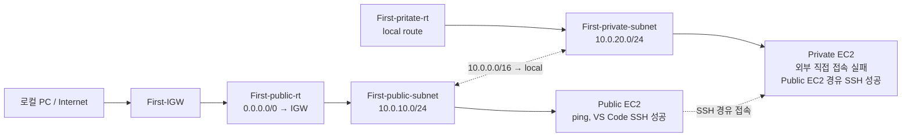

# VPC 구성 실습

## 실습 목표

하나의 VPC 안에 Public Subnet과 Private Subnet을 만들고, 외부에서 직접 접근할 수 있는 EC2와 직접 접근할 수 없는 EC2를 나누어 구성한다.

## 실습 결과

> [!summary] Public / Private Subnet 분리와 경유 SSH 확인
> `First-VPC` 안에 Public EC2와 Private EC2를 하나씩 생성했다. 로컬 환경에서는 Public EC2만 직접 접속되었다. Public EC2에 먼저 접속한 뒤 Private EC2의 내부 주소로 SSH를 실행하면 Private EC2에도 접속할 수 있었다.

| 구분 | Public EC2 | Private EC2 |
| --- | --- | --- |
| 배치한 Subnet | `First-public-subnet` | `First-private-subnet` |
| 외부에서 ping | 성공 | 실패 |
| VS Code SSH 직접 접속 | 성공 | 실패 |
| Public EC2 경유 SSH | - | 성공 |
| 해석 | 외부 통신이 가능한 진입점 | 외부 직접 접속은 차단되지만 Public EC2를 경유하면 접속 가능 |

현재 확인한 차이는 VPC 내부에서 Subnet을 나눈 목적과 맞는다. Private EC2의 outbound 통신은 NAT를 추가하는 후속 범위에서 확인한다.

## 현재 구성



> [!note] 현재 화면의 이름
> Private Route Table은 VPC Resource Map 화면에서 `First-pritate-rt`로 표시되었다. 오타로 보이지만 실습에서 사용한 실제 이름을 그대로 기록한다.

### 리소스 구성표

| 리소스 | 확인한 설정 |
| --- | --- |
| VPC | `First-VPC`, `10.0.0.0/16`, IPv6 없음, 기본 테넌시 |
| VPC DNS | `DNS 확인 활성화`, `DNS 호스트 이름 활성화` 모두 체크 |
| Public Subnet | `First-public-subnet`, `ap-northeast-2a`, `10.0.10.0/24` |
| Private Subnet | `First-private-subnet`, `ap-northeast-2b`, `10.0.20.0/24` |
| Internet Gateway | `First-IGW`를 생성하고 `First-VPC`에 연결 |
| 기본 Route Table | VPC 생성 시 자동 생성 |
| Public Route Table | `First-public-rt`, Public Subnet 연결, `0.0.0.0/0 → First-IGW` 추가 |
| Private Route Table | `First-pritate-rt`, Private Subnet 연결 |
| EC2 | Public Subnet과 Private Subnet에 각각 하나씩 생성 |
| Security Group | ping 및 VS Code SSH 확인을 위해 `ICMP`, `SSH` inbound source를 `0.0.0.0/0`으로 임시 개방 |

## 구축 절차

### 1. VPC 생성

AWS Console에서 VPC 서비스로 이동하고 `VPC 생성`을 선택했다.

<details>
<summary>VPC 서비스 진입 화면</summary>

![[Pasted image 20260602153420.png]]
![[Pasted image 20260602153451.png]]

</details>

`VPC만`을 선택하고 다음 값으로 생성했다.

| 항목 | 값 |
| --- | --- |
| 이름 | `First-VPC` |
| IPv4 CIDR | `10.0.0.0/16` |
| IPv6 CIDR | 없음 |
| 테넌시 | 기본값 |

![[Pasted image 20260602153749.png]]

강사님은 `10.0.0.0/16`을 사용했다. PDF의 예시는 `172.16.0.0/16`이므로 실습 환경마다 사설 IP 대역은 달라질 수 있다.

### 2. VPC DNS 설정

생성한 VPC에서 `작업 → VPC 설정 편집`으로 이동했다.

![[Pasted image 20260602154644.png]]

`DNS 확인 활성화`, `DNS 호스트 이름 활성화`를 모두 체크하고 저장했다.

![[Pasted image 20260602154734.png]]

### 3. Public Subnet과 Private Subnet 생성

좌측 메뉴에서 `서브넷`을 선택하고 Subnet을 두 개 생성했다.

![[Pasted image 20260602154406.png]]

| 이름 | 가용 영역 | IPv4 Subnet CIDR |
| --- | --- | --- |
| `First-public-subnet` | `ap-northeast-2a` | `10.0.10.0/24` |
| `First-private-subnet` | `ap-northeast-2b` | `10.0.20.0/24` |

<details>
<summary>Subnet 생성 화면</summary>

![[Pasted image 20260602154217.png]]
![[Pasted image 20260602154313.png]]

</details>

강사님은 가용 영역의 끝이 `a`이면 세 번째 octet을 `10`, `b`이면 `20`으로 정했다. AWS가 강제하는 규칙은 아니며, 실습에서 구분하기 위한 naming convention이다.

생성 직후 목록에서는 두 Subnet 모두 퍼블릭 액세스가 `끄기`로 표시되었다.

![[Pasted image 20260602154501.png]]

> [!important] Public Subnet의 기준
> 이름에 `public`이 들어가거나 퍼블릭 IPv4 자동 할당을 켜는 것만으로 Public Subnet이 되는 것은 아니다. Internet Gateway로 향하는 Route Table을 연결해야 한다. EC2가 외부와 직접 통신하려면 Public IPv4도 필요하다.

### 4. Internet Gateway 생성과 연결

좌측 메뉴에서 `인터넷 게이트웨이`를 선택하고 `First-IGW`를 생성했다.

![[Pasted image 20260602154907.png]]

생성한 Internet Gateway에서 `작업 → VPC에 연결`을 선택하고 `First-VPC`에 연결했다.

<details>
<summary>Internet Gateway 연결 화면</summary>

![[Pasted image 20260602154959.png]]
![[Pasted image 20260602155035.png]]

</details>

### 5. Route Table 구성

VPC를 만들면 기본 Route Table이 자동으로 생성된다. 별도 Route Table에 명시적으로 연결하지 않은 Subnet은 기본 Route Table을 따른다.

![[Pasted image 20260602155241.png]]

기본 경로인 `10.0.0.0/16 → local`도 확인했다.

![[Pasted image 20260602155434.png]]

> [!tip] `local` 경로의 의미
> `10.0.0.0/16 → local`은 같은 VPC 내부의 주소로 가는 기본 경로다. 실제 packet 통과 여부에는 Security Group과 Network ACL도 영향을 준다.

`First-public-rt`와 `First-pritate-rt`를 생성하고 각각 Public Subnet과 Private Subnet에 연결했다.

<details>
<summary>Route Table 생성과 Subnet 연결 화면</summary>

![[Pasted image 20260602155524.png]]
![[Pasted image 20260602155820.png]]

</details>

Public Route Table에는 외부 인터넷 방향의 경로를 추가했다.

| 대상 | Target |
| --- | --- |
| `10.0.0.0/16` | `local` |
| `0.0.0.0/0` | `First-IGW` |

![[Pasted image 20260602160121.png]]

### 6. VPC Resource Map 확인

VPC Resource Map에서 VPC, 두 Subnet, 세 Route Table, Internet Gateway의 연결 관계를 한 화면에서 확인했다.

![[Pasted image 20260602160626.png]]

### 7. EC2 두 개 생성

`First-VPC` 안에 EC2 Instance를 두 개 생성했다. 하나는 Public Subnet, 다른 하나는 Private Subnet에 배치했다.

ping 통신 확인과 VS Code SSH 접속을 위해 Security Group에서 `ICMP`, `SSH` inbound source를 `0.0.0.0/0`으로 열었다. 수업 진행이 빨라 이 단계의 스크린샷은 남기지 못했다.

### 8. 외부 직접 접속 확인

로컬 환경에서 두 EC2에 ping과 VS Code SSH 직접 접속을 시도했다.

| 확인 항목 | Public EC2 | Private EC2 |
| --- | --- | --- |
| ping | 성공 | 실패 |
| VS Code SSH | 성공 | 실패 |

> [!warning] 실습 후 축소할 규칙
> `SSH`, `ICMP`를 `0.0.0.0/0`에 개방한 상태는 수업 진행을 위한 임시 설정이다. 후속 단계에서 실제 접속 경로를 확인한 뒤 필요한 source 범위로 줄인다.

### 9. Public EC2를 경유하여 Private EC2 접속

VS Code로 Public EC2에 먼저 접속했다. Public EC2의 shell prompt에서 확인한 내부 주소는 `10.0.10.116`이었다.

Public EC2에서 Private EC2의 key file을 사용하여 SSH 접속을 시도했다. Private EC2의 내부 주소는 SSH host 확인 메시지에서 `10.0.20.14`로 확인했다.

처음에는 key file 권한이 `0664`여서 SSH가 거부했다.

```text
WARNING: UNPROTECTED PRIVATE KEY FILE!
Permissions 0664 for 'First-private-EC2-key-1.pem' are too open.
Load key "First-private-EC2-key-1.pem": bad permissions
Permission denied (publickey,gssapi-keyex,gssapi-with-mic).
```

Public EC2에서 key file 권한을 줄인 뒤 다시 접속했다.

```bash
sudo chmod 400 First-private-EC2-key-1.pem
ssh -i "First-private-EC2-key-1.pem" ec2-user@<Private_EC2_DNS_OR_IP>
```

두 번째 시도에서는 Private EC2의 shell prompt인 `ec2-user@ip-10-0-20-14`가 나타났다. 따라서 다음 경로의 SSH 접속이 성공했다.

```text
로컬 PC → Public EC2 → Private EC2
```

![[Pasted image 20260602172500.png]]

> [!warning] 실무에서는 key file 전달을 최소화
> 이번 실습에서는 Private EC2의 key file을 Public EC2에 두고 접속했다. 실무에서는 key file 복사를 최소화하고 요구사항에 맞는 접근 방식을 별도로 검토한다.

## 트러블슈팅 메모

### AMI에 맞는 SSH 사용자 지정

SSH 접속에 사용하는 기본 username은 instance 생성 시 선택한 AMI에 따라 달라진다. [AWS 공식 문서](https://docs.aws.amazon.com/ko_kr/AWSEC2/latest/UserGuide/managing-users.html)에 따르면 Amazon Linux AMI는 `ec2-user`, Ubuntu AMI는 `ubuntu`를 사용한다.

이번 실습에서는 Amazon Linux를 설치했으므로 VS Code의 SSH config에서도 `User ubuntu`가 아니라 `User ec2-user`로 설정한다. `HostName`에는 접속 시점의 Public EC2 IPv4를 입력한다.

```sshconfig
Host public
    HostName <Public_EC2_IP>
    User ec2-user
    IdentityFile "C:\Users\Unoh\.ssh\First-public-EC2-key1.pem"
```

EC2를 다시 만들거나 접속 대상이 바뀐 뒤 기존 SSH host key 때문에 접속이 막히면 로컬 PC에서 해당 host 기록만 제거한다.

```powershell
ssh-keygen -R <퍼블릭_IP>
```

SSH config의 별칭으로 접속했다면 별칭도 제거한다.

```powershell
ssh-keygen -R <Host_별칭>
```

`~/.ssh/known_hosts` 전체 삭제는 다른 서버의 fingerprint 기록까지 지우므로 마지막 수단으로만 사용한다.

### Private key 권한 오류

SSH private key가 다른 사용자에게도 노출될 수 있는 권한이면 SSH client가 사용을 거부한다.

```bash
sudo chmod 400 <Private_key.pem>
```

`400`은 소유자만 key file을 읽을 수 있게 만든다.

## 수업 중 메모와 개념 연결

### IGW와 NAT Gateway 비용 구분

- 네트워크 게이트웨이는 개인이 사용하기에는 비싸다고 설명하셨다.
- 필요하면 EC2에 NAT를 구현하는 방법이 더 낫다고 설명하셨다.

> [!note] 강의 설명을 구체적으로 읽는다
> 비용 설명은 Internet Gateway가 아니라 NAT Gateway를 가리킨 것으로 해석한다. [AWS 공식 문서](https://docs.aws.amazon.com/vpc/latest/userguide/VPC_Internet_Gateway.html)에 따르면 IGW 자체에는 별도 사용료가 없지만, IGW를 사용하는 EC2의 data transfer에는 비용이 발생할 수 있다. [NAT Gateway 공식 문서](https://docs.aws.amazon.com/vpc/latest/userguide/nat-gateway-pricing.html)에 따르면 NAT Gateway에는 가용 시간과 처리한 data 용량에 따른 비용이 발생한다.

자세한 비교는 [[10_학습 노트/클라우드/AWS/개념 노트/VPC 네트워크 기초#IGW와 NAT Gateway를 혼동하지 않는다|VPC 네트워크 기초]]에서 정리한다.

### Subnet 예약 주소 5개

`/24` Subnet의 256개 IPv4 주소 중 AWS가 5개를 예약한다.

```text
172.16.1.0
172.16.1.1
172.16.1.2
172.16.1.3
172.16.1.255
```

`.2`는 DNS server 주소와 관련해 예약되고, `.3`은 향후 AWS 사용을 위해 예약된다. 자세한 표는 [[10_학습 노트/클라우드/AWS/개념 노트/VPC 네트워크 기초#CIDR과 예약 주소 5개|VPC 네트워크 기초]]에서 확인한다.

### PDF와 현재 Console의 차이

강의 PDF와 현재 AWS Console은 디자인이 다르다. 이 노트는 실제 Console에서 수행한 절차와 화면을 기준으로 기록했다.

## 후속 실습으로 넘길 항목

- Private Subnet의 outbound 통신을 위한 NAT 구성을 추가한다.
- 필요하면 Public EC2에서 Private EC2의 Private IPv4로 ping을 실행하여 ICMP 내부 통신도 별도로 확인한다.
