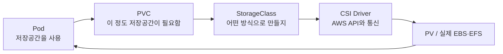

# Kubernetes Volume

> [!summary]
> Container 안의 파일은 Container와 함께 사라질 수 있다.  
> **Volume은 Container 밖에 데이터를 둘 위치를 연결**하고, `PV/PVC/StorageClass`는 그 저장소를 신청하고 공급하는 Kubernetes 방식이다.

## 1. 왜 필요한가

Container는 교체되기 쉬운 실행 단위다. Pod가 재생성되면 Container의 쓰기 영역도 새로 만들어지므로, 다음 데이터까지 그 안에만 두면 곤란하다.

- Database Data
- 사용자가 올린 파일
- 여러 Container가 함께 읽어야 하는 파일
- Pod가 교체되어도 남아야 하는 설정·작업 결과

핵심은 **Pod의 수명과 데이터의 수명을 분리하는 것**이다.

## 2. 가장 먼저 구분할 것

| 종류 | 데이터가 있는 곳 | 언제 사라지는가 | 주 용도 |
|---|---|---|---|
| Container File System | Container 내부 | Container 교체 시 | 임시 실행 파일 |
| `emptyDir` | Pod가 배치된 Node | Pod 삭제 시 | 같은 Pod의 Container 간 임시 공유 |
| `hostPath` | 특정 Node의 실제 경로 | Node의 파일이 지워질 때 | Node Log·실습·특수 Agent |
| Persistent Volume | EBS·EFS 같은 외부 저장소 | 정책과 실제 저장소 수명에 따름 | Pod 교체 후에도 보존할 Data |

> [!warning]
> `emptyDir`은 Container가 재시작되어도 유지될 수 있지만 **Pod가 삭제되면 함께 사라진다.** 이름에 `Volume`이 들어간다고 모두 영구 저장소는 아니다.

## 3. `emptyDir`: 같은 Pod 안의 공용 작업대

```yaml
spec:
  containers:
    - name: writer
      volumeMounts:
        - name: shared
          mountPath: /work
    - name: reader
      volumeMounts:
        - name: shared
          mountPath: /usr/share/nginx/html
  volumes:
    - name: shared
      emptyDir: {}
```

두 Container는 서로 다른 File System을 가지지만, 같은 `shared` Volume을 Mount하면 같은 파일을 볼 수 있다.

적합한 예:

- Sidecar와 Main Container 사이의 임시 파일 전달
- 임시 Cache
- 한 Container가 생성한 파일을 다른 Container가 서비스

부적합한 예:

- Database 영구 Data
- Pod 삭제 후에도 보존해야 하는 파일

## 4. `hostPath`: Node의 실제 Directory를 빌린다

```yaml
volumes:
  - name: node-log
    hostPath:
      path: /var/log
      type: Directory
```

`hostPath`는 Pod가 실행 중인 **Node의 경로를 Container에 연결**한다.

장점:

- Node Log·Socket처럼 Node에 있는 파일에 직접 접근할 수 있다.
- 별도 Storage Service 없이 실습하기 쉽다.

위험:

- Pod가 다른 Node로 이동하면 다른 내용이 보인다.
- `/`, `/etc`, Container Runtime Socket 등을 넓게 Mount하면 Host 장악으로 이어질 수 있다.
- 일반 Application의 영구 저장소로 쓰면 Node 종속성이 생긴다.

따라서 `hostPath`는 범용 영구 저장소라기보다 **Node 자체를 관찰하거나 관리하는 특수 Pod**에서 제한적으로 사용한다.

## 5. PV·PVC·StorageClass를 주문 과정으로 이해한다



| Object | 쉬운 의미 | 담당 질문 |
|---|---|---|
| `StorageClass` | 저장소 제작 규칙 | 어떤 종류·정책으로 만들까? |
| `PVC` | 사용자의 신청서 | 용량과 Access Mode는 무엇인가? |
| `PV` | Cluster가 제공한 저장공간 | 실제로 어떤 저장소가 연결됐나? |
| `CSI Driver` | Kubernetes와 Storage Provider 사이의 통역사 | AWS에서 생성·연결·해제하는 방법은? |

Pod는 AWS EBS ID를 직접 관리하기보다 PVC를 참조한다.

```yaml
volumes:
  - name: data
    persistentVolumeClaim:
      claimName: app-data

containers:
  - name: app
    volumeMounts:
      - name: data
        mountPath: /data
```

## 6. EBS와 EFS

| 구분 | Amazon EBS | Amazon EFS |
|---|---|---|
| 성격 | Block Storage | Network File System |
| 대표 Access | 한 Node 중심의 `ReadWriteOnce` | 여러 Pod가 공유하는 `ReadWriteMany` |
| 위치 제약 | Volume과 Node의 Availability Zone을 맞춰야 함 | 여러 Availability Zone에서 Mount 가능 |
| 잘 맞는 용도 | Database Disk, 단일 Writer | 공유 Upload, 공동 File, 다중 Reader/Writer |
| Kubernetes 연결 | EBS CSI Driver | EFS CSI Driver |

> [!important]
> `ReadWriteOnce`는 “Pod 한 개만”이라는 뜻이 아니라 **한 Node에서 Read-Write로 Mount**하는 Mode다. 더 엄격한 단일 Pod Mount가 필요하면 `ReadWriteOncePod`를 검토한다.

## 7. 최소 사용 순서

```bash
# StorageClass 확인
kubectl get storageclass

# Manifest 적용
kubectl apply -f ebs-sc.yml
kubectl apply -f ebs-pvc.yml
kubectl apply -f ebs-deploy.yml

# PVC가 실제 PV와 연결됐는지 확인
kubectl get pvc,pv
kubectl describe pvc <PVC_NAME>

# Pod가 Volume을 Mount했는지 확인
kubectl describe pod <POD_NAME>
```

`PVC`가 계속 `Pending`이면 Pod만 반복 생성하지 말고 다음 순서로 본다.

1. `StorageClass` 이름과 Provisioner
2. CSI Driver 설치 여부
3. CSI Controller의 IAM 권한
4. Pod Scheduling과 Availability Zone
5. `kubectl describe pvc`의 Event

## 8. 현재 EKS 실습 환경 경계

2026-07-27 Runtime 확인 기준:

- `emptyDir`, `hostPath` 예제는 현재 Cluster에서 바로 실습할 수 있다.
- `eks-pod-identity-agent`는 설치되어 있지만 **EBS CSI Driver 자체는 설치되어 있지 않다.**
- 따라서 `ebs.csi.aws.com`을 사용하는 `ebs-sc` 예제는 Driver 설치 전에는 Provisioning되지 않는다.
- EFS CSI Driver와 실제 EFS File System도 없다.
- `efs-pv.yml`의 `fs-0d40599851220c56a`는 현재 계정의 Resource라고 신뢰하면 안 되는 강의 예제 값이다.

즉 `Pod Identity Agent가 있음 = EBS/EFS Volume을 바로 쓸 수 있음`이 아니다. **Driver + IAM + 실제 Storage Resource**가 모두 준비되어야 한다.

## 9. 실무·보안에서 놓치기 쉬운 것

- `reclaimPolicy: Delete`는 PVC 제거가 실제 Cloud Volume 삭제로 이어질 수 있다.
- Volume이 있다고 Backup이 생기는 것은 아니다. Snapshot·Backup·복구 시험은 별도다.
- Access Mode는 보안 권한이 아니다. Pod와 사용자의 접근 통제는 IAM·RBAC·File Permission 등으로 따로 설계한다.
- `hostPath`는 최소 경로만, 가능하면 `readOnly: true`로 Mount한다.
- 중요한 EBS는 Encryption과 KMS 권한을 확인한다.
- PVC를 삭제하기 전 PV와 실제 Cloud Storage의 보존 정책을 확인한다.

## 10. 지금은 이것만 기억한다

1. `emptyDir`은 Pod 수명까지만 유지되는 공유 공간이다.
2. `hostPath`는 특정 Node의 실제 경로라 강력하지만 위험하고 Node에 종속된다.
3. `PVC`는 신청서, `StorageClass`는 제작 규칙, `PV`는 제공된 저장공간이다.
4. EKS에서 EBS·EFS를 쓰려면 해당 CSI Driver와 IAM 준비가 필요하다.
5. 영구 Volume과 Backup은 같은 것이 아니다.

## 근거

- 원자료: [[10_학습 노트/클라우드/Kubernetes/Source Digest/Kubernetes - Source Digest 12 Volume Management]]
- [Kubernetes Persistent Volumes](https://kubernetes.io/docs/concepts/storage/persistent-volumes/)
- [Kubernetes Volumes](https://kubernetes.io/docs/concepts/storage/volumes/)
- [Amazon EKS에서 EBS 사용](https://docs.aws.amazon.com/eks/latest/userguide/ebs-csi.html)
- [Amazon EKS에서 EFS 사용](https://docs.aws.amazon.com/eks/latest/userguide/efs-csi.html)

> [!info] 정보 경계
> 원자료의 실습 순서와 현재 Cluster 상태는 Local primary evidence다. 일반 개념과 현재 지원 방식은 Kubernetes·AWS 공식 문서로 확인했다. 비유와 초보자용 설명은 이해를 돕기 위한 Parametric knowledge다.
