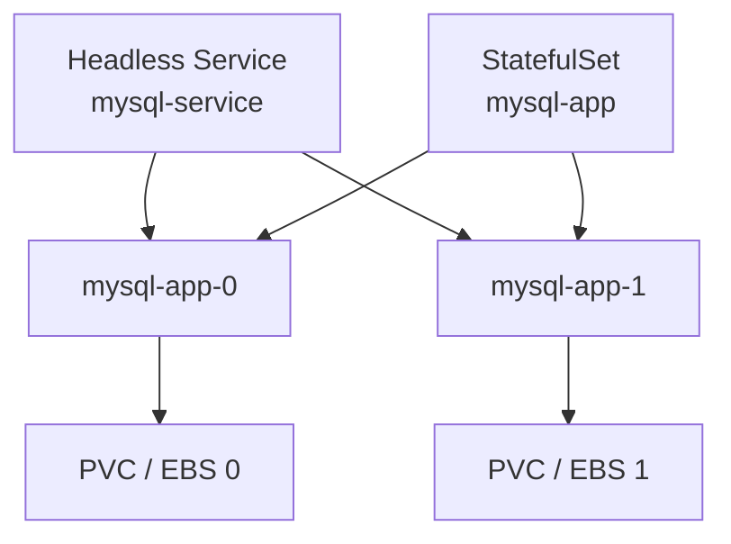

# Kubernetes StatefulSet

> [!summary]
> Deployment의 Pod는 서로 바꿔도 되는 복제본에 가깝다.  
> **StatefulSet은 각 Pod에 고정된 이름·순서·저장공간을 주어 서로 구분해야 하는 Application을 관리**한다.

## 1. 왜 필요한가

Web Server처럼 어느 Pod가 요청을 받아도 상관없다면 Deployment가 잘 맞는다. 그러나 다음 System은 각 Instance의 정체성이 중요할 수 있다.

- Database
- Message Broker
- 분산 저장소
- Leader·Follower 또는 Member 번호가 있는 Cluster

예를 들어 Database Pod가 재생성될 때마다 이름과 Disk가 무작위로 바뀌면 “기존 Data를 가진 0번 Member”를 다시 찾기 어렵다.

## 2. Deployment와 차이

| 구분 | Deployment | StatefulSet |
|---|---|---|
| Pod 이름 | 무작위 Hash 포함 | `mysql-app-0`, `mysql-app-1`처럼 순번 고정 |
| Pod 역할 | 서로 교체 가능하다고 가정 | Pod마다 고유 정체성을 가질 수 있음 |
| 생성·삭제 | 병렬 처리 가능 | 기본적으로 순서를 지킴 |
| 저장공간 | 보통 공통 Template | `volumeClaimTemplates`로 Pod별 PVC 생성 |
| 주 용도 | Stateless Web·API | Database·Broker·분산 System |

> [!warning]
> StatefulSet을 쓴다고 Database가 자동으로 복제되거나 고가용성이 되는 것은 아니다. MySQL Replication 같은 Application 수준 구성을 별도로 해야 한다.

## 3. 세 가지 핵심 장치

### 3.1 고정된 Pod 이름

```text
mysql-app-0
mysql-app-1
```

Pod가 다시 생성되어도 같은 순번과 이름을 유지한다.

### 3.2 Headless Service

```yaml
apiVersion: v1
kind: Service
metadata:
  name: mysql-service
spec:
  clusterIP: None
  selector:
    app: mysql
```

일반 Service처럼 하나의 대표 ClusterIP로 감추는 대신, 각 Stateful Pod를 DNS로 찾을 수 있게 돕는다.

```text
mysql-app-0.mysql-service
mysql-app-1.mysql-service
```

### 3.3 Pod별 PVC

```yaml
volumeClaimTemplates:
  - metadata:
      name: mysql-data
    spec:
      accessModes:
        - ReadWriteOnce
      storageClassName: ebs-sc
      resources:
        requests:
          storage: 1Gi
```

각 Pod는 자기 순번에 대응하는 PVC를 갖는다. Pod가 교체되어도 같은 PVC를 다시 Mount할 수 있다.

## 4. 전체 연결 구조



각 Pod가 **고정 이름 + 고정 DNS + 자기 저장공간**을 갖는 것이 핵심이다.

## 5. 최소 Manifest 골격

```yaml
apiVersion: apps/v1
kind: StatefulSet
metadata:
  name: mysql-app
spec:
  serviceName: mysql-service
  replicas: 2
  selector:
    matchLabels:
      app: mysql
  template:
    metadata:
      labels:
        app: mysql
    spec:
      containers:
        - name: mysql
          image: mysql:5.7
          volumeMounts:
            - name: mysql-data
              mountPath: /var/lib/mysql
  volumeClaimTemplates:
    - metadata:
        name: mysql-data
      spec:
        accessModes:
          - ReadWriteOnce
        storageClassName: ebs-sc
        resources:
          requests:
            storage: 1Gi
```

`serviceName`은 앞에서 만든 Headless Service 이름과 같아야 한다.

## 6. 최소 사용·확인 순서

```bash
# Namespace·Secret·Headless Service·StatefulSet 적용
kubectl apply -f 01-namespace-mysql.yml
kubectl apply -f mysql-scret.yml
kubectl apply -f mysql-sts.yml

# Pod와 순번 확인
kubectl get statefulset,pod -n mysql

# Pod별 PVC 확인
kubectl get pvc,pv -n mysql

# 생성·Scheduling·Volume Event 확인
kubectl describe pod mysql-app-0 -n mysql
kubectl describe pvc -n mysql

# Pod별 DNS 확인
kubectl get service -n mysql
```

문제가 생기면 `StatefulSet → Pod → PVC → StorageClass → CSI Driver` 순으로 좁힌다.

## 7. 현재 EKS 실습 환경 경계

현재 `mysql-sts.yml`은 `storageClassName: ebs-sc`를 요구한다. 그러나 2026-07-27 확인 시 EBS CSI Driver가 설치되어 있지 않다.

예상되는 흐름:

1. StatefulSet과 PVC Object는 생성될 수 있다.
2. `ebs-sc`가 없거나 CSI Driver가 작동하지 않으면 PVC가 `Pending`이 된다.
3. Storage가 준비되지 않아 MySQL Pod도 정상 기동하지 못할 수 있다.

따라서 이번 실습에서 `Pending`이 발생하면 StatefulSet 문법부터 의심하기보다 Volume 기반을 먼저 확인한다.

또한 `mysql:5.7`은 현재 실무의 최신 선택이 아니라 강의 재현용 Image로 본다.

## 8. 실무·보안에서 중요한 것

- Kubernetes Secret은 기본적으로 Base64 표현일 뿐, 그 자체가 강력한 암호화는 아니다.
- Database Password를 Git에 평문으로 추적하지 않는다.
- StatefulSet과 PVC가 있어도 Backup·Point-in-time Recovery·복구 시험은 별도다.
- Pod를 강제 삭제하거나 순서를 무시하면 Cluster Application의 안전 규칙을 깨뜨릴 수 있다.
- `Readiness Probe` 없이 Service에 연결하면 준비되지 않은 DB가 Traffic을 받을 수 있다.
- Scaling 전에 Application이 새 Member 추가·Data 복제를 지원하는지 확인한다.
- StatefulSet 삭제 시 PVC가 남을 수 있으므로 비용과 Data 보존을 함께 확인한다.

## 9. 지금은 이것만 기억한다

1. StatefulSet은 상태가 있다는 뜻보다 **각 Pod의 정체성을 유지하는 Controller**라는 점이 중요하다.
2. Pod 이름은 `-0`, `-1`처럼 고정된다.
3. Headless Service가 Pod별 DNS를 제공한다.
4. `volumeClaimTemplates`는 Pod마다 별도 PVC를 만든다.
5. StatefulSet만으로 Database 복제·Backup·고가용성이 완성되지는 않는다.

## 근거

- 원자료: [[10_학습 노트/클라우드/Kubernetes/Source Digest/Kubernetes - Source Digest 13 StatefulSet]]
- [Kubernetes StatefulSet](https://kubernetes.io/docs/concepts/workloads/controllers/statefulset/)
- [Kubernetes Headless Service](https://kubernetes.io/docs/concepts/services-networking/service/#headless-services)
- [Kubernetes Persistent Volumes](https://kubernetes.io/docs/concepts/storage/persistent-volumes/)

> [!info] 정보 경계
> 강의 Manifest와 현재 Driver 부재는 Local primary evidence다. StatefulSet의 보장과 Headless Service 역할은 Kubernetes 공식 문서로 확인했다. Database 운영 조언과 비유는 실무 이해를 위한 Parametric knowledge다.
