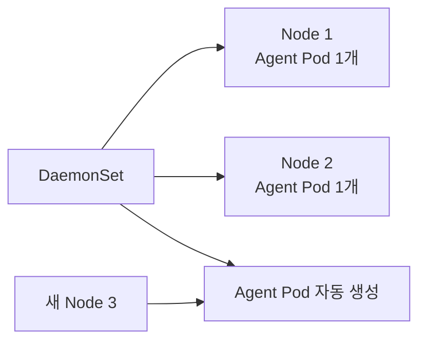

# Kubernetes DaemonSet

> [!summary]
> Deployment는 “Pod를 몇 개 둘까?”를 관리한다.  
> **DaemonSet은 “대상 Node마다 이 Pod가 하나씩 있어야 한다”를 관리**한다.

## 1. 왜 필요한가

어떤 Program은 사용자 요청을 처리하는 일반 Application이 아니라, 각 Server를 관찰하거나 보조해야 한다.

- 각 Node의 Log 수집 Agent
- Monitoring Agent
- Security·Runtime 탐지 Agent
- Network Plugin
- Storage CSI Node Plugin

Node가 2대면 Agent도 2개, 새 Node가 추가되면 Agent도 자동으로 하나 추가되어야 한다. 이를 사람이 매번 배포하지 않게 하는 Controller가 DaemonSet이다.

## 2. Deployment와 차이

| 질문 | Deployment | DaemonSet |
|---|---|---|
| Pod 수의 기준 | `replicas` | 조건에 맞는 Node 수 |
| 새 Node가 추가되면 | 반드시 Pod가 생기지는 않음 | 대상 Node라면 Pod 자동 생성 |
| Node가 제거되면 | 다른 Node에서 replica 유지 | 해당 Node의 Daemon Pod도 사라짐 |
| 대표 용도 | Web·API | Log·Monitoring·Network·Security Agent |

DaemonSet에는 보통 `replicas: 3` 같은 고정 수를 쓰지 않는다.

## 3. 동작 흐름



모든 Node가 아니라 `nodeSelector`, Node Affinity, Taint와 Toleration을 이용해 **일부 Node에만** 배치할 수도 있다.

## 4. 최소 Manifest 골격

```yaml
apiVersion: apps/v1
kind: DaemonSet
metadata:
  name: log-agent
  namespace: logging
spec:
  selector:
    matchLabels:
      app: log-agent
  template:
    metadata:
      labels:
        app: log-agent
    spec:
      containers:
        - name: log-agent
          image: example/log-agent:1.0
          volumeMounts:
            - name: node-log
              mountPath: /var/log
              readOnly: true
      volumes:
        - name: node-log
          hostPath:
            path: /var/log
            type: Directory
```

Node의 `/var/log`를 읽는 Agent이므로 `hostPath`가 등장한다. 이것은 DaemonSet에 필수라서가 아니라 **Agent가 Node Log를 읽어야 하기 때문**이다.

## 5. 최소 사용·확인 순서

```bash
# Manifest가 사용하는 Namespace가 있는지 먼저 확인
kubectl get namespace logging

# 없으면 생성
kubectl create namespace logging

# DaemonSet 적용
kubectl apply -f daemonset-basic.yml

# 원하는 Node 수만큼 배치됐는지 확인
kubectl get daemonset,pod -n logging -o wide

# 배치 실패와 Mount Event 확인
kubectl describe daemonset fluentd-elasticsearch -n logging

# 새 Node가 생긴 뒤 Pod가 자동으로 추가되는지 관찰
kubectl get pod -n logging -o wide --watch
```

확인할 핵심은 `DESIRED`, `CURRENT`, `READY`가 대상 Node 수와 맞는지다.

## 6. 현재 강의 예제의 의미

`daemonsets/daemonset-basic.yml`은 다음을 보여 준다.

- `fluentd-elasticsearch` Pod를 각 대상 Node에 배치한다.
- Node의 `/var/log`를 Mount한다.
- 각 Node에서 발생한 Log를 수집하는 Agent 형태를 재현한다.

현재 주의점:

- `logging` Namespace가 먼저 존재해야 한다.
- `quay.io/fluentd_elasticsearch/fluentd:v2.5.2`는 오래된 강의 Image이므로 실무 도입 후보로 그대로 채택하지 않는다.
- 강의 파일이 실행되는지와 Image가 현재 안전하게 유지되는지는 별도 판단이다.

## 7. 왜 보안 과정에서도 중요한가

보안 Agent는 한 Node만 빠져도 사각지대가 생길 수 있다. DaemonSet은 다음 조건을 코드로 유지한다.

> “새 Worker Node가 생기더라도 Log·탐지 Agent가 빠지지 않아야 한다.”

하지만 DaemonSet Agent는 Host 정보에 접근하는 경우가 많아 침해되면 영향도 크다.

- 불필요한 `privileged: true`를 피한다.
- `hostPath`는 필요한 경로만 Mount한다.
- 읽기만 하면 된다면 `readOnly: true`를 사용한다.
- Resource Request·Limit를 두어 Agent가 Node를 굶기지 않게 한다.
- Image 출처·Version·서명을 검토한다.
- ServiceAccount와 RBAC 권한을 최소화한다.

## 8. Scheduling과의 연결

System Node에만 배치:

```yaml
nodeSelector:
  role: system
```

Taint가 있는 Node에도 배치해야 할 때:

```yaml
tolerations:
  - key: dedicated
    operator: Equal
    value: system
    effect: NoSchedule
```

“모든 Node”라는 표현은 실제로는 **Scheduling 조건을 만족하는 모든 대상 Node**라는 뜻이다.

## 9. 지금은 이것만 기억한다

1. DaemonSet은 대상 Node마다 Pod 하나를 유지한다.
2. 새 Node가 생기면 Agent Pod도 자동으로 생긴다.
3. Log·Monitoring·Security·Network·Storage Agent에 잘 맞는다.
4. Node 접근 권한이 큰 경우가 많으므로 보안 위험도 함께 커진다.
5. Deployment의 replica 수 관리와 DaemonSet의 Node Coverage 관리를 구분한다.

## 근거

- 원자료: [[10_학습 노트/클라우드/Kubernetes/Source Digest/Kubernetes - Source Digest 14 DaemonSet]]
- [Kubernetes DaemonSet](https://kubernetes.io/docs/concepts/workloads/controllers/daemonset/)
- [Kubernetes에서 DaemonSet 생성](https://kubernetes.io/docs/tasks/manage-daemon/create-daemon-set/)

> [!info] 정보 경계
> 강의 Manifest의 Image·Namespace·Mount 경로는 Local primary evidence다. DaemonSet의 동작 보장은 Kubernetes 공식 문서로 확인했다. 보안 Agent 사례와 운영 조언은 일반적인 실무 적용을 설명하는 Parametric knowledge다.
