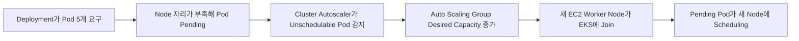

# Kubernetes AutoScaling

> [!summary]
> AutoScaling은 하나의 기능이 아니다.  
> **HPA는 Pod 수, VPA는 Pod가 요청하는 Resource, Cluster Autoscaler는 Node 수**를 조절한다.

## 1. 왜 필요한가

Traffic이 늘 때 사람이 매번 Pod와 EC2를 추가하면 대응이 늦고 실수하기 쉽다. 반대로 최대 부하만 생각해 Server를 항상 많이 켜 두면 비용이 낭비된다.

AutoScaling의 목표:

- 필요한 순간에 처리 용량을 늘린다.
- 부하가 줄면 불필요한 Resource를 줄인다.
- 사람이 반복하던 확장 판단을 Controller가 수행한다.

그러나 잘못된 Request·Limit, 느린 기동, Stateful Application, 외부 병목은 AutoScaling만으로 해결되지 않는다.

## 2. 세 종류를 분리한다

| 종류 | 조절 대상 | 판단 재료 | 쉬운 표현 |
|---|---|---|---|
| HPA | Pod replica 수 | CPU·Memory·Custom Metric | 직원 수를 늘리거나 줄임 |
| VPA | Pod의 Request·Limit | 실제 Resource 사용량 | 직원 한 명에게 줄 장비 크기를 조절 |
| Cluster Autoscaler | Worker Node 수 | Scheduling되지 못한 Pod와 비어 가는 Node | 사무실 자체를 늘리거나 줄임 |

> [!important]
> HPA와 Cluster Autoscaler는 경쟁 관계가 아니다. HPA가 Pod를 늘렸는데 놓을 자리가 없으면 Cluster Autoscaler가 Node를 늘리는 식으로 연결될 수 있다.

## 3. HPA: Pod 수를 조절한다

```bash
kubectl autoscale deployment web \
  --cpu-percent=60 \
  --min=2 \
  --max=10
```

```yaml
apiVersion: autoscaling/v2
kind: HorizontalPodAutoscaler
metadata:
  name: web
spec:
  scaleTargetRef:
    apiVersion: apps/v1
    kind: Deployment
    name: web
  minReplicas: 2
  maxReplicas: 10
  metrics:
    - type: Resource
      resource:
        name: cpu
        target:
          type: Utilization
          averageUtilization: 60
```

HPA가 CPU 비율을 제대로 판단하려면 Container의 `resources.requests.cpu`가 필요하다. Resource Metric을 쓰는 일반적인 구성에서는 Metrics Server 같은 Metric Pipeline도 필요하다.

## 4. VPA: Pod 크기를 조절한다

VPA는 사용량을 관찰해 적절한 CPU·Memory Request를 추천하거나 적용한다.

적합한 상황:

- Request를 얼마나 줘야 할지 Data를 통해 조정
- 지속적으로 Resource가 과다·과소 할당되는 Workload

주의:

- 설정에 따라 Pod를 재생성해야 새 Resource 값이 적용될 수 있다.
- HPA와 같은 CPU·Memory Metric을 동시에 기준으로 사용하면 상호작용을 검토해야 한다.
- 기본 EKS에 자동으로 항상 설치되는 기능이라고 가정하면 안 된다.

## 5. Cluster Autoscaler: Node 수를 조절한다



중요한 판단 재료는 순간 CPU 사용률이 아니라 **Scheduler가 보는 Resource Request와 Scheduling 조건**이다.

- CPU·Memory Request
- Node Selector·Affinity
- Taint·Toleration
- Availability Zone과 Volume 제약

Pod가 Pending이라고 모두 Node를 늘려 해결되는 것도 아니다. 존재하지 않는 Label을 요구하거나 PVC가 준비되지 않은 경우에는 Node를 늘려도 해결되지 않는다.

## 6. 현재 `cluster-asg.yml`의 정확한 역할

`cluster-autoscaler/cluster-asg.yml`은 Cluster Autoscaler를 설치하는 파일이 아니다.

이 파일은:

- `delivery` Namespace에 Deployment를 만든다.
- Pod 5개를 요구한다.
- 각 Pod가 CPU `700m`, Memory `500Mi`를 Request한다.
- 기존 Node에 자리가 부족한 상황을 의도적으로 만든다.

즉 **이미 설치된 Cluster Autoscaler가 반응하는지 시험하는 압력 Workload**다.

강의 Image `kys8502/boot:latest`는 사용자 Image로 바꿀지 확인해야 하며, Image 변경과 AutoScaling 원리 검증은 구분한다.

## 7. 현재 EKS 실습 환경 경계

2026-07-27 Runtime 확인 기준:

- `cluster-autoscaler` Pod는 `kube-system`에서 실행 중이다.
- Worker Node는 2대다.
- 연결된 Auto Scaling Group은 `min=2`, `desired=2`, `max=4`다.
- 따라서 `cluster-asg.yml`로 Scheduling 압력을 만들고 Node 증가를 관찰하는 실습은 가능하다.
- Metrics Server는 확인되지 않았으므로 HPA Runtime은 바로 가능하다고 가정하지 않는다.

관찰 명령:

```bash
# Pod Pending과 Node 증가를 같이 관찰
watch -n 1 'kubectl get node; echo; kubectl get pod -n delivery -o wide'

# Cluster Autoscaler 판단 Log
kubectl logs -n kube-system deployment/cluster-autoscaler --tail=200 -f

# Pending 이유
kubectl describe pod -n delivery <POD_NAME>

# Deployment 적용
kubectl apply -f cluster-asg.yml
```

실습 후에는 Workload와 Node 수가 줄어드는지까지 확인한다. Scale-in은 즉시 일어나지 않을 수 있다.

## 8. 실무·보안·비용에서 중요한 것

- `max`를 무제한처럼 크게 두면 장애나 공격 Traffic이 비용 폭증으로 이어질 수 있다.
- Request가 너무 크면 실제 사용량이 낮아도 Node가 불필요하게 늘 수 있다.
- Request가 너무 작으면 Scheduling은 되지만 실제 부하에서 Resource 부족이 난다.
- 새 Node가 준비되는 데 시간이 걸리므로 순간 Spike를 AutoScaling만으로 흡수하지 못할 수 있다.
- Scale-in 때 Pod가 안전하게 빠지도록 Readiness, Graceful Shutdown, PDB를 검토한다.
- DaemonSet Pod와 System Pod가 새 Node의 일부 Resource를 사용한다.
- 외부 Database·API가 병목이면 Pod만 늘려도 처리량이 늘지 않는다.

## 9. 실무에서 자주 쓰는 조합

```text
HPA
→ Traffic 증가에 따라 Pod 증가
→ 기존 Node에 빈자리 부족

Cluster Autoscaler
→ Pending Pod를 보고 Node 증가
→ 새 Node에 Pod Scheduling

VPA 또는 관측 자료
→ Request가 실제 사용량과 크게 어긋나지 않게 조정
```

세 기능을 무조건 모두 켜는 것이 정답은 아니다. Workload 성격과 Metric 신뢰도를 먼저 본다.

## 10. 지금은 이것만 기억한다

1. HPA는 Pod 수, VPA는 Pod 크기, Cluster Autoscaler는 Node 수를 조절한다.
2. Cluster Autoscaler는 Resource Request 때문에 배치되지 못한 Pod를 중요하게 본다.
3. `cluster-asg.yml`은 Autoscaler 설치 파일이 아니라 Scale-out을 유도하는 시험 Workload다.
4. Pending 원인이 잘못된 Label이나 Storage라면 Node를 늘려도 해결되지 않는다.
5. AutoScaling은 성능 기능이면서 동시에 비용·장애·보안 통제 대상이다.

## 근거

- 원자료: [[10_학습 노트/클라우드/Kubernetes/Source Digest/Kubernetes - Source Digest 15 AutoScaling]]
- [Kubernetes Horizontal Pod Autoscaling](https://kubernetes.io/docs/concepts/workloads/autoscaling/horizontal-pod-autoscale/)
- [Kubernetes Node Autoscaling](https://kubernetes.io/docs/concepts/cluster-administration/node-autoscaling/)
- [Amazon EKS Cluster Autoscaler Best Practices](https://docs.aws.amazon.com/eks/latest/best-practices/cas.html)

> [!info] 정보 경계
> 현재 Controller·Node·ASG 상태와 강의 Manifest 역할은 Local primary evidence다. HPA와 Node Autoscaling 동작은 Kubernetes·AWS 공식 문서로 확인했다. 비유와 운영·비용 설명은 Parametric knowledge다.
