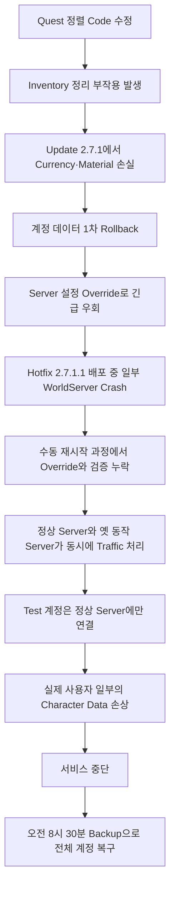
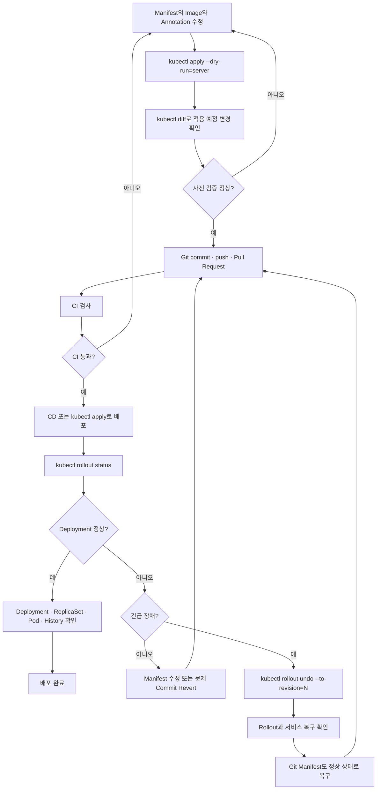

# EKS Deployment 기초와 Rolling Update 실습

> [!summary]
> `deploy-basic` Deployment를 생성하고 `httpd:alpine3.23 → httpd:alpine3.24 → unoh03/boot:latest`로 Pod Template Image를 변경했다. 각 변경에서 새 ReplicaSet과 Revision이 생겼고, `kubectl rollout undo`로 직전 `httpd:alpine3.24` Template을 현재 Revision 4로 되돌리는 과정까지 확인했다. 이후 `prod`와 `stage` Namespace에 같은 이름의 Deployment를 독립적으로 배포하고 Namespace 삭제 시 하위 Workload가 함께 제거되는 과정도 검증했다.

> [!info] 선행 실습
> Pod와 ReplicaSet의 직접 생성·Scale·Self-Healing·Template 변경 원리는 [[Lab_EKS ReplicaSet 기초 실습]]에 기록한다. 이 노트는 Deployment가 ReplicaSet과 Pod Revision을 관리하는 단계부터 담당한다.

## Rolling Update를 배우기 전에: 만능이 아니다

> [!danger] Rolling Update는 “무중단 교체 방식”이지 “안전 보장 장치”가 아니다
> Kubernetes는 구 Version Pod를 조금씩 줄이고 신 Version Pod를 조금씩 늘린다. 그러나 두 Version의 Application·API·Database Schema·Session·Message 형식이 서로 호환되는지까지 판단하지 않는다.
>
> **구 Version과 신 Version이 동시에 요청을 처리해도 안전하다는 전제가 깨지면, Pod가 모두 `Running`·`Ready`여도 서비스 오류나 데이터 손상이 발생할 수 있다.**

이번 실습에서도 `httpd:alpine3.23 → 3.24` 교체 중 신 Version Pod 5개와 구 Version Pod 1개가 동시에 조회됐다. 이것은 오류가 아니라 Rolling Update의 정상 중간 상태다. 따라서 Application은 이 공존 구간을 견딜 수 있어야 한다.

## 실제 장애 사례: Destiny 2 계정 데이터 손상과 전체 Rollback

> [!info] 근거 분류
> **② Authoritative external evidence** — [Bungie 개발팀의 공식 장애 분석](https://www.bungie.net/7/en/News/article/48723)을 초보자 관점에서 재구성했다.

이 사건의 핵심은 단순히 “배포한 Server가 고장났다”가 아니다.

> **정상 동작하는 Server와 오래된 잘못된 동작을 하는 Server가 동시에 사용자 요청을 처리했고, 일반적인 Test와 Version 검증이 그 혼합 상태를 발견하지 못해 실제 계정 데이터가 손상된 사건**이다.

### 1. 시작점: Inventory 정리 Code의 작은 수정

Destiny 2는 Quest도 Currency·Material과 비슷한 Inventory Item으로 관리한다. 사용자가 Login할 때 Inventory를 정리하는 Code가 실행되며, Item별 보유 한도 같은 현재 규칙에 맞춰 데이터를 정돈한다.

Bungie는 Quest 정렬 문제를 고치기 위해 일부 Quest의 Timestamp를 초기화하지 않도록 Code를 수정했다. 의도는 Quest 획득 순서를 보존하는 것이었지만, 이 변경에는 예상하지 못한 부작용이 있었다.

```text
의도
Quest Timestamp 초기화를 막아 획득 순서를 보존

실제 부작용
Inventory 정리 과정의 더 넓은 부분까지 비활성화
→ 중첩 Item의 최대 보유량을 잘못 계산
→ 한도를 넘었다고 판단된 Currency·Material 손실
```

두 명의 담당자가 Code Review까지 수행했고 내부 Test에서도 이상 현상을 발견했지만, Test 도구의 문제라고 잘못 판단했다. 결국 버그는 2020년 1월 28일 Update `2.7.1`에 포함됐고, Bungie는 첫 번째 계정 데이터 Rollback을 수행했다.

### 2. 빠른 복구를 위한 임시 설정 Override

정식 실행 파일 전체를 새로 Build·배포하려면 시간이 걸린다. Bungie는 긴급 복구를 위해 WorldServer의 설정을 바꿔 문제가 있는 Character Data 처리 Code를 Override하고, Server를 재시작해 새 설정을 읽게 했다.

```text
문제가 있는 Game Code
       ↓
Server 설정 Override로 문제 동작을 우회
       ↓
WorldServer 재시작
       ↓
수정 설정을 읽은 Server는 정상 처리
```

이 방식은 빠르지만 중요한 전제가 있다.

> **모든 WorldServer가 재시작하면서 같은 Override를 읽고, 그 적용 여부를 검증해야 한다.**

정식 Code가 교체된 것이 아니라 실행 시 읽는 설정으로 동작을 덮었기 때문에, 설정을 놓친 Server는 다시 옛 버그를 실행할 수 있었다.

### 3. 두 번째 장애: 일부 WorldServer만 옛 동작으로 복귀

2020년 2월 11일 Hotfix `2.7.1.1`과 Crimson Days가 배포됐다. WorldServer가 대량으로 동시에 시작하면서 일부가 시작 단계에서 Crash했다. Bungie는 이전에도 이 현상을 겪었고, 당시에는 Crash한 Server를 수동으로 재시작하면 별다른 사용자 문제가 보이지 않았다.

이번에는 달랐다. 수동 재시작된 일부 WorldServer가 다음 두 단계를 모두 건너뛰었다.

1. Character Data 손상을 막는 설정 Override 적용
2. 예상 Version·Configuration으로 실행 중인지 확인하는 검증

Bungie는 당시 이 두 절차를 함께 우회하는 실행 경로가 존재할 수 없다고 생각했다. 하지만 실제로는 다음 두 종류의 Server가 동시에 서비스에 들어왔다.

```text
대부분의 WorldServer
→ 설정 Override 적용
→ Version·Configuration 검증 통과
→ 정상적인 Character Data 처리

일부 재시작 WorldServer
→ 설정 Override 누락
→ 검증 절차도 건너뜀
→ 이전 버그가 있는 방식으로 Character Data 처리
```

### 4. 왜 Test에서 발견하지 못했나

Bungie의 운영 환경에는 수백 대의 Server가 있었다. 잘못된 상태의 Server는 전체 중 극히 일부였고, Test 계정으로 수행한 수동 Login은 우연히 모두 정상 Server에 연결됐다.

```text
Test 계정 몇 개
→ 모두 정상 Server에 연결
→ “배포 정상” 판정

실제 사용자 수십만 명
→ 일부는 잘못된 Server에 연결
→ Currency·Material 손실
```

이것은 “Test를 하지 않았다”는 문제가 아니다. **표본 Test가 전체 Server Fleet의 상태 다양성을 확인하지 못한 문제**다. Process가 실행 중인지 확인하는 것만으로는 각 Server가 같은 Code·Configuration·Override를 적용했는지 알 수 없다.

### 5. 왜 일부 계정만 고치지 않고 전체를 Rollback했나

잘못된 WorldServer에 Character가 한 번이라도 접근되면 Currency·Material이 손상될 수 있었다. Bungie가 문제를 조사하는 동안 수십만 명의 사용자가 Game에 Login하거나 외부 Service를 통해 Character Data에 접근했다.

어떤 계정이 어느 Server를 거쳤고 정확히 무엇을 잃었는지 완벽하게 식별하려다 한 건이라도 놓치면 손상이 남는다. Bungie는 이 위험을 감수하는 대신 모든 Character Data를 Hotfix 배포 직전인 오전 8시 30분 PST Backup으로 복구했다.

그 결과:

- 손상된 Currency·Material은 복구됐다.
- 정상적으로 플레이한 사용자도 Backup 이후의 Quest 진행·획득 Item을 잃었다.
- Application Server만 이전 Version으로 돌리는 Rollback으로는 부족했고, **이미 변경된 사용자 데이터까지 Backup으로 복원**해야 했다.

### 6. 사건 전체 흐름



### 7. Rolling Update와 정확히 어떤 관계인가

> [!important] 이 사건은 Kubernetes 사고로 확인된 것이 아니다
> Bungie는 WorldServer가 Kubernetes에서 실행됐다거나 Kubernetes Rolling Update가 실패했다고 밝히지 않았다. 따라서 이 사례를 “Kubernetes 장애 사례”라고 부르면 안 된다.

그럼에도 Rolling Update를 배울 때 중요한 이유는 운영 위험의 형태가 같기 때문이다.

| Destiny 2 사건 | Kubernetes Rolling Update에서 대응하는 위험 |
|---|---|
| 정상 Server와 Override가 빠진 Server가 공존 | 구 Version Pod와 신 Version Pod가 함께 Traffic 처리 |
| Server Process는 실행됐지만 동작 상태가 다름 | Pod가 `Running`이어도 Configuration·Migration·Cache 상태가 다를 수 있음 |
| 일부 Server가 Version 검증을 우회 | 부실한 Readiness Probe가 준비되지 않은 Pod를 정상으로 판정 |
| Test 계정이 정상 Server에만 연결 | 소수 Sample Request가 문제 Pod를 우연히 피함 |
| Character Data가 이미 손상됨 | Application Rollback만으로 Database·외부 상태가 복구되지 않음 |
| 전체 계정을 Backup으로 복원 | 별도의 Data Backup·복구 절차가 필요 |

즉, Kubernetes가 새 Pod 5개를 모두 `Running`·`Ready`로 만들었다고 해도 다음은 별도로 검증해야 한다.

- 모든 Pod가 기대한 Image Digest와 Configuration을 사용하는가?
- 구·신 Version이 같은 Request와 Data를 안전하게 처리하는가?
- 실제 Business 동작을 검사하는 Readiness·Smoke Test가 있는가?
- 일부 Pod만 잘못됐을 때 탐지할 Metric과 Version 표시가 있는가?
- 이미 변경된 Database·Queue·사용자 데이터를 어떻게 복구할 것인가?

### 8. Bungie가 선택한 재발 방지 방향

Bungie는 사후 대책으로 다음 방향을 제시했다.

- Server가 예상하지 않은 Version으로 시작하지 못하도록 Hot Patch 절차에 보호 장치 추가
- 일부 WorldServer가 시작 중 Crash하던 원인 수정
- 설정 Override가 아니라 다음 Update의 실행 Code에 영구 수정 포함
- Rollback과 복구 속도 개선
- Server가 설정 Loading을 건너뛰는 경로 차단
- Login 시 실행되는 중요 데이터 정리 Code의 보호와 개발 절차 강화

Kubernetes 관점으로 번역하면 **Immutable Image, 배포 전후 Version 검증, 정확한 Probe, Fleet 전체 관찰, Data 복구 계획**을 함께 준비해야 한다는 뜻이다.

## Rolling Update의 실무 위험과 대응

| 상황 | 구·신 Version 공존 시 발생 가능한 문제 | 필요한 대응 |
|---|---|---|
| Database Schema 변경 | 신 Version이 Column을 삭제·이름 변경하면 구 Version Query가 실패 | 먼저 새 Column을 추가하고 양쪽 Version이 호환되게 한 뒤, 구 Version 제거 후 옛 Column 삭제 |
| API·Message 형식 변경 | 신 Version이 만든 Response·Event를 구 Version이 해석하지 못함 | Versioning, 하위 호환, Contract Test |
| Session·인증 형식 변경 | 요청이 구·신 Pod를 오갈 때 Cookie·Token·Session을 서로 읽지 못해 `401`·Login 반복 | 공통 Key와 호환 가능한 Session 형식 유지 |
| 잘못된 Readiness Probe | Process만 켜졌지만 Cache Warm-up·외부 연결·Migration이 끝나지 않은 Pod에 Traffic 전달 | 실제 요청 처리 가능 여부를 확인하는 Readiness·Startup Probe 설계 |
| Resource 여유 부족 | `maxSurge`로 만든 추가 Pod를 배치할 CPU·Memory가 없어 Rollout 정지 | 배포 전 여유 Capacity와 Scheduling 조건 확인 |
| 상태·데이터 변경 | Application Pod만 Rollback해도 이미 변경된 DB·외부 상태는 자동 복구되지 않음 | Backup, 호환 가능한 Migration, Roll-forward·복구 절차 준비 |
| 단일 Worker·중복 처리 민감 작업 | 구·신 Worker가 같은 Queue Message를 서로 다른 방식으로 처리 | Leader Election, 중복 방지, 작업 Version 분리 |

> [!tip] Rolling Update가 적합한 조건
> - 구·신 Version이 동시에 실행돼도 호환된다.
> - Readiness가 “실제로 요청을 처리할 준비”를 정확히 판정한다.
> - `maxSurge`를 감당할 Resource 여유가 있다.
> - 오류율·Latency·Business Metric을 관찰할 수 있다.
> - Application뿐 아니라 Database·Message·외부 상태까지 복구 계획이 있다.

위 조건을 만족하지 못하면 Blue/Green, Canary, 점검 시간 배포, 단계적 Database Migration 등을 검토한다. `Recreate`는 구·신 Pod 공존을 없애지만 Downtime이 생기며, 이미 변경된 Database나 외부 상태까지 자동으로 되돌리지는 않는다.

## 목표

- Deployment → ReplicaSet → Pod의 소유·관리 계층을 확인한다.
- Pod Template 변경이 새 ReplicaSet과 Revision을 만드는 과정을 관찰한다.
- 구·신 Version Pod가 함께 존재하는 Rolling Update 중간 상태를 확인한다.
- `kubectl describe deployment`의 Strategy·Condition·Event를 해석한다.

## 1. Deployment Directory 진입과 예행

강의자료 Directory에는 Deployment 관련 Manifest가 함께 있었다.

```text
deployment-basic.yml
deployment-prod.yml
deployment-rolling-update.yml
deployment-stage.yml
dp-basic.yml
```

처음에는 존재하지 않는 `dp` 경로를 지정해 실패했다.

```console
$ kubectl apply -f dp
error: the path "dp" does not exist
```

정확한 파일명인 `dp-basic.yml`을 지정하자 `dp-basic` Deployment와 Pod 5개가 정상 생성됐다. 이후 해당 예행 Resource를 정리하고, 현재 강의 흐름은 `deployment-basic.yml`의 `deploy-basic`으로 다시 시작했다.

파일명과 Object 이름이 비슷하므로 다음 세 이름을 구분해야 한다.

```text
dp-basic.yml          → 예행 파일
deployment-basic.yml  → 현재 작업 파일
deploy-basic          → 현재 Deployment Object 이름
```

## 2. 첫 Version 생성

현재 실습을 시작할 때 Namespace에는 Deployment와 Pod가 없었다.

```console
$ kubectl get deploy -o wide
No resources found in default namespace.

$ kubectl get pod -o wide
No resources found in default namespace.
```

`deployment-basic.yml`의 첫 Image는 `httpd:alpine3.23`이었다.

```yaml
apiVersion: apps/v1
kind: Deployment
metadata:
  name: deploy-basic
spec:
  replicas: 5
  selector:
    matchLabels:
      develop: spring-boot
  template:
    metadata:
      labels:
        name: pod-basic
        app: web
        develop: spring-boot
    spec:
      containers:
        - name: web-containers
          image: httpd:alpine3.23
          ports:
            - containerPort: 80
```

```console
$ kubectl apply -f deployment-basic.yml
deployment.apps/deploy-basic created
```

생성 직후 상태는 5/5였다.

```text
NAME          READY  UP-TO-DATE  AVAILABLE  IMAGE
deploy-basic  5/5    5           5          httpd:alpine3.23
```

Pod 다섯 개도 모두 `httpd:alpine3.23`을 사용했다.

## 3. Deployment가 만든 하위 Object

사용자는 Deployment 하나를 생성했지만 Cluster에서는 다음 계층이 만들어졌다.

```text
Deployment deploy-basic
└─ ReplicaSet deploy-basic-65c6c974d4
   └─ Pod 5개
```

ReplicaSet과 Pod에는 같은 `pod-template-hash=65c6c974d4`가 붙었다. 이 Hash는 Deployment가 서로 다른 Pod Template Revision의 ReplicaSet을 구분하는 데 사용한다.

ReplicaSet을 직접 만들었던 이전 실습과 달리, 여기서는 Deployment Controller가 ReplicaSet을 생성하고 Scale했다.

## 4. Image를 `3.23→3.24`로 변경

Manifest의 Pod Template Image를 변경했다.

```yaml
image: httpd:alpine3.24 # httpd:alpine3.23 -> httpd:alpine3.24
```

```console
$ kubectl apply -f deployment-basic.yml
deployment.apps/deploy-basic configured
```

ReplicaSet 직접 실습에서는 Template을 바꿔도 기존 Pod가 그대로였다. Deployment는 변경된 Template을 위한 새 ReplicaSet을 생성했다.

```text
Revision 1: deploy-basic-65c6c974d4  httpd:alpine3.23
Revision 2: deploy-basic-5b8cb8c465  httpd:alpine3.24
```

## 5. Rolling Update 중간 상태

Image를 변경한 직후 Pod를 조회하자 신·구 Version이 잠시 함께 보였다.

```text
httpd:alpine3.24 × 5
httpd:alpine3.23 × 1
```

조금 뒤 다시 조회했을 때는 신 Version 다섯 개만 남았다.

```text
httpd:alpine3.24 × 5
```

이는 한순간에 기존 Pod를 모두 삭제한 것이 아니라 새 Pod를 먼저 준비하면서 기존 Pod를 순차 종료했다는 증거다.

```text
Update 중간:
구 Version Pod + 신 Version Pod 공존

Update 완료:
신 Version Pod 5개
구 Version Pod 0개
```

## 6. 두 ReplicaSet과 Revision

Rollout 완료 후 Deployment 아래에는 ReplicaSet 두 개가 남았다.

```text
NAME                       REVISION  DESIRED  READY  IMAGE
deploy-basic-5b8cb8c465    2         5        5      httpd:alpine3.24
deploy-basic-65c6c974d4    1         0        0      httpd:alpine3.23
```

구 Version ReplicaSet은 Pod 수만 0으로 내려가고 Object는 남았다. 이 Revision 기록이 이후 Rollback의 기반이 된다.

```console
$ kubectl rollout history deployment/deploy-basic
REVISION  CHANGE-CAUSE
1         <none>
2         <none>
```

`CHANGE-CAUSE`가 `<none>`인 것은 Revision이 없다는 뜻이 아니라 별도 변경 사유 Annotation을 기록하지 않았다는 뜻이다.

## 7. `kubectl describe deployment` 해석

```console
$ kubectl describe deployment deploy-basic
```

### 현재 상태

```text
Replicas: 5 desired | 5 updated | 5 total | 5 available | 0 unavailable
```

- `desired`: 목표 Pod 수
- `updated`: 현재 최신 Template Revision을 사용하는 Pod 수
- `total`: Deployment가 관리하는 전체 Pod 수
- `available`: Traffic을 받을 수 있는 상태로 판단된 Pod 수
- `unavailable`: 아직 사용 가능하지 않은 Pod 수

### 기본 배포 전략

Manifest에 Strategy를 직접 쓰지 않았지만 API Server가 기본값을 적용했다.

```text
StrategyType: RollingUpdate
RollingUpdateStrategy: 25% max unavailable, 25% max surge
```

- `maxSurge`: 목표 수를 초과해 임시로 추가할 수 있는 새 Pod 한도
- `maxUnavailable`: Update 중 동시에 사용 불가능해도 되는 Pod 한도

이 값은 PDF p.88-p.90에서 별도로 다루는 개념이다. 이번 Runtime에서는 기본 전략이 적용된 사실과 신·구 Version 공존을 확인했지만, 값을 직접 변경하는 실습은 아직 하지 않았다.

### Condition

```text
Available   True  MinimumReplicasAvailable
Progressing True  NewReplicaSetAvailable
```

- 필요한 최소 Pod가 사용 가능하다.
- 새 ReplicaSet을 이용한 Rollout이 정상 진행·완료됐다.

### Event에 기록된 실제 교대

```text
구 Revision 1: 5→4→3→2→1→0
신 Revision 2: 0→2→3→4→5
```

Event에는 다음과 같은 `ScalingReplicaSet` 기록이 남았다.

```text
Scaled up replica set deploy-basic-5b8cb8c465 from 0 to 2
Scaled down replica set deploy-basic-65c6c974d4 from 5 to 4
Scaled up replica set deploy-basic-5b8cb8c465 from 2 to 3
...
Scaled down replica set deploy-basic-65c6c974d4 from 1 to 0
```

이 순서는 Deployment가 새 ReplicaSet을 늘리고 기존 ReplicaSet을 줄이는 방식으로 Rolling Update를 수행했다는 직접 증거다.

## 8. 저장 전 Apply와 Revision 3

`deployment-basic.yml`의 Image를 `unoh03/boot:latest`로 편집했지만, 처음에는 파일을 저장하지 않고 Apply했다.

```console
$ kubectl apply -f deployment-basic.yml
deployment.apps/deploy-basic unchanged
```

`kubectl apply`는 Editor 화면의 미저장 내용을 읽지 않고 Disk에 실제 저장된 Manifest를 읽는다. 파일에는 여전히 `httpd:alpine3.24`가 있었으므로 Cluster의 현재 상태와 차이가 없었다.

파일을 저장한 뒤 다시 Apply하자 변경이 반영됐다.

```console
$ kubectl apply -f deployment-basic.yml
deployment.apps/deploy-basic configured
```

새 Pod Template으로 Revision 3 ReplicaSet이 생성됐다.

```text
Revision 1  deploy-basic-65c6c974d4  httpd:alpine3.23    0/0
Revision 2  deploy-basic-5b8cb8c465  httpd:alpine3.24    0/0
Revision 3  deploy-basic-d6c756b96   unoh03/boot:latest  5/5
```

```console
$ kubectl rollout history deploy deploy-basic
REVISION  CHANGE-CAUSE
1         <none>
2         <none>
3         <none>
```

같은 Manifest를 다시 Apply한 `unchanged`는 새 Revision을 만들지 않았고, Pod Template Image가 실제로 변경된 `configured`에서만 Revision 3이 생겼다.

## 9. 직전 Revision Rollback

현재 Revision 3에서 별도 Revision 번호를 지정하지 않고 Rollback했다.

```console
$ kubectl rollout undo deploy deploy-basic
deployment.apps/deploy-basic rolled back
```

`--to-revision`을 생략하면 직전 Pod Template으로 되돌린다. 이 환경에서는 Revision 2의 `httpd:alpine3.24`가 대상이었다.

> [!tip] `--to-revision`이란?
> `kubectl rollout undo deployment/deploy-basic --to-revision=1`처럼 사용하며, 직전 상태가 아니라 **지정한 Revision의 Pod Template**으로 Rollback한다. 숫자는 `kubectl rollout history deployment/deploy-basic`에서 먼저 확인한다. Rollback 후에는 그 Template이 다시 현재 상태가 되면서 새로운 Revision으로 기록된다.

```console
$ kubectl get deploy -o wide
NAME          READY  UP-TO-DATE  AVAILABLE  IMAGE
deploy-basic  5/5    5           5          httpd:alpine3.24
```

Deployment는 Revision 2에서 사용했던 기존 ReplicaSet을 다시 Scale Up하고 Revision 3 ReplicaSet을 Scale Down했다.

```text
deploy-basic-5b8cb8c465  httpd:alpine3.24    0→5
deploy-basic-d6c756b96   unoh03/boot:latest  5→0
```

Rollback 후 최종 상태:

```text
Revision 1 RS  deploy-basic-65c6c974d4  0/0  httpd:alpine3.23
현재 RS        deploy-basic-5b8cb8c465  5/5  httpd:alpine3.24
이전 RS        deploy-basic-d6c756b96   0/0  unoh03/boot:latest
```

History는 다음처럼 바뀌었다.

```console
$ kubectl rollout history deploy deploy-basic
REVISION  CHANGE-CAUSE
1         <none>
3         <none>
4         <none>
```

Rollback은 “Revision 번호를 3에서 2로 낮추는 것”이 아니다. Revision 2의 Pod Template을 다시 현재 상태로 채택하는 **새 Rollout**이므로 현재 Revision은 4가 된다. 기존 `deploy-basic-5b8cb8c465` ReplicaSet을 재사용하지만 그 Template이 최신 Revision 4로 승격되어 History에서 2 대신 4로 표시된다.

> [!warning] Manifest와 Cluster의 현재 상태가 다름
> Rollback은 Cluster의 Deployment를 `httpd:alpine3.24`로 되돌렸지만 Bastion의 `deployment-basic.yml`에는 여전히 `unoh03/boot:latest`가 저장돼 있다. 이 파일을 그대로 다시 Apply하면 Rollback을 덮어쓰고 `unoh03/boot:latest`로 다시 Rollout될 수 있다. 원하는 최종 상태에 맞게 Manifest도 정렬해야 한다.

## 10. Change Cause Annotation

현재 Revision 4에 변경 이유를 기록했다.

```console
$ kubectl annotate deploy deploy-basic kubernetes.io/change-cause="3.24"
deployment.apps/deploy-basic annotated

$ kubectl rollout history deploy deploy-basic
REVISION  CHANGE-CAUSE
1         <none>
3         <none>
4         3.24
```

같은 Annotation의 값을 `unoh03`으로 다시 지정하자 Revision 번호는 그대로이고 설명만 바뀌었다.

```console
$ kubectl annotate deploy deploy-basic kubernetes.io/change-cause="unoh03"
deployment.apps/deploy-basic annotated

$ kubectl rollout history deploy deploy-basic
REVISION  CHANGE-CAUSE
1         <none>
3         <none>
4         unoh03
```

`annotate`는 Pod Template을 바꾸지 않으므로 새 ReplicaSet이나 새 Rollout을 만들지 않았다. 여기서는 현재 Revision 4의 `CHANGE-CAUSE` 설명만 갱신됐으며, 같은 Key를 다시 지정한 마지막 값이 보였다.

> [!example] Git으로 비유하면
> `commit`이나 `push` 없이 배포 Revision에 설명 메모를 붙이는 것에 가깝다. 다만 Git의 Commit Message를 고치는 것과는 다르다. Git Commit Message 수정은 Commit 자체를 다시 만들어 Hash가 바뀌지만, Kubernetes Annotation 수정은 Workload 내용과 Revision 번호를 그대로 둔 채 Resource의 부가 Metadata만 바꾼다.

## 11. 실무 배포 Sequence

실무에서는 **Git에 저장된 Manifest를 원하는 상태의 기준(Source of Truth)**으로 두고, Cluster는 그 Manifest가 배포된 결과로 취급하는 경우가 많다. 따라서 Image 변경, 변경 이유, 검증, 배포, 관찰, 복구를 하나의 흐름으로 관리한다.

### 11.1 Manifest에서 Image와 변경 이유 수정

Image와 `kubernetes.io/change-cause` Annotation을 같은 Manifest에 기록하면 무엇을 왜 배포했는지 Git에서 함께 추적할 수 있다.

```yaml
apiVersion: apps/v1
kind: Deployment
metadata:
  name: deploy-basic
  annotations:
    # 이번 배포의 변경 이유
    kubernetes.io/change-cause: "httpd 3.23 → 3.24 / 보안 업데이트"
spec:
  template:
    spec:
      containers:
        - name: web-containers
          # 새로 배포할 Container Image
          image: httpd:alpine3.24
```

> [!note] Annotation의 역할
> Annotation은 배포 자체를 실행하는 명령이 아니다. Resource에 부가 설명을 저장하는 Metadata다. Image처럼 Pod Template의 실행 내용을 변경해야 새 Deployment Revision과 ReplicaSet이 생성된다.

### 11.2 배포 전 검증

```bash
# Manifest를 API Server에 보내 문법·Resource Schema·Admission 규칙을 검증한다.
# 실제 Cluster에는 저장하지 않는다.
kubectl apply --dry-run=server -f deployment-basic.yml

# 현재 Cluster 상태와 적용 예정 Manifest를 비교한다.
# 실제로 변경될 필드를 Apply 전에 확인한다.
kubectl diff -f deployment-basic.yml
```

> [!tip] `kubectl diff`의 종료 코드
> 차이가 없으면 `0`, 적용할 차이가 있으면 `1`, 명령 자체가 실패하면 `1`보다 큰 값이 될 수 있다. 따라서 Script나 CI에서는 단순히 Non-zero만 보고 오류라고 판정하면 안 된다.

### 11.3 Git에 변경 기록

```bash
# 현재 수정된 파일과 추적 상태를 확인한다.
git status --short

# Manifest에서 실제로 무엇이 바뀌었는지 확인한다.
git diff -- deployment-basic.yml

# 검토한 Manifest만 다음 Commit 대상으로 올린다.
git add deployment-basic.yml

# 변경 목적이 드러나도록 Commit을 만든다.
git commit -m "Update deploy-basic to httpd alpine 3.24"

# 공유 Repository에 Commit을 전송한다.
git push
```

실무에서는 보통 `push → Pull Request Review → CI 검사 → CD 배포`가 이어진다. GitOps 환경에서는 배포 담당 Controller가 Git의 Manifest를 읽어 Cluster에 반영하므로 사용자가 직접 `kubectl apply`하지 않을 수도 있다.

### 11.4 Cluster에 배포

```bash
# 검토가 끝난 Manifest를 Cluster에 반영한다.
# Object가 없으면 생성하고, 있으면 차이만 갱신한다.
kubectl apply -f deployment-basic.yml
```

### 11.5 Rollout 진행과 최종 상태 확인

```bash
# Deployment Rollout이 성공하거나 실패할 때까지 감시한다.
# 무한 대기를 피하기 위해 5분 Timeout을 둔다.
kubectl rollout status deployment/deploy-basic --timeout=5m

# Deployment의 Replica 수와 실제 Image를 확인한다.
kubectl get deployment deploy-basic -o wide

# 새·이전 ReplicaSet의 DESIRED·CURRENT·READY 수를 확인한다.
kubectl get replicasets

# 실제 Pod의 상태·Node·Pod IP를 확인한다.
kubectl get pods -o wide

# 생성된 Revision과 CHANGE-CAUSE를 확인한다.
kubectl rollout history deployment/deploy-basic
```

### 11.6 실패 원인 조사

```bash
# Deployment의 Strategy·Condition·ReplicaSet 교대 Event를 확인한다.
kubectl describe deployment deploy-basic

# Pod가 Pending·CrashLoopBackOff·ImagePullBackOff일 때 개별 원인을 확인한다.
kubectl describe pod <문제-Pod-이름>

# Namespace의 Event를 생성 시각 순서로 확인한다.
kubectl get events --sort-by=.metadata.creationTimestamp
```

### 11.7 정상적인 Git 기반 복구

문제를 만든 Commit을 찾아 그 Commit의 변경 효과를 취소한다.

```bash
# 최근 Commit과 변경 목적을 확인한다.
git log --oneline

# 문제를 만든 Commit B의 변경을 반대로 적용한 새 Commit C를 만든다.
git revert <문제를-만든-Commit-ID>

# Revert Commit을 공유 Repository로 전송한다.
# 이후 CI/CD 또는 GitOps Controller가 복구된 Manifest를 배포한다.
git push
```

> [!important] 왜 “이전 정상 Commit”이 아니라 “문제 Commit”을 지정하는가?
> `git revert B`는 B의 Diff에서 추가된 내용은 제거하고 제거된 내용은 복원하는 역방향 Patch를 현재 상태에 적용한 뒤, 그 결과를 새 Commit C로 기록한다.
>
> ```text
> A: 정상 상태
> B: 문제 변경
> C: B를 Revert한 새 Commit
> ```
>
> B 뒤에 정상 변경이 더 있다면 `revert B`는 가능한 한 B의 영향만 취소하고 이후 변경은 유지한다. 단, 이후 변경이 B에 의존하면 Conflict가 생기거나 사람이 결과를 다시 검토해야 한다.

> [!example] `git revert B`와 과거 파일 복원의 차이
> `git restore --source=A -- deployment-basic.yml` 또는 과거 방식인 `git checkout A -- deployment-basic.yml`은 파일 전체를 A 시점의 Snapshot으로 바꾼다. 따라서 A 이후 그 파일에 추가된 정상 변경도 함께 사라질 수 있으며, 복원 결과를 별도로 Commit해야 한다.
>
> 반면 `git revert B`는 B라는 변경 하나를 취소한 새 Commit을 자동으로 남긴다. 최종 파일이 우연히 A와 같을 수는 있지만, 변경 이력과 이후 변경 보존 방식이 다르다.

> [!warning] 공유 Branch에서 `git reset --hard A`를 기본 복구법으로 쓰지 않기
> `reset --hard`는 Branch의 `HEAD`와 작업 파일을 과거 Commit으로 직접 이동시킨다. 이미 공유된 이력을 다시 쓰거나 로컬 변경을 잃을 수 있으므로, 공동 작업의 배포 복구에는 보통 새 이력을 남기는 `git revert`가 안전하다.

### 11.8 긴급 Kubernetes Rollback

서비스 장애를 우선 중단해야 한다면 Git 기반 배포를 기다리지 않고 Kubernetes Revision을 직접 되돌릴 수 있다.

```bash
# 사용 가능한 Revision과 변경 이유를 확인한다.
kubectl rollout history deployment/deploy-basic

# 지정한 Revision의 Pod Template을 새 현재 상태로 승격한다.
kubectl rollout undo deployment/deploy-basic --to-revision=<정상-Revision>

# Rollback Rollout이 끝났는지 확인한다.
kubectl rollout status deployment/deploy-basic --timeout=5m

# 현재 Image와 Replica 상태를 확인한다.
kubectl get deployment deploy-basic -o wide
kubectl get replicasets
kubectl get pods -o wide
```

> [!danger] 긴급 Rollback 뒤에는 Git Manifest도 반드시 복구
> `kubectl rollout undo`는 Cluster만 바꾼다. Git Manifest가 여전히 문제 Version이면 다음 CI/CD 또는 GitOps 동기화에서 문제 Version이 다시 배포될 수 있다.
>
> ```text
> 긴급 Cluster Rollback
> → 서비스 복구 확인
> → 문제 Commit Revert 또는 Manifest 수정
> → Git push
> → CD 재배포
> → Git Manifest와 Cluster 상태 일치 확인
> ```

### 11.9 전체 흐름



## 12. 시행착오와 해석

| 증상 | 원인 | 결과·조치 |
|---|---|---|
| `kubectl apply -f dp`가 실패 | `dp`라는 파일·Directory가 없음 | 정확한 파일명 `dp-basic.yml` 사용 |
| `kubectl get deploy -o wide \| grep IMAGES:` 출력 없음 | 실제 Header는 `IMAGES`이며 Colon이 없음 | 전체 출력을 보거나 `grep IMAGES` 사용 |
| `show event too!`가 `command not found` | 공유 tmux에서 Codex에게 남긴 문장을 Shell도 명령으로 해석 | Cluster 영향 없음; `kubectl describe deployment deploy-basic`으로 Event 확인 |
| Update 중 Image가 여섯 줄 표시 | 구 Version 1개와 신 Version 5개가 일시 공존 | Rolling Update와 Surge 과정의 정상 중간 상태 |
| Image 편집 후 첫 Apply가 `unchanged` | Editor에서 변경했지만 파일을 저장하지 않음 | 저장 후 다시 Apply해 Revision 3 생성 |
| `kubectl get deploy -o -wide` 오류 | 출력 형식은 `-wide`가 아니라 `wide` | `kubectl get deploy -o wide` 사용 |
| `deployment/deploy-rollingupdate.yml`, `deploy-rollingupdate.yml`을 찾지 못함 | 실제 파일명은 `deployment-rolling-update.yml` | 현재 Directory의 실제 파일명으로 Apply |
| `kubectl describr deploy` 실패 | `describe` 철자 오타 | `kubectl describe deploy` 사용 |
| `cannot restore slice from string` | `env`는 List인데 `"prod"` 문자열을 직접 지정 | 잘못된 `env`를 제거한 뒤 다시 Apply |
| `kubectl delete deploy` 실패 | Resource Type만 지정하고 이름·`--all`을 생략 | 실습 Resource 전체 삭제 의도에 따라 `kubectl delete deploy --all` 사용 |

## 13. `maxSurge`와 `maxUnavailable` 비교 실습

마구잡이로 실행한 것처럼 보였지만, 실제로는 설정 목적이 다른 세 번의 Rolling Update 실험이었다.

### 13.1 첫 실험: Replica 3개와 `maxSurge: 3`

초기 설정:

```yaml
strategy:
  type: RollingUpdate
  rollingUpdate:
    maxSurge: 3
replicas: 3
```

Revision 1은 `httpd:alpine3.21` Pod 3개였다. Image를 `httpd:alpine3.24`로 변경해 Apply하자 Revision 2 ReplicaSet을 먼저 0→3으로 늘린 후 구 ReplicaSet을 3→2→1→0으로 줄였다.

```text
신 ReplicaSet: 0 → 3
구 ReplicaSet: 3 → 2 → 1 → 0
```

`maxSurge: 3`은 목표 Replica 3개를 초과해 임시 Pod를 최대 3개 추가할 수 있다는 뜻이다. 따라서 새 Pod 3개를 한꺼번에 준비한 뒤 구 Pod를 제거할 수 있었다.

### 13.2 Deployment 삭제와 새 기준선

첫 실험을 마친 뒤 Deployment를 삭제했다.

```console
$ kubectl delete deploy --all
deployment.apps "deploy-rolling" deleted from default namespace
```

삭제 후 같은 이름으로 다시 생성한 Deployment는 이전 Object의 Revision History를 이어받지 않는다. 다음 설정으로 새 Revision 1을 만들었다.

```yaml
strategy:
  type: RollingUpdate
  rollingUpdate:
    maxSurge: 1
replicas: 5

# 최초 Image
image: httpd:alpine3.24
```

```text
Revision 1
deploy-rolling-5b8cb8c465
httpd:alpine3.24
5/5 Ready
```

### 13.3 두 번째 실험: Replica 5개와 `maxSurge: 1`

왼쪽 tmux Pane에서 0.5초마다 Deployment·ReplicaSet·Pod를 관찰했다.

```bash
# 교대 중 Resource 수 변화를 반복 출력한다.
watch -n 0.5 'kubectl get deployment,replicaset,pod'
```

오른쪽 Pane에서 Image를 `httpd:alpine3.21`로 저장한 Manifest를 Apply했다.

```bash
# 3.24에서 3.21로 변경한 Manifest를 적용한다.
kubectl apply -f deployment-rolling-update.yml
```

Rollout은 매우 빨리 끝나 `watch` 화면에는 최종 상태만 남았지만, Deployment Event에서 교대 순서를 복원했다.

```text
신 ReplicaSet 0 → 1
구 ReplicaSet 5 → 4
신 ReplicaSet 1 → 2
구 ReplicaSet 4 → 3
신 ReplicaSet 2 → 3
구 ReplicaSet 3 → 2
신 ReplicaSet 3 → 4
구 ReplicaSet 2 → 1
신 ReplicaSet 4 → 5
구 ReplicaSet 1 → 0
```

현재 결과:

```text
Deployment  deploy-rolling                 5/5
Revision    2
현재 RS     deploy-rolling-d559b9d46       5/5  httpd:alpine3.21
이전 RS     deploy-rolling-5b8cb8c465      0/0  httpd:alpine3.24
```

`maxUnavailable`을 생략했으므로 기본값 25%가 적용됐다. Replica 5개에서 25%는 내림 계산되어 최대 1개가 동시에 사용할 수 없어도 된다. `maxSurge: 1`과 함께 보면 이 Rollout의 경계는 다음과 같다.

```text
목표 Replica: 5
동시 생성 가능한 최대 Pod: 6
유지해야 하는 최소 Available Pod: 4
```

### 13.4 세 번째 실험: `maxUnavailable: 2`

앞의 두 실험은 `maxSurge`에 따른 추가 Pod 수를 비교했다. 이번에는 다음 설정으로 Update 중 사용할 수 없어도 되는 Pod 수를 직접 지정했다.

```yaml
strategy:
  type: RollingUpdate
  rollingUpdate:
    maxUnavailable: 2
    maxSurge: 1
replicas: 5

template:
  metadata:
    labels:
      name: pod-basic
      app: web
      develop: spring-boot
      experiment: max-unavailable-2
```

Apply 과정은 세 단계로 나뉘었다.

```console
$ kubectl apply -f deployment-rolling-update.yml
deployment.apps/deploy-rolling configured

$ kubectl apply -f deployment-rolling-update.yml
deployment.apps/deploy-rolling unchanged

$ kubectl apply -f deployment-rolling-update.yml
deployment.apps/deploy-rolling configured
```

1. Strategy만 `maxUnavailable: 2`로 바꾼 첫 Apply는 Deployment 설정을 갱신했지만 Pod Template이 그대로여서 새 ReplicaSet을 만들지 않았다.
2. 같은 Manifest를 다시 Apply하자 변경점이 없어 `unchanged`가 출력됐다.
3. Pod Template에 `experiment: max-unavailable-2` Label을 추가한 뒤 Apply하자 새 Template Hash와 Revision 3이 생성됐다.

> [!important] Strategy 변경만으로는 새 Rollout이 시작되지 않을 수 있다
> Deployment의 새 ReplicaSet은 Pod Template이 바뀔 때 생성된다. 이번에는 Image를 그대로 유지하고 `experiment` Label만 추가해 새 Rollout을 일으켰다. 덕분에 Application Version 변경과 섞지 않고 Strategy의 동작에 집중할 수 있었다.

실제 Event:

```text
신 ReplicaSet deploy-rolling-67b74846b9: 0 → 1
구 ReplicaSet deploy-rolling-d559b9d46: 5 → 3
신 ReplicaSet deploy-rolling-67b74846b9: 1 → 3
구 ReplicaSet deploy-rolling-d559b9d46: 3 → 2
신 ReplicaSet deploy-rolling-67b74846b9: 3 → 4
구 ReplicaSet deploy-rolling-d559b9d46: 2 → 1
신 ReplicaSet deploy-rolling-67b74846b9: 4 → 5
구 ReplicaSet deploy-rolling-d559b9d46: 1 → 0
```

첫 새 Pod를 만든 직후 구 ReplicaSet을 `5 → 3`으로 한 번에 2개 줄였다. 이는 `maxUnavailable: 2`가 실제 Scale Down에 반영됐다는 직접 증거다.

```text
목표 Replica: 5
동시 생성 가능한 최대 Pod: 6
유지해야 하는 최소 Available Pod: 3
```

이 값은 Controller가 지켜야 하는 **경계**다. 매 순간 Pod 수를 반드시 최대 6개 또는 최소 3개까지 사용한다는 뜻은 아니다. 실제 Event에서는 Workload 상태에 맞춰 그 범위 안에서 교대했다.

최종 상태:

```text
Deployment  deploy-rolling                 5/5
Revision    3
현재 RS     deploy-rolling-67b74846b9       5/5  httpd:alpine3.21
이전 RS     deploy-rolling-d559b9d46        0/0  httpd:alpine3.21
이전 RS     deploy-rolling-5b8cb8c465       0/0  httpd:alpine3.24
Pod Label   experiment=max-unavailable-2
```

### 13.5 세 실험의 차이

| 설정 | 교대 방식 | 장점 | 비용·주의 |
|---|---|---|---|
| Replica 3, `maxSurge: 3` | 새 Pod 3개를 먼저 모두 생성한 뒤 구 Pod 제거 | 교체가 빠르고 Available 수를 높게 유지 | 최대 6개를 수용할 Resource 필요 |
| Replica 5, `maxSurge: 1` | 새 Pod와 구 Pod를 거의 1개씩 교대 | 추가 Resource 사용량이 작음 | 교체 단계가 많아지고 완료 시간이 늘 수 있음 |
| Replica 5, `maxUnavailable: 2`, `maxSurge: 1` | 새 Pod 1개 생성 후 구 Pod를 한 번에 2개 줄이는 단계 허용 | Resource 사용과 배포 속도 사이의 절충 | 최소 Available이 3개까지 낮아질 수 있어 Traffic 처리 여유 확인 필요 |

> [!note] `maxUnavailable` 주석 바로잡기
> `maxUnavailable`은 “최소로 유지할 Pod 수”가 아니라 **Update 중 동시에 사용할 수 없어도 되는 최대 Pod 수**다. 최소 Available 수는 `replicas - maxUnavailable`로 해석한다.
>
> `maxSurge`는 “최대로 유지할 Pod 수”가 아니라 **목표 Replica 수를 초과해 임시로 추가 생성할 수 있는 최대 Pod 수**다.

## 14. Namespace로 환경 분리

### 14.1 시작 전 `default` 확인

기존 실습 Resource를 정리한 뒤 `default` Namespace를 조회했다.

```console
$ kubectl get pod
No resources found in default namespace.
```

왼쪽 tmux Pane의 다음 명령도 `default`만 조회하므로 화면이 비어 있었다.

```bash
watch -n 0.5 'kubectl get deployment,replicaset,pod'
```

> [!important] “Resource가 없다”가 아니라 “현재 조회한 Namespace에 없다”
> `kubectl get`에서 `-n` 또는 `--all-namespaces`를 생략하면 현재 Context의 Namespace만 조회한다. 다른 Namespace의 Workload는 정상 실행 중이어도 이 화면에는 나타나지 않는다.

여러 Namespace를 함께 관찰하려면 다음과 같이 사용한다.

```bash
# Cluster의 모든 Namespace를 함께 조회한다.
watch -n 0.5 'kubectl get deployment,replicaset,pod -A'

# 이번 실습의 두 Namespace만 구분해서 조회한다.
watch -n 0.5 'kubectl get deployment,replicaset,pod -n prod; echo; kubectl get deployment,replicaset,pod -n stage'
```

### 14.2 Namespace 생성

```console
$ kubectl create namespace delivery
namespace/delivery created

$ kubectl create namespace stage
namespace/stage created

$ kubectl create namespace test
namespace/test created

$ kubectl create namespace prod
namespace/prod created
```

`delivery`와 `test`는 Namespace 생성만 확인했고, 실제 Deployment는 `prod`와 `stage`에 만들었다.

두 Manifest는 동일한 Deployment 이름과 Selector를 사용하고 Namespace만 달랐다.

```yaml
# deployment-prod.yml
metadata:
  name: deploy-basic
  namespace: prod
```

```yaml
# deployment-stage.yml
metadata:
  name: deploy-basic
  namespace: stage
```

Namespace 안에서는 이름이 고유해야 하지만 Namespace가 다르면 같은 이름을 사용할 수 있다.

```text
prod/deploy-basic
stage/deploy-basic
```

이 둘은 이름이 같아도 서로 다른 Kubernetes Object다. 한쪽의 ReplicaSet·Pod·Rollout은 다른 쪽에 영향을 주지 않는다.

### 14.3 첫 배포와 `ImagePullBackOff`

```console
$ kubectl apply -f deployment-prod.yml
deployment.apps/deploy-basic created

$ kubectl apply -f deployment-stage.yml
deployment.apps/deploy-basic created
```

첫 Manifest의 Image Tag는 실제 Docker Hub에서 찾을 수 없었다.

```text
prod  → unoh03/boot:1.1
stage → kys8502/boot:1.1
```

Event의 확정 오류:

```text
docker.io/unoh03/boot:1.1: not found
docker.io/kys8502/boot:1.1: not found
```

따라서 두 Namespace의 Pod는 `ErrImagePull`과 `ImagePullBackOff`가 됐다. Namespace나 Scheduling 문제가 아니라 **지정한 Registry Image Tag가 존재하지 않는 문제**였다.

`stage` Manifest의 Image를 `kys8502/boot:1.1 → unoh03/boot:1.1`로 변경해 다시 Apply하자 `stage` 안에서만 새 ReplicaSet이 생성됐다.

```text
stage/deploy-basic
├─ 기존 RS: kys8502/boot:1.1, 4개
└─ 신규 RS: unoh03/boot:1.1, 3개
```

두 Image가 모두 Pull에 실패해 Ready Pod가 하나도 없었으므로 Rollout도 완료되지 못했다. 이는 Namespace별 Deployment가 독립적으로 Revision과 ReplicaSet 계보를 관리한다는 증거이면서, **새 Image가 Ready가 되지 않으면 Rolling Update가 중간 상태에서 정지한다**는 사례다.

### 14.4 Namespace 삭제와 Manifest 의존성

문제가 있는 Workload를 Namespace 단위로 정리했다.

```console
$ kubectl delete namespace stage
namespace "stage" deleted

$ kubectl delete namespace prod
namespace "prod" deleted
```

Namespace를 삭제하자 그 안의 Deployment·ReplicaSet·Pod도 함께 제거됐다.

삭제된 `prod`를 Manifest가 계속 가리키는 상태에서 Apply하면 생성되지 않는다.

```console
$ kubectl apply -f deployment-prod.yml
Error from server (NotFound): error when creating "deployment-prod.yml": namespaces "prod" not found
```

`metadata.namespace: prod`는 단순한 표시가 아니다. API Server가 Resource를 저장할 실제 범위이므로 대상 Namespace가 먼저 존재해야 한다.

### 14.5 올바른 Image로 재배포

Namespace를 다시 생성했다.

```console
$ kubectl create namespace prod
namespace/prod created

$ kubectl create namespace stage
namespace/stage created
```

두 Manifest의 Image를 실제 존재하는 `unoh03/boot:latest`로 교정하고 다시 배포했다.

```console
$ kubectl apply -f deployment-prod.yml
deployment.apps/deploy-basic created

$ kubectl apply -f deployment-stage.yml
deployment.apps/deploy-basic created
```

`prod` 결과:

```text
Deployment  prod/deploy-basic             5/5
ReplicaSet  deploy-basic-74959cd798        5/5
Image       unoh03/boot:latest
Pod         5개 모두 Running
```

`stage` 결과:

```text
Deployment  stage/deploy-basic            5/5
ReplicaSet  deploy-basic-74959cd798        5/5
Image       unoh03/boot:latest
Pod         5개 모두 Running
```

두 ReplicaSet의 Hash가 같은 이유는 Pod Template 내용이 같기 때문이다. 그러나 전체 식별자는 Namespace를 포함하므로 `prod/deploy-basic-74959cd798`과 `stage/deploy-basic-74959cd798`은 별개의 Object다.

Pod는 두 Worker Node와 `ap-northeast-2a`, `ap-northeast-2c`에 분산됐지만, Namespace 경계가 특정 Node에 Workload를 물리적으로 분리한 것은 아니다.

### 14.6 최종 정리

검증 후 `prod`와 `stage` Namespace를 다시 삭제했다.

```console
$ kubectl delete namespace stage
namespace "stage" deleted

$ kubectl delete namespace prod
namespace "prod" deleted
```

최종 조회에서는 두 Namespace와 그 하위 Deployment·ReplicaSet·Pod가 모두 사라졌다. `default`에도 사용자 Workload가 없고 Cluster 운영용 `kube-system` Resource만 실행 중이다.

```text
남은 사용자 생성 Namespace
├─ delivery  Active, Workload 없음
└─ test      Active, Workload 없음
```

### 14.7 이번 실습에서 확인한 Namespace의 역할

| 확인한 동작 | 의미 |
|---|---|
| `prod`와 `stage`에 같은 이름의 Deployment 생성 | 이름은 Namespace 안에서만 고유하면 됨 |
| `default` 조회에는 두 Deployment가 보이지 않음 | 조회·명령 범위가 Namespace별로 구분됨 |
| `stage` Image 변경이 `prod`에 영향 없음 | Rollout과 하위 Object가 Namespace별로 독립됨 |
| 없는 `prod`에 Manifest Apply 실패 | `metadata.namespace`는 실제 저장 범위를 지정함 |
| Namespace 삭제 후 하위 Workload 제거 | Namespace 단위로 Resource 생명주기를 정리할 수 있음 |
| 두 Namespace의 Pod가 같은 Node에 배치됨 | Namespace 자체는 물리적 Node 격리 기능이 아님 |

> [!warning] Namespace만으로 보안 격리가 완성되지는 않는다
> Namespace는 Resource의 논리적 소속과 이름 범위를 제공한다. 사용자 권한은 RBAC, Resource 제한은 ResourceQuota·LimitRange, Pod 간 Network 차단은 NetworkPolicy를 별도로 적용해야 한다.

## 검증 완료와 미완료

### 완료

- `deploy-basic` 생성과 최초 `httpd:alpine3.23` Pod 5개 확인
- Deployment가 Revision 1 ReplicaSet과 Pod를 생성한 관계 확인
- `httpd:alpine3.23 → httpd:alpine3.24` Template Image 변경
- Rolling Update 중 구·신 Version Pod 공존 확인
- Revision 2 ReplicaSet 5개와 Revision 1 ReplicaSet 0개 확인
- Rollout History Revision 1·2 확인
- `kubectl describe deployment`에서 기본 RollingUpdate Strategy·Condition·Scaling Event 확인
- 최종 `READY 5 / UP-TO-DATE 5 / AVAILABLE 5`
- 저장 전 Apply는 `unchanged`, 저장 후 Apply는 `configured`가 되는 차이 확인
- `unoh03/boot:latest` Revision 3 생성과 세 ReplicaSet 계보 확인
- `kubectl rollout undo`로 직전 `httpd:alpine3.24` Template Rollback
- Rollback 시 기존 Revision 2 ReplicaSet을 재사용하면서 현재 Revision 4가 되는 동작 확인
- Rollback 후 `READY 5 / UP-TO-DATE 5 / AVAILABLE 5`
- `kubernetes.io/change-cause` Annotation을 변경해 Revision 4의 `CHANGE-CAUSE`가 바뀌고 새 Revision은 생기지 않는 동작 확인
- `maxSurge: 3`에서 신 Pod 3개를 먼저 생성한 뒤 구 Pod를 제거한 Event 확인
- Deployment 삭제·재생성 시 Revision History가 새 Revision 1로 시작하는 동작 확인
- `maxSurge: 1`에서 `3.24 → 3.21`을 거의 한 Pod씩 교대한 Event와 최종 Revision 2 확인
- Strategy만 변경했을 때 새 ReplicaSet이 생성되지 않고 Pod Template Label 변경 후 Revision 3이 생성되는 차이 확인
- `maxUnavailable: 2`에서 새 Pod 1개 생성 후 구 ReplicaSet을 `5 → 3`으로 줄인 Event 확인
- 최종 Revision 3, 새 ReplicaSet 5/5, Pod 5개의 `experiment=max-unavailable-2` Label 확인
- `delivery`, `stage`, `test`, `prod` Namespace 생성
- `prod`와 `stage`에 같은 이름 `deploy-basic`을 독립적으로 생성
- 존재하지 않는 `1.1` Image Tag로 `ErrImagePull`·`ImagePullBackOff` 재현
- `stage` Image 변경 시 `stage` 안에서만 새 ReplicaSet이 생성되고 Rollout이 정지하는 과정 확인
- 삭제된 `prod` Namespace를 가리키는 Manifest의 `NotFound` 오류 확인
- `unoh03/boot:latest`로 교정 후 `prod`·`stage` 각각 Deployment 5/5와 Pod 5개 `Running` 확인
- `prod`·`stage` Namespace 삭제 후 하위 Deployment·ReplicaSet·Pod 제거 확인

### 미완료·추가 증거 필요

- 특정 Revision을 지정한 Rollback
- `Recreate` 전략 Runtime 비교
- Rollback 결과와 `deployment-basic.yml`의 원하는 Image 정렬
- 실습용으로 생성한 빈 `delivery`, `test` Namespace 정리
- 오늘 사용한 `00_eks` Terraform Destroy와 잔존 Resource 확인

## 다음 재시작 지점

1. PDF p.103-p.109 Namespace 실습은 Runtime 증거까지 완료했다.
2. `default`, `prod`, `stage`에 사용자 Workload는 없으며 `prod`·`stage` Namespace도 삭제됐다.
3. 사용자 생성 Namespace 중 `delivery`와 `test`만 빈 상태로 남아 있다.
4. 다음 범위는 강사 지시에 따른 후속 Chapter이며, 수업 종료 후 Terraform Destroy와 잔존 Resource 확인이 필요하다.

## 관련 노트

- [[Lab_EKS ReplicaSet 기초 실습]]
- [[04_Kubernetes Pod와 ReplicaSet]]
- [[Source Digest/Kubernetes - Source Digest 05 Deployment]]

## 공식 참고

- [Deployments](https://kubernetes.io/docs/concepts/workloads/controllers/deployment/)
- [Update a Deployment Without Downtime](https://kubernetes.io/docs/tasks/run-application/update-deployment-rolling/)
- [Liveness, Readiness, and Startup Probes](https://kubernetes.io/docs/concepts/workloads/pods/probes/)
- [kubectl rollout](https://kubernetes.io/docs/reference/kubectl/generated/kubectl_rollout/)
- [kubectl rollout undo](https://kubernetes.io/docs/reference/kubectl/generated/kubectl_rollout/kubectl_rollout_undo/)
- [kubectl annotate](https://kubernetes.io/docs/reference/kubectl/generated/kubectl_annotate/)
- [Declarative Management of Kubernetes Objects](https://kubernetes.io/docs/tasks/manage-kubernetes-objects/declarative-config/)
- [kubectl diff](https://kubernetes.io/docs/reference/kubectl/generated/kubectl_diff/)
- [AWS - Rolling deployments](https://docs.aws.amazon.com/whitepapers/latest/overview-deployment-options/rolling-deployments.html)
- [Kubernetes Namespaces](https://kubernetes.io/docs/concepts/overview/working-with-objects/namespaces/)
- [Bungie - Destiny 2 Outage and Rollback](https://www.bungie.net/7/en/News/article/48723)
- [Git `revert`](https://git-scm.com/docs/git-revert)
- [Git `restore`](https://git-scm.com/docs/git-restore)
- [Git `reset`](https://git-scm.com/docs/git-reset)
