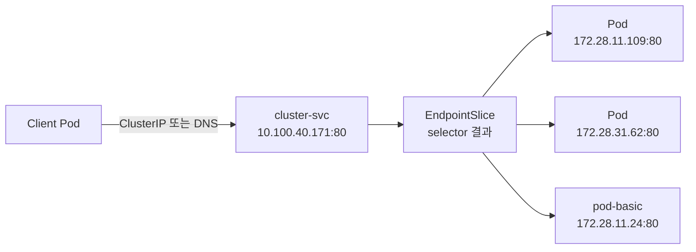

# EKS Service 기초 실습

> [!summary]
> `delivery` Namespace에 Deployment Pod 2개와 독립 Pod 1개를 만들고, `ClusterIP` Service인 `cluster-svc`가 같은 Label을 가진 세 Pod를 Backend로 선택하는 과정을 확인했다. Pod 내부에서 Service의 ClusterIP와 DNS 이름으로 접속해 `HTTP 200`을 받았으며, 같은 주소로 보낸 요청이 서로 다른 Pod IP로 전달되는 것도 확인했다.

> [!info] 이 노트의 범위
> 현재 실행 증거는 `ClusterIP`까지다. `NodePort`, `ExternalName`, `LoadBalancer`는 아직 실행한 것으로 기록하지 않는다.

## 1. Service가 필요한 이유

Deployment는 원하는 수의 Pod를 만들고 교체하지만, Client가 어느 Pod로 접속해야 하는지는 해결하지 않는다. Pod는 교체될 때 IP가 바뀔 수 있으므로 특정 Pod IP를 접속 주소로 고정하기 어렵다.

Service는 다음 두 역할을 맡는다.

1. Client에 잘 바뀌지 않는 ClusterIP와 DNS 이름을 제공한다.
2. `selector`와 일치하는 Pod를 Backend로 묶어 요청을 전달한다.

```text
Client Pod
    │
    │ cluster-svc:80
    ▼
Service 10.100.40.171:80
    │ selector: develop=spring-boot
    ▼
EndpointSlice
    ├─ 172.28.11.109:80
    ├─ 172.28.31.62:80
    └─ 172.28.11.24:80
```

> [!tip] 전화로 비유하면
> Pod IP는 직원 개인의 내선번호이고, Service의 ClusterIP와 DNS는 회사 대표번호다. 직원이 교체되어 내선번호가 바뀌어도 Client는 대표번호만 사용한다.

## 2. 사용한 Manifest

### Deployment

```yaml
apiVersion: apps/v1
kind: Deployment
metadata:
  name: deploy-basic
  namespace: delivery
spec:
  replicas: 2
  selector:
    matchLabels:
      develop: spring-boot
  template:
    metadata:
      labels:
        name: pod-basic
        app: web
        develop: spring-boot
    spec:
      containers:
        - name: web-containers
          image: unoh03/boot:latest
          ports:
            - containerPort: 80
```

### ClusterIP Service

```yaml
apiVersion: v1
kind: Service
metadata:
  name: cluster-svc
  namespace: delivery
spec:
  type: ClusterIP
  selector:
    develop: spring-boot
  ports:
    - port: 80
      targetPort: 80
```

- `type: ClusterIP`: Cluster 내부에서 접근할 가상 IP를 할당한다.
- `selector`: `develop=spring-boot` Label을 가진 Pod를 Backend 후보로 고른다.
- `port: 80`: Client가 Service에 접속할 Port다.
- `targetPort: 80`: Service가 선택한 Pod로 전달할 Port다.

### 독립 Pod

```yaml
apiVersion: v1
kind: Pod
metadata:
  name: pod-basic
  namespace: delivery
  labels:
    name: pod-basic
    app: web
    develop: spring-boot
spec:
  containers:
    - name: web-container
      image: unoh03/boot:latest
      resources:
        limits:
          memory: "1000Mi"
          cpu: "1000m"
      ports:
        - containerPort: 80
```

이 Pod는 통신을 시작하는 시험용 Pod인 동시에 `develop=spring-boot` Label을 갖는다. 따라서 자신도 `cluster-svc`의 Backend 후보에 포함된다.

## 3. 실행 흐름

### 3.1 Deployment와 Service 생성

```bash
kubectl apply -f deployment-basic.yml
kubectl apply -f service-ClusterIP.yml
```

```text
deployment.apps/deploy-basic created
service/cluster-svc created
```

실제 생성 상태:

```text
Deployment deploy-basic   2/2
Service    cluster-svc    ClusterIP 10.100.40.171:80
```

### 3.2 Namespace를 지정하지 않아 다른 Service를 조회함

```bash
kubectl get svc
```

```text
NAME         TYPE        CLUSTER-IP   PORT(S)
kubernetes   ClusterIP   10.100.0.1   443/TCP
```

`cluster-svc`는 `delivery` Namespace에 만들었지만 위 명령은 현재 `default` Namespace를 조회했다. 이때 보인 `kubernetes` Service는 Kubernetes API Server에 접근하기 위한 기본 Service이며, 이번에 만든 `cluster-svc`가 아니다.

잘못 고른 IP의 Port 80으로 접속해 다음 Timeout이 발생했다.

```bash
curl 10.100.0.1
```

```text
curl: (28) Failed to connect to 10.100.0.1 port 80 ... Could not connect to server
```

이번 Service를 조회하려면 Namespace를 지정해야 한다.

```bash
kubectl get svc -n delivery
```

> [!warning] IP만 보고 접속하지 말 것
> `10.100.0.1`은 이번 Application Service가 아니며 출력에도 `443/TCP`라고 표시됐다. Service 이름·Namespace·Port를 함께 확인해야 한다.

### 3.3 독립 Pod 생성

```bash
kubectl apply -f pod-basic.yml
kubectl get all -n delivery
```

```text
pod/deploy-basic-74959cd798-b299n   1/1   Running
pod/deploy-basic-74959cd798-pfpcp   1/1   Running
pod/pod-basic                       1/1   Running

service/cluster-svc   ClusterIP   10.100.40.171   80/TCP
deployment.apps/deploy-basic      2/2
replicaset.apps/deploy-basic-74959cd798   2   2   2
```

`kubectl get all`은 자주 쓰는 Workload와 Service를 한 번에 보여주지만 `EndpointSlice`까지 모두 보여주는 명령은 아니다. Service의 실제 Backend 목록은 별도로 확인한다.

## 4. Selector와 EndpointSlice 확인

Service 상세 상태:

```bash
kubectl describe svc cluster-svc -n delivery
```

```text
Selector:        develop=spring-boot
Type:            ClusterIP
IP:              10.100.40.171
Port:            80/TCP
TargetPort:      80/TCP
Endpoints:       172.28.11.109:80,172.28.31.62:80,172.28.11.24:80
Session Affinity: None
```

현재 Kubernetes에서 Service Backend 목록을 직접 확인:

```bash
kubectl get endpointslice -n delivery \
  -l kubernetes.io/service-name=cluster-svc -o wide
```

```text
NAME                PORTS   ENDPOINTS
cluster-svc-fqmsw   80      172.28.11.109,172.28.31.62,172.28.11.24
```

Pod와의 대응:

| 역할 | Pod IP | Node 가용 영역 |
|---|---|---|
| Deployment Pod | `172.28.11.109` | `ap-northeast-2a` |
| Deployment Pod | `172.28.31.62` | `ap-northeast-2c` |
| 독립 `pod-basic` | `172.28.11.24` | `ap-northeast-2a` |

> [!info] 강의자료의 `Endpoints`와 현재 Kubernetes
> 원자료는 `kubectl get endpoints`를 사용한다. 공식 문서 기준으로 기존 `Endpoints` API는 Kubernetes v1.33부터 deprecated이며, 현재 Backend 확인에는 `EndpointSlice` API 사용이 권장된다. Service에 selector가 있으면 Control Plane이 대응하는 EndpointSlice를 자동 생성·갱신한다.

## 5. ClusterIP 통신 검증

독립 Pod 내부 Shell에 진입했다.

```bash
kubectl exec -it pod-basic -n delivery -- bash
```

### ClusterIP로 접속

```bash
curl 10.100.40.171
```

Application Page가 반환됐고 응답 본문에서 Server IP `172.28.11.24`가 확인됐다.

```text
요청 위치: pod-basic 172.28.11.24
접속 주소: Service 10.100.40.171
실제 응답: pod-basic 172.28.11.24
```

즉, Service를 호출한 Pod 자신도 selector에 일치하므로 요청이 자기 자신에게 돌아올 수 있다.

### Service DNS로 접속

같은 Namespace에서는 Service 이름만으로 접근할 수 있다.

```bash
curl http://cluster-svc:80/
```

`HTTP 200`을 확인했다. IP를 직접 기억하지 않아도 `cluster-svc`라는 이름을 사용할 수 있다.

### 반복 요청의 Backend 변화

같은 `cluster-svc` 주소로 요청을 반복한 결과:

```text
TRY-1 → 172.28.11.109
TRY-2 → 172.28.11.109
TRY-3 → 172.28.31.62
TRY-4 → 172.28.31.62
TRY-5 → 172.28.11.109
```

첫 수동 요청에서는 `172.28.11.24`도 응답했다. 따라서 하나의 ClusterIP 뒤에 등록된 세 Pod가 모두 Backend가 될 수 있음을 실제로 확인했다.

> [!important] Round Robin을 보장한다고 단정하지 않는다
> 관찰된 사실은 요청이 여러 Backend로 전달됐다는 것이다. 짧은 출력의 순서만으로 정확한 분산 Algorithm이나 균등 분배를 확정하지 않는다.

## 6. 이번 실습에서 확인한 원리



- Client는 매번 바뀔 수 있는 Pod IP 대신 Service의 IP 또는 DNS를 사용한다.
- Service selector와 Pod Label이 연결 관계를 결정한다.
- 선택된 Pod 주소는 EndpointSlice에 기록된다.
- Pod가 여러 Node와 가용 영역에 있어도 Client는 같은 Service 주소를 사용한다.
- `ClusterIP`는 Cluster 내부 통신용이며 외부 Browser가 이 IP로 직접 접근하는 방식은 아니다.

## 7. 증거와 해석 경계

### ① Local primary evidence

- EKS Runtime의 Deployment Pod 2개와 독립 Pod 1개
- `cluster-svc`의 ClusterIP `10.100.40.171`
- EndpointSlice의 Backend IP 3개
- ClusterIP와 Service DNS 접속의 `HTTP 200`
- 반복 요청에서 서로 다른 Backend IP가 응답한 결과

### ② Authoritative external evidence

- Kubernetes 공식 Service 문서: selector가 일치하는 Pod의 `targetPort`로 Service 요청을 전달한다.
- Kubernetes 공식 EndpointSlice 문서: selector가 있는 Service의 EndpointSlice는 Control Plane이 자동 관리한다.
- Kubernetes 공식 DNS 문서: Pod는 Service의 일관된 DNS 이름을 사용해 접속할 수 있다.

### ④ Parametric knowledge

- 대표번호와 내선번호 비유
- Service를 Pod와 Client 사이의 안정적인 접속 창구로 설명한 부분

## 8. 오류와 해석 요약

| 관찰 | 원인 | 배운 점 |
|---|---|---|
| `kubectl get svc`에 `cluster-svc`가 없음 | `default` Namespace를 조회함 | Service가 존재하는 Namespace를 지정한다 |
| `curl 10.100.0.1` Timeout | 기본 Kubernetes API Service의 IP를 골랐고 Port 80으로 접속함 | 이름·Namespace·Port를 함께 확인한다 |
| 독립 Pod가 Endpoint에 추가됨 | Service selector와 Pod Label이 일치함 | 통신 시험 Pod도 Backend가 될 수 있다 |
| 같은 주소에서 서로 다른 Server IP가 응답 | Service 뒤에 Backend가 여러 개 등록됨 | Client는 개별 Pod IP를 알 필요가 없다 |

## 9. 검증 완료와 미완료

### 완료

- `ClusterIP` Service 생성
- `port: 80 → targetPort: 80` 연결
- selector가 Deployment Pod 2개와 독립 Pod 1개를 선택
- EndpointSlice에 세 Pod IP 등록
- ClusterIP 접속
- 같은 Namespace의 Service DNS 접속
- 반복 요청에서 복수 Backend 응답

### 미완료·후속 범위

- 다른 Namespace에서 `cluster-svc.delivery` 또는 FQDN으로 접속
- Pod 교체 시 EndpointSlice 자동 갱신 관찰
- selector 불일치 시 Endpoint가 비는 현상
- `NodePort`, `ExternalName`, `LoadBalancer`
- Session Affinity 동작

## 10. 다음 재시작 지점

오늘 수업 범위는 `service-ClusterIP.yml`이다. 다음 Service 유형을 시작하기 전 다음 상태를 먼저 확인한다.

```bash
kubectl get pod,svc,endpointslice -n delivery -o wide
```

## 관련 노트

- [[Lab_EKS Deployment 기초와 Rolling Update 실습]]
- [[10_학습 노트/클라우드/Kubernetes/Source Digest/Kubernetes - Source Digest 06 Service Object]]
- [[10_학습 노트/클라우드/Kubernetes/00_Kubernetes MOC]]

## 공식 참고

- [Kubernetes 공식 문서 — Service](https://kubernetes.io/docs/concepts/services-networking/service/)
- [Kubernetes 공식 문서 — EndpointSlice](https://kubernetes.io/docs/concepts/services-networking/endpoint-slices/)
- [Kubernetes 공식 문서 — DNS for Services and Pods](https://kubernetes.io/docs/concepts/services-networking/dns-pod-service/)


---

## 2026-07-24 재실습 — ClusterIP 재검증과 NodePort 생성

> [!summary]
> 새 `delivery` Namespace에서 Deployment Pod 2개와 독립 `pod-basic`을 다시 생성했다. 새 `ClusterIP` `10.100.2.104`와 Service DNS `cluster-svc.delivery`로 CARE Application 응답을 받았고, 응답 본문에서 서로 다른 Backend IP `172.28.31.40`, `172.28.11.103`을 확인했다. 이후 `cluster-svc`를 삭제하고 `NodePort` Service `nodeport-svc`를 생성해 ClusterIP `10.100.103.127`과 자동 할당된 NodePort `32214`를 확인했다. 아직 `NodeIP:32214` 실제 접속은 수행하지 않았다.

> [!warning] 기존 기록과 이번 Runtime을 구분한다
> 위의 기존 본문은 2026-07-23 Runtime의 ClusterIP·Pod IP·EndpointSlice를 기록한다. 아래 절은 2026-07-24에 제공된 새 Runtime 출력만 추가한 것이다. 두 환경의 IP와 ReplicaSet Hash를 하나의 동시 상태로 해석하지 않는다.

### 1. Namespace와 Workload 재생성

```console
$ kubectl create namespace delivery
namespace/delivery created

$ cd ~/kube-workspace/services

$ kubectl apply -f deployment-basic.yml
deployment.apps/deploy-basic created

$ kubectl apply -f service-ClusterIP.yml
service/cluster-svc created
```

생성 직후 Deployment Pod 2개는 모두 `Running 1/1`이었다.

```text
pod/deploy-basic-5d44b9f8f7-jxpdj   1/1   Running
pod/deploy-basic-5d44b9f8f7-rxhb7   1/1   Running

deployment.apps/deploy-basic             2/2
replicaset.apps/deploy-basic-5d44b9f8f7  2  2  2
service/cluster-svc                      ClusterIP  10.100.2.104  80/TCP
```

독립 Pod도 같은 Namespace에 생성했다.

```console
$ kubectl apply -f pod-basic.yml
pod/pod-basic created
```

최종적으로 다음 세 Pod가 실행됐다.

```text
Deployment Pod 2개
독립 pod-basic 1개
```

### 2. 새 ClusterIP와 Service DNS 통신

Service 주소를 Namespace와 함께 확인했다.

```console
$ kubectl get svc -n delivery
NAME          TYPE        CLUSTER-IP    EXTERNAL-IP   PORT(S)
cluster-svc   ClusterIP   10.100.2.104  <none>        80/TCP
```

#### ClusterIP 직접 접속

처음에는 `--`와 Container 내부 명령을 붙여 입력했다.

```console
$ kubectl exec -it pod-basic -n delivery --bash
error: unknown flag: --bash
```

`--`는 `kubectl exec` Option과 Container 내부에서 실행할 명령을 구분한다. 다음처럼 `bash`를 별도 인자로 전달해야 한다.

```bash
kubectl exec -it pod-basic -n delivery -- bash
```

Pod 내부에서 새 ClusterIP로 접속했다.

```console
root@pod-basic:/# curl 10.100.2.104
```

CARE Application HTML이 반환됐고 응답 본문에서 다음 Server IP를 확인했다.

```text
172.28.31.40
```

이번 출력은 HTTP Header나 Status Code를 별도로 표시하지 않았으므로, 이 절에서는 `HTTP 200`이라고 단정하지 않고 **Application 응답 본문을 정상 수신했다**고 기록한다.

#### Namespace를 포함한 DNS 이름 접속

```console
root@pod-basic:/# curl cluster-svc.delivery
```

CARE Application HTML이 다시 반환됐고 이번 응답 본문에서는 다음 Server IP가 확인됐다.

```text
172.28.11.103
```

`cluster-svc.delivery`는 `Service 이름.Namespace` 형식이다. 다만 요청을 보낸 `pod-basic`도 `delivery` Namespace에 있으므로, 이번 결과는 **다른 Namespace에서의 DNS 접근 검증이 아니다.** 같은 Namespace에서 Namespace를 명시한 이름도 해석된다는 점을 확인한 것이다.

| 접속 주소 | 응답 본문에서 확인한 Server IP |
|---|---|
| `10.100.2.104` | `172.28.31.40` |
| `cluster-svc.delivery` | `172.28.11.103` |

두 요청에서 서로 다른 Backend가 응답했다. 이는 하나의 Service 뒤에 복수 Backend가 존재할 수 있다는 관찰 증거지만, 두 번의 요청만으로 Round Robin·균등 분배·요청 순서를 단정하지 않는다.

### 3. Shell 오타와 Exit Code `127`

ClusterIP 접속 뒤 `exit` 대신 `ext`를 입력했다.

```console
root@pod-basic:/# ext
bash: ext: command not found
root@pod-basic:/# exit
exit
command terminated with exit code 127
```

`127`은 Shell이 실행할 명령을 찾지 못했을 때 사용하는 종료 상태다. 인자 없이 실행한 `exit`이 직전 실패 명령의 상태를 반환하면서 `kubectl exec`에도 `127`이 표시됐다. 이는 Pod·Service 장애가 아니라 Container Shell 내부의 명령 오타다.

### 4. ClusterIP Service 삭제와 NodePort 생성

기존 ClusterIP Service를 삭제했다.

```console
$ kubectl delete -f service-ClusterIP.yml
service "cluster-svc" deleted from delivery namespace
```

그다음 NodePort Manifest를 적용했다.

```console
$ kubectl apply -f service-NodePort.yml
service/nodeport-svc created
```

첨부된 `service-NodePort.yml`의 핵심 구조는 다음과 같다.

```yaml
apiVersion: v1
kind: Service
metadata:
  name: nodeport-svc
  namespace: delivery
spec:
  type: NodePort
  selector:
    develop: spring-boot
  ports:
    - port: 80
      targetPort: 80
```

- `type: NodePort`: 각 Node의 지정 Port를 Service 진입점으로 사용한다.
- `selector: develop=spring-boot`: 기존 ClusterIP 실습과 같은 Label의 Pod를 Backend 후보로 선택한다.
- `port: 80`: Cluster 내부에서 Service가 받는 Port다.
- `targetPort: 80`: 선택된 Pod의 Application Port다.
- `nodePort`를 Manifest에 직접 지정하지 않았으므로 Cluster가 사용 가능한 값을 자동 할당했다.

실제 할당 결과:

```console
$ kubectl get all -n delivery
NAME                   TYPE       CLUSTER-IP       EXTERNAL-IP   PORT(S)
service/nodeport-svc   NodePort   10.100.103.127   <none>        80:32214/TCP
```

`80:32214/TCP`의 의미는 다음과 같다.

```text
Service port: 80
NodePort:     32214
Protocol:     TCP
```

교안 p.122-p.126에서 제시하는 기본 NodePort 범위는 `30000-32767`이며, 자동 할당된 `32214`는 이 범위 안에 있다.

### 5. Worker Node 주소 확인

```console
$ kubectl get node -o wide
NAME                                               STATUS   INTERNAL-IP     EXTERNAL-IP
ip-172-28-11-19.ap-northeast-2.compute.internal    Ready    172.28.11.19    <none>
ip-172-28-31-105.ap-northeast-2.compute.internal   Ready    172.28.31.105   <none>
```

두 Worker Node는 모두 `Ready`이며 Internal IP만 확인됐다.

현재까지 예상되는 통신 경로는 다음과 같다.

```text
Bastion 또는 Cluster 내부 Client
→ 172.28.11.19:32214 또는 172.28.31.105:32214
→ nodeport-svc의 port 80
→ selector가 고른 Pod의 targetPort 80
```

> [!warning] 예상 경로와 실행 증거를 구분한다
> NodePort Service 생성과 Node 주소 확인까지는 실행 증거가 있다. 그러나 아직 `curl NodeIP:32214`를 실행하지 않았으므로, 위 경로로 CARE Application 응답이 실제 반환됐다고 기록하면 안 된다. Security Group·Route·Network ACL에 따른 접근 가능 여부도 아직 검증하지 않았다.

### 6. 이번 재실습의 증거 경계

#### ① Local primary evidence

- 사용자가 제공한 `kubectl create/apply/get/delete/exec` 출력
- 새 ClusterIP `10.100.2.104`
- CARE Application 응답 본문의 Backend IP `172.28.31.40`, `172.28.11.103`
- NodePort Service의 ClusterIP `10.100.103.127`
- 자동 할당 NodePort `32214/TCP`
- Worker Node Internal IP `172.28.11.19`, `172.28.31.105`
- 첨부된 `service-NodePort.yml`의 `selector`, `port`, `targetPort`

#### ② 강의자료

- `Kubernetes.pdf` p.122-p.126의 NodePort Manifest와 기본 Port 범위
- `NodeIP:nodePort → Service port → Pod targetPort` 흐름

#### ④ 해석·추론

- 두 ClusterIP 요청에서 서로 다른 Backend가 응답했지만 분산 Algorithm은 확정하지 않는 판단
- 현재 NodePort 접근 후보로 Worker Node Internal IP를 사용하는 해설
- Security Group·Route·Network ACL을 실제 통신 실패 시 확인해야 한다는 운영 해석

### 7. 오류와 해석

| 관찰 | 원인 | 판정·학습 |
|---|---|---|
| `--bash`가 Unknown Flag | `--`와 `bash` 사이 Space 누락 | `kubectl exec ... -- bash`로 구분 |
| `ext: command not found`와 exit code `127` | `exit` 오타와 직전 실패 상태 반환 | Kubernetes Resource 장애 아님 |
| 기존 기록과 ClusterIP·ReplicaSet Hash가 다름 | 이번 출력은 다른 Runtime 상태 | 이전 기록을 수정하지 않고 별도 재실습으로 추가 |
| `cluster-svc.delivery` 접속 성공 | Service 이름과 Namespace를 포함한 DNS 사용 | 다른 Namespace 접근은 아직 미검증 |
| `nodeport-svc`에 `32214` 할당 | Manifest에 `nodePort`를 고정하지 않음 | Cluster가 기본 범위에서 자동 할당 |
| Worker Node의 `EXTERNAL-IP`가 `<none>` | 출력상 Public Node IP가 없음 | 외부 PC 접근 가능 여부를 현재 로그만으로 단정하지 않음 |

### 8. 완료와 미완료

#### 완료

- `delivery` Namespace 생성
- Deployment Pod 2개와 독립 Pod 1개 실행
- 새 ClusterIP Service `10.100.2.104:80` 생성
- Pod 내부에서 ClusterIP로 CARE Application 응답 수신
- 같은 Namespace에서 `cluster-svc.delivery`로 응답 수신
- 두 요청에서 서로 다른 Backend IP 확인
- ClusterIP Service 삭제
- NodePort Service `10.100.103.127:80` 생성
- NodePort `32214/TCP` 자동 할당 확인
- Worker Node 2대의 Internal IP 확인

#### 미완료·후속 범위

- 현재 Runtime의 Pod 이름과 IP 대응
- `nodeport-svc`의 EndpointSlice와 전체 Backend 확인
- 독립 `pod-basic`의 실제 Endpoint 포함 여부
- 다른 Namespace에서 Service DNS 접근
- FQDN `nodeport-svc.delivery.svc.cluster.local` 접근
- `172.28.11.19:32214`, `172.28.31.105:32214` 실제 통신
- Security Group·Route·Network ACL에 따른 NodePort 허용 여부
- Pod 교체 시 EndpointSlice 자동 갱신
- selector 불일치 시 Endpoint가 비는 현상
- `ExternalName`, `LoadBalancer`, Session Affinity

### 9. 다음 재시작 지점

먼저 NodePort Service가 선택한 Backend와 Port 연결을 확인한다.

```bash
kubectl describe svc nodeport-svc -n delivery

kubectl get endpointslice -n delivery \
  -l kubernetes.io/service-name=nodeport-svc -o wide

curl -v http://172.28.11.19:32214/
curl -v http://172.28.31.105:32214/
```

확인 기준:

```text
1. Service의 port 80·targetPort 80·nodePort 32214가 일치하는가
2. EndpointSlice에 기대한 Pod IP가 등록됐는가
3. 두 Node Internal IP 중 어느 주소에서 CARE Application 응답이 오는가
4. 실패한다면 Endpoint 부재인지 Network/Security Group 문제인지 구분 가능한가
```


---

## 2026-07-24 추가 실습 — LoadBalancer 생성·재생성과 Resource 정리

> [!summary]
> 기존 `nodeport-svc`를 삭제한 뒤 `LoadBalancer` Service인 `lb-svc`를 생성해 AWS ELB DNS 이름과 자동 할당된 NodePort를 확인했다. 첫 번째 `lb-svc`를 삭제하고 Workload까지 모두 정리한 뒤, 이미 삭제된 Resource에 다시 `kubectl delete`를 실행하면 `NotFound`가 발생한다는 점도 확인했다. 이후 `pod-basic`, `cluster-svc`, `lb-svc`를 다시 생성하고 `cluster-svc`만 삭제했으며, 재생성된 `lb-svc`에는 처음과 다른 ClusterIP·NodePort·ELB DNS가 할당됐다. LoadBalancer DNS를 통한 실제 Application 통신은 아직 검증하지 않았다.

### 1. NodePort 삭제 후 LoadBalancer Service 생성

기존 NodePort Service를 삭제했다.

```console
$ kubectl delete -f service-NodePort.yml
service "nodeport-svc" deleted from delivery namespace
```

이어서 LoadBalancer Manifest를 적용했다.

```console
$ kubectl apply -f service-LoadBalancer.yml
service/lb-svc created
```

첫 번째 생성 결과:

```console
$ kubectl get svc -n delivery
NAME     TYPE           CLUSTER-IP    EXTERNAL-IP                                                                   PORT(S)        AGE
lb-svc   LoadBalancer   10.100.8.93   a3a89ec5b5f6f43268a933835a86774b-998391405.ap-northeast-2.elb.amazonaws.com   80:32083/TCP   14s
```

Runtime에서 직접 확인된 값:

| 항목 | 첫 번째 `lb-svc` |
|---|---|
| Service Type | `LoadBalancer` |
| ClusterIP | `10.100.8.93` |
| External 주소 | `a3a89ec5b5f6f43268a933835a86774b-998391405.ap-northeast-2.elb.amazonaws.com` |
| Service Port | `80/TCP` |
| 자동 할당 NodePort | `32083/TCP` |

`LoadBalancer` Type이어도 출력에 ClusterIP와 NodePort가 함께 나타났다. 다만 이번 로그에는 ELB DNS를 대상으로 한 `curl` 또는 Browser 접속 결과가 없으므로, 외부 요청이 CARE Application까지 전달됐다고 기록하지 않는다.

> [!warning] DNS 할당과 통신 성공은 다른 증거다
> `EXTERNAL-IP` 열에 ELB DNS가 나타난 것은 외부 진입 주소가 할당됐다는 증거다. Target 상태, Security Group, Listener, Endpoint 연결과 실제 HTTP 응답은 별도 검증이 필요하다.

### 2. 첫 번째 LoadBalancer 삭제와 Workload 정리

첫 번째 `lb-svc` 삭제 요청은 정상 처리됐다.

```console
$ kubectl delete -f service-LoadBalancer.yml
service "lb-svc" deleted from delivery namespace
```

삭제 직후 `delivery` Namespace에는 Deployment Pod 2개와 독립 `pod-basic`만 남아 있었다.

```text
pod/deploy-basic-5d44b9f8f7-jxpdj   1/1   Running
pod/deploy-basic-5d44b9f8f7-rxhb7   1/1   Running
pod/pod-basic                       1/1   Running
deployment.apps/deploy-basic        2/2
replicaset.apps/deploy-basic-5d44b9f8f7
```

Deployment를 삭제했다.

```console
$ kubectl delete -f deployment-basic.yml
deployment.apps "deploy-basic" deleted from delivery namespace
```

Deployment가 관리하던 Pod와 ReplicaSet이 함께 사라지고 독립 Pod만 남았다.

```console
$ kubectl get all -n delivery
NAME            READY   STATUS    RESTARTS   AGE
pod/pod-basic   1/1     Running   0          86m
```

마지막으로 독립 Pod를 삭제했다.

```console
$ kubectl delete -f pod-basic.yml
pod "pod-basic" deleted from delivery namespace
```

정리 완료 확인:

```console
$ kubectl get all -n delivery
No resources found in delivery namespace.
```

이 출력은 `delivery` Namespace 자체가 삭제됐다는 뜻이 아니라, `kubectl get all`이 보여주는 범위의 Resource가 현재 없다는 뜻이다.

### 3. 이미 삭제된 Resource를 다시 삭제한 경우

이미 삭제된 `pod-basic`을 다시 삭제했다.

```console
$ kubectl delete -f pod-basic.yml
Error from server (NotFound): error when deleting "pod-basic.yml": pods "pod-basic" not found
```

이미 삭제된 `cluster-svc`에도 같은 현상이 발생했다.

```console
$ kubectl delete -f service-ClusterIP.yml
Error from server (NotFound): error when deleting "service-ClusterIP.yml": services "cluster-svc" not found
```

`NotFound`는 대상 Resource가 현재 API Server에 존재하지 않는다는 의미다. 이번 경우에는 삭제가 실패해 Resource가 남은 것이 아니라, **이미 삭제된 대상을 다시 삭제했기 때문에 발생한 결과**다.

반복 실행 가능한 정리 명령이 필요하면 다음처럼 처리한다.

```bash
# Resource가 이미 없어도 NotFound를 오류로 취급하지 않는다.
kubectl delete -f service-ClusterIP.yml --ignore-not-found

# 이름과 Namespace를 직접 지정하는 방식
kubectl delete svc cluster-svc -n delivery --ignore-not-found=true
```

### 4. Namespace를 지정하지 않은 조회의 의미

다음 조회는 `-n delivery`를 사용하지 않았다.

```console
$ kubectl get all
NAME                 TYPE        CLUSTER-IP   EXTERNAL-IP   PORT(S)   AGE
service/kubernetes   ClusterIP   10.100.0.1   <none>        443/TCP   4h26m
```

따라서 이 출력은 `delivery`가 아니라 현재 기본 Namespace인 `default`를 조회한 것이다.

`service/kubernetes`는 Kubernetes API Server 접근에 사용되는 기본 Service이며, 이번 실습에서 만든 `cluster-svc`, `nodeport-svc`, `lb-svc`가 아니다. Application Resource 정리를 위해 이 Service를 삭제해서는 안 된다.

Namespace별 상태를 확인할 때는 다음 명령을 구분해서 사용한다.

```bash
# delivery Namespace만 조회
kubectl get all -n delivery

# 모든 Namespace의 자주 쓰는 Resource 조회
kubectl get all -A

# delivery Namespace의 Service만 조회
kubectl get svc -n delivery
```

### 5. Pod와 Service 재생성

전체 정리 후 독립 Pod와 두 Service를 다시 생성했다.

```console
$ kubectl apply -f pod-basic.yml
pod/pod-basic created

$ kubectl apply -f service-ClusterIP.yml
service/cluster-svc created

$ kubectl apply -f service-LoadBalancer.yml
service/lb-svc created
```

이후 `cluster-svc`만 삭제했다.

```console
$ kubectl delete -f service-ClusterIP.yml
service "cluster-svc" deleted from delivery namespace
```

마지막 Service 조회에서는 두 번째로 생성된 `lb-svc`만 확인됐다.

```console
$ kubectl get svc -n delivery
NAME     TYPE           CLUSTER-IP      EXTERNAL-IP                                                                   PORT(S)        AGE
lb-svc   LoadBalancer   10.100.148.97   ab6c013114d0f4518b94eb7d181b2100-621648698.ap-northeast-2.elb.amazonaws.com   80:31039/TCP   4m2s
```

두 번째 생성 결과:

| 항목 | 두 번째 `lb-svc` |
|---|---|
| Service Type | `LoadBalancer` |
| ClusterIP | `10.100.148.97` |
| External 주소 | `ab6c013114d0f4518b94eb7d181b2100-621648698.ap-northeast-2.elb.amazonaws.com` |
| Service Port | `80/TCP` |
| 자동 할당 NodePort | `31039/TCP` |

### 6. LoadBalancer 재생성 전후 비교

| 항목 | 첫 번째 생성 | 두 번째 생성 |
|---|---|---|
| ClusterIP | `10.100.8.93` | `10.100.148.97` |
| NodePort | `32083` | `31039` |
| ELB DNS 앞부분 | `a3a89ec5...` | `ab6c0131...` |
| 확인된 최종 상태 | Service 삭제 요청 완료 | 마지막 Service 조회에서 존재 |

삭제 후 새로 생성된 Service에는 이전과 다른 ClusterIP·NodePort·ELB DNS가 할당됐다. 따라서 삭제된 Service의 이전 주소를 운영 설정이나 Client 접속 주소로 계속 사용하면 안 된다.

> [!important] Service 재생성은 같은 주소의 복구가 아니다
> Manifest의 `metadata.name`이 같더라도 삭제 후 재생성된 Resource는 새 할당 값을 받을 수 있다. 외부 DNS·Firewall Rule·문서·Monitoring 설정에서 이전 값을 고정해 사용했다면 함께 점검해야 한다.

### 7. 마지막 상태의 증거 경계

#### Runtime으로 직접 확인

- `delivery` Namespace의 기존 Resource가 한 차례 모두 정리됨
- `pod-basic` 재생성 명령 성공
- `cluster-svc` 재생성 후 다시 삭제
- 두 번째 `lb-svc` 생성
- 두 번째 `lb-svc`의 ClusterIP `10.100.148.97`
- 두 번째 `lb-svc`의 NodePort `31039/TCP`
- 두 번째 AWS ELB DNS 이름
- 마지막 `kubectl get svc -n delivery`에서 `lb-svc`만 존재

#### 명령 이력으로 추론되지만 마지막에 재조회하지 않은 상태

- `pod-basic`은 재생성 후 삭제 명령이 없으므로 남아 있을 가능성이 높다.
- 그러나 마지막에 `kubectl get pod -n delivery`를 실행하지 않았으므로 현재 Running 상태는 직접 확인하지 않았다.
- `lb-svc`가 `pod-basic`을 실제 Backend Endpoint로 등록했는지도 확인하지 않았다.

#### 아직 검증하지 않은 항목

- `lb-svc`의 EndpointSlice
- `pod-basic`의 Label과 `lb-svc` Selector 일치 여부 재확인
- AWS Load Balancer Target 상태
- ELB DNS를 통한 CARE Application 응답
- HTTP Status Code
- Internet-facing 또는 Internal Scheme
- Security Group·Network ACL·Route에 따른 접근 범위
- 첫 번째 `lb-svc` 삭제 후 AWS Load Balancer 자원 정리 완료 여부
- LoadBalancer 삭제 후 관련 AWS 비용 발생 여부

### 8. 오류와 해석 추가

| 관찰 | 원인 | 판정·학습 |
|---|---|---|
| 삭제된 Pod를 다시 삭제하자 `NotFound` | Resource가 이미 없음 | Kubernetes 장애가 아니라 중복 삭제 |
| 삭제된 `cluster-svc`를 다시 삭제하자 `NotFound` | Service가 이미 없음 | 필요하면 `--ignore-not-found` 사용 |
| `kubectl get all`에 `service/kubernetes`만 표시 | Namespace를 지정하지 않아 `default` 조회 | `delivery` 확인에는 `-n delivery` 필요 |
| LoadBalancer 재생성 후 주소와 Port가 변경 | 기존 Service 삭제 후 새 Resource 생성 | 이전 할당 값을 고정 주소로 간주하지 않음 |
| ELB DNS는 보이지만 Application 응답 기록은 없음 | 통신 시험을 실행하지 않음 | 생성 완료와 통신 성공을 분리해서 기록 |

### 9. 완료와 미완료 추가

#### 완료

- NodePort Service 삭제
- 첫 번째 LoadBalancer Service 생성
- 첫 번째 ClusterIP·NodePort·ELB DNS 확인
- 첫 번째 LoadBalancer Service 삭제 요청
- Deployment와 독립 Pod 삭제
- `delivery` Namespace의 Resource 정리 확인
- 중복 삭제 시 `NotFound` 확인
- `pod-basic`, `cluster-svc`, `lb-svc` 재생성
- 재생성한 `cluster-svc` 삭제
- 두 번째 LoadBalancer Service의 새 ClusterIP·NodePort·ELB DNS 확인

#### 미완료·후속 범위

- 재생성된 `pod-basic`의 현재 상태 확인
- `lb-svc`의 Selector와 EndpointSlice 확인
- AWS Load Balancer Target 상태 확인
- ELB DNS 실제 HTTP 접속
- 외부 또는 VPC 내부 접근 범위 확인
- 첫 번째 LoadBalancer 삭제에 따른 AWS Resource 정리 완료 확인
- 실습 종료 후 두 번째 `lb-svc`와 `pod-basic` 정리

### 10. 다음 재시작 지점

현재 Kubernetes 상태와 LoadBalancer Backend를 먼저 확인한다.

```bash
# 현재 남아 있는 Pod와 Service 확인
kubectl get pod,svc -n delivery -o wide

# LoadBalancer Service의 Port·Selector·Event 확인
kubectl describe svc lb-svc -n delivery

# 실제 Backend Endpoint 확인
kubectl get endpointslice -n delivery \
  -l kubernetes.io/service-name=lb-svc -o wide
```

ELB DNS 접속을 검증할 때는 현재 출력에 표시된 주소를 다시 조회해서 사용한다.

```bash
# 현재 ELB DNS를 변수로 가져온다.
LB_DNS=$(kubectl get svc lb-svc -n delivery \
  -o jsonpath='{.status.loadBalancer.ingress[0].hostname}')

# DNS 할당 여부를 확인한다.
echo "$LB_DNS"

# 실제 HTTP 연결과 응답 Header를 확인한다.
curl -v "http://${LB_DNS}/"
```

실습을 끝내고 비용 발생 가능성이 있는 Resource를 정리할 때:

```bash
kubectl delete -f service-LoadBalancer.yml --ignore-not-found
kubectl delete -f pod-basic.yml --ignore-not-found

kubectl get all -n delivery
```

> [!warning] AWS Console 확인
> `kubectl delete`가 성공해도 AWS Load Balancer와 관련 Target Group이 실제로 정리됐는지는 AWS Console 또는 AWS CLI에서 별도로 확인한다. 실습 후에는 남은 Load Balancer Resource가 없는지 점검한다.
