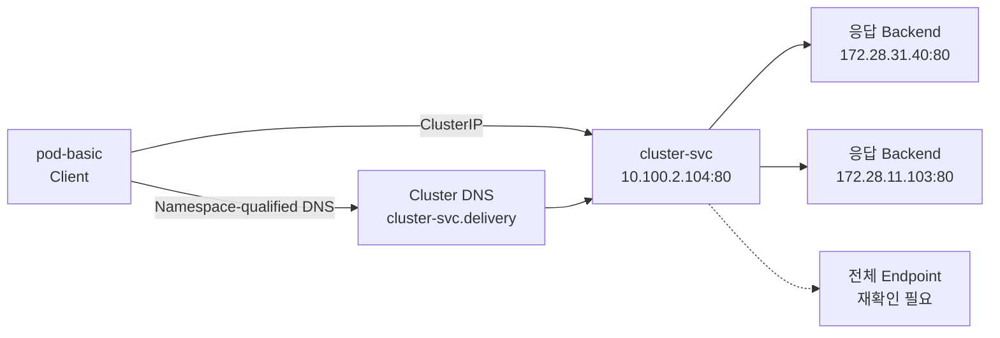

# EKS Service 기초 실습

> [!summary]
> Terraform `destroy → apply` 후 다시 생성한 EKS Runtime에서 `delivery` Namespace에 Deployment Pod 2개와 독립 Pod 1개를 만들고, `ClusterIP` Service인 `cluster-svc`를 생성했다. Pod 내부에서 새 ClusterIP `10.100.2.104`와 Namespace를 포함한 DNS 이름 `cluster-svc.delivery`로 접속해 Application 응답을 받았으며, 응답 본문에서 서로 다른 Server IP `172.28.31.40`, `172.28.11.103`을 확인했다.

> [!info] Runtime 교체
> 이전 실습 뒤 Terraform으로 인프라를 Destroy하고 다시 Apply했으므로 Service ClusterIP, Pod IP, ReplicaSet Hash와 Pod 이름이 새로 부여됐다. 이 노트는 현재 Runtime을 기준으로 갱신하며 이전 Runtime 수치는 유지하지 않는다.

> [!info] 이 노트의 범위
> 현재 실행 증거는 `ClusterIP`와 같은 Namespace에서의 Service DNS 접근까지다. 현재 Runtime의 EndpointSlice 전체 Backend, 다른 Namespace DNS, `NodePort`, `ExternalName`, `LoadBalancer`는 아직 실행한 것으로 기록하지 않는다.

## 1. Service가 필요한 이유

Deployment는 원하는 수의 Pod를 만들고 교체하지만, Client가 어느 Pod로 접속해야 하는지는 해결하지 않는다. Pod는 교체될 때 IP가 바뀔 수 있으므로 특정 Pod IP를 접속 주소로 고정하기 어렵다.

Service는 다음 두 역할을 맡는다.

1. Client에 잘 바뀌지 않는 ClusterIP와 DNS 이름을 제공한다.
2. `selector`와 일치하는 Pod를 Backend로 묶어 요청을 전달한다.

```text
Client Pod
    │
    │ ClusterIP 또는 Service DNS
    ▼
Service 10.100.2.104:80
    │ selector: develop=spring-boot
    ▼
Backend Pod 집합
    ├─ 응답 확인: 172.28.31.40:80
    ├─ 응답 확인: 172.28.11.103:80
    └─ 전체 Endpoint는 재확인 필요
```

> [!tip] 전화로 비유하면
> Pod IP는 직원 개인의 내선번호이고, Service의 ClusterIP와 DNS는 회사 대표번호다. 직원이 교체되어 내선번호가 바뀌어도 Client는 대표번호만 사용한다.

## 2. 사용한 Manifest

### Deployment

```yaml
apiVersion: apps/v1
kind: Deployment
metadata:
  name: deploy-basic
  namespace: delivery
spec:
  replicas: 2
  selector:
    matchLabels:
      develop: spring-boot
  template:
    metadata:
      labels:
        name: pod-basic
        app: web
        develop: spring-boot
    spec:
      containers:
        - name: web-containers
          image: unoh03/boot:latest
          ports:
            - containerPort: 80
```

### ClusterIP Service

```yaml
apiVersion: v1
kind: Service
metadata:
  name: cluster-svc
  namespace: delivery
spec:
  type: ClusterIP
  selector:
    develop: spring-boot
  ports:
    - port: 80
      targetPort: 80
```

- `type: ClusterIP`: Cluster 내부에서 접근할 가상 IP를 할당한다.
- `selector`: `develop=spring-boot` Label을 가진 Pod를 Backend 후보로 고른다.
- `port: 80`: Client가 Service에 접속할 Port다.
- `targetPort: 80`: Service가 선택한 Pod로 전달할 Port다.

### 독립 Pod

```yaml
apiVersion: v1
kind: Pod
metadata:
  name: pod-basic
  namespace: delivery
  labels:
    name: pod-basic
    app: web
    develop: spring-boot
spec:
  containers:
    - name: web-container
      image: unoh03/boot:latest
      resources:
        limits:
          memory: "1000Mi"
          cpu: "1000m"
      ports:
        - containerPort: 80
```

이 Pod는 통신을 시작하는 시험용 Pod인 동시에 `develop=spring-boot` Label을 갖는다. Manifest 기준으로는 `cluster-svc`의 Backend 후보에 포함되지만, 현재 Runtime의 EndpointSlice는 아직 다시 조회하지 않았다.

## 3. 실행 흐름

### 3.1 Namespace와 Deployment·Service 생성

Terraform Apply로 새 Cluster가 생성된 뒤 `delivery` Namespace를 다시 만들었다.

```console
$ kubectl create namespace delivery
namespace/delivery created
```

`services` Directory에서 Deployment와 ClusterIP Service를 적용했다.

```console
$ cd ~/kube-workspace/services

$ kubectl apply -f deployment-basic.yml
deployment.apps/deploy-basic created

$ kubectl apply -f service-ClusterIP.yml
service/cluster-svc created
```

생성 직후 상태:

```console
$ kubectl get all -n delivery
NAME                                READY   STATUS    RESTARTS   AGE
pod/deploy-basic-5d44b9f8f7-jxpdj   1/1     Running   0          32s
pod/deploy-basic-5d44b9f8f7-rxhb7   1/1     Running   0          32s

NAME                  TYPE        CLUSTER-IP     EXTERNAL-IP   PORT(S)   AGE
service/cluster-svc   ClusterIP   10.100.2.104   <none>        80/TCP    20s

NAME                           READY   UP-TO-DATE   AVAILABLE   AGE
deployment.apps/deploy-basic   2/2     2            2           32s

NAME                                      DESIRED   CURRENT   READY   AGE
replicaset.apps/deploy-basic-5d44b9f8f7   2         2         2       32s
```

- Deployment가 요구한 Pod 2개가 모두 `Running 1/1`이다.
- Deployment는 `READY 2/2`, ReplicaSet은 `DESIRED 2 / CURRENT 2 / READY 2`다.
- 새 Service ClusterIP는 `10.100.2.104`다.

### 3.2 독립 Pod 생성

```console
$ kubectl apply -f pod-basic.yml
pod/pod-basic created
```

```console
$ kubectl get all -n delivery
NAME                                READY   STATUS    RESTARTS   AGE
pod/deploy-basic-5d44b9f8f7-jxpdj   1/1     Running   0          2m35s
pod/deploy-basic-5d44b9f8f7-rxhb7   1/1     Running   0          2m35s
pod/pod-basic                       1/1     Running   0          3s

NAME                  TYPE        CLUSTER-IP     EXTERNAL-IP   PORT(S)   AGE
service/cluster-svc   ClusterIP   10.100.2.104   <none>        80/TCP    2m23s

NAME                           READY   UP-TO-DATE   AVAILABLE   AGE
deployment.apps/deploy-basic   2/2     2            2           2m35s

NAME                                      DESIRED   CURRENT   READY   AGE
replicaset.apps/deploy-basic-5d44b9f8f7   2         2         2       2m35s
```

Deployment Pod 2개와 독립 `pod-basic` 1개가 모두 정상 실행됐다.

### 3.3 Service 주소 확인

```console
$ kubectl get svc -n delivery
NAME          TYPE        CLUSTER-IP     EXTERNAL-IP   PORT(S)   AGE
cluster-svc   ClusterIP   10.100.2.104   <none>        80/TCP    6m49s
```

Service 이름·Namespace·Type·ClusterIP·Port를 함께 확인했다.

## 4. Selector와 EndpointSlice 확인

Service와 세 Pod Manifest는 모두 다음 Label 관계를 사용한다.

```text
Service selector: develop=spring-boot
Deployment Pod:   develop=spring-boot
독립 pod-basic:   develop=spring-boot
```

따라서 세 Pod는 모두 Backend 후보가 된다. 다만 현재 Runtime에서는 아직 Service 상세정보와 EndpointSlice를 다시 조회하지 않았으므로, 실제 등록된 전체 Endpoint와 Pod 이름·IP 대응은 후속 확인 대상으로 남긴다.

```bash
kubectl describe svc cluster-svc -n delivery

kubectl get endpointslice -n delivery \
  -l kubernetes.io/service-name=cluster-svc -o wide

kubectl get pod -n delivery -o wide
```

> [!info] 강의자료의 `Endpoints`와 현재 Kubernetes
> 원자료는 `kubectl get endpoints`를 사용한다. 공식 문서 기준으로 기존 `Endpoints` API는 Kubernetes v1.33부터 deprecated이며, 현재 Backend 확인에는 `EndpointSlice` API 사용이 권장된다. Service에 selector가 있으면 Control Plane이 대응하는 EndpointSlice를 자동 생성·갱신한다.

## 5. ClusterIP 통신 검증

독립 Pod 내부 Shell에 진입하려다 `--`와 실행 명령을 붙여 쓴 오타가 발생했다.

```console
$ kubectl exec -it pod-basic -n delivery --bash
error: unknown flag: --bash
```

`--`는 `kubectl` Option과 Container 내부에서 실행할 명령을 나누는 구분자다. 다음처럼 Space를 두고 `bash`를 별도 명령으로 전달해야 한다.

```bash
kubectl exec -it pod-basic -n delivery -- bash
```

### ClusterIP로 접속

```console
root@pod-basic:/# curl 10.100.2.104
```

CARE Application의 HTML이 반환됐고 응답 본문에서 Server IP `172.28.31.40`이 확인됐다.

```text
pod-basic 내부 curl
→ cluster-svc 10.100.2.104:80
→ Backend 172.28.31.40:80
→ Application HTML 응답
```

이번 명령은 HTTP 상태 Code를 별도로 출력하지 않았으므로 `HTTP 200`이라고 기록하지 않고, Application 응답 본문을 수신한 사실까지만 확정한다.

### Namespace를 포함한 Service DNS로 접속

다시 Pod Shell에 들어가 다음 이름으로 접속했다.

```console
root@pod-basic:/# curl cluster-svc.delivery
```

Application HTML이 반환됐고 이번에는 Server IP `172.28.11.103`이 확인됐다.

```text
pod-basic
→ cluster-svc.delivery
→ delivery Namespace의 cluster-svc
→ Backend 172.28.11.103:80
→ Application HTML 응답
```

`pod-basic`도 `delivery` Namespace에 있으므로 이번 결과는 **다른 Namespace에서의 접근 검증이 아니다.** 같은 Namespace에서 Namespace를 포함한 Service 이름 `cluster-svc.delivery`도 해석된다는 것을 확인한 것이다.

### 확인된 Backend 변화

| 접속 방법 | 응답 본문에서 확인한 Server IP |
|---|---|
| `curl 10.100.2.104` | `172.28.31.40` |
| `curl cluster-svc.delivery` | `172.28.11.103` |

하나의 Service 뒤에서 최소 두 Backend가 응답할 수 있음을 확인했다. 두 IP의 Pod 이름 대응과 세 번째 Pod의 Endpoint 등록 여부는 `kubectl get pod -o wide`와 EndpointSlice 조회 전까지 확정하지 않는다.

> [!important] Round Robin을 보장한다고 단정하지 않는다
> 관찰된 사실은 두 요청이 서로 다른 Backend에서 응답했다는 것이다. 이 결과만으로 정확한 분산 Algorithm이나 균등 분배를 확정하지 않는다.

## 6. 이번 실습에서 확인한 원리



- Client는 매번 바뀔 수 있는 Pod IP 대신 Service의 ClusterIP 또는 DNS를 사용한다.
- Terraform으로 환경을 다시 만들면 Runtime IP와 ReplicaSet Hash가 바뀌지만 Manifest의 Service·Label 연결 의도는 유지된다.
- 같은 Service에 보낸 요청이 서로 다른 Backend에서 응답할 수 있다.
- `cluster-svc.delivery`는 Service 이름과 Namespace를 결합한 DNS 이름이다.
- `ClusterIP`는 Cluster 내부 통신용이며 외부 Browser가 이 IP로 직접 접근하는 방식은 아니다.

## 7. 증거와 해석 경계

### ① Local primary evidence

- `delivery` Namespace 생성 성공
- Deployment Pod 2개와 독립 Pod 1개가 `Running`
- Deployment `READY 2/2`
- ReplicaSet `DESIRED 2 / CURRENT 2 / READY 2`
- `cluster-svc`의 ClusterIP `10.100.2.104`
- ClusterIP 접속에서 Application HTML과 Server IP `172.28.31.40` 확인
- `cluster-svc.delivery` 접속에서 Application HTML과 Server IP `172.28.11.103` 확인
- `--bash` 오류와 `-- bash` 성공

### ② Authoritative external evidence

- Kubernetes 공식 Service 문서: selector가 일치하는 Pod의 `targetPort`로 Service 요청을 전달한다.
- Kubernetes 공식 EndpointSlice 문서: selector가 있는 Service의 EndpointSlice는 Control Plane이 자동 관리한다.
- Kubernetes 공식 DNS 문서: Pod는 Service의 일관된 DNS 이름을 사용해 접속할 수 있다.

### ④ Parametric knowledge

- 대표번호와 내선번호 비유
- Service를 Pod와 Client 사이의 안정적인 접속 창구로 설명한 부분

## 8. 오류와 해석 요약

| 관찰 | 원인 | 배운 점 |
|---|---|---|
| 기존 노트와 ClusterIP·Pod IP·ReplicaSet Hash가 달라짐 | Terraform Destroy 후 Apply로 Runtime 재생성 | Runtime 식별자는 재생성 시 바뀔 수 있다 |
| `--bash`가 Unknown Flag | `--`와 `bash` 사이 Space 누락 | `--` 뒤에 Container 내부 명령을 분리한다 |
| `cluster-svc.delivery` 접속 성공 | Cluster DNS가 Service 이름과 Namespace를 해석 | Namespace를 포함한 Service 이름을 사용할 수 있다 |
| 두 요청에서 서로 다른 Server IP가 응답 | Service 뒤에서 최소 두 Backend가 응답 | Client는 개별 Pod IP를 지정하지 않는다 |

## 9. 검증 완료와 미완료

### 완료

- `delivery` Namespace 생성
- Deployment Pod 2개와 독립 Pod 1개 실행
- `ClusterIP` Service 생성
- 새 ClusterIP `10.100.2.104` 확인
- Pod 내부에서 ClusterIP 접속
- 같은 Namespace에서 `cluster-svc.delivery` 접속
- 두 요청에서 서로 다른 Backend IP 응답
- `kubectl exec`의 `--` 구분자 의미 확인

### 미완료·후속 범위

- Pod 이름과 응답 IP 대응 확인
- EndpointSlice에 등록된 전체 Backend 확인
- 독립 `pod-basic`이 실제 Endpoint에 포함됐는지 확인
- 다른 Namespace에서 `cluster-svc.delivery` 접속
- FQDN `cluster-svc.delivery.svc.cluster.local` 접속
- Pod 교체 시 EndpointSlice 자동 갱신 관찰
- selector 불일치 시 Endpoint가 비는 현상
- `NodePort`, `ExternalName`, `LoadBalancer`
- Session Affinity 동작

## 10. 다음 재시작 지점

먼저 현재 Runtime의 Pod와 Endpoint 대응을 확인한다.

```bash
kubectl get pod -n delivery -o wide

kubectl get endpointslice -n delivery \
  -l kubernetes.io/service-name=cluster-svc -o wide
```

그다음 다른 Namespace에서 Service DNS와 FQDN을 확인한 뒤 PDF p.122의 `NodePort` 실습으로 넘어간다.

## 관련 노트

- [[Lab_EKS Deployment 기초와 Rolling Update 실습]]
- [[10_학습 노트/클라우드/Kubernetes/Source Digest/Kubernetes - Source Digest 06 Service Object]]
- [[10_학습 노트/클라우드/Kubernetes/00_Kubernetes MOC]]

## 공식 참고

- [Kubernetes 공식 문서 — Service](https://kubernetes.io/docs/concepts/services-networking/service/)
- [Kubernetes 공식 문서 — EndpointSlice](https://kubernetes.io/docs/concepts/services-networking/endpoint-slices/)