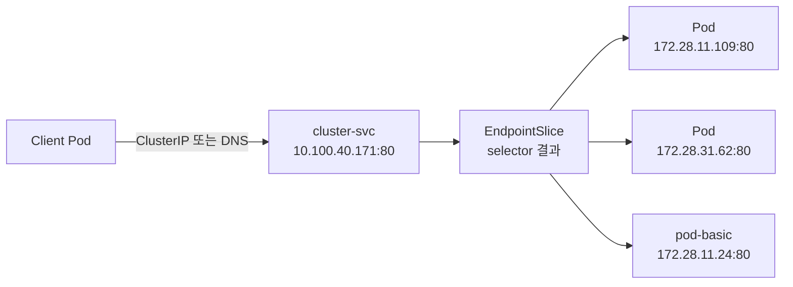

# EKS Service 기초 실습

> [!summary]
> `delivery` Namespace에 Deployment Pod 2개와 독립 Pod 1개를 만들고, `ClusterIP` Service인 `cluster-svc`가 같은 Label을 가진 세 Pod를 Backend로 선택하는 과정을 확인했다. Pod 내부에서 Service의 ClusterIP와 DNS 이름으로 접속해 `HTTP 200`을 받았으며, 같은 주소로 보낸 요청이 서로 다른 Pod IP로 전달되는 것도 확인했다.

> [!info] 이 노트의 범위
> 현재 실행 증거는 `ClusterIP`까지다. `NodePort`, `ExternalName`, `LoadBalancer`는 아직 실행한 것으로 기록하지 않는다.

## 1. Service가 필요한 이유

Deployment는 원하는 수의 Pod를 만들고 교체하지만, Client가 어느 Pod로 접속해야 하는지는 해결하지 않는다. Pod는 교체될 때 IP가 바뀔 수 있으므로 특정 Pod IP를 접속 주소로 고정하기 어렵다.

Service는 다음 두 역할을 맡는다.

1. Client에 잘 바뀌지 않는 ClusterIP와 DNS 이름을 제공한다.
2. `selector`와 일치하는 Pod를 Backend로 묶어 요청을 전달한다.

```text
Client Pod
    │
    │ cluster-svc:80
    ▼
Service 10.100.40.171:80
    │ selector: develop=spring-boot
    ▼
EndpointSlice
    ├─ 172.28.11.109:80
    ├─ 172.28.31.62:80
    └─ 172.28.11.24:80
```

> [!tip] 전화로 비유하면
> Pod IP는 직원 개인의 내선번호이고, Service의 ClusterIP와 DNS는 회사 대표번호다. 직원이 교체되어 내선번호가 바뀌어도 Client는 대표번호만 사용한다.

## 2. 사용한 Manifest

### Deployment

```yaml
apiVersion: apps/v1
kind: Deployment
metadata:
  name: deploy-basic
  namespace: delivery
spec:
  replicas: 2
  selector:
    matchLabels:
      develop: spring-boot
  template:
    metadata:
      labels:
        name: pod-basic
        app: web
        develop: spring-boot
    spec:
      containers:
        - name: web-containers
          image: unoh03/boot:latest
          ports:
            - containerPort: 80
```

### ClusterIP Service

```yaml
apiVersion: v1
kind: Service
metadata:
  name: cluster-svc
  namespace: delivery
spec:
  type: ClusterIP
  selector:
    develop: spring-boot
  ports:
    - port: 80
      targetPort: 80
```

- `type: ClusterIP`: Cluster 내부에서 접근할 가상 IP를 할당한다.
- `selector`: `develop=spring-boot` Label을 가진 Pod를 Backend 후보로 고른다.
- `port: 80`: Client가 Service에 접속할 Port다.
- `targetPort: 80`: Service가 선택한 Pod로 전달할 Port다.

### 독립 Pod

```yaml
apiVersion: v1
kind: Pod
metadata:
  name: pod-basic
  namespace: delivery
  labels:
    name: pod-basic
    app: web
    develop: spring-boot
spec:
  containers:
    - name: web-container
      image: unoh03/boot:latest
      resources:
        limits:
          memory: "1000Mi"
          cpu: "1000m"
      ports:
        - containerPort: 80
```

이 Pod는 통신을 시작하는 시험용 Pod인 동시에 `develop=spring-boot` Label을 갖는다. 따라서 자신도 `cluster-svc`의 Backend 후보에 포함된다.

## 3. 실행 흐름

### 3.1 Deployment와 Service 생성

```bash
kubectl apply -f deployment-basic.yml
kubectl apply -f service-ClusterIP.yml
```

```text
deployment.apps/deploy-basic created
service/cluster-svc created
```

실제 생성 상태:

```text
Deployment deploy-basic   2/2
Service    cluster-svc    ClusterIP 10.100.40.171:80
```

### 3.2 Namespace를 지정하지 않아 다른 Service를 조회함

```bash
kubectl get svc
```

```text
NAME         TYPE        CLUSTER-IP   PORT(S)
kubernetes   ClusterIP   10.100.0.1   443/TCP
```

`cluster-svc`는 `delivery` Namespace에 만들었지만 위 명령은 현재 `default` Namespace를 조회했다. 이때 보인 `kubernetes` Service는 Kubernetes API Server에 접근하기 위한 기본 Service이며, 이번에 만든 `cluster-svc`가 아니다.

잘못 고른 IP의 Port 80으로 접속해 다음 Timeout이 발생했다.

```bash
curl 10.100.0.1
```

```text
curl: (28) Failed to connect to 10.100.0.1 port 80 ... Could not connect to server
```

이번 Service를 조회하려면 Namespace를 지정해야 한다.

```bash
kubectl get svc -n delivery
```

> [!warning] IP만 보고 접속하지 말 것
> `10.100.0.1`은 이번 Application Service가 아니며 출력에도 `443/TCP`라고 표시됐다. Service 이름·Namespace·Port를 함께 확인해야 한다.

### 3.3 독립 Pod 생성

```bash
kubectl apply -f pod-basic.yml
kubectl get all -n delivery
```

```text
pod/deploy-basic-74959cd798-b299n   1/1   Running
pod/deploy-basic-74959cd798-pfpcp   1/1   Running
pod/pod-basic                       1/1   Running

service/cluster-svc   ClusterIP   10.100.40.171   80/TCP
deployment.apps/deploy-basic      2/2
replicaset.apps/deploy-basic-74959cd798   2   2   2
```

`kubectl get all`은 자주 쓰는 Workload와 Service를 한 번에 보여주지만 `EndpointSlice`까지 모두 보여주는 명령은 아니다. Service의 실제 Backend 목록은 별도로 확인한다.

## 4. Selector와 EndpointSlice 확인

Service 상세 상태:

```bash
kubectl describe svc cluster-svc -n delivery
```

```text
Selector:        develop=spring-boot
Type:            ClusterIP
IP:              10.100.40.171
Port:            80/TCP
TargetPort:      80/TCP
Endpoints:       172.28.11.109:80,172.28.31.62:80,172.28.11.24:80
Session Affinity: None
```

현재 Kubernetes에서 Service Backend 목록을 직접 확인:

```bash
kubectl get endpointslice -n delivery \
  -l kubernetes.io/service-name=cluster-svc -o wide
```

```text
NAME                PORTS   ENDPOINTS
cluster-svc-fqmsw   80      172.28.11.109,172.28.31.62,172.28.11.24
```

Pod와의 대응:

| 역할 | Pod IP | Node 가용 영역 |
|---|---|---|
| Deployment Pod | `172.28.11.109` | `ap-northeast-2a` |
| Deployment Pod | `172.28.31.62` | `ap-northeast-2c` |
| 독립 `pod-basic` | `172.28.11.24` | `ap-northeast-2a` |

> [!info] 강의자료의 `Endpoints`와 현재 Kubernetes
> 원자료는 `kubectl get endpoints`를 사용한다. 공식 문서 기준으로 기존 `Endpoints` API는 Kubernetes v1.33부터 deprecated이며, 현재 Backend 확인에는 `EndpointSlice` API 사용이 권장된다. Service에 selector가 있으면 Control Plane이 대응하는 EndpointSlice를 자동 생성·갱신한다.

## 5. ClusterIP 통신 검증

독립 Pod 내부 Shell에 진입했다.

```bash
kubectl exec -it pod-basic -n delivery -- bash
```

### ClusterIP로 접속

```bash
curl 10.100.40.171
```

Application Page가 반환됐고 응답 본문에서 Server IP `172.28.11.24`가 확인됐다.

```text
요청 위치: pod-basic 172.28.11.24
접속 주소: Service 10.100.40.171
실제 응답: pod-basic 172.28.11.24
```

즉, Service를 호출한 Pod 자신도 selector에 일치하므로 요청이 자기 자신에게 돌아올 수 있다.

### Service DNS로 접속

같은 Namespace에서는 Service 이름만으로 접근할 수 있다.

```bash
curl http://cluster-svc:80/
```

`HTTP 200`을 확인했다. IP를 직접 기억하지 않아도 `cluster-svc`라는 이름을 사용할 수 있다.

### 반복 요청의 Backend 변화

같은 `cluster-svc` 주소로 요청을 반복한 결과:

```text
TRY-1 → 172.28.11.109
TRY-2 → 172.28.11.109
TRY-3 → 172.28.31.62
TRY-4 → 172.28.31.62
TRY-5 → 172.28.11.109
```

첫 수동 요청에서는 `172.28.11.24`도 응답했다. 따라서 하나의 ClusterIP 뒤에 등록된 세 Pod가 모두 Backend가 될 수 있음을 실제로 확인했다.

> [!important] Round Robin을 보장한다고 단정하지 않는다
> 관찰된 사실은 요청이 여러 Backend로 전달됐다는 것이다. 짧은 출력의 순서만으로 정확한 분산 Algorithm이나 균등 분배를 확정하지 않는다.

## 6. 이번 실습에서 확인한 원리



- Client는 매번 바뀔 수 있는 Pod IP 대신 Service의 IP 또는 DNS를 사용한다.
- Service selector와 Pod Label이 연결 관계를 결정한다.
- 선택된 Pod 주소는 EndpointSlice에 기록된다.
- Pod가 여러 Node와 가용 영역에 있어도 Client는 같은 Service 주소를 사용한다.
- `ClusterIP`는 Cluster 내부 통신용이며 외부 Browser가 이 IP로 직접 접근하는 방식은 아니다.

## 7. 증거와 해석 경계

### ① Local primary evidence

- EKS Runtime의 Deployment Pod 2개와 독립 Pod 1개
- `cluster-svc`의 ClusterIP `10.100.40.171`
- EndpointSlice의 Backend IP 3개
- ClusterIP와 Service DNS 접속의 `HTTP 200`
- 반복 요청에서 서로 다른 Backend IP가 응답한 결과

### ② Authoritative external evidence

- Kubernetes 공식 Service 문서: selector가 일치하는 Pod의 `targetPort`로 Service 요청을 전달한다.
- Kubernetes 공식 EndpointSlice 문서: selector가 있는 Service의 EndpointSlice는 Control Plane이 자동 관리한다.
- Kubernetes 공식 DNS 문서: Pod는 Service의 일관된 DNS 이름을 사용해 접속할 수 있다.

### ④ Parametric knowledge

- 대표번호와 내선번호 비유
- Service를 Pod와 Client 사이의 안정적인 접속 창구로 설명한 부분

## 8. 오류와 해석 요약

| 관찰 | 원인 | 배운 점 |
|---|---|---|
| `kubectl get svc`에 `cluster-svc`가 없음 | `default` Namespace를 조회함 | Service가 존재하는 Namespace를 지정한다 |
| `curl 10.100.0.1` Timeout | 기본 Kubernetes API Service의 IP를 골랐고 Port 80으로 접속함 | 이름·Namespace·Port를 함께 확인한다 |
| 독립 Pod가 Endpoint에 추가됨 | Service selector와 Pod Label이 일치함 | 통신 시험 Pod도 Backend가 될 수 있다 |
| 같은 주소에서 서로 다른 Server IP가 응답 | Service 뒤에 Backend가 여러 개 등록됨 | Client는 개별 Pod IP를 알 필요가 없다 |

## 9. 검증 완료와 미완료

### 완료

- `ClusterIP` Service 생성
- `port: 80 → targetPort: 80` 연결
- selector가 Deployment Pod 2개와 독립 Pod 1개를 선택
- EndpointSlice에 세 Pod IP 등록
- ClusterIP 접속
- 같은 Namespace의 Service DNS 접속
- 반복 요청에서 복수 Backend 응답

### 미완료·후속 범위

- 다른 Namespace에서 `cluster-svc.delivery` 또는 FQDN으로 접속
- Pod 교체 시 EndpointSlice 자동 갱신 관찰
- selector 불일치 시 Endpoint가 비는 현상
- `NodePort`, `ExternalName`, `LoadBalancer`
- Session Affinity 동작

## 10. 다음 재시작 지점

오늘 수업 범위는 `service-ClusterIP.yml`이다. 다음 Service 유형을 시작하기 전 다음 상태를 먼저 확인한다.

```bash
kubectl get pod,svc,endpointslice -n delivery -o wide
```

## 관련 노트

- [[Lab_EKS Deployment 기초와 Rolling Update 실습]]
- [[10_학습 노트/클라우드/Kubernetes/Source Digest/Kubernetes - Source Digest 06 Service Object]]
- [[10_학습 노트/클라우드/Kubernetes/00_Kubernetes MOC]]

## 공식 참고

- [Kubernetes 공식 문서 — Service](https://kubernetes.io/docs/concepts/services-networking/service/)
- [Kubernetes 공식 문서 — EndpointSlice](https://kubernetes.io/docs/concepts/services-networking/endpoint-slices/)
- [Kubernetes 공식 문서 — DNS for Services and Pods](https://kubernetes.io/docs/concepts/services-networking/dns-pod-service/)
