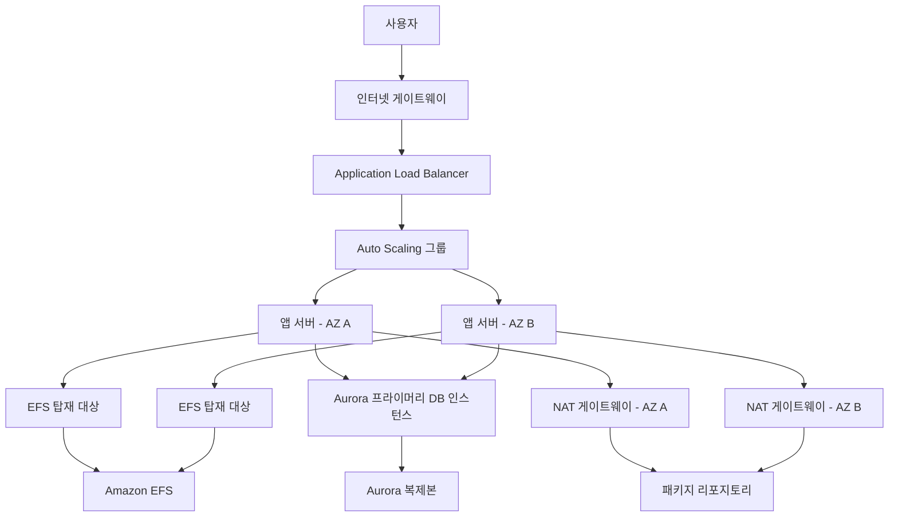
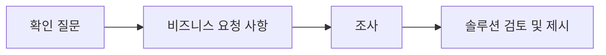

# Architecting on AWS 7.10.4 - 개요와 목차

> [!note]
> 이 노트는 PDF 내용을 학습 노트로 재해석하기 전, 정보 손실을 막기 위한 Source-faithful Markdown 변환본이다.  
> PDF에 반복되는 인쇄자 워터마크와 저작권 문구는 페이지마다 반복하지 않고 문서 메타 정보로만 기록한다.

## 문서 식별 정보

| 항목 | 내용 |
|---|---|
| 과정명 | Architecting on AWS (KO) |
| 문서 유형 | Student Guide |
| 버전 | 7.10.4 |
| 문서 ID | 200-ARCHIT-710-KO-SG |
| 저작권 | © 2026, Amazon Web Services, Inc. or its affiliates |
| 비고 | 개인 학습용 인쇄본. 반복 워터마크 존재 |

---

## 전체 목차

| 항목 | 시작 페이지 |
|---|---:|
| 교육 과정 소개 | 4 |
| 모듈 1: 아키텍팅 기본 사항 | 27 |
| 모듈 2: 계정 보안 | 68 |
| 모듈 3: 네트워킹 1 | 123 |
| 모듈 4: 컴퓨팅 | 179 |
| 모듈 5: 스토리지 | 243 |
| 모듈 6: 데이터베이스 서비스 | 316 |
| 모듈 7: 모니터링 및 크기 조정 | 375 |
| 모듈 8: 자동화 | 449 |
| 모듈 9: 컨테이너 | 486 |
| 모듈 10: 네트워킹 2 | 528 |
| 모듈 11: 서버리스 | 569 |
| 모듈 12: 엣지 서비스 | 621 |
| 모듈 13: 백업 및 복구 | 683 |
| 교육 과정 요약 | 733 |

---

## 교육 과정 소개

### 강의 준비

강의 시작 전 안내 항목은 다음과 같다.

- 휴식 및 점심 시간
- 문안
- 휴대전화
- 가상 강의실 기능
  - 오디오
  - 채팅
  - 질문하기

### 최적화된 방식으로 학습 진행

PDF는 교육 중 다음 활동을 반복하도록 안내한다.

- 쉬는 시간에는 휴식하기
- 즐겁게 지내기
- 참여하기
- 질문하기
- 학습 기회 최대한 활용하기
- 실습 수행하기

---

## 사전 조건

이 과정의 권장 사전 조건은 다음 중 하나다.

1. `AWS Cloud Practitioner Essentials`
2. `AWS Technical Essentials`
3. 다음 분야의 실무 지식 파악
   - 분산 시스템
   - 네트워킹 개념
   - IT 주소 지정
   - 멀티 티어 아키텍처
   - 클라우드 컴퓨팅 개념

> [!note]
> PDF에는 `AWS Cloud Practitioner Essentials` 과정으로 연결되는 QR 코드와 AWS Skill Builder 링크가 포함되어 있다.
>
> 링크: `https://explore.skillbuilder.aws/learn/course/external/view/elearning/134/aws-cloud-practitioner-essentials`

---

## 실습 환경 접근

### AWS Builder Labs 등록

실습 가이드와 실습 환경에 접근하려면 `AWS Builder Labs` 등록이 필요하다.

- 강사가 보낸 환영 이메일 확인
- 고유한 수강생 등록 URL 사용
- 계정 생성 또는 기존 AWS Builder Lab 계정 로그인
- 실습 환경, 실습 가이드, 수강생 가이드 접근

### 수강생 및 실습 가이드

AWS Builder Labs 로그인 후 다음에 접근할 수 있다.

- 실습 가이드
- 수강생 가이드
- eVantage Bookshelf / VitalSource 자료

> [!note]
> PDF에는 실습 가이드와 수강생 가이드 버튼이 AWS Builder Labs 대시보드의 오른쪽 상단 모서리에 있다고 설명되어 있다.

### 실습 요구 사항

| 구분 | 요구 사항 |
|---|---|
| 컴퓨터 운영 체제 | Windows, macOS, Linux |
| Linux 예시 | Ubuntu, SUSE, Red Hat |
| 권장 웹 브라우저 | Google Chrome, Mozilla Firefox, Microsoft Edge |
| 네트워크 | HTTPS로 인터넷을 탐색할 수 있는 안정적인 인터넷 연결 |
| AWS Builder Labs | 등록 필요 |
| 브라우저 설정 | 광고 차단기 및 스크립트 차단기 끄기 |

---

## 참가자 정보

강의 중 참가자는 다음 정보를 공유하도록 안내된다.

- 이름
- 조직 및 역할
- 이 교육 과정에서 배우려는 내용

---

## 과정 목표

이 과정의 목표는 다음과 같다.

- Amazon Web Services(AWS) 서비스를 파악한다.
- 각 서비스의 기능을 비교한다.
- 보안성, 탄력성, 고가용성이 우수한 IT 솔루션을 설계하기 위한 모범 사례를 살펴본다.

---

## 교육 일정

### 1일차

| 순서 | 섹션 제목 | 예상 소요 시간 |
|---:|---|---:|
| 1 | 모듈 1: 아키텍팅 기본 사항 | 45분 |
| 2 | 실습 1: AWS 관리 콘솔 및 AWS Command Line Interface 살펴보기 및 사용 | 35분 |
| 3 | 모듈 2: 계정 보안 | 60분 |
| 4 | 점심 시간 | 60분 |
| 5 | 모듈 3: 네트워킹 1 | 60분 |
| 6 | 모듈 4: 컴퓨팅 | 75분 |
| 7 | 실습 2: Amazon VPC 인프라 구축 | 45분 |

### 2일차

| 순서 | 섹션 제목 | 예상 소요 시간 |
|---:|---|---:|
| 1 | 모듈 5: 스토리지 | 70분 |
| 2 | 모듈 6: 데이터베이스 서비스 | 70분 |
| 3 | 실습 3: Amazon VPC 인프라에 데이터베이스 계층 생성 | 45분 |
| 4 | 점심 시간 | 60분 |
| 5 | 모듈 7: 모니터링 및 크기 조정 | 70분 |
| 6 | 실습 4: Amazon VPC에서 고가용성 구성 | 45분 |
| 7 | 모듈 8: 자동화 | 30분 |
| 8 | 모듈 9: 컨테이너 | 40분 |

### 3일차

| 순서 | 섹션 제목 | 예상 소요 시간 |
|---:|---|---:|
| 1 | 모듈 10: 네트워킹 2 | 45분 |
| 2 | 모듈 11: 서버리스 | 45분 |
| 3 | 실습 5: 서버리스 아키텍처 구축 | 45분 |
| 4 | 모듈 12: 엣지 서비스 | 60분 |
| 5 | 점심 시간 | 60분 |
| 6 | 실습 6: Amazon S3 오리진으로 Amazon CloudFront 배포 구성 | 60분 |
| 7 | 모듈 13: 백업 및 복구 | 40분 |
| 8 | 캡스톤 실습: AWS 멀티 티어 아키텍처 구축 | 90분 |
| 9 | 과정 요약 | 10분 |

---

## 캡스톤 실습

캡스톤 실습은 이 교육 과정의 최종 프로젝트다.

학습자는 다음을 수행한다.

- 프로젝트 데이터, 모범 사례, AWS Well-Architected Framework를 기반으로 아키텍처 솔루션 검토 및 분석
- 구체적인 지침을 참조하지 않고 랩에서 아키텍처 설계
- 요구 사항 검토 후, 이 교육 과정에서 배운 내용에 따라 과제 목록 완료

### 캡스톤 아키텍처

> [!important]
> PDF의 캡스톤 아키텍처 다이어그램은 텍스트로 완전히 대체하지 않는다.  
> 원본 이미지를 보존하고, 아래에 구성 요소와 흐름을 텍스트로 해설한다.

이미지 placeholder:

```text
![[Architecting-on-AWS-overview-p019-capstone-architecture.png]]
````

다이어그램에서 확인되는 주요 구성 요소:

- 리전
    
- VPC
    
- 2개 가용 영역
    
- 퍼블릭 서브넷
    
- 앱 서브넷
    
- 데이터베이스 서브넷
    
- 인터넷 게이트웨이
    
- NAT 게이트웨이
    
- Application Load Balancer
    
- Auto Scaling 그룹
    
- 앱 서버
    
- Amazon EFS
    
- EFS 탑재 대상
    
- Amazon Aurora 프라이머리 DB 인스턴스
    
- Aurora 복제본
    
- 패키지 리포지토리
    

약어:

|약어|의미|
|---|---|
|EFS|Amazon Elastic File Service|
|Aurora|Amazon Aurora|
|NAT|네트워크 주소 변환|
|VPC|Amazon Virtual Private Cloud|

다이어그램 해설:

- 사용자는 인터넷 게이트웨이를 통해 Application Load Balancer로 접근한다.
    
- Application Load Balancer는 두 퍼블릭 서브넷 모두에 연결된 것으로 표시된다.
    
- Application Load Balancer에서 Auto Scaling 그룹으로 흐름이 이어진다.
    
- Auto Scaling 그룹에는 두 가용 영역의 앱 서브넷에 있는 앱 서버가 포함된다.
    
- 각 앱 서버는 자체 서브넷의 EFS 탑재 대상과 통신해 Amazon EFS 파일 시스템에 연결된다.
    
- 앱 서버는 데이터베이스 서브넷의 Amazon Aurora 프라이머리 DB 인스턴스와 통신한다.
    
- 다른 데이터베이스 서브넷에는 Aurora 복제본이 포함된다.
    
- 앱 서버의 아웃바운드 인터넷 접근은 각 가용 영역의 NAT 게이트웨이를 통해 이루어진다.
    
- NAT 게이트웨이를 통한 화살표는 인터넷 게이트웨이를 통해 VPC 밖으로 나가 패키지 리포지토리에 도달하는 흐름을 나타낸다.
    



> [!warning]  
> 위 Mermaid는 원본 아키텍처 그림의 대체물이 아니라 복습용 흐름도다.  
> 실제 서브넷 경계, AZ 경계, VPC 경계는 원본 이미지를 기준으로 확인해야 한다.

---

## 모듈 형식

각 모듈은 대체로 다음 흐름으로 진행된다.



추가 활동:

- 라이브 그룹 채팅
    
    - 설문 조사 및 지식 확인
        
    - 강사에게 질문
        

모듈 시작 시에는 확인 질문으로 사전 이해도를 점검한다.  
이후 이해 관계자의 요청을 제시하고, 조사 및 강사 설명을 통해 솔루션을 검토한다.  
각 모듈이 끝나면 해당 모듈에서 배운 주제와 서비스를 복습한다.

---

## 비즈니스 요청 예시

Example Corp.의 CTO가 여러 프로젝트 작업을 위해 학습자를 Solutions Architect로 채용했다는 상황을 제시한다.

학습자는 다음을 해야 한다.

- 이해 관계자가 파악해야 하는 정보를 자세히 확인
    
- AWS 클라우드로 이전하는 여정 지원
    
- 모듈이 끝나면 이해 관계자의 질문을 검토
    
- 사용 사례에 적합한 솔루션 제시
    

---

## 보충 학습

교육 과정 완료 후에는 온라인 교육 과정 보충 자료(OCS)를 사용할 수 있다.

OCS에서 제공하는 항목:

- 모듈과 솔루션별 리소스 목록
    
- 지식 확인
    

링크:

```text
https://explore.skillbuilder.aws/learn/course/external/view/elearning/8319/architecting-on-aws-online-course-supplement
```

---

## AWS 설명서 리소스

Solutions Architect는 솔루션 결정을 위해 기능 및 서비스 관련 추가 정보를 찾아야 한다.

AWS 설명서는 다음 형태로 제공된다.

- HTML
    
- PDF
    
- GitHub
    

링크:

```text
https://docs.aws.amazon.com/
```

---

## 소개 종료

소개 섹션은 여기서 종료된다.

수정 사항, 피드백 또는 기타 질문이 있으면 AWS Training 문의 링크를 참고한다.

```text
https://support.aws.amazon.com/#/contacts/aws-training
```

---

# Coverage Map

|PDF page|내용|처리 방식|이미지 처리|상태|
|--:|---|---|---|---|
|1|표지|문서 식별 정보로 반영|장식 이미지 생략|preserved|
|2|저작권 / 문의|메타 정보로 반영|생략|preserved|
|3|전체 목차|Markdown 표 변환|생략|preserved|
|4|과정 소개 표지|섹션 제목으로 반영|장식 이미지 생략|preserved|
|5|강의 준비|섹션 제목으로 반영|장식 이미지 생략|preserved|
|6|최적화된 학습 방식|bullet로 변환|아이콘 의미만 반영|preserved|
|7|안내 사항|bullet로 변환|장식 이미지 생략|preserved|
|8|사전 조건|목록 + 링크로 변환|QR은 링크로 대체|preserved|
|9|AWS Builder Labs 등록|절차 요약으로 변환|실습 아이콘 생략|preserved|
|10|수강생 및 실습 가이드|절차 요약으로 변환|UI 이미지는 설명으로 반영|preserved|
|11|실습 요구 사항|표로 변환|생략|preserved|
|12|참가자 정보|bullet로 변환|말풍선 아이콘 생략|preserved|
|13|과정 개요 표지|섹션 제목으로 반영|장식 이미지 생략|preserved|
|14|과정 목표|bullet로 변환|생략|preserved|
|15|1일차 일정|Markdown 표 변환|표로 재작성|preserved|
|16|2일차 일정|Markdown 표 변환|표로 재작성|preserved|
|17|3일차 일정|Markdown 표 변환|표로 재작성|preserved|
|18|캡스톤 실습 개요|요약 + 핵심 bullet|실습 아이콘 생략|preserved|
|19|캡스톤 아키텍처|이미지 placeholder + 해설|원본 이미지 보존 필요|preserved-with-image|
|20|캡스톤 아키텍처 설명 계속|p.19 해설에 병합|없음|preserved|
|21|모듈 형식|Mermaid + 설명으로 변환|흐름도 재작성|preserved|
|22|비즈니스 요청 예시|요약 변환|인물 아이콘 생략|preserved|
|23|보충 학습 표지|섹션 제목으로 반영|장식 이미지 생략|preserved|
|24|OCS|링크 + 설명으로 변환|QR은 링크로 대체|preserved|
|25|AWS 설명서 리소스|링크 + 설명으로 변환|QR은 링크로 대체|preserved|
|26|소개 종료|종료 메모로 반영|장식 이미지 생략|preserved|
