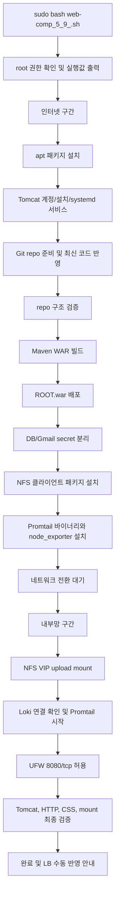

# web-comp(5.9).sh 설명서

- 설명 대상 스크립트: `web-comp_5_9_.sh`
- 현재 vault 보존 위치: `쉘 스크립트/구닥다리/web-comp_5_9_.sh`
- 설명 기준: 작성 당시 5.9 파일 내용 기준
- 실행 대상: WEB 서버

> [!warning] 현재 저장소 위치
> 이 설명서는 `web-comp_5_9_.sh`를 설명하지만, 현재 vault에서는 해당 파일이 `쉘 스크립트/구닥다리/web-comp_5_9_.sh`에 보존되어 있다. `쉘 스크립트/web-comp_final.sh` 또는 `쉘 스크립트/webCompZzinFinal.sh`를 현재 실행 기준으로 삼을지는 이 문서만으로 단정하지 않는다.

이 문서는 `web-comp_5_9_.sh`가 WEB 서버를 어떻게 설치, 재구축, 배포, 보안 패치, NFS 연결, 로그 수집 상태로 만드는지 설명한다.

## 0. 이 문서를 읽기 전에

### 한 줄 요약

`web-comp_5_9_.sh`는 WEB 서버 안에서 Tomcat, Git/Maven 빌드, ROOT.war 배포, DB/Gmail secret 분리, NFS upload mount, Promtail 로그 수집, 기본 검증을 한 번에 재현하는 통합 설치/재구축 스크립트다.

### 이 스크립트가 하는 일

| 구분 | 내용 |
|---|---|
| 실행 환경 준비 | JDK 17, Git, Maven, Tomcat 10 설치 |
| 소스 준비 | `/home/*/zzaphub` 자동 탐색 또는 GitHub repo clone/pull |
| 애플리케이션 배포 | Maven으로 WAR 빌드 후 Tomcat `ROOT.war`로 배포 |
| Secret 분리 | DB master/slave 접속 정보와 Gmail 발신 계정을 `/etc/zzaphub-db.env`로 분리 |
| 공유 업로드 경로 | NFS VIP `192.168.2.50:/share_directory`를 Tomcat upload 경로에 mount |
| 로그 수집 | Promtail 설정, Loki 연결 확인, node_exporter 설치 |
| 최종 검증 | Tomcat active, 8080 listen, HTTP/CSS 응답, NFS mount 상태 확인 |

### 이 스크립트가 하지 않는 일

| 하지 않는 일 | 이유 |
|---|---|
| 새 VM 생성 | AWS Auto Scaling 같은 인프라 생성 도구가 아니다. |
| IP 자동 할당 | 서버의 NIC, IP, gateway 설정은 사람이 먼저 맞춰야 한다. |
| LB upstream 자동 수정 | 새 WEB IP가 생기면 LB1/LB2의 nginx upstream은 수동으로 반영해야 한다. |
| DB 서버 구성 | DB master/slave 자체를 만들거나 복구하지 않는다. |
| NFS 서버 구성 | NFS1/NFS2 HA 구성은 `nfs-ha` 계열 스크립트의 역할이다. |

### 실행 전 필요한 것

| 필요 조건 | 설명 |
|---|---|
| root 권한 | `apt`, `/opt/tomcat`, `/etc/systemd`, `/etc/fstab`, `/etc/zzaphub-db.env`를 수정한다. |
| 인터넷 연결 구간 | Tomcat, apt 패키지, GitHub repo, Promtail 바이너리 다운로드가 필요하다. |
| 내부망 연결 구간 | NFS VIP, Loki 서버, WEB/LB 검증은 내부망에서 이루어진다. |
| DB/Gmail 값 | `MASTER_DB_*`, `SLAVE_DB_*`, `MAIL_USERNAME`, `MAIL_PASSWORD` 값이 필요하다. |
| GitHub repo 구조 | `src/main/resources/application.properties`, `mappers`, `src/main/webapp/jsp/css/js` 구조가 있어야 한다. |

### 가장 중요한 운영 전제

이 스크립트는 인터넷 구간과 내부망 구간을 일부러 분리한다.

프로젝트 환경에서는 default gateway 문제 때문에 다운로드와 내부 서버 간 검증을 동시에 안정적으로 수행하기 어렵다. 인터넷 gateway를 잡으면 `apt`, `wget`, `git pull`은 가능하지만 NFS VIP, Loki, C Zone 서버 간 통신 검증이 실패할 수 있다. 반대로 내부망 기준으로 gateway를 바꾸면 다운로드가 막힐 수 있다.

그래서 `main`은 먼저 인터넷이 필요한 작업을 끝내고, `prompt_switch_to_internal_network`에서 사용자가 네트워크를 전환할 때까지 멈춘다. 그 다음 내부망이 필요한 NFS mount, Loki 연결, WEB 검증을 진행한다.

즉 이 스크립트는 secret 입력을 환경변수로 넘길 수는 있지만, 전체 실행은 완전 무인 자동화가 아니다. 중간에 내부망 전환을 위해 사람이 개입해야 한다.

## 1. 전체 흐름 한눈에 보기

### 3구간 흐름



### `main` 함수 실행 순서

| 순서 | 함수 | 의미 |
|---:|---|---|
| 1 | `require_root` | root 권한 확인 |
| 2 | `install_packages` | JDK, curl, wget, tar 설치 |
| 3 | `ensure_build_tools` | Git, Maven 설치 |
| 4 | `ensure_tomcat_user` | `tomcat` 전용 계정 생성 |
| 5 | `install_tomcat_if_needed` | Tomcat 10 설치 |
| 6 | `write_tomcat_service` | Tomcat systemd 서비스 작성 |
| 7 | `prepare_source_repo` | repo 탐색, clone, remote, branch, pull |
| 8 | `normalize_application_properties_location` | `application.properties` 위치 정리 |
| 9 | `validate_repo_layout` | WAR 프로젝트 구조 검증 |
| 10 | `build_war_from_repo` | Maven WAR 빌드 |
| 11 | `deploy_built_war_as_ROOT` | Tomcat `ROOT.war` 배포 |
| 12 | `wait_for_app_properties` | WAR 압축 해제 대기 |
| 13 | `run_secure_patch` | DB/Gmail secret 분리 |
| 14 | `install_nfs_packages` | NFS client 패키지 설치 |
| 15 | `run_promtail_install` | Promtail, node_exporter 설치 |
| 16 | `prompt_switch_to_internal_network` | 인터넷 구간 종료 후 내부망 전환 대기 |
| 17 | `run_nfs_mount` | NFS VIP 실제 mount |
| 18 | `run_promtail_connect` | Loki 확인 및 Promtail 서비스 시작 |
| 19 | `open_firewall_if_requested` | UFW 8080/tcp 허용 |
| 20 | `verify_web` | WEB 최종 검증 |

## 2. 스크립트 구성 파트

스크립트 안 함수는 총 97개다. 설명서에서는 모든 보조 함수를 같은 무게로 나열하지 않고, 실행 흐름을 이해하는 데 필요한 주요 함수 중심으로 묶는다.

| 파트 | 역할 | 대표 함수 |
|---|---|---|
| 공통 유틸 | 로그, 오류, 백업, property/env 처리 | `log`, `warn`, `die`, `backup_file_or_dir`, `get_property`, `set_property` |
| 파트 1: 기반 설치 | 패키지와 Tomcat 실행 기반 준비 | `install_packages`, `ensure_build_tools`, `ensure_tomcat_user`, `install_tomcat_if_needed`, `write_tomcat_service` |
| 파트 2: Git / 소스 관리 | repo 탐색, clone, pull, 구조 검증 | `prepare_source_repo`, `ensure_repo_clean_if_needed`, `normalize_application_properties_location`, `validate_repo_layout` |
| 파트 3: WAR 빌드 & 배포 | WAR 생성, 기존 배포물 백업, ROOT 배포 | `build_war_from_repo`, `deploy_built_war_as_ROOT`, `wait_for_app_properties` |
| 파트 4: DB/Gmail Secret 분리 | env 파일 생성, placeholder 변환, systemd 연결 | `ensure_secret_env_file`, `secure_application_properties`, `write_systemd_dropin`, `update_war_if_present`, `verify_secure_patch` |
| 파트 5: NFS 마운트 | upload 경로를 NFS VIP에 연결 | `install_nfs_packages`, `run_nfs_mount`, `prepare_nfs_mount_point_and_backup`, `apply_nfs_mount` |
| 파트 6: 로그 수집 & 마무리 | Promtail 설정, Loki 연결, 최종 검증 | `run_promtail_install`, `run_promtail_connect`, `open_firewall_if_requested`, `verify_web` |

## 3. 파트별 상세 설명

### 공통 유틸과 환경값

> 전체 파트가 공유하는 기본값, 백업, 로그, 오류 처리 기능이다.

스크립트는 맨 위에서 `set -Eeuo pipefail`과 `IFS=$'\n\t'`를 사용한다. 중간 명령 실패, 정의되지 않은 변수, 파이프라인 실패를 가능한 한 빨리 드러내기 위한 설정이다.

주요 공통값은 다음과 같다.

```bash
TOMCAT_VER="${TOMCAT_VER:-10.1.54}"
TOMCAT_HOME="${TOMCAT_HOME:-${TOMCAT_BASE}/tomcat-10}"
APP_CONTEXT="${APP_CONTEXT:-ROOT}"
ENV_FILE="${ENV_FILE:-/etc/zzaphub-db.env}"
NFS_VIP="${NFS_VIP:-192.168.2.50}"
LOKI_PUSH_URL="${LOKI_PUSH_URL:-http://1.2.3.3:3100/loki/api/v1/push}"
```

`backup_file_or_dir`는 기존 설정 파일이나 배포물을 지우기 전에 `/var/backups/zzaphub-web-integrated` 아래에 백업한다. 그래서 배포물, env 파일, systemd drop-in, Promtail 설정을 덮기 전에 최소한의 되돌릴 지점을 남긴다.

### 파트 1: 기반 설치

> WEB 서버가 Java/Tomcat 애플리케이션을 실행할 수 있는 상태를 만든다.

이 파트는 인터넷 구간에서 실행된다. `apt`가 필요하므로 외부 다운로드가 가능한 네트워크 상태여야 한다.

| 함수 | 한 줄 설명 |
|---|---|
| `install_packages` | `openjdk-17-jdk`, `curl`, `wget`, `tar` 설치 |
| `ensure_build_tools` | `git`, `maven` 설치 |
| `ensure_tomcat_user` | `tomcat` 시스템 계정 생성 |
| `install_tomcat_if_needed` | Tomcat tarball 다운로드 후 `/opt/tomcat/tomcat-10`에 설치 |
| `write_tomcat_service` | `/etc/systemd/system/tomcat.service` 작성 및 enable |

핵심 흐름은 다음과 같다.

```bash
apt install -y openjdk-17-jdk curl wget tar
apt install -y git maven
useradd -r -m -U -d "${TOMCAT_BASE}" -s /bin/false "${TOMCAT_USER}"
wget -O "${tarball}" "${TOMCAT_DOWNLOAD_URL}"
systemctl enable "${SERVICE_NAME}"
```

Tomcat이 이미 설치되어 있고 `${TOMCAT_HOME}/bin/startup.sh`가 실행 가능하면 재설치하지 않는다. 반대로 `${TOMCAT_HOME}` 경로가 존재하지만 Tomcat 구조가 아니면 중단한다. 잘못된 디렉터리를 덮어쓰지 않기 위한 보호 장치다.

### 파트 2: Git / 소스 관리

> 어떤 소스를 빌드할지 확정하고, 배포 가능한 repo 구조인지 검증한다.

`PROJECT_DIR`이 비어 있으면 스크립트는 `/home/*/zzaphub` 아래의 Git repo를 찾는다. 후보가 하나면 사용하고, 여러 개면 사용자가 직접 `PROJECT_DIR`을 지정하게 한다. repo가 없으면 `GIT_URL`과 `GIT_BRANCH` 기준으로 clone한다.

| 함수 | 한 줄 설명 |
|---|---|
| `resolve_project_dir` | `PROJECT_DIR` 자동 결정 |
| `clone_source_repo` | repo가 없을 때 GitHub에서 clone |
| `ensure_repo_remote` | remote URL이 기대값과 맞는지 확인 |
| `ensure_repo_clean_if_needed` | uncommitted 변경이 있으면 기본적으로 중단 |
| `ensure_repo_branch` | `GIT_BRANCH`로 branch 맞춤 |
| `prepare_source_repo` | 위 과정을 묶고 `git pull --ff-only` 실행 |
| `normalize_application_properties_location` | `src/main/java`의 properties를 `src/main/resources`로 이동 |
| `validate_repo_layout` | JSP/CSS/JS/mappers 구조 확인 |

이 파트의 중요한 보호 장치는 dirty repo 차단이다.

```bash
dirty="$(run_in_project_dir git status --porcelain)"
if [ -n "${dirty}" ] && [ "${ALLOW_DIRTY_REPO}" != "1" ]; then
    die "기존 작업을 덮지 않기 위해 중단합니다."
fi
```

기본값은 보수적이다. 누군가 서버에서 수정한 소스가 있으면 자동 pull/build로 덮어버리지 않는다. 테스트 서버에서만 계속 진행하려면 `ALLOW_DIRTY_REPO=1`을 명시해야 한다.

repo 구조 검증은 배포 후 화면 리소스가 빠지는 문제를 막기 위한 단계다.

| 필수 경로 | 이유 |
|---|---|
| `src/main/resources/application.properties` | Spring 설정 파일 |
| `src/main/resources/mappers` | MyBatis mapper XML |
| `src/main/webapp/jsp` | JSP 화면 |
| `src/main/webapp/css` | CSS 정적 리소스 |
| `src/main/webapp/js` | JS 정적 리소스 |

### 파트 3: WAR 빌드 & ROOT 배포

> 최신 소스를 WAR로 만들고 Tomcat의 기본 루트 애플리케이션으로 배포한다.

| 함수 | 한 줄 설명 |
|---|---|
| `build_war_from_repo` | `mvn clean package -DskipTests` 실행 후 WAR 탐색 |
| `backup_and_remove_deploy_path` | 기존 배포물을 백업하고 제거 |
| `clear_tomcat_work_cache` | Tomcat work cache 정리 |
| `deploy_built_war_as_ROOT` | 빌드된 WAR를 `${APP_CONTEXT}.war`로 복사 |
| `wait_for_app_properties` | Tomcat이 WAR를 풀 때까지 대기 |

기본 배포 context는 `ROOT`다. 그래서 최종 WAR는 기본적으로 다음 위치에 배포된다.

```bash
/opt/tomcat/tomcat-10/webapps/ROOT.war
```

기존 배포물은 바로 삭제하지 않고 먼저 백업한다. 제거 대상도 Tomcat `webapps` 아래로 제한한다.

```bash
case "${path}" in
    "${TOMCAT_HOME}/webapps/"*) ;;
    *) die "배포물 삭제 대상 경로가 예상 범위를 벗어났습니다." ;;
esac
```

이 보호 장치가 없으면 잘못된 변수값 때문에 엉뚱한 경로를 지울 수 있다. 현재 스크립트는 배포물 삭제 범위를 Tomcat webapps 안으로 제한한다.

### 파트 4: DB/Gmail Secret 분리

> 소스와 배포물 안의 평문 접속 정보를 Tomcat 런타임 env 파일로 분리한다.

이 파트는 `RUN_SECURE=1`일 때 실행된다. 기본값은 실행이다.

| 함수 | 한 줄 설명 |
|---|---|
| `ensure_secret_env_file` | `/etc/zzaphub-db.env` 생성 또는 기존 파일 재사용 |
| `prompt_env_var_if_needed` | 필요한 secret 값이 없으면 대화형 입력 요청 |
| `secure_application_properties` | `application.properties` 값을 `${...}` placeholder로 변경 |
| `write_systemd_dropin` | Tomcat systemd drop-in에 `EnvironmentFile` 연결 |
| `update_war_if_present` | 배포된 WAR 내부 properties도 placeholder 버전으로 갱신 |
| `restart_tomcat_after_secure_patch` | systemd reload 후 Tomcat 재시작 |
| `verify_secure_patch` | properties/env/drop-in 상태 검증 |

분리되는 값은 8개다.

| env 이름 | 의미 |
|---|---|
| `MASTER_DB_URL` | master DB JDBC URL |
| `MASTER_DB_USER` | master DB 사용자 |
| `MASTER_DB_PASSWORD` | master DB 비밀번호 |
| `SLAVE_DB_URL` | slave DB JDBC URL |
| `SLAVE_DB_USER` | slave DB 사용자 |
| `SLAVE_DB_PASSWORD` | slave DB 비밀번호 |
| `MAIL_USERNAME` | 발신용 Gmail 계정 |
| `MAIL_PASSWORD` | Gmail 앱 비밀번호 |

`application.properties`는 다음처럼 placeholder를 바라보게 바뀐다.

```properties
spring.datasource.master.jdbc-url=${MASTER_DB_URL}
spring.datasource.master.username=${MASTER_DB_USER}
spring.datasource.master.password=${MASTER_DB_PASSWORD}
spring.datasource.slave.jdbc-url=${SLAVE_DB_URL}
spring.datasource.slave.username=${SLAVE_DB_USER}
spring.datasource.slave.password=${SLAVE_DB_PASSWORD}
spring.mail.username=${MAIL_USERNAME}
spring.mail.password=${MAIL_PASSWORD}
```

Tomcat은 systemd drop-in을 통해 env 파일을 읽는다.

```ini
[Service]
EnvironmentFile=/etc/zzaphub-db.env
```

중요한 점은 이 방식이 secret을 완전히 없애는 것이 아니라, Git repo와 WAR 내부에서 secret을 분리하는 방식이라는 점이다. `/etc/zzaphub-db.env` 자체는 여전히 민감 파일이므로 Git에 올리면 안 되고, 권한은 `600`, 소유자는 `root:root`로 제한한다.

### 파트 5: NFS 마운트

> Tomcat upload 디렉터리를 WEB 로컬 디스크가 아니라 NFS VIP 공유 경로로 연결한다.

NFS는 두 단계로 나뉜다.

| 단계 | 실행 위치 | 이유 |
|---|---|---|
| `install_nfs_packages` | 인터넷 구간 | `nfs-common`, `lsof`를 apt로 설치해야 한다. |
| `run_nfs_mount` | 내부망 구간 | 실제 NFS VIP는 내부망에서 접근한다. |

기본 NFS 설정은 다음과 같다.

| 항목 | 기본값 |
|---|---|
| NFS VIP | `192.168.2.50` |
| 원격 공유 | `/share_directory` |
| mount source | `192.168.2.50:/share_directory` |
| mount point | `/opt/tomcat/tomcat-10/webapps/upload` |
| NFS version | `4` |

`run_nfs_mount`는 이미 mount되어 있는지 먼저 확인한다.

| 상태 | 처리 |
|---|---|
| mount 안 됨 | 로컬 upload 파일 백업 후 NFS mount |
| 기대 source로 이미 mount됨 | fstab 갱신, remount 시도, 상태 출력 |
| 다른 source로 mount됨 | 중단 |
| 중복 mount 감지 | 중단 |

로컬 upload 파일이 이미 있으면 NFS mount 전에 백업한다.

```bash
NFS_LOCAL_BACKUP_DIR="${NFS_BACKUP_BASE}/upload-local-backup-$(date +%Y%m%d-%H%M%S)"
cp -a "${MOUNT_DIR}/." "${NFS_LOCAL_BACKUP_DIR}/"
```

NFS mount 후에는 백업한 파일을 NFS 쪽으로 복사하되, 같은 이름의 파일은 덮어쓰지 않는다. 이미 공유 스토리지에 있는 파일을 로컬 백업으로 덮어쓰지 않기 위한 선택이다.

### 파트 6: 로그 수집 & 마무리

> WEB 서버 로그를 Loki로 보내고, WEB 서비스가 실제로 응답하는지 확인한다.

Promtail도 인터넷 구간과 내부망 구간이 분리된다.

| 단계 | 함수 | 설명 |
|---|---|---|
| 설치 | `run_promtail_install` | Promtail 바이너리 다운로드, config 생성, node_exporter 설치 |
| 연결 | `run_promtail_connect` | Loki `/ready` 확인, Promtail systemd 서비스 시작 |

기본값은 `PROMTAIL_MODE=auto`, `PROMTAIL_PRESET=web`이다. web preset은 다음 로그를 수집한다.

| job | 수집 경로 |
|---|---|
| `system` | `/var/log/*.log` |
| `syslog` | `/var/log/syslog` |
| `tomcat` | `/opt/tomcat/tomcat-10/logs/*.log` |
| `tomcat_out` | `/opt/tomcat/tomcat-10/logs/catalina.out` |

Loki 기본 push URL은 다음과 같다.

```text
http://1.2.3.3:3100/loki/api/v1/push
```

내부망 전환 후에는 이 URL에서 `/ready`로 바꾼 endpoint를 확인한다.

```text
http://1.2.3.3:3100/ready
```

Promtail 실패는 기본적으로 WEB 설치 자체를 막지 않는다. 로그 수집까지 반드시 성공해야 하는 상황이면 `PROMTAIL_REQUIRED=1`을 지정한다.

마지막 `verify_web`는 다음을 확인한다.

| 검증 | 설명 |
|---|---|
| `systemctl is-active tomcat.service` | Tomcat active 상태 확인 |
| `ss -ltn | grep ':8080 '` | 8080 listen 확인 |
| `curl http://127.0.0.1:8080/` | 애플리케이션 루트 응답 확인 |
| `curl http://127.0.0.1:8080/css/header.css` | CSS 정적 리소스 배포 확인 |
| `findmnt --mountpoint .../webapps/upload` | NFS mount 확인 |

새 WEB 서버의 IP가 기존 WEB1/WEB2가 아니라면 스크립트 완료 후 LB1/LB2에서 nginx upstream을 수동 수정해야 한다.

```bash
sudo nginx -t
sudo systemctl reload nginx
```

## 4. 환경변수 레퍼런스

### Tomcat / 애플리케이션

| 변수 | 기본값 | 설명 |
|---|---|---|
| `TOMCAT_VER` | `10.1.54` | 설치할 Tomcat 버전 |
| `TOMCAT_BASE_URL` | `https://downloads.apache.org/tomcat/tomcat-10` | Tomcat 다운로드 base URL |
| `TOMCAT_DOWNLOAD_URL` | Tomcat tar.gz URL | 직접 다운로드 URL override |
| `TOMCAT_USER` | `tomcat` | Tomcat 실행 사용자 |
| `TOMCAT_GROUP` | `tomcat` | Tomcat 실행 그룹 |
| `TOMCAT_BASE` | `/opt/tomcat` | Tomcat 상위 경로 |
| `TOMCAT_HOME` | `/opt/tomcat/tomcat-10` | 실제 Tomcat 설치 경로 |
| `SERVICE_NAME` | `tomcat.service` | systemd 서비스 이름 |
| `APP_CONTEXT` | `ROOT` | Tomcat 배포 context |
| `APP_EXPAND_WAIT` | `60` | WAR 압축 해제 대기 시간 |

### Git / 빌드

| 변수 | 기본값 | 설명 |
|---|---|---|
| `PROJECT_DIR` | 비어 있음 | 비어 있으면 `/home/*/zzaphub` 자동 탐색 |
| `GIT_URL` | `https://github.com/SUS7898/zzaphub.git` | clone/pull 대상 repo |
| `GIT_REMOTE` | `origin` | 사용할 remote 이름 |
| `GIT_BRANCH` | `main` | 사용할 branch |
| `BUILT_WAR` | 비어 있음 | 직접 WAR를 지정하면 Maven 빌드 결과 대신 사용 |
| `ALLOW_DIRTY_REPO` | `0` | `1`이면 uncommitted 변경이 있어도 진행 |
| `ALLOW_REMOTE_REWRITE` | `0` | `1`이면 remote URL을 기대값으로 변경 |

### Secret 분리

| 변수 | 기본값 | 설명 |
|---|---|---|
| `RUN_SECURE` | `1` | DB/Gmail secret 분리 실행 여부 |
| `UPDATE_WAR` | `1` | 배포 WAR 내부 properties까지 갱신할지 여부 |
| `ENV_FILE` | `/etc/zzaphub-db.env` | secret env 파일 |
| `PROP_FILE` | `${TOMCAT_HOME}/webapps/${APP_CONTEXT}/WEB-INF/classes/application.properties` | 배포된 properties 경로 |
| `WAR_FILE` | `${TOMCAT_HOME}/webapps/${APP_CONTEXT}.war` | 배포 WAR 경로 |
| `DROPIN_FILE` | `/etc/systemd/system/${SERVICE_NAME}.d/10-zzaphub-db-env.conf` | systemd env 연결 drop-in |
| `MASTER_DB_URL` | 없음 | master DB JDBC URL |
| `MASTER_DB_USER` | 없음 | master DB 사용자 |
| `MASTER_DB_PASSWORD` | 없음 | master DB 비밀번호 |
| `SLAVE_DB_URL` | 없음 | slave DB JDBC URL |
| `SLAVE_DB_USER` | 없음 | slave DB 사용자 |
| `SLAVE_DB_PASSWORD` | 없음 | slave DB 비밀번호 |
| `MAIL_USERNAME` | 없음 | 발신용 Gmail 계정 |
| `MAIL_PASSWORD` | 없음 | Gmail 앱 비밀번호 |

### NFS

| 변수 | 기본값 | 설명 |
|---|---|---|
| `RUN_NFS` | `1` | NFS upload mount 실행 여부 |
| `NFS_VIP` | `192.168.2.50` | NFS HA VIP |
| `NFS_VERSION` | `4` | NFS protocol version |
| `NFS_REMOTE_SHARE` | `/share_directory` | NFS export 경로 |
| `MOUNT_DIR` | `${TOMCAT_HOME}/webapps/upload` | WEB upload mount point |
| `NFS_BACKUP_BASE` | `${TOMCAT_BASE}` | 로컬 upload 백업 생성 위치 |

### Promtail / Loki / 방화벽

| 변수 | 기본값 | 설명 |
|---|---|---|
| `RUN_PROMTAIL` | `1` | Promtail 설치/연결 실행 여부 |
| `PROMTAIL_REQUIRED` | `0` | `1`이면 Promtail 실패 시 전체 중단 |
| `PROMTAIL_MODE` | `auto` | `auto`, `prompt`, `skip` |
| `PROMTAIL_PRESET` | `web` | `web`, `lb`, `dns`, `db`, `nfs`, `system` |
| `PROMTAIL_HOST_LABEL` | hostname | Loki/Grafana host label |
| `PROMTAIL_ROLE_LABEL` | `web` | Loki/Grafana role label |
| `PROMTAIL_VERSION` | `2.9.0` | 설치할 Promtail 버전 |
| `LOKI_PUSH_URL` | `http://1.2.3.3:3100/loki/api/v1/push` | Loki push endpoint |
| `PROMTAIL_BIN` | `/usr/local/bin/promtail` | Promtail binary 경로 |
| `PROMTAIL_CONFIG` | `/etc/promtail/promtail-config.yaml` | Promtail config 경로 |
| `PROMTAIL_SERVICE` | `/etc/systemd/system/promtail.service` | Promtail systemd 서비스 파일 |
| `POSITIONS_FILE` | `/var/lib/promtail/positions.yaml` | Promtail positions 파일 |
| `PROMTAIL_EXTRA_LOGS` | 비어 있음 | `job:label:/path/*.log;...` 형식의 추가 로그 |
| `INSTALL_NODE_EXPORTER` | `1` | node_exporter 설치 여부 |
| `CHECK_LOKI_READY` | `1` | Loki `/ready` 확인 여부 |
| `ALLOW_UFW` | `1` | UFW 8080/tcp 허용 여부 |

## 5. 실행 예시 모음

### 기본 실행

스크립트가 WEB 서버에 있다고 가정한다.

```bash
sudo bash 'web-comp_5_9_.sh'
```

repo 루트에서 실행한다면 경로를 quote 처리한다.

```bash
sudo bash './쉘 스크립트/web-comp_5_9_.sh'
```

### PROJECT_DIR 지정

자동 탐색 대신 소스 repo 경로를 명시한다.

```bash
sudo PROJECT_DIR=/home/t_web/zzaphub bash 'web-comp_5_9_.sh'
```

### Promtail 끄기

WEB 배포와 NFS까지만 진행하고 로그 수집 설치를 건너뛴다.

```bash
sudo RUN_PROMTAIL=0 bash 'web-comp_5_9_.sh'
```

### Promtail prompt 모드

Loki URL, host/role label, 로그 경로를 직접 입력한다.

```bash
sudo PROMTAIL_MODE=prompt bash 'web-comp_5_9_.sh'
```

### Secret 값을 환경변수로 넘기기

이 방식은 secret 입력 부분을 비대화형으로 처리한다. 단, 네트워크 전환 단계에서는 여전히 사람이 엔터를 눌러야 한다.

```bash
sudo \
  MASTER_DB_URL='jdbc:mariadb://1.2.3.1:3306/care' \
  MASTER_DB_USER='web' \
  MASTER_DB_PASSWORD='<직접입력>' \
  SLAVE_DB_URL='jdbc:mariadb://1.2.3.2:3306/care' \
  SLAVE_DB_USER='web' \
  SLAVE_DB_PASSWORD='<직접입력>' \
  MAIL_USERNAME='<발신용Gmail주소>' \
  MAIL_PASSWORD='<Gmail앱비밀번호>' \
  bash 'web-comp_5_9_.sh'
```

### env 파일을 미리 만들어 두고 실행

`/etc/zzaphub-db.env`를 먼저 만들면 실행 중 secret 입력을 줄일 수 있다.

```bash
sudo install -m 600 -o root -g root /dev/null /etc/zzaphub-db.env
sudo editor /etc/zzaphub-db.env
sudo bash 'web-comp_5_9_.sh'
```

파일 내용 형식은 다음과 같다.

```bash
MASTER_DB_URL='jdbc:mariadb://1.2.3.1:3306/care'
MASTER_DB_USER='web'
MASTER_DB_PASSWORD='<직접입력>'
SLAVE_DB_URL='jdbc:mariadb://1.2.3.2:3306/care'
SLAVE_DB_USER='web'
SLAVE_DB_PASSWORD='<직접입력>'
MAIL_USERNAME='<발신용Gmail주소>'
MAIL_PASSWORD='<Gmail앱비밀번호>'
```

### 내부망 전환 시점

스크립트가 다음 안내를 출력하면 인터넷 구간 작업이 끝난 것이다.

```text
[INFO] 인터넷 구간 작업이 모두 끝났습니다.
[INFO] 이제 내부망 통신이 필요한 작업을 시작합니다.
```

이 시점에 할 일은 다음과 같다.

1. 인터넷 다운로드용 adapter/gateway를 끊거나 우선순위를 낮춘다.
2. C Zone 내부망 adapter/gateway를 연결하거나 우선순위를 맞춘다.
3. WEB 서버에서 `192.168.2.50` NFS VIP와 `1.2.3.3:3100` Loki 경로가 통신 가능한 상태인지 확인한다.
4. 준비가 끝나면 엔터를 눌러 계속 진행한다.

## 6. 실패 시 확인 포인트와 롤백

### 자주 막히는 지점

| 증상 | 확인할 것 |
|---|---|
| `apt` 또는 `wget` 실패 | 아직 인터넷 구간인지, default gateway가 인터넷 쪽인지 확인 |
| Git remote URL 불일치 | 의도한 repo가 맞는지 확인 후 필요할 때만 `ALLOW_REMOTE_REWRITE=1` 사용 |
| dirty repo로 중단 | 서버에 남은 수정이 필요한 작업인지 확인. 테스트용이면 `ALLOW_DIRTY_REPO=1` |
| WAR가 여러 개 | `BUILT_WAR=/path/app.war`로 배포 대상을 명시 |
| `application.properties`를 못 찾음 | Tomcat이 WAR를 풀었는지, `APP_CONTEXT`, `TOMCAT_HOME`이 맞는지 확인 |
| secret 값 부족 | `/etc/zzaphub-db.env` 또는 환경변수 8개를 채움 |
| NFS mount 실패 | 내부망 전환, NFS VIP, `/etc/fstab`, 중복 mount, export 상태 확인 |
| Loki `/ready` 실패 | Log 서버 상태, ACL, 방화벽 3100/tcp 확인 |
| WEB HTTP 확인 실패 | `journalctl -u tomcat.service -n 100 --no-pager` 확인 |

### 백업 위치

스크립트는 기존 파일이나 디렉터리를 바꾸기 전에 다음 위치에 백업한다.

```text
/var/backups/zzaphub-web-integrated
```

NFS mount 전에 로컬 upload 파일이 있으면 다음 형태로 백업한다.

```text
/opt/tomcat/upload-local-backup-YYYYMMDD-HHMMSS
```

### 기본 수동 확인 명령

```bash
systemctl status tomcat.service --no-pager
curl http://127.0.0.1:8080/
curl http://127.0.0.1:8080/css/header.css
findmnt --mountpoint /opt/tomcat/tomcat-10/webapps/upload
ls -l /etc/zzaphub-db.env
systemctl status promtail --no-pager
```

### LB 반영

새 WEB 서버의 C Zone IP가 기존 WEB1/WEB2가 아니면 LB1/LB2의 nginx upstream에 새 IP를 넣어야 한다.

```bash
sudo nginx -t
sudo systemctl reload nginx
```

이 단계는 `web-comp_5_9_.sh`가 자동으로 하지 않는다.
