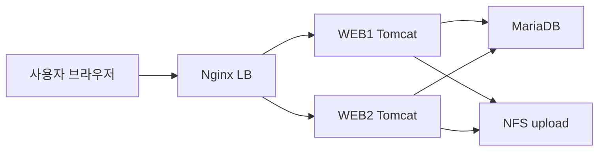
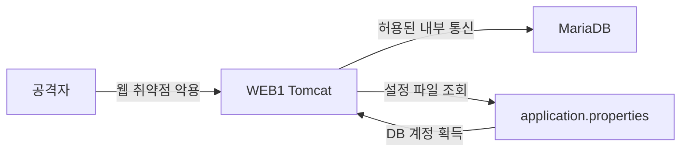
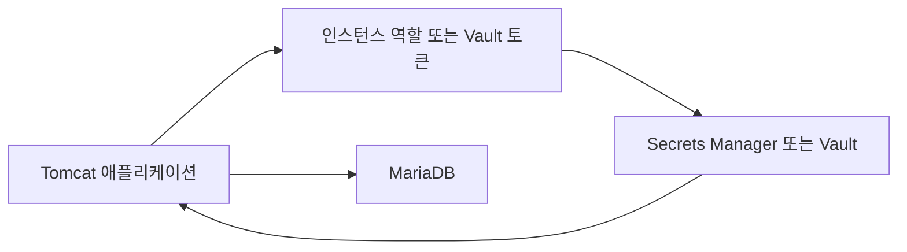
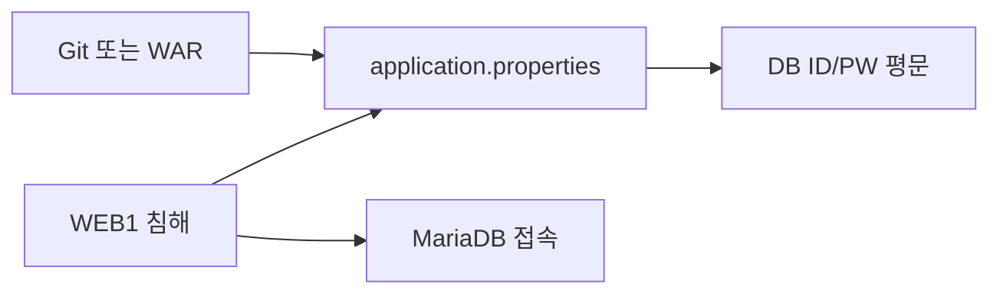
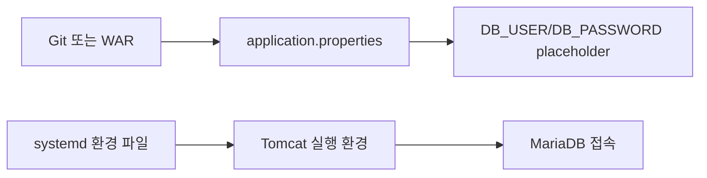
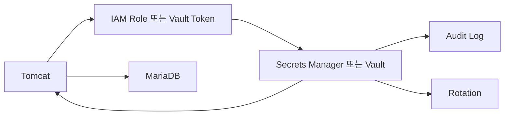

# 시크릿 관리와 WEB 침해 대응

상태: 보고서 초안  
작성 목적: 팀프로젝트에서 WEB 서버 침해가 DB 침해로 이어지는 과정을 설명하고, 하드코딩된 DB 접속정보를 제거하는 이유와 적용 방법을 정리한다.

## 1. 이 문서를 쓰는 이유

팀프로젝트는 단순히 서버를 켜는 프로젝트가 아니다. 외부 사용자는 DNS와 LB를 통해 WEB 서버에 접근하고, WEB 서버는 DB와 NFS를 사용한다. 즉 한 계층이 침해되면 다음 계층으로 피해가 이어질 수 있다.

처음에는 DB 서버에 방화벽을 걸고 WEB1/WEB2에서만 3306 포트 접근을 허용하면 안전하다고 생각하기 쉽다. 하지만 실제 공격에서는 공격자가 방화벽을 정면으로 뚫지 않는다. 이미 허용된 WEB 서버를 먼저 장악한 다음, WEB 서버가 원래 가지고 있던 DB 접속 권한을 악용한다.

이 문서의 핵심 질문은 다음과 같다.

```text
WEB1 서버가 tomcat 권한으로 침해되었을 때,
공격자가 DB 계정과 비밀번호를 어떻게 얻을 수 있는가?
그리고 그 피해를 줄이려면 아키텍처를 어떻게 바꿔야 하는가?
```

## 2. 우리 프로젝트 구조

현재 팀프로젝트의 주요 흐름은 다음과 같다.

```text
사용자
  -> DNS
  -> Nginx LB VIP
  -> WEB1 또는 WEB2 Tomcat
  -> MariaDB
  -> NFS upload 저장소
```

관련 파일과 위치:

| 구분 | 위치 | 보안 관점 |
|---|---|---|
| Spring Boot WAR | `쉘 스크립트/boot.war` | 배포물 안에 설정 파일이 들어갈 수 있음 |
| WAR 분석 결과 | `쉘 스크립트/boot-war-inspect/` | WAR 내부 파일을 풀어본 결과라 secret 포함 여부 확인 필요 |
| Spring 설정 | `WEB-INF/classes/application.properties` | DB URL, ID, PW가 들어가기 쉬운 위치 |
| WEB 설치 스크립트 | `쉘 스크립트/web.sh` | 배포 과정에서 DB 설정을 수정할 수 있음 |
| DB 설치 스크립트 | `쉘 스크립트/db.sh` | DB 계정 생성, 권한, 비밀번호가 들어가기 쉬움 |
| NFS upload | `/opt/tomcat/tomcat-10/webapps/upload` | webapps 아래라 업로드 파일 실행 위험 검토 필요 |

주의: 이 문서는 실제 비밀번호 값을 기록하지 않는다. secret은 문서, Git, 보고서, 캡처에 남기지 않는 것이 원칙이다.

## 3. 정상 데이터 흐름

정상 사용자는 WEB 서버에 요청을 보내고, WEB 서버가 DB에 대신 접속한다. 사용자는 DB 비밀번호를 알 필요가 없다.



정상 흐름에서 DB 비밀번호를 사용하는 주체는 사용자 브라우저가 아니라 WEB 애플리케이션이다.

```text
사용자 입력
  -> Controller
  -> Service
  -> Mapper/JDBC
  -> DB 접속
```

이때 DB 접속정보는 보통 Spring의 `application.properties` 또는 실행 환경에서 읽힌다.

## 4. 공격 시나리오

가정:

- 공격자는 WEB1의 SSH 계정 비밀번호를 모른다.
- 공격자는 root 권한도 없다.
- 하지만 Tomcat 또는 웹 애플리케이션 취약점으로 WEB1에서 tomcat 권한의 코드 실행을 얻었다.
- DB 방화벽은 WEB1/WEB2의 IP에서 오는 3306 접속을 허용한다.

이 상황에서 DB 방화벽은 공격자를 막지 못한다. 공격자는 외부 PC에서 DB로 직접 접속하는 것이 아니라, 이미 허용된 WEB1 안에서 DB로 접속하기 때문이다.



## 5. 공격자가 볼 수 있는 파일

Spring Boot 애플리케이션은 DB 접속정보가 필요하다. 만약 그 정보가 WAR 내부의 `application.properties`에 평문으로 들어 있으면, WAR를 가진 사람이나 WEB 서버를 장악한 공격자는 값을 볼 수 있다.

전형적인 위험 예시는 다음과 같다.

```properties
spring.datasource.url=jdbc:mariadb://192.168.x.x:3306/app
spring.datasource.username=db_user
spring.datasource.password=<실제 비밀번호>
```

이 방식의 문제:

- GitHub에 올라가면 secret이 외부로 노출된다.
- WAR 파일에 포함되면 배포물을 가진 사람이 압축을 풀어 확인할 수 있다.
- WEB 서버가 침해되면 tomcat 권한으로 설정 파일을 읽을 수 있다.
- DB 방화벽이 WEB IP를 허용하므로, 공격자는 WEB 서버에서 바로 DB 접속을 시도할 수 있다.

## 6. WEB 서버는 어떻게 침해될 수 있는가

처음에는 `tomcat` 계정은 사람이 로그인하는 계정이 아니므로 안전하다고 생각할 수 있다. 하지만 공격자는 SSH로 로그인하지 않아도 된다.

가능한 경로:

- 취약한 파일 업로드 기능
- 취약한 라이브러리 또는 오래된 프레임워크
- 관리자 페이지 노출
- 잘못된 Tomcat 설정
- 지나치게 자세한 에러 메시지와 디버그 기능

특히 파일 업로드는 위험하다. OWASP는 업로드된 파일이 공격 대상 시스템에 코드를 올리는 첫 단계가 될 수 있고, 저장 위치와 처리 방식에 따라 시스템 장악까지 이어질 수 있다고 설명한다.

우리 프로젝트에서 특히 봐야 할 지점:

```text
/opt/tomcat/tomcat-10/webapps/upload
```

`webapps` 아래는 Tomcat이 웹 애플리케이션으로 처리하는 영역이다. 업로드 파일이 `.jsp` 같은 실행 가능한 파일로 저장되고 접근 가능하면 웹쉘 실행 위험이 생긴다.

따라서 업로드 파일 저장소는 가능하면 다음처럼 webapps 밖으로 빼는 것이 안전하다.

```text
/srv/zzaphub/uploads
```

그리고 파일은 Controller를 통해 검증 후 다운로드시키는 구조가 좋다.

## 7. 시행착오와 오개념 정리

### 7.1 오개념 1: DB 방화벽만 막으면 안전하다

틀린 이유:

DB 방화벽이 WEB1/WEB2만 허용하는 것은 좋은 설정이다. 하지만 WEB1 자체가 침해되면 공격자는 이미 허용된 위치 안에 들어온 것이다.

정확한 이해:

```text
DB 방화벽은 외부 직접 접속을 막는다.
하지만 WEB 서버 침해 후 내부 이동까지 완전히 막지는 못한다.
```

### 7.2 오개념 2: tomcat 계정은 로그인 계정이 아니니 안전하다

틀린 이유:

공격자는 SSH 로그인을 하지 않아도 웹 취약점으로 Tomcat 프로세스에게 명령을 실행시킬 수 있다. 이때 명령은 Tomcat 프로세스의 권한, 즉 보통 `tomcat` 권한으로 실행된다.

정확한 이해:

```text
로그인 불가 계정이라도,
그 계정으로 실행 중인 프로세스가 침해되면 해당 권한은 공격자에게 악용될 수 있다.
```

### 7.3 오개념 3: application.properties만 숨기면 끝이다

틀린 이유:

애플리케이션은 DB에 접속해야 하므로 어떤 방식으로든 DB 인증정보나 인증 권한을 갖는다. 완전히 없앨 수 있는 문제가 아니라, 어디에 두고 어떻게 관리할지의 문제다.

정확한 이해:

```text
secret은 없애는 것이 아니라 관리한다.
목표는 Git, WAR, 문서, 로그에 남기지 않고 접근권한과 회전을 통제하는 것이다.
```

### 7.4 오개념 4: 환경변수면 완벽하다

틀린 이유:

환경변수는 하드코딩보다 훨씬 낫지만, RCE가 발생하면 같은 프로세스 권한으로 환경변수를 읽을 수 있다. 즉 환경변수는 Git/WAR 유출 방어에는 좋지만, WEB 서버 완전 침해 상황에서는 완벽한 방어가 아니다.

정확한 이해:

```text
환경변수는 코드와 secret을 분리하는 1차 개선책이다.
하지만 RCE 이후의 secret 탈취까지 완전히 막지는 못한다.
```

### 7.5 오개념 5: Vault를 쓰면 WEB이 털려도 절대 안전하다

틀린 이유:

Vault나 AWS Secrets Manager를 쓰더라도 애플리케이션은 secret을 요청할 권한이 있어야 한다. 공격자가 애플리케이션 권한을 완전히 장악하면 그 권한을 악용해 secret을 요청할 수 있다.

정확한 이해:

```text
Vault는 만능 방어막이 아니다.
대신 중앙 저장, 접근제어, 감사 로그, 자동 회전, 폐기를 가능하게 해서 피해 범위를 줄인다.
```

## 8. 핵심 원리

### 8.1 Externalized Configuration

The Twelve-Factor App의 Config 원칙은 DB 주소, 외부 서비스 자격증명, 배포 환경마다 달라지는 값을 코드에서 분리하라고 설명한다.

Spring Boot도 externalized configuration을 지원한다. 같은 애플리케이션 코드라도 환경변수, 외부 properties, YAML, command-line argument 등으로 환경별 설정을 바꿀 수 있다.

핵심은 다음이다.

```text
코드는 바뀌지 않는다.
환경마다 달라지는 값은 실행 환경에서 주입한다.
```

### 8.2 Secret Lifecycle

OWASP Secrets Management Cheat Sheet는 secret을 생성, 회전, 폐기, 만료의 생명주기로 관리해야 한다고 설명한다.

즉 secret은 한 번 만들고 끝나는 값이 아니다.

```text
생성 -> 배포 -> 사용 -> 회전 -> 폐기 -> 감사
```

### 8.3 최소 권한

DB 계정은 애플리케이션이 실제로 필요한 권한만 가져야 한다.

나쁜 예:

```text
모든 WEB 서버가 db_admin 계정 공유
DROP, GRANT, FILE 같은 불필요한 고위험 권한 포함
```

좋은 예:

```text
WEB1 전용 DB 계정
WEB2 전용 DB 계정
필요한 DB와 테이블에만 SELECT, INSERT, UPDATE, DELETE
관리자 권한 금지
```

WEB1이 털렸을 때 WEB1 계정만 폐기할 수 있어야 피해 범위를 줄일 수 있다.

## 9. 적용 방법 1: 실습용 환경변수 방식

실습 환경에서는 Vault까지 바로 구성하기 어렵다. 그래서 1단계 개선책은 `application.properties`에서 실제 값을 제거하고 환경변수로 주입하는 것이다.

### 9.1 application.properties 수정

변경 전:

```properties
spring.datasource.url=jdbc:mariadb://192.168.x.x:3306/app
spring.datasource.username=<실제 계정>
spring.datasource.password=<실제 비밀번호>
```

변경 후:

```properties
spring.datasource.url=${DB_URL}
spring.datasource.username=${DB_USER}
spring.datasource.password=${DB_PASSWORD}
```

이렇게 하면 WAR와 Git에는 실제 DB 비밀번호가 들어가지 않는다.

### 9.2 systemd 환경 파일 생성

Tomcat 실행 환경에서만 값을 주입한다.

```bash
sudo install -o root -g root -m 600 /dev/null /etc/zzaphub-db.env
sudo nano /etc/zzaphub-db.env
```

파일 내용 예시:

```bash
DB_URL=jdbc:mariadb://192.168.x.x:3306/app
DB_USER=app_web1
DB_PASSWORD=<REDACTED>
```

주의:

- 실제 비밀번호는 보고서에 쓰지 않는다.
- 이 파일은 Git에 올리지 않는다.
- 권한은 `root:root 600`으로 둔다.

### 9.3 Tomcat systemd override 적용

```bash
sudo systemctl edit tomcat
```

내용:

```ini
[Service]
EnvironmentFile=/etc/zzaphub-db.env
```

적용:

```bash
sudo systemctl daemon-reload
sudo systemctl restart tomcat
sudo systemctl status tomcat --no-pager
```

확인:

```bash
sudo systemctl show tomcat -p EnvironmentFiles
sudo journalctl -u tomcat -n 100 --no-pager
```

주의: `printenv`, `/proc/<PID>/environ`, 로그 출력으로 secret이 노출될 수 있으므로 운영 중에는 값을 직접 출력하지 않는다.

## 10. 적용 방법 2: DB 계정 권한 최소화

WEB1과 WEB2가 같은 DB 계정을 공유하면 한쪽 침해가 전체 침해로 이어진다. 가능하면 WEB별 계정을 나눈다.

예시:

```sql
CREATE USER 'app_web1'@'192.168.2.3' IDENTIFIED BY '<STRONG_RANDOM_PASSWORD>';
CREATE USER 'app_web2'@'192.168.2.4' IDENTIFIED BY '<STRONG_RANDOM_PASSWORD>';

GRANT SELECT, INSERT, UPDATE, DELETE ON zzaphub.* TO 'app_web1'@'192.168.2.3';
GRANT SELECT, INSERT, UPDATE, DELETE ON zzaphub.* TO 'app_web2'@'192.168.2.4';

FLUSH PRIVILEGES;
```

금지하거나 피해야 할 권한:

- `GRANT OPTION`
- `DROP`
- `FILE`
- `SUPER`
- 전체 DB에 대한 `ALL PRIVILEGES`
- 모든 호스트 허용인 `'%'`

이렇게 하면 WEB1이 침해되어도 WEB1 계정만 회전하거나 폐기할 수 있다.

## 11. 적용 방법 3: 업로드 경로 보안

현재 upload 경로가 Tomcat `webapps` 아래에 있으면 실행 파일 업로드 위험을 반드시 검토해야 한다.

권장 구조:

```text
/srv/zzaphub/uploads
```

권장 방식:

- 업로드 파일은 webapps 밖에 저장한다.
- 파일명은 사용자가 준 이름을 그대로 쓰지 않고 서버가 랜덤 이름으로 바꾼다.
- 허용 확장자 allowlist를 둔다.
- `.jsp`, `.jspx`, `.war`, `.class`, `.jar`, `.sh`, `.php`, `.html` 같은 실행/스크립트 파일은 차단한다.
- MIME type과 magic byte를 같이 검사한다.
- 업로드 크기 제한을 둔다.
- 다운로드는 Spring Controller가 검증 후 `Content-Disposition: attachment`로 내려준다.
- 업로드 디렉터리에는 실행 권한을 주지 않는다.

NFS를 계속 사용한다면 WEB mount 위치도 다음 방향이 더 안전하다.

```text
기존: /opt/tomcat/tomcat-10/webapps/upload
개선: /srv/zzaphub/uploads
```

## 12. 적용 방법 4: Vault 또는 AWS Secrets Manager

환경변수는 실습용으로 현실적이지만, 운영/클라우드에서는 Secrets Manager나 Vault가 더 적합하다.

AWS Secrets Manager의 장점:

- secret을 중앙에서 저장한다.
- AWS KMS로 저장 시 암호화한다.
- IAM으로 접근 권한을 세밀하게 제한한다.
- SDK/CLI/API로 secret을 조회한다.
- 일정 기반 또는 수동 rotation을 지원한다.
- CloudTrail을 통해 Secrets Manager API 활동을 추적할 수 있다.

Vault 방식의 흐름:



하지만 한계도 있다.

```text
애플리케이션이 secret을 조회할 권한을 가진다.
따라서 애플리케이션 권한이 완전히 털리면 그 권한으로 secret 조회가 시도될 수 있다.
```

그래서 Vault를 쓸 때도 다음이 필요하다.

- 최소 권한 IAM policy
- secret별 접근 권한 분리
- WEB1/WEB2 역할 분리
- CloudTrail/감사 로그 모니터링
- 비정상 GetSecretValue 알림
- rotation
- 가능하면 짧은 수명의 dynamic credentials

## 13. 더 강한 방식: RDS IAM DB 인증

AWS RDS를 사용한다면 MariaDB, MySQL, PostgreSQL에서 IAM database authentication을 검토할 수 있다. 이 방식은 장기 DB 비밀번호 대신 IAM 기반 인증 토큰을 사용한다. AWS 문서 기준 토큰은 요청 시 생성되고 제한된 수명을 가진다.

장점:

- 애플리케이션 코드에 장기 DB 비밀번호를 저장하지 않는다.
- EC2 instance profile 같은 IAM 역할 기반 접근이 가능하다.
- IAM으로 접근권한을 중앙 관리할 수 있다.

주의:

- RDS 환경이 필요하다.
- 엔진/버전/리전에 따라 지원 여부가 다르다.
- 애플리케이션과 JDBC 설정 난도가 올라간다.
- DB 접속 수와 토큰 생성 방식도 고려해야 한다.

실습 온프레미스 MariaDB에서는 바로 적용하기 어렵고, 클라우드 전환 시 검토할 항목이다.

## 14. 변경 전/후 비교

### 14.1 변경 전



문제:

- Git, WAR, 서버 파일 중 하나만 털려도 DB 접속정보가 노출된다.
- WEB1/WEB2가 같은 계정을 공유하면 침해 범위가 커진다.
- secret 회전 이력이 없다.

### 14.2 환경변수 적용 후



개선:

- Git과 WAR에서 실제 비밀번호가 빠진다.
- 서버별로 다른 값을 주입할 수 있다.
- 비밀번호 변경 시 애플리케이션 코드를 다시 수정하지 않아도 된다.

남는 위험:

- WEB 서버가 완전히 침해되면 환경변수가 노출될 수 있다.
- 환경 파일 권한 관리가 필요하다.
- rotation과 감사 로그는 수동에 가깝다.

### 14.3 Vault 적용 후



개선:

- 중앙 secret 관리가 가능하다.
- 접근 로그와 rotation이 가능하다.
- 권한을 secret 단위로 제한할 수 있다.

남는 위험:

- 애플리케이션 권한 탈취 시 secret 조회 권한도 악용될 수 있다.
- 비용과 구현 난도가 올라간다.
- Vault 자체의 가용성과 권한 설계가 중요하다.

## 15. 실제 점검 명령

secret 존재 위치를 찾을 때는 값을 그대로 출력하지 않는다. 아래 명령은 Linux 기준 예시다.

```bash
grep -RInE 'password|passwd|username|secret|token|datasource' . \
  --exclude-dir=.git \
  --exclude='*.jar' \
  --exclude='*.war' \
  | sed -E 's/(password|passwd|username|secret|token)([[:space:]]*[=:][[:space:]]*).*/\1\2<REDACTED>/Ig'
```

WAR 내부 확인:

```bash
jar tf boot.war | grep application.properties
```

WAR에서 설정 파일만 확인할 때도 실제 값을 보고서에 붙이지 않는다.

```bash
jar xf boot.war WEB-INF/classes/application.properties
grep -nE 'datasource|username|password' WEB-INF/classes/application.properties \
  | sed -E 's/(password|username)([[:space:]]*[=:][[:space:]]*).*/\1\2<REDACTED>/Ig'
```

## 16. 보고서에 넣을 수 있는 시행착오 문장

아래 문장들은 보고서의 경험/개선 과정에 맞게 다듬어 사용할 수 있다.

```text
초기에는 DB 서버의 3306 포트를 WEB 서버 IP에서만 허용하면 충분히 안전하다고 판단했다. 그러나 WEB 서버가 침해되면 공격자는 이미 허용된 위치에서 DB로 접근하게 되므로, 네트워크 ACL만으로는 DB 정보 유출을 막을 수 없다는 점을 확인했다.
```

```text
Spring Boot 애플리케이션은 DB 접속을 위해 계정 정보가 필요하다. 이 값을 application.properties나 WAR 내부에 평문으로 넣으면 Git 저장소, 배포 파일, 침해된 WEB 서버 중 어느 하나만 노출되어도 DB 접속정보가 함께 유출된다.
```

```text
처음에는 환경변수로 옮기면 완전히 안전하다고 생각했지만, RCE로 tomcat 권한이 탈취되면 실행 환경의 값도 노출될 수 있음을 알게 되었다. 따라서 환경변수는 하드코딩 제거를 위한 1차 개선책이고, 운영 환경에서는 Secrets Manager, Vault, rotation, audit logging까지 고려해야 한다.
```

```text
업로드 디렉터리를 Tomcat webapps 하위에 두면 업로드 파일이 실행될 가능성을 검토해야 한다. 특히 JSP 웹쉘이 업로드되고 실행되면 tomcat 권한의 RCE로 이어질 수 있으므로, 업로드 저장소를 webapps 밖으로 분리하는 방안을 개선안으로 도출했다.
```

```text
최종적으로 secret 관리는 '숨기기'가 아니라 '코드에서 분리하고, 접근권한을 줄이고, 유출 시 빠르게 회전/폐기할 수 있게 만드는 운영 체계'라는 점을 이해했다.
```

## 17. 적용 우선순위

현실적인 순서는 다음과 같다.

1. `application.properties`에서 실제 DB 비밀번호 제거
2. WAR와 Git에 secret이 들어가지 않도록 재빌드
3. Tomcat systemd 환경변수 또는 환경 파일로 1차 주입
4. WEB1/WEB2 DB 계정 분리
5. DB 계정 최소 권한 적용
6. upload 경로를 `webapps` 밖으로 이동
7. 파일 업로드 allowlist와 크기 제한 적용
8. 로그와 보고서에서 secret 출력 금지
9. 클라우드 전환 시 AWS Secrets Manager 또는 Parameter Store 적용
10. 더 강한 구조가 필요하면 RDS IAM database authentication 검토

## 18. 결론

이번 주제의 핵심은 DB 비밀번호를 어디에 적느냐의 문제가 아니다. WEB 서버 침해가 DB 침해로 이어지는 경로를 줄이는 문제다.

정리하면 다음과 같다.

```text
방화벽은 외부 직접 접속을 막는다.
하지만 WEB 서버가 침해되면 공격자는 내부 허용 경로를 이용한다.
따라서 DB secret을 코드/WAR/Git에서 제거하고,
WEB별 최소 권한 DB 계정을 사용하며,
업로드 RCE 가능성을 줄이고,
운영 환경에서는 Vault/Secrets Manager로 접근제어, 감사, 회전을 관리해야 한다.
```

실습 환경에서는 환경변수 방식이 현실적인 1차 개선책이다. 하지만 운영/클라우드 환경에서는 Secrets Manager, Vault, IAM database authentication 같은 구조를 검토해야 한다.

## 19. 참고 자료

- The Twelve-Factor App, Config: https://www.12factor.net/config
- Spring Boot Externalized Configuration: https://docs.spring.io/spring-boot/reference/features/external-config.html
- OWASP Secrets Management Cheat Sheet: https://cheatsheetseries.owasp.org/cheatsheets/Secrets_Management_Cheat_Sheet.html
- OWASP Unrestricted File Upload: https://owasp.org/www-community/vulnerabilities/Unrestricted_File_Upload
- OWASP Top 10 A05 Security Misconfiguration: https://owasp.org/Top10/2021/A05_2021-Security_Misconfiguration/
- AWS Secrets Manager Features: https://aws.amazon.com/secrets-manager/features/
- AWS Secrets Manager Rotation: https://docs.aws.amazon.com/secretsmanager/latest/userguide/rotating-secrets.html
- AWS Secrets Manager CloudTrail log entries: https://docs.aws.amazon.com/secretsmanager/latest/userguide/cloudtrail_log_entries.html
- Amazon RDS IAM database authentication: https://docs.aws.amazon.com/AmazonRDS/latest/UserGuide/UsingWithRDS.IAMDBAuth.html
