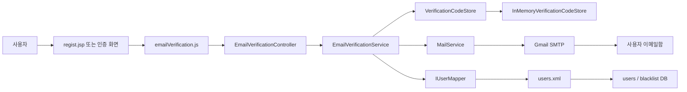
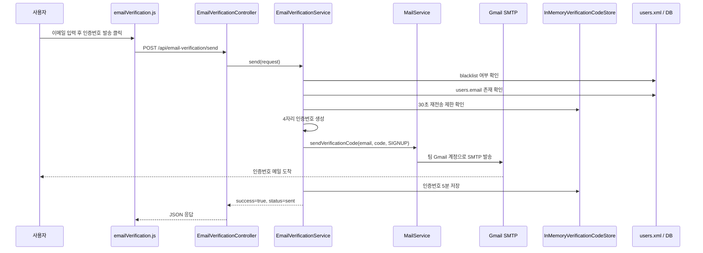
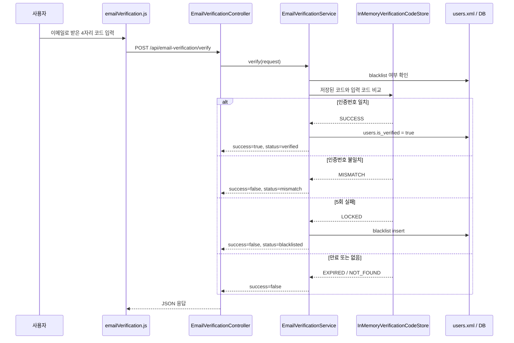

# 이메일 인증 API 강좌(5.6)

## 0. 현재 상태

- 작업 브랜치: `codex/email-verification`
- 기준 레포: `D:\zzaphub`
- 백엔드: Spring Boot 3.2.6, Java 17, Maven, MyBatis
- DB 기준: `users`, `blacklist`
- 컴파일 확인: `mvn -DskipTests compile` 성공
- Redis는 아직 없으므로 1차 구현은 서버 메모리 캐시를 사용한다.

이번 1차 구현에서 실제로 지원하는 목적은 `SIGNUP` 하나다.

```text
SIGNUP          지원함
PASSWORD_RESET  예약만 해둠. v1에서는 not_implemented 반환
EMAIL_CHANGE    예약만 해둠. v1에서는 not_implemented 반환
```

비밀번호 찾기와 이메일 변경은 화면 흐름이 아직 없으므로 API 모양만 미리 고려하고, 실제 동작은 막아두는 편이 안전하다.

## 1. API란?

API는 프론트와 서버 사이의 약속이다.

이번 기능의 약속은 두 개다.

```http
POST /api/email-verification/send
```

```json
{
  "email": "user@example.com",
  "purpose": "SIGNUP"
}
```

```http
POST /api/email-verification/verify
```

```json
{
  "email": "user@example.com",
  "purpose": "SIGNUP",
  "code": "1234"
}
```

프론트 JavaScript는 위 주소로 JSON을 보내고, Spring Boot 서버는 JSON을 받아서 메일 발송과 검증을 처리한다.

## 2. Gmail 설정은 왜 필요한가?

그냥 "사용자 이메일로 인증번호를 보내면 끝"처럼 보이지만, 실제로는 메일을 보내는 주체가 필요하다.

```text
우리 Spring Boot 서버
  -> 팀 Gmail 계정으로 Gmail SMTP에 로그인
  -> 사용자 이메일 주소로 인증번호 메일 발송
```

여기서 팀 Gmail은 **발신자 계정**이다. 사용자의 이메일은 **수신자 주소**일 뿐이다.

```text
MAIL_USERNAME = 발신자 Gmail 주소
MAIL_PASSWORD = 발신자 Gmail의 앱 비밀번호
사용자 email   = 인증번호를 받을 수신자 주소
```

사용자의 Gmail 비밀번호는 필요 없다. 서버가 사용자 계정에 로그인하는 구조가 아니다.

Gmail은 일반 로그인 비밀번호로 SMTP 발송을 허용하지 않는 경우가 많다. 그래서 Gmail 계정에서 "앱 비밀번호"를 발급받아 서버에 넣는다. 이 값은 실제 비밀번호와 같은 민감 정보라서 코드, GitHub, 문서에 직접 적으면 안 된다.

서버에는 환경변수로 넣는다.

```bash
MAIL_USERNAME=팀 Gmail 주소
MAIL_PASSWORD=Gmail 앱 비밀번호
```

그리고 실제 Spring 설정에는 아래 값이 필요하다.

```properties
spring.mail.host=smtp.gmail.com
spring.mail.port=587
spring.mail.username=${MAIL_USERNAME}
spring.mail.password=${MAIL_PASSWORD}
spring.mail.properties.mail.smtp.auth=true
spring.mail.properties.mail.smtp.starttls.enable=true
spring.mail.properties.mail.smtp.starttls.required=true
```

현재 레포에는 `src/main/resources/application-mail.example.properties`가 있다. 이 파일은 예시 파일이라 자동 적용되지 않는다. 실제 서버에서는 위 설정을 진짜 `application.properties`에 넣거나, 배포 환경에서 같은 값을 환경변수/외부 설정으로 주입해야 한다.

주의할 점이 하나 더 있다. 현재 레포의 기존 `application.properties`는 `src/main/java/application.properties`에 있다. 이 위치는 브라보의 Eclipse/Spring Tool 환경에서 에러를 줄이기 위해 필요했던 것으로 보인다. 반대로 서버에 적용할 때는 `src/main/resources/application.properties`에 있어야 Maven 빌드 결과인 `target/classes`에 포함되고, 배포 후 설정 누락으로 인한 404/런타임 문제를 피할 수 있었다.

즉 이 문제는 단순히 "어느 위치가 맞다"가 아니라, 개발환경과 서버 배포환경이 서로 다르게 반응한 이슈다. 그래서 이번 이메일 인증 작업에서는 기존 `application.properties` 위치를 자동으로 옮기지 않았다. 실제 서버 반영 단계에서는 `spring.mail.*` 설정을 서버가 읽는 `application.properties` 또는 외부 환경변수 방식으로 확실히 넣어야 한다.

## 3. 전체 작동 흐름

먼저 큰 그림은 아래와 같다.



`Controller`는 API 문이고, `Service`는 실제 규칙을 처리하는 중심이다. `MailService`는 메일 발송만, `VerificationCodeStore`는 인증번호 저장만, `IUserMapper`와 `users.xml`은 DB 접근만 맡는다.

### 인증번호 발송



```text
1. 사용자가 화면에서 이메일을 입력한다.
2. JavaScript가 POST /api/email-verification/send 를 호출한다.
3. EmailVerificationController가 JSON 요청을 받는다.
4. EmailVerificationService가 이메일 형식, purpose, blacklist, 재전송 제한을 검사한다.
5. 4자리 인증번호를 생성한다.
6. MailService가 Gmail SMTP로 인증번호 메일을 보낸다.
7. InMemoryVerificationCodeStore가 인증번호를 5분 동안 저장한다.
8. 서버가 success=true 응답을 돌려준다.
```

### 인증번호 확인



```text
1. 사용자가 이메일로 받은 4자리 번호를 화면에 입력한다.
2. JavaScript가 POST /api/email-verification/verify 를 호출한다.
3. EmailVerificationService가 저장된 인증번호와 입력값을 비교한다.
4. 번호가 맞으면 저장된 인증번호를 삭제한다.
5. purpose가 SIGNUP이면 users.is_verified = true 로 변경한다.
6. 번호가 틀리면 실패 횟수를 1 올린다.
7. 실패가 5회가 되면 blacklist 테이블에 email을 추가한다.
```

## 4. 파일별 역할

이메일 인증 기능과 직접 관련된 파일은 총 15개다.

```text
D:\zzaphub\pom.xml
D:\zzaphub\src\main\java\com\care\boot\email\EmailVerificationController.java
D:\zzaphub\src\main\java\com\care\boot\email\EmailVerificationPurpose.java
D:\zzaphub\src\main\java\com\care\boot\email\EmailVerificationService.java
D:\zzaphub\src\main\java\com\care\boot\email\InMemoryVerificationCodeStore.java
D:\zzaphub\src\main\java\com\care\boot\email\MailService.java
D:\zzaphub\src\main\java\com\care\boot\email\VerificationCodeStore.java
D:\zzaphub\src\main\java\com\care\boot\email\VerificationStatus.java
D:\zzaphub\src\main\java\com\care\boot\email\dto\EmailVerificationResponse.java
D:\zzaphub\src\main\java\com\care\boot\email\dto\SendEmailVerificationRequest.java
D:\zzaphub\src\main\java\com\care\boot\email\dto\VerifyEmailCodeRequest.java
D:\zzaphub\src\main\java\com\care\boot\users\IUserMapper.java
D:\zzaphub\src\main\resources\application-mail.example.properties
D:\zzaphub\src\main\resources\mappers\users.xml
D:\zzaphub\src\main\webapp\js\emailVerification.js
```

`pom.xml`

- `spring-boot-starter-mail` 의존성을 추가했다.
- 이 의존성이 있어야 `JavaMailSender`, `SimpleMailMessage`를 사용할 수 있다.

`EmailVerificationController.java`

- API 주소를 만든다.
- `/send` 요청은 `service.send()`로 넘긴다.
- `/verify` 요청은 `service.verify()`로 넘긴다.
- 직접 비즈니스 로직을 처리하지 않는다.

`EmailVerificationService.java`

- 핵심 규칙을 담당한다.
- 4자리 인증번호 생성, 5분 만료, 30초 재전송 제한, 5회 실패 제한을 처리한다.
- `SIGNUP` 성공 시 `users.is_verified = true`로 바꾼다.
- v1에서는 `PASSWORD_RESET`, `EMAIL_CHANGE`를 `not_implemented`로 막는다.

`EmailVerificationPurpose.java`

- 인증 목적을 enum으로 제한한다.
- 문자열 `"SIGNUP"`을 Java enum `SIGNUP`으로 바꾼다.
- 이상한 purpose가 들어오면 `invalid_purpose` 응답으로 처리된다.

`VerificationCodeStore.java`

- 인증번호 저장소 인터페이스다.
- 서비스는 저장소가 메모리인지 Redis인지 몰라도 된다.
- Redis가 준비되면 이 인터페이스의 Redis 구현체를 새로 만들면 된다.

`InMemoryVerificationCodeStore.java`

- 지금 사용하는 임시 저장소다.
- 서버 메모리에 인증번호, 발송 시간, 만료 시간, 실패 횟수를 저장한다.
- 서버가 재시작되면 저장된 인증번호는 사라진다.
- WEB 서버가 여러 대면 LB가 다른 WEB으로 요청을 보낼 수 있으므로 최종 구조에서는 Redis가 필요하다.

`MailService.java`

- Gmail SMTP로 실제 메일을 보낸다.
- `spring.mail.username`이 비어 있으면 메일 발송을 하지 않고 오류를 낸다.
- 메일 제목은 `[ZZAPHUB] 이메일 인증번호`다.

`VerificationStatus.java`

- 인증번호 검증 결과를 나타낸다.
- `SUCCESS`, `NOT_FOUND`, `EXPIRED`, `MISMATCH`, `LOCKED`가 있다.

`dto/*.java`

- JSON 요청/응답의 모양을 담당한다.
- `SendEmailVerificationRequest`: 발송 요청 JSON
- `VerifyEmailCodeRequest`: 검증 요청 JSON
- `EmailVerificationResponse`: 공통 응답 JSON

`IUserMapper.java`, `users.xml`

- MyBatis로 DB에 접근한다.
- 이메일 존재 확인, 인증 완료 처리, blacklist 조회/추가를 담당한다.

`application-mail.example.properties`

- Gmail SMTP 설정 예시다.
- 실제 설정 파일이 아니므로 자동 적용되지 않는다.
- 실제 비밀번호를 이 파일에 적어서 커밋하면 안 된다.

`emailVerification.js`

- JSP 화면에서 API를 호출할 때 쓸 수 있는 예시 함수다.
- 아직 실제 회원가입 화면에 연결되지는 않았다.

## 5. 프론트 호출 예시

```js
const sendResult = await sendEmailVerification('user@example.com', 'SIGNUP');
console.log(sendResult);

const verifyResult = await verifyEmailCode('user@example.com', '1234', 'SIGNUP');
console.log(verifyResult);
```

응답 예시는 이런 형태다.

```json
{
  "success": true,
  "status": "sent",
  "message": "인증번호를 이메일로 보냈습니다."
}
```

`PASSWORD_RESET`, `EMAIL_CHANGE`는 현재 이렇게 응답한다.

```json
{
  "success": false,
  "status": "not_implemented",
  "message": "v1에서는 회원가입 이메일 인증만 지원합니다."
}
```

## 6. 검토 결과

컴파일은 성공했다.

```bash
mvn -DskipTests compile
```

확인된 주의점은 세 가지다.

첫째, SMTP 설정이 실제로 들어가야 메일 발송이 된다. `application-mail.example.properties`는 예시일 뿐이다.

둘째, 현재 인증번호 저장소는 메모리다. 개발과 1차 시연에는 가능하지만, WEB 서버가 여러 대면 Redis로 바꿔야 한다.

셋째, 로그인 시 `blacklist`를 읽고 차단하는 기능은 아직 없다. 지금은 이메일 인증 API에서 blacklist를 조회하고, 5회 실패 시 추가하는 것까지만 한다.

## 7. API 테스트

서버가 떠 있고 Gmail 설정이 되어 있다면 발송 테스트는 이렇게 한다.

```bash
curl -X POST http://localhost/api/email-verification/send \
  -H "Content-Type: application/json" \
  -d '{"email":"user@example.com","purpose":"SIGNUP"}'
```

메일로 받은 코드가 `1234`라면 검증 테스트는 이렇게 한다.

```bash
curl -X POST http://localhost/api/email-verification/verify \
  -H "Content-Type: application/json" \
  -d '{"email":"user@example.com","purpose":"SIGNUP","code":"1234"}'
```

프로젝트의 `server.port=80` 기준으로 `localhost`를 사용했다. 로컬에서 다른 포트로 띄우면 URL의 포트를 맞춰야 한다.

## 8. 남은 작업

- 실제 Gmail 앱 비밀번호 발급
- 서버 환경변수 등록
- 실제 Spring 설정에 `spring.mail.*` 값 적용
- 회원가입 완료 후 이메일 인증 화면으로 보내는 흐름 연결
- `emailVerification.js`를 실제 JSP에 연결
- 로그인 시 `blacklist` 확인 및 차단 로직 추가
- Redis 구축 후 `RedisVerificationCodeStore` 추가
