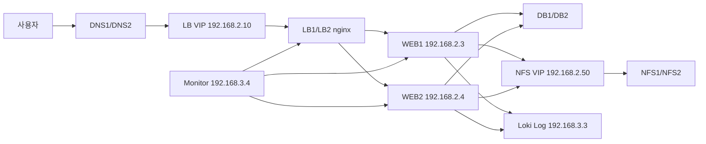

# 이중화

상태: 보고서 초안
작성 기준: 2026-05-06
기준 파일:

- `토폴로지와 IP NAT ACL 기준표_(4.30).html`
- `쉘 스크립트/LB.sh`
- `쉘 스크립트/dns1.sh`
- `쉘 스크립트/dns2.sh`
- `쉘 스크립트/nfs-ha(5.6).sh`
- `쉘 스크립트/web-nfs(5.6).sh`

## 0. 바로 이어서 할 작업

현재 이어서 할 작업은 아래 순서로 정리한다.

| 순서 | 작업 | 목적 |
|---:|---|---|
| 1 | `이중화.md` 작성 | 우리 토폴로지의 이중화 구조를 보고서용으로 정리 |
| 2 | `Secrets Management.md` 작성 | WEB 침해 시 DB 비밀번호가 털리는 이유와 방어 방법 정리 |
| 3 | NFS 스크립트 한글 주석 보강 | `nfs-ha`, `web-nfs` 스크립트를 초보자도 읽을 수 있게 해석 |
| 4 | Pets vs Cattle / 자동복구 문서 | 어떤 서버는 재생성하고, 어떤 서버는 보호해야 하는지 정리 |

## 1. 이 문서를 쓰는 이유

이 프로젝트는 단순히 서버 여러 대를 켜는 실습이 아니다. 사용자가 `zzaphub.com`에 접속했을 때 DNS, 라우터, NAT, ACL, LB, WEB, DB, NFS, Log, Monitor가 함께 동작해야 하나의 서비스가 된다.

이중화 문서를 따로 쓰는 이유는 다음 질문에 답하기 위해서다.

- 어떤 서버가 죽어도 서비스가 계속될 수 있는가?
- 어떤 서버가 죽으면 데이터 손실이 생길 수 있는가?
- 장애가 났을 때 트래픽은 어디로 우회되는가?
- 이중화가 보안에도 도움이 되는가, 아니면 오히려 공격면을 늘리는가?
- 우리 구조는 진짜 자동복구 클라우드 구조인가, 아니면 수동/반자동 복구 구조인가?

핵심 결론부터 말하면, 현재 구조는 완전한 클라우드 자동복구가 아니다. 대신 DNS, LB, WEB, NFS, Log, Monitor를 조합해서 장애를 관측하고 일부 계층을 우회할 수 있는 수동/반자동 이중화 인프라에 가깝다.

## 2. 이중화란 무엇인가

이중화는 장비나 서비스가 하나 고장 나도 전체 서비스가 바로 멈추지 않게 같은 역할을 하는 구성 요소를 둘 이상 준비하는 설계다.

중요한 점은 이중화가 장애를 없애는 기술이 아니라는 것이다. 장애는 여전히 발생한다. 이중화의 목적은 장애가 발생했을 때 영향을 줄이고, 복구 시간을 줄이고, 데이터 손실 가능성을 낮추는 것이다.

자주 쓰는 용어는 다음과 같다.

| 용어 | 뜻 | 우리 프로젝트 예시 |
|---|---|---|
| HA | High Availability, 고가용성 | LB VIP, NFS VIP |
| Failover | 장애 시 다른 노드로 역할을 넘김 | LB1 장애 시 LB2가 VIP 소유 |
| Failback | 장애 복구 후 원래 노드로 역할을 되돌림 | NFS는 `nopreempt` 때문에 자동 회수하지 않는 방향 |
| VIP | Virtual IP, 대표 IP | LB VIP `192.168.2.10`, NFS VIP `192.168.2.50` |
| RTO | 복구까지 걸리는 시간 | WEB 장애 후 새 WEB을 붙이는 시간 |
| RPO | 허용 가능한 데이터 손실 시점 | NFS rsync 주기 사이의 파일 손실 가능성 |
| SPOF | Single Point of Failure, 단일 장애점 | 단일 DB, 단일 NFS, 단일 DNS 같은 구조 |

## 3. 이중화의 종류

### 3.1 Active-Active

Active-Active는 여러 노드가 동시에 서비스를 처리하는 방식이다. 한쪽이 놀고 있는 것이 아니라 둘 다 실제 요청을 받는다.

우리 프로젝트에서는 WEB1/WEB2가 이 방식에 가깝다. LB가 WEB1과 WEB2로 HTTP 요청을 나누어 보내기 때문이다.

장점:

- 자원을 놀리지 않고 둘 다 사용한다.
- 한쪽 WEB이 죽어도 다른 WEB으로 서비스가 이어질 수 있다.
- 트래픽이 늘었을 때 서버를 더 추가하기 쉽다.

단점:

- 여러 WEB 서버가 같은 데이터를 봐야 한다.
- 업로드 파일을 WEB 로컬에 저장하면 서버마다 파일이 달라진다.
- 세션, 파일, 캐시, 설정이 서버별로 달라지면 문제가 생긴다.

그래서 WEB 계층은 가능한 한 Stateless하게 만들어야 한다. 사용자가 올린 파일은 NFS에 저장하고, 회원/게시글 데이터는 DB에 저장해야 WEB1과 WEB2를 교체하기 쉬워진다.

### 3.2 Active-Standby

Active-Standby는 한 노드가 주 역할을 하고, 다른 노드는 대기하다가 장애 시 역할을 넘겨받는 방식이다.

우리 프로젝트에서는 LB1/LB2 keepalived VIP 구조와 NFS1/NFS2 VIP 구조가 이 방식에 가깝다.

장점:

- 구조가 비교적 단순하다.
- 클라이언트는 실제 서버 IP가 아니라 VIP만 바라보면 된다.
- 장애 시 VIP가 다른 노드로 이동하면 접속 대상이 유지된다.

단점:

- 대기 노드는 평소에 자원을 충분히 활용하지 못할 수 있다.
- VIP 이동은 네트워크 관점의 우회일 뿐, 데이터 정합성을 자동으로 보장하지 않는다.
- split-brain이 생기면 두 노드가 동시에 VIP를 가진 것처럼 동작할 수 있다.

### 3.3 Master-Slave

Master-Slave는 주 서버가 원본 데이터를 관리하고, 보조 서버가 그 데이터를 복제해서 따라가는 방식이다.

우리 프로젝트에서는 DNS1/DNS2가 이 구조다.

| 서버 | 역할 | IP |
|---|---|---|
| DNS1 | master | `192.168.1.2` |
| DNS2 | slave | `192.168.1.3` |

`dns1.sh`는 `zzaphub.com` zone을 master로 만들고, `dns2.sh`는 DNS1을 master로 바라보는 slave zone을 만든다. 서비스 도메인은 `zzaphub.com -> 1.2.2.10`으로 LB VIP를 가리킨다.

장점:

- DNS1이 죽어도 DNS2가 조회를 받을 수 있다.
- zone 원본 관리 위치가 명확하다.
- DNS 조회 부하를 나눌 수 있다.

단점:

- master가 죽은 상태에서 zone 변경이 필요하면 관리가 복잡해진다.
- slave가 최신 zone을 가져오지 못하면 오래된 응답을 줄 수 있다.
- DNS 서버가 둘이어도 클라이언트나 DHCP 설정이 DNS1만 바라보면 효과가 줄어든다.

### 3.4 VIP 기반 Failover

VIP 기반 Failover는 사용자가 실제 서버 IP를 직접 바라보지 않고 대표 IP만 바라보게 하는 방식이다.

우리 프로젝트에는 VIP가 두 개 있다.

| VIP | IP | 목적 |
|---|---|---|
| LB VIP | `192.168.2.10` | 사용자 HTTP 대표 진입점 |
| NFS VIP | `192.168.2.50` | WEB upload NFS mount source |

LB VIP는 외부 역할 IP `1.2.2.10`과 연결되어 사용자의 HTTP 진입점이 된다. NFS VIP는 NAT 없이 C Zone 내부에서 WEB1/WEB2가 NFS를 마운트할 때 사용한다.

VIP의 장점은 클라이언트 설정을 단순하게 만든다는 것이다. WEB은 NFS1인지 NFS2인지 몰라도 `192.168.2.50:/share_directory`만 바라보면 된다.

하지만 VIP는 데이터 복제 기술이 아니다. VIP가 이동한다고 해서 파일이나 DB 데이터가 자동으로 완전히 같아지는 것은 아니다. 이 점을 혼동하면 장애 시 데이터 손실이 생길 수 있다.

### 3.5 복제 기반 이중화

복제 기반 이중화는 한 서버의 데이터를 다른 서버로 복사해서 장애에 대비하는 방식이다.

우리 NFS는 `NFS VIP + rsync` 구조다. WEB은 VIP로 현재 주 NFS에 파일을 쓰고, VIP를 가진 NFS 노드가 peer NFS로 파일을 rsync한다.

장점:

- shared storage나 클러스터 파일시스템 없이 구현할 수 있다.
- 수업/프로젝트 수준에서 이해하고 구현하기 쉽다.
- 장애 시 반대편 NFS가 어느 정도 파일을 가지고 있을 수 있다.

단점:

- rsync 주기 사이에 만들어진 파일은 반대편에 없을 수 있다.
- 진짜 무손실/투명 NFS HA가 아니다.
- 자동 delete sync를 잘못 켜면 장애 복구 중 최신 파일을 삭제할 수 있다.
- 기존 NFS client file handle이 완전히 유지된다고 보장하기 어렵다.

따라서 우리 NFS는 "완전한 스토리지 HA"가 아니라 "편의 우선의 rsync 기반 NFS 장애 대응 구조"라고 표현하는 것이 정확하다.

### 3.6 관측성 기반 장애 대응

관측성은 장애를 직접 고치는 기술이 아니라, 장애를 빨리 발견하고 원인을 분석하기 위한 기반이다.

우리 토폴로지에는 Log와 Monitor가 있다.

| 장비 | IP | 역할 |
|---|---|---|
| Log | `192.168.3.3` | Loki 로그 저장/검색 |
| Monitor | `192.168.3.4` | Prometheus/Grafana 대시보드 |

기준표상 WEB1/WEB2는 Log 서버의 Loki `3100/tcp`로 로그를 Push할 수 있고, Monitor는 Prometheus Pull 방식으로 관측 대상의 exporter를 확인하는 구조다.

중요한 점은 Log/Monitor가 자동복구 실행 주체는 아니라는 것이다. Prometheus와 Grafana는 상태를 보고 알리는 도구에 가깝다. 실제로 새 서버를 만들거나 LB 설정을 바꾸려면 Alertmanager, Ansible, Jenkins, 스크립트 같은 실행 주체가 따로 필요하다.

## 4. 우리 토폴로지의 이중화 분류표

| 계층 | 구성 | 이중화 방식 | 현재 수준 | 주의점 |
|---|---|---|---|---|
| DNS | DNS1 `192.168.1.2`, DNS2 `192.168.1.3` | Master-Slave | DNS 조회 이중화 | zone 최신성, 클라이언트 DNS 설정 확인 필요 |
| LB | LB1 `192.168.2.1`, LB2 `192.168.2.2`, VIP `192.168.2.10` | Active-Standby + VIP | LB 장애 대응 | keepalived는 nginx 생존을 확인함 |
| WEB | WEB1 `192.168.2.3`, WEB2 `192.168.2.4` | Active-Active | HTTP 요청 분산 | 현재 자동 재생성까지는 아님 |
| NFS | NFS1 `192.168.2.5`, NFS2 `192.168.2.6`, VIP `192.168.2.50` | VIP + rsync | 파일 서버 장애 대응 | 무손실/투명 HA 아님 |
| DB | DB1 `192.168.3.1`, DB2 `192.168.3.2` | Stateful 계층 | 기준표상 2대 존재 | 실제 DB 복제 방식은 별도 확인 필요 |
| Log | Log `192.168.3.3` | 중앙 로그 | 장애 분석 기반 | Log 서버 자체 이중화는 확인되지 않음 |
| Monitor | Monitor `192.168.3.4` | 중앙 모니터링 | 상태 관측 기반 | 자동복구 실행 주체는 아님 |

## 5. 서비스 흐름

사용자 요청 흐름은 다음과 같다.

```text
사용자
  -> DNS1/DNS2
  -> zzaphub.com
  -> 1.2.2.10
  -> LB VIP 192.168.2.10
  -> LB1/LB2 nginx
  -> WEB1 192.168.2.3:8080 또는 WEB2 192.168.2.4:8080
  -> DB / NFS / Log
```

업로드 파일 흐름은 다음과 같다.

```text
WEB1/WEB2
  -> /opt/tomcat/tomcat-10/webapps/upload
  -> NFS VIP 192.168.2.50:/share_directory
  -> 현재 VIP 소유 NFS
  -> rsync로 peer NFS에 복제
```

로그와 모니터링 흐름은 다음과 같다.

```text
WEB1/WEB2
  -> Loki 192.168.3.3:3100 또는 1.2.3.3:3100
  -> Log 서버에 로그 저장

Monitor 192.168.3.4
  -> Prometheus Pull
  -> WEB/LB/DB/Log 등 exporter 상태 확인
  -> Grafana 대시보드로 시각화
```

전체 흐름을 단순화하면 다음과 같다.



## 6. 계층별 장점과 단점

### 6.1 DNS

DNS1/DNS2를 나누면 사용자가 도메인을 IP로 바꾸는 단계에서 장애 허용성이 생긴다. DNS1이 죽어도 DNS2가 응답할 수 있다.

다만 DNS는 캐시가 있다. DNS를 수정해도 클라이언트나 중간 DNS가 예전 값을 잠깐 들고 있을 수 있다. 그래서 DNS 이중화는 즉시 장애 복구보다는 이름 해석 계층의 단일 장애점을 줄이는 역할에 가깝다.

### 6.2 LB

LB는 사용자 요청을 WEB1/WEB2로 나누어 보낸다. `LB.sh` 기준으로 nginx upstream은 WEB1 `192.168.2.3:8080`, WEB2 `192.168.2.4:8080`을 바라본다.

LB1/LB2는 keepalived로 VIP를 공유한다. 현재 스크립트의 keepalived health check는 WEB 상태가 아니라 nginx 프로세스 상태를 확인한다. 즉 nginx가 죽으면 VIP가 다른 LB로 넘어갈 수 있지만, WEB1/WEB2를 새로 만드는 자동복구까지 해주는 것은 아니다.

### 6.3 WEB

WEB1/WEB2는 Cattle 후보 계층이다. 사용자의 업로드 파일은 NFS로 보내고, 데이터는 DB에 저장하는 구조라면 WEB 서버 자체는 다시 만들 수 있어야 한다.

하지만 현재는 완전한 Auto Scaling 구조가 아니다. 새 WEB3를 자동으로 생성하고, Tomcat을 설치하고, 앱을 배포하고, NFS를 마운트하고, LB upstream에 자동 등록하는 단계까지는 구현되지 않았다.

현실적인 현재 수준은 다음이다.

- WEB1 장애 시 WEB2로 서비스 우회
- Monitor/Grafana에서 WEB 장애 확인
- Log/Loki에서 장애 전후 로그 확인
- 사람이 새 WEB 서버를 만들고 스크립트로 복구

### 6.4 NFS

NFS는 WEB upload 파일을 저장하는 Stateful 계층이다. WEB은 재생성 가능하지만, NFS 안의 파일은 함부로 버리면 안 된다.

우리 NFS의 장점은 WEB이 NFS1/NFS2를 직접 알 필요 없이 NFS VIP만 바라본다는 점이다.

하지만 rsync 기반이므로 다음 한계가 있다.

- 장애 직전 파일이 peer NFS에 아직 복제되지 않았을 수 있다.
- failover 직후 반대편 NFS가 최신 원본이라고 단정하면 안 된다.
- 자동 delete sync를 즉시 켜면 미동기 최신 파일을 삭제할 수 있다.

따라서 NFS는 Cattle이 아니라 Pet에 가깝다. 고장 났다고 바로 버리는 계층이 아니라, 로그와 파일 상태를 확인하고 조심스럽게 복구해야 하는 계층이다.

### 6.5 DB

DB는 가장 강한 Pet 성격의 계층이다. DB에는 회원, 게시글, 결제, 권한 같은 핵심 데이터가 들어간다. WEB 서버처럼 "죽이고 새로 만들면 된다"라고 접근하면 안 된다.

기준표에는 DB1 `192.168.3.1`, DB2 `192.168.3.2`가 있지만, 현재 문서 기준으로 DB 복제 방식까지 확정되어 있다고 보기는 어렵다. 따라서 보고서에서는 DB를 "Stateful 계층이며 실제 무손실 HA를 위해서는 별도 복제/백업/복구 설계가 필요하다"라고 쓰는 것이 안전하다.

### 6.6 Log / Monitor

Log와 Monitor는 장애를 직접 막지는 못하지만, 장애 대응 속도를 높인다.

WEB이 침해되거나 장애가 났을 때 WEB 서버에 직접 들어가 로그를 보는 것은 위험할 수 있다. 그래서 WEB 로그를 Loki로 보내고, Monitor에서 상태를 보는 구조가 중요하다.

다만 Log와 Monitor도 각각 단일 서버라면 그 자체가 SPOF가 될 수 있다. 현재 프로젝트 수준에서는 관측성 계층을 구축했다는 의미가 크고, Log/Monitor 자체의 이중화는 추후 개선점으로 남긴다.

## 7. 보안 관점에서 본 이중화

이중화는 가용성만을 위한 기술처럼 보이지만, 보안과도 직접 연결된다.

### 7.1 사용자 직접 WEB 접근 차단

기준표상 일반 사용자는 LB VIP로 들어오고, WEB1/WEB2 직접 접근은 C-R ACL로 차단하는 방향이다.

이 구조의 보안 효과는 다음과 같다.

- 사용자는 WEB 서버의 실제 위치를 직접 공략하기 어렵다.
- 트래픽 진입점을 LB로 모을 수 있다.
- 장애 시 WEB 서버를 교체해도 사용자는 LB VIP만 바라보면 된다.

### 7.2 WEB에서만 DB/Log 접근 허용

B-R ACL 기준으로 DB/Log 접근은 WEB1/WEB2에서 오는 흐름을 허용한다.

이 구조의 보안 효과는 다음과 같다.

- 외부 사용자가 DB로 직접 접근하기 어렵다.
- DB는 애플리케이션 계층인 WEB 뒤에 숨는다.
- Log 서버는 WEB 로그를 받되, 외부에 무제한으로 노출되지 않는다.

주의할 점도 있다. WEB이 침해되면 공격자는 WEB의 허용된 네트워크 권한을 이용할 수 있다. 즉 "DB 방화벽이 WEB만 허용한다"는 것은 외부 직접 공격에는 강하지만, WEB 침해 이후에는 충분하지 않다. 그래서 DB 계정 분리, 시크릿 관리, 최소 권한, 로그 관측이 함께 필요하다.

### 7.3 외부에서 Monitor 접근 차단

기준표상 외부에서 Monitor로 들어오는 접근은 차단한다. Monitor는 서버 상태, 메트릭, 장애 정보를 볼 수 있는 민감한 관리 시스템이다.

Monitor를 외부에 열면 다음 위험이 생긴다.

- 내부 IP와 서비스 구성이 노출될 수 있다.
- 장애 상태와 취약한 서버가 드러날 수 있다.
- Grafana 계정이 약하면 대시보드가 탈취될 수 있다.

따라서 Monitor는 내부 관리망에서만 접근하는 것이 맞다.

### 7.4 VIP와 ACL의 역할

VIP는 장애 시 접속 대상을 유지하고, ACL은 접근 가능한 흐름을 제한한다.

둘을 같이 봐야 한다.

- VIP만 있고 ACL이 약하면 공격자가 우회 경로를 찾기 쉽다.
- ACL만 있고 VIP가 없으면 장애 시 사용자가 직접 접속 대상을 바꿔야 한다.
- VIP와 ACL을 같이 쓰면 대표 진입점은 유지하면서 불필요한 직접 접근을 줄일 수 있다.

## 8. Pets vs Cattle

Pets vs Cattle은 서버를 바라보는 운영 철학이다.

Pet은 이름 붙이고 조심스럽게 치료해야 하는 서버다. Cattle은 문제가 생기면 새로 만들어 교체할 수 있는 서버다.

우리 토폴로지에 적용하면 다음과 같다.

| 대상 | 분류 | 이유 |
|---|---|---|
| WEB1/WEB2 | Cattle 후보 | 업로드는 NFS, 데이터는 DB로 분리하면 재생성 가능 |
| LB1/LB2 | Cattle 후보 | nginx/keepalived 설정을 스크립트로 재현 가능 |
| DNS1/DNS2 | 중간 | zone 파일 관리가 자동화되면 Cattle에 가까움 |
| NFS1/NFS2 | Pet | 업로드 파일이라는 상태 데이터를 가짐 |
| DB1/DB2 | Pet | 핵심 데이터 저장 계층 |
| Log | Pet 성격 | 장애 분석 로그를 저장함 |
| Monitor | 중간 | 설정은 재생성 가능하지만 장애 관측의 중심 |

중요한 기준은 로컬에 고가치 상태 데이터가 있느냐다.

WEB 서버 로컬에 중요한 파일이 남아 있으면 WEB은 Cattle이 될 수 없다. 반대로 WEB 서버가 앱 실행만 담당하고 파일은 NFS, 데이터는 DB, 로그는 Loki로 보내면 WEB은 훨씬 쉽게 교체할 수 있다.

## 9. Cattle 자동복구

### 9.1 제미나이가 말한 방식

제미나이가 말한 자동복구 흐름은 대략 다음과 같다.

```text
1. LB나 감시 도구가 WEB 서버 상태를 확인한다.
2. WEB 서버가 죽거나 침해 의심 상태가 되면 직접 치료하지 않는다.
3. 문제 서버를 트래픽에서 제외하거나 폐기한다.
4. 미리 만든 골든 이미지나 Docker Image로 새 WEB 서버를 만든다.
5. 새 WEB 서버를 LB에 붙인다.
6. 로그는 죽은 서버에 접속해서 보지 않고 중앙 로그 서버에서 확인한다.
```

이 설명의 방향은 맞다. 하지만 우리 토폴로지 기준으로 더 정확히 나누면 다음과 같다.

- LB는 사용자 트래픽을 WEB으로 분산한다.
- keepalived는 LB 노드의 nginx 상태를 보고 LB VIP를 넘긴다.
- WEB 상태 관측은 Monitor/Prometheus 쪽 역할이다.
- WEB 로그 저장은 Log/Loki 쪽 역할이다.
- 새 WEB을 만드는 실행 주체는 아직 없다.

따라서 "LB가 WEB을 자동복구한다"라고 쓰면 틀리다. 현재 구조에서는 LB, Monitor, Log가 자동복구의 재료일 뿐이다.

### 9.2 실무에서 더 좋은 방식

실무에서는 보통 다음 구성을 쓴다.

| 구성 | 역할 |
|---|---|
| Auto Scaling Group | 장애 서버를 자동으로 제거하고 새 서버 생성 |
| Launch Template / AMI | 새 서버의 표준 이미지 |
| Docker Image | 애플리케이션 실행 환경 표준화 |
| Kubernetes Deployment | 원하는 개수의 Pod를 유지 |
| Terraform | 인프라를 코드로 재현 |
| Ansible | 서버 설정 자동화 |
| Prometheus Alertmanager | 장애 알림과 자동 작업 트리거 |
| ELK/Loki | 중앙 로그 수집 |
| Vault/Secrets Manager | 비밀번호와 토큰 관리 |

이 방식은 강력하지만 현재 수업 프로젝트 수준에서는 한 번에 전부 구현하기 어렵다. 특히 Auto Scaling, Kubernetes, Terraform, Vault를 모두 넣으면 본래 프로젝트보다 자동화 도구 학습이 더 커질 수 있다.

### 9.3 현재 우리 수준에서 가능한 방식

현재 수준에서 가장 현실적인 목표는 완전 자동복구가 아니라 수동복구를 자동복구처럼 빠르게 만들기다.

가능한 단계는 다음과 같다.

1. WEB을 Stateless하게 유지한다.
   - 업로드는 NFS에 저장한다.
   - 데이터는 DB에 저장한다.
   - 로그는 Loki로 보낸다.
   - WEB 로컬에 중요한 파일을 남기지 않는다.

2. WEB 설치 스크립트를 재사용 가능하게 유지한다.
   - 새 WEB 서버에 Tomcat을 설치한다.
   - WAR를 배포한다.
   - NFS mount를 설정한다.
   - DB 연결 설정을 주입한다.

3. 장애 시 수동 우회 절차를 정리한다.
   - Grafana/Prometheus에서 WEB 장애 확인
   - LB가 정상 WEB으로 요청을 보내는지 확인
   - Loki에서 장애 전후 로그 확인
   - 필요하면 문제 WEB을 격리
   - 새 WEB 서버를 만들고 스크립트 실행
   - LB upstream에 새 WEB 추가

4. 나중에 반자동화한다.
   - Alertmanager가 장애를 알림
   - 사람이 확인
   - Ansible 또는 스크립트로 WEB 재구축
   - 검증 후 LB에 반영

보고서에는 이렇게 쓰는 것이 정확하다.

> 현재 프로젝트는 완전한 클라우드 Auto Scaling은 아니지만, WEB 계층을 Stateless하게 만들고 스크립트 기반 재구축이 가능하게 만들어 Cattle 아키텍처의 기초를 구현했다. DB와 NFS는 Stateful 계층이므로 자동 폐기보다 백업, 복제, 장애조치, 복구 절차가 중요하다.

## 10. 결론

우리 프로젝트의 이중화는 한 가지 기술로 완성된 구조가 아니다. DNS 이중화, LB VIP, WEB 수평 분산, NFS VIP, rsync 복제, ACL, Log, Monitor가 합쳐져 장애 대응 구조를 만든다.

정리하면 다음과 같다.

- DNS는 Master-Slave 구조로 이름 해석 계층의 장애를 줄인다.
- LB는 keepalived VIP로 대표 진입점을 유지하고, nginx로 WEB1/WEB2에 요청을 분산한다.
- WEB은 Cattle 후보이며, Stateless하게 만들수록 복구가 쉬워진다.
- NFS는 VIP와 rsync를 쓰지만 진짜 무손실/투명 HA는 아니다.
- DB는 Stateful/Pet 계층이며 별도 복제와 백업 전략이 필요하다.
- Log와 Monitor는 장애를 직접 고치지는 않지만, 장애 확인과 원인 분석의 핵심 기반이다.
- 보안적으로는 사용자의 직접 WEB 접근 차단, WEB에서만 DB/Log 접근 허용, 외부 Monitor 접근 차단이 중요하다.

따라서 현재 구조는 "완전 자동복구 클라우드"가 아니라 "관측 가능한 수동/반자동 이중화 인프라"라고 보는 것이 가장 정확하다.
