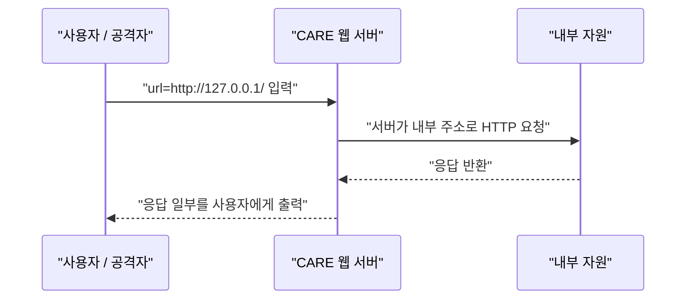
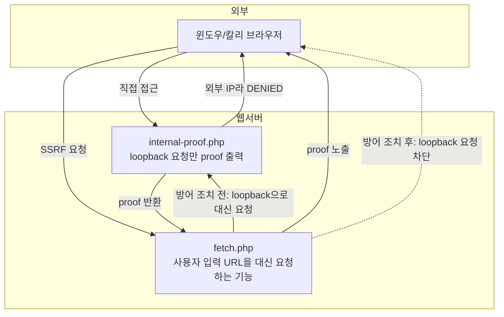

# 웹 취약점 - 08 SSRF

source: [[40_자료/주요정보통신기반시설 기술적 취약점 분석·평가 방법 상세가이드.pdf|주요정보통신기반시설 기술적 취약점 분석·평가 방법 상세가이드]], p.719-725.

## 1. 개요

**SSRF(Server-Side Request Forgery)**는 사용자가 입력한 URL이나 주소값을 서버가 대신 요청하면서, 외부 사용자가 직접 접근할 수 없는 내부 서버 자원에 접근할 수 있게 되는 취약점이다.

PDF p.719의 판단 기준은 다음처럼 정리할 수 있다.

| 판단 | 기준 |
|---|---|
| 양호 | 외부 입력값이 화이트리스트 방식으로 검증되어 허용된 URL 또는 IP 범위 내에서만 처리됨 |
| 취약 | 외부 입력값 검증 없이 처리되어 허용되지 않은 내부 자원에 임의 접근 또는 요청이 가능함 |

SSRF의 핵심은 **요청 주체가 사용자 브라우저가 아니라 웹 서버**라는 점이다.

```text
외부 사용자
-> CARE 웹 서버에 URL 입력
-> CARE 웹 서버가 해당 URL로 직접 요청
-> 내부망, localhost, 클라우드 메타데이터 같은 자원에 접근 가능
```

따라서 SSRF는 VM 환경보다 AWS 같은 클라우드 환경에서 더 위험해질 수 있다. EC2 인스턴스가 내부 메타데이터 서비스나 내부 API에 접근할 수 있는 위치에 있기 때문이다.

## 2. CARE 적용 가능성 분석

CARE 기본 기능을 확인한 결과, 사용자가 입력한 URL을 서버가 직접 요청하는 기능은 확인되지 않았다.

즉, 현재 CARE 기본 기능에는 자연 발생한 SSRF 지점이 확인되지 않는다.

확인한 주요 후보는 다음과 같다.

| 파일 | 확인 내용 | SSRF 판단 |
|---|---|---|
| `center/download.php` | `filename` 파라미터로 `../data/` 아래 파일을 `fopen()`으로 읽음 | 외부 URL 요청이 아니라 로컬 파일 다운로드 구조 |
| `center/writeModel.php` | 업로드 파일을 `../data/`에 저장 | 서버가 사용자 입력 URL로 요청하지 않음 |
| `center/view.php` | 게시글 조회와 첨부파일 링크 출력 | 서버 측 URL 요청 없음 |
| `center/list.php` | 게시글 검색어를 SQL에 결합 | SQL Injection 지점이지 SSRF 지점은 아님 |

`center/download.php`의 핵심 구조는 다음과 같다.

```php
$filename = $_GET['filename'];
header("content-disposition: attachment; filename = " . $filename);

$filename = "../data/" . $filename;
$handle = fopen($filename, "r");
fpassthru($handle);
fclose($handle);
```

이 코드는 `filename`을 기준으로 서버 로컬 파일을 읽는 구조다. 따라서 파일 다운로드 또는 경로 조작 취약점 후보가 될 수는 있지만, 사용자가 입력한 URL을 서버가 대신 요청하는 SSRF 구조는 아니다.

정리하면 이번 항목은 다음 전제로 진행한다.

```text
CARE 기본 기능에서 자연 발생한 SSRF 취약점은 확인되지 않았다.
따라서 PDF의 SSRF 점검 취지를 재현하기 위해 별도 실습용 endpoint를 구성하여 확인한다.
```

## 3. 실습용 취약 기능 구성

SSRF 재현을 위해 별도 실습 페이지를 만든다.

추천 경로는 다음과 같다.

```text
/vuln/ssrf/fetch.php
```

취약한 예시는 다음처럼 구성할 수 있다.

```php
<?php
$url = $_GET['url'] ?? '';

if ($url === '') {
    echo 'url 파라미터를 입력하세요.';
    exit;
}

$ch = curl_init($url);
curl_setopt_array($ch, [
    CURLOPT_RETURNTRANSFER => true,
    CURLOPT_FOLLOWLOCATION => true,
    CURLOPT_TIMEOUT => 5,
]);

$response = curl_exec($ch);
$error = curl_error($ch);
$info = curl_getinfo($ch);
curl_close($ch);

header('Content-Type: text/plain; charset=utf-8');

echo "[URL]\n" . $url . "\n\n";
echo "[HTTP_CODE]\n" . ($info['http_code'] ?? '') . "\n\n";

echo "[ERROR]\n" . $error . "\n\n";

echo "[RESPONSE]\n";
echo substr((string)$response, 0, 2000);
```

이 코드는 사용자 입력 `url`을 검증하지 않고 `curl_init($url)`에 그대로 전달한다.

조치 전 `D:\care\vuln\ssrf\fetch.php`도 이 구조와 동일한 취약 실습용 endpoint였다. 즉, 사용자가 입력한 URL을 검증하지 않고 `curl_init()`에 넘기는 방식으로 SSRF를 재현했다.

현재 로컬 `D:\care\vuln\ssrf\fetch.php`에는 PDF 조치 번호를 주석으로 단 방어 패치가 적용되어 있다. 따라서 조치 전 취약 상태는 위 코드와 기존 스크린샷을 기준으로 설명하고, 실제 웹 서버에서는 배포 후 조치 후 차단 여부를 다시 캡처해야 한다.

따라서 다음과 같은 요청을 통해 서버가 외부 또는 내부 주소로 직접 요청을 보내는지 확인할 수 있다.

```text
http://172.168.10.10/vuln/ssrf/fetch.php?url=http://127.0.0.1/
http://172.168.10.10/vuln/ssrf/fetch.php?url=http://localhost/
http://172.168.10.10/vuln/ssrf/fetch.php?url=http://172.168.10.10/
```

> [!warning] 실습 범위
> SSRF 점검은 내부망 스캔이나 클라우드 자격 증명 탈취로 확장하지 않는다. 이번 실습에서는 서버가 입력 URL로 요청을 보내는지 확인하는 Step 1과, `internal-proof.php`를 이용한 통제된 Step 2까지만 수행한다.

## 4. 악용 흐름

SSRF의 흐름은 다음과 같다.



이 구조에서 사용자는 내부 주소에 직접 접근하지 않는다. 대신 CARE 웹 서버가 내부 주소로 요청을 보내고, 그 결과를 사용자에게 돌려준다.

따라서 다음과 같은 문제가 생길 수 있다.

| 접근 대상 | 위험 |
|---|---|
| `127.0.0.1`, `localhost` | 외부에서 접근 불가능한 로컬 관리 페이지 노출 |
| 사설 IP 대역 | 내부 서버, DB 관리 도구, 관리자 API 탐색 |
| 내부 DNS 이름 | 내부 서비스 구조 파악 |
| 클라우드 메타데이터 | 인스턴스 정보, 네트워크 정보, IAM Role 정보 노출 가능성 |

## 5. 점검 방법

PDF p.719-720의 점검 흐름은 크게 두 단계로 볼 수 있다.

| 단계 | 내용 | 확인 포인트 |
|---|---|---|
| Step 1 | 서버 간 통신이 이루어지는 입력 지점에 허용되지 않은 주소값 입력 | 응답 내용, HTTP status, 지연 시간 변화 확인 |
| Step 2 | 습득한 정보를 바탕으로 우회 기법, port scan, 내부 정보 접근, exploit 가능성 및 영향 평가 | 내부 자원 접근 가능성, 정보 노출 여부, 피해 범위 확인 |

CARE 기본 기능에는 SSRF 지점이 확인되지 않았으므로, 이번 실습에서는 `/vuln/ssrf/fetch.php`를 기준으로 확인한다.

> [!important] 현재 완료 범위
> 기존 `127.0.0.1` / `localhost` 요청 스크린샷은 Step 1을 강화하는 loopback 단서다. 이후 `internal-proof.php`를 추가해 외부 직접 접근은 차단되고 SSRF 경유 접근만 proof를 반환하는 것을 확인했으므로, 현재 노트는 통제된 Step 2까지 제한 수행한 상태다.

### Step 1. 서버 측 요청 발생 여부 확인

외부 주소 또는 자기 자신을 요청하게 하여 서버가 URL로 요청을 보내는지 확인한다.

```text
http://172.168.10.10/vuln/ssrf/fetch.php?url=http://172.168.10.10/
```

응답 코드나 CARE 메인 페이지 일부가 반환되면 서버가 입력 URL로 요청을 보낸 것으로 본다.

### Step 1-1. loopback 요청 단서 확인

PDF Step 2는 Step 1에서 얻은 서버 측 요청 가능성을 바탕으로 우회 기법, port scan식 확인, 내부 정보 접근, 영향 평가까지 진행하는 단계다.

현재 수행한 아래 요청은 Step 2 본 수행이 아니라, Step 2로 넘어갈 수 있는 **loopback 요청 단서**로 본다.

```text
http://172.168.10.10/vuln/ssrf/fetch.php?url=http://127.0.0.1/
http://172.168.10.10/vuln/ssrf/fetch.php?url=http://localhost/
```

외부 사용자가 직접 접근할 수 없는 loopback 주소의 응답이 반환되면, 서버가 사용자 입력 URL을 자기 관점에서 요청한다는 점은 확인된다. 하지만 이것만으로 우회 기법, port scan, 내부 정보 접근, 영향 평가를 수행했다고 볼 수는 없다.

현재 상태는 다음처럼 정리한다.

| 구분 | 처리 |
|---|---|
| `127.0.0.1`, `localhost` 접근 확인 | Step 1을 강화하는 loopback 요청 단서 |
| 광범위한 내부망 port scan | 수행하지 않음 |
| 민감 파일, credential, cloud metadata token 수집 | 수행하지 않음 |
| AWS metadata endpoint 영향 평가 | 향후 AWS 재사용 시 별도 확인 |

따라서 이 단계는 처음에는 Step 2 단서로만 보았고, 이후 `internal-proof.php`를 통해 통제된 Step 2로 확장했다.

### Step 2. 통제된 내부 proof page 확인

CARE 기본 기능을 검색한 결과, 서버가 사용자 입력 URL로 직접 요청하는 자연 발생 sink는 확인되지 않았다. 현재 서버 측 URL 요청 지점은 실습용 `/vuln/ssrf/fetch.php`뿐이다.

Step 2를 CARE에서 안전하게 수행하려면, 내부망 전체를 훑는 대신 통제된 증명 대상을 별도로 만든다. 이 실습에서는 `localhost`에서만 응답하는 proof page를 만들고, 직접 접근과 SSRF 접근의 차이를 비교한다.

준비된 proof page는 다음 파일이다.

```text
D:\care\vuln\ssrf\internal-proof.php
```

이 페이지는 요청 출발지가 `127.0.0.1` 또는 `::1`일 때만 proof 문자열을 출력하고, 외부 브라우저에서 직접 접근하면 403으로 차단한다.

```php
if (!in_array($remoteAddr, ['127.0.0.1', '::1'], true)) {
    http_response_code(403);
    echo "[DENIED]\n";
    exit;
}
```

#### 2-1. 직접 접근 차단 확인

브라우저에서 proof page에 직접 접근한다.

```text
http://172.168.10.10/vuln/ssrf/internal-proof.php
```

정상적인 차단 결과는 다음과 같다.

```text
[DENIED]
This proof page is only available from localhost.
remote_addr=외부_클라이언트_IP
```

이 화면은 외부 사용자가 proof page를 직접 볼 수 없다는 증거다.

#### 2-2. SSRF를 통한 localhost 접근 확인

그 다음 취약한 SSRF endpoint에 `127.0.0.1` 주소를 넣는다.

```text
http://172.168.10.10/vuln/ssrf/fetch.php?url=http://127.0.0.1/vuln/ssrf/internal-proof.php
```

취약하면 서버가 자기 자신에게 요청을 보내므로 다음 proof 문자열이 응답에 포함된다.

```text
[HTTP_CODE]
200

[RESPONSE]
[SSRF_INTERNAL_PROOF]
proof=care-ssrf-local-only-proof
remote_addr=127.0.0.1
```

이 결과는 외부 브라우저가 직접 볼 수 없는 내부 전용 page를, CARE 서버가 대신 요청해서 응답이 노출되었다는 의미다. 따라서 단순히 "서버가 URL 요청을 보낸다"는 Step 1보다 한 단계 더 나아가, PDF Step 2의 내부 정보 접근과 영향 평가를 제한적으로 증명한다.

| Step 2 요소 | CARE에서 가능한 안전한 방식 | 상태 |
|---|---|---|
| 내부 정보 접근 | 외부 직접 접근은 막고, `127.0.0.1`에서만 읽히는 proof page를 만든다. SSRF로만 proof 문자열이 반환되면 내부 접근 증거가 된다. | 수행 |
| port scan식 확인 | 넓은 대역 스캔 대신 이미 아는 local port 1-2개만 비교할 수 있다. | 현재 범위에서는 제외 |
| 우회 기법 확인 | redirect, URL encoding, IP 표현 차이를 이용한 우회 가능성은 별도 심화 검증으로 둔다. | 현재 범위에서는 제외 |
| 내부 정보 탈취 영향 평가 | 실제 credential이나 민감 파일이 아니라, 실습용 proof page만 사용한다. | 통제된 방식으로 수행 |
| AWS 영향 평가 | AWS 환경에서만 별도 수행한다. metadata credential 값은 수집하지 않고 접근 차단 여부만 확인한다. | 향후 항목 |

가장 안전하고 보고서용으로도 깔끔한 방식은 **외부 직접 접근이 차단된 proof page를 만들고, SSRF로만 읽히는지 확인하는 것**이다.

```text
외부 브라우저 -> 내부 proof page 직접 접근 실패
외부 브라우저 -> /vuln/ssrf/fetch.php?url=http://127.0.0.1/vuln/ssrf/internal-proof.php
             -> CARE 서버가 대신 요청하여 proof 문자열 반환
```

이 방식은 broad scan이나 credential 수집 없이도 PDF Step 2의 "내부 정보 접근 및 영향 평가"를 제한적으로 보여줄 수 있다.

### Step 3. 조치 후 동일 요청 재확인

조치 후 같은 요청을 다시 실행한다.

```text
http://172.168.10.10/vuln/ssrf/fetch.php?url=http://127.0.0.1/vuln/ssrf/internal-proof.php
```

조치가 적용되었다면 허용되지 않은 URL 또는 내부 IP 요청은 차단되어야 한다.

조치 후에는 같은 요청이 `fetch.php`에서 차단되는 것을 확인했다.

## 6. 조치 방안

SSRF 방어의 핵심은 서버가 요청할 수 있는 대상을 명확히 제한하는 것이다.

단순히 문자열에 `localhost`가 있는지 검사하는 방식은 부족하다. IP 표현 방식, DNS 이름, redirect, 다른 URL scheme을 통해 우회될 수 있기 때문이다.

### 6.0 SSRF 방어 위치


| 경우 | 요청 흐름 | `internal-proof.php` 기준 `REMOTE_ADDR` | 결과 |
|---|---|---|---|
| 외부에서 proof page 직접 접근 | 브라우저 -> `172.168.10.10`의 `internal-proof.php` | 외부 클라이언트 IP | `DENIED` |
| 외부 브라우저에서 `127.0.0.1` 접근 | 브라우저 -> `127.0.0.1`의 `internal-proof.php` | CARE 서버에 도달하지 않음 | 테스트 대상 아님 |
| 웹서버 내부에서 loopback으로 proof page 접근 | 웹서버 `curl` -> `127.0.0.1`의 `internal-proof.php` | `127.0.0.1` | proof 출력 |
| 웹서버 내부에서 `localhost`로 proof page 접근 | 웹서버 `curl` -> `localhost`의 `internal-proof.php` | `127.0.0.1` 또는 `::1` | proof 출력 |
| 웹서버 내부에서 NIC IP로 proof page 접근 | 웹서버 `curl` -> `172.168.10.10`의 `internal-proof.php` | `172.168.10.10` | `DENIED` |
| 조치 전 SSRF: loopback proof 접근 | 브라우저 -> `fetch.php` -> `127.0.0.1`의 `internal-proof.php` | `127.0.0.1` | proof가 `fetch.php` 응답으로 노출 |
| 조치 전 SSRF: localhost proof 접근 | 브라우저 -> `fetch.php` -> `localhost`의 `internal-proof.php` | `127.0.0.1` 또는 `::1` | proof가 `fetch.php` 응답으로 노출 |
| 조치 전 SSRF: NIC IP proof 접근 | 브라우저 -> `fetch.php` -> `172.168.10.10`의 `internal-proof.php` | `172.168.10.10` | `internal-proof.php`에서 `DENIED` |
| 조치 후 SSRF: loopback 요청 | 브라우저 -> `fetch.php` -> `127.0.0.1`의 `internal-proof.php` 시도 | `internal-proof.php`에 도달하지 않음 | `fetch.php`에서 차단 |
| 조치 후 SSRF: localhost 요청 | 브라우저 -> `fetch.php` -> `localhost`의 `internal-proof.php` 시도 | `internal-proof.php`에 도달하지 않음 | `fetch.php`에서 차단 |
| 조치 후 허용 대상 요청 | 브라우저 -> `fetch.php` -> `172.168.10.10/` | 해당 없음 | CARE 메인 응답 허용 |
| 조치 후 허용 host의 proof page 요청 | 브라우저 -> `fetch.php` -> `172.168.10.10`의 `internal-proof.php` | `172.168.10.10` | `fetch.php`는 요청하지만 `internal-proof.php`가 `DENIED` |
| 조치 후 외부 host 요청 | 브라우저 -> `fetch.php` -> 임의 외부 host | 도달하지 않음 | `fetch.php`에서 차단 |
| 조치 후 비 HTTP scheme 요청 | 브라우저 -> `fetch.php` -> `file://`, `gopher://` 등 | 도달하지 않음 | `fetch.php`에서 차단 |

정리하면 `internal-proof.php`는 **자기에게 들어온 요청의 출발지**를 보고, `fetch.php`는 **사용자가 시킨 목적지 URL을 대신 요청해도 되는지**를 본다. 그래서 같은 웹서버라도 `127.0.0.1`로 접근하면 proof가 보이고, `172.168.10.10`으로 접근하면 loopback이 아니므로 `DENIED`가 뜬다.

SSRF 방어의 1차 위치는 공격자가 접근하려는 **내부 목적지 서버**가 아니라, 사용자 입력을 받아 서버 측 요청을 보내는 **요청 기능**이다.

```text
공격자
-> 피해 웹 애플리케이션의 URL 입력 기능
-> 피해 웹 서버가 내부 주소로 대신 요청
-> 내부 응답이 공격자에게 노출
```

따라서 실무에서도 URL preview, 외부 이미지 가져오기, webhook 테스트, RSS 등록, 외부 API 연동 테스트처럼 서버가 사용자 입력 URL로 요청을 보내는 기능에서 먼저 검증해야 한다. 이 실습에서는 그 역할을 `/vuln/ssrf/fetch.php`가 단순화해서 맡는다.

| 방어 위치      | 역할                                                  | 이 노트의 대응                              |
| ---------- | --------------------------------------------------- | ------------------------------------- |
| 서버 측 요청 기능 | 입력 URL 검증, 허용 대상 제한, 내부 IP 차단, scheme 제한            | `fetch.php` 방어 패치                     |
| 네트워크 계층    | 웹 서버가 내부망, metadata, 관리 포트로 나가지 못하게 제한              | PDF 조치 5, AWS 재사용 시 SG/NACL/egress 확인 |
| 내부 목적지     | metadata service, 내부 관리 API 등이 무인증 신뢰 구조에 의존하지 않게 함 | AWS에서는 IMDSv2, IAM Role 최소권한 확인       |

> [!important] 정리
> SSRF 방어는 "내부 목적지를 고치는 것"만으로 끝나지 않는다. 1차 방어는 서버가 대신 요청을 보내는 기능에서 수행하고, 네트워크 분리와 내부 목적지 보호를 함께 적용한다.

참고 기준:

- PDF p.719-721: 입력값 검증, 화이트리스트, 내부 대역 차단, 네트워크 분리
- [OWASP SSRF Prevention Cheat Sheet](https://cheatsheetseries.owasp.org/cheatsheets/Server_Side_Request_Forgery_Prevention_Cheat_Sheet.html): application layer와 network layer 방어를 함께 제시
- [PortSwigger SSRF 설명](https://portswigger.net/web-security/ssrf): 서버 측 애플리케이션이 의도하지 않은 위치로 요청을 보내게 되는 취약점으로 설명
- [AWS IMDSv2 설명](https://docs.aws.amazon.com/AWSEC2/latest/UserGuide/instance-metadata-v2-how-it-works.html): metadata 접근에는 별도 목적지 측 방어도 필요함

> [!summary] 현재 상태
> 로컬 `D:\care\vuln\ssrf\fetch.php`에는 PDF 조치 번호를 주석으로 단 방어 패치가 적용되어 있고, 웹 화면에서도 loopback SSRF 요청이 `허용되지 않은 요청 대상입니다.`로 차단되는 것을 확인했다.

### 6.1 PDF 조치 1. 허용 URL/IP 화이트리스트 적용

PDF 조치 1은 외부 요청에 대해 허용된 URL이나 IP 주소를 화이트리스트로 정의하여, 허용된 대상에만 접근하게 하는 것이다.

CARE 실습에서는 서버가 요청해도 되는 host와 port를 명시한다. 예를 들어 현재 웹 서버 자기 자신만 허용하려면 다음처럼 둔다.

```php
$allowedTargets = [
    '172.168.10.10' => [80],
];

$host = strtolower($parts['host']);
$port = isset($parts['port']) ? (int)$parts['port'] : ($scheme === 'https' ? 443 : 80);

// PDF 조치 1: 허용 URL/IP 화이트리스트 적용
if (!isset($allowedTargets[$host]) || !in_array($port, $allowedTargets[$host], true)) {
    exit('허용되지 않은 요청 대상입니다.');
}
```

이 방식은 업무상 필요한 대상만 요청하게 제한한다. 따라서 `127.0.0.1`, `localhost`, 임의 외부 host는 화이트리스트에 없으면 요청되지 않는다.

### 6.2 PDF 조치 2. 내부 네트워크 대역과 관리 포트 차단

PDF 조치 2는 내부 네트워크 대역과 관리용 포트 요청을 감지하고 차단하는 것이다.

화이트리스트를 쓰더라도 DNS가 내부 IP를 가리키는 경우가 있으므로, host를 IP로 해석한 뒤 사설 IP, loopback, link-local 대역을 차단한다.

```php
function isPrivateOrLocalIp(string $ip): bool
{
    return !filter_var(
        $ip,
        FILTER_VALIDATE_IP,
        FILTER_FLAG_NO_PRIV_RANGE | FILTER_FLAG_NO_RES_RANGE
    );
}

function resolvesToBlockedIp(string $host): bool
{
    $records = dns_get_record($host, DNS_A + DNS_AAAA);

    foreach ($records as $record) {
        $ip = $record['ip'] ?? $record['ipv6'] ?? null;

        if ($ip !== null && isPrivateOrLocalIp($ip)) {
            return true;
        }
    }

    return false;
}

// PDF 조치 2: 내부 네트워크 대역 및 관리용 주소 차단
if ($host === 'localhost' || resolvesToBlockedIp($host)) {
    exit('내부 주소 요청은 차단됩니다.');
}
```

차단해야 하는 대표 대역은 다음과 같다.

| 대역 | 의미 |
|---|---|
| `127.0.0.0/8` | loopback |
| `10.0.0.0/8` | 사설망 |
| `172.16.0.0/12` | 사설망 |
| `192.168.0.0/16` | 사설망 |
| `169.254.0.0/16` | link-local, 클라우드 metadata 포함 가능 |
| `::1/128` | IPv6 loopback |
| `fc00::/7` | IPv6 private |

### 6.3 PDF 조치 3. 에러 정보와 내부 응답값 직접 노출 제한

PDF 조치 3은 URL 접근 실패 시 사용자에게 내부 에러 정보나 응답값을 그대로 노출하지 않는 것이다.

SSRF 테스트 기능처럼 내부 응답을 그대로 사용자에게 출력하면 내부 정보가 노출될 수 있다. 운영 기능에서는 다음 원칙을 적용한다.

- 내부 응답 body를 사용자에게 그대로 출력하지 않는다.
- 오류 상세, 내부 host명, port, stack trace를 노출하지 않는다.
- 필요한 경우 status code나 성공/실패 여부만 제한적으로 보여준다.
- 요청 timeout과 최대 응답 크기를 제한한다.

```php
// PDF 조치 3: 내부 응답 body와 상세 에러를 사용자에게 그대로 노출하지 않음
if ($error !== '') {
    exit('요청 처리 중 오류가 발생했습니다.');
}

echo "요청이 처리되었습니다.";
```

현재 실습에서는 취약점 증명을 위해 `[RESPONSE]`에 내부 응답을 출력하고 있다. 조치 후에는 이 출력 방식을 제거하거나 제한해야 한다.

### 6.4 PDF 조치 4. HTTP/HTTPS 외 URL scheme 차단

HTTP/HTTPS 외의 scheme은 차단한다.

```php
// PDF 조치 4: HTTP/HTTPS 외 URL scheme 차단
if (!in_array($scheme, ['http', 'https'], true)) {
    exit('허용되지 않은 URL scheme입니다.');
}
```

차단 대상 예시는 다음과 같다.

```text
file://
gopher://
data://
dict://
ftp://
smb://
```

PDF p.721-725에서도 HTTP/HTTPS 외의 protocol과 `file://`, `gopher://`, `data://`, `dict://` 같은 URL scheme 차단을 조치 항목으로 제시한다.

### 6.4-1 PDF 조치 4 보강. redirect 제한 및 재검증

처음 입력한 URL은 정상 도메인처럼 보여도, 응답이 내부 IP로 redirect될 수 있다.

따라서 자동 redirect를 끄거나, redirect 목적지를 다시 검증한다.

```php
curl_setopt_array($ch, [
    // PDF 조치 4-1: redirect로 차단 우회가 생기지 않도록 자동 redirect 비활성화
    CURLOPT_FOLLOWLOCATION => false,
    CURLOPT_TIMEOUT => 5,
    // PDF 조치 4: cURL이 접근 가능한 protocol도 HTTP/HTTPS로 제한
    CURLOPT_PROTOCOLS => CURLPROTO_HTTP | CURLPROTO_HTTPS,
    CURLOPT_REDIR_PROTOCOLS => CURLPROTO_HTTP | CURLPROTO_HTTPS,
]);
```

실습에서는 `CURLOPT_FOLLOWLOCATION`을 `false`로 두고, redirect 응답 자체를 확인하는 방식이 안전하다.

### 6.4-2 PDF 조치 4 보강. PHP 원격 URL 설정 확인

PHP에서 `allow_url_fopen`이 활성화되어 있으면 `file_get_contents()` 같은 함수가 원격 URL을 읽을 수 있다.

확인 명령은 다음과 같다.

```bash
php -i | grep -E "allow_url_fopen|allow_url_include"
```

운영 기준에서는 원격 URL include를 막기 위해 다음 설정을 확인한다.

```ini
allow_url_fopen = Off
allow_url_include = Off
```

단, 실제 서비스가 외부 API를 호출해야 한다면 `allow_url_fopen`을 무조건 끄기보다, cURL 기반으로 전환하고 URL 화이트리스트와 내부 IP 차단 로직을 적용하는 편이 낫다.

### 6.5 PDF 조치 5. 네트워크 분리와 불필요 통신 제한

PDF 조치 5는 애플리케이션 서버와 중요 내부 시스템 간 네트워크를 분리하여 불필요한 통신을 제한하는 것이다.

이 항목은 PHP 코드만으로 끝나는 조치가 아니라 네트워크 구성까지 포함한다.

| 환경 | 적용 예 |
|---|---|
| VM / GNS | 라우터 ACL, 방화벽, 서비스 포트 제한 |
| AWS | Security Group, NACL, VPC subnet 분리, egress 제한 |
| 애플리케이션 | 서버가 호출해야 하는 외부 API만 allowlist로 허용 |

현재 CARE VM 실습에서는 코드 수준의 URL 검증으로 Step 2 proof 요청을 차단하고, AWS 재사용 시에는 Security Group과 egress 제한까지 함께 확인한다.

## 7. AWS 재사용 시 주의점

SSRF는 AWS에서 더 중요하다. EC2 내부에서만 접근 가능한 metadata service가 있고, 서버가 대신 요청을 보내면 외부 사용자가 metadata 응답을 간접적으로 볼 수 있기 때문이다.

현재 이 노트의 실증 범위는 VM 환경의 CARE 서버다. AWS metadata endpoint 접근 차단, IMDSv2 적용 여부, IAM Role 최소권한, egress 제한은 향후 AWS 환경에서 같은 실습을 재사용할 때 확인할 항목으로 남긴다.

AWS에서 재점검할 때는 다음을 구분한다.

| 구분 | VM 실습 | AWS 적용 |
|---|---|---|
| 내부 주소 | `127.0.0.1`, `localhost`, `172.168.10.10` | `127.0.0.1`, VPC 내부 IP, 보안그룹으로 외부 차단된 내부 서비스 |
| metadata 주소 | 보통 해당 없음 | `169.254.169.254` 접근 차단 여부 확인 |
| 주요 방어 | URL allowlist, private IP 차단 | IMDSv2 적용, IAM Role 최소권한, egress 제한 추가 |
| 증거 | 내부 URL 응답 또는 차단 화면 | metadata 접근 차단, 내부망 접근 차단, CloudTrail/로그 확인 |

AWS에서 metadata service를 확인할 때는 민감한 credential 값을 화면이나 보고서에 남기지 않는다.

확인은 다음 정도로 제한한다.

```text
metadata endpoint 접근이 차단되는지 확인
instance-id 같은 비밀값이 아닌 항목만 제한적으로 확인
IAM Role credential 경로의 응답값은 수집하거나 기록하지 않음
```

AWS에서 특히 중요한 조치는 다음과 같다.

| 조치 | 의미 |
|---|---|
| IMDSv2 사용 | metadata 접근에 session token 요구 |
| IAM Role 최소권한 | metadata가 노출되더라도 피해 범위 축소 |
| Security Group / NACL | 내부 관리 서비스 접근 제한 |
| egress filtering | 웹 서버가 불필요한 내부/외부 주소로 나가는 요청 제한 |
| 애플리케이션 allowlist | 서버가 호출 가능한 외부 API를 명시적으로 제한 |

정리하면, VM에서는 SSRF의 원리와 내부 주소 접근 가능성을 확인하고, AWS에서는 metadata 및 내부망 접근 차단 여부까지 추가 확인한다.

## 8. 증거

아래 스크린샷을 증거로 넣는다.

- [x] 조치 전: 실습용 endpoint `/vuln/ssrf/fetch.php`에 `url` 파라미터 없이 접근하면 안내 문구가 출력됨

![[Pasted image 20260612185220.png]]

- [x] 조치 전: `url=http://172.168.10.10/` 요청 시 CARE HTML 응답이 반환됨

![[Pasted image 20260612185244.png]]

- [x] 조치 전: `url=http://127.0.0.1/` 요청 시 서버 자기 자신의 HTML 응답이 반환됨

![[Pasted image 20260612185406.png]]

- [x] 조치 전: `url=http://localhost/` 요청 시 서버 자기 자신의 HTML 응답이 반환됨

![[Pasted image 20260612185313.png]]

> [!important] 증거 범위
> 위 스크린샷은 PDF p.719의 Step 1, 즉 서버가 사용자 입력 URL로 요청을 보내는지 확인한 증거다. `127.0.0.1`과 `localhost` 응답은 Step 2로 확장 가능한 loopback 단서지만, 우회 기법, port scan, 내부 정보 탈취, 영향 평가까지 수행한 것은 아니므로 Step 2 완료 증거로 보지 않는다.

- [x] Step 2: `internal-proof.php` 직접 접근 시 403으로 차단되는 화면
![[Pasted image 20260616101727.png]]
- [x] Step 2: SSRF로 `http://127.0.0.1/vuln/ssrf/internal-proof.php`를 요청했을 때 `care-ssrf-local-only-proof`가 출력되는 화면
![[Pasted image 20260616102729.png]]
- 조치 코드
  ```php
$allowedTargets = [
    '172.168.10.10' => [80],
];

// PDF 조치 1: 허용 URL/IP 화이트리스트 적용
if (!isset($allowedTargets[$host]) || !in_array($port, $allowedTargets[$host], true)) {
    exit('허용되지 않은 요청 대상입니다.');
}
// PDF 조치 2: 내부 네트워크 대역 및 관리용 주소 차단
if (resolvesToBlockedIp($host)) {
    exit('내부 주소 요청은 차단됩니다.');
}
// PDF 조치 4: HTTP/HTTPS 외 URL scheme 차단
if (!in_array($scheme, ['http', 'https'], true)) {
    exit('허용되지 않은 URL scheme입니다.');
}
// PDF 조치 3: 운영 환경에서는 내부 응답 body와 상세 에러를 사용자에게 그대로 노출하지 않는다.
// 이 실습 페이지는 조치 전/후 차이를 확인하기 위해 제한된 길이만 출력한다.
echo substr((string)$response, 0, 2000);
  ```
- [x] 조치 후: 동일 요청이 `fetch.php`에서 차단되는 화면
![[Pasted image 20260616110827.png]]

조치 후에는 `fetch.php?url=http://127.0.0.1/vuln/ssrf/internal-proof.php` 요청이 `허용되지 않은 요청 대상입니다.`로 차단되었다. AWS metadata, IMDSv2, IAM Role, egress 제한은 현재 VM 실습 범위가 아니므로 AWS 재사용 시 별도 점검 항목으로 남긴다.

## 9. 판단

CARE 기본 기능을 확인한 결과, 사용자가 입력한 URL을 서버가 직접 요청하는 자연 발생 SSRF 지점은 확인되지 않았다.

따라서 이번 항목은 PDF p.719-725의 SSRF 점검 취지를 재현하기 위해 별도 실습용 endpoint를 구성하여 확인한다.

SSRF 취약 여부의 핵심 판단은 다음과 같다.

```text
사용자 입력 URL을 서버가 검증 없이 요청하고,
그 결과 외부 사용자가 직접 접근할 수 없는 내부 주소나 클라우드 metadata에 접근할 수 있으면 취약이다.
```

VM 환경에서는 `127.0.0.1`, `localhost`, 내부 IP 접근 여부를 중심으로 확인한다. AWS 환경에서는 여기에 더해 metadata endpoint 접근 차단, IMDSv2 적용, IAM Role 최소권한, egress 제한 여부를 함께 확인한다.

현재 수집된 증거로 말할 수 있는 범위는 다음과 같다.

| 판단 항목 | 상태 |
|---|---|
| CARE 기본 기능의 자연 발생 SSRF sink | 확인되지 않음 |
| 별도 실습 endpoint의 서버 측 URL 요청 primitive | 확인됨 |
| `127.0.0.1`, `localhost` 요청 단서 | 확인됨 |
| 통제된 Step 2 proof page | 직접 접근 차단 및 SSRF 경유 proof 노출 확인됨 |
| PDF Step 2 전체 수준의 우회 기법, port scan, 내부 정보 탈취, 영향 평가 | 제한 수행 |
| 방어 코드 적용 | 로컬 `D:\care`에 적용됨 |
| 조치 후 차단 증거 | `127.0.0.1` proof 요청이 `fetch.php`에서 차단됨 |
| AWS metadata / IMDSv2 / IAM Role / egress 재점검 | 현재 VM 범위 밖, AWS 재사용 시 별도 확인 |

따라서 현재 결론은 **CARE 기본 기능에는 자연 발생 SSRF sink가 없었고, 실습용 `fetch.php`로 SSRF를 재현한 뒤 PDF 조치 1, 2, 3, 4를 코드에 반영하여 loopback proof 요청이 차단되는 것까지 확인했다**이다.

본 항목의 핵심은 단순히 URL 입력값을 필터링하는 것이 아니라, **서버가 요청할 수 있는 대상 자체를 화이트리스트와 네트워크 정책으로 제한하는 것**이다.
