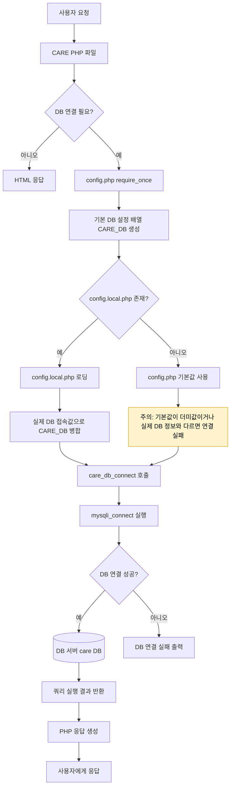

# CARE 웹 취약점 실습 준비 과정 보고서

> [!summary]
> `boot` 대신 PHP/MySQL 기반 `care`를 웹 취약점 실습용 메인 앱으로 채택하고, 앱 코드·문서·WEB 서버·DB 서버·로그 수집 구조를 분리했다. 현재 WEB 서버는 Apache/PHP로 구동되며, GitHub 기반 배포와 Promtail 기반 로그 수집까지 준비되었다.

## 문서 성격

이 문서는 최종 제출본이 아니라, `care`를 `주요정보통신기반시설 기술적 취약점 분석·평가 방법 상세가이드.pdf`의 `10. 웹(Web)` 항목 실습 앱으로 개조하기 전까지의 준비 과정을 정리한 보고서 초안이다.

정리 기준은 다음 문서와 실행 로그다.

| 근거 | 사용한 내용 |
|---|---|
| [[20_팀 프로젝트/26. 6. 8 팀플/일일 로그/RAW/2026-06-10_RAW|2026-06-10 RAW]] | `care` 선택, GitHub 분리, Apache/PHP 배포 방식, DB 설정 분리 과정 |
| [[20_팀 프로젝트/26. 6. 8 팀플/일일 로그/2026-06-09_일일_로그|2026-06-09 일일 로그]] | Promtail/Loki/Grafana 로그 수집 시행착오와 최종 판단 |
| [[20_팀 프로젝트/26. 6. 8 팀플/환경 구성|환경 구성]] | WEB, DB, Log, Monitor 서버 역할과 IP 기준 |
| [[20_팀 프로젝트/26. 6. 8 팀플/취약점 후보표|취약점 후보표]] | 웹 취약점 21개 항목과 우선순위 |
| [[20_팀 프로젝트/26. 6. 8 팀플/쉘 스크립트/care-web-bootstrap.sh|care-web-bootstrap.sh]] | 최초 WEB 서버 구축 자동화 |
| [[20_팀 프로젝트/26. 6. 8 팀플/쉘 스크립트/care-web-deploy.sh|care-web-deploy.sh]] | 반복 배포 자동화 |
| [[20_팀 프로젝트/26. 6. 8 팀플/쉘 스크립트/promtail-client.sh|promtail-client.sh]] | Apache 로그와 시스템 로그 수집 자동화 |

## 1. 준비 목표

프로젝트의 웹 취약점 실습 대상은 기존 Spring/Tomcat 기반 `boot`가 아니라 PHP/MySQL 기반 `care`로 변경했다. 이유는 다음과 같다.

| 기준 | 판단 |
|---|---|
| 취약점 구현 난이도 | PHP 파일 단위로 SQL Injection, XSS, 파일 업로드, 인증·인가 문제를 빠르게 삽입하고 확인하기 쉽다. |
| PDF 항목 대응 | `10. 웹(Web)`의 21개 항목을 앱 기능 단위로 나누어 매핑하기 좋다. |
| 팀 프로젝트 운영 | WEB 서버, DB 서버, LB, Log/Monitor 서버와 연결해 실제 인프라 증거를 남기기 쉽다. |
| 보고서 작성 | 코드 변경, 배포, 로그 수집, 취약점 재현 증거를 분리해 설명할 수 있다. |

따라서 현재 준비의 목표는 단순히 웹 페이지를 띄우는 것이 아니라, 이후 취약점별 시연과 조치 전후 비교가 가능한 실습 기반을 만드는 것이다.

## 2. 개발 저장소와 문서 저장소 분리

처음에는 Obsidian 프로젝트 폴더 안에서 `care` 코드를 다룰 수도 있었지만, 실제 개발과 배포 이력을 관리하기 위해 앱 코드는 별도 GitHub 저장소로 분리했다.

| 구분 | 위치 / 역할 |
|---|---|
| 프로젝트 문서 | `D:\Obsidian\Vault\Obsi2\20_팀 프로젝트\26. 6. 8 팀플` |
| 앱 코드 | `D:\care` |
| 원격 저장소 | `Unoh03/care` |
| 서버 clone 위치 | `/opt/care-src` |
| Apache 서비스 위치 | `/var/www/html/care` |

이 구조에서는 Obsidian vault가 보고서, RAW 로그, 환경표, 후보표를 담당하고, `D:\care`는 실제 PHP 앱 코드와 GitHub 이력을 담당한다. 서버에서는 `/opt/care-src`에 GitHub 저장소를 clone/pull하고, 실제 서비스 경로인 `/var/www/html/care`로 배포한다.

## 3. WEB 서버 배포 구조

`care`는 PHP 앱이므로 Tomcat/WAR 배포 방식은 사용하지 않고, Apache/PHP 방식으로 전환했다.

```text
GitHub: Unoh03/care
        |
        v
WEB 서버 /opt/care-src
        |
        | care-web-bootstrap.sh 또는 care-web-deploy.sh
        v
Apache DocumentRoot: /var/www/html/care
        |
        v
http://WEB_SERVER_IP/
```

배포 스크립트는 두 개로 분리했다.

| 스크립트 | 용도 | 핵심 동작 |
|---|---|---|
| `care-web-bootstrap.sh` | 최초 구축 | Apache/PHP 설치, GitHub clone, Apache site 설정, 배포, 권한 정리, local HTTP check |
| `care-web-deploy.sh` | 업데이트 | GitHub pull, PHP syntax check, rsync 배포, 권한 정리, Apache reload |

두 스크립트 모두 `data/`, `.env`, `config.local.php`, `*.local.php`를 배포 대상에서 제외한다. 특히 `data/`는 업로드 파일이나 실습 증거가 들어갈 수 있으므로 코드 업데이트 때 삭제되지 않도록 보존한다.

권한은 다음 원칙으로 정리했다.

| 대상 | 권한 원칙 |
|---|---|
| PHP 코드 | Apache가 읽을 수는 있지만 웹 프로세스가 임의로 수정하지 못하게 유지 |
| `data/` | 업로드 기능 실습을 위해 Apache/PHP가 쓸 수 있게 허용 |
| DB 접속 설정 | 실제 값은 서버의 로컬 설정 파일에만 보관 |

## 4. DB 설정 분리

`care`는 WEB 서버와 DB 서버가 분리된 구조에서 동작한다. 따라서 PHP 코드 안에 DB 접속값을 직접 박아두면 서버 환경 변경에 취약하고, 공개 저장소에 실제 접속 정보가 포함될 위험이 있다.

이를 해결하기 위해 DB 연결 구조를 다음처럼 분리했다.

| 파일                   | 역할                                                             |
| -------------------- | -------------------------------------------------------------- |
| `config.php`         | `config.local.php`를 로딩하고 `care_db_connect()` 함수를 정의하는 공통 설정 파일 |
| `config.example.php` | GitHub 저장소에 남길 샘플 DB 설정 파일                                     |
| `config.local.php`   | WEB 서버에만 존재하는 실제 DB 접속 설정 파일                                   |
| `dbconn.php`         | DB 연결 확인 및 기존 CARE 테스트용 페이지                                    |



주요 PHP 파일들은 기존에 각 파일 내부에서 직접 `mysqli_connect()`를 호출하던 구조였지만, 현재는 `config.php`를 불러온 뒤 `care_db_connect()`를 호출하는 방식으로 정리했다.

예시:

```php
require_once __DIR__ . '/../config.php';
$link = care_db_connect();
```

루트 경로의 PHP 파일은 다음처럼 불러온다.

```php
require_once __DIR__ . '/config.php';
$link = care_db_connect();
```

하위 폴더의 PHP 파일은 다음처럼 불러온다.

```php
require_once __DIR__ . '/../config.php';
$link = care_db_connect();
```

> [!important]  
> 실제 DB 접속값은 공개 저장소에 남기지 않고, WEB 서버의 `/var/www/html/care/config.local.php`에만 둔다.  
> 작업 중 공개 저장소에 DB 접속값이 포함된 커밋이 발생했을 가능성이 있으므로, 실운영 비밀값이라면 계정·비밀번호 교체 또는 Git 히스토리 정리가 필요하다. 본 실습에서는 폐쇄된 실습망 계정으로 관리한다.

### 증거 캡처

-  `config.php`에서 `care_db_connect()`가 정의된 화면
  해당 화면은 실수로 DB 접속값을 넣은 모습이다.
![[Pasted image 20260610145333.png]]
-  WEB 서버의 `/var/www/html/care/config.local.php` 존재 확인 화면
![[Pasted image 20260610165737.png]]
-  WEB 서버에서 DB 연결 테스트 성공 화면
![[Pasted image 20260610165830.png]]
-  회원가입 성공 화면
![[Pasted image 20260610171956.png]]
-  로그인 성공 화면
![[Pasted image 20260610172035.png]]
## 5. 로그와 모니터링 준비

로그 수집은 `promtail-client.sh`로 정리했다. 기존 Promtail 설정은 Tomcat 로그 경로를 포함했지만, `care`가 Apache/PHP 방식으로 바뀌면서 WEB preset도 Apache 로그 기준으로 수정했다.

| 구성요소 | 역할 |
|---|---|
| WEB `webserv` | Apache access/error log 생성 |
| Promtail | WEB 서버의 `/var/log/syslog`, `/var/log/auth.log`, `/var/log/apache2/*.log` 수집 |
| Loki `logserv` | Promtail이 push한 로그 수신 |
| Grafana/Prometheus `monserv` | 로그 조회와 메트릭 확인 |
| Node Exporter | 서버 메트릭 수집 |

현재 환경 구성 기준으로 Loki 서버는 `logserv`, Monitor 서버는 `monserv`로 분리되어 있다. 이전에는 `1.1.3.11`과 `1.1.3.12` 역할이 섞여 `connection refused`가 발생했으나, 최종 기준은 다음과 같다.

| 서버 | 역할 | 공인 IP |
|---|---|---|
| `logserv` | Loki | `1.1.3.11` |
| `monserv` | Prometheus + Grafana | `1.1.3.12` |

`promtail-client.sh web` 실행 로그에서는 Promtail과 Node Exporter가 모두 `active` 상태로 확인되었다. 다만 최종 보고서 증거로 쓰려면 Grafana 화면에서 Apache 로그가 실제로 조회되는 장면을 한 번 더 캡처하는 편이 좋다.

## 6. 시행착오와 수정

| 문제                      | 원인                                            | 처리                                                        |
| ----------------------- | --------------------------------------------- | --------------------------------------------------------- |
| Tomcat/WAR 방식 검토        | `care`는 PHP 앱이라 Tomcat 단독 배포가 맞지 않음           | Apache/PHP 방식으로 전환                                        |
| 로컬 PHP 실행 경고            | Windows 로컬에서 PHP 실행 파일 경로가 정리되지 않음            | 서버 배포 흐름을 우선하고, 로컬은 보조 개발 환경으로 둠                          |
| `-u: command not found` | root 실행 중 `SUDO=()`가 된 상태에서 `-u`만 명령처럼 실행됨    | deploy user 전환 함수를 수정하고 빈 `/opt/care-src` 처리 로직 추가        |
| 공개 저장소에 DB 값이 들어갈 위험    | DB 접속 설정이 코드와 섞여 있었음                          | `config.local.php` 분리 구조로 변경                              |
| Log/Monitor IP 혼선       | Loki와 Grafana/Prometheus 서버 역할이 섞임            | `환경 구성.md` 기준으로 `logserv=1.1.3.11`, `monserv=1.1.3.12` 정리 |
| Promtail 로그 경로 불일치      | WEB 서버가 Tomcat에서 Apache/PHP로 바뀜               | WEB preset을 `/var/log/apache2/*.log` 기준으로 수정              |
| 파로스 미작동                 | 프록시 포트와 웹 서버 포트를 혼동해 Windows 프록시 포트를 80으로 설정함 | Paros 수신 포트인 8080으로 수정                                    |

## 7. 현재 완료 상태

| 항목                  | 상태  | 근거                                                                                      |
| ------------------- | --- | --------------------------------------------------------------------------------------- |
| `care` 앱 선정         | 완료  | 2026-06-10 RAW에서 `boot` 대신 `care`를 메인 앱으로 결정                                            |
| 앱 저장소 분리            | 완료  | `D:\care`를 별도 GitHub 저장소로 분리                                                            |
| 최초 WEB 구축 스크립트      | 완료  | `care-web-bootstrap.sh` 실행 로그에서 Apache/PHP 설치, clone, syntax check, local HTTP check 성공 |
| 반복 배포 스크립트          | 완료  | `care-web-deploy.sh` 실행 로그에서 fast-forward pull, PHP syntax check, Apache reload 성공      |
| PHP 문법 검사           | 완료  | bootstrap에서 18개, deploy에서 20개 PHP 파일 syntax check 통과                                    |
| Apache 서비스 방식       | 완료  | DocumentRoot `/var/www/html/care`, 접속 기준 `http://WEB_SERVER_IP/`                        |
| DB 설정 분리 1차         | 완료  | `config.php`, `config.example.php`, `config.local.php`, `care_db_connect()` 구조로 정리      |
| Promtail WEB preset | 완료  | Apache 로그 경로 기준으로 수정 후 Promtail active 확인                                               |
| Node Exporter       | 완료  | `promtail-client.sh web` 실행 로그에서 active 확인                                              |
| WEB-DB 연결 확인        | 완료  | WEB 서버의 `/var/www/html/care/config.local.php` 생성 후 DB 연결 성공                             |
| 회원가입 기능 확인          | 완료  | WEB 서버에서 CARE 회원가입 성공 확인                                                                |
| 로그인 기능 확인           | 완료  | WEB 서버에서 CARE 로그인 성공 확인                                                                 |


## 8. 남은 준비 작업

| 우선순위 | 작업                          | 이유                                                         |
| ---- | --------------------------- | ---------------------------------------------------------- |
| P 0   | LB target port 80 정리        | Apache/PHP로 전환했으므로 이전 Tomcat 8080 기준 설정이 남아 있으면 접속 흐름이 어긋남 |
| P0   | Grafana에서 Apache 로그 조회 캡처   | Promtail active만으로는 최종 로그 수집 증거가 부족함                       |
| P0   | PDF 웹 21개 항목별 `care` 개조표 작성 | 어떤 파일과 기능을 어떤 취약점에 대응시킬지 정해야 실제 구현이 가능함                    |
| P1   | `care` 취약점 구현 시작            | SQLi, XSS, CSRF, 파일 업로드/다운로드, 인증·인가 등 항목별 시연 기능 필요         |
| P1   | 취약 상태와 조치 상태 분리 계획          | 보고서에서 “취약점 확인”과 “보안 조치 후 개선”을 비교해야 함                       |
