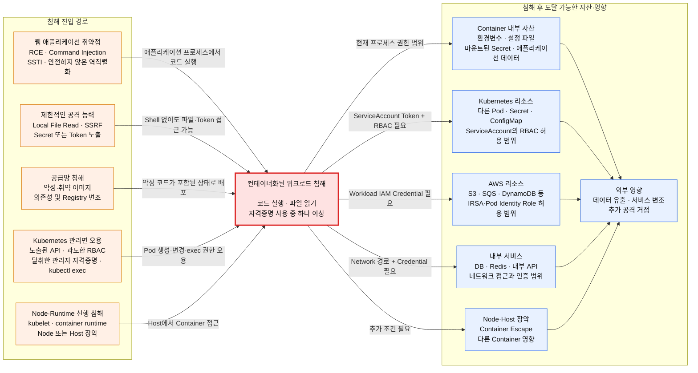
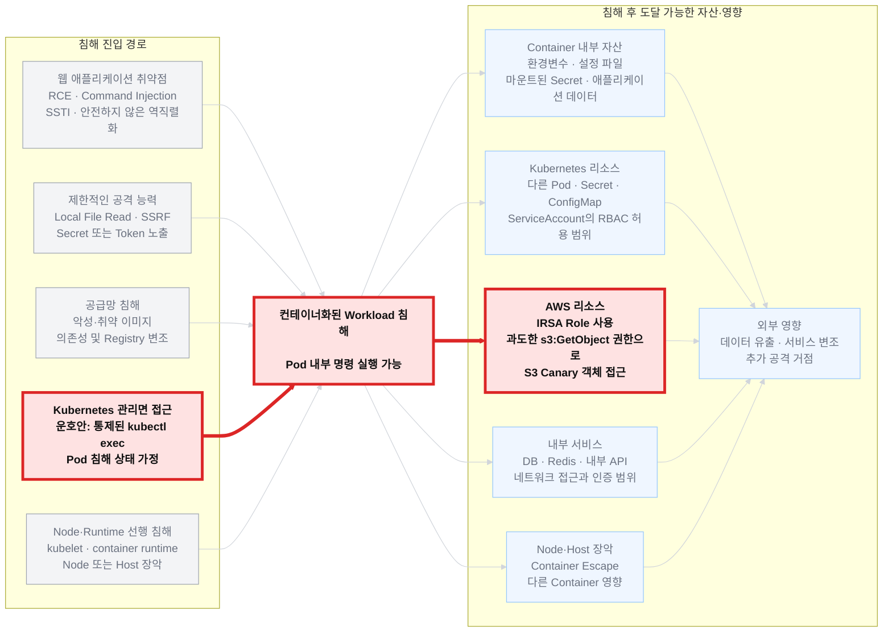
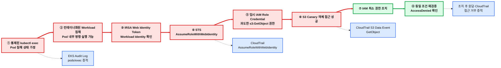

보고서 쓸 때 첫 목차에서 '우리 조는 이런걸 했다!' 라고 확실하게 어필할 것. 안그러면 첫 인상이 비어보임.

# 오늘 한거.

- 계획 선정.
	- 수현님, 타조, 나 3개의 계획 초안이 나옴.
	- 수현님의 계획은 보안보다는 구축, 인프라, 범위 특화. 나와 타조는 보안 → 컨테이너 침해,침투에 집중.
	- 점심 먹고오니 타조의 계획으로 진행 되기로 함. 다만, 아직 이글루 멘토님들과 상담 전이라, 테세우스의 배마냥 갈가리 찢길 가능성이 없는건 아님.
	- 일단 역할 배정은 웹 앱을 하기로 함.
- 컨테이너 침투, 탈출 경로 공부 모음.

이건 전체.


이건 내 기존 계획의 경우.

자세히 보면 이렇게.
- 웹 앱
	- 만들기 귀찮. 있는거 갖다 쓰기로 함.
	- juice shop은 이미 알고 있었음. 다만 코덱스가 말하는게 이거 주스샵은 우리 프로젝트에 부적합할지도 모른단 느낌이 들어, 주스샵과 비슷한 애들 모두 모아서 적합한 애를 골라냄.
	- DVWA 채택. 근데 뭐라 읽는거지. 드브와?
	- 채택 후 검증을 위해 도커 설치
	- WSL이 없음. 설치 후 재시작.
	- https://github.com/digininja/DVWA 클론으로 다운. 그 다음 까먹었다.
```
{{도커 설치, 업로드, 실행 등 너가 알려준 명령어들 여기에 기록해줘.}}
```

```bash
Unoh@Unoh MINGW64 /d/DVWA (master)
$ docker info
Client:
 Version:    29.6.2
 Context:    desktop-linux
 Debug Mode: false
 Plugins:
  agent: Docker AI Agent Runner (Docker Inc.)
    Version:  v1.111.0
    Path:     C:\Users\Unoh\.docker\cli-plugins\docker-agent.exe
  ai: Docker AI Agent - Ask Gordon (Docker Inc.)
    Version:  v1.27.0
    Path:     C:\Users\Unoh\.docker\cli-plugins\docker-ai.exe
  buildx: Docker Buildx (Docker Inc.)
    Version:  v0.35.0-desktop.2
    Path:     C:\Users\Unoh\.docker\cli-plugins\docker-buildx.exe
  compose: Docker Compose (Docker Inc.)
    Version:  v5.3.1
    Path:     C:\Users\Unoh\.docker\cli-plugins\docker-compose.exe
  debug: Get a shell into any image or container (Docker Inc.)
    Version:  0.0.47
    Path:     C:\Users\Unoh\.docker\cli-plugins\docker-debug.exe
  desktop: Docker Desktop commands (Docker Inc.)
    Version:  v0.4.3
    Path:     C:\Users\Unoh\.docker\cli-plugins\docker-desktop.exe
  dhi: CLI for managing Docker Hardened Images (Docker Inc.)
    Version:  v0.0.7
    Path:     C:\Users\Unoh\.docker\cli-plugins\docker-dhi.exe
  extension: Manages Docker extensions (Docker Inc.)
    Version:  v0.2.31
    Path:     C:\Users\Unoh\.docker\cli-plugins\docker-extension.exe
  init: Creates Docker-related starter files for your project (Docker Inc.)
    Version:  v1.4.0
    Path:     C:\Users\Unoh\.docker\cli-plugins\docker-init.exe
  mcp: Docker MCP Plugin (Docker Inc.)
    Version:  v0.43.3
    Path:     C:\Users\Unoh\.docker\cli-plugins\docker-mcp.exe
  model: Docker Model Runner (Docker Inc.)
    Version:  v1.2.6
    Path:     C:\Users\Unoh\.docker\cli-plugins\docker-model.exe
  offload: Docker Offload (Docker Inc.)
    Version:  v0.6.9
    Path:     C:\Users\Unoh\.docker\cli-plugins\docker-offload.exe
  pass: Docker Pass Secrets Manager Plugin (beta) (Docker Inc.)
    Version:  v0.2.0
    Path:     C:\Users\Unoh\.docker\cli-plugins\docker-pass.exe
  sandbox: "docker sandbox" is deprecated, use Docker Sandboxes instead (Docker Inc.)
    Version:  v0.13.0
    Path:     C:\Users\Unoh\.docker\cli-plugins\docker-sandbox.exe
  scout: Docker Scout (Docker Inc.)
    Version:  v1.23.1
    Path:     C:\Users\Unoh\.docker\cli-plugins\docker-scout.exe

Server:
 Containers: 0
  Running: 0
  Paused: 0
  Stopped: 0
 Images: 0
 Server Version: 29.6.2
 Storage Driver: overlayfs
  driver-type: io.containerd.snapshotter.v1
 Logging Driver: json-file
 Cgroup Driver: cgroupfs
 Cgroup Version: 2
 Plugins:
  Volume: local
  Network: bridge host ipvlan macvlan null overlay
  Log: awslogs fluentd gcplogs gelf journald json-file local splunk syslog
 CDI spec directories:
  /etc/cdi
  /var/run/cdi
 Discovered Devices:
  cdi: docker.com/gpu=webgpu
 Swarm: inactive
 Runtimes: io.containerd.runc.v2 nvidia runc
 Default Runtime: runc
 Init Binary: docker-init
 containerd version: e53c7c1516c3b2bff98eb76f1f4117477e6f4e66
 runc version: v1.3.6-0-g491b69ba
 init version: de40ad0
 Security Options:
  seccomp
   Profile: builtin
  cgroupns
 Kernel Version: 6.18.33.2-microsoft-standard-WSL2
 Operating System: Docker Desktop
 OSType: linux
 Architecture: x86_64
 CPUs: 16
 Total Memory: 15.25GiB
 Name: docker-desktop
 ID: 759dcd46-358e-4255-865e-f212e5b3195f
 Docker Root Dir: /var/lib/docker
 Debug Mode: false
 HTTP Proxy: http.docker.internal:3128
 HTTPS Proxy: http.docker.internal:3128
 No Proxy: hubproxy.docker.internal
 Labels:
  com.docker.desktop.address=npipe://\\.\pipe\docker_cli
 Experimental: false
 Insecure Registries:
  hubproxy.docker.internal:5555
  ::1/128
  127.0.0.0/8
 Live Restore Enabled: false
 Firewall Backend: iptables

Unoh@Unoh MINGW64 /d/DVWA (master)
$ docker compose up -d
[+] up 36/36
 ✔ Image docker.io/library/mariadb:10  Pulled                                                  28.3s
 ✔ Image ghcr.io/digininja/dvwa:latest Pulled                                                  74.9s
 ✔ Network dvwa_dvwa                   Created                                                  0.1s
 ✔ Volume dvwa_dvwa                    Created                                                  0.0s
 ✔ Container dvwa-db-1                 Started                                                  1.1s
 ✔ Container dvwa-dvwa-1               Started                                                  0.9s

Unoh@Unoh MINGW64 /d/DVWA (master)
$ docker compose ps
NAME          IMAGE                           COMMAND                   SERVICE   CREATED         STATUS         PORTS
dvwa-db-1     docker.io/library/mariadb:10    "docker-entrypoint.s…"   db        5 minutes ago   Up 5 minutes   3306/tcp
dvwa-dvwa-1   ghcr.io/digininja/dvwa:latest   "docker-php-entrypoi…"   dvwa      5 minutes ago   Up 5 minutes   127.0.0.1:4280->80/tcp


{{명령어들이랑 출력된 것들 해석해주라.}}
```
![[Pasted image 20260728151419.png]]
> admin,password

![[Pasted image 20260728151501.png]]
드브와 최초 접속이라 DB를 만들라는 화면이다. 아래 `Create / Reset Database` 누르면 됨
그럼 로긴 화면으로 돌아옴. 다시 로긴.
![[Pasted image 20260728152007.png]]
생긴게 이 모양이라 비상이다. 발표용으로 쓰기엔 좀 부적합하다.
다만 코덱스 왈, 재조립이 쉬운 구조라 한다. 나중에 디브와를 재조립하여, 보기좋고 시연에 좋은 형태로 재가공 하자. 일단 당장의 목표는 그게 아니니 인지만 하고 넘어간다.

![[Pasted image 20260728152849.png]]
DVWA Security → LOW로 변경 → 서밋.
![[Pasted image 20260728152959.png]]
커맨드 인젝션 → 시험삼아 셀프 핑.
이후 인젝션 해봄.


## 멘토님 상담
- 애초에 드브와를 보호하는 AWS 보안 서비스가 너무 많다. WAF 라던가.
  이때 waf엔 어떤 로그가 남고,트레일ㅇㄴ 뭐가 남고, 가드 듀티엔 뭐가 남고, 이런걸 기대 중이시다. 
- 장애를 한번 내봐라.
- 몇년 전 AWS 의 개인 정보가 크게 털린 적 있다.
  원인ㅇㄴ IAM 설정 문제. 
- 보안을 먼저한건 실수였다. 인프라 등을 기반을 다져놔야 질문이나 티키타카가 된다.
- **공격 해보고, 장애 일으켜봐라.**
- 메가존도 그렇고, 등등 그렇고, 사용 중인 서비스를 알아야한다.

### 16:45

- 멘토 피드백: DVWA를 프로젝트의 최종 웹앱으로 사용하지 말고 새 웹앱을 직접 만들 것.
- 남음: 새 웹앱의 기능, 취약점, 인프라 연결 방식은 아직 미정.

### 16:53

- 질문: AWS 보안 서비스에 공격이 막힌다면 취약한 웹앱을 만들어 침투하는 것이 의미가 있는가?
- 멘토 답변: 막히면 막히는 것이 결과이며, 로그 등 수행 결과를 프로젝트에 포함하면 됨.
