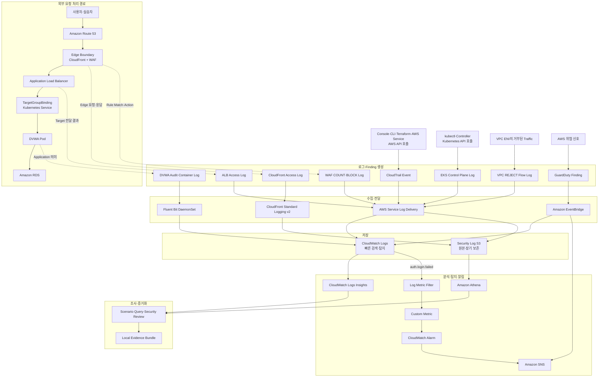

# 로그 인프라 전체 흐름

> [!summary] 이 문서의 역할
> 프로젝트의 로그 생성, 전달, 저장, 분석, 탐지, 알림, 증거화 흐름을 한 장으로 정리한 공통 지도다.  
> 각 서비스의 상세 원리는 개별 학습 노트에서 다룬다.

## 전체 흐름

> [!important] 읽는 기준
> 외부 HTTP 요청을 추적할 때 첫 관측 지점은 `CloudFront + WAF` Edge Boundary다.  
> CloudTrail, EKS Control Plane Log, VPC Flow Log, GuardDuty는 외부 요청 경로와 평행하게 시작되는 별도 관측 흐름이다.

> [!warning] 구성됨과 검증됨
> 이 지도는 현재 저장소에서 확인된 설계와 이전 Runtime Evidence를 함께 반영한다.  
> 특정 경로가 그려져 있다는 사실만으로 현재 Runtime에서 모든 전달·조회·탐지가 정상이라고 단정하지 않는다.

## 계층별 역할

| 계층 | 역할 |
|---|---|
| 생성 | 각 서비스가 자기 관점의 Log Event 또는 Finding 생성 |
| 전달 | Fluent Bit, AWS Log Delivery, EventBridge가 목적지로 전송 |
| 저장 | CloudWatch Logs는 빠른 검색, S3는 원본·장기 보존 |
| 분석 | Logs Insights와 Athena로 시간창·식별자 기반 조사 |
| 탐지 | Metric Filter·Custom Metric·Alarm 또는 GuardDuty Finding |
| 알림 | SNS가 Alarm과 GuardDuty Event를 구독자에게 전달 |
| 증거화 | Query, 결과, 실행 상태, Metadata를 Evidence Bundle에 보존 |

## 관련 노트

- [[08_Elastic Load Balancing ALB]]
- [[09_Amazon EKS]]
- [[18_Amazon S3]]
- [[20_Amazon CloudFront]]
- [[21_AWS WAF]]
- [[24_Amazon CloudWatch]]
- [[25_AWS CloudTrail]]
- [[26_Amazon GuardDuty]]
- [[27_Amazon EventBridge]]
- [[28_Amazon SNS]]
- [[30_VPC Flow Logs]]
- [[32_Fluent Bit]]
