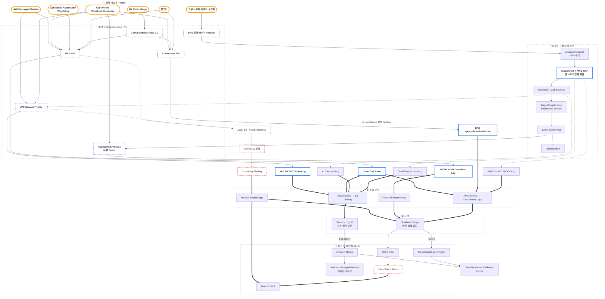

# 로그·관측성 MOC

> [!summary] 이 문서의 역할
> 프로젝트에서 사건이 시작되는 지점부터 행위 Channel, 로그 생성, 전달, 저장, 분석, 탐지, 알림, 시각화까지 한 장에서 찾기 위한 지도다.  
> 이 문서는 관계와 현재 위치만 유지하고, 서비스별 원리·명령·검증 결과는 개별 노트에서 다룬다.

## 지도를 읽는 세 단계

| 단계 | 질문 | 현재 프로젝트의 예 |
|---|---|---|
| 실제 시발점·Trigger | 누가 또는 무엇이 사건을 시작했는가 | 외부 사용자·공격자·실습자, 운영자, Git Push·Merge, Scheduled Automation·Watchdog, Kubernetes Workload·Controller, AWS Managed Service |
| 행위 Channel | 시작된 사건이 시스템 안에서 어떤 형태로 나타나는가 | DNS 조회·HTTP Request, AWS API, Kubernetes API, Application Process·내부 Event, VPC Network Traffic |
| 첫 관측 지점 | 해당 행위를 어디에서 처음 기록하거나 식별하는가 | CloudFront·WAF Edge, CloudTrail Event, EKS Control Plane Log, DVWA Application Log, VPC Flow Logs |

> [!important] API와 Traffic은 시발점이 아니다
> `AWS API 호출`, `Kubernetes API 호출`, `VPC ENI Traffic`은 사건을 시작한 주체가 아니라 **행위가 통과하는 Channel**이다.  
> `GuardDuty Finding`과 `CloudWatch Alarm`은 원본 시발점이 아니라 기존 활동과 기록을 분석해 만든 **파생 보안 신호**다.

> [!note] 표시 범위
> 아래 시발점은 현재 Repository와 운영 절차에서 확인되는 **주요 Trigger 범주**다. AWS에서 이론적으로 가능한 모든 Event Source를 열거한 목록은 아니다. 이후 Lambda Schedule, SQS, 외부 Webhook 같은 구성이 추가되면 별도 Trigger를 추가한다.

## 기능별 분류

| 기능 | 질문 | 현재 프로젝트의 구성요소 |
|---|---|---|
| Trigger | 누가 또는 무엇이 사건을 시작하는가 | 외부 사용자, 운영자, Git 변경, Scheduled Automation, Kubernetes Workload·Controller, AWS Managed Service |
| 행위 Channel | 사건이 어떤 Interface·Traffic으로 나타나는가 | HTTP Request, AWS API, Kubernetes API, Application Event, VPC Network Traffic |
| Log Source | 누가 사건을 자기 관점으로 기록하는가 | CloudFront, WAF, ALB, DVWA, EKS Control Plane, CloudTrail, VPC Flow Logs |
| 수집·전달 | 생성된 기록을 누가 목적지로 옮기는가 | AWS Log Delivery, Fluent Bit, EventBridge |
| 저장 | 원본과 Event를 어디에 보관하는가 | CloudWatch Logs, Security Log S3 |
| 검색·분석 | 저장된 기록을 무엇으로 조회하는가 | CloudWatch Logs Insights, Amazon Athena |
| 탐지 | 어떤 조건을 보안 신호로 판정하는가 | Metric Filter·Alarm, GuardDuty |
| 알림·Routing | 신호를 어디로 전달하는가 | EventBridge, SNS |
| 시각화 | 분석 결과를 무엇으로 보여주는가 | Amazon Managed Grafana — 아직 미구성 |
| 증거화 | 재현 가능한 결과를 무엇으로 남기는가 | Query Pack, Evidence Bundle |

> [!important] 한 서비스가 항상 한 역할만 갖는 것은 아니다
> WAF는 요청을 통제하면서 Log Source이기도 하고, CloudWatch는 Logs 저장·검색뿐 아니라 Metric·Alarm도 제공한다. 위 표는 이 프로젝트에서의 **주요 역할** 기준이다.

## 전체 흐름



### Mermaid 표시 기준

| 표시 | 의미 |
|---|---|
| 주황색 굵은 Stadium | 실제 시발점·Trigger |
| 보라색 점선 테두리 | 행위 Channel·자동화 경로 |
| 파란색 굵은 테두리 | 해당 흐름의 첫 관측 지점 |
| 붉은 점선 테두리 | 분석 후 만들어진 Finding·Alarm 등 파생 신호 |
| 일반 실선 화살표 | 요청·API·Process의 진행 또는 인과관계 |
| 굵은 화살표 | 생성된 Log·Finding의 전달 |
| `Query` Label 화살표 | 저장된 데이터를 이동시키지 않고 조회하는 관계 |

## 시나리오별 관측 흐름

### 1. 외부 웹 요청

```text
외부 사용자·공격자·실습자
→ DNS 조회·HTTP Request
→ Route 53 DNS 해석
→ CloudFront + WAF
→ ALB
→ TargetGroupBinding·Kubernetes Service
→ BANK DVWA Pod
```

| 계층 | 주로 알려주는 것 | 이것만으로 알기 어려운 것 |
|---|---|---|
| CloudFront | Edge Request, Client IP, URI, Status, Edge Request ID | DVWA 로그인 성공 여부 |
| WAF | Matching Rule, COUNT·BLOCK Action | Application 내부 처리 결과 |
| ALB | Target, 처리 시간, HTTP Status, Trace ID | SQL 문장의 의미나 사용자 상태 |
| DVWA | 로그인 성공·실패와 Application 보안 Event | Edge Cache·WAF Rule 전체 상태 |

### 2. AWS API 활동

```text
운영자
또는 GitHub Actions·Scheduled Automation·Kubernetes Controller·AWS Managed Service
→ AWS API
→ CloudTrail Event
→ CloudWatch Logs + Security Log S3
→ Logs Insights·Athena
```

### 3. Kubernetes API 활동

```text
운영자·Argo CD·Kubernetes Controller
→ Kubernetes API
→ EKS api·audit·authenticator Log
→ CloudWatch Logs
→ Logs Insights
```

### 4. Application 내부 Event

```text
외부 Web Request 또는 Pod·Application 내부 처리
→ Application Process·내부 Event
→ DVWA Audit·Container Log
→ Fluent Bit
→ CloudWatch Logs
→ Logs Insights·Metric Filter
```

### 5. Network 거부 Traffic

```text
외부·내부 통신 주체
→ VPC Network Traffic
→ VPC Flow Logs(REJECT)
→ Security Log S3
→ Athena
```

### 6. 보안 Finding과 알림

```text
AWS 활동·Threat Telemetry
→ GuardDuty 분석
→ GuardDuty Finding
→ EventBridge Rule
├─ CloudWatch Logs: 전체 Event 보존
└─ SNS: 운영자용 축약 알림
```

## 현재 Source–Destination Map

| Source | 생성 계기 | 전달 | Destination | 분석·후속 처리 | 현재 확인 수준 |
|---|---|---|---|---|---|
| CloudFront | Edge HTTP 요청 | Standard Logging v2 | Security Log S3 | Athena·Grafana 예정 | Source 확인, 기존 Athena Evidence 있음 |
| AWS WAF | Rule Match의 `COUNT`·`BLOCK` | WAF Logging | CloudWatch Logs `us-east-1` | Logs Insights | Source 확인, 현재 Runtime 재확인 필요 |
| Primary ALB | Origin 요청과 Target 응답 | ALB Access Logging | `S3/alb/primary/` | Athena·Grafana 예정 | Source 확인, 기존 Athena Evidence 있음 |
| BANK DVWA | Container stdout·stderr의 JSON Audit Event | Fluent Bit | DVWA CloudWatch Log Group | Logs Insights·Metric Filter | Source 확인, 현재 Runtime 재확인 필요 |
| EKS Control Plane | Kubernetes API·인증 행위 | EKS 직접 전송 | EKS CloudWatch Log Group | Logs Insights | `api·audit·authenticator` Source 확인 |
| CloudTrail | AWS API 호출 | CloudTrail | S3 + CloudWatch Logs | Athena·Logs Insights | Source 확인, 기존 Query Evidence 있음 |
| VPC Flow Logs | Primary VPC ENI의 `REJECT` Flow | VPC Flow Log Delivery | `S3/vpc-flow/` | Athena·Grafana 예정 | Source 확인, 기존 Athena Evidence 있음 |
| GuardDuty | Foundational Threat Detection | EventBridge | CloudWatch Logs + SNS | Finding 조사·알림 | Source 확인, Sample Finding Evidence 기록 있음 |

> [!warning] 현재 확인 수준 읽는 법
> `Source 확인`은 최신 GitHub `main`의 Terraform·Script에서 구성을 확인했다는 뜻이다.  
> `기존 Evidence`는 이전 실행 기록이 있다는 뜻이며, 2026-08-05 현재 Resource가 동작 중이라는 재검증은 아니다.

## CloudWatch Logs Map

| Source | Region | Log Group |
|---|---|---|
| EKS Control Plane | `ap-northeast-2` | `/aws/eks/aws-topology-primary/cluster` |
| BANK DVWA | `ap-northeast-2` | `/aws/eks/aws-topology-primary/dvwa` |
| AWS WAF | `us-east-1` | `aws-waf-logs-aws-topology-edge` |
| CloudTrail | `ap-northeast-2` | `/aws/cloudtrail/aws-topology-security` |
| GuardDuty Finding | `ap-northeast-2` | `/aws/events/aws-topology-guardduty-findings` |

## S3 Prefix–Athena Table Map

| Source | S3 Location 기준 | Athena Table |
|---|---|---|
| CloudFront | `AWSLogs/<account>/CloudFront/` | `cloudfront_access` |
| Primary ALB | `alb/primary/AWSLogs/<account>/elasticloadbalancing/ap-northeast-2/` | `alb_primary_access` |
| Primary VPC REJECT | `vpc-flow/AWSLogs/<account>/vpcflowlogs/ap-northeast-2/` | `vpc_reject` |
| CloudTrail | `AWSLogs/<account>/CloudTrail/` 계열 | 이번 Grafana 1차 범위 밖 |

Athena Database 기본값은 `aws_topology_security`다. 현재 1차 Grafana 대상은 CloudFront, Primary ALB, Primary VPC REJECT 세 Source로 제한한다.

## 현재 완료·미완료 경계

| 항목 | 상태 |
|---|---|
| Security Log S3와 Source별 Prefix | Terraform Source 존재 |
| CloudWatch Log Groups | Foundation Source 존재 |
| CloudFront·ALB·VPC REJECT의 Athena DDL·Query Pack | 존재 |
| CloudWatch Logs Insights Query Pack | 존재 |
| DVWA Metric Filter → Alarm → SNS | Foundation Source 존재 |
| GuardDuty → EventBridge → CloudWatch Logs·SNS | Foundation Source 존재 |
| Amazon Managed Grafana Workspace·Data Source·Dashboard | 아직 미구성 |
| 최신 Runtime 전체 재검증 | 필요 |

## 학습 순서

1. 웹 요청의 시간 흐름: [[20_Amazon CloudFront]] → [[21_AWS WAF]] → [[08_Elastic Load Balancing ALB]] → [[09_Amazon EKS]]
2. Application Log 전달: [[32_Fluent Bit]] → [[24_Amazon CloudWatch]]
3. 원본·장기 보존: [[18_Amazon S3]]
4. 독립 감사·Network 흐름: [[25_AWS CloudTrail]], [[30_VPC Flow Logs]]
5. 탐지·Routing·알림: [[26_Amazon GuardDuty]] → [[27_Amazon EventBridge]] → [[28_Amazon SNS]]
6. S3 분석·시각화: [[33_Amazon Athena]] → [[34_Amazon Managed Grafana]]

## 저장소에서 찾을 곳

| 목적 | Infra Repository |
|---|---|
| CloudFront·WAF·VPC Flow·Fluent Bit Pod Identity | `observability.tf` |
| ALB와 CloudFront 요청 경로 | `edge.tf` |
| Security Log S3·Log Groups·CloudTrail | `foundation/observability.tf` |
| Metric Filter·Alarm·GuardDuty·EventBridge·SNS | `foundation/detection.tf` |
| EKS Control Plane Log | `eks.tf` |
| Fluent Bit Helm Values | `templates/install-cluster-addons.sh.tpl` |
| Logs Insights·Athena Query | `observability/queries/` |
| Athena 실행 Wrapper | `observability/Invoke-AthenaQueryPack.ps1` |
| 범용 시간창 Review | `Review-SecurityWindow.ps1` |

## 검증 원칙

- Terraform Source 존재와 Runtime 동작을 분리한다.
- Query가 `SUCCEEDED`한 것과 공격을 탐지한 것을 분리한다.
- Event가 0행이면 실패로 지우지 않고 시간창·Source·전달 지연을 함께 기록한다.
- Web Request는 가능하면 UTC 시간창, Source IP, CloudFront Request ID, ALB Trace ID, Application `request_id`를 함께 사용한다.
- Password, Cookie, Session, Authorization, Token은 Evidence에 남기지 않는다.