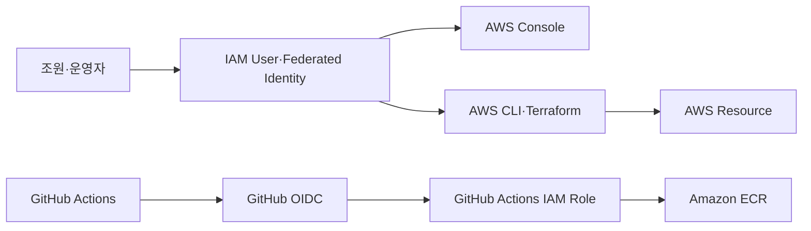
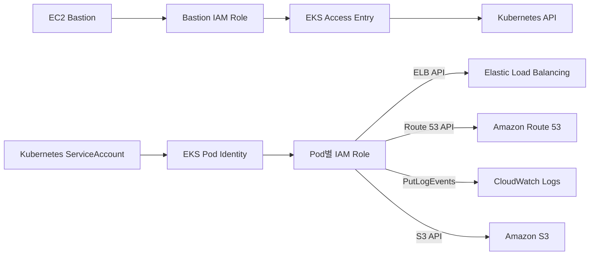
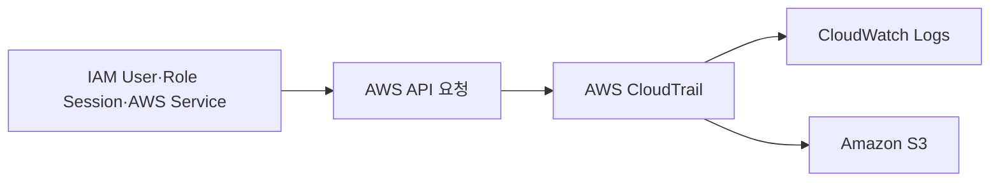

# AWS IAM

## 한 줄 정의

AWS Identity and Access Management(IAM)는 **AWS에서 누가 어떤 자격으로 어떤 Resource에 어떤 Action을 수행할 수 있는지 인증과 권한 정책으로 통제하는 접근 제어 기반 서비스**다.

> [!summary] 이 노트의 범위
> 이 문서는 IAM User, User Group, Role, Policy, Credential, 정책 평가의 기본 원리와 현재 프로젝트에서 확인된 IAM 연결을 다룬다.  
> 조원별 IAM User의 실제 권한 정책은 역할 분담과 필요한 작업이 확정된 뒤 별도로 설계한다.

## 보편적·일반적인 역할

AWS Console, CLI, SDK, Terraform 또는 AWS Service가 API 요청을 보내면 AWS는 대략 다음 순서로 요청을 처리한다.

```text
Principal이 AWS API 요청
→ Credential로 인증
→ 요청 Context 수집
→ 적용되는 Policy 평가
→ Allow 또는 Deny
→ 허용된 경우 Resource 작업 수행
```

IAM의 핵심 질문은 다음과 같다.

```text
누가                  Principal
무엇을 하려는가        Action
어떤 대상에             Resource
어떤 조건에서           Condition
허용 또는 거부되는가     Effect
```

IAM은 AWS Resource를 직접 실행하는 서비스가 아니다. IAM은 EC2, S3, EKS, CloudWatch 등 다른 AWS Service에 대한 요청이 허용되는지를 판정한다.

> [!important] 인증과 인가
> **인증(Authentication)**은 요청자가 누구인지 확인하는 과정이다.  
> **인가(Authorization)**는 인증된 요청자가 해당 Action을 수행할 권한이 있는지 확인하는 과정이다.

## 핵심 구성요소

### Principal

AWS에 요청을 보내는 주체다.

예:

- AWS Account Root User
- IAM User
- IAM Role을 Assume한 Session
- AWS Service Principal
- Federated Identity
- EKS Pod Identity를 통해 Role을 Assume한 Pod

### IAM User

AWS Account 안에 생성되는 장기 Identity다.

IAM User는 필요에 따라 다음 Credential을 가질 수 있다.

- Console Login Password
- Access Key ID + Secret Access Key
- MFA Device
- SSH Public Key 또는 서비스별 Credential

> [!warning] IAM User는 사람 한 명당 하나
> 여러 사람이 하나의 IAM User나 Access Key를 공유하면 CloudTrail에서 행위 주체를 구분하기 어렵고, 한 사람의 퇴장·키 노출 시 전체 공유 Credential을 교체해야 한다.

IAM User는 생성 직후 아무 권한도 없다. User 또는 User가 속한 Group에 Policy가 연결돼야 AWS Resource에 접근할 수 있다.

### IAM User Group

여러 IAM User에게 동일한 Permission을 일괄 부여하기 위한 집합이다.

```text
IAM Policy
→ IAM User Group
→ 여러 IAM User가 동일 Permission 상속
```

특징:

- 한 User는 여러 Group에 속할 수 있다.
- Group 안에 다른 Group을 넣을 수 없다.
- Group 자체는 인증되는 Principal이 아니다.
- Resource-based Policy의 `Principal`에 IAM Group을 지정할 수 없다.

현재처럼 여러 조원에게 유사한 권한을 줄 때는 User마다 Policy를 직접 붙이는 것보다 Group에 Policy를 연결하는 방식이 관리하기 쉽다.

### IAM Role

IAM Role은 고정 Password나 Access Key를 직접 보유하지 않고, 신뢰받는 Principal이 일정 시간 Assume하여 **Temporary Credential**을 발급받는 Identity다.

Role에는 서로 다른 두 종류의 Policy가 관여한다.

#### Trust Policy

```text
누가 이 Role을 Assume할 수 있는가
```

예:

- EC2 Service
- EventBridge Service
- GitHub OIDC Identity
- EKS Pod Identity Service
- 다른 AWS Account의 Principal

#### Permission Policy

```text
Role을 Assume한 Principal이 무엇을 할 수 있는가
```

예:

- 특정 ECR Repository에 Image Push
- 특정 S3 Prefix에 Object Put/Get
- 특정 SNS Topic에 Publish
- 특정 CloudWatch Log Group에 Log 전송

```text
신뢰받는 Principal
→ sts:AssumeRole 또는 연계 Assume 동작
→ Temporary Credential
→ Role Permission 범위에서 AWS API 호출
```

> [!important] User와 Role의 차이
> IAM User는 장기 Identity와 장기 Credential을 가질 수 있다.  
> IAM Role은 다른 Principal이 Assume해 사용하는 임시 Identity이며, 일반적으로 Temporary Credential을 사용한다.

### IAM Policy

Permission 또는 Trust 관계를 JSON 문서로 표현한다.

기본 구조:

```json
{
  "Version": "2012-10-17",
  "Statement": [
    {
      "Sid": "ExampleRead",
      "Effect": "Allow",
      "Action": [
        "ec2:DescribeInstances"
      ],
      "Resource": "*",
      "Condition": {
        "StringEquals": {
          "aws:RequestedRegion": "ap-northeast-2"
        }
      }
    }
  ]
}
```

주요 필드:

- **Version**: Policy 언어 Version
- **Statement**: Permission 규칙 목록
- **Sid**: Statement 식별용 이름
- **Effect**: `Allow` 또는 `Deny`
- **Action**: 허용·거부할 AWS API 작업
- **Resource**: Action이 적용될 Resource ARN
- **Condition**: 요청 Context에 대한 추가 조건
- **Principal**: Resource-based Policy와 Trust Policy에서 대상 Principal 지정

### Policy 유형

#### Identity-based Policy

IAM User, Group, Role에 연결한다.

```text
이 Identity가 어떤 Action을 할 수 있는가
```

- AWS Managed Policy
- Customer Managed Policy
- Inline Policy

#### Resource-based Policy

S3 Bucket, KMS Key, SNS Topic, SQS Queue, CloudWatch Logs 등의 Resource에 연결한다.

```text
어떤 Principal이 이 Resource에 접근할 수 있는가
```

#### Permissions Boundary

User 또는 Role에 부여할 수 있는 **최대 Permission 상한선**이다.

Boundary가 Permission을 직접 부여하지는 않는다. Identity-based Policy에서 허용하면서 Boundary도 허용하는 범위만 최종 Permission이 될 수 있다.

#### Session Policy

Role Session 또는 Federated Session의 Permission을 추가로 제한한다.

#### SCP·RCP

AWS Organizations에서 Account와 Resource의 최대 허용 범위를 제한한다. 현재 프로젝트 Account에 적용된 SCP·RCP 존재 여부는 확인하지 않았다.

### Policy 평가 원리

기본 원칙:

```text
기본값: Deny
명시적 Allow가 있어야 허용
하나라도 Explicit Deny가 있으면 Deny
```

같은 Account에서 Identity-based Policy와 Resource-based Policy가 적용되면 일반적으로 양쪽 Allow를 함께 평가한다. Permissions Boundary, Session Policy, SCP·RCP가 존재하면 해당 상한도 모두 통과해야 한다.

> [!danger] Explicit Deny
> 여러 Policy에서 `Allow`가 있어도 적용 대상 Policy 중 하나에 명시적 `Deny`가 있으면 요청은 거부된다.

### `iam:PassRole`

사용자가 AWS Service에 IAM Role을 넘겨 해당 Service가 Role을 사용하게 만드는 권한이다.

예:

```text
사용자
→ EC2 Instance 생성
→ Instance Profile Role 지정
→ EC2가 Role 사용
```

이때 사용자는 EC2 생성 권한뿐 아니라 지정 Role에 대한 `iam:PassRole`이 필요할 수 있다.

> [!danger] 권한 상승 위험
> 강한 Role을 생성·수정하거나, 강한 Role을 Service에 `PassRole`할 수 있으면 자신의 직접 Policy보다 높은 권한을 간접적으로 획득할 수 있다.  
> 조원 계정 Policy를 설계할 때 `iam:*`, Policy 연결 권한, Role 수정 권한, `iam:PassRole`을 무제한으로 주면 안 된다.

### Credential과 AWS STS

장기 Credential:

- IAM User Password
- IAM User Access Key

임시 Credential:

- Access Key ID
- Secret Access Key
- Session Token
- Expiration

Role, Federation, GitHub OIDC, EKS Pod Identity 등은 AWS STS 기반 Temporary Credential 흐름과 연결된다.

## 입력과 출력

### 입력

- Principal Identity
- Password, Access Key, Session Token, OIDC Token 등의 Credential
- IAM User·Group·Role 정의
- Trust Policy
- Identity-based Policy
- Resource-based Policy
- Permissions Boundary와 Session Policy
- 요청 Action·Resource·Condition Context
- MFA, Source IP, Region, Tag 등의 조건 정보

### 출력

- 인증 성공 또는 실패
- 요청의 `Allow` 또는 `Deny` 판정
- IAM Role Session의 Temporary Credential
- User·Group·Role·Policy 등의 IAM Resource
- CloudTrail에 기록되는 IAM 및 STS API Event
- AWS Service가 다른 Resource에 접근할 수 있는 권한 경계

> [!note] IAM Policy는 실행 결과를 만들지 않는다
> Policy가 `s3:PutObject`를 허용해도 Object가 자동 생성되는 것은 아니다.  
> 실제 API 요청이 발생해야 하며, Resource Policy·KMS Key Policy·SCP·Network 조건 등 다른 통제도 함께 통과해야 한다.

## 우리 프로젝트에서의 역할

현재 저장소와 이전 Runtime Evidence에서 확인된 부분만 기록한다.

### 로컬 운영자와 Terraform

프로젝트의 PowerShell 자동화는 기본 AWS CLI Profile 이름으로 `terra-user`를 사용하도록 작성돼 있다.

```text
로컬 운영자
→ AWS CLI Profile
→ AWS Credential Provider Chain
→ Terraform·AWS CLI
→ AWS API
```

저장소에서 확인되는 것은 **Profile 이름과 호출 방식**이다. 해당 Profile이 현재 IAM User Access Key를 사용하는지, SSO·AssumeRole 등 다른 Credential Source를 사용하는지는 현재 Runtime에서 다시 확인해야 한다.

이전 CloudTrail 검토에서는 `terra-user` Identity의 AWS API 활동이 관찰됐지만, 현재 Credential 상태와 Permission은 아직 재조회하지 않았다.

### GitHub Actions OIDC Role

Persistent Foundation은 다음 구성을 유지하도록 설계돼 있다.

```text
GitHub Actions
→ GitHub OIDC Token
→ AWS IAM Trust Policy 검증
→ GitHub Actions IAM Role Assume
→ Temporary Credential
→ Amazon ECR 작업
```

확인된 목적:

- GitHub의 장기 AWS Access Key를 Secret에 저장하지 않고 Temporary Credential 사용
- 허용된 Repository·OIDC Subject만 Role을 Assume하도록 제한
- Application Image를 ECR에 Push하기 위한 CI 권한 제공

세부 Policy Action·Resource 전체는 아직 이 노트에서 재검토하지 않았다.

### EKS Bastion Role

Primary·DR Bastion EC2에는 IAM Role과 Instance Profile이 연결되도록 구성돼 있다.

확인된 연결:

```text
EC2 Bastion
→ IAM Instance Profile
→ Bastion IAM Role
├─ AmazonSSMManagedInstanceCore
└─ EKS Cluster Describe 권한
```

별도로 Bastion Role은 EKS Access Entry를 통해 Kubernetes Cluster Admin Policy와 연결된다.

```text
Bastion IAM Role
→ EKS Access Entry
→ AmazonEKSClusterAdminPolicy
→ Kubernetes API 관리 권한
```

> [!important] AWS Permission과 Kubernetes Permission은 별개
> Bastion Role의 IAM Policy가 AWS API 접근을 통제한다.  
> EKS Access Entry와 Kubernetes RBAC는 Kubernetes API 내부 권한을 통제한다.

### EKS Pod Identity Role

프로젝트는 Kubernetes Pod가 Node Role 전체를 공유하지 않고, ServiceAccount별 IAM Role을 사용하도록 여러 Pod Identity Association을 정의한다.

현재 확인된 대상:

- **AWS Load Balancer Controller**: ALB·Target Group 관련 AWS API
- **ExternalDNS**: 지정 Route 53 Hosted Zone Record 관리
- **AWS for Fluent Bit**: 지정 CloudWatch Log Group에 Log 전송
- **AWS EFS CSI Driver**: EFS CSI 작업
- **DVWA Web S3 실험 Role**: IAM-01 실험에서 지정 S3 Bucket·Prefix 접근
- **Karpenter**: Controller와 Node Provisioning에 필요한 Role·Node Role

```text
Kubernetes ServiceAccount
→ EKS Pod Identity Association
→ IAM Role
→ Temporary Credential
→ 제한된 AWS API
```

> [!warning] 정의와 Runtime 사용을 구분
> Terraform에 Role과 Association이 정의됐다는 사실과, 현재 Pod가 해당 Role의 Credential을 실제로 정상 발급받아 사용한다는 사실은 다르다.  
> IAM-01 경로 일부는 Runtime Evidence가 있지만 전체 Role의 현재 상태는 다시 확인해야 한다.

### AWS Service용 Role과 Policy

현재 확인된 예:

- **S3 Replication Role**: Primary Bucket의 Object Version을 DR Bucket으로 복제
- **EventBridge GuardDuty Role**: 지정 SNS Topic에 `sns:Publish`
- **EC2 Bastion Role**: SSM 관리와 EKS 조회
- **Karpenter Node Role**: 생성된 EC2 Node가 EKS와 AWS Service를 사용

일부 전달 경로는 IAM Role 대신 Resource-based Policy를 사용한다.

예:

```text
EventBridge
→ CloudWatch Logs Resource Policy
→ 지정 Log Group에 PutLogEvents
```

### 조원별 IAM User 계획

현재 확정된 사실:

- 조원마다 구분 가능한 개별 AWS Identity가 필요하다.
- 실제 User Name, Group, Console Access, CLI Access, Permission 범위는 아직 확정하지 않았다.

권장 생성 순서:

```text
조원별 필요한 작업 정리
→ Permission Matrix 작성
→ 공통 IAM Group·Policy 설계
→ IAM User 개별 생성
→ User를 Group에 추가
→ Console Access 필요 시 초기 Password 발급
→ MFA 등록
→ CLI가 필요한 사람에게만 Access Key 생성
→ 허용 작업과 거부 작업 모두 검증
```

> [!warning] 아직 AdministratorAccess를 붙이지 않음
> 현재는 조원들이 실제로 수행할 작업이 정리되지 않았다.  
> 이 상태에서 각 User에게 `AdministratorAccess` 또는 광범위한 `iam:*`를 부여하면 최소 권한 설계와 행위 분리가 무너진다.

> [!important] 사람용 접근의 공식 권장 방향
> AWS는 사람 사용자의 장기 IAM User Credential보다 IAM Identity Center·외부 Identity Provider를 통한 Federation과 Temporary Credential을 권장한다.  
> 다만 이번 단일 Account 교육 프로젝트에서 IAM User를 사용한다면 개별 User, MFA, Group 기반 Permission, Access Key 최소화 원칙을 적용한다.
### 조원용 IAM Group

- Group name: `3rd_Project`
- 목적: 조원들의 보안 로그 조회·분석 권한을 공통 관리
- 연결된 Policy: 없음
- 소속 User: 없음
- Console에서 생성: 확인
- Runtime 검증: 정책 연결 후 수행 예정
```json
{
	"Version": "2012-10-17",
	"Statement": [
		{
			"Sid": "DiscoverCloudWatchLogsAndReadQueryResults",
			"Effect": "Allow",
			"Action": [
				"logs:DescribeLogGroups",
				"logs:DescribeQueries",
				"logs:GetQueryResults",
				"logs:StopQuery"
			],
			"Resource": "*"
		},
		{
			"Sid": "ReadAndQueryProjectLogGroups",
			"Effect": "Allow",
			"Action": [
				"logs:DescribeLogStreams",
				"logs:GetLogEvents",
				"logs:FilterLogEvents",
				"logs:GetLogGroupFields",
				"logs:GetLogRecord",
				"logs:StartQuery"
			],
			"Resource": [
				"arn:aws:logs:ap-northeast-2:433048100798:log-group:/aws/cloudtrail/aws-topology-security*",
				"arn:aws:logs:ap-northeast-2:433048100798:log-group:/aws/eks/aws-topology-primary/*",
				"arn:aws:logs:ap-northeast-2:433048100798:log-group:/aws/events/aws-topology-guardduty-findings*",
				"arn:aws:logs:ap-northeast-1:433048100798:log-group:/aws/eks/aws-topology-dr/dvwa*",
				"arn:aws:logs:us-east-1:433048100798:log-group:aws-waf-logs-aws-topology-edge*"
			]
		},
		{
			"Sid": "ReadCloudWatchMetricsAndAlarms",
			"Effect": "Allow",
			"Action": [
				"cloudwatch:DescribeAlarms",
				"cloudwatch:DescribeAlarmHistory",
				"cloudwatch:GetMetricData",
				"cloudwatch:GetMetricStatistics",
				"cloudwatch:ListMetrics"
			],
			"Resource": "*"
		},
		{
			"Sid": "ReadCloudTrailEvents",
			"Effect": "Allow",
			"Action": [
				"cloudtrail:DescribeTrails",
				"cloudtrail:GetTrail",
				"cloudtrail:GetTrailStatus",
				"cloudtrail:ListTrails",
				"cloudtrail:LookupEvents"
			],
			"Resource": "*"
		},
		{
			"Sid": "DiscoverGuardDutyDetector",
			"Effect": "Allow",
			"Action": [
				"guardduty:ListDetectors"
			],
			"Resource": "*"
		},
		{
			"Sid": "ReadProjectGuardDutyFindings",
			"Effect": "Allow",
			"Action": [
				"guardduty:GetDetector",
				"guardduty:ListFindings",
				"guardduty:GetFindings",
				"guardduty:GetFindingsStatistics"
			],
			"Resource": "arn:aws:guardduty:ap-northeast-2:433048100798:detector/41a4b1e231654e8bba289594e7cb1c2a"
		},
		{
			"Sid": "ReadEdgeAndInfrastructureMetadata",
			"Effect": "Allow",
			"Action": [
				"wafv2:ListWebACLs",
				"wafv2:GetWebACL",
				"wafv2:GetLoggingConfiguration",
				"wafv2:ListLoggingConfigurations",
				"wafv2:GetSampledRequests",
				"cloudfront:ListDistributions",
				"cloudfront:GetDistribution",
				"cloudfront:GetDistributionConfig",
				"cloudfront:ListTagsForResource",
				"elasticloadbalancing:DescribeLoadBalancers",
				"elasticloadbalancing:DescribeTargetGroups",
				"elasticloadbalancing:DescribeTargetHealth",
				"elasticloadbalancing:DescribeListeners",
				"elasticloadbalancing:DescribeRules",
				"elasticloadbalancing:DescribeTags",
				"eks:ListClusters",
				"eks:DescribeCluster",
				"eks:ListNodegroups",
				"eks:DescribeNodegroup",
				"eks:ListAddons",
				"eks:DescribeAddon",
				"ec2:DescribeInstances",
				"ec2:DescribeNetworkInterfaces",
				"ec2:DescribeSecurityGroups",
				"ec2:DescribeSubnets",
				"ec2:DescribeVpcs",
				"ec2:DescribeRouteTables",
				"ec2:DescribeNatGateways"
			],
			"Resource": "*"
		},
		{
			"Sid": "ReadSecurityLogBucketMetadata",
			"Effect": "Allow",
			"Action": [
				"s3:GetBucketLocation",
				"s3:ListBucket"
			],
			"Resource": "arn:aws:s3:::aws-topology-security-logs-e10b7e4f152e9420159dba755d"
		},
		{
			"Sid": "ReadSecurityLogObjects",
			"Effect": "Allow",
			"Action": [
				"s3:GetObject",
				"s3:GetObjectVersion"
			],
			"Resource": "arn:aws:s3:::aws-topology-security-logs-e10b7e4f152e9420159dba755d/*"
		}
	]
}
```
## 다른 서비스와의 연결

### 사람과 자동화



관련 노트: [[01_Terraform과 State]], [[03_GitHub OIDC]], [[14_Amazon ECR]]

### EKS 관리와 Workload의 AWS 접근



관련 노트: [[08_Elastic Load Balancing ALB]], [[09_Amazon EKS]], [[11_EKS Pod Identity]], [[12_AWS Load Balancer Controller]], [[13_ExternalDNS]], [[18_Amazon S3]], [[22_Amazon Route 53]], [[24_Amazon CloudWatch]], [[29_AWS Systems Manager]], [[32_Fluent Bit]]

### 감사 Log



관련 노트: [[18_Amazon S3]], [[24_Amazon CloudWatch]], [[25_AWS CloudTrail]]

## 비용과 수명주기

### 비용

IAM, IAM Identity Center, AWS STS는 AWS Account에서 추가 요금 없이 제공된다. IAM Identity를 이용해 접근한 EC2, EKS, S3, CloudWatch 등의 Service 사용료는 별도로 발생한다.

IAM Access Analyzer의 External Access Analysis는 추가 요금이 없지만, 일부 Unused Access Analysis와 Policy Check 기능에는 요금이 발생할 수 있다.

### Global Service

IAM User, Group, Role, Policy는 특정 Region에 종속되지 않는 Global Resource다. 다만 Policy가 허용하는 실제 Resource와 Action은 특정 Region·Account·ARN에 제한될 수 있다.

### Eventual Consistency

IAM Resource와 Policy 변경은 내부 복제에 시간이 걸릴 수 있다.

```text
User·Role·Policy 생성 또는 변경
→ API 성공 응답
→ AWS 내부 전파
→ 실제 Service 요청에서 반영
```

> [!caution] 생성 직후 실패
> IAM 변경 직후 AssumeRole, EKS Add-on 설치, Terraform Apply가 일시적으로 실패하면 Policy가 틀렸다고 바로 단정하지 않는다.  
> 요청 내용과 Error를 확인하고 제한된 시간 동안 전파를 기다린 뒤 재검증한다.

### Credential 수명주기

IAM User:

- Password 변경·폐기
- MFA 등록·해제
- Access Key 생성·비활성화·삭제·교체
- User의 Group 이동 또는 퇴장 시 Permission 회수

IAM Role:

- Trust Policy 변경
- Permission Policy 변경
- Session 만료
- Role 삭제 전 연결 Resource 확인

프로젝트에서는 Persistent Foundation의 GitHub OIDC Role과 일부 보안 전달 Role은 Daily Runtime보다 오래 유지된다. Bastion, EKS Pod Identity 연계 Role 등은 Daily Runtime 또는 Optional Feature 수명주기와 연결될 수 있다.

## 우리 저장소에서 찾을 곳

### Terraform

- `bastion.tf`
  - Bastion IAM Role
  - Instance Profile
  - SSM Managed Policy
  - EKS Describe Policy
- `eks.tf`
  - Bastion Access Entry
  - Karpenter Module과 Node Role
  - EFS CSI Pod Identity Association
- `cluster-controllers.tf`
  - AWS Load Balancer Controller Pod Identity
  - ExternalDNS Pod Identity
- `storage-access.tf`
  - Pod Identity Trust Policy
  - EFS CSI Role
  - DVWA Web S3 Role과 S3 Permission
- `observability.tf`
  - Fluent Bit Log Forwarder Role
  - Pod Identity Association
- `storage-observability.tf`
  - S3 Replication Role과 Policy
- `foundation/detection.tf`
  - EventBridge GuardDuty SNS Publish Role
  - CloudWatch Logs Resource Policy
- `foundation/`
  - GitHub OIDC Provider와 GitHub Actions IAM Role
  - 정확한 파일은 `github_actions_role_arn`, `github_oidc_provider_arn`으로 추가 탐색 필요

### Helm·Kubernetes

- Kubernetes ServiceAccount
- EKS Pod Identity Association의 Namespace·ServiceAccount 연결
- `templates/install-cluster-addons.sh.tpl`

### Script

- `setup-foundation.ps1`
- `daily-up.ps1`
- `daily-down.ps1`
- `daily-common.ps1`
- `observability/scenarios/Invoke-IAM01.ps1`

### Query

- `observability/queries/cloudwatch/03_kubectl_exec_and_secret_access.cwli`
- `observability/queries/cloudwatch/04_cloudtrail_security_changes.cwli`
- `observability/queries/cloudwatch/07_pod_identity_and_s3_activity.cwli`

### Application

- `Unoh03/Uns-DVWA`
- DVWA ServiceAccount와 배포 Manifest
- IAM-01 S3 접근 실험 경로

## 직접 확인하는 방법

### AWS Console

```text
AWS Console
→ IAM
```

확인 위치:

- **Users**: 조원별 User, Group, Policy, MFA, Access Key
- **User groups**: 공통 Permission
- **Roles**: Trust Policy와 Permission Policy
- **Policies**: AWS Managed·Customer Managed Policy
- **Access Analyzer**: 외부 접근과 Policy 검토
- **Account settings**: Password Policy 등

### AWS CLI — 현재 Identity

```powershell
aws sts get-caller-identity --profile terra-user
```

이 명령으로 확인되는 것:

- AWS Account ID
- 현재 Principal ARN
- 인증 성공 여부

이 명령만으로 확인되지 않는 것:

- 최종 유효 Permission 전체
- MFA 적용 상태
- Credential Source의 안전성
- Access Key 노출 여부

### AWS CLI — IAM User

```powershell
aws iam get-user --user-name '<USER_NAME>'
aws iam list-groups-for-user --user-name '<USER_NAME>'
aws iam list-attached-user-policies --user-name '<USER_NAME>'
aws iam list-user-policies --user-name '<USER_NAME>'
aws iam list-mfa-devices --user-name '<USER_NAME>'
aws iam list-access-keys --user-name '<USER_NAME>'
```

### AWS CLI — IAM Group

```powershell
aws iam get-group --group-name '<GROUP_NAME>'
aws iam list-attached-group-policies --group-name '<GROUP_NAME>'
aws iam list-group-policies --group-name '<GROUP_NAME>'
```

### AWS CLI — IAM Role

```powershell
aws iam get-role --role-name '<ROLE_NAME>'
aws iam list-attached-role-policies --role-name '<ROLE_NAME>'
aws iam list-role-policies --role-name '<ROLE_NAME>'
```

### Permission Simulation

```powershell
aws iam simulate-principal-policy `
  --policy-source-arn '<PRINCIPAL_ARN>' `
  --action-names ec2:DescribeInstances s3:ListAllMyBuckets
```

> [!warning] Simulator의 한계
> Policy Simulator 결과는 도움이 되지만 모든 Resource Policy, SCP·RCP, Service별 특수 조건과 실제 Runtime Context를 완전히 대신하지는 않는다.  
> 최종 검증은 승인된 계정과 Resource에서 실제 허용·거부 요청으로 확인한다.

### EKS Pod Identity

```powershell
aws eks list-pod-identity-associations `
  --cluster-name aws-topology-primary `
  --region ap-northeast-2
```

Association ID를 확인한 뒤:

```powershell
aws eks describe-pod-identity-association `
  --cluster-name aws-topology-primary `
  --association-id '<ASSOCIATION_ID>' `
  --region ap-northeast-2
```

### CloudTrail

확인 대상:

- IAM User 생성·삭제
- Group 추가·제거
- Policy 연결·분리
- Role 생성·수정
- `AssumeRole`
- Access Key 생성·비활성화·삭제

CloudTrail Event가 존재한다고 Permission 설계가 안전하다는 뜻은 아니다. 누가 언제 어떤 변경을 했는지 조사하는 근거다.

## 직접 확인한 결과

### 저장소에서 확인

- `terra-user` AWS CLI Profile을 기본값으로 사용하는 자동화가 존재한다.
- Persistent Foundation에 GitHub OIDC Provider와 GitHub Actions IAM Role이 존재하도록 설계돼 있다.
- Primary·DR Bastion용 IAM Role과 Instance Profile이 정의돼 있다.
- Bastion Role을 EKS Access Entry와 Cluster Admin Policy에 연결한다.
- AWS Load Balancer Controller와 ExternalDNS에 별도 Pod Identity Role을 연결한다.
- Fluent Bit에 지정 CloudWatch Logs Permission을 가진 Role을 연결한다.
- 조건부 EFS CSI Role과 DVWA Web S3 Role이 정의돼 있다.
- S3 Replication Role과 EventBridge SNS Publish Role이 정의돼 있다.

### Runtime에서 이전에 확인한 부분

- CloudTrail Query에서 `terra-user` 이름의 AWS API 활동이 관찰됐다.
- IAM-01 실험 기록에는 Pod Identity를 통한 S3 Put/Get/Delete와 조치 후 Credential 부재를 확인한 내용이 기록돼 있다.
- GitHub Actions OIDC와 Foundation Resource는 일일 Runtime 제거 후 유지되는 경계로 문서화돼 있다.

> [!warning] 현재 상태 재검증 필요
> 위 내용 중 일부는 이전 Runtime Evidence와 저장소 기록이다.  
> 현재 AWS Account의 User, Role, Policy, Access Key, MFA, Pod Identity Association 상태를 이번 학습 시점에 다시 조회한 것은 아니다.

### 아직 확인하지 못함

- 현재 `terra-user`의 정확한 Principal ARN과 Credential Source
- 현재 `terra-user`에 연결된 Managed·Inline Policy
- Root User MFA와 Root Access Key 상태
- Account Password Policy
- IAM Identity Center 사용 여부
- AWS Organizations와 SCP·RCP 적용 여부
- GitHub Actions Role의 현재 Trust Policy와 실제 ECR Permission 범위
- 각 Pod Identity Role의 현재 Association 상태
- 조원별 IAM User Name과 필요한 Permission
- 조원에게 Console, CLI, Terraform Apply·Destroy 중 무엇이 필요한지
- 조원별 MFA와 Access Key 운영 방식

## 이 구성요소가 알려주는 것과 한계

### 확인할 수 있는 것

- 어떤 IAM User·Group·Role·Policy가 존재하는지
- Identity에 어떤 Policy가 직접 연결됐는지
- Role을 누가 Assume하도록 신뢰하는지
- Policy가 어떤 Action·Resource·Condition을 허용·거부하는지
- Access Key와 MFA Device의 등록 상태
- CloudTrail을 통해 IAM·STS 변경과 Role Session 흔적
- EKS Pod Identity에서 ServiceAccount와 Role의 연결

### 이것만으로는 확인할 수 없는 것

- Credential이 외부에 유출됐는지
- 사용자가 실제로 정당한 목적으로 API를 호출했는지
- Application 내부 Login·SQL Injection 성공 여부
- Security Group·Network ACL이 Network Traffic을 허용하는지
- Kubernetes RBAC의 최종 Permission 전체
- S3 Bucket Policy·KMS Key Policy·SCP까지 포함한 모든 요청의 최종 결과를 IAM User Policy 하나만으로 확정하는 것
- 강한 Permission이 실제 공격에 사용됐는지

```text
IAM 구성
+ CloudTrail Event
+ Resource Policy
+ Kubernetes RBAC
+ Network Control
+ Application Log
→ 실제 접근과 사건을 더 정확하게 판단
```

## 아직 모르는 것

- [ ] IAM User, Group, Role의 차이를 내 말로 설명할 수 있는가
- [ ] Trust Policy와 Permission Policy의 차이
- [ ] Identity-based Policy와 Resource-based Policy의 평가 관계
- [ ] Explicit Deny와 Implicit Deny의 차이
- [ ] Permissions Boundary가 Permission을 직접 부여하지 않는 이유
- [ ] `iam:PassRole`이 필요한 상황과 권한 상승 위험
- [ ] Access Key와 STS Temporary Credential의 차이
- [ ] GitHub OIDC Role의 Trust Condition 구조
- [ ] EKS Pod Identity의 Assume 흐름
- [ ] KMS Key Policy가 일반 Resource Policy와 다르게 중요한 이유
- [ ] 조원별 최소 권한 Group·Policy 설계
- [ ] 조원 퇴장·역할 변경·Key 노출 시 회수 절차

## 학습 완료 기준

- [ ] 인증과 인가를 구분할 수 있다.
- [ ] IAM User, Group, Role, Policy의 역할을 구분할 수 있다.
- [ ] Trust Policy와 Permission Policy를 구분할 수 있다.
- [ ] Policy의 `Effect`, `Action`, `Resource`, `Condition`을 설명할 수 있다.
- [ ] 기본 Deny, 명시적 Allow, Explicit Deny 우선 규칙을 설명할 수 있다.
- [ ] 현재 프로젝트의 주요 IAM Role 위치를 찾을 수 있다.
- [ ] GitHub OIDC와 EKS Pod Identity가 장기 Access Key를 줄이는 이유를 설명할 수 있다.
- [ ] 현재 Principal을 `sts get-caller-identity`로 확인할 수 있다.
- [ ] User·Group·Role의 연결 Policy를 CLI로 조회할 수 있다.
- [ ] 조원별 Permission Matrix를 먼저 작성한 뒤 User를 생성할 수 있다.
- [ ] 허용 작업과 거부 작업을 모두 검증할 수 있다.

## 근거

### 강의자료·학습 노트

- `Kubernetes.pdf`
  - EKS IAM 인증과 Kubernetes RBAC 인가
  - IRSA와 ServiceAccount·IAM Role Mapping
- `Terraform AWS CLI 초기 설정 실습 v6.3.md`
  - IAM User와 Access Key
  - AWS CLI Profile
  - `sts get-caller-identity`
  - Credential File 보관 주의

### 공식 문서

- [What is IAM?](https://docs.aws.amazon.com/IAM/latest/UserGuide/introduction.html)
- [How IAM works](https://docs.aws.amazon.com/IAM/latest/UserGuide/intro-structure.html)
- [IAM identities](https://docs.aws.amazon.com/IAM/latest/UserGuide/id.html)
- [IAM roles](https://docs.aws.amazon.com/IAM/latest/UserGuide/id_roles.html)
- [Policies and permissions](https://docs.aws.amazon.com/IAM/latest/UserGuide/access_policies.html)
- [Policy evaluation logic](https://docs.aws.amazon.com/IAM/latest/UserGuide/reference_policies_evaluation-logic.html)
- [Security best practices in IAM](https://docs.aws.amazon.com/IAM/latest/UserGuide/best-practices.html)
- [Grant a user permissions to pass a role](https://docs.aws.amazon.com/IAM/latest/UserGuide/id_roles_use_passrole.html)
- [IAM and STS quotas](https://docs.aws.amazon.com/IAM/latest/UserGuide/reference_iam-quotas.html)

### 현재 저장소

- `bank-security-lab-infra/bastion.tf`
- `bank-security-lab-infra/eks.tf`
- `bank-security-lab-infra/cluster-controllers.tf`
- `bank-security-lab-infra/storage-access.tf`
- `bank-security-lab-infra/observability.tf`
- `bank-security-lab-infra/storage-observability.tf`
- `bank-security-lab-infra/foundation/detection.tf`
- `bank-security-lab-infra/foundation/README.md`
- `bank-security-lab-infra/observability/scenarios/Invoke-IAM01.ps1`

### Runtime Evidence

- CloudTrail Security Change Query 결과
- IAM-01 Pod Identity·S3 Runtime Evidence
- Foundation과 Daily Runtime 수명주기 확인 기록
