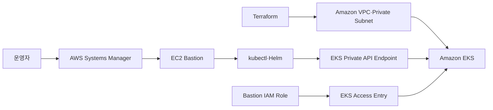
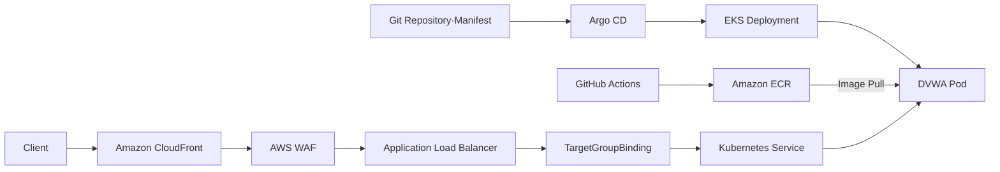
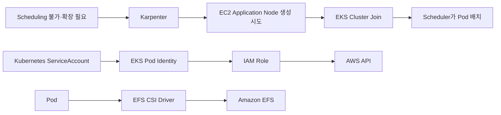
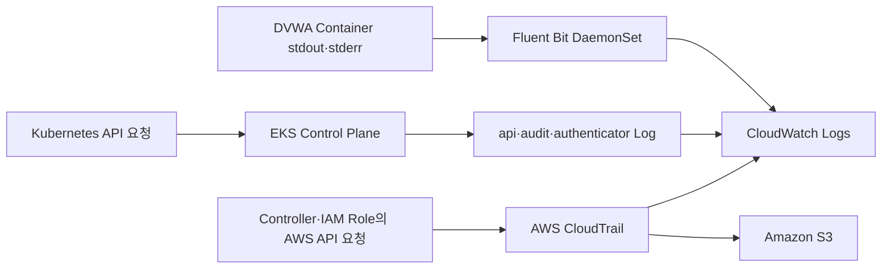

# Amazon EKS

## 한 줄 정의

Amazon EKS는 **AWS가 Kubernetes Control Plane을 운영하고, 사용자가 AWS 위에 Kubernetes 워크로드를 배포·관리하도록 제공하는 관리형 Kubernetes 서비스**다.

> [!summary] 이 노트의 범위
> 이 문서는 EKS 자체의 역할과 현재 프로젝트에서의 위치까지만 다룬다.  
> Karpenter, Pod Identity, AWS Load Balancer Controller, Argo CD, Fluent Bit의 상세 원리는 각 구성요소 노트에서 별도로 다룬다.

> [!important] Control Plane과 Data Plane
> 강의자료는 EKS를 `AWS가 Control Plane을 관리하고 사용자가 Data Plane을 관리하는 서비스`로 설명한다.  
> 이는 현재 프로젝트처럼 **EKS Standard + EC2 Node**를 사용하는 구성에 맞는 설명이다.  
> EKS Auto Mode는 Node까지 AWS 관리 범위를 확장하지만, 현재 프로젝트는 Auto Mode를 사용하지 않는다.

## 보편적·일반적인 역할

Kubernetes를 직접 구축하면 API Server, etcd, Scheduler, Controller Manager와 같은 Control Plane 구성요소의 설치, 고가용성, 업그레이드, 장애 복구를 직접 책임져야 한다.

EKS는 이 Control Plane을 AWS 관리 영역에서 운영하고, 사용자가 접근할 Kubernetes API Endpoint를 제공한다. 사용자는 `kubectl`, Helm, Argo CD 등의 도구로 API Server에 원하는 상태를 전달한다.

Pod가 실제로 실행될 Compute는 별도로 필요하다.

- EKS Managed Node Group
- Self-managed EC2 Node
- Karpenter가 생성하는 EC2 Node
- AWS Fargate
- EKS Auto Mode Node

현재 프로젝트에서는 다음 구성을 의도한다.

- **Managed Node Group**: System Workload 실행
- **Karpenter**: Application Workload용 Node를 동적으로 공급하도록 구성

> [!warning] 구성됨과 검증됨은 다르다
> Terraform과 설치 스크립트에 Karpenter 구성이 존재한다는 것은 확인됐다.  
> 수정된 `EC2NodeClass`와 `NodePool`이 실제 Runtime에서 정상 생성되고 Application Node를 공급했는지는 아직 재검증하지 않았다.

## 핵심 구성요소

### Control Plane

AWS가 관리하는 Kubernetes의 중앙 관리 영역이다.

- **API Server**: `kubectl`, Controller, Node가 Kubernetes API를 호출하는 진입점
- **etcd**: Kubernetes Object의 원하는 상태와 현재 상태를 저장
- **Scheduler**: 새 Pod를 어느 Node에 배치할지 결정
- **Controller Manager**: 실제 상태를 사용자가 선언한 원하는 상태에 맞춤

### Data Plane

Pod와 Container가 실제로 실행되는 영역이다.

- **Node**: EC2 Instance 등 실제 Compute
- **kubelet**: Node에서 Pod와 Container 상태를 관리
- **Container Runtime**: Container 실행
- **kube-proxy**: Kubernetes Service 통신에 필요한 네트워크 규칙 관리

### Cluster API Endpoint

사용자, Controller, Node가 Kubernetes API Server에 접근하는 주소다.

EKS Endpoint는 다음 방식으로 구성할 수 있다.

- Public
- Private
- Public + Private

현재 프로젝트는 다음과 같이 정의돼 있다.

```hcl
endpoint_private_access = true
endpoint_public_access  = false
```

> [!info] 현재 프로젝트의 Private Endpoint
> 인터넷에서 EKS API Endpoint로 직접 `kubectl` 요청을 보내는 구성은 아니다.  
> 현재 운영 경로는 SSM으로 접속한 Bastion에서 `kubectl`과 Helm을 실행하는 방식이다.

### EKS Add-on

Kubernetes 기본 기능이나 AWS 연동을 담당하는 운영 구성요소다.

현재 프로젝트에 정의된 주요 Add-on은 다음과 같다.

- **Amazon VPC CNI**: Pod Networking
- **CoreDNS**: Cluster 내부 DNS와 Service Discovery
- **kube-proxy**: Service Network 처리
- **EKS Pod Identity Agent**: Pod Identity Credential 전달 지원
- **AWS EFS CSI Driver**: EFS Volume 연결, EFS 사용 시 조건부 활성화

### 인증과 인가

EKS 접근에서는 AWS IAM과 Kubernetes 권한 체계를 구분해야 한다.

```text
AWS IAM Principal
→ EKS 인증
→ EKS Access Policy 또는 Kubernetes RBAC 인가
→ Kubernetes API 요청 허용·거부
```

강의자료는 `IAM + aws-auth ConfigMap → Kubernetes RBAC` 흐름을 설명한다. 현재 프로젝트는 Bastion IAM Role에 **EKS Access Entry**와 `AmazonEKSClusterAdminPolicy`를 연결하는 방식을 사용한다.

> [!note] 강의자료와 현재 프로젝트의 차이
> `aws-auth` ConfigMap은 기존 EKS 접근 방식이며 아직 사용할 수 있다.  
> 현재 프로젝트는 해당 방식 대신 EKS API에서 관리되는 Access Entry를 사용한다.

## 입력과 출력

### 입력

- Kubernetes Version
- VPC와 Private Subnet
- API Endpoint 공개 범위
- Cluster·Node Security Group
- IAM Role과 EKS Access Entry
- Managed Node Group 설정
- EKS Add-on 설정
- Kubernetes Manifest와 Helm Chart
- Deployment, Service, ConfigMap, Secret 등의 Kubernetes Object

### 출력

- Kubernetes API Endpoint
- AWS 관리형 Control Plane
- Cluster에 등록된 Node
- Node에 배치된 Pod와 Container
- Service, DNS, Volume 등의 Kubernetes Resource
- Cluster와 Workload의 상태 정보
- 활성화한 Control Plane Log
- Controller가 AWS API를 호출해 만드는 ALB 등의 연계 Resource

> [!note] 선언과 실행 결과
> Manifest를 Apply했다는 사실만으로 Pod가 정상 실행됐다고 볼 수는 없다.  
> Scheduling, Image Pull, IAM, Network, Volume, Probe 문제에 따라 `Pending`, `ImagePullBackOff`, `CrashLoopBackOff` 등의 상태가 발생할 수 있다.

## 우리 프로젝트에서의 역할

우리 프로젝트에서 EKS는 **BANK DVWA 애플리케이션과 Kubernetes 운영 구성요소를 실행하는 중심 Runtime Platform**이다.

### Primary Cluster

```text
Cluster: aws-topology-primary
Region: ap-northeast-2
Subnet: Primary VPC Private Subnet
API Endpoint: Private Only
```

저장소에서 다음 구성이 확인된다.

- `workload=system` Label을 가진 EKS Managed Node Group
- Karpenter Controller 및 Node 설정
- VPC CNI, CoreDNS, kube-proxy
- EKS Pod Identity Agent
- 조건부 EFS CSI Driver
- AWS Load Balancer Controller
- ExternalDNS
- Fluent Bit
- Argo CD

### DR Cluster

Runtime Profile에 따라 Tokyo Region의 DR Cluster를 조건부 생성하도록 정의돼 있다.

```text
Cluster: aws-topology-dr
Region: ap-northeast-1
생성 조건: enable_dr_runtime
```

현재 실행에서 DR Cluster가 실제 생성됐는지는 별도 확인이 필요하다.

### 접근 제어

```text
Bastion IAM Role
→ EKS Access Entry
→ AmazonEKSClusterAdminPolicy
→ Kubernetes API 관리 권한
```

Bastion Security Group에서 EKS Private API Endpoint의 TCP 443 접근을 허용하도록 구성돼 있다.

### Compute 분리

```text
Managed Node Group
└─ workload=system
   └─ Cluster 운영 Controller와 System Workload

Karpenter Node
└─ workload=application
   └─ DVWA 등 Application Workload를 배치하도록 설계
```

> [!warning] 현재 확인 수준
> System Managed Node Group은 Terraform 정의에서 확인했다.  
> Karpenter Application Node의 실제 생성 성공 여부는 아직 Runtime 재확인이 필요하다.

### Control Plane Log

현재 Terraform에는 다음 Log Type이 활성화돼 있다.

- `api`
- `audit`
- `authenticator`

현재 활성 목록에 없는 Log Type:

- `controllerManager`
- `scheduler`

Control Plane Log는 CloudWatch Logs로 전달된다. Kubernetes API 호출, 사용자·관리자 행위, IAM 인증 문제를 조사하는 데 사용할 수 있다.

> [!caution] 로그 부재의 해석
> EKS Control Plane Log 전달은 수분 정도 지연될 수 있고 Best Effort 방식이다.  
> 검색 결과에 Event가 없다는 사실만으로 해당 행위가 절대 없었다고 단정하면 안 된다.

## 다른 서비스와의 연결

### Cluster 생성과 관리 접근



관련 노트: [[01_Terraform과 State]], [[02_AWS IAM]], [[04_Amazon VPC]], [[06_Amazon EC2와 Bastion]], [[29_AWS Systems Manager]]

### Application 배포와 외부 요청



관련 노트: [[08_Elastic Load Balancing ALB]], [[12_AWS Load Balancer Controller]], [[14_Amazon ECR]], [[20_Amazon CloudFront]], [[21_AWS WAF]], [[31_Argo CD]]

### Compute 확장과 AWS Service 연동



관련 노트: [[10_Karpenter]], [[11_EKS Pod Identity]], [[17_Amazon EFS]]

### Log와 감사



관련 노트: [[18_Amazon S3]], [[24_Amazon CloudWatch]], [[25_AWS CloudTrail]], [[32_Fluent Bit]]

## 비용과 수명주기

### EKS Cluster 비용

EKS Standard Cluster의 시간당 요금은 Kubernetes Version Support Tier에 따라 달라진다.

| Support Tier | Cluster 시간당 요금 |
|---|---:|
| Standard Support | USD 0.10 |
| Extended Support | USD 0.60 |

Kubernetes Version은 EKS 출시 후 첫 14개월 동안 Standard Support를 받고, 이후 12개월 동안 Extended Support로 전환된다. Cluster에 Pod가 없어도 Cluster가 존재하는 동안 시간당 요금은 발생한다.

### 별도 발생 가능한 비용

- Managed Node Group과 Karpenter Node의 EC2
- Node의 EBS Volume
- NAT Gateway 또는 NAT Instance
- ALB
- CloudWatch Logs 수집·저장·조회
- EFS
- Data Transfer

### 우리 프로젝트의 수명주기

EKS는 Persistent Foundation이 아니라 Daily Runtime Terraform Root에 정의돼 있다.

```text
daily-up
→ EKS와 Runtime Resource 생성

daily-down
→ EKS와 Runtime Resource 제거 시도
```

ECR, Security Log Bucket, CloudTrail 등은 별도 Foundation에 유지되도록 분리돼 있다.

> [!question] 수명주기에서 아직 확인할 부분
> `daily-down` 이후 ALB, ENI, Security Group, EBS 등 EKS 연계 Resource가 실제로 모두 제거되는지는 Runtime 검증이 필요하다.

## 우리 저장소에서 찾을 곳

### Terraform

- `eks.tf`
  - Primary·DR EKS Cluster
  - Managed Node Group
  - EKS Add-on
  - Karpenter IAM·Helm 구성
- `cluster-controllers.tf`
  - AWS Load Balancer Controller
  - ExternalDNS
  - 각 Controller의 Pod Identity
- `cluster-addons-ssm.tf`
  - SSM을 통한 Add-on 설치
- `securitygroups.tf`
  - Bastion, Node, ALB 관련 통신 규칙
- `observability.tf`
  - EKS 및 Application Log 수집 연계
- `target-group-binding.tf`
  - ALB Target Group과 Kubernetes Service 연결

### Helm·Kubernetes

- `charts/karpenter-node-config/`
- `templates/install-cluster-addons.sh.tpl`
- `Unoh03/Uns-DVWA`의 Deployment·Service·Argo CD Manifest

### Script

- `daily-up.ps1`
- `daily-down.ps1`
- `daily-common.ps1`
- `templates/install-cluster-addons.sh.tpl`

### Query

- `observability/queries/cloudwatch/03_kubectl_exec_and_secret_access.cwli`
- EKS Control Plane Log Group: `/aws/eks/aws-topology-primary/cluster`

### Application

- `Unoh03/Uns-DVWA`
- DVWA Deployment·Service·Application Audit Log Code

## 직접 확인하는 방법

### AWS Console

```text
AWS Console
→ Amazon EKS
→ Clusters
→ aws-topology-primary
```

확인 위치:

- **Overview**: Cluster 상태, Kubernetes Version, API Endpoint
- **Compute**: Managed Node Group과 Node
- **Add-ons**: VPC CNI, CoreDNS, kube-proxy, Pod Identity Agent
- **Networking**: VPC, Subnet, Security Group, Endpoint 접근 방식
- **Access**: Access Entry와 연결 Policy
- **Observability**: Control Plane Logging

### AWS CLI

```bash
aws eks describe-cluster \
  --name aws-topology-primary \
  --region ap-northeast-2
```

```bash
aws eks list-nodegroups \
  --cluster-name aws-topology-primary \
  --region ap-northeast-2
```

```bash
aws eks list-addons \
  --cluster-name aws-topology-primary \
  --region ap-northeast-2
```

```bash
aws eks list-access-entries \
  --cluster-name aws-topology-primary \
  --region ap-northeast-2
```

> [!info] AWS CLI와 kubectl의 접근 차이
> `aws eks describe-cluster`는 AWS API를 조회하므로 적절한 IAM 권한과 AWS API 통신이 있으면 실행할 수 있다.  
> `kubectl`은 Private Kubernetes API Endpoint에 직접 연결해야 하므로 현재 구조에서는 Bastion 등 VPC 내부 접근 경로가 필요하다.

### Kubernetes

SSM Bastion에서 확인한다.

```bash
kubectl cluster-info
kubectl get nodes -o wide
kubectl get pods -A -o wide
kubectl get deployment,statefulset,daemonset -A
kubectl get events -A --sort-by=.metadata.creationTimestamp
kubectl get ec2nodeclass,nodepool
```

권한 확인:

```bash
kubectl auth can-i --list
```

### CloudWatch Logs

```text
/aws/eks/aws-topology-primary/cluster
```

확인 대상:

- Kubernetes API 호출
- `kubectl exec`
- Secret 접근
- IAM 인증 성공·실패
- API 요청 허용·거부

## 직접 확인한 결과

### 저장소에서 확인

- Primary와 DR EKS Cluster가 Terraform에 정의돼 있다.
- 두 Cluster 모두 Private Endpoint만 사용하도록 정의돼 있다.
- Bastion Role에 Cluster 범위의 EKS Access Policy를 연결한다.
- System Managed Node Group은 `workload=system` Label을 사용한다.
- Karpenter로 Application Node를 공급하도록 구성돼 있다.
- `api`, `audit`, `authenticator` Control Plane Log를 활성화한다.
- VPC CNI, CoreDNS, kube-proxy, Pod Identity Agent를 Add-on으로 구성한다.

### Runtime에서 확인

2026-08-04 `ssm-addons-output.txt`에서 다음 설치 실행이 확인됐다.

- `aws-topology-primary` Kubeconfig Context 구성
- Kubernetes API Endpoint 응답
- Karpenter Helm Release 설치 실행
- AWS for Fluent Bit 설치 실행
- AWS Load Balancer Controller 설치 실행
- ExternalDNS 설치 실행
- Argo CD 설치 실행

초기 `EC2NodeClass` 적용은 `kubernetes.io/cluster/` 패턴의 제한 Tag 때문에 실패했다.

> [!check] 수정 반영
> 해당 제한 Tag는 이후 Template에서 제거됐다.

> [!warning] 아직 Runtime 성공으로 볼 수 없는 부분
> 수정된 `EC2NodeClass`와 `NodePool`이 정상 적용됐는지, Karpenter Node가 생성됐는지는 다시 확인해야 한다.

### 아직 확인하지 못함

- 현재 AWS 계정의 Cluster 존재 여부와 상태
- 실제 Kubernetes Version과 Support Tier
- 전체 Node·Pod의 `Ready` 상태
- Karpenter Application Node 생성 성공 여부
- DR Cluster 실제 생성 여부
- Control Plane Log의 현재 수집 상태
- `daily-down` 이후 종속 Resource 정리 상태

## 이 구성요소가 알려주는 것과 한계

### 확인할 수 있는 것

- Cluster 상태
- Cluster에 등록된 Node
- Pod 배치 위치와 상태
- Deployment Replica 상태
- Scheduling 실패 원인
- Kubernetes API에서 수행된 Resource 접근
- IAM 인증 성공·실패
- Add-on과 Controller의 실행 상태

### 이것만으로는 확인할 수 없는 것

- WAF Rule과 일치한 HTTP 요청
- ALB의 Client 요청과 Target 처리 결과
- DVWA 로그인·SQL Injection의 실제 성공 여부
- AWS IAM·Security Group 변경 주체
- Network Packet Payload
- VPC 연결의 전체 ACCEPT·REJECT 내역
- Application 내부의 업무 의미

```text
EKS 상태·Audit Log
+ Application Audit Log
+ WAF Log
+ ALB Access Log
+ CloudTrail
+ VPC Flow Log
→ 사건의 전체 흐름에 가까워짐
```

## 아직 모르는 것

- [ ] 현재 `kubernetes_version`의 실제 값과 Support Tier
- [ ] EKS Control Plane과 Worker Node 통신용 ENI의 구체적 역할
- [ ] `api`, `audit`, `authenticator` Log의 실제 구조 차이
- [ ] `controllerManager`, `scheduler` Log를 활성화하지 않은 이유
- [ ] Access Policy와 Kubernetes RBAC가 함께 적용될 때의 권한 계산
- [ ] Managed Node Group과 Karpenter Node의 Scheduling 분리 방식
- [ ] Pod Identity Agent의 Credential 전달 과정
- [ ] VPC CNI의 ENI·Secondary IP와 최대 Pod 수 관계
- [ ] EKS Version Upgrade와 Add-on Version 호환성
- [ ] Cluster 삭제 시 종속 Resource가 남는 조건

## 학습 완료 기준

- [ ] EKS와 일반 Kubernetes의 관계를 설명할 수 있다.
- [ ] Control Plane과 Data Plane을 구분할 수 있다.
- [ ] 현재 프로젝트의 EKS Terraform 위치를 찾을 수 있다.
- [ ] Managed Node Group과 Karpenter Node의 역할을 구분할 수 있다.
- [ ] EKS Control Plane Log와 Pod Application Log를 구분할 수 있다.
- [ ] AWS CLI와 `kubectl`의 접근 경로 차이를 설명할 수 있다.
- [ ] 실제 Cluster, Node, Pod, Add-on 상태를 직접 조회할 수 있다.

## 근거

### 강의자료

- `Kubernetes.pdf`
  - EKS 개요와 Architecture
  - VPC CNI와 Security Group
  - IAM 인증과 Kubernetes RBAC
  - Ingress와 AWS Load Balancer Controller
  - DaemonSet와 Fluentd
  - Auto Scaling과 Karpenter

### 공식 문서

- [What is Amazon EKS?](https://docs.aws.amazon.com/eks/latest/userguide/)
- [EKS control plane architecture](https://docs.aws.amazon.com/eks/latest/best-practices/control-plane.html)
- [EKS cluster endpoint access](https://docs.aws.amazon.com/eks/latest/userguide/cluster-endpoint.html)
- [EKS access entries](https://docs.aws.amazon.com/eks/latest/userguide/access-entries.html)
- [EKS control plane logging](https://docs.aws.amazon.com/eks/latest/userguide/control-plane-logs.html)
- [Amazon EKS pricing](https://aws.amazon.com/eks/pricing/)

### 현재 저장소

- `bank-security-lab-infra/eks.tf`
- `bank-security-lab-infra/cluster-controllers.tf`
- `bank-security-lab-infra/templates/install-cluster-addons.sh.tpl`
- `bank-security-lab-infra/observability.tf`
- `bank-security-lab-infra/ssm-addons-output.txt`

### Runtime Evidence

- `ssm-addons-output.txt`
- 2026-08-04 Add-on 설치 출력과 초기 `EC2NodeClass` 제한 Tag 오류
