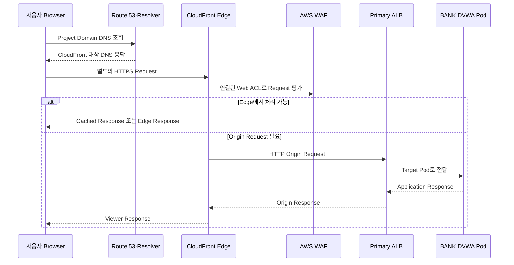

# Amazon CloudFront

> [!abstract]- 프로젝트 로그·관측성 MOC
> ![[00_로그 인프라 전체 흐름#전체 흐름]]

> [!summary] 이번 노트의 범위
> 전체 지도에서 아래 구간을 본다.
>
> ```text
> 외부 사용자·공격자·실습자
> → DNS 조회
> → Route 53의 응답
> → 별도의 HTTPS Request
> → CloudFront + AWS WAF
> → 필요할 때 Primary ALB Origin
> ```
>
> 핵심은 **Route 53은 목적지를 알려주고, CloudFront는 실제 HTTP·HTTPS Request를 처음 받는다**는 것이다.

## 한 줄 정의

Amazon CloudFront는 전 세계 Edge Location에서 사용자의 HTTP·HTTPS Request를 받아, TLS·WAF·Cache·전달 정책을 적용한 뒤 필요하면 Origin으로 전달하는 CDN Service다.

우리 프로젝트에서는 외부 Request를 처음 처리하는 **Edge 진입점**이며, Origin은 Primary ALB다.

## Route 53과 CloudFront의 차이

가장 단순한 정신 모델은 다음과 같다.

```text
Route 53   = 목적지 주소를 알려주는 길잡이·주소록
CloudFront = 그 주소에서 실제 손님을 맞는 전면 접수대
```

두 서비스는 같은 통신을 이어서 전달하지 않는다.

```text
1. DNS Query
Browser·Resolver ↔ Route 53

2. 별도의 HTTPS Request
Browser ↔ CloudFront
```

따라서:

- Route 53 장애: Domain을 CloudFront Endpoint로 해석하지 못할 수 있다.
- CloudFront 장애·정책 문제: DNS는 성공해도 HTTPS Request가 실패할 수 있다.

## 왜 CloudFront가 필요한가

CloudFront가 없다면 외부 사용자가 Internet-facing ALB로 직접 접속하는 구조를 만들 수 있다.

```text
사용자 → ALB → EKS
```

하지만 이 경우 외부 Request를 전 세계 Edge에서 먼저 처리하는 계층이 없다.

CloudFront를 앞에 두면 다음 역할을 한 지점에 모을 수 있다.

- 사용자와 가까운 Edge에서 Request 수신
- HTTPS와 Certificate 적용
- HTTP → HTTPS Redirect 같은 Viewer 정책 적용
- AWS WAF를 Distribution에 연결해 Request 검사
- Cache 가능한 Response를 Edge에서 재사용
- Origin인 ALB 주소를 사용자에게 직접 노출하지 않는 전면 Endpoint 제공
- Edge 관점의 Access Log 생성

> [!note] Origin 은 무엇인가
> CloudFront가 필요한 Content나 Response를 가져오는 뒤쪽 원본 Server를 뜻한다.  
> 현재 프로젝트의 Origin은 `Primary ALB`다.

## 실제 요청 흐름



이 그림에서 중요한 점은 두 가지다.

1. CloudFront는 실제 Request를 받는 Data Path 구성요소다.
2. 모든 Request가 반드시 ALB까지 도달하는 것은 아니다.

## Cache Hit와 Origin Request

CloudFront는 CDN이므로 Cache 가능한 Response를 Edge에 저장할 수 있다.

### Cache Hit

```text
사용자 → CloudFront
CloudFront → 저장된 Response 반환
```

이 경우 해당 Request를 처리하기 위해 ALB·EKS까지 가지 않을 수 있다.

### Cache Miss 또는 Origin 처리가 필요한 Request

```text
사용자 → CloudFront → ALB → EKS·DVWA
```

POST·PUT처럼 Cache 대상이 아닌 Method나, Edge에 사용할 Response가 없는 Request는 Origin 처리가 필요하다.

> [!warning] 현재 프로젝트의 실제 Cache 동작
> Terraform Source에는 `cached_methods = ["GET", "HEAD", "OPTIONS"]`가 있다.  
> 그러나 어떤 URI가 실제로 Cache되는지, Origin Response Header와 TTL이 무엇인지는 최신 Runtime에서 별도로 확인해야 한다. Source만 보고 모든 GET Request가 Cache된다고 단정하지 않는다.

## AWS WAF와의 관계

현재 프로젝트에서는 WAF Web ACL이 CloudFront Distribution의 `web_acl_id`에 연결된다.

```text
CloudFront Distribution
└─ 연결된 AWS WAF Web ACL
```

따라서 WAF를 CloudFront 뒤에 놓인 독립 Server처럼 이해하면 안 된다.

```text
부정확한 이해
CloudFront Server → WAF Server → ALB

더 정확한 이해
CloudFront Edge 경계에서 연결된 WAF 정책으로 Viewer Request 평가
→ 허용된 Request만 이후 처리
```

현재 WAF의 세부 Rule과 Log는 [[21_AWS WAF]]에서 다룬다.

## Viewer 연결과 Origin 연결

CloudFront를 기준으로 연결은 두 구간으로 나뉜다.

### Viewer → CloudFront

```text
사용자 Browser → CloudFront Edge
```

- 사용자는 Project Domain으로 접속한다.
- Custom Domain을 사용할 때 CloudFront는 ACM Certificate를 사용한다.
- `enable_https_redirect`가 활성화되면 HTTP Request를 HTTPS로 Redirect한다.

### CloudFront → Origin ALB

```text
CloudFront Edge → Primary ALB
```

현재 Source의 `origin_protocol_policy`는 `http-only`다.

즉 현재 프로젝트에서는:

```text
사용자 → CloudFront : HTTPS 가능·권장
CloudFront → ALB     : HTTP 80
```

이다.

> [!important] HTTPS가 한 번에 끝까지 이어지는 것은 아니다
> Viewer TLS Session은 CloudFront에서 종료된다. 이후 CloudFront가 별도의 Origin Connection으로 ALB에 Request를 보낸다. 현재 구성은 Origin 구간을 HTTP로 사용한다.

## 핵심 구성요소

| 구성요소 | 역할 | 현재 프로젝트 |
|---|---|---|
| Distribution | CloudFront 전체 배포 단위 | `aws_cloudfront_distribution.this` |
| Alternate Domain Name | CloudFront 기본 Domain 대신 사용할 Project Domain | `aliases = [local.domain_name]` |
| Origin | 뒤쪽 원본 Server | Primary ALB DNS Name |
| Cache Behavior | Method·Protocol·Cache·Forwarding 정책 | `default_cache_behavior` |
| Viewer Certificate | 사용자와 CloudFront 간 TLS Certificate | Custom Domain 사용 시 ACM Certificate |
| Web ACL Association | Viewer Request에 적용할 WAF | `web_acl_id` |
| Access Log Delivery | Edge Access Log 보존 | Standard Logging v2 → Security Log S3 |

## 입력과 출력

### 입력

- 사용자의 HTTP·HTTPS Request
- Host·URI·Method·Query String·Cookie 등 Request 정보
- Distribution의 Cache·Viewer Protocol·Origin 정책
- 연결된 WAF Web ACL의 평가 결과

### 출력

상황에 따라 다음 중 하나가 된다.

- HTTPS Redirect Response
- WAF Block Response
- Edge에 Cache된 Response
- ALB로 전달할 Origin Request
- Origin에서 받은 Response의 Viewer 전달
- CloudFront Access Log

## 우리 프로젝트에서의 역할

현재 `edge.tf`에서 확인되는 구성은 다음과 같다.

```text
Project Domain
→ Route 53 A Alias
→ CloudFront Distribution
→ Primary ALB Origin
```

### Distribution·Origin

```hcl
resource "aws_cloudfront_distribution" "this" {
  aliases    = local.domain_name == "" ? [] : [local.domain_name]
  web_acl_id = var.enable_waf_observation ? aws_wafv2_web_acl.edge[0].arn : null

  origin {
    domain_name = aws_lb.primary.dns_name
    origin_id   = "primary-alb"

    custom_origin_config {
      http_port              = 80
      origin_protocol_policy = "http-only"
    }
  }
}
```

해석:

- Custom Domain이 있으면 CloudFront Alternate Domain으로 등록한다.
- WAF 관측 기능이 활성화되면 Web ACL을 Distribution에 연결한다.
- Origin은 Primary ALB다.
- CloudFront가 ALB에 연결할 때는 HTTP 80을 사용한다.

### Default Cache Behavior

현재 Source에서 확인되는 핵심은 다음과 같다.

- 허용 Method: `DELETE`, `GET`, `HEAD`, `OPTIONS`, `PATCH`, `POST`, `PUT`
- Cache 대상 Method: `GET`, `HEAD`, `OPTIONS`
- Query String: Origin으로 전달
- Cookie: 전부 Origin으로 전달
- Compression: 활성화
- Viewer Protocol: HTTPS Redirect 또는 HTTP 허용을 변수로 제어

이 설정은 교육용 취약 Web Application의 다양한 Method·Query·Session을 CloudFront 뒤에서도 전달하기 위한 구성이다.

> [!warning] 전달과 Log 기록은 별개다
> Query String과 Cookie를 Origin으로 전달하더라도 CloudFront Access Log에 반드시 기록해야 하는 것은 아니다.  
> 현재 Logging 구성은 민감정보 노출을 줄이기 위해 Cookie·Query String Field를 선택 목록에서 제외한다.

## 로그 관점의 역할

CloudFront Access Log는 **Edge가 Viewer Request를 어떻게 보았는지** 기록한다.

주로 확인할 수 있는 것:

- Request 날짜·시각
- 처리한 Edge Location
- Client IP·국가
- HTTP Method·Host·URI Path
- Response Status
- `x-edge-request-id`
- 전송 Byte와 처리 시간
- TLS Protocol·Cipher
- Edge Response Result Type

확인하기 어려운 것:

- ALB가 어느 Target Pod로 전달했는지
- DVWA Login이 의미상 성공했는지
- RDS에서 어떤 SQL이 실행됐는지
- WAF의 어떤 세부 Rule이 Match했는지

마지막 항목은 별도의 WAF Log에서 확인한다.

## 저장·분석 흐름

현재 `observability.tf`에서 확인되는 흐름은 다음과 같다.

```text
CloudFront Access Log
→ CloudWatch Log Delivery v2
→ Foundation Security Log S3
→ AWSLogs/<account>/CloudFront/
→ Athena Table cloudfront_access
→ cloudfront-trace Query
→ Grafana 예정
```

선택된 주요 Record Field:

```text
date, time, x-edge-location, sc-bytes, c-ip, cs-method, cs(Host),
cs-uri-stem, sc-status, x-edge-request-id, x-host-header, cs-protocol,
cs-bytes, time-taken, x-forwarded-for, ssl-protocol, ssl-cipher,
x-edge-response-result-type, c-country
```

Cookie와 Query String Field는 의도적으로 포함하지 않는다.

## 직접 확인하는 방법

### DNS와 HTTPS 경계 확인

```powershell
Resolve-DnsName <PROJECT_DOMAIN>
curl.exe -I https://<PROJECT_DOMAIN>
```

- DNS 실패: Route 53·Domain·Resolver 계층부터 확인
- DNS 성공, HTTPS 실패: CloudFront·Certificate·WAF·Origin 계층 확인

### Distribution 확인

```powershell
aws cloudfront list-distributions
aws cloudfront get-distribution --id <DISTRIBUTION_ID>
```

확인할 값:

- `Aliases.Items`
- `Origins.Items`
- `DefaultCacheBehavior.ViewerProtocolPolicy`
- `WebACLId`
- `ViewerCertificate`

### Cache 동작 단서 확인

```powershell
curl.exe -I https://<PROJECT_DOMAIN>/<PATH>
```

반복 호출하면서 CloudFront 관련 Response Header와 Age·Cache 상태를 비교한다. 실제 Header 이름과 결과는 Runtime에서 기록한다.

### Log Delivery 확인

```powershell
aws logs describe-delivery-sources --region us-east-1
aws logs describe-deliveries --region us-east-1

aws s3api list-objects-v2 `
  --bucket <SECURITY_LOG_BUCKET> `
  --prefix AWSLogs/<ACCOUNT_ID>/CloudFront/ `
  --max-items 10
```

## 현재 확인 수준

| 항목 | 수준 |
|---|---|
| Distribution·Primary ALB Origin | Terraform Source 확인 |
| Route 53 Alias·Custom Domain 연결 | Terraform Source 확인 |
| WAF Association | Terraform Source 확인 |
| Viewer Protocol·Method·Forwarding 정책 | Terraform Source 확인 |
| Standard Logging v2·Record Field | Terraform Source 확인 |
| Athena Schema·Trace Query | Repository 확인 |
| 최신 Cache Hit·Miss | Runtime 재확인 필요 |
| 최신 S3 Log Object 도착 | Runtime 재확인 필요 |
| CloudFront → ALB → DVWA Request 상관관계 | Runtime 재확인 필요 |

## 이 구성요소가 알려주는 것과 한계

### CloudFront가 알려주는 것

- 어떤 Viewer가 어떤 URI를 요청했는가
- 어느 Edge에서 처리했는가
- Edge가 어떤 Status와 처리 결과를 반환했는가
- TLS·전송·처리 시간 관점에서 어떤 Request였는가

### CloudFront만으로는 알 수 없는 것

- Application 내부 인증·인가 결과
- Pod·Container 내부 Event
- Database Query 의미
- AWS API 변경 행위
- Kubernetes API 행위

CloudFront는 **외부 Web Request의 첫 HTTP 관측 지점**이지, 전체 System을 모두 보는 통합 감사 Log가 아니다.

## 지금 단계에서 반드시 기억할 것

1. Route 53은 목적지를 알려주고, CloudFront가 실제 HTTPS Request를 받는다.
2. CloudFront는 사용자와 Origin 사이의 Edge 진입점이다.
3. Cache Hit면 ALB까지 가지 않을 수 있다.
4. WAF는 별도 중간 Server가 아니라 CloudFront Distribution에 연결된 Request 검사 정책이다.
5. 우리 프로젝트의 Origin은 Primary ALB이며, CloudFront → ALB 구간은 현재 HTTP다.
6. CloudFront Access Log는 Edge 관점 기록이고 Application Audit Log는 아니다.

## 확인 문제

1. Route 53과 CloudFront 중 실제 HTTPS Request를 먼저 받는 서비스는 무엇인가?
2. Cache Hit가 발생하면 ALB와 DVWA까지 Request가 도달하는가?
3. WAF를 CloudFront 다음의 별도 Proxy Server라고 표현하면 왜 부정확한가?
4. 현재 프로젝트에서 CloudFront의 Origin은 무엇인가?
5. CloudFront Access Log만 보고 DVWA Login 성공 여부를 확정할 수 있는가?

## 다음 단계

다음 노트는 [[21_AWS WAF]]다.

```text
외부 HTTPS Request
→ CloudFront Edge
→ 연결된 AWS WAF Web ACL 평가
→ 허용되면 Cache·Origin 처리
```

## 근거

### 현재 저장소

- `edge.tf`: Distribution, Alias, WAF Association, Primary ALB Origin, Cache Behavior, Viewer Certificate
- `observability.tf`: CloudFront Standard Logging v2, S3 Delivery, Record Field
- `foundation/edge.tf`: ACM Certificate와 Route 53 DNS Validation
- `foundation/observability.tf`: Persistent Security Log S3 Delivery Destination
- `observability/queries/athena/00_create_security_log_tables.sql`
- `observability/queries/athena/03_cloudfront_request_trace.sql`

### Runtime Evidence

- 기존 Evidence에 CloudFront Athena Query 성공 기록이 있음
- 2026-08-06 현재 최신 Runtime Cache·Object Delivery·Request Correlation은 재확인 필요
